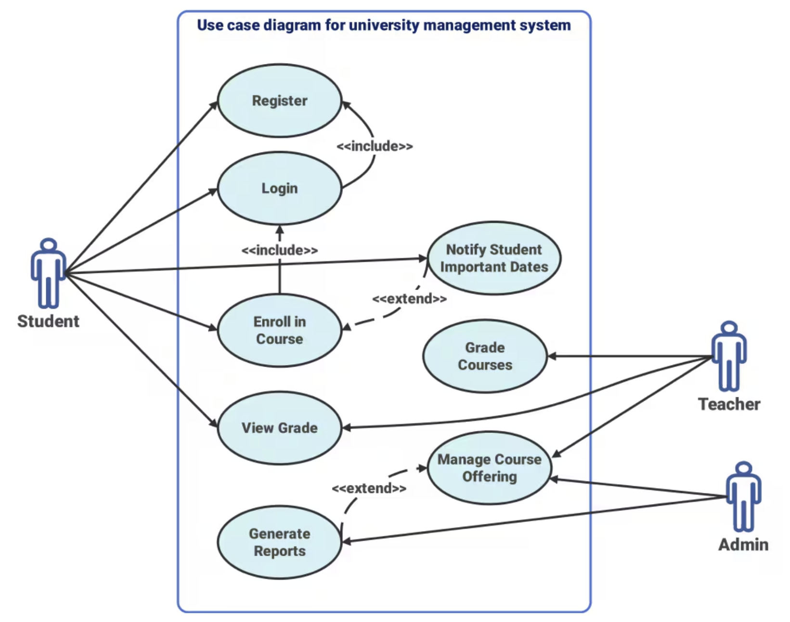
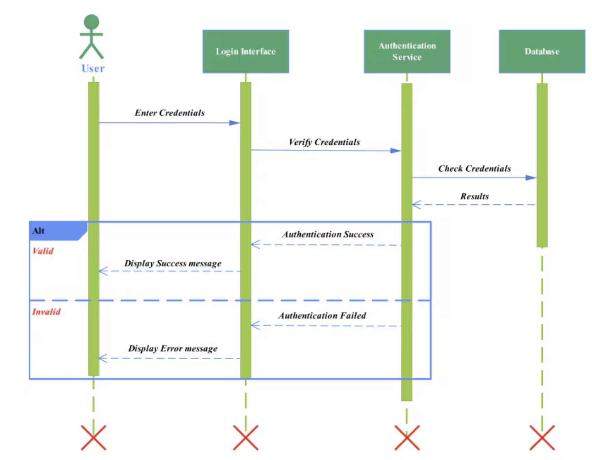

::: notes
Welcome students and explain that today marks a new phase: understanding *how to capture what the system should do* (requirements) and represent those needs with *UML behavioral diagrams*.
:::

---

# Agenda

1. What are requirements?
2. Scenarios and use cases
3. UML Use Case Diagrams
4. **Interactive Exercise 1:** Identify actors and use cases
5. Break (10 minutes)
6. UML Sequence Diagrams
7. **Interactive Exercise 2:** Model an interaction
8. Wrap-up and discussion

::: notes
Outline how the class transitions from informal descriptions of user needs to formal interaction models.
:::

---

# What Are Requirements?

- **Definition:** Descriptions of what the system must do and under what constraints.
- **Purpose:** Ensure all stakeholders share a common understanding of the system.
- **Main types:**
  - **Functional requirements:** what the system should *do*
  - **Non-functional requirements:** how the system should *be*
  - **Domain requirements:** external or business rules

**Example:**

> The system shall allow registered students to submit assignments online.

::: notes
Introduce requirements as the foundation for all later modeling. Emphasize clarity and verifiability.
:::

---

# Why Requirements Matter

- Guide design and development
- Prevent misunderstandings between stakeholders
- Support validation and testing
- Serve as the basis for modeling and documentation

**Without good requirements:** models and implementations diverge from real needs.

::: notes
Share a short story or example of a failed system due to unclear requirements.
:::

---

# From Requirements to Scenarios

- **Scenarios** = stories about how users interact with the system
- Each scenario focuses on one **goal** or **task**
- Scenarios help identify **actors** and **use cases**

**Example Scenario:**

> A student logs into the portal, views enrolled courses, and submits a project file.

::: notes
Explain how scenarios make requirements tangible and lead naturally to use case identification.
:::

---

# Use Cases

- A **use case** is a description of a system’s behavior as it responds to a request from an actor.
- **Actors:** users or systems interacting with ours
- **System boundary:** separates internal from external elements

**Notation:** ovals (use cases), stick figures (actors), box (system boundary)

::: notes
Show an example diagram (e.g., Student interacting with Course Management System for Register, View Grades, Submit Assignment).
:::

---

# Example

---

# Relationships Between Use Cases

- **Include:** mandatory reusable functionality
- **Extend:** optional or conditional behavior
- **Generalization:** specialization of an actor or use case

**Example:**
- `Register` includes `Login`
- `Notify of Important Dates` extends `Enroll in Course`

::: notes
Show small visual examples of each relationship type.
:::

---

# Interactive Exercise 1: Identify Actors and Use Cases

**Scenario:** A university online examination system.

Students can register for exams, view schedules, and submit answers online. Professors can create exams, publish grades, and review submissions. The system authenticates all users.

**Tasks:**
1. Identify at least 3 actors.
2. Define 5–7 use cases.
3. Sketch a use case diagram.

::: notes
Give students ~15 minutes in groups, then discuss different actor boundaries and use cases.
:::

---

# UML Sequence Diagrams

- Describe **how** objects interact to perform a use case
- Focus on **message order** and **lifelines** over time

**Elements:**
- **Actor / object lifelines**
- **Messages** (synchronous, asynchronous, return)
- **Activation bars** (execution time)

**Why:** Visualize the sequence of interactions that fulfill a use case.

::: notes
Explain how sequence diagrams complement use case diagrams by adding time and structure.
:::

---

# Example Sequence Diagram

**Scenario:** “User logs into the system”

Actors and objects:
- `User`
- `LoginPage`
- `AuthService`
- `Database`

**Steps:**
1. User enters credentials → LoginPage
2. LoginPage sends request → AuthService
3. AuthService validates → Database
4. Database returns result
5. AuthService responds with success/failure

::: notes
Show the diagram visually. Point out how control flows and what each lifeline represents.
:::

---

# Example

---

# Interactive Exercise 2: Model an Interaction

**Scenario:** "Customer places an order in an online shop."

Actors and objects:
- `Customer`
- `WebApp`
- `OrderService`
- `PaymentGateway`
- `Database`

**Tasks:**
1. Identify the main sequence of messages.
2. Draw a sequence diagram (lifelines, messages, returns).
3. Include one alternative path (e.g., payment failure).

::: notes
Allow ~15 minutes for group work, then have one group present. Discuss message flow and alternate paths.
:::

---

# Wrap-Up

**Key Takeaways:**
- Requirements describe *what* the system must do.
- Scenarios make requirements concrete.
- Use case diagrams capture system functionality and boundaries.
- Sequence diagrams model detailed interactions.

**Next Lecture:** Some design patterns

::: notes
Encourage students to start drafting use cases for their project ideas. Suggest reviewing examples in the course repo.
:::
