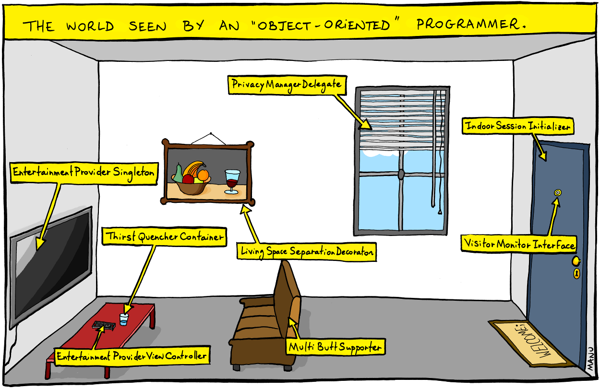

# Agenda

#. What are Design Patterns?
#. Classification of Patterns
#. Patterns
   #. **Iterator**
   #. **Builder**
   #. **Singleton**
   #. **Observer**
   #. **Factory Method**
   #. **State**
#. Wrap-up


::: notes
Introduce the topic as a bridge between object-oriented modeling and practical software design. Emphasize how patterns capture reusable solutions to recurring design problems.
Walk through the plan and highlight that future lectures will explore many more patterns in detail.
:::

---

:::::::::::::: {.columns}
::: {.column width="50%"}
[](https://goomics.net/img/2011-11-15_life_of_a_swe.png)
:::
::: {.column width="50%"}
:::
::::::::::::::


---

:::::::::::::: {.columns}
::: {.column width="50%"}
[](https://goomics.net/img/2011-11-15_life_of_a_swe.png)
:::
::: {.column width="50%"}
[](https://goomics.net/img/2011-11-15_life_of_a_swe.png)
:::
::::::::::::::

---


# What Are Design Patterns?

## Definition

Reusable solutions to common software design problems.

## Origin

Popularized by the “Gang of Four” (Gamma, Helm, Johnson, Vlissides, 1994).

## Purpose

- Provide shared vocabulary
- Improve code maintainability
- Promote reusability and clarity

## Example

Instead of reinventing how to traverse a collection, we apply the **Iterator** pattern.

::: notes
Stress that patterns aren’t code snippets — they’re design blueprints that can be adapted to many situations.
:::

---

# Pattern Classification

Design patterns are typically grouped into three main categories:

------------------------------------------------------------------------------------------
Category         Description                            Example Patterns                  
--------------   ------------------------------------   ----------------------------------
**Creational**   How objects are created                Singleton, Builder, Factory Method

**Structural**   How classes and objects are composed   Adapter, Bridge, Decorator        

**Behavioral**   How objects interact and communicate   Iterator, Observer, State         
------------------------------------------------------------------------------------------

::: notes
Briefly define each group. Mention that this lecture mixes examples from creational and behavioral patterns.
:::

---

[{width=100%}](https://goomics.net/78)

---

# Iterator Pattern

## Type

Behavioral pattern

## Intent

Provide a way to access elements of a collection sequentially without exposing its internal structure.

## Problem Solved

How to traverse a collection (e.g., list, tree, array) without knowing its implementation?

## Solution

Define an `Iterator` interface with methods like `hasNext()` and `next()`.

---

# Iterator Pattern code example

[Source file](https://github.com/traiansf/traiansf.github.io/blob/main/class/amss2025/curs/code/IteratorPatternDemo.java)

```java
// Step 1: Create the Iterator interface
interface Iterator {
    boolean hasNext();
    Object next();
}

// Step 2: Create the Container interface
interface Container {
    Iterator getIterator();
}

// Step 3: Create a concrete class implementing Container
class NameRepository implements Container {
    private String[] names = {"Alice", "Bob", "Charlie", "Diana"};

    @Override
    public Iterator getIterator() {
        return new NameIterator();
    }

    // Inner class implementing the Iterator interface
    private class NameIterator implements Iterator {
        int index;

        @Override
        public boolean hasNext() {
            return index < names.length;
        }

        @Override
        public Object next() {
            if (this.hasNext()) {
                return names[index++];
            }
            return null;
        }
    }
}

// Step 4: Use the iterator
public class IteratorPatternDemo {
    public static void main(String[] args) {
        NameRepository namesRepo = new NameRepository();

        for (Iterator iter = namesRepo.getIterator(); iter.hasNext();) {
            String name = (String) iter.next();
            System.out.println("Name: " + name);
        }
    }
}
```

# Iterator Pattern Exercise

## Exercise

Modify 3 lines in the example above to make the iterator a reverse iterator.

## Question

> How does this custom Iterator differ from Java’s built-in `java.util.Iterator`, and when might you still implement your own?

::: notes
Learning outcome: the iterator decouples traversal from storage.

Learning outcome:
One collection can have multiple iterator strategies
:::

---

# Builder Pattern

## Type

Creational pattern

## Intent

Separate the construction of a complex object from its representation, so the same construction process can create different representations.

## Problem Solved

How can we construct complex objects step by step while keeping the construction logic separate from the representation?

## Solution

Use a *Builder* class to encapsulate object creation in multiple steps.

# Builder Pattern (concrete example)

Design a Computer class that represents a configurable computer system.
The goal is to let users “build” a computer step-by-step, choosing which components to include.
A computer may include:

- CPU (e.g., “Intel i9”, “AMD Ryzen 7”)

- GPU (e.g., “NVIDIA RTX 4090”, “AMD Radeon RX 7800”)

- RAM (in GB)

- Storage (in GB)

You should be able to build objects fluently, like this:

```java
Computer gamingPC = new Computer.Builder()
        .setCPU("Intel i9")
        .setGPU("NVIDIA RTX 4090")
        .setRAM(32)
        .setStorage(2000)
        .build();
System.out.println(gamingPC);
```

# Builder Pattern (concrete example solution)

[Source file](https://github.com/traiansf/traiansf.github.io/blob/main/class/amss2025/curs/code/BuilderPatternDemo.java)

```java
// Product class
class Computer {
    private String CPU;
    private String GPU;
    private int RAM;
    private int storage;

    // Private constructor — use Builder instead
    private Computer(Builder builder) {
        this.CPU = builder.CPU;
        this.GPU = builder.GPU;
        this.RAM = builder.RAM;
        this.storage = builder.storage;
    }

    @Override
    public String toString() {
        return "Computer [CPU=" + CPU + ", GPU=" + GPU + ", RAM=" + RAM + "GB, Storage=" + storage + "GB]";
    }

    // Static nested Builder class
    public static class Builder {
        private String CPU;
        private String GPU;
        private int RAM;
        private int storage;

        public Builder setCPU(String CPU) {
            this.CPU = CPU;
            return this;
        }

        public Builder setGPU(String GPU) {
            this.GPU = GPU;
            return this;
        }

        public Builder setRAM(int RAM) {
            this.RAM = RAM;
            return this;
        }

        public Builder setStorage(int storage) {
            this.storage = storage;
            return this;
        }

        public Computer build() {
            return new Computer(this);
        }
    }
}

// Demo class
public class BuilderPatternDemo {
    public static void main(String[] args) {
        Computer gamingPC = new Computer.Builder()
                .setCPU("Intel i9")
                .setGPU("NVIDIA RTX 4090")
                .setRAM(32)
                .setStorage(2000)
                .build();

        System.out.println(gamingPC);
    }
}
```

# Bulder Pattern exercise

Design a Pizza class that represents a customizable pizza order, using the Builder Pattern.
Your pizza should have:

- A size (e.g., Small, Medium, Large)

- A crust type (e.g., Thin, Thick, Stuffed)

- A list of toppings (e.g., Cheese, Pepperoni, Mushrooms)

- A flag for extra cheese

The goal is to make object creation flexible and readable, like this:

```java
Pizza pizza = new Pizza.Builder()
        .setSize("Large")
        .setCrust("Stuffed")
        .addTopping("Pepperoni")
        .addTopping("Mushrooms")
        .setExtraCheese(true)
        .build();
System.out.println(pizza);
```

---

# Singleton Pattern

## Type

Creational pattern

## Intent

Ensure a class has only one instance, and provide a global point of access to it.

## Problem Solved

How can we make sure there is exactly one instance of a class used throughout a system?

## Solution

- Make the constructor private
- Store a static instance reference
- Provide a static accessor

# Singleton Pattern (concrete example)

Implement a `DatabaseConnection` class that simulates a single, shared connection to a database.

The program should ensure that:

- Only one instance of the connection is ever created.

- Any part of the program that requests a connection gets the same instance.

## Example use

```java
DatabaseConnection conn1 = DatabaseConnection.getInstance();
DatabaseConnection conn2 = DatabaseConnection.getInstance();

conn1.query("SELECT * FROM users");

System.out.println(conn1 == conn2); // should print true
```

# Singleton Pattern (concrete example solution)

[Source file](https://github.com/traiansf/traiansf.github.io/blob/main/class/amss2025/curs/code/SingletonPatternDemo.java)

```java
// Singleton class
class DatabaseConnection {
    // Step 1: Create a private static instance of the class
    private static DatabaseConnection instance;

    // Step 2: Make the constructor private to prevent instantiation
    private DatabaseConnection() {
        System.out.println("Connecting to the database...");
    }

    // Step 3: Provide a public static method to get the single instance
    public static DatabaseConnection getInstance() {
        if (instance == null) {
            instance = new DatabaseConnection();
        }
        return instance;
    }

    // Example method
    public void query(String sql) {
        System.out.println("Executing query: " + sql);
    }
}

// Demo class
public class SingletonDemo {
    public static void main(String[] args) {
        DatabaseConnection conn1 = DatabaseConnection.getInstance();
        DatabaseConnection conn2 = DatabaseConnection.getInstance();

        conn1.query("SELECT * FROM users");

        // Show that both references point to the same object
        System.out.println(conn1 == conn2); // true
    }
}
```

---

# Singleton Pattern exercise

Implement a `Logger` for a simple application.
Only one instance of this class should ever exist, and all parts of the program should share it.

## Example use

```java
Logger logger1 = Logger.getInstance();
Logger logger2 = Logger.getInstance();

logger1.log("Starting the app...");
logger2.log("App is running.");

// Both should refer to the same instance
System.out.println(logger1 == logger2); // true
```

## Expected output

```out
Logger initialized.
[LOG]: Starting the app...
[LOG]: App is running.
true
```

---

# Observer Pattern

## Type

Behavioral pattern

## Intent

Define a one-to-many dependency between objects so that when one object changes state, all its dependents are notified and updated automatically.

## Problem Solved

How can objects stay in sync without tight coupling between them?

## Solution

Introduce a *Subject* that maintains a list of *Observers*; when the Subject changes, it notifies all Observers.

---

## Observer Pattern (concrete example)

Imagine we are building a **Weather Station** system that needs to update several displays (temperature, humidity, forecast) whenever new weather data is available.

Your task is to design the update mechanism between the Weather Station (subject) and its displays (observers).

# Observer Pattern (concrete example solution)

[Source file](https://github.com/traiansf/traiansf.github.io/blob/main/class/amss2025/curs/code/ObserverPatternDemo.java)

```java
import java.util.*;

interface Observer {
    void update(float temperature);
}

interface Subject {
    void attach(Observer o);
    void detach(Observer o);
    void notifyObservers();
}

class WeatherStation implements Subject {
    private List<Observer> observers = new ArrayList<>();
    private float temperature;

    public void attach(Observer o) {
        observers.add(o);
    }

    public void detach(Observer o) {
        observers.remove(o);
    }

    public void setTemperature(float t) {
        this.temperature = t;
        notifyObservers();
    }

    public void notifyObservers() {
        for (Observer o : observers) {
            o.update(temperature);
        }
    }
}

class Display implements Observer {
    private String name;

    public Display(String name) {
        this.name = name;
    }

    public void update(float temperature) {
        System.out.println(name + " display: new temperature = " + temperature);
    }
}

public class Main {
    public static void main(String[] args) {
        WeatherStation station = new WeatherStation();
        Display d1 = new Display("Main");
        Display d2 = new Display("Secondary");

        station.attach(d1);
        station.attach(d2);

        station.setTemperature(25.0f);
        station.setTemperature(30.0f);
    }
}

```

::: notes
Discuss how the Observer pattern decouples subjects and observers. Changing the data source doesn’t require changing the display logic.
:::

---

# Observer Pattern Exercise

Create a simplified Chat Room system.
The `ChatRoom` (the _Subject_) notifies all registered `Users` (the _Observers_) whenever a new message is sent.

## Example use:

```java
ChatRoom room = new ChatRoom("Design Patterns");

User alice = new User("Alice");
User bob = new User("Bob");
User charlie = new User("Charlie");

room.join(alice);
room.join(bob);
room.join(charlie);

room.sendMessage("Alice", "Hey everyone!");
room.sendMessage("Bob", "Hi Alice!");
```

# Observer Pattern Exercise (expected output)

[Alice] says: Hey everyone!

[Notification to Bob] New message in Design Patterns: Alice says "Hey everyone!"

[Notification to Charlie] New message in Design Patterns: Alice says "Hey everyone!"

[Bob] says: Hi Alice!

[Notification to Alice] New message in Design Patterns: Bob says "Hi Alice!"

[Notification to Charlie] New message in Design Patterns: Bob says "Hi Alice!"

---

# Factory Method Pattern

## Type

Creational pattern

## Intent

Define an interface for creating an object, but let subclasses decide which class to instantiate.

## Problem Solved

How can we delegate the instantiation of related objects without hardcoding specific classes?

## Solution

Create a factory interface that defines a method for object creation, implemented by concrete subclasses.

---

# Factory Method Pattern (concrete example)

We need to build a system for creating different types of **documents** (e.g., PDF, Word). Each document has its own creation process, but they share a common interface.

Provide a flexible design to handle this.

---

# Factory Method Pattern (concrete example solution)

[Source file](https://github.com/traiansf/traiansf.github.io/blob/main/class/amss2025/curs/code/FactoryMethodPatternDemo.java)

```java
abstract class Document {
    public abstract void open();
}

class PDFDocument extends Document {
    public void open() {
        System.out.println("Opening PDF Document");
    }
}

class WordDocument extends Document {
    public void open() {
        System.out.println("Opening Word Document");
    }
}

abstract class Application {
    public abstract Document createDocument();

    public void newDocument() {
        Document doc = createDocument();
        doc.open();
    }
}

class PDFApp extends Application {
    public Document createDocument() {
        return new PDFDocument();
    }
}

class WordApp extends Application {
    public Document createDocument() {
        return new WordDocument();
    }
}

public class FactoryDemo {
    public static void main(String[] args) {
        Application pdfApp = new PDFApp();
        pdfApp.newDocument();

        Application wordApp = new WordApp();
        wordApp.newDocument();
    }
}

```

::: notes
Explain how Factory Method allows adding new document types without changing the client code.
:::

# Factory Method Pattern Exercise

Implement a __Shape Factory__ that can create different kinds of shapes — such as _Circle_, _Rectangle_, and _Square_ — based on a given input.
The main program should be able to request shapes without knowing their exact classes.

## Example use

```java
ShapeFactory factory = new ShapeFactory();

Shape shape1 = factory.getShape("CIRCLE");
shape1.draw();

Shape shape2 = factory.getShape("RECTANGLE");
shape2.draw();
```

## Expected output

Drawing a Circle

Drawing a Rectangle

---

# State Pattern

## Type

Behavioral pattern

## Intent

Allow an object to alter its behavior when its internal state changes. The object will appear to change its class.

## Problem Solved

How can we manage an object’s behavior that depends on its current state, without long if/else or switch statements?

## Solution

Encapsulate state-specific behavior into separate classes and delegate state handling to them.

---

# State Pattern (concrete example)

We’re building a **Media Player** that behaves differently depending on whether it’s in the *Playing*, *Paused*, or *Stopped* state.

Design the system so that transitions between states change the behavior dynamically.

---

# State Pattern (concrete example solution)

[Source file](https://github.com/traiansf/traiansf.github.io/blob/main/class/amss2025/curs/code/StatePatternDemo.java)

```java
interface State {
    void play(Player player);
    void pause(Player player);
    void stop(Player player);
}

class PlayingState implements State {
    public void play(Player player) {
        System.out.println("Already playing");
    }
    public void pause(Player player) {
        System.out.println("Pausing playback");
        player.setState(new PausedState());
    }
    public void stop(Player player) {
        System.out.println("Stopping playback");
        player.setState(new StoppedState());
    }
}

class PausedState implements State {
    public void play(Player player) {
        System.out.println("Resuming playback");
        player.setState(new PlayingState());
    }
    public void pause(Player player) {
        System.out.println("Already paused");
    }
    public void stop(Player player) {
        System.out.println("Stopping from paused state");
        player.setState(new StoppedState());
    }
}

class StoppedState implements State {
    public void play(Player player) {
        System.out.println("Starting playback");
        player.setState(new PlayingState());
    }
    public void pause(Player player) {
        System.out.println("Can't pause, player is stopped");
    }
    public void stop(Player player) {
        System.out.println("Already stopped");
    }
}

class Player {
    private State state;

    public Player() {
        this.state = new StoppedState();
    }

    public void setState(State state) {
        this.state = state;
    }

    public void play() {
        state.play(this);
    }

    public void pause() {
        state.pause(this);
    }

    public void stop() {
        state.stop(this);
    }
}

public class StateDemo {
    public static void main(String[] args) {
        Player player = new Player();
        player.play();
        player.pause();
        player.stop();
    }
}

```

::: notes
Discuss how encapsulating behavior by state simplifies logic and makes adding new states easy.
:::

---

# State Pattern exercise

Implement a Vending Machine that sells a single type of item (e.g., a soda).
The machine’s behavior depends on its current state:

- When no coin is inserted, you can’t buy anything.

- When a coin is inserted, you can choose to dispense the item or cancel.

- When dispensing, it delivers the item and returns to waiting for a new coin.

The vending machine will have three states:

- NoCoinState – waiting for a coin

- HasCoinState – coin inserted, waiting for user to select item

- DispensingState – vending the item

---

# State Pattern exercise (example use)

```java
VendingMachine machine = new VendingMachine();

machine.insertCoin();
machine.pressButton();
machine.insertCoin();
machine.returnCoin();
machine.pressButton();
```

## Expected output

```output
Coin inserted.
Dispensing item...
Please take your item.
Coin inserted.
Coin returned.
Insert coin first.
```

---

# Wrap-Up

## Key Takeaways

- Design patterns capture proven design experience.

- **Iterator** decouples collection traversal from representation

- **Builder** separates the construction of an  object from representation

- **Singleton** ensures a class has only one, globally accessible, instance

- **Observer** decouples state change notification.

- **Factory Method** delegates object creation to subclasses or factories.

- **State** encapsulates behavior changes without complex conditionals.
