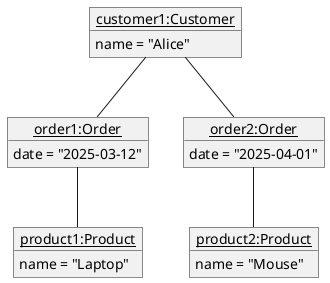
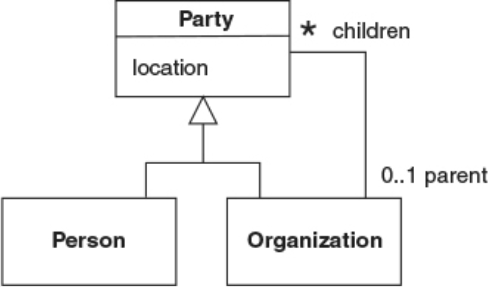
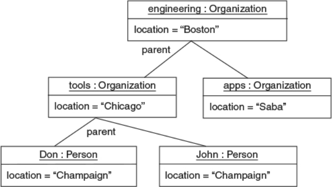
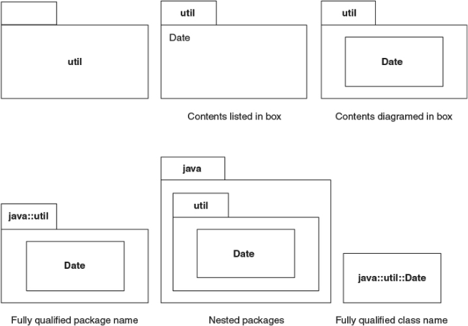
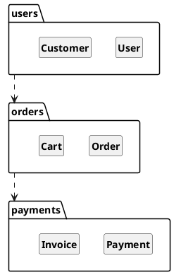
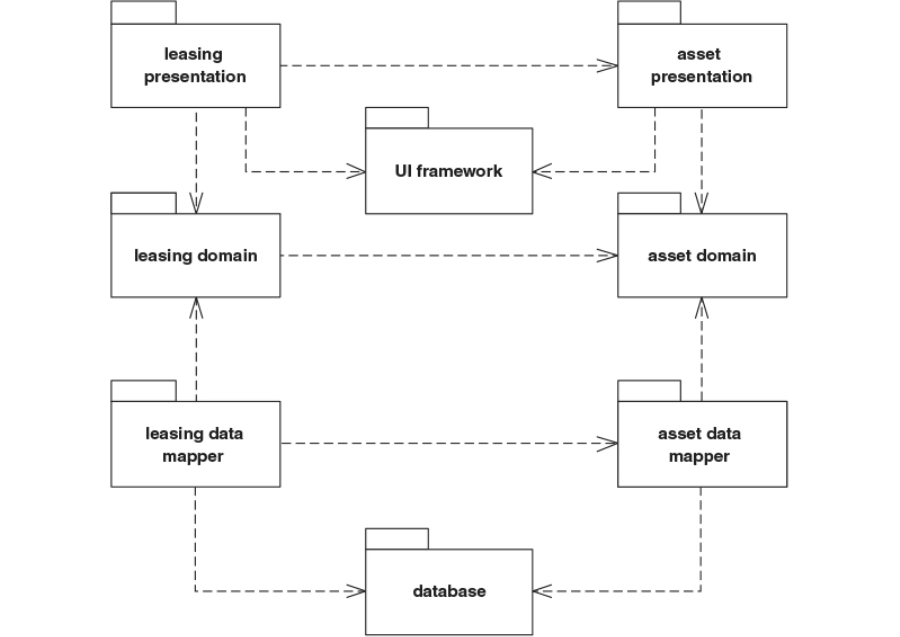
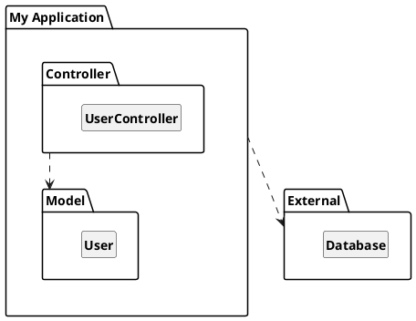
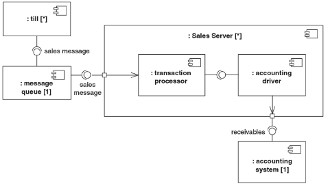
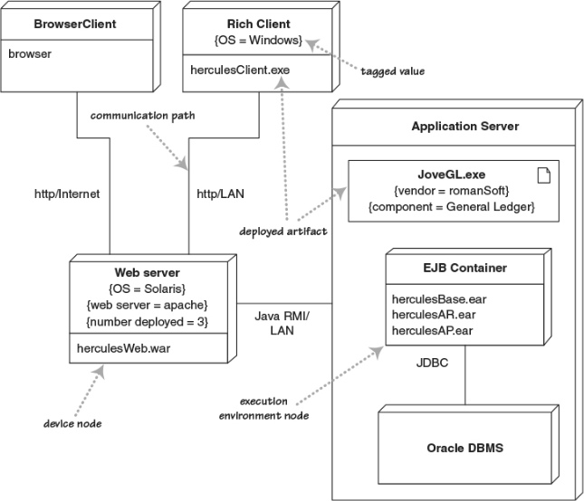

```plantuml
@startuml

  hide empty members
  '''' Declarations to stylize the diagram ''''
  hide circle

  skinparam classFontStyle bold

  skinparam classAttributeIconSize 0

class Customer {
    name : String
}

class Order {
    date : Date
}

class Product {
    name : String
}

Customer "1" --> "0..*" Order
Order "1" --> "1..*" Product

@enduml
```

## Agenda

1. Object Diagrams
2. Package Diagrams
3. Component Diagrams
4. Deployment Diagrams

::: notes
Introduce the purpose of UML structural diagrams — to represent the static architecture of a system from different abstraction levels.
:::

# Object Diagrams

---

## Object Diagrams

### Definition

An object diagram shows a snapshot of the system at a particular time — instances of classes and the links between them.

### Purpose

- Visualize examples of how objects are related at runtime.

- Understand class diagram structure by concrete examples.

### Key Elements

Objects, attribute values, and links.

---

## Example: E-commerce System

:::::::::::::: {.columns}
::: {.column width="40%"}

### Class diagram



:::
::: {.column width="60%"}

### Example object diagram



:::
::::::::::::::

::: notes
Show how object diagrams help understand the real-world instantiation of class diagrams.
:::

---

## Example: Parties

:::::::::::::: {.columns}
::: {.column width="30%"}
### Class diagram


:::
::: {.column width="70%"}
### Object diagram


:::
::::::::::::::

---

## Interactive Task

Assume we want to model arithmetic expressions with variables:

```BNF
Expr ::= Const Int | Var String | Plus Expr Expr | Times Expr Expr
```

### Tasks

- Draw a class diagram for the given model

- Draw an *object diagram* containing at least one instance every class,
  all connected.

::: notes
Encourage students to think about how associations appear as links between instances.
:::

# Package Diagrams

---

## Package Diagrams

### Definition

Package diagrams organize elements (classes, components, other packages, ...) into groups.

### Purpose

Manage large models and clarify dependencies among system parts.

### Key Elements

Packages, dependencies, imports, merges.

### Structure

- each element is part of a single package
- same package can contain both (sub)packages and other elements

---

## Ways of showing packages on diagrams



---

## Example: E-commerce Application Packages



::: notes
Explain how dependency arrows indicate which package uses which. Packages can import or merge elements.
:::

---

## Example: Well-structures, clear flow diagram

{height=100%}

---

## Example: Package structure for a web service



---

## Interactive Exercise

**Task:** Given several classes/Packages (`Website`, `Mobile App`, `Payment`, `CustomerService`, `Cart`, `ProductDB`, `CustomerDB`), propose a modular package structure.  

Goal: Reduce coupling and improve clarity.

::: notes
Students should discuss and defend their grouping choices — emphasize modular design thinking.
:::

# Component Diagrams

## Component Diagrams


### Definition

Describe how software components (subsystems, modules, libraries) are connected.

### Purpose

Model large-scale structure and interactions between replaceable parts.

### Key Elements

Components, interfaces, ports, dependencies.

---

## Component diagrams: Key takes


Components represent pieces that are independently purchasable and upgradeable

- They are about how customers want to relate to software

- Buy components one piece at a time

- Upgrade one component or another at any time
  - old and new components should work seamlessly

- Mix and match pieces from different providers

---

## Example: Sales server component diagram




::: notes
Discuss how components abstract subsystems and interfaces define how they interact.
:::

---

## Interactive Task

You are given a system for online learning (students, courses, and grading services).

Identify 3–5 major components and describe their provided and required interfaces.

::: notes
Encourage brainstorming around service boundaries and interface contracts.
:::

# Deployment Diagrams

## Deployment Diagrams

### Definition

Represent the physical deployment of software artifacts on hardware nodes.

### Purpose

Model distributed systems and deployment topologies.

### Key Elements

Nodes (devices, servers), artifacts (software units), communication links.

---

## Example: Application Deployment

{height=80%}


::: notes
Explain how nodes can represent real or virtual hardware. Connect this with modern deployment (cloud, containers).
:::

---

## Exercise

Given a system that includes (but is not limited to) a mobile app, a REST API backend, and a cloud database, create a simple deployment diagram.

::: notes
Ask students to identify which artifacts deploy on which nodes and what communication channels are used.
:::

---

## Wrap-Up

| Diagram Type | What It Models | Typical Use |
|---------------|----------------|--------------|
| Object | Instances and links at runtime | Example snapshots |
| Package | Logical grouping of elements | Modular organization |
| Component | Subsystem/module structure | Software architecture |
| Deployment | Physical topology | System infrastructure |

**Takeaway:** Structural diagrams complement behavioral ones by showing the static “shape” of a system.

::: notes
Summarize relationships among structural diagrams and highlight how they connect to previous UML content.
:::
