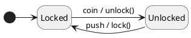
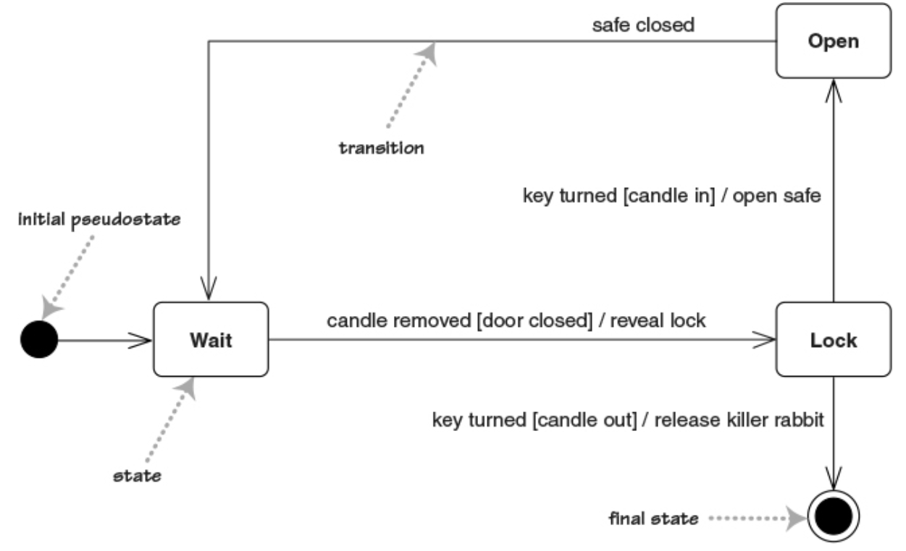
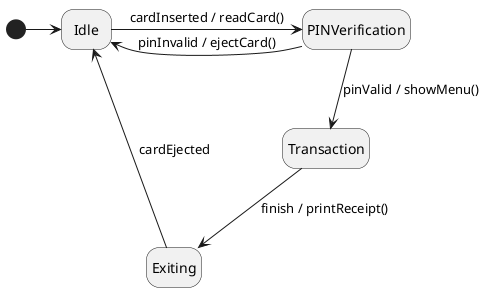
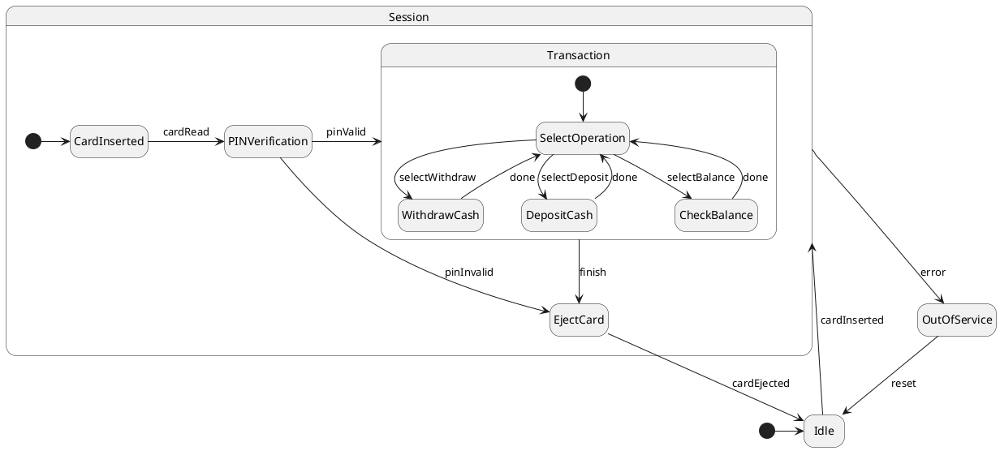
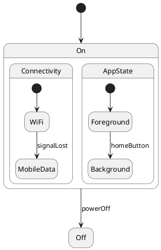
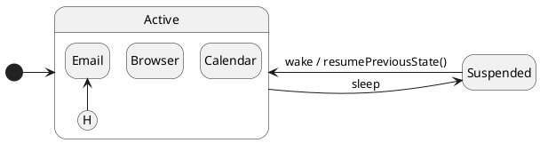
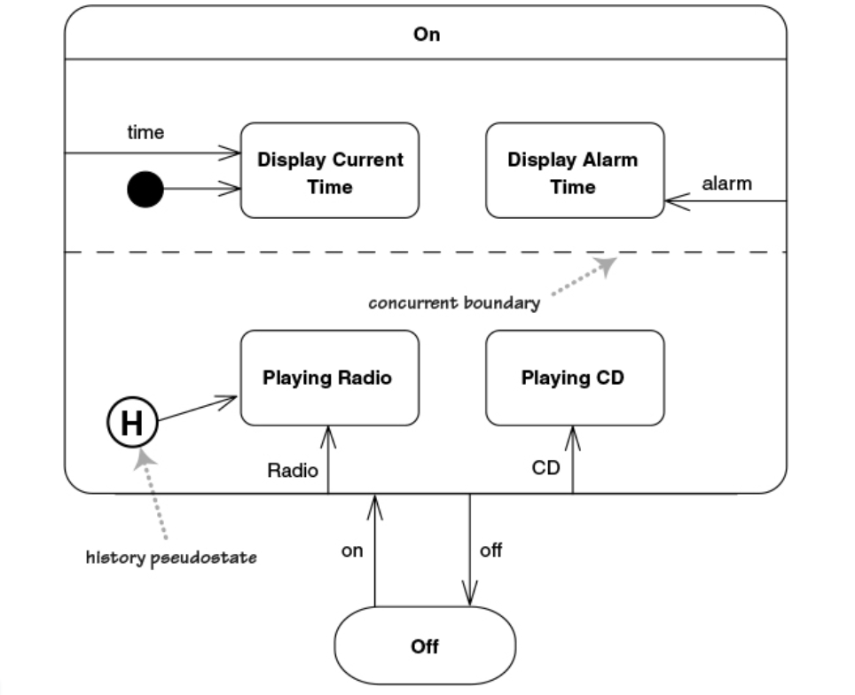
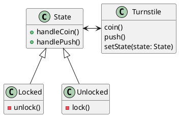

## Agenda

### Session 1: Foundations of State Diagrams

### Session 2: Advanced Modeling

### Session 3: Code Mapping

::: notes
Explain that state diagrams capture **object behavior over time** by modeling states, transitions, and events.
:::

# Session 1: Foundations of State Diagrams

---

## What Are State Diagrams?

### Definition

A UML State Machine Diagram models the *lifecycle* of an object — the states it goes through and how it transitions between them.

### Use cases

- Modeling reactive systems.
- Describing event-driven behavior.
- Understanding object lifecycle and valid transitions.

### Key Elements

- **States** (simple, composite)
- **Transitions** (with optional triggers, guards, and actions)
- **Initial/Final states**

---

## Components of Transitions




::: section
### Syntax

```
trigger [guard] / action
```

:::

Trigger

: event that initiates the transition (e.g., `coin`, `push`)

Guard

: condition that must be true for transition to occur (e.g., `[balance > 0]`)

Activity / Action

: operation executed when the transition occurs (e.g., `unlock()`, `displayMessage()`)

::: notes
Demonstrate how simple systems can be modeled effectively with state diagrams.
Use this example to introduce the concepts of *trigger*, *action*, and *resulting state*.
:::

---

## Notes on transitions

::: section
### Syntax

```
trigger [guard] / action
```

:::

- All components of a transition are optional
  - no activity means no action is taken during transition
  - no guard means the transition is always taken when event occurs
  - no trigger is rarer (e.g., for activity states)

- You can take only one transition out of a state
  - transitions with same trigger must have mutually exclusive guards

- An event with no valid transition is ignored

---

## Example: Gothic Castle Safe



---

## Example: ATM Session Lifecycle



::: notes
Walk students through each transition. Emphasize state changes as responses to user or system events.
:::

---

## Interactive Exercise: Identify Missing Transitions

**Scenario:** ATM State Diagram

- What happens if the card reader fails?
- How do we represent timeout conditions?

**Task:** Add error or timeout transitions to the diagram.

::: notes
Ask students to propose guards or new states to handle exceptional flows.
:::

---

## Recap

- **States** capture modes of behavior.
- **Transitions** define possible responses to events.
- **Actions** are side effects of transitions.
- State diagrams complement sequence/activity diagrams by focusing on *object lifecycles*.

# Session 2: Advanced Modeling

---

## Superstates (Composite States) and Substates

### Problem

If several states share transitions / internal activities

### Solution

Group them in a superstate and move shared behavior to it


---

## Example: ATM State Diagram with Composite States



::: notes
Discuss that composite states allow encapsulating transitions and reduce diagram clutter.
:::

---

## Internal Activities

- React to events without changing state

- Similar to a self-transition
  - instead, we put the `trigger[guard]/action` within the state

  ```plantuml
  @startuml
  state "Edit Field" as Typing
  Typing: <b>entry</b> / highlight all
  Typing: <b>exit</b> / update field
  Typing: character / handle character
  Typing: help [verbose] / open help page
  Typing: help [quiet] / update status bar
  @enduml
  ```

- Special entry/exit activities
  - Executed when entering / leaving the state
  - internal activities do not trigger them

## Activity States (do-activities)

- States in which the object is doing some ongoing work

- Once ongoing activity is completed, a transition with no event is taken

- If an event occurs before the ongoing activity completes, activity is stopped

  ```plantuml
  @startuml
  hide empty description
  state "Update\nHardware\nWindow" as Update

  Searching: <b>do</b> / search for new hardware
  
  state "Display\nNew Hardware\nWindow" as Display
  Update -r-> Searching : search
  Searching -l-> Update : cancel
  Searching -d-> Display
  @enduml
  ```

## Concurrent (Orthogonal) States

Some systems have *independent* aspects of behavior.

**Example:** Smartphone with concurrent regions:



::: notes
Explain that each region evolves independently but within the same overall object state.
:::

---

## History Pseudo-States

Used to remember the **last active substate** when re-entering a composite state.



- In the diagram the history state points to the default state.

- Deep history (`H*`) can be used to remember nested hierarchy of substates

::: notes
Show that `H` (or `H*`) can be used to retain previous state information.
:::

---

## Example: Alarm clock with radio



# Session 3: Code Mapping

## Remember the Turnstile State Diagram


## Using the State Design Pattern




## From UML to Code (Java Example)

Simple **State Pattern** implementation mapping UML concepts to code:

[Source file](https://github.com/traiansf/traiansf.github.io/blob/main/class/amss2025/curs/code/TurnstileDemo.java)


```java
class Turnstile {
    private State state = new Locked(this);
    void setState(State s) { state = s; }
    void coin() { state.handleCoin(); }
    void push() { state.handlePush(); }
}

class State {
    Turnstile turnstile;
    State(Turnstile turnstile) {
        this.turnstile = turnstile;
    }
    public void handleCoin() {
        printState();
        System.out.println("Trigger: Coin inserted!");
    }
    public void handlePush() {
        printState();
        System.out.println("Trigger: Push attempted!");
    }
    void printState() {
        System.out.println("State: ".concat(this.getClass().getName()));
    }
}

class Locked extends State {
    Locked(Turnstile turnstile) {
        super(turnstile);
    }
    public void handleCoin() {
        super.handleCoin();
        unlock();
        turnstile.setState(new Unlocked(this.turnstile));
    }
    public void handlePush() {
        super.handlePush();
        System.out.println("Action: You shall not pass!");   
    }
    void unlock() {
        System.out.println("Action: Turnstile unlocked");
    }
}

class Unlocked extends State {
    Unlocked(Turnstile turnstile) {
        super(turnstile);
    }
    public void handleCoin() {
        super.handleCoin();
        System.out.println("Action: Turnstile already unlocked. returning coin.");   
    }
    public void handlePush() {
        super.handlePush();
        System.out.println("\tPerson passed.");   
        lock();
        turnstile.setState(new Locked(this.turnstile));
    }
    void lock() {
        System.out.println("Action: Turnstile locked");
    }
}

public class TurnstileDemo {
    public static void main(String[] args) {
        Turnstile t = new Turnstile();
        t.coin();
        t.push();
        t.coin();
        t.push();
        t.coin();
        t.coin();
        t.push();
        t.push();
    }
}
```

::: notes
Highlight how state transitions correspond to polymorphic behavior changes.
:::

---

## Interactive Task

### Description

A smart home system has two major features –__Security System__ and __Climate Control__– operating _concurrently_ when powered on.

The system starts in an __Off__ state and transitions to __Operational__ when powered on.

### Requirements

- When _entering_ Operational, the system initializes.

- While Running, two subsystems work in parallel:

  - SecuritySystem

    - Must remember its previous substate when re-entered.

  - ClimateControl

    - Heats when temperature is below min threshold

    - Cools when temperature is above max threshold

    - Returns to Idle once temperature normalizes.

 - The user can power __Off__ the system at anytime

---


## Wrap-Up

------------------------------------------------------------------
Concept            Description             Example
------------------ ----------------------- -----------------------
Simple state       Mode of behavior        Locked/Unlocked
                                    
Composite state    Grouped states          Playing
                                           (Buffering, Streaming)
                                    
Internal           transitions within      entry/exit
activities         same state

Activity state     States performing work  do/ search

Concurrent state   Independent      
                   regions                 Connectivity, AppState
                                    
History            Remembers        
                   previous substate       Resume after pause
------------------------------------------------------------------

**Takeaway:** UML state diagrams help capture dynamic, event-driven aspects of systems and bridge toward implementable designs.

::: notes
Summarize key ideas and connect with upcoming topics.
:::
