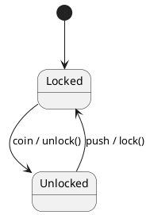
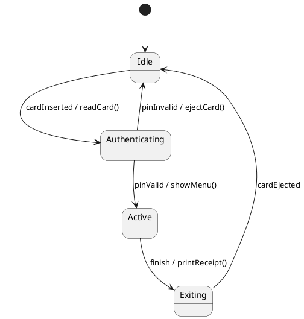
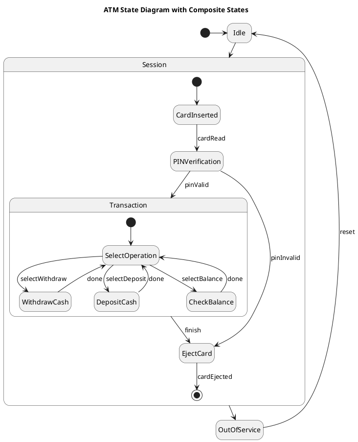
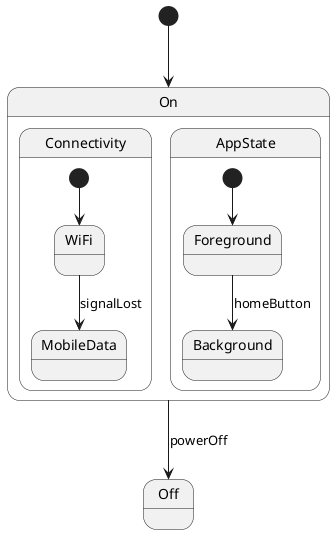
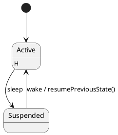

## Agenda

**Session 1:** Foundations of State Diagrams
**Session 2:** Advanced Modeling and Code Mapping

::: notes
Explain that state diagrams capture **object behavior over time** by modeling states, transitions, and events.
:::

---

# Session 1: Foundations of State Diagrams

## What Are State Diagrams?

**Definition:**
A UML State Machine Diagram models the *lifecycle* of an object — the states it goes through and how it transitions between them.

**Use cases:**
- Modeling reactive systems.
- Describing event-driven behavior.
- Understanding object lifecycle and valid transitions.

**Key Elements:**
- **States** (simple, composite)
- **Transitions** (with optional triggers, guards, and actions)
- **Initial/Final states**

---

## Example: Turnstile State Diagram

A turnstile at a metro station:



::: notes
Demonstrate how simple systems can be modeled effectively with state diagrams.
Use this example to introduce the concepts of *trigger*, *action*, and *resulting state*.
:::

---

## Components of Transitions

- **Trigger:** event that initiates the transition (e.g., `coin`, `push`)
- **Guard:** condition that must be true for transition to occur (e.g., `[balance > 0]`)
- **Action:** operation executed when the transition occurs (e.g., `unlock()`, `displayMessage()`)

**Syntax:**
```
trigger [guard] / action
```

---

## Example: ATM Session Lifecycle



::: notes
Walk students through each transition. Emphasize state changes as responses to user or system events.
:::

---

## Interactive Exercise: Identify Missing Transitions

**Scenario:** ATM State Diagram

- What happens if the card reader fails?
- How do we represent timeout conditions?

**Task:** Add error or timeout transitions to the diagram.

::: notes
Ask students to propose guards or new states to handle exceptional flows.
:::

---

## Recap

- **States** capture modes of behavior.
- **Transitions** define possible responses to events.
- **Actions** are side effects of transitions.
- State diagrams complement sequence/activity diagrams by focusing on *object lifecycles*.

---

# Session 2: Advanced Modeling and Code Mapping

## Composite States and Substates



::: notes
Discuss that composite states allow encapsulating transitions and reduce diagram clutter.
:::

---

## Concurrent (Orthogonal) States

Some systems have *independent* aspects of behavior.

**Example:** Smartphone with concurrent regions:



::: notes
Explain that each region evolves independently but within the same overall object state.
:::

---

## History States

Used to remember the **last active substate** when re-entering a composite state.



::: notes
Show that `H` (or `H*`) can be used to retain previous state information.
:::

---

## From UML to Code (Java Example)

Simple **State Pattern** implementation mapping UML concepts to code:

```java
interface State {
    void handle(Context ctx, String event);
}

class Locked implements State {
    public void handle(Context ctx, String event) {
        if (event.equals("coin")) {
            System.out.println("Unlocked");
            ctx.setState(new Unlocked());
        }
    }
}

class Unlocked implements State {
    public void handle(Context ctx, String event) {
        if (event.equals("push")) {
            System.out.println("Locked");
            ctx.setState(new Locked());
        }
    }
}

class Context {
    private State state = new Locked();
    void setState(State s) { state = s; }
    void trigger(String event) { state.handle(this, event); }
}

public class Main {
    public static void main(String[] args) {
        Context t = new Context();
        t.trigger("coin");
        t.trigger("push");
    }
}
```

::: notes
Highlight how state transitions correspond to polymorphic behavior changes.
:::

---

## Interactive Task

**Task:** Implement a simple state machine for a *Traffic Light* using the State pattern.
States: `Red`, `Green`, `Yellow`.
Transitions triggered by `next()`.

::: notes
Encourage students to experiment by simulating time-based transitions.
:::

---

# Wrap-Up

| Concept | Description | Example |
|----------|--------------|----------|
| Simple state | Mode of behavior | Locked/Unlocked |
| Composite state | Grouped states | Playing (Buffering, Streaming) |
| Concurrent state | Independent regions | Connectivity, AppState |
| History | Remembers previous substate | Resume after pause |

**Takeaway:** UML state diagrams help capture dynamic, event-driven aspects of systems and bridge toward implementable designs.

**Next Lecture:** Structural Design Patterns – Visitor, Mediator, Bridge.

::: notes
Summarize key ideas and connect with upcoming topics.
:::
