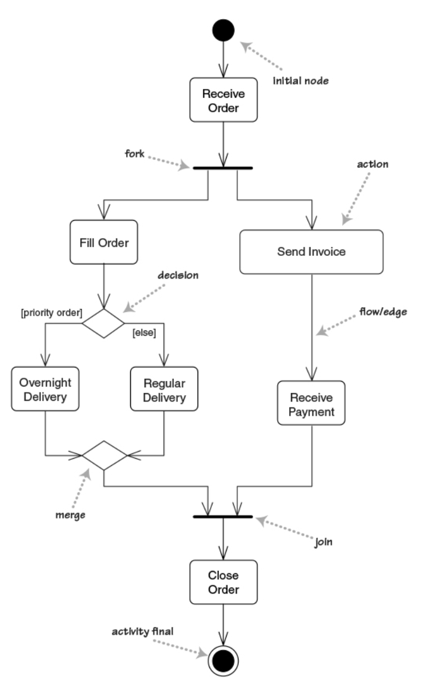
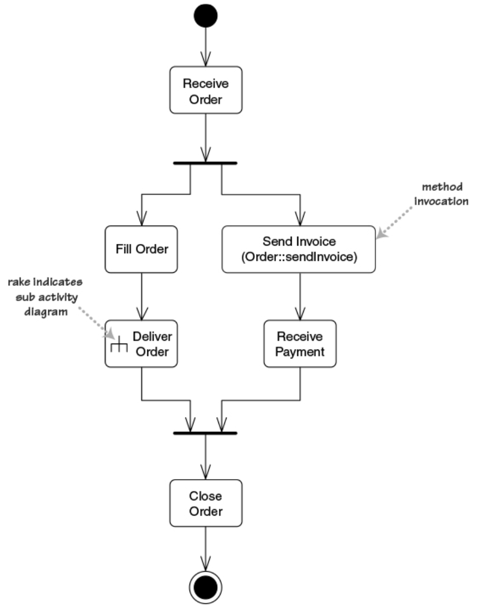
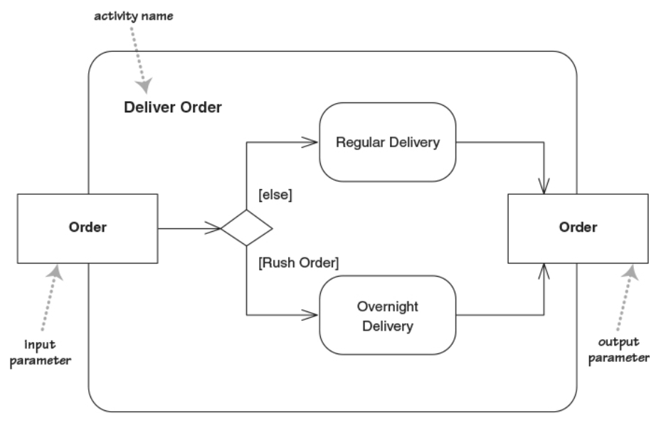
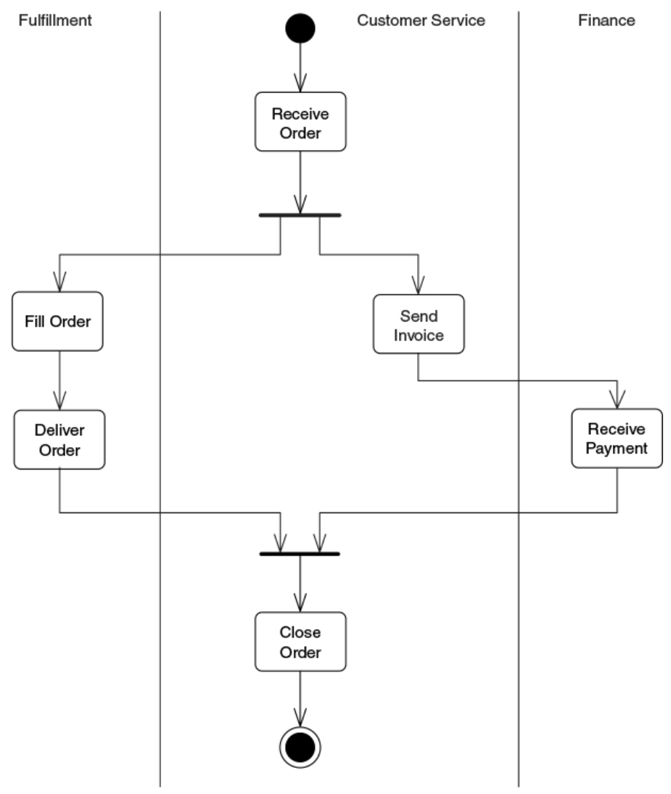
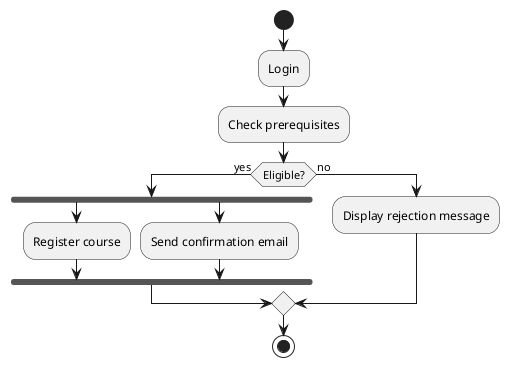
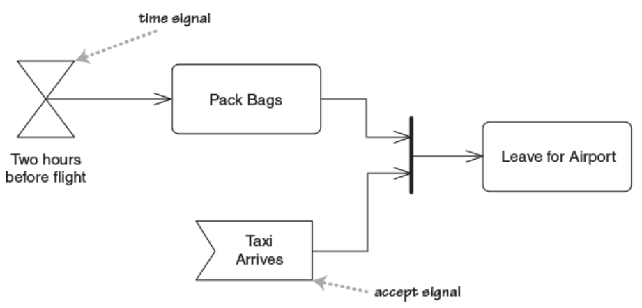
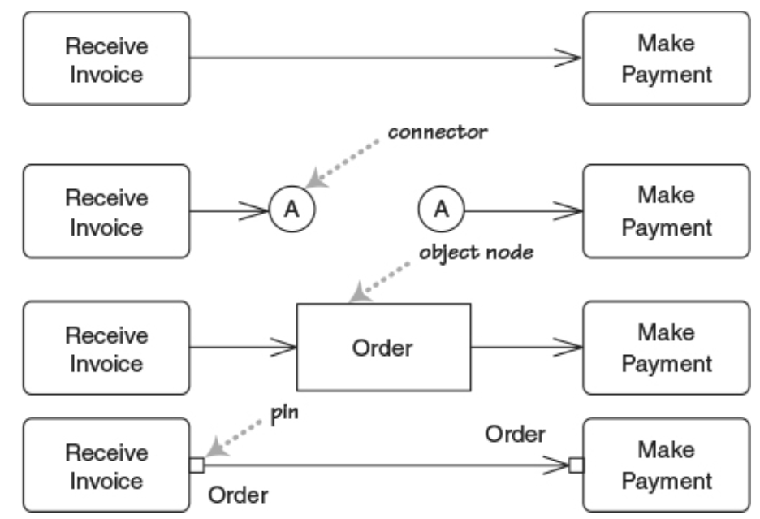
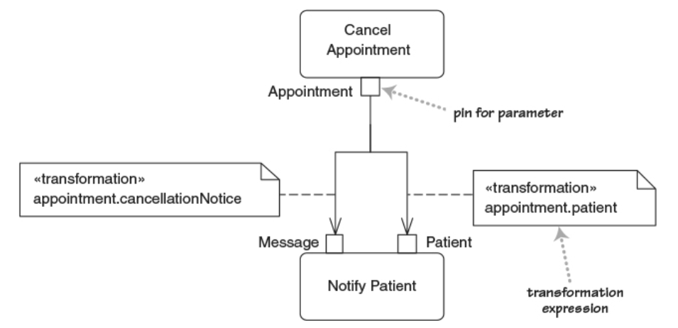

## Agenda

- Fundamentals of Activity Diagrams

- Advanced Constructs and Applications

::: notes
Introduce Activity Diagrams as a dynamic modeling tool for **processes, workflows, and operations**. Emphasize that they complement state diagrams by describing *what happens* rather than *object lifecycles*.
:::

# Fundamentals of Activity Diagrams

---

## What Are Activity Diagrams?

### Definition

Activity diagrams describe the **flow of control and data** between actions in a process.

### Use Cases

- Model algorithms, business process, and workflows
- Detail use case realizations
- Similar to flowcharts but supporting concurrent behavior

### Comparison

| Diagram | Focus |
|----------|--------|
| State Diagram | Object lifecycle |
| Sequence Diagram | Message order |
| Activity Diagram | Workflow logic |

---

## Core Elements

- **Action Nodes** – steps or tasks.
- **Control Flows** – arrows showing execution order.
- **Decision Nodes** – conditional branching.
- **Merge Nodes** – combine alternative flows.
- **Fork / Join Nodes** – manage parallel execution.
- **Initial / Final Nodes** – start and end points.

---

## Example: Order Processing

{height=90%}

::: notes
Demonstrate how Activity Diagrams resemble flowcharts but integrate UML semantics (decisions, concurrency, swimlanes).
:::

---

## Decomposing an Action as a subactivity

An action can be implemented as:

- a method invocation
- as a sub-activity (shown using the rake symbol)

:::::::::::::: {.columns}
::: {.column width="40%"}
### Modified Activity

:::
::: {.column width="60%"}
### Subactivity

:::
::::::::::::::

::: notes
Emphasize how branching decisions reflect business logic. The diagram models workflow from initiation to completion.
:::

---

## Partitions (swim lanes) – who does what?

{height=80%}

::: notes
Explain how swimlanes improve clarity by associating tasks with participants. Great for business modeling.
:::

---

## Interactive Exercise 1: Course Registration Process

### Scenario

A student registers for a course.

### Steps

1. Log in
2. Check prerequisites
3. If eligible → register for course
4. Update records & send confirmation (in parallel)

<!--


**Discussion:** What happens if one parallel branch fails or is delayed?

::: notes
Discuss real-world implications of concurrency: synchronization, error handling, compensation actions.
:::

---

## Tokens in Activity Diagrams

### Purpose of tokens

- Represent the *flow of control* or *flow of data*.
- Enable the execution of actions when they arrive

  at input pins or control flows.

### Types of tokens

- **Control tokens**: Indicate progression of execution.
- **Object tokens**: Carry data values or objects along object flows.

### Token behavior

- Actions **consume** incoming and **produce** outgoing tokens.
- Fork multiplies tokens (one for each outgoing flow).
- Join synchronizes incoming tokens (one for each incoming flow).
- Decisions route tokens based on guard conditions.

---

## Signals

- Allow to specify entry points corresponding to events
  - receiving a signal produces one token

- Activity receives an event from an outside process
  - Time signals – triggered by the passing of time
  - Accept signals – triggered by other events

  {height=50%}

---

## Emiting signals and flowing into signals

One can also send signals

- e.g., send a message, waiting for a reply

{height=50%}

### Notes

- the two flows are racing: first to end completes the activity

- Flow going into an accept signal means:

  Start listening only when flow enters the signal

---

## Data Flow and Object Nodes

- **Connectors** Allow splitting the draw of an edge in two parts
- **Object nodes** represent data produced/consumed by activities.
  - correspond to object tokens
  - Used to visualize data movement alongside control flow.
  - Can also be specified using **pins**

{height=65%}

::: notes
Explain that object nodes enrich the model with data semantics without overcomplicating control flow.
:::

---

## Pins: argument passing and transformation

- Pins allow showing information about parameters
- Output parameters of action should match input of next
  - One can use **transformations** to ensure that
- With pins we can have multiple flows entering same action



- In business modelling, pins show resources

---

## Expansion regions: multiple action invocations

- Area where actions ocurr once for each item in a collection
  - useful for mapping and filtering collections

{width=80%}

{width=80%}

---

## Flow final: stop a flow without ending entire activity

{height=80%}

---

## Join specifications: conditions attached to a join node


---

## Comparison to Petri Nets

### Conceptual similarity

- Both use tokens to represent the *dynamic state* of the system.
- Movement of tokens represents progress in execution.

### Key differences

- Activity Diagrams: object tokens; semiformal semantics.
- Petri Nets: tokens (usually) indistinguishable; formal semantics

### Execution correspondence

- Activity Diagram actions ~ Petri Net transitions.
- Activity Diagram edges / pins ~ Petri Net places.
- Token flow in both describes enabling and firing of behaviors.

### Why the comparison matters

- Petri Nets provide a *formal* foundation to analyze concurrency, conflicts, and reachability.
- Activity Diagrams can be mapped to Petri Nets for verification or simulation.

---

## Interactive Exercise 2: Airport Check-in Process

Create an activity diagram with two swimlanes and one parallel branch.

**Actors:** Passenger, System

### Requirements
- Passenger checks in.
- System verifies ticket.
- If baggage overweight → pay fee.
- In parallel: print boarding pass + update database.

<!-- ```plantuml
@startuml
|Passenger|
start
:Check in;
|System|
:Verify ticket;
if (Overweight baggage?) then (yes)
  :Pay extra fee;
endif
fork
  :Print boarding pass;
fork again
  :Update database;
end fork
stop
@enduml
``` -->

::: notes
Ask students to identify decision points and concurrency areas. Discuss how this model could inform software design.
:::

---

## Wrap-Up

| Concept | Description | Example |
|----------|--------------|----------|
| Action | Step in process | "Process payment" |
| Decision | Conditional branch | "Is stock available?" |
| Fork/Join | Parallel execution | "Ship + Notify" |
| Swimlane | Role-based grouping | "Customer vs. System" |

### Key Takeaways

- Activity Diagrams model workflows and concurrent processes.
- Ideal for requirements and process-level modeling.
- Useful bridge from analysis to system design.

::: notes
Summarize distinctions from state diagrams and encourage practice by modeling real processes.
:::