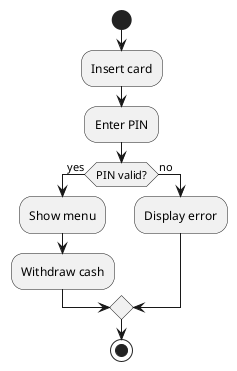
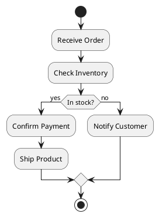
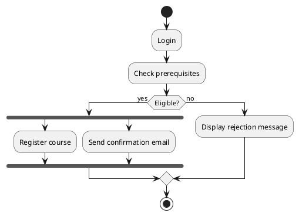
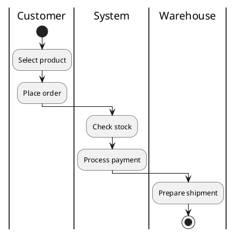
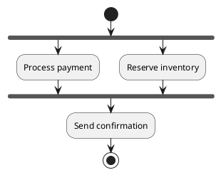
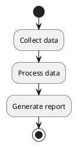
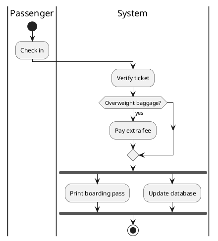

# Welcome

- Course: Analiza și Modelarea Sistemelor Software (AMSS)
- Lecture 8: UML Activity Diagrams
- Duration: 100 minutes (two 50-minute sessions)

::: notes
Introduce Activity Diagrams as a dynamic modeling tool for **processes, workflows, and operations**. Emphasize that they complement state diagrams by describing *what happens* rather than *object lifecycles*.
:::

---

# Agenda

**Session 1:** Fundamentals of Activity Diagrams  
**Session 2:** Advanced Constructs and Applications

---

# Session 1: Fundamentals of Activity Diagrams

## What Are Activity Diagrams?

**Definition:**  
Activity diagrams describe the **flow of control and data** between actions in a process.

**Use Cases:**
- Model business workflows or algorithms.
- Detail use case realizations.
- Represent concurrent behavior.

**Comparison:**
| Diagram | Focus |
|----------|--------|
| State Diagram | Object lifecycle |
| Sequence Diagram | Message order |
| Activity Diagram | Workflow logic |

---

## Core Elements

- **Action Nodes** – steps or tasks.
- **Control Flows** – arrows showing execution order.
- **Decision Nodes** – conditional branching.
- **Merge Nodes** – combine alternative flows.
- **Fork / Join Nodes** – manage parallel execution.
- **Initial / Final Nodes** – start and end points.

---

## Example: ATM Transaction

::: notes
Demonstrate how Activity Diagrams resemble flowcharts but integrate UML semantics (decisions, concurrency, swimlanes).
:::

---

## Example: Online Order Workflow

::: notes
Emphasize how branching decisions reflect business logic. The diagram models workflow from initiation to completion.
:::

---

## Interactive Exercise 1: Course Registration Process

**Scenario:** A student registers for a course.

**Steps:**
1. Log in
2. Check prerequisites
3. If eligible → register for course
4. Update records & send confirmation (in parallel)

**Task:** Draw the activity diagram using PlantUML or by hand. Include one decision and one fork/join.

::: notes
Encourage students to reflect on sequencing, decisions, and concurrency.
:::

---

# (Break - 10 minutes)

---

# Session 2: Advanced Constructs and Applications

## Swimlanes

**Purpose:** Show which actor or subsystem performs each action.

**Notation:** Vertical or horizontal lanes representing responsibilities.

**Example: Online Purchase Process**

::: notes
Explain how swimlanes improve clarity by associating tasks with participants. Great for business modeling.
:::

---

## Parallel Flows and Synchronization

**Fork/Join Example:**

**Discussion:** What happens if one parallel branch fails or is delayed?

::: notes
Discuss real-world implications of concurrency: synchronization, error handling, compensation actions.
:::

---

## Data Flow and Object Nodes

- **Object nodes** represent data produced/consumed by activities.
- Used to visualize data movement alongside control flow.

**Example:**

Add data objects like *Order*, *Invoice*, *Shipment* to visualize real workflows.

::: notes
Explain that object nodes enrich the model with data semantics without overcomplicating control flow.
:::

---

## Interactive Exercise 2: Airport Check-in Process

**Actors:** Passenger, System

**Requirements:**
- Passenger checks in.
- System verifies ticket.
- If baggage overweight → pay fee.
- In parallel: print boarding pass + update database.

**Task:** Create an activity diagram with two swimlanes and one parallel branch.

::: notes
Ask students to identify decision points and concurrency areas. Discuss how this model could inform software design.
:::

---

# Wrap-Up

| Concept | Description | Example |
|----------|--------------|----------|
| Action | Step in process | "Process payment" |
| Decision | Conditional branch | "Is stock available?" |
| Fork/Join | Parallel execution | "Ship + Notify" |
| Swimlane | Role-based grouping | "Customer vs. System" |

**Key Takeaways:**
- Activity Diagrams model workflows and concurrent processes.
- Ideal for requirements and process-level modeling.
- Useful bridge from analysis to system design.

**Next Lecture:** Sequence Diagrams (Advanced Scenarios and Interaction Modeling).

::: notes
Summarize distinctions from state diagrams and encourage practice by modeling real processes.
:::