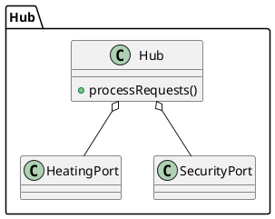
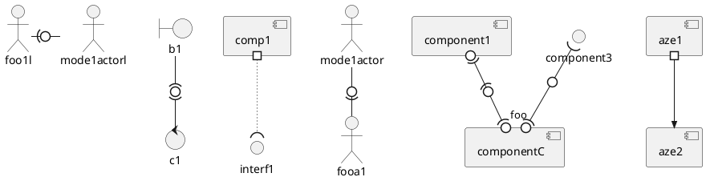

## Agenda

### Interaction Diagrams

- Communication Diagrams
- Interaction Overview Diagrams
- Timing Diagrams

### Structure Diagrams

- Composite Structure Diagrams
- Profile Diagrams

<!-- ### Running Example: Smart Home Automation System  

- Devices: TemperatureSensor, DoorSensor  
- Controllers: HeatingController, SecurityController  
- Hub orchestrates all devices  
- User interacts via MobileApp -->

# Interaction Diagrams

---

## 1. Communication Diagrams

Emphasize data links between participants in the interaction.

- free placement of participants
- draw links to show how participant connect
- use numbering to show message sequence


## 1. Communication Diagrams (nested numbering)


- Can use letters to indicate different threads
  - e.g., 1a1 and 1b1 indicate two threads within message 1

- Nested numbers can get hard to follow (e.g., 1.1.1.2.1.1.)
  - Some people prefer using flat numbers as on previous slide

- Don't have precise notation for control logic

<!-- ### Example

<!-- ```plantuml
@startuml
object MobileApp
object Hub
object TemperatureSensor
object HeatingController

MobileApp - Hub : requestStatus()
Hub - TemperatureSensor : readTemp()
TemperatureSensor - -> Hub : temp
Hub - HeatingController : adjustHeating(temp)
@enduml
```
-->

## 1. Communication Diagrams (example)

{height=100%}

## 1. Communication Diagrams vs. Sequence Diagrams

- __Sequence diagrams__ highlight temporal sequencing.

- __Communication diagrams__ highlight structural organization

------------------------------------------------------------------------------------------------
Aspect            Sequence Diagram                      Communication Diagram
----------------- ------------------------------------- ----------------------------------------
Focus             Flow of messages                      Structural relationships among objects

Emphasis          *When* messages occur                 *Which* objects interact

Layout            Vertical lifelines;                   Graph layout;
                  message flow top-to-bottom            objects linked by message paths

Best For          message order, concurrency, timing    Collaboration structure and object roles

Mesage Order      Vertical position                     Explicit sequence numbers (1, 1.1, 2…)

Use Case          Complex logic, workflows,             High-level interaction patterns
                  time-dependent behavior               object relationships

---

## Interactive Exercise (5 minutes)

### Task

Model the basic interactions within an online ordering system when a customer
places a food order online.

### Guidelines

- Use at least 4 objects (CustomerApp, OrderService, RestaurantSystem, PaymentService).  
- Number your messages.
- model possible failures.

---

## 2. Interaction Overview Diagrams

:::::::::::::: {.columns}
::: {.column width="60%"}

:::
::: {.column width="40%"}

- Activity diagrams where
  actions are Interaction Diagrams (or references).

- High-level control flow
  combining multiple interactions.
:::
::::::::::::::

```plantuml
@startuml
start
:MorningRoutine;
partition "Heating" {
  :Read temperature;
  :Adjust heating;
}
partition "Security" {
  :Check door sensors;
  :Enable alarms;
}
stop
@enduml
``` -->

---

## 2. Interaction Overview example (all references)

![](images/overview-3.png){width=100%}

---

## 2. Interaction Overview example

![](images/overview-2.png){height=90%}

---

## 2. Interaction Overview exercise (Library Book Borrowing)

### Task

Create an Interaction Overview Diagram (IOD) that shows the control flow of a user borrowing a book through an online library portal.

### Guidelines

The diagram must include at least one interaction sub-diagram, such as a short sequence diagram or communication diagram.

The system consists of:

- UserPortal

- SearchService

- CatalogService

- LoanService

- NotificationService

---

## 3. Timing Diagrams

Focus: timing constraints between state changes on different objects

- Show the *change of state over time*.

- Hardware design: modelling of real-time / cyberphysical systems

![](images/timing-1.png)

---

## 3. Timing Diagrams with cross state-changes

- Useful when there are more states

![](images/timing-2.png)

## 3. Timing diagrams example (including messages)

![](images/timing-3.png){height=90%}

## 3. Timing Diagram exercise

Create a UML Timing Diagram showing how three components in a smart-home lighting system (motion sensor, light controller, light) change states over time and respond to each other.

### Initial States

- MotionSensor = DetectingMotion

- LightController = Active

- Light = ON

### Sequence of Events

1. At t = 0s, the MotionSensor switches to NoMotion.

2. After 10 seconds of no motion, the LightController transitions from Active → WaitingToOff.

3. At t = 12s, the MotionSensor briefly detects motion again (DetectingMotion), causing:

   LightController → Active (cancel auto-off)

4. At t = 18s, MotionSensor returns to NoMotion.

5. After another 10 seconds of continuous no motion (i.e., at t = 28s), LightController sends command
   Light = OFF

# Structure Diagrams

## 4. Composite Structure Diagrams

:::::::::::::: {.columns}
::: {.column width="40%"}
Used to show:

- internal structure
  - interactions with environment through ports

- behavior of a collaboration

![TV Viewer Class](images/simple-tv.png)

:::
::: {.column width="60%"}
![TV Viewer as Composite Structure](images/composite-1.png)
:::
::::::::::::::

## 4. Composite Structures example (internal structure)

![](images/composite-2.png){height=90%}

## 4. Composite Structures example (collaboration)

![Observer design pattern as a composite structure](images/composite-3.png){height=50%}

- Collaboration icon is connected to each of the rectangles
- Rectangles denote interfaces 
  - types of properties of the collaboration.
- Each line is labeled by the name of the property (role).

## 4. Composite Structures exercise

Create a Composite Structure Diagram showing the internal structure of an AudioPlayback component in a music-player app.

### Scenario

You are given a component called AudioPlayback, responsible for decoding and playing audio files.
Internally, it contains three parts:

- Decoder

- Buffer

- OutputDevice (e.g., speakers or headphone jack)


AudioPlayback component interacts with environment through:

- controlPort – receives play/pause/stop commands

- audioPort – sends raw audio samples to hardware

### Optional additions

- A visualizer
- A volume control

---

## 5. Profile Diagrams

Define UML _extensions_ for domain-specific modeling.

- custom stereotypes, tagged values, and constraints.

![](images/profile-1.png){height=80%}

## 5. Profile Diagrams exercise (Secure Web Services profile)

Create a UML Profile Diagram that extends UML to better describe security characteristics of web-service components.

### Tasks

1. Create a WebSecurity profile
2. Add stereotypes
   a. SecureCompoent extends Component with encryption and CA tags
   b. SensitiveData extends Class with a dataCategory tag
   c. AuthRequired extends Operation with authLevel tag
3. Add at least one constraint
   - e.g., SensitiveData must have at least one private attribute

---

## 5. Solution

```plantuml
@startuml
' Use UML profile diagram mode
skinparam stereotypeFontColor black
hide circle
hide empty members

package "WebSecurityProfile" <<profile>> {

' --- UML metaclasses being extended ---
class Component <<Metaclass>>
class Class <<Metaclass>>
class Operation <<Metaclass>>

    ' --- secureComponent stereotype ---
    class secureComponent <<stereotype>> {
        +encryption : String
        +certificateAuthority : String
        ---
        {constraint: encryption <> "" }
    }

    ' --- sensitiveData stereotype ---
    class sensitiveData <<stereotype>> {
        +dataCategory : String
    }

    ' --- authRequired stereotype ---
    class authRequired <<stereotype>> {
        +authLevel : Integer
        ---
        {constraint: authLevel >= 1 and authLevel <= 3 }
    }

' --- Extension relationships ---
secureComponent -up-> Component : extends

sensitiveData -up-> Class : extends

authRequired -up-> Operation : extends

}

@enduml
```

<!-- ### Example



---

## Interactive Exercise (5 minutes)

### Task

Create a timing diagram showing:

- TemperatureSensor reading changes from 18°C → 20°C → 19°C  
- HeatingController turns *on* only when below 19°C

# Session 2 (50 minutes): Structure Diagrams

## 4. Composite Structure Diagrams (20 minutes)

### Purpose
Show the *internal structure* of a class or component.

### Example


 


## Interactive Exercise (10 minutes)

### Task

Model the *HeatingController* internal structure.  

Include:  

- A sensor input port  
- An actuator output port  
- A processing unit

---

## 5. Profile Diagrams (20 minutes)

### Purpose
Define UML extensions for domain-specific modeling.

### Example

```
@startuml
profile SmartHomeProfile {
  stereotype Sensor
  stereotype Actuator
}

class TemperatureSensor <<Sensor>>
class HeatingController <<Actuator>>
@enduml
```

## Interactive Exercise (10 minutes)

### Task

Create a simple **SmartLightingProfile** with:  

- Stereotype `LightDevice`  
- Stereotype `Dimmable`  

Apply your stereotypes to:

- LightSensor  
- LightController

---

## Wrap-Up

### Summary Table

| Diagram Type | Purpose | Example |
|--------------|---------|---------|
| Communication | Object message exchange | Heating activation |
| Interaction Overview | High-level flow | Morning routine |
| Timing | Time-based behavior | Door sensor alert |
| Composite Structure | Internal architecture | Hub subsystem |
| Profile | Domain extensions | SmartHome stereotypes |

### Closing Task

Pick one Smart Home subsystem (Heating, Security, Lighting) and:

- Create *one* interaction diagram
- Create *one* structure diagram
- Apply at least *one* stereotype from a custom profile
