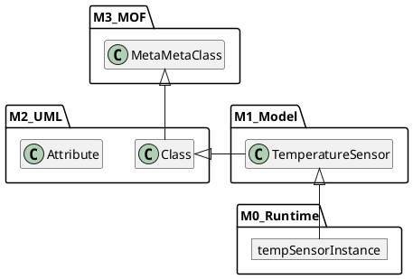
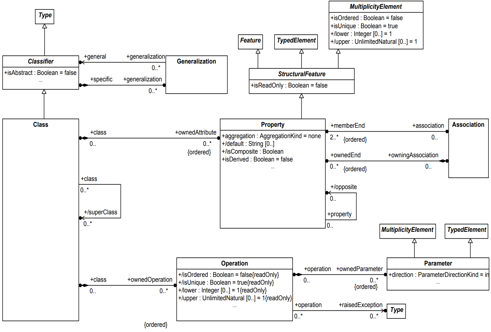
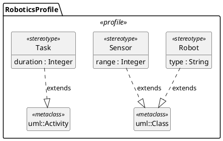
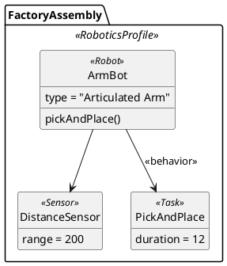

## Agenda

### Goal

Understand the UML meta‑model and how **Profiles** extend/customize it.

### The UML Meta-Model

- UML Meta‑Model Basics
- Meta‑Model Architecture (MOF layers)
- How UML Constructs Are Defined

### Profile Diagrams

- Profiles as Meta‑Model Customization

# The UML Meta-Model

---

## 1. What Is a Meta‑Model?

- A *model* represents a real‑world system.
- A *meta‑model* defines the **rules for building models**.
- UML itself is not just a set of diagrams — it is a **modeling language** defined by a meta‑model.

### Key idea

The UML meta‑model defines:

- What a *Class*, *Attribute*, *Operation*, *Association* are
- How they relate
- What diagrams can contain

## Model-Driven Architecture (MDA)

MDA is a software development approach defined by the Object Management Group (OMG)

- Focuses on creating and transforming models

  rather than writing code directly

- Separates business logic from platform-specific implementation

- Supports automation:

  models → transformations → generated code

### Key MDA Model Types

CIM

: Computation-Independent Model
: (business/domain understanding)

PIM

: Platform-Independent Model
: (logic without tech details)

PSM

: Platform-Specific Model
: (technology-bound design)

## Examples of MDA Languages / Modeling Standards

UML

: Unified Modeling Language
: (primary MDA modeling language)

MOF

: Meta-Object Facility
: (meta-modeling framework)

QVT

: Query/View/Transformation
: (model transformation language)

OCL

: Object Constraint Language
: (add constraints to models)

XMI

: XML Metadata Interchange
: (model serialization/exchange format)

---

## 2. The Meta-Object Facility (MOF) Architecture

UML is defined using a 4‑layer meta‑model architecture:

| Layer | Meaning       | Example                |
|------|---------------|------------------------|
| **M3** | Meta‑meta‑model | MOF defining UML’s structure |
| **M2** | Meta‑model | UML specification (classes, states, components...) |
| **M1** | Model | Your diagrams (class diagrams, state diagrams...) |
| **M0** | Runtime | Real objects in the running system |

## MOF Visualization (as a Package Diagram)



---

## Meta-Object Facility (MOF) in More Detail

- MOF is an Object Management Group (OMG) standard

- Defines how meta-models are built

- UML, SysML, BPMN meta-models are all built using MOF

- Enables interoperability between modeling tools

---

## Key MOF Concepts

Classes

: Meta-classes used to define modeling concepts (e.g., UML Class)

Properties

: Define attributes and relationships in the meta-model

Packages

: Group meta-model elements

Associations

: Link meta-classes together


---

## MOF Variants

### Essential MOF (EMOF)

- A simplified subset of MOF
- Used for simple DSLs, transformation systems
  - Many DSLs (Domain-Specific Languages) use EMOF for simplicity

### Complete MOF (CMOF)

- Offers the full expressive power of MOF
  - UML is defined in CMOF

---

## 3. Essential MOF (EMOF) classes



# Profiles and Profile diagrams

---

## 4. Profiles and Stereotypes (10 minutes)

### Profiles are  **lightweight extensions** to the UML meta‑model

- Add domain‑specific concepts
- Add constraints
- Specialize existing UML meta‑model elements
  - without modifying UML itself

### Stereotypes extend UML elements

- Add tagged values
- Add constraints
- Add semantics

---

## 5. Profile Diagrams

Define UML *extensions* for domain-specific modeling.

- custom stereotypes, tagged values, and constraints.


---

## 5. Profile Diagram example

{height=80%}

---

## A profile diagram and a DSL model using it

:::::::::::::: {.columns}
::: {.column width="60%"}



:::
::: {.column width="40%"}



:::
::::::::::::::

---

## Why Profiles instead of modifying the UML meta‑model?

- Profiles keep UML standard-compliant  
- Tool‑friendly  
- Tailored for specific domains (IoT, automotive, medical, cloud, finance)

Examples:

- SysML = UML Profile  
- MARTE (real‑time systems) = UML Profile

---

## Interactive exercise (Secure Web Services profile)

Create a UML Profile Diagram that extends UML to better describe security characteristics of web-service components.

### Tasks

1. Create a WebSecurity profile
2. Add stereotypes
   a. SecureCompoent extends Component with encryption and CA tags
   b. SensitiveData extends Class with a dataCategory tag
   c. AuthRequired extends Operation with authLevel tag
3. Add at least one constraint
   - e.g., SensitiveData must have at least one private attribute

<!-- ## 5. Solution

```plantuml
@startuml
' Use UML profile diagram mode
skinparam stereotypeFontColor black
hide circle
hide empty members

package "WebSecurityProfile" <<profile>> {

' --- UML metaclasses being extended ---
class Component <<Metaclass>>
class Class <<Metaclass>>
class Operation <<Metaclass>>

    ' --- secureComponent stereotype ---
    class secureComponent <<stereotype>> {
        +encryption : String
        +certificateAuthority : String
        ---
        {constraint: encryption <> "" }
    }

    ' --- sensitiveData stereotype ---
    class sensitiveData <<stereotype>> {
        +dataCategory : String
    }

    ' --- authRequired stereotype ---
    class authRequired <<stereotype>> {
        +authLevel : Integer
        ---
        {constraint: authLevel >= 1 and authLevel <= 3 }
    }

' --- Extension relationships ---
secureComponent -up-> Component : extends

sensitiveData -up-> Class : extends

authRequired -up-> Operation : extends

}

@enduml
``` -->

---

## Summary

- UML is defined by a **meta‑model** (M2 layer)
  using MOF (M3 layer)

- Your diagrams are **models** (M1), representing real objects (M0)
- Profiles customize UML **without altering the meta‑model**
- Stereotypes add domain semantics and constraints
- Profiles are essential for domain‑specific modeling (e.g., SysML)
