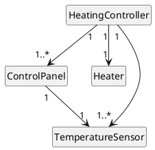
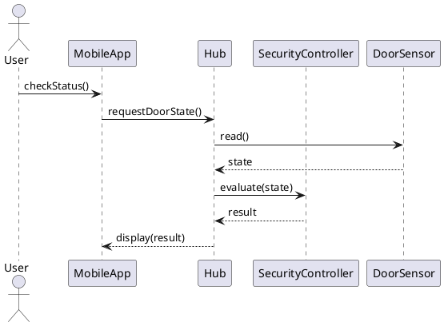

## Agenda

### Goal

Learn how to evaluate, validate, verify, and test UML models using structured techniques and common tools.

### General evaluation principles

- Why evaluate UML models?  
- Model quality criteria  
- Static evaluation techniques  
- UML conformance checking  

### Tools

- Model simulation & execution tools  
- Testing scenarios and behavioral models  

# General Evaluation Principles

---

## Why Evaluate UML Models?

- Models are abstractions → may be ambiguous or incomplete
- Early detection of design problems reduces cost
- Ensures consistency across the system architecture
- Supports automated transformations and code generation


## Evaluation dimensions

- Consistency
- Completeness
- Correctness
- Usability
- Maintainability

---

## Evaluation dimensions: Consistency

- Ensures uniform use of notation, naming, and style across all UML diagrams.  
- Avoids contradictions between different diagram types (e.g., class vs. sequence diagrams).  
- Increases clarity and coherence throughout the model.

---

## Evaluation dimensions: Completeness

- All required system elements, behaviors, and interactions are represented.  
- No missing components that hinder system understanding.  
- Covers all relevant viewpoints needed by stakeholders.

---

## Evaluation dimensions: Correctness

- Follows UML syntax and semantic rules.  
- Accurately reflects system requirements and domain constraints.  
- Contains no logical, structural, or behavioral errors.

---

## Evaluation dimensions: Usability

- Diagrams are easy for stakeholders to read and interpret.  
- Uses an appropriate level of detail—neither too abstract nor too cluttered.  
- Supports communication, documentation, and decision-making processes.

---

## Evaluation dimensions: Maintainability

- Diagrams can be easily updated as the system evolves.  
- Minimizes unnecessary complexity to accommodate future changes.  
- Encourages modular, scalable architecture representation.

---

## UML Model Quality Criteria 

### Semantic quality

- Are the diagrams logically correct?
- Do they represent valid domain concepts?

### Syntactic quality

- Do diagrams follow the UML meta-model?
- Are constructs used properly?

### Pragmatic quality

- Are diagrams understandable to stakeholders?
- Are they readable and not over‑complex?

---

## Static Evaluation Techniques

- **Checklist-based evaluation**

- **Traceability checks**

- **Cross-diagram consistency checks**

---

## Checklist-based evaluation
Useful for manual reviews.  

### Typical questions

- Do all classes have well-defined responsibilities?  
- Are associations properly navigable?  
- Are sequence diagrams consistent with class diagrams?

### Benefits

- Improves model quality early, reducing rework during coding.

- Better communication among stakeholders.

- Supports teaching and training for junior modelers.

- Makes model reviews faster and more systematic.

### Limitations

- Checklist quality determines quality of evaluation.
  - may miss semantic issues if the checklist is shallow.
- does not replace automated validation tools
  - e.g., UML consistency checkers

## Traceability checks

### Goal

ensure that every element of a UML model is properly linked to other artifacts across the software lifecycle

- Requirements → Use cases → Sequence diagrams → Classes
- Detect missing or redundant elements

## What Do You Check in UML Traceability?

### Use Cases – Requirements

- Does every requirement link to at least one use case?

- Does every use case represent a valid requirement?

### Use Cases – Interaction Diagrams (Sequence/Communication)

- Are all use case steps represented in a sequence diagram?

- Are alternative flows supported by alternative paths?

### Interaction Diagrams – Class Diagrams

- Do all invoked messages map to defined class operations?

- Do lifelines correspond to existing classes?

### Class Diagrams – State Machine Diagrams

- Are the state transitions consistent with class operations?

- Do state machines events match interaction diagrams triggers?

### Design Models – Test Cases

- Does every use case have at least one test sequence?

- Are all state transitions covered by tests?

## Cross-diagram consistency checks

### Goal

multiple UML diagrams describing the same system do not contradict one another

- Messages in sequence diagrams correspond to operations in classes
- State diagram transitions match methods/events

---

## Types of Consistency

### Syntactic Consistency

- Ensurees diagram elements are used correctly according to UML rules across diagrams.
  - Example: Using the same notation for multiplicity or stereotypes.

### Semantic Consistency

- Ensures diagrams describe the same meaning.
  - Example: Sequence diagram says "validateOrder()", but no such operation exists in the class diagram.

### Behavioral Consistency

- Ensures system behavior is logically coherent across diagrams.
  - Example: A state transition occurs only if an event is possible in the sequence diagram.

### Naming Consistency

- Names of classes, attributes, operations, events, and states must be the same across all diagrams.
  - Example: "CustomerAccount" vs "ClientAccount".

---

## Interactive Exercise

Identify **3 possible inconsistencies** in the following class diagram:

```plantuml
hide circle
skinparam classAttributeIconSize 0
hide empty members
class TemperatureSensor

HeatingController <-- TemperatureSensor
HeatingController --> ControlPanel
ControlPanel --> TemperatureSensor
HeatingController --> Heater
DoorSensor -l-> HeatingController

```

<!-- ### Questions

- Is each association semantically correct?  
- Should DoorSensor be linked to HeatingController?  
- Are responsibilities properly separated? -->

## Possible solution

- A `DoorSensor` doesn't logically belong to heating
- `TemperatureSensor - HeatingController` is backwards
- associations are unqualified.




# Tools for UML OCL Consistency Checking

---

## Expressing constraints using OCL

```plantuml
class Meeting {
  start: Time
  end: Time
  isConfirmed: Boolean = false
  shift(d: Integer)
}
```

- invariants

  ```OCL
  context Meeting inv: end > start
  ```

- action triggers as pre-conditions

  ```OCL
  context Meeting::shift(d:Integer)
  pre: isConfirmed = false and d>0
  ```

- post conditions

  ```OCL
  context Meeting::shift(d:Integer)
  post: start = start@pre + d and end = end@pre + d
  ```

## OCL consistency checking tools

### Static analysis

- [**USE (UML-based Specification Environment)**](https://github.com/useocl/use)

  - research from University of Bremen
  - Executes OCL constraints
  - Generates object diagrams to validate designs

### Model validation inside modeling tools

- [**Papyrus**](https://en.wikipedia.org/wiki/Papyrus_(software)) (Eclipse-based, supports OCL constraints)
  - research by various French institutions
- [**Magic Software Architect**](https://en.wikipedia.org/wiki/MagicDraw) by No Magic, Inc.
  - research from TU Dresden  
- [**Enterprise Architect**](https://en.wikipedia.org/wiki/Enterprise_Architect_(software)) by Sparx Systems

### Facilities

- Verify UML meta-model conformance
- Check stereotype/constraint validity
- Detect broken references

# Simulation and Execution Tools

---

## Sequence diagram execution

- Animate interactions
- Highlight active lifelines
- Execute state machines

### Tools 

- [**IBM Rhapsody**](https://en.wikipedia.org/wiki/Rhapsody_(modeling)),
- **Papyrus-RT**,
- **Cameo Simulation Toolkit**

## State machine simulation

- Visual debugging of transitions
- Event injection
- Coverage measurement (visited states)

### Tools

- [Xholon](https://www.primordion.com/Xholon/), open source, by Primordion

- Magic Model Analyst

- partially [Papyrus Moka](https://gitlab.eclipse.org/eclipse/papyrus/org.eclipse.papyrus-moka)


## Activity diagram execution

- Token-based simulation
- Deadlock/livelock detection

### Tools

- [Papyrus Moka](https://gitlab.eclipse.org/eclipse/papyrus/org.eclipse.papyrus-moka)
- Magic Model Analyst

# Testing Behavioral Models

---

## Model-Based Testing (MBT)
Use the UML model as the basis for generating tests.

- **Sequence diagrams** → Interaction tests
- **State machines** → Transition coverage tests
- **Activity diagrams** → Path tests

### Tools (test generation from UML models)

- [**Conformiq Designer**](https://www.conformiq.com/products/conformiq-designer-automated-test-design-embedded-systems)
  - originally a start-up based on Finland government-funded research
- [**RTT-MBT**](https://www.verified.de/products/model-based-testing/)
  - by Verified Systems, spin-off from University of Bremen
- [**MBT suite**](https://mbtsuite.com/)

---

## State-Based Test Example

For a DoorSensor state machine:

- States: `Closed`, `Open`, `Alert`
- Transitions: `doorOpened`, `doorClosed`, `alarmTriggered`

Test coverage:

- Visit all states  
- Trigger each transition  
- Evaluate guard conditions

---

## Cross-Model Evaluation

- Every event in a state machine appears in a sequence diagram
- Every lifeline in a sequence diagram corresponds to a class
- Every operation message matches a method signature

### Tools supporting this:

- **MagicDraw/Cameo** (robust cross-diagram analyzer)
- **Enterprise Architect** (dependency matrix + traceability)
- **Papyrus** (custom validation rules)

---

## Interactive Exercise

What should happen? What can go wrong? Design test cases.



**Produce:**
1. A list of possible failure points  
2. A state-based test  
3. A message-based consistency check

---

## Wrap‑Up

- Evaluating UML models prevents early design flaws
- Tools support: syntax checking, semantic validation, simulation
- Model-Based Testing connects behavioral diagrams with executable tests

