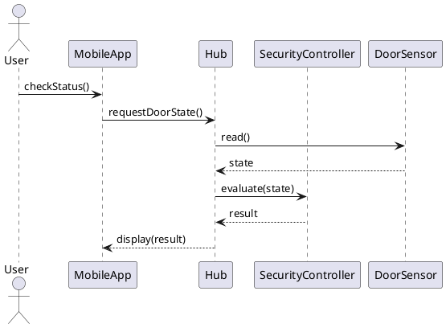

# Overview

**Total time:** 100 minutes  
**Format:** 50 min (Session 1) → 10 min break → 50 min (Session 2)  
**Includes:** Tool examples + interactive exercises

**Goal:** Learn how to evaluate, validate, verify, and test UML models using structured techniques and common tools.

---

# Agenda

1. Why evaluate UML models?  
2. Model quality criteria  
3. Static evaluation techniques  
4. UML conformance checking  
5. Break (10 minutes)  
6. Model simulation & execution tools  
7. Testing scenarios and behavioral models  
8. Interactive exercises

---

# Session 1 (50 minutes)

## 1. Why Evaluate UML Models? (10 minutes)

- Models are abstractions → may be ambiguous or incomplete
- Early detection of design problems reduces cost
- Ensures consistency across the system architecture
- Supports automated transformations and code generation

**Evaluation dimensions:**
- Consistency
- Completeness
- Correctness
- Usability
- Maintainability

---

## 2. UML Model Quality Criteria (10 minutes)

### **Semantic quality**
- Are the diagrams logically correct?
- Do they represent valid domain concepts?

### **Syntactic quality**
- Do diagrams follow the UML meta-model?
- Are constructs used properly?

### **Pragmatic quality**
- Are diagrams understandable to stakeholders?
- Are they readable and not over‑complex?

---

## 3. Static Evaluation Techniques (15 minutes)

### **Checklist-based evaluation**
Useful for manual reviews.  
**Typical questions:**
- Do all classes have well-defined responsibilities?  
- Are associations properly navigable?  
- Are sequence diagrams consistent with class diagrams?

### **Traceability checks**
- Requirements → Use cases → Sequence diagrams → Classes
- Detect missing or redundant elements

### **Cross-diagram consistency checks**
- Messages in sequence diagrams correspond to operations in classes
- State diagram transitions match methods/events

---

## 4. Tools for UML Consistency Checking (10 minutes)

### **1. Model validation inside modeling tools**
- **Papyrus** (Eclipse-based, supports OCL constraints)  
- **MagicDraw / Cameo Systems Modeler**  
- **Enterprise Architect**

These tools can:
- Verify UML meta-model conformance
- Check stereotype/constraint validity
- Detect broken references

### **2. OCL for constraint checking**
- Define invariants on UML models
- Example: All sensors in SmartHome must have an ID:
```ocl
context Sensor inv MustHaveId: self.id <> ''
```

### **3. Static analysis tools**
- **USE (UML-based Specification Environment)**  
  - Executes OCL constraints
  - Generates object diagrams to validate designs

---

## Interactive Exercise (Session 1 – 5 minutes)

**Task:** In pairs, look at the following class diagram (simplified Smart Home) and identify **3 possible inconsistencies**.

```
TemperatureSensor -- HeatingController : reads
TemperatureSensor -- Hub : reportsTo
HeatingController -- Hub : controls
DoorSensor -- HeatingController : linked
```

Questions:
- Is each association semantically correct?  
- Should DoorSensor really be linked to HeatingController?  
- Are responsibilities properly separated?

---

# Break (10 minutes)

---

# Session 2 (50 minutes)

## 5. Simulation and Execution Tools (15 minutes)

### **1. Sequence diagram execution**
Tools like **IBM Rhapsody**, **Papyrus-RT**, **Cameo Simulation Toolkit** can:
- Animate interactions
- Highlight active lifelines
- Execute state machines

### **2. State machine simulation**
- Visual debugging of transitions
- Event injection
- Coverage measurement (visited states)

### **3. Activity diagram execution**
- Token-based simulation
- Deadlock/livelock detection

---

## 6. Testing Behavioral Models (15 minutes)

### **Model-Based Testing (MBT)**
Use the UML model as the basis for generating tests.

### **From UML to test cases**
- **Sequence diagrams** → Interaction tests
- **State machines** → Transition coverage tests
- **Activity diagrams** → Path tests

### **Tools for MBT**
- **GraphWalker** (model-based test execution)
- **Conformiq Designer** (automated test generation)
- **IBM Rational Tester** (UML integration)

### **State-Based Test Example**
For a DoorSensor state machine:
- States: `Closed`, `Open`, `Alert`
- Transitions: `doorOpened`, `doorClosed`, `alarmTriggered`

Test coverage:
- Visit all states  
- Trigger each transition  
- Evaluate guard conditions

---

## 7. Cross-Model Evaluation (10 minutes)

### Ensure:
- Every event in a state machine appears in a sequence diagram
- Every lifeline in a sequence diagram corresponds to a class
- Every operation message matches a method signature

### Tools supporting this:
- **MagicDraw/Cameo** (robust cross-diagram analyzer)
- **Enterprise Architect** (dependency matrix + traceability)
- **Papyrus** (custom validation rules)

---

## Interactive Exercise (Session 2 – 10 minutes)

**Task:** Using the Smart Home example, design 3 test cases derived from the following sequence diagram:



**Produce:**
1. A list of possible failure points  
2. A state-based test  
3. A message-based consistency check

---

# Wrap‑Up

- Evaluating UML models prevents early design flaws
- Tools support: syntax checking, semantic validation, simulation
- Model-Based Testing connects behavioral diagrams with executable tests

**Homework suggestion:** Pick a UML diagram set (class + sequence + state) and perform a small consistency and test coverage evaluation.

---

