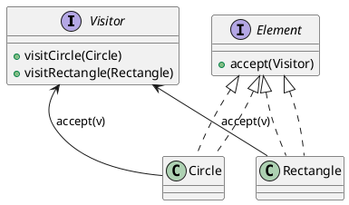
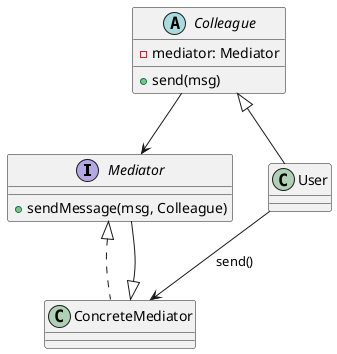
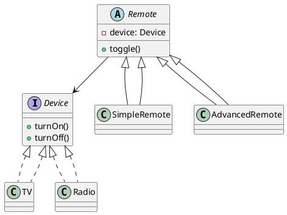
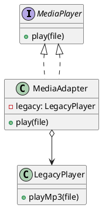
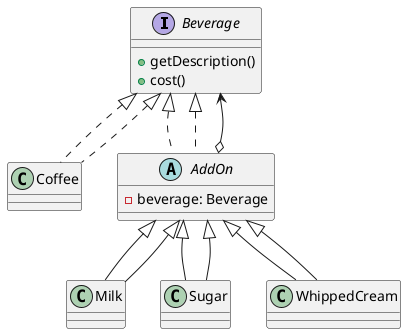
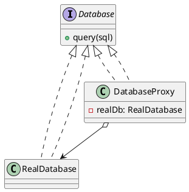
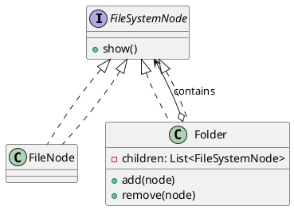
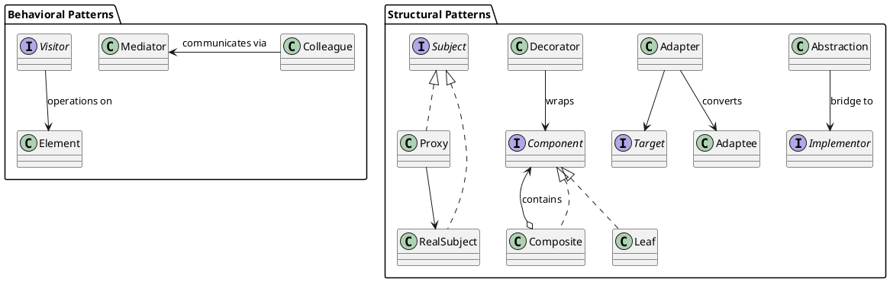

# Agenda

#. Recall
   #. What are Design Patterns?
   #. Classification of Patterns
#. Patterns
   #. **Visitor**
   #. **Mediator**
   #. **Bridge**
   #. **Adapter**
   #. **Decorator**
   #. **Proxy**
   #. **Composite**
#. Wrap-up

---

# What Are Design Patterns?

## Definition

Reusable solutions to common software design problems.

## Origin

Popularized by the “Gang of Four” (Gamma, Helm, Johnson, Vlissides, 1994).

## Purpose

- Provide shared vocabulary
- Improve code maintainability
- Promote reusability and clarity

## Example

Instead of reinventing how to traverse a collection, we apply the **Iterator** pattern.

---

# Pattern Classification

Design patterns are typically grouped into three main categories:

------------------------------------------------------------------------------------------
Category         Description                            Example Patterns                  
--------------   ------------------------------------   ----------------------------------
**Creational**   How objects are created                Builder, Factory, Singleton

**Structural**   How classes and objects are composed   Adapter, Bridge, Composite, Decorator, Proxy        

**Behavioral**   How objects interact and communicate   Visitor, Mediator, State
------------------------------------------------------------------------------------------

---

# Visitor Pattern

## Type
Behavioral pattern

## Intent
Separate an algorithm from the object structure it operates on by allowing new operations without modifying existing classes.

## Problem Solved
How to add new operations to a set of related classes without changing their source code?

## Solution
Define a `Visitor` interface with visit methods for each element type.  
Elements accept a visitor and delegate the operation to it.

---

# Visitor Pattern --- concrete example scenario

## Problem

- You maintain a graphics library containing shapes like Circle and Rectangle.  
- You frequently need to add new operations—such as area calculation, exporting, rendering—  
  - but you want to avoid modifying the existing shape classes every time.  

. . .

## Solution

The Visitor pattern lets you add new operations by creating new Visitor classes,  
while the shapes themselves remain unchanged and simply “accept” visitors.

# Visitor Pattern --- concrete example diagram



# Visitor Pattern --- concrete example code

[Source file](https://github.com/traiansf/traiansf.github.io/blob/main/class/amss2025/curs/code/VisitorPatternDemo.java)

```java
// Element
interface Shape {
    void accept(Visitor v);
}

// Concrete Elements
class Circle implements Shape {
    double radius = 5;
    public void accept(Visitor v) { v.visit(this); }
}

class Rectangle implements Shape {
    double width = 4, height = 3;
    public void accept(Visitor v) { v.visit(this); }
}

// Visitor
interface Visitor {
    void visit(Circle c);
    void visit(Rectangle r);
}

// Concrete Visitor
class AreaCalculator implements Visitor {
    public void visit(Circle c) {
        System.out.println("Circle area = " + Math.PI * c.radius * c.radius);
    }
    public void visit(Rectangle r) {
        System.out.println("Rectangle area = " + r.width * r.height);
    }
}

// Usage
public class Main {
    public static void main(String[] args) {
        Shape[] shapes = { new Circle(), new Rectangle() };
        Visitor areaVisitor = new AreaCalculator();

        for (Shape s : shapes) s.accept(areaVisitor);
    }
}
```

# Visitor Pattern Exercise

## Task

Design a system for processing elements in an online document editor:
Paragraph, Image, and Table.  
Define two possible operations: spell-checking and exporting to HTML.  
Sketch how the Visitor pattern would let you add these operations
without modifying the element classes.

## Goal

Practice identifying when Visitor is useful:  
when new operations must be added independently of existing structures.

---

# Mediator Pattern

## Type
Behavioral pattern

## Intent
Define an object that encapsulates how a set of objects interact, promoting loose coupling.

## Problem Solved
How to reduce direct dependencies and complex communication between many interacting objects?

## Solution
Create a `Mediator` object that centralizes communication logic.  
Colleagues communicate only through the mediator.

# Mediator Pattern --- concrete example scenario

## Problem

In a chat application, every user needs to send messages to others.  

If each user communicated directly with every other user, the system would become  
highly coupled and difficult to maintain.  

. . .

## Solution

The Mediator pattern introduces a central ChatRoom that manages all communication.  

Users send messages through the mediator, drastically simplifying interaction.

# Mediator Pattern --- concrete example diagram



# Mediator Pattern --- concrete example code

[Source file](https://github.com/traiansf/traiansf.github.io/blob/main/class/amss2025/curs/code/MediatorPatternDemo.java)

```java
// Mediator
interface ChatMediator {
    void sendMessage(String msg, User user);
}

// Concrete Mediator
class ChatRoom implements ChatMediator {
    public void sendMessage(String msg, User user) {
        System.out.println(user.getName() + ": " + msg);
    }
}

// Colleague
abstract class User {
    protected ChatMediator mediator;
    protected String name;
    User(String name, ChatMediator mediator) {
        this.name = name; this.mediator = mediator;
    }
    String getName() { return name; }
    abstract void send(String msg);
}

// Concrete Colleague
class ChatUser extends User {
    ChatUser(String name, ChatMediator mediator) { super(name, mediator); }
    void send(String msg) { mediator.sendMessage(msg, this); }
}

// Usage
public class Main {
    public static void main(String[] args) {
        ChatMediator room = new ChatRoom();
        User alice = new ChatUser("Alice", room);
        alice.send("Hello everyone!");
    }
}
```

# Mediator Pattern Exercise

## Task

Imagine a smart home system where devices (lights, thermostat, alarm,
blinds) must coordinate actions (e.g., “away mode”).  
Design a Mediator that centralizes communication so devices do not
directly reference or call each other.  
Outline the mediator role and how devices interact with it.

## Goal

Recognize situations with complex object interactions and apply a mediator
to simplify communication.

---

# Bridge Pattern

## Type
Structural pattern

## Intent
Decouple an abstraction from its implementation so that the two can vary independently.

## Problem Solved
How to avoid a class explosion caused by combining multiple abstractions with multiple implementations?

## Solution
Split abstraction and implementation into separate class hierarchies, connecting them via a bridge interface.


# Bridge Pattern --- concrete example scenario

## Problem

You want to build a universal remote-control system that works with different devices  
like TVs, Radios, and projectors.  

If you directly subclass for every combination (e.g., AdvancedTVRemote, BasicRadioRemote),  
you get class explosion.  

. . .

## Solution

The Bridge pattern separates the abstraction (Remote) from the implementation (Device),  
allowing each to evolve independently and avoiding unnecessary subclasses.

# Bridge Pattern --- concrete example diagram



# Bridge Pattern --- concrete example code

[Source file](https://github.com/traiansf/traiansf.github.io/blob/main/class/amss2025/curs/code/BridgePatternDemo.java)

```java
// Implementor
interface Device {
    void turnOn();
    void turnOff();
}

// Concrete Implementors
class TV implements Device {
    public void turnOn() { System.out.println("TV ON"); }
    public void turnOff() { System.out.println("TV OFF"); }
}

// Abstraction
abstract class Remote {
    protected Device device;
    Remote(Device d) { this.device = d; }
    abstract void toggle();
}

// Refined Abstraction
class SimpleRemote extends Remote {
    private boolean on = false;
    SimpleRemote(Device d) { super(d); }

    void toggle() {
        if (on) device.turnOff();
        else device.turnOn();
        on = !on;
    }
}

// Usage
public class Main {
    public static void main(String[] args) {
        Remote remote = new SimpleRemote(new TV());
        remote.toggle();
        remote.toggle();
    }
}
```

---

# Bridge Pattern Exercise

## Task

You are building a drawing tool with two dimensions of variability:
Shapes (Circle, Rectangle, Line) and Rendering Methods (OpenGL, SVG).  
Explain how to apply the Bridge pattern so all shapes can be rendered
with any rendering method without class explosion.

## Goal

Identify separate dimensions of change and design a usable abstraction/
implementation split.

---

# Adapter Pattern

## Type
Structural pattern

## Intent
Convert the interface of one class into another interface clients expect.

## Problem Solved
How to make incompatible interfaces work together without changing existing code?

## Solution
Create an `Adapter` that wraps an existing class and exposes the desired target interface.

---

## Adapter Pattern --- concrete example scenario

## Problem

Your media application expects a MediaPlayer interface with a play() method,  
but your existing audio engine (LegacyPlayer) only supports playMp3().

You cannot modify the legacy system, but you must integrate it.  

. . .

## Solution

The Adapter pattern wraps the incompatible class and exposes the interface the client expects,  
allowing the two systems to work together seamlessly.

# Adapter Pattern --- concrete example code

[Source file](https://github.com/traiansf/traiansf.github.io/blob/main/class/amss2025/curs/code/AdapterPatternDemo.java)

```java
// Target interface
interface MediaPlayer {
    void play(String file);
}

// Adaptee
class LegacyPlayer {
    void playMp3(String filename) {
        System.out.println("Playing MP3: " + filename);
    }
}

// Adapter
class MediaAdapter implements MediaPlayer {
    private LegacyPlayer legacy = new LegacyPlayer();
    public void play(String file) { legacy.playMp3(file); }
}

// Usage
public class Main {
    public static void main(String[] args) {
        MediaPlayer player = new MediaAdapter();
        player.play("song.mp3");
    }
}
```

# Adapter Pattern --- concrete example diagram



---

# Adapter Pattern Exercise

## Task

A new external weather service provides data in a completely different
format from your current WeatherData interface.  
Design an Adapter that lets your system continue using WeatherData
while seamlessly integrating the new provider.

## Goal

Practice wrapping an incompatible API so existing code works unchanged.

---

# Decorator Pattern

## Type
Structural pattern

## Intent
Attach additional responsibilities to an object dynamically without modifying its class.

## Problem Solved
How to add flexible, combinable features to objects without subclass explosion?

## Solution
Wrap objects with decorator classes that implement the same interface and add behavior before/after delegating calls.

---

# Decorator Pattern --- concrete example scenario

## Problem

A beverage ordering system needs to allow customers to add ingredients  
like milk, sugar, or whipped cream to drinks.  

Creating a subclass for every combination (CoffeeWithMilkAndSugar, etc.)  
would cause a combinational explosion.  

. . .

## Solution

The Decorator pattern lets you dynamically wrap beverages with add-ons,  
mixing and matching features without modifying existing code.

---

# Decorator Pattern --- concrete example diagram



---

# Decorator Pattern --- concrete example code

[Source file](https://github.com/traiansf/traiansf.github.io/blob/main/class/amss2025/curs/code/DecoratorPatternDemo.java)

```java
// Component
interface Beverage {
    String getDescription();
    double cost();
}

// Concrete Component
class Coffee implements Beverage {
    public String getDescription() { return "Coffee"; }
    public double cost() { return 2.0; }
}

// Decorator
abstract class AddOn implements Beverage {
    protected Beverage beverage;
    AddOn(Beverage b) { beverage = b; }
}

// Concrete Decorators
class Milk extends AddOn {
    Milk(Beverage b) { super(b); }
    public String getDescription() { return beverage.getDescription() + ", Milk"; }
    public double cost() { return beverage.cost() + 0.5; }
}

// Usage
public class Main {
    public static void main(String[] args) {
        Beverage coffee = new Milk(new Coffee());
        System.out.println(coffee.getDescription() + " = $" + coffee.cost());
    }
}
```

::: notes
Explain how Factory Method allows adding new document types without changing the client code.
:::

# Decorator Pattern Exercise

## Task

Consider an online text editor where users can apply features such as:
Bold, Italic, Underline, Syntax Highlighting.  
Describe how you could use Decorators to apply multiple text styles to
a plain Text object at runtime, without creating many subclasses.

## Goal

Think about dynamic composition of responsibilities using decorators.

---

# Proxy Pattern

## Type
Structural pattern

## Intent
Provide a surrogate or placeholder for another object to control access to it.

## Problem Solved
How to manage access to a resource-heavy or remote object (e.g., lazy loading, caching, security)?

## Solution
Implement a proxy that implements the same interface as the real subject and controls access before forwarding requests.

---

# Proxy Pattern --- concrete example scenario

## Problem

Accessing a real database connection is slow and expensive.  

However, you only need the actual connection when a query is executed.  

. . .

## Solution

The Proxy pattern allows you to create a DatabaseProxy that delays  
the creation of the RealDatabase until it's truly needed (lazy loading),  
controlling access and improving performance.

---

# Proxy Pattern --- concrete example diagram



---

# Proxy Pattern --- concrete example code

[Source file](https://github.com/traiansf/traiansf.github.io/blob/main/class/amss2025/curs/code/ProxyPatternDemo.java)

```java
// Subject
interface Database {
    void query(String sql);
}

// Real Subject
class RealDatabase implements Database {
    public RealDatabase() {
        System.out.println("Connecting to database...");
    }
    public void query(String sql) {
        System.out.println("Executing query: " + sql);
    }
}

// Proxy
class DatabaseProxy implements Database {
    private RealDatabase db;

    public void query(String sql) {
        if (db == null) db = new RealDatabase(); // lazy initialization
        db.query(sql);
    }
}

// Usage
public class Main {
    public static void main(String[] args) {
        Database db = new DatabaseProxy();
        db.query("SELECT * FROM users");
    }
}
```

---

# Proxy Pattern Exercise

## Task

Your application accesses remote image files stored on a cloud server.
Design a Proxy that loads the actual image only when it is displayed
(for example, when scrolling in a gallery).  
Describe the responsibilities of both the proxy and the real image.

## Goal

Identify opportunities for lazy loading, access control, and indirection.

---

# Composite Pattern

## Type
Structural pattern

## Intent
Compose objects into tree structures to represent part–whole hierarchies.

## Problem Solved
How to treat individual objects and groups of objects uniformly?

## Solution
Define a common component interface.  
Leaf objects implement base behavior; composite objects store children and delegate operations recursively.

---

# Composite Pattern --- concrete example scenario

## Problem

You want to represent a hierarchical file system where folders can contain  
both files and other folders.  

Clients should treat individual files and folder groups uniformly  
(e.g., calling show() on either should work).  

. . .

## Solution

The Composite pattern allows you to build tree structures in which  
both leaf nodes (files) and composite nodes (folders) share the same interface.

---

# Composite Pattern --- concrete example scenario



---

# Composite Pattern --- concrete example code

```java
// Component
interface FileSystemNode {
    void show();
}

// Leaf
class FileNode implements FileSystemNode {
    private String name;
    FileNode(String name) { this.name = name; }
    public void show() { System.out.println("File: " + name); }
}

// Composite
class Folder implements FileSystemNode {
    private String name;
    private java.util.List<FileSystemNode> children = new java.util.ArrayList<>();

    Folder(String name) { this.name = name; }

    public void add(FileSystemNode node) { children.add(node); }

    public void show() {
        System.out.println("Folder: " + name);
        for (FileSystemNode child : children) child.show();
    }
}

// Usage
public class Main {
    public static void main(String[] args) {
        Folder root = new Folder("root");
        root.add(new FileNode("file1.txt"));

        Folder sub = new Folder("subfolder");
        sub.add(new FileNode("file2.txt"));
        root.add(sub);

        root.show();
    }
}
```

# Composite Pattern Exercise

## Task

You are modeling hierarchical UI components: Buttons, Labels, TextFields,
and Containers that hold other components.  
Explain how the Composite pattern allows you to treat every UI element
uniformly (e.g., calling render() or resize()).  
Sketch the component interface and the composite structure.

## Goal

Understand how to represent part–whole hierarchies with recursive
composition and uniform treatment.

# Wrap-Up

## Key Insights

- **Visitor** – Add new operations to existing class hierarchies *without modifying them*  
  by externalizing behavior into Visitor objects.

- **Mediator** – Reduce tangled, many-to-many communication by centralizing  
  interaction logic inside a mediator object.

- **Bridge** – Separate abstraction from implementation to avoid class explosion  
  and allow both sides to vary independently.

- **Adapter** – Make incompatible interfaces work together by wrapping one interface  
  to match the expectations of another.

- **Decorator** – Dynamically add responsibilities or behavior to objects at runtime  
  without subclassing or modifying original classes.

- **Proxy** – Control or enhance access to another object (lazy loading, security, caching)  
  without changing the real object.

- **Composite** – Represent part–whole hierarchies and treat individual items  
  and groups uniformly through a shared component interface.

# Wrap-up diagram


