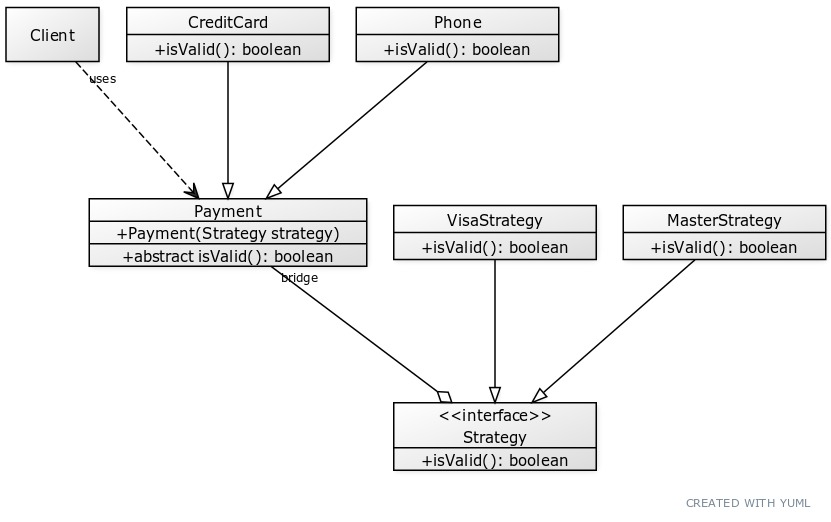
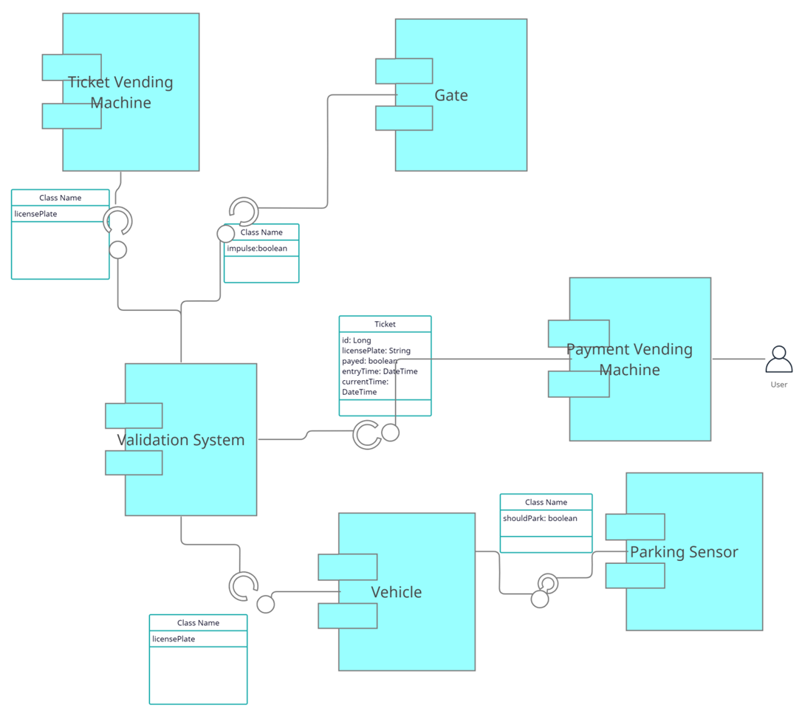

# Agenda

- Get to know
- Laboratory structure
- General Presentation

---

# Introduction

**Subject:** Software System Modeling

- UML Diagrams, Modeling, Design Patterns, etc.

**Requirements:**

- To be active
- Attendance is not mandatory
- Evaluation based on team project

---

# Who we are

**About me:**

- Traian Șerbănuță
- associate professor @ [UNIBUC](https://cs.unibuc.ro/~tserbanuta)
- research consultant @ [Pi Squared Inc.](https://pi2.network/)
- I like programming languages. I was paid for using the following
  - regular: Java, C++, Python, Rust, Haskell
  - esoteric: [The K Framework](https://kframework.org), [Rocq](https://rocq-prover.org), [Circom](https://docs.circom.io)

**About you:**

- Name
- Professional interests
- Fun fact

---

# Tools

- [PlantUML](https://editor.plantuml.com/) (also available as VSCode extension)
- [Mermaid](https://mermaid-js.github.io/) (works well with Github)
- [Lucidchart](https://www.lucidchart.com/)
- [Web Sequence Diagrams](https://www.websequencediagrams.com/)
- [yUML](https://yuml.me/)
- [Diagrams.net](https://app.diagrams.net/)

---

# UML

- UML is **not a process of designing solutions**
- It is a way of communicating designs **independent of programming languages**
- UML 2 has many diagram types, divided into:
  - **Structural diagrams**
  - **Behavior diagrams** (including interaction aspects)

---

---

# Poll

:::::::::::::: {.columns}
::: {.column width="40%"}
**What type of diagram is presented?**

- Class
- Package
- Interaction
- Use case
:::
::: {.column width="60%"}

:::
::::::::::::::

---

# **Answer:** Class diagram

- Backbone of object-oriented modeling
- Shows how different entities relate to each other (static structure)
- Purposes:
  - Analysis and design of static view of an application
  - Describe responsibilities of a system
  - Base for component and deployment diagrams
  - Forward and reverse engineering

---

# Poll

:::::::::::::: {.columns}
::: {.column width="40%"}
**What type of diagram is presented?**

- State machine
- Interaction
- Component
- Use case
:::
::: {.column width="60%"}

:::
::::::::::::::

---

# **Answer:** Component diagram

- Focuses on **system’s components**
- Models **static implementation view**
- Breaks down system into high-level functionalities
- Each component has a clear aim and interacts minimally with others

---

# Exercise: Parking Lot Design

**Goal:** Design a parking lot using class diagrams.

**Steps:**

1. Gather product requirements (make reasonable assumptions).
2. Eliminate confusion and clarify.
3. Draw class hierarchy diagram.
4. Ignore scalability/performance issues.

---

# Parking Lot Requirements

- Multiple floors for parking cars
- Multiple entry and exit points
- Payment options:
  - Automated exit panel
  - Parking attendant
  - Info portal on each floor (cash & credit cards)
- If paid at info portal → no need to pay at exit
- System should enforce max capacity
- If full → show message at entrance + display board on ground floor
- Multiple parking spot types: Compact, Large, Handicapped, Motorcycle, etc.
- Electric car spots with charging + payment panel
- Support multiple vehicle types: car, truck, van, motorcycle, etc.
