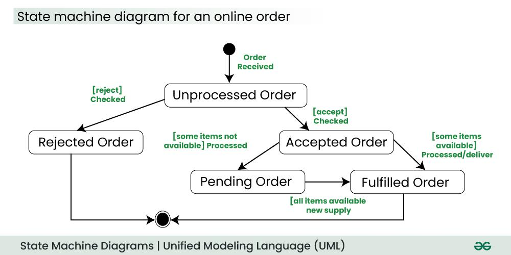
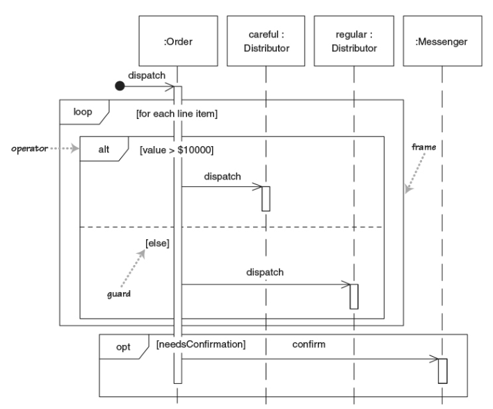

## Agenda

UML behavioral diagrams

Sequence diagrams

---

## Behavior diagrams

### Purpose

- individual aspects of a system and their changes are displayed at runtime.
- provide clarity about internal processes, business processes or the interaction of different systems.

### Elements and relationships

- elements resemble verbs in a natural language
- relationships typically convey passage of time

### Example

Elements of a behavioral diagram of a vehicle reservation system

- Make a Reservation
- Rent a Car
- Provide Credit Card Details.

# Types of behavioral diagrams

## Sequence Diagrams

How –and in what order– a group of objects works together.

:::::::::::::: {.columns}
::: {.column width="50%"}

Also known as

- event diagrams
- event scenarios

Used by both software developers and business professionals, to

- understand new requirements
- document existing processes
:::
::: {.column width="50%"}

:::
::::::::::::::

---

## Activity diagrams

:::::::::::::: {.columns}
::: {.column width="40%"}
Model

- behaviors of a system

- how these are related

  (in the overall flow of the system).

Activities can be:

  - sequential,
  - branched
  - concurrent.
:::
::: {.column width="60%"}

:::
::::::::::::::

---

## Use case diagrams

Model users interacting with the system

- Users: stick figures called "actors"
- high-level overview  of relationships between actors and systems
- explain system to non-technical audience

---

## Timing diagrams

Powerful tools for making a system as efficient as possible.

- define the behavior of different objects within a time-scale
- represent objects changing state and interacting over time.

---

## Communication diagrams

Model how components communicate and interact

:::::::::::::: {.columns}
::: {.column width="45%"}

- like sequence diagrams
- but focus on interaction
- program communication

Useful for

- businesses
- organization
- engineers
:::
::: {.column width="55%"}

:::
::::::::::::::

---

## Interaction Overview diagrams

Activity diagram where nodes are interaction diagrams

:::::::::::::: {.columns}
::: {.column width="45%"}
Diagrams used as nodes

- sequence
- communication
- interaction overview
- timing
:::
::: {.column width="55%"}
{height=80%}
:::
::::::::::::::

---

## State Diagram

Useful for representing state machines.

- describing all possible states of objects
  - combinations of information that an object can hold
  - __not__ how the object behaves.
- how state changes through actions/inputs

# Sequence Diagrams

## Sequence Diagrams

How –and in what order– a group of objects works together.

:::::::::::::: {.columns}
::: {.column width="50%"}

Also known as

- event diagrams
- event scenarios

Used by both software developers and business professionals, to

- understand new requirements
- document existing processes
:::
::: {.column width="50%"}

:::
::::::::::::::

---

## Use cases for sequence diagrams

### Usage scenario

Draw a diagram of how your system could be used.

- ensures thinking about the logic of every usage scenario.

### Method logic

Explore the logic of any function, procedure, or complex process.

### Service logic

Viewing a service as a high-level method used by different clients.

---

## Sequence diagram symbols and components

:::::::::::::: {.columns}
::: {.column width="50%"}

:::
::: {.column width="50%"}

:::
::::::::::::::

---

  * __Common message symbols__

-----------------------------------------------------------------------------------------------------------------------------------------------------------------------------------------
                      Symbol                         Name                                                   Description
-------------------------------------------------    ---------------------------------------------------    -----------------------------------------------------------------------------
    Synchronous message                                    sender waits for response before it continues

    Asynchronous message                                   don't require response before continuing.
                                                                                                            Only the call should be included in the diagram

    Create message                                         creates a new object
                                                     (asyncronously)

    Reply message                                          replies to calls

    Delete message                                         destroys an object
-----------------------------------------------------------------------------------------------------------------------------------------------------------------------------------------

---

## Sequence diagram example

{height=90%}

---

## Exercise

Model (using a sequence diagram) the possible scenarios of a __Customer__ purchasing a __Product__ using an online shopping system:

A _Customer_ browses/searches the _Catalog_, adds and/or removes _Products_ into a _Cart_ (updating the stocks), then goes to a _Checkout_ page which  gets its credentials from a _Login_ (which verifies/requires that the user is logged in), allows it to select payment/shipping info, and returns to the customer an order number to allow tracking the order.
