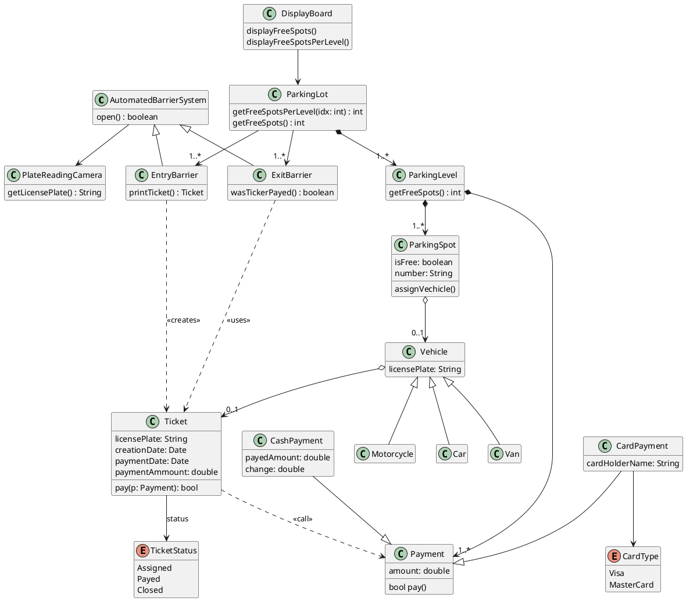
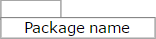
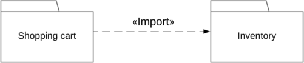
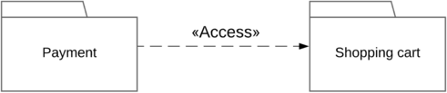
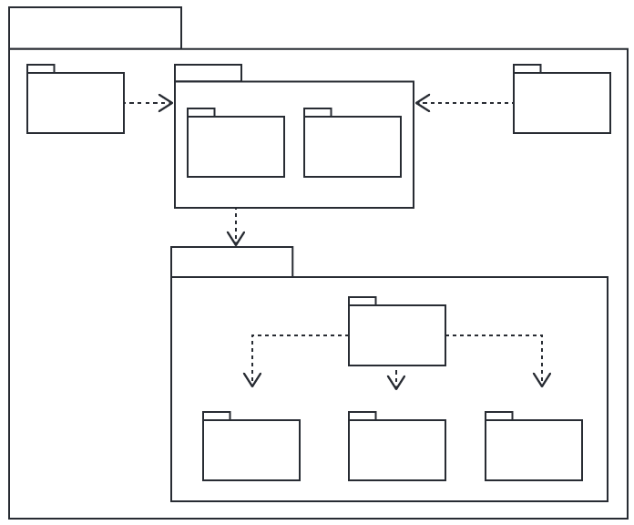
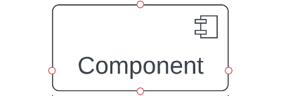

# Agenda

- Class diagrams  
- Package diagrams  
- Component diagrams  

---

# Tools

- [Lucidchart](https://www.lucidchart.com/) — component and package diagrams  
- [Mermaid.js](https://mermaid-js.github.io/) — class diagrams  

---

# Parking Lot Exercise

**Scenario:** Airport parking lot  

- Contains multiple levels
- Sensors at each parking slot to detect if a slot is free or not  
- Multiple entrances and exits
- By the entrances there are displays showing:
  - Total free spots  
  - Free spots per level
- Both entrance and exit have cameras that reads license plates  
- Entrance generates a ticket
- Exit Opens the barrier if the ticket was paid
- Multiple payment kiosks on each level  
- Payment can be made with **cash** or **credit card**  

---

---

# Package Diagram

- A **package** is a collection of logically related UML elements.  

  - Simplify complex class diagrams by grouping classes into *packages*.  

Package diagrams are commonly used to:

- Provide a visual organization of layered architecture  
- Represent logical structure within UML classifiers (like software systems)  

--------------------------------------------------------------------------------------------------------------------------------------------------------
Symbol                     Name                                   Description
-------------------------- ------------------------------------   --------------------------------------------------------------------------------------
    Package                                Groups common elements based on data, behavior, or user interaction

 Dependency                             Depicts the relationship between one element (package, named element, etc) and another
--------------------------------------------------------------------------------------------------------------------------------------------------------

---

# Dependencies in Package Diagrams

There are two main types of dependencies between packages:

1. **Import dependency** — allows access to all public elements of another package
   

2. **Access dependency** — limits access to specific elements only
   

---

---

# Exercise

Create a **package diagram** based on the **class diagram for the parking lot**.

---

# Component Diagrams

- Specialized class diagrams that focus on a system’s **components**.  

- Used to model the **static implementation view** of a system.  

-------------------------------------------------------------------------------------------------------------------------------------------------
Symbol                    Name                                   Description
------------------------- -----------------------------------    --------------------------------------------------------------------------------
 Component                              Modular part of a system that encapsulates its contents and whose manifestation
                                                                 is replaceable within its environment

  Required interface                     Represents the services needed/used by the component

  Provided interface                     Represents the services delivered by the component
-------------------------------------------------------------------------------------------------------------------------------------------------

---

# Exercise

Create a **component diagram** based on the **class diagram for the parking lot**.
