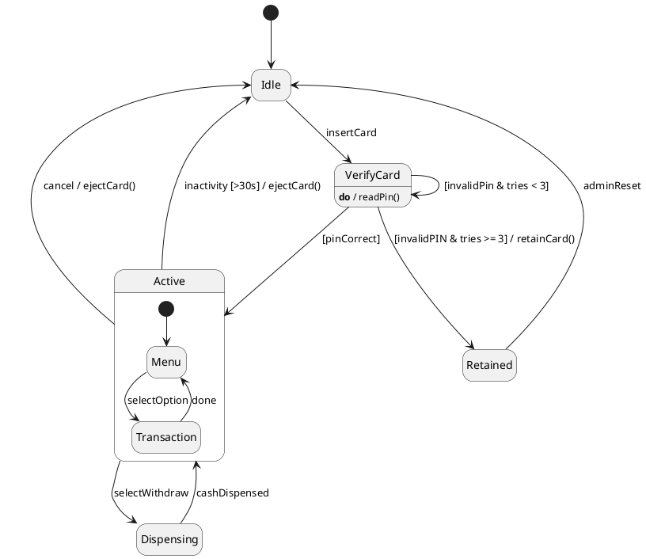
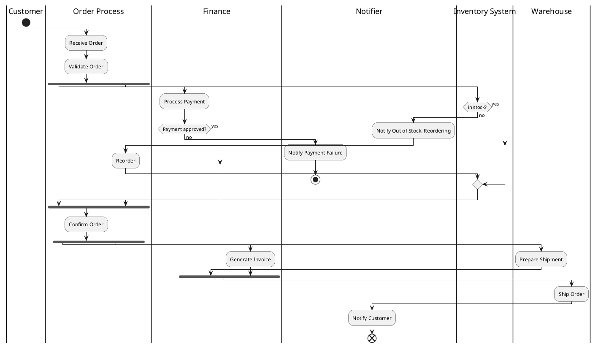

# Agenda

1. **Introduction**

   - Quick overview of UML behavioral modeling
   - State vs. Activity diagrams
   - How we’ll work today

2. **Hands-on Problem 1**

   - UML **State Diagram**

3. **Hands-on Problem 2**

   - UML **Activity Diagram**

---

# Quick Refresher: UML Behavioral Diagrams

## State Diagrams

- Show how an object changes state in response to events.
- Best for describing life cycle of a single entity.
- Components: *states, transitions, events, guards, actions.*

## Activity Diagrams

- Show workflows — control and data flow between activities.
- Best for modeling system or process behavior.
- Components: *activities, decisions, merges, forks, joins, swimlanes.*

---

# Example: State Diagram (ATM Card)

---

# Example: Activity Diagram (Order Processing)

---

# Problem 1 — State Diagram

Design a **UML State Diagram** for an electronic smart lock with keypad and mobile app control.

## Description

- The lock can be *Locked* or *Unlocked*.
- Unlocking may occur via *Keypad*, *Mobile App*, or *Emergency Override*.
- After 30 seconds of being unlocked, it auto-locks.
- If incorrect PIN is entered 3 times, the lock goes into *Alarm* state.
- From *Alarm*, only an *Admin Reset* can restore normal operation.
- If the battery runs low, the system enters a *Low Power* mode, disabling app control.

---

# Problem 1 — State Diagram

## Requirements

- Identify all relevant states and transitions.
- Include guards and actions where appropriate.
- Indicate events triggering transitions (e.g., *PIN entered*, *Timeout*, *Low battery*).
- Use notation for composite or concurrent states if applicable.

## Deliverable

An UML state diagram with

- States and transitions
- Events and actions
- Guards/conditions
- Optional: entry/exit behaviors

---

# Problem 2 — Activity Diagram

Model the workflow of a **food ordering system** using an **Activity Diagram**.

## Actors/Swimlanes

- Customer
- Restaurant
- Delivery Service

## Process Flow

1. Customer browses menu and places an order.
2. System verifies payment.
   - If payment fails → notify customer → end.
3. Order sent to restaurant.
4. Restaurant confirms order and begins preparation.
5. Once food is ready, restaurant requests pickup.
6. Delivery service assigns driver and picks up food.
7. Driver delivers order to customer.
8. Customer confirms receipt → system updates order as *Completed*.

---

# Problem 2 — Activity Diagram

## Additional Behaviors:

- Parallel actions: *Restaurant prepares food* and *Delivery service assigns driver* can overlap.
- Cancellation: Customer can cancel order before preparation starts.
- Exception: If restaurant rejects order → refund → notify customer.

## Deliverable

An UML activity diagram with:

- Swimlanes (Customer, Restaurant, Delivery)
- Decisions, forks, joins
- Exception and cancellation flows

---

# Thank You!

Questions?
