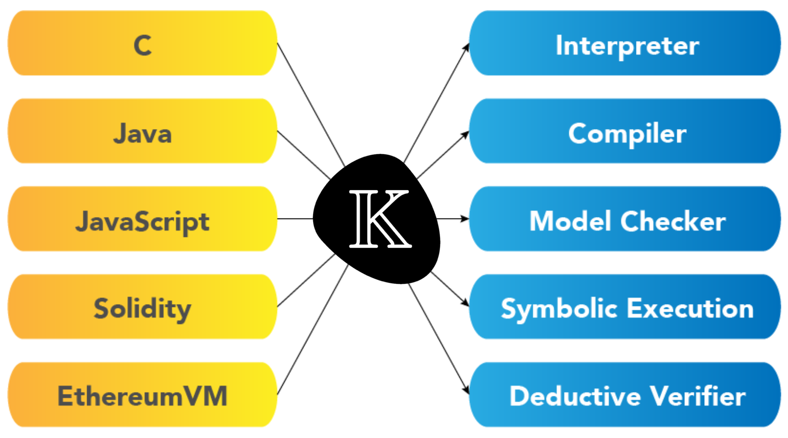

## Thanks and Credits

- Grigore Roșu
  - for K, Reachability Logic, Matching Logic
- Andrei Ștefănescu 
  - for the first implementation of Reachability Logic
- Brandon Moore and Ștefan Ciobâcă
  - for the formalization of Reachability Logic  in Coq
- the Haskell Backend team at RV
  - esp. to Ana Pantilie for letting me "borrow" her sildes and demos
- Dorel Lucanu and Andrei Arusoaie
  - for their work on formalizing parts of the things described here
- Xiaohong Chen and Virgil Șerbănuță
  - for the particular algorithm described here

# Why K?

## K is a language-independent framework

{ height=80% }

## Advantages of K

- K semantics are operational
  - the interpretor _is_ the definition
  - the definition can be tested
- K semantics are minimalistic
  - write as little as possible to describe behavior
  - usually a syntax definition and 1-2 rules for construct
- K was designed to empower software engineers to specify languages
- K has been succesfully used to tackle large real lanugages
- K is grounded in a logic (Matching Logic)
  - language definitions are theories consisting of axioms
  - execution and reasoning rules are language independent

## A basic K definition

### Basic Ingredients

- Syntax for the language constructs
  - with _strictness_ annotations for evaluation
  ```k
  syntax Stmt ::= Id "=" AExp ";"  [strict(2)]
  ```
- Structure and initialization of the running configuration
  ```k
  configuration <T color="yellow">
                <k color="green"> $PGM:Pgm </k>
                <state color="red"> .Map </state>
                </T>
  ```
- Rules tell how an immediate execution step should occur 
  ```k
  rule <k> X:Id => I ...</k>
       <state>... X |-> I ...</state>
  ```
- possibly structural axioms defining helping functions

## Demo: imp.k {frameoptions="final"}

# Why Reachability Logic?

## Reachability Logic is simple

### It is a just an extension of the K operational semantics
```k
  claim <k>
          if (a <= b) { max = b; } else { max = a; }
          => .K
        </k>
        <state>
          a   |-> A:Int
          b   |-> B:Int
          max |-> (_ => ?M:Int)
        </state>
    ensures
      (A >=Int B andBool ?M ==Int A)
      orBool (B >=Int A andBool ?M ==Int B)
```

## Pre/Post condition. Partial correctness

- Starting  from a state matching
  ```k
  <k> if (a <= b) { max = b; } else { max = a; } </k>
  <state> a |-> A:Int  b |-> B:Int  max |-> _ </state>
  ```
  - with no precondition
- *any* _terminating_ execution will eventually reach a state matching
  ```k
  <k> .K </k>
  <state> a |-> A:Int  b |-> B:Int  max |-> ?M:Int </state>
  ```
  - for some `?M`, satisfying the postcondition
    ```k
    (A >=Int B andBool ?M ==Int A) orBool (B >=Int A andBool ?M ==Int B)
    ```

## Proving reachability claims

### Mostly doing symbolic execution of the program from the given state
  - until the target state is reached on all possible paths
  - computing the strongest postcondition (Floyd/forward Hoare, Dijkstra)
  - checking that the strongest postcondition implies the _ensures_ condition

### Handling loops

- Using additional claims to summarize loops and recursive behavior
  - resembling invariant annotations in Hoare Logic
- Using claims to prove themeselves in a coinductive fashion
  - hence proving only _partial_ correctness 

## The RL proof system (I)


## The RL proof system (II)


# Demo: looking into how a claim is proven

## Loop summarization (invariant) claim
```k
claim
    <k>
      while (!(n <= 0)) {
        sum = sum + n;
        n = n + -1;
      }
    =>
      .K
    ...</k>
  <state>
      n   |-> (N:Int => 0)
      sum |-> (S:Int => S +Int ((N +Int 1) *Int N /Int 2))
  </state>
requires N >=Int 0
```

## After one step of symbolic execution

```k
  <T>
    <k>
      if ( ! n <= 0 ) { { sum = sum + n ; n = n + -1 ; }
        while ( ! n <= 0 ) { sum = sum + n ; n = n + -1 ; } 
      } else { } ~> _DotVar2:K
    </k>
    <state>
      n |-> N:Int
      sum |-> S:Int
    </state>
  </T>
#And
    true #Equals N:Int >=Int 0
```

## After 9 more steps

```k
  <T>
    <k>
      if ( notBool N:Int <=Int 0 ) { { sum = sum + n ; n = n + -1 ; }
        while ( ! n <= 0 ) { sum = sum + n ; n = n + -1 ; } 
      } else { } ~> _DotVar2:K
    </k>
    <state>
      n |-> N:Int
      sum |-> S:Int
    </state>
  </T>
#And
    true #Equals N:Int >=Int 0
```

- separate rules for if whether the condition is _true_ or _false_
- the symbolic execution needs to branch

## The branch where the condition is _false_ is proven

- after one extra step
```k
  <T>
    <k> _DotVar2:K </k>
    <state> n |-> N:Int sum |-> S:Int </state>
  </T>
#And
    true #Equals N:Int <=Int 0 #And true #Equals N:Int >=Int 0
```

- matches the final state; and the strongest postcondition 
  ```k
  true #Equals N:Int <=Int 0 #And true #Equals N:Int >=Int 0
  ```
  implies the condition generated by unification
  ```k
  N:Int #Equals 0 #And S:Int #Equals S +Int ((N +Int 1) *Int N /Int 2)
  ```

## The branch where the condition is _true_

```k
  <T>
    <k>
      { sum = sum + n ; n = n + -1 ; }
      while ( ! n <= 0 ) { sum = sum + n ; n = n + -1 ; } 
      ~> _DotVar2:K
    </k>
    <state>
      n |-> N:Int
      sum |-> S:Int
    </state>
  </T>
#And
    false #Equals N:Int <=Int 0
#And
    true #Equals N:Int >=Int 0
```

## Then, after 31 more steps
```k
  <T>
    <k>
      while ( ! n <= 0 ) { sum = sum + n ; n = n + -1 ; } ~> _DotVar2:K
    </k>
    <state>
      n |-> N:Int +Int -1
      sum |-> S:Int +Int N:Int
    </state>
  </T>
#And false #Equals N:Int <=Int 0 #And true #Equals N:Int >=Int 0
```

- we have an instance of the starting claim
  - with substitution
    ```k
    N':Int #Equals N:Int +Int -1 #And S':Int #Equals S:Int +Int N:Int
    ```
  - such that the above post-condition 
    implies the precondition of the claim
    ```k
    true #Equals N':Int >=Int 0
    ```

## Coinductively apply the claim to discharge path

```k
  <T>
    <k> _DotVar2:K </k>
    <state>
      n |-> 0
      sum |-> S:Int +Int N:Int +Int N:Int *Int ( N:Int +Int -1 ) /Int 2
    </state>
  </T>
#And false #Equals N:Int <=Int 0
#And true #Equals N:Int +Int -1 >=Int 0
#And true #Equals N:Int >=Int 0
```

- The configuration matches the final configuration
  - with the unifying substitution
    ```k
    S:Int +Int N:Int +Int N:Int *Int ( N:Int +Int -1 ) /Int 2
      #Equals S +Int (N +Int 1) *Int N /Int 2
    ```
    which is provable using integer arithmetic

# Implementation concerns

## Algorithm sketch

*Input:* set of claims to be proven together

*Output:* success or unprovable claim

### While there are claims left to prove
- select a claim $i \wedge r \Rightarrow \exists z, f \wedge e$
  - where $i, f$ are terms; and $r, e$ are predicates
- reduce $i$ and $r$ as much as possible using built-in and structural axioms
- remove part of the hypothesis for which the conclusion already holds
- if $r$ is unsat, then remove claim (trivially true) and continue
- else try to advance using any of the original claims distinct from selected claim
  - if possible, replace goal with resulting derived goals
  - else try to _advance claim a step on all paths_
    - if not stuck, replace goal with obtained derived goals
    - if stuck, give up (cannot prove goal)

## Removing conclusion from the hypothesis

*Input:* a claim $i \wedge r \Rightarrow \exists z, f \wedge e$

*Output:* a goal with strengthened _requires_ ensuring the conclusion does not hold in the initial state

- $i$ and $f$ unify with substitution $\theta$ and unification predicate $up$
- and if $r \wedge \theta(up) \wedge \theta(e)$ is satisfiable
- replace $r$ with $r \wedge \neg \theta(up) \wedge \neg \theta(e)$
- otherwise return the goal unchanged

## Advancing the proof using one of the original claims

*Input:* a claim $i \wedge r \Rightarrow \exists z, f \wedge e$

*Output:* a set of derived claims or _not possible_

- For any of the original claims, say $oi \wedge or \Rightarrow \exists oz, of \wedge oe$
  - distinct from the selected claim, such that
  - $oi$ and $i$ unify with substitution $\theta$ 
    and unification predicate $up$
  - and such that $r \wedge \theta(up)$ implies $\theta(or)$
  - break from loop and return a set with two claims
    - $\theta(of) \wedge r \wedge \theta(up) \wedge \theta(oe) \Rightarrow \exists z, f \wedge e$; and
    - the residual
      $i \wedge r \wedge (\neg \theta(up) \vee \theta(up) \wedge \neg \theta(or))\Rightarrow \exists z, f \wedge e$
- else return _not possible_

## Advancing a step on all paths
*Input:* a claim $i \wedge r \Rightarrow \exists z, f \wedge e$

*Output:*
- either a set _Der_ of derived claims, initially empty;
- or a satisfiable predicate _stuck_ describing stuck configurations matching $i$, initially $r$

- For each one step rules in the semantics
  - say of the form $oi \wedge or \Rightarrow^1 of \wedge oe$, such that
  - $oi$ and $i$ unify with substitution $\theta$ and unification predicate $up$
  - such that $r \wedge \theta(up)$ implies $\theta(or)$
  - $Der \leftarrow Der \cup \{\theta(of) \wedge r \wedge \theta(up) \wedge \theta(oe) \Rightarrow \exists z, f \wedge e\}$
  - $stuck \leftarrow stuck \wedge (\neg \theta(up) \vee \neg \theta(or))$
- Finally, if _stuck_ is satisfiable, then return _stuck_
- else return _Der_

## Final considerations and conclusion

- Reachability Logic (Symbolic execution + Circular Coinduction) can be succesfully employed to prove partial correctness
- Implementing a _sound_ verification algorithm for all-path reachability is challenging
  - one must always find the most general unifier, sometimes modulo structural axioms
  - the specification must ensure coherence between execution and structural axioms
- to certify proofs one must first be able to certify the above.

## Thank you {frameoptions="final"}