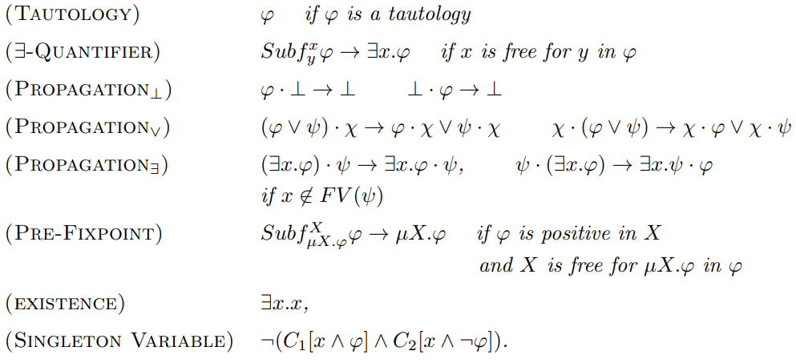
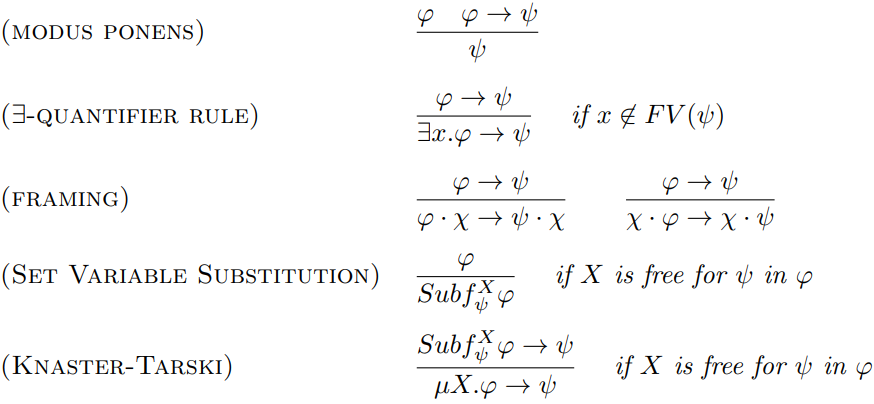

## Overview of the talk

- (yet another) Introduction to matching logic
- Efforts on machine-formalizing matching logic
- The matching logic in Lean project
- My matching logic in Coq exercise
- A shallow embedding of ML in Coq
  - as a semantic theory on sets

# Introduction to (applicative) matching logic

## What is (applicative) matching logic

### Motivation

- Introduced to help with deductive verification of program executions in the $\mathbb K$ framework
  - for reasoning about the structure (e.g., memory, call stack, ...)
- Gradually refined into a general-purpose logic
  - meant to serve as a mathematical basis for the entire $\mathbb K$ framework

### Features

- Formulæ, named __patterns__, are interpreted as sets
  - allows mixing structure and logical constraints
- Supports fixpoints
  - allows to define and reason about reachability / program executions
  - allows defining inductive datatypes

## Matching logic syntax

$$
\varphi \mathrel{::=} x \mid X
\mid \varphi \longrightarrow \varphi' \mid \exists x . \varphi \mid \mu X . \varphi
\mid \sigma \mid \varphi \cdot \varphi' \mid
$$

Structural
: element variables ($x$); constant symbols ($\sigma$); application ($\varphi \cdot \varphi'$)

Logical
: set variables ($X$); logical implication ($\varphi \longrightarrow \varphi'$); existential quantification ($\exists x . \varphi$)

Fixpoints
: least fixpoint ($\mu X . \varphi$)

### Derived connectives
- false ($\bot := \mu X . X$); negation ($\neg \phi := \phi \longrightarrow \bot$); true ($\top := \neg \bot$)
- disjunction ($\phi \vee \phi' := \neg \phi \longrightarrow \phi'$); conjunction ($\phi \wedge \phi' := \neg (\neg \phi \vee \neg \phi')$)
- universal quantification ($\forall x . \phi := \neg\exists x. \neg \phi$)

## Structures and Valuations

- A _structure_ $\mathcal{A}$ consists of a carrier set $A$ and
  - an interpretation $\sigma^{\mathcal{A}} \subseteq A$ for any constant $\sigma$
  - an interpretation of the application as a function $\_ \star \_ : A \times A \rightarrow 2^A$
- A _valuation_ (of variables) into structure $\mathcal{A}$ consists of
  - an interpretation of element variables as elements of $A$
  - an interpretation of set variables as subsets of $A$
- A valuation $e$ into a structure $\mathcal{A}$ extends to a valuation of patterns
  - $e^+(x) = \{e(x)\}$; $e^+(X) = e(X)$; $e^+(\sigma) = \sigma^{\mathcal{A}}$
  - $e^+(\phi \longrightarrow \phi') = A \setminus (e^+(\phi) \setminus e^+(\phi'))$;
  - $e^+(\exists x.\phi) = \bigcup_{a \in A} (e_{x \mapsto a})^+(\phi)$ (collecting all witnesses)
  - $e^+(\mu X.\phi) = \bigcap \{B \subseteq A \mid (e_{X \mapsto B})^+(\phi) \subseteq B\}$ (intersection of all pre-fixpoints)
  - $\displaystyle e^+(\phi\cdot \phi') = e^+(\phi) \star e^+(\phi') = \bigcup_{a \in e^+(\phi), b \in e^+(\phi')} a \star b$.

## Valuation of derived connectives

  + $e^+(\bot) = \emptyset$ and $e^+(\top) = A$
  + $e^+(\neg \phi) = (e^+(\phi))^\complement$
  + $e^+(\phi \vee \phi') = e^+(\phi) \cup e^+(\phi')$
  + $e^+(\phi \wedge \phi') = e^+(\phi) \cap e^+(\phi')$
  + $e^+(\forall x.\phi) = \bigcap_{a \in A} (e_{x \mapsto a})^+(\phi)$ (conjunction over all "instances")

## Satisfaction

- valuation satisfaction: ${\mathcal{A}} \models \phi [e]$ if $e^+(\phi) = A$
- model satisfaction: ${\mathcal{A}} \models \phi$ if ${\mathcal{A}} \models \phi[e]$ for every valuation $e$
- validity: $\models \phi$ if ${\mathcal{A}} \models \phi$ for every structure $\mathcal{A}$
- global semantic consequence: $\phi \models_g \phi'$ if for every $\mathcal{A}$, ${\mathcal{A}} \models \phi$ implies ${\mathcal{A}} \models \phi'$
- local semantic consequence: $\phi \models_l \phi'$ if for every $\mathcal{A}$ and $e$,
  ${\mathcal{A}} \models \phi[e]$ implies ${\mathcal{A}} \models \phi'[e]$
- strong semantic consequence: $\phi \models_s \phi'$ if for every $\mathcal{A}$ and $e$,
  $e^+(\phi) \subseteq e^+(\phi')$.

- globally/locally/strongly logically equivalent: $\phi \equiv_\ast \phi'$ if
  $\phi \models_\ast \phi'$ and $\phi' \models_\ast \phi$, where $\ast$ is $g$, $l$, or $s$

## Satisfaction for sets of patterns

- valuation satisfaction for sets of patterns: ${\mathcal{A}} \models \Gamma[e]$ if ${\mathcal{A}} \models \phi[e]$ for every $\phi \in \Gamma$
- model satisfaction: ${\mathcal{A}} \models \Gamma$ if ${\mathcal{A}} \models \Gamma[e]$ for every valuation $e$
- validity: $\models \Gamma$ if ${\mathcal{A}} \models \Gamma$ for every structure $\mathcal{A}$
- global semantic consequence: $\Gamma \models_g \Delta$ if for every $\mathcal{A}$, ${\mathcal{A}} \models \Gamma$ implies ${\mathcal{A}} \models \Delta$
- local semantic consequence: $\Gamma \models_l \Delta$ if for every $\mathcal{A}$ and $e$,
  ${\mathcal{A}} \models \Gamma[e]$ implies ${\mathcal{A}} \models \Delta[e]$
- strong semantic consequence: $\Gamma \models_s \Delta$ if for every $\mathcal{A}$ and $e$,
      $\bigcap_{\gamma \in \Gamma} e^+(\gamma) \subseteq \bigcap_{\delta \in \Delta} e^+(\delta)$

- $\Gamma \models_\ast \phi$ if $\Gamma \models_\ast \{\phi\}$.
- $\models_s$ is stronger than $\models_l$ which is stronger than $\models_g$

## Free Variables, Substitution, Positive and Negative Occurences

- _Free variables_ ($FV(\phi)$) and _substitution_ ($Subf^x_\chi \phi$) are defined as usual, noting that
  $\exists$ and $\mu$ bind their respective variables
- a free occurence of $X$ in $\phi$ is _positive_/_negative_ if it occurs in the left
  operand of an even/odd number of implication operators.
- An _applicative context_ __$C$__ is a pattern containing a unique occurence of a special
  set-variable $\Box$ with the property that on the path from $\Box$ to the top
  of the pattern there are only application operators.
  - $C[\phi]$ denotes the substitution of $\Box$ by $\phi$ in $C$.

## Matching logic proof system (axioms)

## Matching logic proof system (deduction rules)

## Soundness

Global Soundness
: Let $\vdash$ be the deduction induced by the proof system above.
  Then $\Gamma \vdash \phi$ implies $\Gamma \models_g \phi$.

Local Soundness
: Let $\vdash_l$ be the deduction induced by the proof system above from which
  ($\exists$-QUANTIFIER RULE) and (SET VARIABLE SUBSTITUTION) were removed.
  Then $\Gamma \vdash_l \phi$ implies $\Gamma \models_l \phi$.

Strong Soundness
: Let $\vdash_s$ be the deduction induced by the proof system for $\vdash_l$
  from which (FRAMING) and (KNASTER-TARSKI) were _additionally_ removed.
  Then $\Gamma \vdash_s \phi$ implies $\Gamma \models_s \phi$.

## Computer-based formalizations of matching logic

- University of Illinois
  - just syntax and deduction (in Metamath / Maude)
  - interactive theorem prover for ML + propositional tautology verifier
- Eötvös Loránd University, Hungary
  - syntax, semantics, deduction, soundness (using Coq)
  - an interactive theorem prover for ML (a proof mode, also in Coq)
- Institute of Logic and Data Science, Bucharest
  - syntax, semantics, deduction, soundness (using Lean)
  - export ML proofs to Metamath

## Matching Logic in Lean project

- Institute of Logic and Data Science, Bucharest

- Phase I (completed)
  - a detailed mathematical exposition of (applicative) matching logic
  - syntax, semantics, deduction, soundness formalized using Lean
  - export ML proofs from Lean to Metamath

- Phase II
  - build first-order matching logit on top of applicative matching logic
  - import a K programming language specification
  - certify a program execution

## My matching logic in Coq exercise

[http://github.com/traiansf/aml-in-coq](http://github.com/traiansf/aml-in-coq)

- Follow the mathematical exposition of (applicative) matching logic as close as possible
- went through it page by page and added definitions and lemmas to Coq
  - even specified and proved unique readability
  - even specified and proved the set theory appendix
    [https://github.com/traiansf/sets-in-coq](https://github.com/traiansf/sets-in-coq)

## Credits and Acknowledgements

- Grigore Roșu
  - for matching logic itself
- Laurențiu Leuștean
  - for the lecture notes on matching logic used here
- Ioana Leuștean & Natalia Ozunu
  - for making me see matching logic as a modal logic
- My team at Runtime Verification, Inc.
  - for providing suggestions on Coq technical issues

# Thank you
