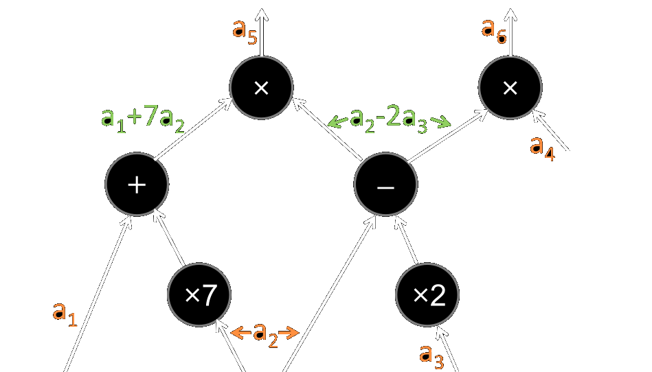

## Overview of the talk

- Arithmetic circuits and R1CS constraints
- Designing R1CS constraint systems using Circom
- Randomized (non-deterministic) programming
- Current implementation of Propositional Logic in Circom
  - Hilbert proofs
  - Arithmetization of terms/patterns/formulæ as Reed-Solomon polynomials
  - Well-formedness checking
  - Modus-ponens
  - Axioms and instantiation of (meta)variables

# Rank-1 Constraint Systems

## R1CS Formulations (programmer style)

- Constant values: only a constant value is allowed.
- Linear expression: an expression where only addition is used.
  - It can also be written using multiplication of variables by constants.
  - $2*x + 3*y + 2$ is allowed, as it is equivalent to $x + x + y + y + y + 2$.
- Quadratic expression: multiplication between two linear expressions and addition of a linear expression:
  - $A*B - C$, where $A$, $B$ and $C$ are linear expressions.
  - For instance, $(2*x + 3*y + 2) * (x+y) + 6*x + y – 2$.
- Quadratic constraint: $A*B - C = 0$, where $A$, $B$ and $C$ are linear expressions.

Source: [@circom2constraints]

## R1CS Formulations (mathematical style)

A __system of rank-1 quadratic equations__ over $\mathbb{F}$ is a tuple
$\mathcal{S} = \left((a_j, b_j, c_j)_{j \in \overline{1, N_g}}, n\right)$ where
$a_j, b_j, c_j \in \mathbb{F}^{1 + N_w}$ and $n\leq N_w$

- $N_g$ - the number of constraints
- $N_w$ - the number of variables
- $n$ - the input size

$\mathcal{S}$ is satisfiable with an input $x \in \mathbb{F}^n$ if there is a
witness $w \in \mathbb{F}^{N_w}$ such that:

1. $x = (w_1, \ldots, w_n)$, and
2. $\langle a_j, (1, w) \rangle \cdot \langle b_j, (1, w)\rangle = \langle c_j, (1, w)\rangle for all j\in \overline{1, N_g}$.

Source [@ben2013snarks; @gennaro2012qap]

## Arithmetic circuits to R1CS

:::::::::::::: {.columns}
::: {.column width="50%"}
{ width=100% }
:::
::: {.column width="50%"}
An arithmetic circuit.

The value at each output wire of a multiplication gate is expressed in terms of the values of output wires of lower multiplication gates (or of input wires) [@gennaro2012qap].

------------

$(a_1 + 7a_2)\cdot (a_2 - 2a_3) = a_5$

$(a_2 - 2a_3) \cdot a_4 = a_6$
:::
::::::::::::::

### R1CS: $N_g = 2, N_w = 6, n = 4$

$(0, 1, 7, 0, 0, 0, 0), (0, 0, 1, -2, 0, 0, 0), (0, 0, 0, 0, 0, 1, 0)$

$(0, 0, 1, -2, 0, 0, 0), (0, 0, 0, 0, 1, 0, 0), (0, 0, 0, 0, 0, 0, 1)$

# Programming in Circom

## Circom

- A JavaScript-like language with extra support for signals and constraints
- The compiler checks that signals are used and constrained appropriately
  - no non-quadratic constraints
  - no conditionals based on signals
  - no unbounded loops for signals
- One can use the regular language to compute the witness
  - conditional and unbounded loops are allowed
  - one should constrain/check the witness using R1CS constraints

## Signals

- The "circuit" variables of the language
- Correspond to output wires of arithmetic circuit gates
- When assigned to, one should also generate the corresponding constraint(s)

  E.g., __`a6 <== (a2 - 2 * a3) * a4`__

- However, we can also assign them directly and specify the constraint(s) separately
  - especially if we want to assign them to non-quadratic expressions
    ```
    b <-- 1/a;
    a * b === 1;
    ```

## Compositionality via templates [@iden3circomlib]

:::::::::::::: {.columns}
::: {.column width="33%"}
```
template AND() {
    signal input a;
    signal input b;
    signal output out;

    out <== a*b;
}
template OR() {
    signal input a;
    signal input b;
    signal output out;

    out <== a + b - a*b;
}
```
:::
::: {.column width="66%"}
```
template IsZero() {
    signal input in_;
    signal output out;
    signal inv;

    inv <-- in_!=0 ? 1/in_ : 0;
    out <== -in_*inv +1;
    in_*out === 0;
}
```

- if `in_` is `0`, then `out=1` uniquely satisfies both equations regardless of `inv`
- if `in_` is not `0` then there exists `inv` s.t. `in_ * inv = 1` and `out=0` uniquely satisfies both equations
:::
::::::::::::::

## Template Recursion

:::::::::::::: {.columns}
::: {.column width="50%"}
```
template MultiAND(n) {
    signal input in[n];
    signal output out;
    component and1;
    component and2;
    component ands[2];
    if (n==1) {
        out <== in[0];
    } else if (n==2) {
        and1 = AND();
        and1.a <== in[0];
        and1.b <== in[1];
        out <== and1.out;
```
:::
::: {.column width="50%"}
```
  } else {
      and2 = AND();
      var n1 = n\2;
      var n2 = n-n\2;
      ands[0] = MultiAND(n1);
      ands[1] = MultiAND(n2);
      var i;
      for (i=0; i<n1; i++)
        ands[0].in[i] <== in[i];
      for (i=0; i<n2; i++)
        ands[1].in[i] <== in[n1+i];
      and2.a <== ands[0].out;
      and2.b <== ands[1].out;
      out <== and2.out;
  }
}
```
:::
::::::::::::::

## Conditional

```
template If() {
    signal input condition;
    signal input t;
    signal input e;
    signal els <== (1 - condition) * e;
    signal output result <== condition * t + els;
}
```

## Conversion to bits

```
// Converts felt into N-digit binary representation
// Fails if N is too small
template Num2Bits(N) {
    signal input in;
    signal output out[N];
    var lc1=0;

    var e2=1;
    for (var i = 0; i<N; i++) {
        out[i] <-- (in >> i) & 1;
        out[i] * (out[i] -1 ) === 0;
        lc1 += out[i] * e2;
        e2 = e2+e2
    }
    lc1 === in;
}
```

## Other functions: Less than and exponent

:::::::::::::: {.columns}
::: {.column width="40%"}
```
template LessThan(n) {
  assert(n <= 252);
  signal input in[2];
  signal output out;

  component n2b = Num2Bits(n+1);
  n2b.in <== in[0]+ (1<<n) - in[1];
  out <== 1-n2b.out[n];
  // checks that no borrowing
  // is needed for subtraction
}
```
:::
::: {.column width="60%"}
```
// multiplies the elements in vector in selected
// by bits which should be a vector of 0/1
template ConditionalProduct(w) {
  signal input in[w];
  signal input bits[w];
  signal output out;
  signal aux[w];
  var lc = 1;
  for (var i=0; i<w; i++) {
    aux[i] <== (1 - bits[i]) + bits[i] * in[i];
  }
  out <== MultiAND(w)(aux);
}
```
:::
::::::::::::::

## Exponentiation

```
// Compute b ^ e in O(N = log e) gates
template BinaryExp(N) {
    signal input b;
    signal input e;
    signal pb[N];
    signal bits[N] <== Num2Bits(N)(e);
    signal output res;

    for (var i = 0; i < N; i++) {
        pb[i] <== i == 0 ? b : pb[i - 1] * pb[i - 1];
    }

    res <== ConditionalProduct(N)(pb, bits);
}
```

## Maximum value in an array

:::::::::::::: {.columns}
::: {.column width="40%"}
```
function array_max(N, A) {
    // returns the maximum value
    // in the array A of size N
    var m = 0;
    for (var i = 0; i < N; i ++) {
        if (A[i] > m) m = A[i];
    }
    return m;
}
```

- used to guess the maximum value as a witness
- no signals/constraints involved in `array_max`

:::
::: {.column width="60%"}
```
template ArrayMax(N) {
    signal input A[N];
    signal output m <-- array_max(N, A);
    var m1 = m + 1;
    signal checks[N+1], diffs[N+1];
    diffs[0] <== 1;
    for (var i = 0; i < N; i ++) {
      checks[i] <== LessThan(64)([A[i], m1]);
      diffs[i+1] <== diffs[i] * (A[i] - m);
    }
    checks[N] <==  IsZero()(diffs[N]);
    signal ok <== MultiAND(N + 1)(checks);
    ok === 1;
}
```
:::
::::::::::::::

# Propositional Logic

## Syntax

:::::::::::::: {.columns}
::: {.column width="70%"}
### Formul\ae

- $\varphi ::= x \mid \bot \mid \varphi \to \varphi$
- $x ::= \phi_0 \mid \phi_1 \mid \phi_2 \mid \ldots$

### Axioms (Łukasiewicz's third axiom system)

- ___Prop1___: $\phi_0\to (\phi_1\to \phi_0)$
- ___Prop2___: $(\phi_0\to (\phi_1\to \phi_2))\to ((\phi_0\to \phi_1)\to (\phi_0\to \phi_2))$
- ___Prop3___: $((\phi_0 \to \bot) \to (\phi_1 \to \bot))\to (\phi_1\to \phi_0)$

### Deduction

- ___ModusPonens___: $\displaystyle \frac{\varphi, \varphi \to \psi}{\psi}$

### Instantiation

- ___Instantiate___: Substituting variables with formul\ae
:::
::: {.column width="30%"}
### Notations

- $\neg \varphi ::= \varphi \to \bot$
- $\varphi \wedge \psi ::= \neg(\varphi \to \neg \psi)$
- $\varphi \vee \psi ::= \neg \varphi \to \psi$
:::
::::::::::::::

## Hilbert Proofs for $\phi_0 \to \phi_0$

### Proofs of pattern well-formedness:

1. $\phi_0$ by HMetaVar(0)
2. $(\phi_0 \to \phi_0)$ by HImplies(1, 1)

### Propositional Logic Proof:

1. $((\phi_0 \to ((\phi_0 \to \phi_0) \to \phi_0)) \to ((\phi_0 \to (\phi_0 \to \phi_0)) \to (\phi_0 \to \phi_0)))$

   by Instantiate(Prop2, $[\phi_1 \mapsto (\phi_0 \to \phi_0), \phi_2 \mapsto \phi_0, \phi_0 \mapsto \phi_0]$)
2. $(\phi_0 \to ((\phi_0 \to \phi_0) \to \phi_0))$ by Instantiate(Prop1, $[\phi_1 \mapsto (\phi_0 \to \phi_0), \phi_0 \mapsto \phi_0, \phi_2 \mapsto \phi_2]$)
3. $((\phi_0 \to (\phi_0 \to \phi_0)) \to (\phi_0 \to \phi_0))$ by ModusPonens(1, 2)
4. $(\phi_0 \to (\phi_0 \to \phi_0))$ by Instantiate(Prop1, $[\phi_1 \mapsto \phi_0, \phi_0 \mapsto \phi_0, \phi_2 \mapsto \phi_2]$)
5. $(\phi_0 \to \phi_0)$ by ModusPonens(3, 4)

## Arithmetization of formul\ae

- Running example: $\phi_0 \vee \neg \phi_0$
- Desugar notations: $(\phi_0 \to \bot) \to (\phi_0 \to \bot)$
- Consider the prefix-form of the formula $\to\to\phi_0\bot\to\phi_0\bot$
- Associate numbers to each token
  - say $\to$ is $1$
  - say $\bot$ is $2$
  - say variables are numbered consecutively from $3$, i.e. $\phi_0$ is $3$

  Then we can associate to the formula the following vector of size $7$:

  $[1, 1, 3, 2, 1, 3, 2]$

## Reed-Solomon fingerprint

Given a vector $(v_i)_{i = \overline{1, M}}$, the Reed-Solomon polynomial
associated to $v$ is $\displaystyle p(x) = \sum_{i = 1}^M{x^{i-1} * v_i}$.

The Reed-Solomon fingerprint of $v$ is the value of $p$ at a random
(but fixed) point $r$.

```
template Fingerprint(M) {
    signal input r;
    signal input pattern[M];
    signal r_pow[M];
    r_pow[0] <== 1;
    for (var i = 1; i < M; i++) {
        r_pow[i] <== r_pow[i - 1] * r;
    }
    signal output fingerprint <== EscalarProduct(M)(r_pow, pattern);
}
```

## Arithmetization of formul\ae\ (continued)

- We fix a randomly chosen number $r$
- We encode a formula $\varphi$ as a pair $FP(\varphi) ::= (n, N)$ where:
  - $n$ is the length of $\varphi$ in its prefix representation
  - $N$ is the fingerprint obtained by evaluating at point $r$
    the Reed-Solomon polynomial associated to the vector corresponding to $\varphi$
- E.g., assuming $r = 10$ and a large enough prime-field, $FP(\phi_0 \vee \neg \phi_0) = (7, 1132132)$

### Properties

- Equality checking: $\varphi = \psi$ can be replaced by $FP(\varphi) = FP(\psi)$
- Concatenation
  - Assume $FP(\varphi) = (n, N)$ and $FP(\psi) = (m, M)$
  - Then $FP(\varphi \to \psi) = (n + m + 1, 1 + r * (N + r ^ n * M))$

## Checking Well-Formedness

As we saw before, we can consider a deduction system for well-formedness, where:

- __Bottom__ is an axiom
- __MetaVar__ is an axiom (parameterized by the index of the variable)
- __Implies__ is a deduction rule $\displaystyle \frac{\varphi, \psi}{\varphi \to \psi}$

In a Hilbert proof using this system:

- we can consider that each step outputs a well-formed pattern
- We can thus consider Implies to (also) be parameterized by the previous indices
  (in the proof) where its hypotheses were established.

### Proofs of pattern well-formedness for $\phi_0 \to \phi_0$:

1. $\phi_0$ by HMetaVar(0)
2. $(\phi_0 \to \phi_0)$ by HImplies(1, 1)

## Arithmetization of Well-Formedness proofs

- To each proof step we associate
  - an identifier of the axiom/rule used
  - a list of parameters (padded with zeros)
- __Bottom__: identifier $1$, no parameters
- __MetaVar__: identifier $2$, index of the variable
- __Implies__: identifier $3$, $(n, N, i)$, $(m, M, j)$ where:
  - $(n, N)$ is the fingerprint of the formula at index $i$ in the proof
  - $(m, M)$ is the fingerprint of the formula at index $j$ in the proof
- _Note:_ the conclusion of each step will be computed during checking

### Arithmetization of the proof of well-formedness for $\phi_0 \to \phi_0$:

:::::::::::::: {.columns}
::: {.column width="50%"}
1. $\phi_0$ by HMetaVar(0)
2. $(\phi_0 \to \phi_0)$ by HImplies(1, 1)
:::
::: {.column width="50%"}
1. (2, 0, 0, 0, 0, 0, 0)
2. (3, 1, 3, 1, 1, 3, 1)
:::
::::::::::::::

## The checking process

Given a row (at index i) corresponding to arithmetization of a proof step:

- use first argument to determine which rule was used
- use the parameters to compute the FP (n, N) of the conclusion according to this rule
- emit $(n, N, i)$ as a proved statement of well-formedness
- if rule has hypotheses (Implies)
  - emit $(n_h, N_h, i_h)$ as a hypothesis of well-formedness
  - check that $i_h < i$ (to avoid cyclic proofs)

Finally, check that all emitted hypotheses are included in all emitted proved statements.

### Example
1. (2, 0, 0, 0, 0, 0, 0) --- a MetaVar rule with variable of index 0
  - emit $(1, 3, 1)$ as proved statement
2. (3, 1, 3, 1, 1, 3, 1) --- an Implies rule with arguments $(1,3,1), (1,3,1)$
  - emit $(3, 133, 2)$ as proved statement;  emit $(1,3,1)$ twice as hypotheses

Finally, check that $[(1, 3, 1), (1, 3, 1)]$ is included in $[(1, 3, 1), (3, 133, 2)]$

## Well-formedness of implication

```
template WfBinaryConstructor(LogN, ConstructorId) {
    signal input index, h_a, len_a, idx_a, h_b, len_b, idx_b;
    signal input r; // evaluation point
    signal r_pow_len_a <== BinaryExp(LogN)(r, len_a);
    signal r_pow_len_b <== BinaryExp(LogN)(r, len_b);
    var check_idx_a = CheckIndex(LogN)(idx_a, index);
    var check_idx_b = CheckIndex(LogN)(idx_b, index);
    signal ab <== h_a + r_pow_len_a * h_b;
    signal h_ab <== ConstructorId + r * ab;
    signal len_ab <== len_a + len_b + 1;
    signal output o1 <== PatternAtIndexRelFp()(h_a, len_a, idx_a);
    signal output o2 <== PatternAtIndexRelFp()(h_b, len_b, idx_b);
    signal output p <== PatternAtIndexRelFp()(h_ab, len_ab, index);
    signal output correctness <== AND()(check_idx_a, check_idx_b);
}
```

## Subset argument

There are various subset arguments. Here we describe one based on logarithmic derivatives [@subset_log].

Input
  ~ two vectors $A = (a_i)_{i \in \overline{1, n}}$, $B = (b_j)_{j \in \overline{1, m}}$
  ~ Simplifying assumption: $A$ is a set (no repetitions).

Output
  ~ whether all elements of $B$ are also in $A$

- Let $M = (m_i)_{i = \overline{1, n}}$ be the multiplicities of $A$ in $B$
  $m_i = |\{ j \in \overline{1, m} \mid b_j = a_i \}|$.
- Let $p_A(X) = \sum_{i = 1}^n {\frac{m_i}{X - a_i}}$
- Let $p_B(X) = \sum_{j = 1}^m {\frac{1}{X - b_i}}$
- Output whether $p_A = p_B$
  - by evaluating $p_A$ and $p_B$ at a random point.


## Checking a Propositional Logic Proof

- __ModusPonens__ is a deduction rule $\displaystyle \frac{\varphi, \varphi \to \psi}{\psi}$
- __Instantiate__ allows substituting variables with formul\ae\ in already proved terms
- we assume `1. Prop1; 2. Prop2; 3. Prop3` and shift the proof by the number of axioms

In a Hilbert proof using this system:

- we can consider that each step outputs a well-formed pattern
- We can consider ModusPonens to (also) be parameterized by the previous indices
  (in the proof) where its hypotheses were established.

### Proofs of pattern well-formedness for $\phi_0 \to \phi_0$:

4. Instantiate(2, $[\phi_1 \mapsto (\phi_0 \to \phi_0), \phi_2 \mapsto \phi_0]$)
5. Instantiate(1, $[\phi_1 \mapsto (\phi_0 \to \phi_0)]$)
6. ModusPonens(1, 2)
7. Instantiate(1, $[\phi_1 \mapsto \phi_0]$)
8. ModusPonens(3, 4)

## Arithmetization of  proofs

- Similar to well-formedness proofs
- __ModusPonens__: identifier $1$, $(n, N, i)$, $(m, M, j)$ where:
  - $(n, N)$ is the fingerprint of formula $\varphi$ at index $i$ in the proof
  - $(m, M)$ is the fingerprint of a formula $\psi$
  - Formula $\varphi \to \psi$ is at index $i$ in the proof
- __Instantiate__: identifier $2$, $(n, N, i)$, $(m, M, 0)$, $P$
  - $(n, N)$ is the fingerprint of the base pattern, at index $i$ in the proof
  - $(m, M)$ is the fingerprint of the result pattern to be outputed
  - $P$ is a hash of the fingerprints of the instantiated formul\ae


### Arithmetization of the PL proof for $\phi_0 \to \phi_0$:

:::::::::::::: {.columns}
::: {.column width="50%"}
4. Instantiate(2, $[\phi_1 \mapsto (\phi_0 \to \phi_0), \phi_2 \mapsto \phi_0]$)
5. Instantiate(1, $[\phi_1 \mapsto (\phi_0 \to \phi_0)]$)
6. ModusPonens(1, 2)
7. Instantiate(1, $[\phi_1 \mapsto \phi_0]$)
8. ModusPonens(3, 4)
:::
::: {.column width="50%"}
4. (2, 13, 11314..., 2, 17, 11311..., 0, H1)
5. (2, 5, 13143, 1, 7, 1311333, 0, H2)
6. (1, 7, 1311333, 5, 9, 113133133, 4, 0)
7. (2, 5, 13143, 1, 5, 13133, 0, H3)
8. (1, 5, 13133, 7, 3, 133, 6, 0)
:::
::::::::::::::

## The checking process

Similar (largely) to checking the well-formedness proof:

ModusPonens
  ~ we emit $FP(\varphi)$ with provided index as hypothesis
  ~ we compute $FP(\varphi \to \psi)$ and emit it with provided index as hypothesis
  ~ we emit $FP(\psi)$ with current index as proved statement
  ~ we check that provided indices are smaller than current index

Instantiate
  ~ we emit base pattern with provided index as hypothesis
  ~ we emit result pattern with current index as proved statement
  ~ we emit an "instantiation hypothesis"
  ~ we check that base pattern index is smaller than current index

Finally
- check that all emitted hypotheses are included in all emitted proved statements.
  - axioms are pre-emitted
- check that all emitted instantiate hypotheses are included in all emitted instantiate statements.
  - instantiate proofs will be detailed later.

## The checking process: Example

4. (2, 13, 113145113413, 2, 17, 11311333113133133, 0, H1) - Instantiate, $2 < 4$
   - emit (13, 113145113413, 2) as hypothesis
   - emit (17, 11311333113133133, 4) as proved statement
5. (2, 5, 13143, 1, 7, 1311333, 0, H2) - Instantiate, $1 < 5$
   - emit (5, 13143, 1) as hypothesis
   - emit (7, 1311333, 5) as proved statement
6. (1, 7, 1311333, 5, 9, 113133133, 4, 0) - ModusPonens, $5 < 6, 4 < 6$
   - emit $(7, 1311333, 5)$ and $(17, 11311333113133133, 4)$ as hypotheses
   - emit $(9, 113133133, 6)$ as proved statement
7. (2, 5, 13143, 1, 5, 13133, 0, H3) - Instantiate, $1 < 7$
   - emit $(5, 13143, 1)$ as hypothesis
   - emit $(5, 13133, 7)$ as proved statement
8. (1, 5, 13133, 7, 3, 133, 6, 0) - ModusPonens, $7 < 8, 6 < 8$
   - emit $(5, 13133, 7)$ and $(9, 113133133, 6)$ as hypotheses
   - emit $(3, 133, 8)$ as proved statement

For Instantiate we also emit a hash of all parameters (no indices) as instantiation hypothesis

Finally, perform the subset checks

## Circom code for ModusPonens

```
template ModusPonens(LogN) {
    signal input h_a, len_a, idx_a, h_b, len_b, idx_ab;
    signal input index,  r;
    signal r_pow_len_a <== BinaryExp(LogN)(r, len_a);
    signal r_pow_len_b <== BinaryExp(LogN)(r, len_b);
    var check_idx_a = CheckIndex(LogN)(idx_a, index);
    var check_idx_ab = CheckIndex(LogN)(idx_ab, index);
    signal ab <== h_a + r_pow_len_a * h_b;
    signal h_ab <== implies_id() + r * ab;
    signal len_ab <== len_a + len_b + 1;
    signal output obligation1 <== PatternAtIndexRelFp()(h_a, len_a, idx_a);
    signal output obligation2 <== PatternAtIndexRelFp()(h_ab, len_ab, idx_ab);
    signal output proof <== PatternAtIndexRelFp()(h_b, len_b, index);
    signal output correctness <== AND()(check_idx_a, check_idx_ab);
}

```

## Computing the instantiation relation

Input
  ~ The base pattern, in arithmetic vectorial form
  ~ Fingerprints of arguments, together with their indices in the well-formedness proof

Output
  ~ well-formedness obligations for all arguments
  ~ a hash of the proof of instantiation

- Use the fingerprints of arguments and their indices to emit well-formedness obligations
- Compute the result fingerprint of instantiation
  - traverse the base pattern computing the fingerprint and replacing variables with
    the fingerprint of corresponding argument
- compute a hash of base pattern (fingerprint), arguments fingerprints and result fingerprint
  - emit it as the proof of instantiation.

## References
