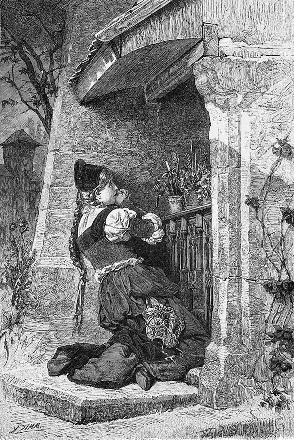

Johann Wolfgang Goethe se naște la 28 august 1749 la Frankfurt pe Main. Tatăl său, Johann Kaspar Goethe, era consilier imperial, mama sa, Katharina Elisabeth, născută Textor, provenea dintr-o familie de patricieni. Alături de sora lui, Cornelia, duce o copilărie lipsită de griji și primește o educație aleasă, învățând preponderent cu preceptori. În 1765, pleacă la Leipzig pentru a studia dreptul, dar cade bolnav în 1768 și se întoarce în casa părintească. Își încheie studiile juridice la Strasbourg în anii 1770–1771, după care practică avocatura la Frankfurt și Wetzlar. Este însă mai preocupat de literatură. Poeziile sale din această perioadă aduc un stil nou în lirica germană. Drama istorică *Götz von Berlichingen* (1773) este primită cu entuziasm în Germania, iar romanul epistolar *Suferințele tânărului Werther* (1774) îl face celebru în întreaga Europă, devenind o carte-cult. Aceste succese îl transformă pe tânărul Goethe în cea mai proeminentă figură a noii mișcări literare „Sturm und Drang”, care opune raționalismului iluminist trăirea individului, sentimentul și fantezia. În 1775, ajunge la Weimar, unde va rămâne tot restul vieții. Aici, la curtea ducelui Karl August, ocupă diverse funcții, fiind responsabil cu finanțele, cu exploatările miniere etc.; mai târziu, preia conducerea teatrului de curte din Weimar. În 1782 este înnobilat. Studiile pe care le desfășoară în domenii precum mineralogia, geologia, botanica sau osteologia se concretizează, în timp, prin descoperirea osului intermaxilar la om (1784) și prin apariția lucrărilor despre metamorfoza plantelor (1790) și despre teoria culorilor (1810). Între 1786 și 1788, Goethe zăbovește în Italia, călătorie pe care o resimte ca pe o adevărată „renaștere”. Puternic influențat de Antichitatea greco-romană, termină de scris tragedia clasică *Ifigenia în Taurida* (1787) și alte drame începute cu ani în urmă. Întors din Italia, o întâlnește pe Christiane Vulpius, o tânără de condiție modestă, care îi va dărui un fiu, dar pe care o va lua de soție abia în 1806. Perioada cuprinsă între 1794 și 1805 este marcată de prietenia și colaborarea cu Friedrich Schiller: sunt anii de vârf a ceea a ajuns să fie cunoscut în istoria literaturii drept „clasicismul de la Weimar”. Forma definitivă a romanului *Anii de ucenicie ai lui Wilhelm Meister* (1795/1796), precum și baladele scrise în 1797 („anul baladelor”) stau sub zodia schimbului spiritual cu Schiller. După moartea lui Schiller, Goethe reia lucrul la *Faust* și, în 1808, publică Partea întâi a tragediei. Scrie la autobiografia *Poezie și adevăr*, pe care nu va izbuti însă s-o ducă mai departe de anul 1775. Lectura poetului persan Hafiz, dar și dragostea târzie pentru Marianne von Willemer, una dintre multele lui muze, îi inspiră poeziile reunite în *Divanul apusean-răsăritean* (tipărit în 1819 și, într-o ediție lărgită, în 1827). Cu zece luni înainte de moartea sa, survenită la 22 martie 1832, Goethe duce la bun sfârșit Partea a doua din *Faust*, destinând-o publicării postume. Primele două volume din *Convorbiri cu Goethe în ultimii ani ai vieții sale*, cuprinzând discuțiile poetului cu secretarul său Johann Peter Eckermann, apar în 1836, fiind urmate de un al treilea în 1848.

## FAUST – TRAGEDIE de JOHANN WOLFGANG GOETHE, Traducere de LUCIAN BLAGA

Cu ilustrații de FRANZ XAVER SIMM

Ediție îngrijită de DAN FLONTA

Coperta: Angela Rotaru

Tehnoredactor: Manuela Măxineanu

DTP: Florina Vasiliu, Dan Dulgheru

Johann Wolfgang Goethe

Faust. Eine Tragödie

© Humanitas, 2015, pentru prezenta ediție

ISBN 978-973-50-5001-6 (pdf)

EDITURA HUMANITAS

Piața Presei Libere 1, 013701 București, România

tel. 021/408 83 50, fax 021/408 83 51

www.humanitas.ro

Comenzi online: www.libhumanitas.ro

Comenzi prin e-mail: vanzari@libhumanitas.ro

Comenzi telefonice: 0372.743.382; 0723.684.194

## NOTĂ ASUPRA EDIȚIEI

Tălmăcirea lui Lucian Blaga a apărut pentru prima oară în 1955 la Editura de Stat pentru Literatură și Artă. După moartea traducătorului, fiica sa, Dorli Blaga, a pregătit o a doua ediție, revăzând textul prin confruntare cu manuscrisul, introducând indicațiile de regie care lipseau și completând explicațiile și interpretările oferite la subsol de către tatăl său cu note referitoare la figuri mitologice. Această ediție revăzută și completată a apărut în 1962 la Editura pentru Literatură, în două volume, și a fost republicată aproape în aceeași formă în 1968, fiind semnalată abia la republicare ca „ediția a II-a”.

Volumul de față, îngrijit în redacția Editurii Humanitas, preia, cu mici modificări, textul din 1968 al celei de-a doua ediții. Grafia și punctuația au fost aduse la zi, conform normelor în vigoare, acolo unde astfel de intervenții nu aduceau atingere substanței textului și nu afectau ritmul versurilor. Scăpările și erorile tipografice au fost îndreptate tacit. Indicațiile scenice au fost scoase dintre paranteze, urmând opțiunea lui Goethe, consfințită prin edițiile germane princeps din 1808 (*Faust I*) și 1832 (*Faust II*). Notele de subsol, în care Lucian Blaga, autor interzis la acea vreme, a fost nevoit să strecoare unele clișee din jargonul ideologic al anilor ’50, au fost curățate de formulări care erau străine scrisului său. Formele lexicale și flexiunile folosite de traducător au fost păstrate în integralitate.

Ilustrațiile prezentului volum, create de artistul austriac Franz Xaver Simm (1853–1918), provin din ediția germană a tragediei apărută în 1899 la Deutsche Verlags-Anstalt (Stuttgart, Leipzig). Aceasta cuprindea numeroase xilogravuri executate în diverse ateliere, dintre care s-au inclus în ediția de față cele 21 de ilustrații *pleine page* (inclusiv cele trei pagini de titlu), patru ilustrații de dimensiuni mai mici și vinieta de final. Textele care însoțesc ilustrațiile s-au adăugat în redacție.

Grupajul „Goethe despre *Faust*” reunește o suită de remarci făcute de poet în contextul informal al epistolelor sau al convorbirilor cu Eckermann. Aceste fragmente revelatoare înlesnesc orientarea cititorului în ansamblul dramei și articulează totodată, într-o manieră intuitivă, idei centrale ale esteticii goetheene.

Textul din finalul ediției de față, în care Lucian Blaga vorbește despre experiența de a traduce o operă de o asemenea complexitate, are la origine o comunicare ținută în aprilie 1957, tipărită mai întâi sub titlul „Cum am tradus pe *Faust*” în revista *Steaua* (VIII, nr. 5, 1957) și apoi, într-o formă completată, intitulată „*Faust* și problema traducerilor”, în revista *Luceafărul* (VI, nr. 11, 1963). În 1957, Blaga a inclus articolul în rândul materialelor care urmau să alcătuiască volumul *Izvoade* (apărut abia în 1972 la Editura Minerva). Textul reprodus aici – ușor prescurtat pentru scopurile prezentei ediții – a fost preluat după ediția integrală, necenzurată, a volumului *Izvoade*, publicată de Humanitas după 1990 (2002, 2012).

Considerând că orice literatură națională trebuie să fie și „o oglindă a literaturii universale”, Lucian Blaga a dat culturii române tălmăciri care poartă tot atât de mult marca harului său ca și prolifica sa creație originală, beletristică și filozofică. Dintre acestea, cea mai cunoscută rămâne traducerea capodoperei lui Goethe, cel care, teoretizând pentru prima dată conceptul de „literatură universală” (*Weltliteratur*), a constatat la începutul secolului al XIX-lea întrepătrunderea crescândă a literaturilor naționale.

## GOETHE DESPRE *FAUST*

*Goethe a lucrat la* Faust, *cu lungi pauze, de la începuturile carierei sale literare și până la adânci bătrâneți. Ani de zile, textul a stat în adormire, pentru a fi reluat iar și iar, modificat, dezvoltat, până la desăvârșirea întregului. O primă variantă fragmentară, așa-numitul* Urfaust, *care conține încă multe pasaje în proză, ia naștere în prima parte a anilor 1770, înainte ca poetul să se stabilească la Weimar. După 1785, Goethe revine asupra manuscrisului, prelucrându-l și completându-l, iar în 1790 publică* Faust, ein Fragment, *cu ocazia tipăririi unei ediții în opt volume a operele sale. Aceste două versiuni preliminare sunt punctul de plecare pentru elaborarea formei definitive a Părții întâi a tragediei, care apare sub titlul* Faust. Eine Tragödie *în anul 1808.* Faust I *conține deja celebrul „Prolog în cer”, cu discuția dintre Dumnezeu și Mefistofel, care încadrează peripețiile lui Faust pe pământ și fixează orizontul întregii opere.*

*Referirile scrise ale autorului la* Faust *se înmulțesc în anii târzii. Ele sunt consemnate în scrisori, în convorbirile cu Eckermann și, mai laconic, în jurnalul lui Goethe, ba chiar în jurnalele unor contemporani. Sunt anii în care Goethe începe să se gândească serios la continuarea dramei, revăzând câteva scene disparate scrise până atunci. Între 1825 și 1831, dă la iveală, încetul cu încetul, Partea a doua. Se hotărește însă să nu publice* Faust II *în timpul vieții, decizie pe care o motivează, cu cinci zile înainte de moarte, în ultima sa scrisoare, adresată lui Wilhelm von Humboldt.* Faust. Der Tragödie zweiter Teil in fünf Akten *va apărea postum în 1832, la câteva luni după moartea lui Goethe.*

*Fragmentele reunite mai jos[^1] ne permit să aruncăm o privire în atelierul creației și dau o idee despre modul în care înțelegea autorul ansamblul acestei producții „incomensurabile”, dar oferă și explicații cu privire la Partea a doua, care, prin complexitatea și varietatea sa, solicită din plin cititorul. În puține cuvinte, Goethe ne spune cum ar trebui citit* Faust *și care au fost intențiile sale.*

[^1]: Majoritatea lor sunt reproduse într-o amplă anexă la ediția germană îngrijită de Erich Trunz: Johann Wolfgang von Goethe, *Dramatische Dichtungen I: Faust I. Faust II. Urfaust*, hg. v. Erich Trunz, Deutscher Taschenbuch Verlag, München, 1998, reprezentând vol. 3 din seria *Operelor* lui Goethe în 14 volume cunoscută ca „Hamburger Ausgabe”.

*Din jurnalul lui Sulpiz Boisserée, 3 august 1815*

Apoi aduce vorba despre *Faust*. Partea întâi, încheiată cu moartea lui Gretchen, cere acum, *par ricochet*, un nou început, iar întreprinderea aceasta ar fi tare anevoioasă, căci mâna pictorului, penelul său nu mai sunt aceleași; ceea ce ar produce acum nu s-ar potrivi cu cele dinainte. – Îi răspund că n-ar trebui să-și facă atâtea scrupule, că oamenii au capacitatea de a se transpune în altul, cu atât mai mult maestrul în creațiile sale mai vechi. – Goethe: „Recunosc bucuros, o mare parte-i deja isprăvită.” – Mă interesez de sfârșit. – Goethe: „Despre sfârșit nu vorbesc, nu mi-e îngăduit să vorbesc, dar e de asemenea gata, a ieșit foarte bine, grandios, ca-n vremurile cele mai bune.” – Îmi închipui, zic, că diavolul nu are câștig de cauză. – Goethe: „La început, Faust îi pune diavolului o condiție, de aici decurge tot restul.”

*Goethe către Karl Ernst Schubarth, 3 noiembrie 1820*

Ceea ce spuneți despre „Închinare” și despre „Prolog”[^2] e fără cusur. M-au mișcat însă conjecturile dumneavoastră despre Partea a doua a lui *Faust* și despre rezolvarea intrigii. Că lucrurile evoluează spre idealitate, pentru a-și găsi la urmă împlinirea pe acest făgaș, ați intuit foarte corect; numai că tratarea mea trebuia să-și urmeze propriul curs, și mai sunt pe pământ câteva rătăciri mărețe, reale și fantastice, care pot abate biata făptură omenească de o manieră mai nobilă, mai demnă și mai înaltă decât se întâmplă în desfășurarea comună a Părții întâi. Și prin acestea ar trebui să răzbată amicul nostru Faust. […] Ați ghicit corect și deznodământul. Mefistofel nu trebuie să câștige rămășagul decât pe jumătate și, chiar dacă Faust rămâne cu jumătate din vină, numaidecât intervine dreptul de grațiere al bătrânului senior, conducând spre cel mai senin final al întregului.

[^2]: Goethe se referă la „Prologul în teatru” (n.ed.).

*„Elena”, interludiu la Faust. Anunț[^3]*

[^3]: Această schiță, dictată de Goethe în decembrie 1826 și publicată în anul următor, trebuia să-i pregătească pe cititori pentru publicarea separată a actului III din Partea a doua – act pe care poetul îl numea, simplu, „Elena”. În continuarea textului, neinclusă aici, este expusă pe larg acțiunea din actul II care precede intrarea în scenă a preafrumoasei Elena (n.ed.).

Caracterul lui Faust, la înălțimea la care l-a ridicat noua prelucrare a basmului popular vechi, brut, ne înfățișează un om care, simțindu-se neliniștit și inconfortabil în limitele obișnuite ale vieții pământești, găsește că posesiunea celei mai înalte științe, desfătarea cu cele mai încântătoare avuții nu sunt câtuși de puțin în măsură să-i satisfacă năzuințele, așadar un spirit care, îndreptându-și privirile în toate direcțiile, se întoarce de fiecare dată mai nefericit.

Această stare de spirit este atât de analogă celei moderne, încât mai multe minți agere s-au văzut îndemnate să purceadă la rezolvarea unei asemenea probleme. Felul în care m-am comportat cu această ocazie a avut parte de reacții aprobatoare; oameni plini de calități au reflectat asupra chestiunii și mi-au comentat textul, lucru pe care l-am primit cu gratitudine. Dincolo de asta însă, m-am mirat că aceia care au procedat la continuarea și completarea fragmentului meu nu s-au gândit la un fapt aflat la îndemână, anume că Partea a doua ar trebui să se ridice deasupra lumii triste înfățișate până aici și să conducă un astfel de bărbat prin regiuni mai înalte, prin împrejurări mai demne […].

Căci, așa cum ne spune vechea legendă, dar și jocul de păpuși, care prezintă scena cu pricina, Faust, în semeția-i debordantă, i-a cerut-o lui Mefistofel pe frumoasa Elena a Greciei, iar acesta, după oarecare împotrivire, i-a făcut pe plac. Am considerat că avem obligația să nu omitem în tratarea noastră un motiv de o asemenea însemnătate…

*Convorbirile lui Eckermann cu Goethe, 6 mai 1827*

„De altfel, germanii sunt oameni ciudați! Prin gândurile și ideile lor profunde, pe care le urmăresc și le răsădesc peste tot, își fac viața mai grea decât e cazul. Îndrăzniți odată și-odată să vă dăruiți impresiilor, să vă delectați, să vă lăsați mișcați, înălțați; găsiți în voi curajul de a vă lăsa învățați, de a vă lăsa înflăcărați și îmboldiți către ceva măreț – și nu socotiți mereu că tot ce nu-i cugetare și idee abstractă e deșertăciune!

Iată-i, vin la mine și mă întreabă ce idee am căutat să întruchipez în *Faust*. De parcă eu însumi aș ști lucrul acesta și aș putea să-l exprim! *Din cer prin lume până-n iad*, asta ar fi ceva, la nevoie; dar aici nu-i vorba de o idee, ci de mersul acțiunii. Apoi, că diavolul pierde rămășagul și că un om care, din grele rătăciri, aspiră neîncetat spre mai bine poate fi *izbăvit* – acesta e un gând bun, productiv, care explică câte ceva, dar nu e o *idee* care să stea la temelia întregului și a fiecărei scene în parte. Mare minunăție ar mai fi ieșit, zău așa, dacă mi-aș fi propus să înșir pe firul sărăcăcios al unei singure idei generale o viață atât de bogată, de pestriță, de variată cum este aceea pe care am înfățișat-o în *Faust*!”

Goethe urmă: „În general, nu mi-a stat în fire, ca poet, să tind la întruchiparea unui ce *abstract*. Am găzduit în interiorul meu *impresii*, anume impresii senzuale, pline de viață, încântătoare, multicolore, nespus de variate, așa cum mi le oferea o imaginație intensă; iar ca poet tot ce mi-a rămas de făcut a fost să rotunjesc și să modelez înlăuntrul meu aceste imagini și impresii în chip artistic și să le scot la iveală printr-o reprezentare vie, astfel încât și ceilalți să aibă parte de aceleași impresii când aud sau citesc cele înfățișate de mine.”

*Goethe către K.J.L. Iken, 27 septembrie 1827*

Îngăduiți-mi, înainte de toate, să-mi exprim bucuria pe care mi-ați făcut-o prin interesul ce l-ați arătat „Elenei”. […] Nu m-am îndoit niciodată că cititorii pentru care am scris de fapt vor înțelege numaidecât sensul principal al acestei producții. E timpul ca dezbinarea pătimașă dintre clasici și romantici să se încheie odată și-odată cu o conciliere. Dezideratul principal este acesta: să ne cultivăm; din ce surse ne cultivăm ar fi totuna, dacă nu ar trebui să ne temem că vom fi pervertiți prin modele false. Căci tocmai datorită unei perspective mai ample și mai clare înlăuntrul și asupra literaturii greco-romane ne-am eliberat de barbaria monahală în secolele al XV-lea și al XVI-lea. Oare nu aceste nobile izvoade ne învață să considerăm totul în adevărata sa valoare sensibil-estetică, de la ce-i mai vechi până la ce-i mai nou?

Nădăjduind la o asemenea participare plină de înțelegere, mi-am dat frâu liber în timpul elaborării „Elenei”, fără să mă gândesc la vreun public sau la vreun cititor anume, încredințat că cel care cuprinde și deslușește întregul va avea răbdarea și bunăvoința să-și însușească încetul cu încetul și elementele individuale. Pe de-o parte, filologul nu va rămâne cu nici o nelămurire, ci se va desfăta cu Antichitatea readusă la viață, care-i este deja cunoscută; pe de altă parte, cel înzestrat cu sensibilitate va pătrunde ceea ce se ascunde în tihnă ici și colo: „*Eleusis servat, quod ostendat revisentibus*”[^4]. M-aș bucura dacă, și de astă dată, misterul îi va face pe prieteni să se întoarcă mai des la el.

[^4]: „Eleusis păstrează lucruri pe care le arată celor ce se-ntorc” (lat.) – Seneca, *Naturales quaestiones*, VII, 31, 6 (n.ed.).

*Convorbirile lui Eckermann cu Goethe, 1 octombrie 1827*

…M-am dus la Goethe, care mi-a citit scena a doua[^5] din noul său Faust.

[^5]: Scena „Palatul imperial. Sala tronului”; vezi pp. 205 sqq. (n.ed.).

„În figura împăratului”, spuse el, „am căutat să înfățișez un suveran care are toate atributele posibile ca să-și piardă pământurile, lucru care-i și reușește mai târziu.

Binele împărăției și al supușilor săi nu-l frământă deloc; se gândește numai la el și la cum să se amuze zi de zi cu ceva nou. Țara e văduvită de lege și dreptate, judecătorul e complice și de partea răufăcătorilor, nimeni nu-i stingherește și nu-i pedepsește pe cei ce săvârșesc fărădelegi nemaiauzite. Oastea e în neorânduială, oștenii nu și-au primit solda și umblă alandala după jaf, luându-și singuri simbria și descurcându-se cum pot. Visteria statului e goală, ajutoarele bănești promise nu mai sosesc. Nici în gospodăria împăratului lucrurile nu stau mai bine: din bucătărie și pivniță lipsesc cele trebuincioase. Mareșalul palatului, care nu mai știe cum să se descurce de pe o zi pe alta, a încăput deja pe mâna cămătarilor, iar aceștia au pus zălog pe totul, astfel încât și la masa împăratului se mănâncă pe datorie.

Consiliul de stat vrea să-i ceară socoteală suveranului pentru toate aceste neajunsuri și să caute o cale de a îndrepta lucrurile. Numai că Înălțimea Sa nu este deloc dispusă să-și plece distinsa ureche la asemenea vorbe supărătoare. Gândul îi stă la amuzament. Aici, desigur, Mefistofel e în elementul său: numaidecât, îl înlătură pe măscăriciul de până acum și se insinuează pe lângă împărat în calitate de nou bufon și consilier.”

*Convorbirile lui Eckermann cu Goethe, 13 februarie 1831*

Cu Goethe la masă. Mi-a povestit că lucrează mai departe la actul al patrulea din *Faust* și că în sfârșit i-a ieșit începutul așa cum și-l dorise.

„*Ce* anume avea să se întâmple”, zise el, „era lămurit de mult, după cum știți. Dar *cum* aveau să se întâmple lucrurile, în privința asta nu eram pe deplin mulțumit, și-s bucuros că, iată, mi-au venit niște idei bune. Acum, am să-mi folosesc imaginația pentru a umple tot golul acesta, de la «Elena» până la actul al cincilea, care-i isprăvit: am să pun pe hârtie o schemă amănunțită, ca să pot elabora apoi totul în tihnă și siguranță, lucrând la părțile care mă atrag pe moment. Actul acesta va avea, și el, un caracter propriu foarte bine conturat – aidoma unui microcosmos ce există pentru sine, nu se va amesteca cu restul și va fi legat de întreg doar prin trimiteri fine la ceea ce se petrece înainte și după.”

„Va fi, deci, în ton cu restul”, spusei eu. „Căci, în fond, Pivnița lui Auerbach, Bucătăria vrăjitoarei, Blocksbergul[^6], Consiliul de stat, Mascarada, scena cu banii de hârtie, Laboratorul, Noaptea valpurgică clasică, Elena sunt tot atâtea mici lumi de sine stătătoare, care, închise în sine, se influențează reciproc, dar au puțin de-a face una cu alta. Poetul dorește să reprezinte un univers variat și folosește povestea unui erou faimos ca pe un fir ce străbate întreaga operă, înșirând pe el ceea ce poftește. La fel stau lucrurile cu *Odiseea* sau cu *Gil Blas*.”

[^6]: „Muntele Nebun”, în transpunerea lui Lucian Blaga; *cf.* și explicațiile oferite de traducător la pp. 478–479 (n.ed.).

„Aveți întru totul dreptate”, remarcă Goethe. „Ceea ce contează într-o asemenea compoziție este ca masele individuale să fie semnificative și clare, în timp ce întregul rămâne mereu incomensurabil și, tocmai prin faptul că se înfățișează ca o problemă nerezolvată, îi ademenește pe oameni să-l contemple iar și iar.”

*Convorbirile lui Eckermann cu Goethe, 17 februarie 1831*

L-am întrebat cum merge lucrul la *Faust*.

„*Faust* a pus acum complet stăpânire pe mine”, răspunse Goethe. „Nu trece zi fără să chibzuiesc și să născocesc câte ceva la el. Am cerut să mi se broșeze întregul manuscris al Părții a doua, ca să-l am în fața ochilor în toată materialitatea lui. Locul în care va veni actul al patrulea, care lipsește încă, l-am umplut cu foi albe, și nu încape discuție că bucățile isprăvite mă ademenesc și mă îndeamnă să desăvârșesc și restul. Lucrurile acestea care țin de simțuri au o însemnătate mai mare decât se crede, de aceea trebuie să venim în ajutorul spiritului cu tot felul de trucuri […].

Partea întâi este aproape pe de-a-ntregul subiectivă. Totul a izvorât dintr-un individ mai stânjenit, mai pătimaș, dar și clarobscurul acesta poate fi prielnic oamenilor. Partea a doua nu mai are însă aproape nimic subiectiv, aici apare o lume mai înaltă, mai vastă, mai luminoasă, mai lipsită de patimi, iar cine nu a umblat nițel și nu a trăit câte ceva în viață nu va găsi că-i spune mare lucru.”

*Convorbirile lui Eckermann cu Goethe, 21 februarie 1831*

Cabirii lui Schelling ne-au făcut să luăm în discuție Noaptea valpurgică clasică și felul în care aceasta se deosebește de scenele de pe Brocken din Partea întâi.[^7]

[^7]: *Cf.* pp. 165–179 și pp. 288–342 (n.ed.).

„Noaptea valpurgică de odinioară”, spuse Goethe, „are o ordine monarhică, prin faptul că diavolul este acolo șeful incontestabil, privit pretutindeni cu respect; cea clasică însă e decis republicană, căci aici toți au același rang, nici unul nu-l privește pe altul de sus, nimeni nu e subordonat și nu se sinchisește de celălalt.”

„De asemenea”, zisei eu, „în cea clasică, lumea se desface în individualități clar conturate, pe când pe Blocksbergul german toate figurile se dizolvă într-o mare masă de vrăjitoare.”

„Tocmai de aceea”, interveni Goethe, „Mefistofel știe prea bine ce va să însemne când Homunculus îi vorbește de vrăjitoarele tesalice. Un bun cunoscător al Antichității se va gândi la anumite lucruri când aude de vrăjitoarele tesalice, în timp ce, pentru omul neinstruit, acestea rămân un simplu nume.”

„Cu siguranță, Antichitatea v-a fost foarte vie în minte”, observai eu, „altminteri n-ați fi izbutit să evocați toate acele figuri cu atâta prospețime, să le mânuiți și să le tratați cu atâta dezinvoltură.”

„Dacă nu m-aș fi îndeletnicit toată viața cu artele plastice”, răspunse Goethe, „nu aș fi putut înfăptui așa ceva. Cel mai dificil, însă, a fost să păstrez măsura în fața acestei abundențe și să las la o parte toate personajele care nu se potriveau întocmai cu intențiile mele. Așa se face că nu m-am folosit de Minotaur, de Harpii și de alți câțiva monștri.”

*Goethe către Carl Friedrich Zelter, 1 iunie 1831*

Trimite-mi în continuare, dragul meu, câte un mănunchi din bogata recoltă pe care o culegi în lumea din afară, în timp ce eu duc în grădina mea o viață monahală, închis într-o lume lăuntrică, ca să isprăvesc – o spun în puține cuvinte – Partea a doua din Faust. Nu-i puțin lucru să împlinești la optzeci și doi de ani ceea ce ai conceput la douăzeci și să îmbraci un schelet ce-i viu înăuntrul tău cu tendoane, carne și piele, ba să mai și înfășori cele gata potrivite în faldurile unei pelerine, pentru ca totul să rămână un secret deschis care să-i delecteze mereu pe oameni și să le dea de furcă.

*Convorbirile lui Eckermann cu Goethe, 6 iunie 1831*

„În actul al cincilea”, spuse Goethe, „eu mi l-am închipuit pe Faust la vârsta de o sută de ani, și mă întreb dacă nu ar fi bine să menționez undeva explicit acest lucru […].

De altfel, veți admite că sfârșitul, unde sufletul izbăvit se înalță la ceruri, era foarte greu de realizat și că, tratând asemenea chestiuni transcendente, care abia pot fi intuite, aș fi putut lesne să mă pierd în vag dacă n-aș fi dat intențiilor mele poetice, prin figurile și reprezentările bine conturate ale Bisericii creștine, o formă și o soliditate care situează totul în anumite limite benefice.”

În următoarele săptămâni, Goethe a terminat și actul al patrulea, singurul care mai lipsea, astfel că în august toată Partea a doua era gata și deja broșată. Goethe era nespus de fericit că-și atinsese țelul spre care năzuise atâta amar de vreme.

„De-acum”, zise el, „pot să privesc restul zilelor mele pur și simplu ca pe un dar, și în fond n-are nici o importanță dacă am să mai creez ceva – și ce anume.”

*Goethe către Wilhelm von Humboldt, 17 martie 1832*

…Cu peste șaizeci de ani în urmă, la vârsta tinereții, *Faust* era deja clar conturat în mintea mea, chiar dacă întreaga succesiune nu era încă dezvoltată în detaliu. Intenția aceasta m-a însoțit mereu, însă nu m-am grăbit și am elaborat doar scenele care m-au interesat cel mai mult pe moment, astfel că în Partea a doua au rămas goluri care cereau o preocupare pe măsură pentru a putea fi legate cu restul. Aici a apărut dificultatea de a îndeplini prin voință și caracter ceea ce ar fi trebuit să izvorască în mod natural dintr-o acțiune spontană. Dar ar fi fost regretabil dacă nu mi-aș fi atins țelul nici după o viață atât de lungă, petrecută în reflecții active, și nu mă sperie gândul că oamenii ar putea deosebi vechiul de nou, cele de mai devreme de cele de mai târziu. Să lăsăm dar chestiunea în seama viitorilor cititori, supunând-o aprecierii binevoitoare a acestora.

Fără îndoială, m-ar bucura nespus să pot dedica și împărtăși în timpul vieții aceste ghidușii cum nu se poate mai serioase onoraților mei prieteni de pretutindeni, la care mă gândesc cu gratitudine, și să le aud reacțiile. Trăim însă într-o epocă atât de absurdă și de încurcată, încât m-am convins că strădaniile mele pe cât de îndelungate, pe atât de cinstite de a clădi acest ciudat edificiu vor fi prost răsplătite și, până una-alta, vor eșua pe țărm ca o epavă făcută bucăți, pentru a fi acoperite de dunele timpului. În lume domnește o învățătură confuză ce se însoțește cu o forfoteală confuză, și n-am nimic mai bun de făcut decât să dezvolt ceea ce mi s-a dat și mi-a rămas încă și să-mi rafinez calitățile, așa cum procedați la rându-vă, nobile prieten, în cetatea dumneavoastră […].

Iertați întârzierea cu care vă răspund! În ciuda solitudinii mele, rareori se găsește un moment în care pot să-mi îndrept gândurile spre aceste mistere ale vieții.

Al dumneavoastră, devotat,

Weimar, 17 martie 1832

J.W.v. Goethe

*(Traducere de Dan Flonta)*

## Faust – o Tragedie

### ÎNCHINARE

V-apropiați din nou, figuri șovăitoare, 
Cari ochiului de timpuriu s-au arătat. 
Să-ncerc a vă reține – acum – putea-voi oare? 
Mai este sufletul visării aplecat? 
Vă îmbulziți. Ei bine, adăstați prin preajmă, 
Așa cum răsăriți din negură deodat’. 
Adânc mișcat se simte pieptu-mi, tinerește, 
De adierea vrăjii ce vă însoțește.

Icoane-aduceți voi din zile fericite, 
Prin față-mi trec atâtea umbre dragi și vii. 
Asemeni unei vechi legende-aproape stinse 
Apar întâile iubiri și prietenii. 
Durerea-nvie, tânguirea mai repetă 
Al vieții labirintic mers rătăcitor, 
Și pomenește de cei buni, cari de norocuri 
Crunt înșelați, ’naintea mea s-au stins de zor.

Cei duși nu mai aud cântările din urmă, 
Ei cari, întâile, pierduți le-au ascultat. 
S-a risipit înghesuiala prietenească, 
Pe rând ecoul cel dintâi s-a destrămat. 
Azi neștiută e mulțimea ce aude 
Durerea, cântecul ce-ncerc a spune. 
Cei ce cândva de stihul meu se bucurară, 
Rătăcitori ei sunt, de mai trăiesc pe lume.

Uitat de mult, mă prinde-un dor din cale-afară 
De-acel tăcut și grav tărâm, unde s-adună 
Înalte duhuri, și-n nehotărâte tonuri, 
Asemeni harfei lui Eol, cântarea-mi sună. 
Fiori mă iau, și lacrimi, lacrimi printre gânduri. 
Severa inimă devine moale, blândă. 
Ce e de față, vede-se ca-n depărtare, 
Și ce-a pierit, aievea e ca o izbândă.

### PROLOG ÎN TEATRU

Directorul. Poetul teatrului. Actorul comic.

DIRECTORUL

Voi doi, care de-atâtea ori în neajuns 
Și la necaz alăturea mi-ați stat, 
Să-mi spuneți ce nădejdi legați 
De-ncumetarea noastră. Dați-mi sfat, 
Ce-i de făcut prin țările acestea. 
Mulțimei vrem pe plac să-i fim, 
Îndeosebi fiindcă ea trăiește 
Și în același timp ne lasă să trăim 
Și noi. Țărușii-s puși, e scena gata. 
Și fiecare-o sărbătoare speră. 
Iată-i pe toți acuma din sprâncene ridicând, 
Cu nerăbdare un spectacol așteptând. 
Știu ce-ar dori norodul să asculte: 
Perplex ca astăzi însă n-am fost niciodat’! 
Cu bunătăți norodul n-a fost răsfățat, 
Dar a citit grozav de multe. 
Cum o aducem, ca mai nou oleacă 
Să pară totul, plin de tâlc, dar să și placă? 
E-nvederat că-mi face mare bucurie 
Să văd mulțimea cum o ia către baracă, 
Înghesuindu-se și dând din coate 
Să-și taie drum prin poarta-ngustă. 
E-nvederat că-mi face mare bucurie 
Să văd că încă-n plină zi, la ora patru, 
Mulțimea-și face loc spre casierie, 
Și că se-ncaieră pentr-un bilet pe mâne 
Ca-n timp de foamete pentru o pâne. 
Cu gloata pestriță așa de-a dreptul 
Face minuni numai poetul.

POETUL

O, nu-mi vorbi de-acea mulțime! 
Privind la ea, mă prinde doar sfială. 
Mă apără, te rog, de a vedea învălmășeală 
Ce fără voie ne atrage în vârtej! 
Mă du, de poți, spre treptele celeste, 
Acolo unde bucuria pură înflorește, 
Unde iubirea, prietenia, ca-n poveste, 
Un rod dau inimii, dumnezeiește. 
Ah, ceea ce din profunzimi de piept răsare, 
Ce buza doar sfios și-a murmurat, 
Ce pare-a izbândi, e înghițit de-o clipă, 
De forța ei sălbatică și mare. 
Și-ades, doar după ce-a răzbit prin ani, 
Un rod desăvârșit se vede. 
Ce strălucește e sortit să țină-o clipă, 
Dar adevărul niciodată nu se pierde.

ACTORUL COMIC

Posteritatea! Vai, la ea-ți stă gândul? 
Să presupunem că și mie azi 
Posteritatea mi-ar umbla prin cap. 
Cine atunci celor de față le-ar mai face haz? 
Cred că o veselă persoană, un băiat de treabă 
Pot să însemne, orișicum, și ei ceva. 
Ale norodului capricii nu te-or supăra, 
Glumind dacă te-arăți pe undeva. 
Un mucalit dorește-un mare cerc 
Spre-a-l zgudui cu-atât mai cert. 
Fiți bravi și oameni cumsecade. 
Dați drumul fanteziei, 
Ale ei coruri, rațiune, pasiuni sălbatice, 
Să fie auzite! Însă, rogu-mă, 
Nu fără-ntorsături, zănatice!

DIRECTORUL

Fă-ndeosebi să se întâmple multe. 
Cei care vin, vin ca să vadă, negreșit. 
Dacă se țes, subt ochi, destule întâmplări, 
Încât norodul năucit 
Să caște gura, asta îți sporește vaza 
Și repede devii un om iubit. 
Căci masa o convingi numai prin masă. 
Din toate își alege fiecare ce-i convine. 
Cine dă mult, dă multora ceva. Așa e bine. 
Și fiecare pleacă mulțumit acasă. 
Când dai o piesă, dă-o-n piese. 
Un astfel de ghiveci pe voie iese. 
Încă nu-i gata, și le-o dai în seamă. 
La ce folos să le prezinți un tot, 
Când publicul, în ciudă, ți-l destramă?

POETUL

Nu bănuiți ce proastă e atare meserie, 
Cât de nedemnă de-un artist adevărat! 
La dumneavoastră, precum văd, e o maximă 
Să dai întreaga trudă peste cap.

DIRECTORUL

Mustrarea nu mă stingherește. 
Un om, ce vrea cu trecere să fie, 
Își va alege și unealta cea mai bună. 
Priviți odat’ cu gânduri treze 
Cine sunt cei pentru cari scrieți. 
Dacă acesta e mânat de plictiseală, 
De la ospețe alții vin sătui, agale, 
Și, ceea ce e trist din cale-afară, 
Ne vin atâți din cei care-și găsesc 
Deplina desfătare rumegând jurnale. 
La noi s-adună toți ca la un bal mascat. 
Curiozitatea doar i-a-naripat. 
Cucoanele, împodobite până-n ceafă, 
Contribuie la joc fără de leafă. 
La ce visezi, poete, de pe tronul tău? 
Cine-ți aduce-n casă veselie, gologani? 
Priviți-vă patronii mai de-aproape. 
Pe jumătate-s reci, pe jumătate grosolani. 
Viseaz-acolo unul, dacă-l recunoașteți, 
Un joc de cărți, pasionat și cu temei, 
Iar altu-o noapte de orgie cu femei. 
Nebunilor, pentru un scop ce nu v-amuză, 
De ce mai canoniți suava muză? 
Vă spun: dați mult, și tot mai multe! 
C-atunci nu rătăciți, și toți o să v-asculte. 
Cătați a ameți pe oameni, cum se cere, 
Căci anevoie o să-i mulțumiți. 
Ce vă încearcă? Încântare sau durere?

POETUL

Cătați-vă o altă slugă, undeva, mai jos! 
Oare poetul trebuie să-și piardă 
Înaltul drept al său, dreptul de om, 
Pe care firea i l-a dat, măreț, frumos, 
Numai de dragul vostru, ca un păcătos? 
Prin ce stârnește el în inimi bucurie? 
Prin ce învinge el orice stihie? 
Nu prin suprema armonie, ce din piept răzbate 
Și-n inimă absoarbe zările de sus? 
Când Firea, răsucind nepăsătoare, 
Silește nesfârșirea firului pe fus, 
Când lucruri, și ursuz îngrămăditele ființe 
Confuz răsună ca într-un pustiu, 
Cine atunci împarte curgătorul șir, 
Ca să pulseze ritmic, viu? 
Cine-i acela care cheamă pe stingher 
Să se unească cu obștescul cer 
Spre a cânta-n sublime-acorduri? 
Cine furtuna o preschimbă-n patimi? 
Amurgul, cu tâlc grav arzând, 
Cine-l închipuie pe câmp trecând? 
Cine împrăștie corole, primăveri, 
Pe toate căile iubirii, jertfă bucuriei? 
Cine-mpletește frunze fără-nsemnătate 
Să facă o cunună vredniciei? 
Cine asigură Olimpul, veșnica dreptate? 
Cine unește zeii, cu cuvânt încet? 
A omului putere, revelată în poet.

ACTORUL COMIC

De ce atunci n-ați face uz 
De mândrele puteri ce vi s-au dat? 
De ce să nu le puneți în mișcare 
Precum o aventură de iubire câteodat’…? 
Te întâlnești cu cineva, și simți și stai. 
Te vezi apoi pe-ncetul îndemnat. 
Norocul crește, și cu el potrivnicia. 
Când prinzi de veste, te trezești cu un roman. 
Să dăm și noi asemenea spectacol! 
Luați din plin viul uman! 
Toți îl trăiesc, puțini îl știu. 
Oriunde-l prinzi, e-nteresant. 
Multe tablouri pestrițe-n mișcare, 
Dar mai puțină claritate, 
Erori – duium și-un strop de adevăr 
Alcătuiesc o băutură, după care 
Cu sete publicul se bate. 
S-adun-atuncea tinerii uimiți 
S-asculte revelația ce-o dăruiți, 
Și inimi gingașe vor bea 
O hrană melancolică din ea. 
Li se stârnește-n inimi una-alta, 
Și vede fiecare cum îl poartă firea. 
Sunt gata-a plânge, gata-a râde. 
Ei mai cinstesc avântul și-amăgirea. 
Cel matur tot nemulțumit rămâne, 
Mulțumitor e tânărul, căci el devine.

POETUL

Redă-mi atunci acele timpuri 
Când însumi mai eram în devenire, 
Când un izvor năștea fără-ncetare 
Cântări atâtea, de iubire, 
Când negura-nvălea tărâmul 
Și-un mugur promitea minuni, 
Când flori rupeam prin văi o mie 
Și le-azvârleam după lăstuni. 
N-aveam nimic și totuși multe, 
Plăceri găseam în amăgire, 
Porniri spre adevăr înalt. 
Redă-mi adânca fericire, 
Redă-mi iubirea, chinul, ura, 
Cu tinerețea laolalt’!

ACTORUL COMIC

De tinerețe, prietene, tu ai nevoie, 
Neapărat, când dușmani te atacă, 
Când cu putere fetele iubite 
Te mai dezmiardă câte-oleacă, 
Când o cunună te îmbie 
S-alergi spre ea, să iei răsplată, 
Când după dansuri în vârtej 
Mai stai la chefuri câteodată. 
Dar să-ncercați știuta strună 
Cu grație și cu-ndrăzneală, 
Să rătăciți după o țintă 
În dulce vrajă, nesfială, 
O datorie este, domnii mei, 
Pentru atâția, pentru cei 
Ce-s mai în vârstă! Vă cinstim, 
Căci vârsta nu ne dă-n copilării, 
Ci ne găsește numai tot copii.

DIRECTORUL

Făcurăți, cred, destulă vorbă. 
Să văd aș vrea-n sfârșit și fapte. 
Schimbarăți multe complimente. 
Vreau ceva de folos. E noapte. 
Vreți atmosferă sufletească? 
Șovăitorului, ea nu-i apare. 
Poeți de sunteți, cum vă țineți, 
Aștept s-o faceți. Ce dorim? 
Am vrea să bem o băutură tare. 
Începeți, fierbeți-mi-o în căldare. 
Ce nu faci azi, nu ai să faci nici mâne. 
Dar zilele nu-s de pierdut. 
Prilejul prindeți-l de chică, 
Atunci nici el n-adastă mult. 
Luați-l numai cu-ndrăzneală. 
Pe scenele acestea de prin țară 
Încearcă, ce se poate, fiecare. 
Mașini, prospecte, sforărie, 
Nu le cruțați! Fiți cu răbdare 
Și folosiți din plin luminile cerești, 
C-avem prisos bogat de stele. 
Nu ne lipsesc nici apa, focul, 
Avem la îndemână toate cele: 
Sunt stânci aci, și păsări, fiare. 
Să istoviți pe scena-ngustă 
Creațiunea-ntreagă, crugul mare. 
Și arătați cum drumurile cad 
Din cer prin lume până-n iad.

### PROLOG ÎN CER

Domnul. Cetele cerești. *Apoi* Mefistofel.

Cei trei arhangheli vin în față.

RAFAEL

Prin zvon de sfere înfrățite[^8] 
Planete, soare, sună-ntruna, 
S-aude ca un mers de tunet 
Cutreierul dintotdeauna. 
Arhanghelii-și sporesc puterea 
Cum stau la toate a privi. 
Și toate faptele-s înalte, 
Mărețe sunt ca-n prima zi!

[^8]: Viziunea astronomică ce se desfășoară aici nu este nici ptolemeică, nici copernicană. Ea corespunde mai mult concepției lui Philolaus, din școala pitagoreică (secolul al V-lea î.Hr.).

GAVRIL

Splendorile, pe rând, Pământul 
Și-le arată, și le-ascunde, 
Și se urmează, făcând schimbul, 
Lumini de rai și nopți profunde. 
Zbătându-se-nspumată marea 
Pe stânci se-nalță cu putere. 
Și stânci și mare sunt răpite 
În veșnice rotiri de sfere.

MIHAIL

Furtuni aleargă-n mare vuiet 
Când pe uscat și când pe ape, 
Cu furie stârnind efecte 
Ce preajma nu le mai încape. 
Țâșnind în flăcări, pustiirea 
Deschide trăsnetului cale. 
Dar solii tăi cinstesc, o, Doamne, 
Domolul mers al zilei tale.

TUSTREI

Arhanghelii-și sporesc puterea, 
Adâncu-ți nu-l pot iscodi 
Și toate faptele-ți înalte 
Mărețe sunt ca-n prima zi!

MEFISTOFEL

O, Doamne, cum te-apropii înc-o dată 
Și ne întrebi pe cei de-aci cum ne găsim, 
Cum bucuros de obicei tu mă vedeai și altă dată, 
Iată-m-acuma și pe mine 
Amestecat în marea ta servitorime. 
Mă ierți, nu mă pricep la vorbe-nalte, 
Chiar dac-aș fi de cercul ăsta defăimat. 
Și de-al meu patos tu ai râde, 
Dacă de râs de mult nu te-ai fi dezvățat. 
N-aș ști să-ți spun despre planete, lume, vreo poveste, 
Văd doar că oamenii-s cuprinși de chin și cazne. 
Piticul zeu al lumii din tipar nu-și iese, 
Și ca în prima zi – ciudat din cale-afară este. 
El zilele neîndoios și le-ar trăi mai bine 
De nu l-ai fi-nzestrat cu-acea lumină-amăgire, 
Pe care rațiune s-o numească el mai ține, 
Dar căreia folos îi trage numai spre a fi 
Mai bestial ca orice bestie-n pustii. 
El seamănă, dacă-mi îngăduiți cuvântul, 
Cu una din gângăniile-acele cu prelungi picioare 
Ce zboară-ntr-una și tot cad pe pântec, 
Cântându-și iar în iarbă vechiul cântec. 
Și cel puțin dacă în iarbă și-ar lungi popasul, 
Dar nu, în orice băligar își bagă nasul.

DOMNUL

Nici astăzi tu n-ai altceva a-mi spune? 
Mereu vii numai să cârtești anume? 
Nu-ți este pe pământ nimic pe plac?

MEFISTOFEL

Nu, Doamne, nu. E rău acolo și nu tac. 
De oameni mi se face milă, nu mă-ndur prin ani 
Să-i pun și eu la chin pe-acei sărmani.

DOMNUL

Cunoști pe Faust?

MEFISTOFEL

&emsp;&emsp;Pe doctorul?

DOMNUL

&emsp;&emsp;&emsp;&emsp;Pe sluga mea!

MEFISTOFEL

Într-adevăr! Vă este slugă el în chip aparte. 
Nu-s pământești nici hrana și nici băutura 
Ăstui scrântit, pe care ardorile tot mai departe 
Îl mână. Că-i nebun, își dă el însuși seama. 
Și cerului el cele mai inimoase stele-i cere, 
Pământului suprema, ultima plăcere. 
Apropiere nu-i și nici o depărtare 
Să-i mulțumească pieptul ars de frământare.

DOMNUL

Dacă acum el numai tulbure-mi slujește, 
Curând l-oi îndruma spre lămurire. 
Cunoaște grădinarul florile, ce după fire 
Le va purta un pom care-nverzește.

MEFISTOFEL

Faceți prinsoare? Pe-acesta o să-l pierdeți, 
De-mi dați înalta învoire 
Să-l duc pe drumul meu încetinel.

DOMNUL

Cât va trăi acolo pe tărâmuri, eu 
Nu-ți pun opreliște în nici un fel. 
Căci rătăcește orice om, cât timp cu zel se străduiește.

MEFISTOFEL

Vă mulțumesc: deoarece cu morții 
Nu-mi fac de lucru bucuros. Mai mult 
Decât orice iubesc obrajii proaspeți, plini. 
Pentru un hoit nu ies în fața porții. 
Îmi merge ca motanului c-un șoarec.

DOMNUL

Ei bine. După vrerea ta să fie! 
Abate acest duh de la izvorul său de obârșie 
Și du-l de vei putea, cum te pricepi, 
Pe drumul tău în jos, pe drumul ce-l cunoști, 
Dar rușinat să stai, când îți va fi să recunoști 
Că omul bun, chiar adumbrit de patimi, 
Își dă de drumul drept prea bine seama.

MEFISTOFEL

De-ar fi așa! Dar nu durează prea-ndelung. 
În fața rămășagului nu mă cuprinde teama. 
Dacă dorita țintă îmi ajung, 
Să nu-mi precupețiți triumful împlinit! 
Țărână să mănânce, cu plăcere chiar, 
Precum străbunu-mi, șarpele vestit.

DOMNUL

Să nu te-mpiedice nimic de-a fi și-atuncea liber. 
Nu am urât ființele de seama ta, vreodat’. 
Și printre duhurile care neagă 
Cel mai ușor ești tu de suportat. 
Activitatea omului atât de lesne lâncezește, 
Odihna el prea grabnic și-o dorește. 
De-aceea bucuros îi dau părtaș pe unul care-ațâță, 
Pe unul care, deși diavol, nevoit e să creeze. 
Dar voi, voi fii de zei[^9], adevărații, 
Voi bucurați-vă! Bogatele frumseți din plin vă ospăteze 
Și devenirea, ce lucrează ca etern să dăinuiască, 
Să vă înlănțuie-n suavă dragoste cerească! 
Și ceea ce șovăitor plutește-n arătare 
Voi să-ntăriți durabil, în gândiri-tipare! 
Cerul se închide, arhanghelii se risipesc.

[^9]: „Domnul” se adresează aici îngerilor într-un fel „păgân”, ceea ce arată cât de liber utilizează Goethe motivele religiei creștine.

MEFISTOFEL singur

Din când în când eu pe bătrânul bucuros îl văd 
Și mă feresc s-o rup cu dânsul dușmănește. 
E prea drăguț din partea unui mare domn 
Cu dracul însuși să vorbeasc-atât de omenește.

## PARTEA ÎNTÂI A TRAGEDIEI

### ACT UNIC

#### NOAPTE

*O încăpere înaltă, boltită, cu înfățișare gotică.*

Faust, *neliniștit, stă pe scaun la masa de scris.*

FAUST

Am studiat cu râvnă, ah, filozofia 
Din scoarță-n scoarță, dreptul, medicina, 
Și din păcate chiar teologia, 
Arzând de zel. 
Și iată-mă acum un biet nebun, 
Cuminte ca și mai-nainte. 
În fața semenilor sunt magistru sau chiar doctor, 
De-atâția ani înțelepciunea o încerc, 
Îmi port de nas discipolii 
De-a curmezișul sau în cerc. 
Și văd că nu putem să știm nimic. 
Amărăciunea-mi arde inima în piept. 
Sunt, eu, ce-i drept, mai breaz și mai deștept 
Decât acei magiștri, doctori, grămătici și popi 
Toți împreună: scrupule și îndoieli 
În cuget nu mi se adună. 
Și nici de iad și nici de dracul teamă nu mi-e. 
În schimb nici bucurie n-am pe lume. 
C-aș ști ceva deplin eu nu-mi închipui 
Și nu mă amăgesc că aș putea 
Să-ndrum pe alții sau să-nvăț pe cineva. 
Nu am nici bunuri, nici argint, 
Nici cinste și nici slavă pe pământ. 
Un câne n-ar putea să mai trăiasc-așa. 
Din astă pricină m-am închinat magiei, pe-ndelete. 
Nădăjduit-am prin a duhului putere și cuvânt 
Să mi se dezvălească vreunul din secrete, 
Să nu mai fiu silit, cu fruntea în sudoare, 
Să spun ce nu știu, când mă-ntreabă fiecare. 
Lăuntric să cunosc prin ce se ține universul. 
Să văd puterile. Semințele[^10] a toate să le știu. 
Să nu-mi încurc printre cuvinte mersul. 
De m-ai vedea tu, lună plină, 
În chinul meu ultima oară. 
Durerea-mi nu ți-a fost străină. 
De-atâtea ori privind la tainicul tău foc 
Vegheat-am, zbuciumându-mă-n același loc. 
Peste hârtii și cărți, cu prietenie 
Îmi apăreai în noaptea mea târzie. 
O, dacă m-aș putea plimba 
Pe măguri în lumina ta, 
Cu duhurile prin livezi 
Pe lângă peșterile verzi! 
Eliberat de chinurile minții, 
De fumul, de funinginea științei, 
O, de-aș putea pe plaiu’ înalt 
În roua firii să mă scald! 
Dar vai! Mai sunt în închisoare încă? 
În astă gaură de zid, ca de osândă? 
În care chiar lumina cerului doar tulbure ajunge. 
Prin geamuri zugrăvite ea străpunge. 
Împresurat de tomuri sunt, de teancuri învechite, 
Roase de molii și de praf acoperite. 
Această încăpere afumată 
Încinsă cu hârtie pân’ la bolta ei înaltă, 
De instrumente plină, unde stai 
Împrejmuit de sticle și retorte, de unelte 
Gospodărești, aduse din străbuni anume. 
Aceasta-i lumea ta! Asta se cheamă lume! 
Și mai întrebi cum inima se strânge 
În pieptul tău, golindu-se de sânge 
Și-umplându-se de teamă? Și de ce 
Durerea, încercându-te, o stavilă îți e? 
În locul veșnicei naturi, în care 
Ne puse Dumnezeu ca subt un verde pom, 
Pe tine te-mpresoară-n mucegaiuri 
Schelete doar, de dobitoace și de om. 
Ridică-te și fugi! Afară-n larga zare! 
Această carte plină de secrete 
De Nostradam[^11], el însuși, scrisă, 
Nu-ți este îndeajuns o îndrumare? 
Ai să pricepi din ea al stelei mers în zare. 
Iar când natura te îndreaptă, 
Puterea sufletului se deșteaptă, 
Înțelegând cum duhul altui duh vorbește. 
Zadarnic o gândire seacă 
Aici sacrele semne-ți lămurește. 
Voi, spirite, pe lângă mine când plutiți, 
Răspundeți-mi, de-ar fi să m-auziți!

*Deschide cartea la întâmplare și vede semnul macrocosmului[^12].*

Ce voluptate din ce văd îmi vine 
Prin simțuri, ah, prin toate dintr-odată! 
O fericire tânără și sfântă simt 
Suind cu foc prin nervii mei, prin vine. 
A fost un zeu cel ce a scris astfel de semne, 
Ce-mi ogoiesc tumultul dinăuntru, 
Ce-mi umplu inima de bucurie, 
Ce-mi dezvălesc în tâlcuri tainice și demne 
Jur-împrejur puterile naturii[^13]? 
Sunt eu un zeu? Lumină mi se face mie. 
În trăsăturile acestea pure 
Natura însăși în puterea ei se dă pe față. 
Acu de-abia pricep a înțeleptului[^14] povață: 
„A duhurilor lume nu-i ascunsă, 
Doar mintea ta și inima-s închise. 
Ridică-te, discipole, fără mâhnire 
Și scaldă-ți pieptul în aurorele deschise!”

*El privește semnul îndelung.*

Cum toate se-ntrețes spre un întreg 
Și lucrurile, unu-ntr-altul, cum se-aleg! 
Puterile cerești, tot coborând și iar suind, 
Găleți de aur una alteia-și întind. 
Din ceruri se perindă la pământ 
Cu aripi binecuvântare-mprăștiind 
Și armonie-n lume răspândind. 
Spectacol făr-asemănare! Vai, dar numai un 
Spectacol pentru dorul meu amarnic! 
Unde te prind, Natură infinită? 
Unde, voi sâni? Izvoare-ale Vieții, 
De care-atârnă ceruri și pământ, 
Spre care pieptul năzuiește însetat și frânt, 
Voi izvorâți și adăpați! 
De sete să tânjesc zadarnic?

*Întoarce foile, în silă, și vede semnul Duhului Pământului[^15].*

Cu totul altfel acest semn mă mișcă. 
Duh al Pământului, tu-mi ești mult mai aproape. 
Puterile în mine mai înalte cresc, 
Jeratic vinul nou în mine iscă. 
Simt îndrăzneală să m-avânt în lume, 
Durerea ei s-o port și fericirea, 
Să-nfrunt furtunile, și în scrâșnirea 
Naufragiului să nu mă clatin. 
Deasupra-mi cerul se-nnorează – 
Și luna luciul și-l ascunde – 
Se stinge lampa fumurie. 
Văd ca un abur. Roșii raze dintr-odat’ 
Zvâcnesc în jurul frunții mele, și adie 
Din bolți ca un fior 
Ce mă pătrunde. 
Te simt în preajma mea, duh implorat. 
Arată-te! 
Simt cum din inimă-mi se rupe o fâșie. 
Spre noi trăiri în ceața 
Acestei nopți simțirile mi se aprind. 
Cu inima, întreagă, mă dau ție! 
Să mi te-arăți! Chiar dacă-n preț ai cere viața!

*El cuprinde cartea și rostește tainic semnul Duhului. Zvâcnește o flacără roșiatică,* Duhul *apare în flacără.*

[^10]: Prin „semințe”, Faust înțelege „cauzele” lucrurilor, pe care alchimiștii le vedeau sub forma unor „semințe”. Naturalistul magician *Paracelsus* (secolul al XVI-lea) vorbea despre *semina rerum* (semințele lucrurilor).

[^11]: *Michel de Nostredame* (1503–1566), astrolog francez, care a publicat în 1555 o cărțulie: *Les vrayes centuries et prophéties* (*Adevăratele centurii și profeții*).

[^12]: Prin semnul macrocosmului, Faust înțelege o schiță schematică a universului.

[^13]: Prin „natură”, Faust înțelege aici puterea ascunsă a naturii, ceea ce alchimistul *van Helmont* (secolul al XVII-lea) numea *anima mundi* (sufletul universal).

[^14]: Înțeleptul la care se referă Faust ar putea să fie Nostradamus, dar s-ar putea ca Goethe să se refere și la naturalistul mistic *Jakob Böhme* (1575–1624), care a scris o carte intitulată *Aurora*.

[^15]: În Evul Mediu, ca și în Antichitate, au existat o seamă de filozofi care credeau că corpurile cerești ar avea, fiecare, un suflet. Și Pământului i se atribuia un suflet; astfel, Paracelsus vorbește despre un *archeus terrae*, și chiar *Giordano Bruno* (1548–1600) admitea o *anima terrae*.

DUHUL

Cine mă cheamă?

FAUST *întorcându-se*

&emsp;&emsp;Îngrozitoare față!

DUHUL

Puternic m-ai atras, neîntrerupt, 
La sfera mea prelung ai supt – 
Și-acum?

FAUST

&emsp;&emsp;Vai, vai! Nu-i de-ndurat!

DUHUL

Cu sufletul la gură m-ai rugat 
S-apar, obrazul să mi-l vezi doreai! 
Înduplecat de dorul tău nestins – 
Aicea sunt! Ce jalnic tremur 
Pe tine, supraomul, te-a cuprins? 
Unde-i chemarea? Unde pieptul, ce-n dureri și bucurie, 
O lume și-a creat, și care c-un cutremur 
Asemeni spiritelor năzuia să fie? 
Faust, unde ești, al cui e glasul ce m-ajunse? 
Și care pân’ la mine cu puterea lui pătrunse? 
Tu ești acela, ce împresurat de adierea-mi, 
Te zvârcolești de teamă-acum 
Mai jalnic decât viermele în drum?

FAUST

Alcătuire tu, de flăcări, să mă depărtez 
Din fața ta? Eu sunt, eu Faust, semenul tău!

DUHUL

În valul vieții și-al faptei durez, 
Mă ridic și cobor, 
Pretutindeni în toate lucrez. 
Naștere sunt și mormânt, 
O veșnică mare, 
Mereu schimbătoare lucrare, 
Viață în toate arzând 
Pe pământ și-n văzduh – 
La războiul în freamăt al vremii, 
Dumnezeirei îi țes viu veșmânt.[^16]

[^16]: Natura vizibilă a fost chiar și spre sfârșitul Antichității privită adeseori ca un veșmânt al divinității unice.

FAUST

Tu care lumea largă o cutreieri, 
Tu harnic duh, 
De tine cât de-aproape eu mă simt!

DUHUL

Tu semeni duhului ce-l înțelegi, 
Nu mie!

*Dispare.*

FAUST *prăbușindu-se*

Nu ție? 
Atunci cui? 
Eu cel ce după chipul și asemănarea 
Divinității sunt, nici măcar ție?

*Bate cineva la ușă.*

O, Moarte! Știu, acesta-i el, învățăcelul! 
Cel mai frumos noroc al meu se nimicește. 
Această secătură, cu capul plin de șiretenii, 
Tocmai acum îmi tulbură belșugul de vedenii!

Wagner, *cu tichie pe cap, în halat de noapte, ținând în mână un felinar. Faust își întoarce fața.*

WAGNER

Scuzați! V-am auzit cu sârguință declamând. 
Citeați, de nu mă-nșel, vreo tragedie greacă. 
În arta-aceasta sunt un ignorant, 
În arta-aceasta-aș vrea povețe, 
Nu știi de unde un profit mai iese, 
Căci este foarte prețuită astăzi. 
Am auzit spunându-se adese: 
Comediantul poate și pe-un popă să-l învețe.

FAUST

Desigur, dacă popa însuși este un comediant, 
Cum uneori se-ntâmplă.

WAGNER

Ah, țintuit cum stau la masă în chilie, 
Cum lumea doar duminica o mai zăresc 
Ca prin ochean, și numai de departe, mă întreb 
Cum poate fi condusă prin oratorie[^17]?

[^17]: În timpul lui Goethe, mai mulți autori au exagerat importanța oratoriei în formarea intelectuală a tineretului.

FAUST

Cuvintele, de nu-s simțite, rămân seci. 
Din suflet vorbele să crească, 
Să-nduplece pe-ascultători 
Îndestulându-i cu putere. Un ghiveci 
Pentru o masă 
E lesne să combini din ceea ce îți cade 
De la banchetele străine. 
Desigur, poți să scoți firave flăcări, jubilând, 
În grămăjoara ta de scrum suflând. 
Cu-atâta însă tu vei cuceri 
Doar admirația unor maimuțe și copii. 
Nu vei răzbate pân’ la inimi, 
Dacă din inimă pornirea nu îți vine.

WAGNER

Norocul oratorului îl face dicțiunea. 
Că-n urmă am rămas, o știu prea bine.

FAUST

Caute fiecare o dobândă, dar cinstită. 
De ce ai vrea să fii nebun cu clopoței? 
Își desfășoară mintea cu puțină artă 
Îndemnul ca și tâlcurile ei. 
Și dacă ții într-adevăr să spui ceva 
De ce după cuvinte-ai alerga? 
Discursurile voastre-atât de lucitoare, 
În care omenirii îi gătiți scoverzi, 
Sunt ca vârtejurile nefolositoare 
Ce toamna dau prin frunze și livezi.

WAGNER

Ah, Doamne, cât de lungă-i arta 
Și cât de scurtă viața! 
Lucid cum sunt, am multe griji. 
Mă copleșește ceața. 
Cât de-anevoie se găsește calea 
Ce duce la izvoare. 
Și încă n-a făcut pe jumătate drumul, 
Când bietul om dispare, moare.

FAUST

E oare pergamentul o fântână sfântă, 
Din care-un strop te-astâmpără pe veci? Ah, cumpănește! 
Împrospătarea n-o găsești, dacă 
Din tine însuți ea nu izvorăște.

WAGNER

Iertați. Dar mi se pare 
O bucurie făr-asemănare, 
Să te transpui în alte vremuri, 
În duhul lor, să vezi cum a gândit 
Cutare înțelept, să vezi apoi 
Ce minunat departe am ajuns și noi.

FAUST

O, da, departe pân’ la stele! Nu glumesc! 
Amice, timpurile din trecut 
Sunt pentru noi o carte ferecată cu peceți. 
Ce voi numiți al vremurilor duh 
E numai duhul dumneavoastră 
În care vremurile se-oglindesc. 
Îi spuneți duh! Cât e de slut! 
Fug oamenii din fața voastră, 
S-ascund să nu vă vadă, după uși. 
O ladă cu gunoaie e, o cameră cu vechituri, 
Ici-colo cu vreo acțiune 
De stat, cu maxime pragmatice 
Pentru prilejuri diferite – bune, 
Menite a fi spuse de păpuși.

WAGNER

Dar lumea, inima și spiritul – 
Oricine ar dori să le cunoască.

FAUST

Să le cunoască? Să le dea de rost? 
Cunoașterea! Ce nume poartă 
Ăst prunc și unde mi-i? 
Puținii care-au cunoscut ceva și-au fost 
Destul de deșucheați ca să o spună, 
Descoperindu-și gândul și simțirea, 
Au fost sau răstigniți, sau arși de vii.[^18] 
Amice, rogu-te, e cam târziu. 
Să întrerupem pentru astăzi convorbirea.

[^18]: Goethe face aluzie la Isus și la Giordano Bruno, filozof pe care Biserica Catolică l-a condamnat, în 1600, să fie ars pe rug.

WAGNER

Ce bucuros aș fi vegheat, ca să discut 
Despre savante lucruri neîntrerupt 
Cu dumneavoastră. Mâne ziua-ntâi de Paști fiind, 
Îmi veți permite-o seamă de-ntrebări pe rând. 
Mi-am închinat științei, studiilor, zelul viu. 
Cunosc ce-i drept atâtea, dar aș voi pe toate să le știu.

*Iese.*

FAUST *singur*

Ciudat că numai capul 
Speranța nu și-o pierde, 
Aleargă după găunoase fleacuri, 
Cu mâna sapă căutând comori de veacuri, 
Și-i fericit când râme în gunoi găsește.

Putea să mai vorbească-aici astfel de glas, 
În casa unde duhurile fac popas? 
Totuși, de astă dată-ți sunt mulțumitor, 
Biet pământean, ce-atâtea-ndrugă. 
M-ai smuls din desperarea ce era 
Pe cale simțurile să-mi distrugă. 
O, arătarea-a fost atât de uriașă, 
Că m-am simțit ca un pitic aproape.

Eu, chip asemenea divinității, care 
Oglindă-aproape mă credeam eternității, 
Și care-n propria-mi cerească claritate 
Mă desfătam, argila aruncând-o de pe mine, 
Eu, cu natura dimpreună-având aceleași vine, 
Mai mult decât un heruvim, am îndrăznit 
Viața unui zeu s-o gust nepotolit, 
Și-acum ce crunt o ispășesc, 
De un cuvânt de tunet nimicit.

Nu pot, nu mi-e îngăduit asemenea să-ți fiu. 
De-avui puterea să te-atrag 
Nu am puterea să te țiu. 
În clipa-aceea fericită 
Așa de mic, așa de mare mă simții. 
Cu ce cruzime aruncatu-m-ai 
În soarta mea nesigură de om, ca-ntr-un pustiu. 
Cine mă-ndrumă? Și de care-ndemn să-ascult? 
Ce să evit pe drumurile ceții? 
Ah, înseși faptele, la fel cu suferința, 
Zădărnicesc liberul umblet al vieții.

Mărețelor frumseți, ce inima le întâlnește, 
Li se amestecă materie străină pretutindeni. 
Când binele în lume îl ajungem omenește, 
Mai binele se cheamă nebunie, și-amăgire. 
Înaltele simțiri, prilejuri de viață, amorțesc 
În valvârtejul pământesc.

Închipuirea, ce în zboruri îndrăznețe 
Prin veșnicie se lărgește, prin înalta, 
C-un spațiu mic se mulțumește 
Când fericirile pier una după alta. 
Adânc în inimă se cuibărește grija, 
Secrete suferinți acolo pricinuind, 
Ea tulbură plăceri și tihnă, 
Îmbracă măști, tot altele, fără odihnă. 
Sub chip de casă, curte, de femeie și copil apare, 
Ca un pumnal, ca foc, ca apă și otravă de temut. 
Silit ești să te temi de ceea ce nu va lovi, 
Și să deplângi ce niciodată n-ai pierdut.

Nu sunt ca zeii. Cât de dureros o simt. 
Un vierme sunt, ce-n pulbere trăiește, 
A cărui foame de pământ 
Cu talpa călătorul o strivește.

Nu-i pulbere tot ce din rafturi negre 
Mă strâmtorează-ntre pereți? 
Nu-s pulbere aceste vechituri 
Pline de molii, aste pergamente, sfere? 
Aici afla-voi ce-mi lipsește? 
Sau poate că din mii de cărți citi-voi 
Că oamenii de-a pururi pretutindenea s-au chinuit, 
Abia aici și colo dac-a fost și-un fericit? 
Tu, craniu gol, de ce privești rânjind? 
Au pentru că lumina căutând cândva 
De dorul adevărului purtat în frunte 
Prin cine știe ce amurg ai rătăcit? 
Voi, instrumente, mă priviți cu ironie, 
Cu roți și creste, vălătuce, fierărie: 
La poartă am ajuns, voi trebuia să-mi fiți o cheie. 
Ce vrednice-mi păreați, dar n-ați desferecat zăvorul. 
Taina păstrându-și-o în plină zi, 
Natura nu se lasă despoiată 
De vălul ei, și ceea ce ea nu-și arată, 
Firește revelându-se duhului tău, 
Nu-i smulgi cu pârghii și șuruburi niciodată. 
Unelte vechi, pe care nu le-am folosit, 
Voi stați aci, rămase din părinți, 
Cilindre, voi vă înnegriți 
Cât timp această lampă vă afumă. 
Mai bine-agoniseala s-o fi risipit, 
Decât cu ea în cârcă să asud aci! 
Ce-ai moștenit de la părinți, 
Trudind s-agonisești din nou să fie-al tău. 
Ce clipa născocește, poate folosi, 
Dar ceea ce nu folosește, balast e numai 
Din cale-afară greu.

De ce privirea spre-acel loc se-ndreaptă? 
Sticluța-aceea-i pentru ochi magnet. 
De ce acuma mi se luminează-ncet 
Precum se face când într-o pădure neagră 
Neașteptat apare luna-ntreagă?

Salut, tu unică fiolă, 
Pe care cu evlavie o iau și cu ardoare. 
În tine eu cinstesc umana artă și inteligență. 
Tu, a suavelor adormitoare seve chintesență! 
Extract plăcut al tuturor puterilor omorâtoare, 
Dovadă fă stăpânului de-a ta favoare! 
Te văd, se liniștește suferința, 
Te iau, se domolește străduința. 
Mareea duhului, scăzând, s-a-ntins, 
Pe marea-naltă iată-mă împins. 
Oglinda apei strălucește-n lung și-n lat, 
Spre noi limanuri sunt chemat.

Un car de foc plutește, cu aripi ușoare, 
Spre-a mă lua. Sunt gata, tu, natură, 
Să mă ridic și să străbat eterul 
Spre-o țintă nouă de activitate pură. 
Ce-naltă viață, ce divină voluptate! 
Tu, vierme încă adineauri, meritate 
Îți sunt acestea? Soarelui, cu hotărâre, 
Întoarce-i grabnic al tău spate, 
Că-i pământean și el! Și îndrăznește 
Să dai în lături porțile, pe lângă care 
Atât de bucuros se furișează fiecare! 
E timpul, în sfârșit, să dovedești cu fapte 
Că bărbăteasca demnitate 
Nu-i mai prejos de măreția cea zeiască, 
Nu tremură în pragul tenebroasei peșteri, 
Unde închipuirea singură la chin 
Condamnă-se, și nu evită trecătoarea 
Cu gura-ncinsă de tot focul infernal; 
În stare e ăst pas să-l săvârșească 
Chiar dac-ar fi să cadă în neant.

Te iau, tu, cupă pură de cristal, 
Dintru firidă, să primești licoarea. 
Tu străluceai la părintești serbări de bucurie, 
E mult de-atunci și chiar mai ieri 
Înveseleai pe oaspeții severi. 
Splendoarea multelor icoane ce le porți 
Și datoria celui care bea să le explice 
În rime, și să soarbă băutura dintr-odată, 
Îmi amintesc ale juneții nopți. 
N-am să te-ntind acum vreunui amic 
Și versuri despre tine nu voi zice. 
Iată un suc ce repede îmbată; 
C-o brună revărsare-ți umple golul. 
Eu l-am gătit, eu l-am ales cu cugetul deplin. 
Această cupă, cea din urmă, 
Salut înalt, eu ție, dimineață, ți-o închin!

*Duce cupa la gură.*

Dangăt de clopote și cântare de cor.

CORUL ÎNGERILOR

Hristos a-nviat! 
Bucurie Celui 
De moarte învins, 
Pe care păcatele, 
Moștenitele, furișatele, 
Greu l-au încins!

FAUST

Ce murmur cunoscut, ce sunet lin 
Îmi smulge cu putere cupa de venin? 
Voi clopote înalte, pe pământ 
Vestiți de Paști întâiul ceas? 
Voi coruri, ziceți voi mângâietorul cânt, 
Ce a sunat din guri de îngeri la mormânt 
O veste bună aducând?

CORUL FEMEILOR

Cu mirodenii 
L-am uns, l-am încins. 
Noi credincioasele 
În mormânt l-am întins. 
Cu inuri și pânze 
Trup învălirăm. 
Pe Hristos în mormânt 
Nu-l mai găsirăm.

CORUL ÎNGERILOR

Hristos a-nviat 
Din groapa de lut. 
Fericit iubitorul 
Care-a trecut 
Prin marea-ncercare 
Mântuitoare!

FAUST

De ce mă căutați, în praful meu, senine, 
Voi sunete cerești, puternice și line? 
Voi sunteți pentru suflete domoale. 
Ce bucuros solia bună o ascult, 
Dar din credință nu-mi rămase mult. 
Minunea-i al credinței prunc 
Cel mai iubit. Nu îndrăznesc s-arunc 
Privirea către sferele de unde 
Suava veste-auzul îmi pătrunde. 
Obișnuit din tinerețe cu-acest sunet, 
El și acum mă cheamă la viață. 
Cădea sărutul cerului cândva 
Pe fruntea-mi aplecată sâmbăta. 
Suna îmbelșugat un clopot. Rugăciunea 
Avea ardori pe-atunci ca pasiunea. 
Și o dorință neînțeleasă mă mâna 
Să merg pe câmpuri și-n dumbravă, 
Simțeam din lacrimi cum se închega 
O lume-n mine și o slavă. 
Cântarea-aceasta îmi vestea 
Serbarea primăverii și norocul tinereții. 
Copilăreasca amintire și simțire 
Azi mă opresc la marginile ceții. 
Cerești cântări, lungiți-vă-n ecou! 
Răsare lacrima, sunt al pământului din nou.

CORUL ÎNVĂȚĂCEILOR

Înmormântatul 
De jos ridicat, 
Sublim înviatul 
Măreț s-a-nălțat. 
Avânt creator 
Spre ceruri îl mână. 
Ah, în durere 
Noi stăm în țărână. 
Maiestre, aici 
Noi stăm însetați, 
Tânjim după tine, 
În urmă lăsați.

CORUL ÎNGERILOR

Hristos a-nviat 
Din pânzele morții. 
Rupeți voi, rupeți 
Cătușele sorții. 
Voi cari îl slăviți, 
Voi cari îl iubiți, 
Voi cari îl hrăniți, 
Voi cari îl vestiți 
Pe pământ și pe ape, 
Vouă Maiestrul 
Vă este aproape.

#### ÎN FAȚA PORȚII ORAȘULUI

Trecători *ies din cetate la plimbare.*

CÂTEVA CALFE DE MESERIAȘI

Chiar într-acolo vă e placul?

ALȚII

La casa vânătorilor ne ducem.

ÎNTÂII

Noi o luăm spre moară-n jos.

UN UCENIC

Băieți, la curtea unde-i lacul!

AL DOILEA

Dar drumul pân-acolo nu-i frumos.

AL TREILEA

Tu încotro o iei?

ALTUL

Cu ceilalți, dacă vrei.

AL PATRULEA

Să mergem la Burgdorf, că nu-i departe. 
Acolo ne așteaptă cele mai frumoase fete, bere, 
Și răfuieli de cea mai bună calitate.

AL CINCILEA

Ce vesel ești. Tovarășe, ce foc 
Te ia, a treia oară să te-ncaieri? 
Nu viu, mi-e teamă de-acel loc.

O SLUJNICĂ

Nu, nu! Eu în oraș mă-ntorc.

ALTELE

Îl vom găsi desigur lângă plopi.

ÎNTÂIA

Aceasta pentru mine n-ar fi un noroc. 
El ție ți se va alătura. 
Cu tine numai va dansa. 
Din toate-acestea eu ce voi avea?

ALTA

Unde mai pui că astăzi fi-va 
Cu el și fata cea cu părul creț. Așa spunea.

UN ELEV

Ei drace, cum se fâțâie aceste fetișcane. 
Voi, coconași, ce-mi ziceți? Bune poame! 
Nu sunteți de părere c-ar fi bine 
Să le-nsoțim? Mi-ar fi pe plac. Eu unul 
Iubesc femeia, berea și tutunul.

O DOMNIȘOARĂ

Ei, iată-mi-i băieții ăștia cumsecade! 
Într-adevăr e o rușine! 
Ce splendidă societate ar putea să aibă, 
Dar fiecare dup-o slujnică se ține.

AL DOILEA ELEV *către primul*

Nu te grăbi, în urmă alte două vin. 
Sunt adorabil îmbrăcate. 
Cu una dintre ele sunt vecin. 
Mă prăpădesc de dragu-i. Ce domol 
S-apropie fetițele la pas. 
Poate le prindem la taifas.

ÎNTÂIUL ELEV

Amice, nu! Eu unul nu mă rușinez. 
Cu sârg! Vânatul să nu-l pierdem. 
Duminica nimic nu mângâie ca mâna 
Ce-a măturat prin casă toată săptămâna.

UN CETĂȚEAN

Nu-mi place nicidecum noul primar. 
De când a fost ales, e tot mai fără de rușine. 
Și treburile nu merg bine. 
Vezi dumneata, e totul în zadar 
Necazurile vin în șiruri, 
Ne-aruncă-n spate tot mai grele biruri.

UN CERȘETOR *cântă*

Bunii mei domni, frumoase doamne, 
A voastră-i bucuria, a mea e umilința, 
Priviți-mă cu îndurare, 
Vedeți-mi, alinați-mi suferința. 
Nu mă lăsați să cânt zadarnic. 
Om fericit e doar cel darnic. 
O zi pe care-o preaslăvește fiecine 
Zi de cules să fie pentru mine.

ALT CETĂȚEAN

Nu știu alt lucru mai plăcut duminica 
Și-n sărbători decât o convorbire 
Despre războaie, când departe-n Turcia cea mare 
Popoarele se-ncaieră, lovind cu-nverșunare. 
Să stai lângă fereastră, păhărelul să ți-l bei, 
Și să privești pe râu vântrelele-n plecare, 
Iar seara când te culci, precum se face, 
Să binecuvântezi un veac de pace.

AL TREILEA CETĂȚEAN

Așa e. Spargă-și alții capetele cum le place, 
Încurce-se claie-grămadă. 
Numai la noi acasă, toate după rânduială, 
În forma lor străveche șadă.

O BĂTRÂNĂ *către domnișoare*

Ce curățele-mi sunteți, sânge tânăr și plăcut! 
Cine la voi nu s-ar uita pierdut! 
Ei las’! Dar așa mândre nu mai fiți! 
Eu lesne vă fac rost de ceea ce doriți.

O DOMNIȘOARĂ

Să ne grăbim, Agato! Mă feresc 
C-o vrăjitoare ca aceasta-n public să vorbesc. 
Ce-i drept, în noaptea Sfântului Andrei 
Ea-mi arătă pe unul dintre pețitorii mei.

ALTA

Și mie mi l-a arătat în apa de cleștar. 
Ca un ostaș era, cu alți viteji. Dar în zadar 
Mă-ntorc acum să-l văd ca ieri. 
Nu-l întâlnesc pe câmp, pe uliți, nicăieri.

SOLDAȚI

Cetăți cu falnice, 
Înalte zidiri, 
Fete cu aspre, 
Mândre simțiri, 
Sunt gata să cuceresc. 
Gata sunt, gata. 
Vitează e truda, 
Domnească răsplata! 
Trâmbița sune, 
Recruții s-adune 
Pentru plăcere, 
Pentru durere. 
Iată-ne-n cete, 
Ce iureș e-acesta, 
Ce dragă viața! 
Lua-vom, lua 
Cetăți și fete. 
Cetăți și fete 
Se vor preda. 
Vitează e truda, 
Domnească răsplata, 
Soldatul e gata.

Faust *și* Wagner.

FAUST

Năvalnic s-a desprins din gheață râul, 
În primăvară mâl și piatră se prăvale, 
Nădejdea fericită înverzește-n vale. 
Și din gerar ce mai rămase 
În munții aspri se retrase. 
De-acolo iarna mai trimite-n goană 
Fiori de grindină pe-ogoare, 
Dar soarele ia albul la prigoană. 
Se mișcă-n germeni străduința 
Și-nvie totul prin culoare; 
Pe câmpuri încă nu e nici o floare, 
Dacă n-ai vrea femei și oameni 
Cu florile frumoase să-i asameni. 
Întoarce-te, din înălțimi să vezi 
Orașul revărsându-se-n livezi. 
Prin poartă iese-n mare-nvălmășeală 
Pestriț norodul. Soarele nu-nșeală. 
Cu toții jubilează-n înviere 
Cu învierea Domnului deodat’. 
Din case joase, din chilii cu var surpat, 
Din truda meseriilor, ce-atâta grijă cere, Din pravila simțită-n oase, 
De sub povara coperișelor de case, 
Din străzi cu bolți, din a bisericilor noapte, 
Au fost cu toții scoși, scoși în lumină. 
Vezi numai, vezi cum pâlcuri-pâlcuri 
Își taie cale prin livezi și prin grădină. 
Pe râu întrezărești departe-n larg 
Ici-colo câte-o luntre veselă și plină, 
Și grea, să se scufunde-aproape, 
Corabia pitică înălțând catarg. 
Chiar colo sus pe crestele de dealuri 
Lucesc culori de pestrițe veșminte. 
Parcă aud și zvonul satului, în valuri. 
Aici e-adevăratul cer, al celor mulți. 
În mic și-n mare, 
Ce mulțumire-n pieptul viu! 
Și strigă-n chiot fiecare: 
Aici sunt om. 
Aici mi-e-ngăduit să fiu!

WAGNER

Plimbările cu dumneavoastră-n zile rare 
O cinste sunt și o dobândă totdeauna. 
Dar singur nu m-aș rătăci pe-aici, 
Căci sunt potrivnic bucuriilor vulgare, 
Urăsc din inimă tumultul, cetera, 
Aceste țipete și jocul de-a popici. 
Ei urlă parcă ar avea pe dracu-n pântec, 
Spunând că asta e petrecere și cântec.

ȚĂRANI *sub tei. Dans și cântare*

Ciobănaș veni la joc, 
Cu brâu lat pe la mijloc 
Și în inimă cu foc. 
Se juca în toi sub tei, 
Ce vârtejuri la un loc! 
E-he-hei! E-he-hei!

Ciobănașul se lovi 
Pe la spate, mai în jos, 
De un spate mai frumos, 
Și de-o fată pe sub tei. 
Zise fata: Ce prostii! 
E-he-hei! E-he-hei!

Dară jocul se porni, 
Nebunește în ocol, 
Jumătate sânul gol 
Se vedea în salt sub ii. 
Dar și alte bucurii 
Se mai iscă pe sub tei! 
E-he-hei! E-he-hei!

UN ȚĂRAN BĂTRÂN

Domnule doctor, ce frumos 
Din partea dumneavoastră, mare cărturar, 
Pe-aici să dați, prin partea noastră, 
Amestecându-vă-n norodul cel de jos. 
Luați în schimb acest urcior de lut 
Pe care proaspăt l-am umplut. 
Să închinăm. Să nu vă stingă numai setea: 
Aceasta vă urăm, cu vorbe 
Stângace poate, dar din inimă-nălțate. 
Câți stropi cuprinde – atâtea zile 
Mai fie-vă din ceruri numărate!

FAUST

Primesc împrospătarea mulțumindu-vă 
Din suflet!

Norodul *se adună în preajmă.*

UN ȚĂRAN BĂTRÂN

Cu adevărat frumos 
Din cale-afară e că-n zi de bucurie 
Veniți, căci după cum se știe 
Ne-ați fost alăturea și-n zile de urgie. 
Atâția sunt încă în preajmă 
Din cei pe care tatăl dumneavoastră 
I-a mântuit de friguri blestemate, 
Când a curmat bolejnița în țara noastră. 
Și-atunci, cu toate că așa de tânăr încă, 
V-ați dus prin casele-nciumate. 
Atâția morți scoteau prin porți, 
Dar dumneavoastră, teafăr ca o stâncă, 
Ați biruit amarnica-ncercare. 
Celui ce ajuta i-a ajutat 
De sus îndurătorul mare.

TOȚI

Urări de sănătate celui vrednic! Multe, 
Ca să mai poată îndelung s-ajute!

FAUST

Să v-aplecați în fața Celuia de Sus, 
Care ne-nvață s-ajutăm, 
Și ajutor trimite-ne nespus!

*Se duce mai departe cu Wagner.*

WAGNER

Ce simțământ te-ncearcă dintr-odată, 
Când cinste-atâta ți se-arată? 
Prea fericit e-un mare om, ce după darurile sale 
Asemenea dobândă poate să culeagă! 
Părinții și copiii, cu privire trează, 
În cale-ți ies, și fiecare-aleargă și întreabă. 
Vioara amuțește, dansatorii contenesc, 
Tu treci, în șiruri toți s-așează, 
Căciulile în slavă, una după alta, zboară. 
Văzut-ai cum din toate părțile i-aduni? 
Puțin lipsește și-ar îngenunchea 
Ca-n fața unei venerabile procesiuni.

FAUST

Încă vreo câțiva pași până la piatră. 
Aci ne odihnim, unde-n atâtea rânduri 
Am poposit muncit de gânduri. 
Dedatu-m-am aci și postului și rugăciunii. 
Plin de nădejde, cu credință, cu suspine, 
Cu lacrimi, am crezut să pot obține 
De la cerescul Domn sfârșitul ciumii. 
Batjocură îmi par aplauzele cu care unii 
Mă-ntâmpină. O, de-ai vedea în mine! 
Ai înțelege-atunci cât de puține 
Sunt meritele tatălui și ale mele. 
Om onorabil a fost tata, dar întunecat. 
Asupra firii și a sfintelor arcane[^19] 
Gândea, nu necinstit, dar într-un fel ciudat, 
Cu grele osteneli, de vrei, însă cam apucat. 
Se închidea, cu ceata lui de-adepți, 
În neagra lui bucătărie și gătea pe îndelete, 
Unea contrarii, după lungi rețete. 
Un roșu-leu[^20] cu crinul alb[^21] se logodea 
În blândă și domoală baie, zilnic. 
Apoi, împerecheați în flacără, cei doi 
Trecuți erau dintr-un alcov[^22] în altul, silnic. 
Când într-un joc de aprige culori 
Crăiasa tânără se alegea în zori, 
Medicamentul era gata. Oamenii mureau. 
Dar nimeni nu-ntreba: se face vreunul sănătos? 
Astfel cu infernalele tertipuri 
Prăpăd făcurăm prin aceste văi, mai fioros, 
Decât făcuse ciuma. Însumi dat-am din otravă 
La mii de oameni. Toți s-au stins. 
Și-acum văzuși cum suntem ridicați în slavă, 
Noi, noi netrebnicii și ucigașii!

[^19]: Arcane – în alchimie: taine ale naturii.

[^20]: Roșu-leu – în alchimie: oxid roșu de mercur.

[^21]: Crinul alb – în alchimie: acid clorhidric.

[^22]: Alcov – în alchimie: retortă.

WAGNER

De ce v-ați tulbura-ntr-atât că-i rușinos? 
Eu cred că omul face îndeajuns 
Când se deprinde conștiincios 
În arta ce i-o lasă-naintașii! 
Când tânăr ești și tatăl ți-l cinstești, 
Știința lui cu bucurie-o moștenești. 
Iar dacă, mai târziu, știința însuți o sporești, 
Putea-va fiul tău s-ajungă unde tu nu ai ajuns.

FAUST

Ești fericit că ai încă nădejdea, printre-aleși, 
Din astă mare-a rătăcirilor să ieși. 
De aceea ce nu știm, noi am avea nevoie. 
Ceea ce știm, doar anevoie ne va folosi. 
Să nu ne înnegrim însă cu jale 
Această oră ce ne iese-n cale. 
Privește cum în jerăgaiul soarelui de-apus 
Lucesc colibele pe creste sus. 
S-apleacă ziua. Soarele se duce să stârnească 
În alt ținut viața. 
De ce de pe tărâm o aripă nu mă ridică 
Pe urma lui să plec, lăsând în urmă ceața? 
În veșnica lumină a-nserării 
Eu lumea calmă aș vedea-o la picioare, 
Incendiate culmile deasupra văilor domoale, 
Și râuri de argint curgând în fluviul de aur. 
Nu mi-ar zădărnici zeiasca fugă 
Nici muntele și nici sălbaticul coclaur. 
Ce calde golfuri marea îmi deschide 
În fața ochilor mirați să strălucească. 
Dar zeul parc-ar vrea să asfințească. 
Și iarăși se trezește-n mine-ndemnul 
Să zbor din nou, să beau eterna lui lumină, 
În spate noaptea, înainte ziua, 
Deasupra cerul, iar sub mine unda lină. 
Frumos e visul. Soarele apune însă. 
O, cât de greu la aripa neobositului meu duh 
O aripă trupească i se-adaugă prin văzduh. 
Dar fiecăruia din naștere i-e dat 
Să zboare cu simțirea-n lung și-n lat, 
Când sus, pierdută-n spațiul vânăt, 
Își deapănă răsunătorul cântec ciocârlia, 
Când peste înălțimi și brazi de veacuri 
Plutește vulturul făcând ocol, 
Când peste-ntinsuri, peste lacuri, 
Cocorii-o țin spre patriile lor.

WAGNER

Avui și eu momente de ciudate-avânturi, 
Dar niciodat-asemenea îndemn 
Eu n-am simțit. Îmi place să mă plimb pe câmpuri, 
Dar păsări anevoie aș putea să pizmuiesc. 
Găsesc, dacă-mi îngădui, mult mai demn 
Prin cărți să răsfoiești cu bucurie. 
Ce-nălțătoare nopțile de iarnă sunt, 
Când filă după filă-ntorci. Iar când 
Un pergament îți cade-n mână, 
Te simți în cer întreaga săptămână.

FAUST

Tu-ți știi doar unul din îndemnuri, 
De n-ai cunoaște niciodat’ pe celălalt! 
Ah! două suflete-s în mine! Cum se zbat 
În piept, să nu mai locuiască împreună! 
Unul de lume strâns mă ține, încleștat 
Cu voluptate, celălalt puternic 
Către cerești limanuri mă îndrumă. 
O, duhuri dac-ar fi în aer 
Din cele ce domină între ceruri și pământ, 
La mine le-aș chema din auriul vânt, 
Spre-o nouă viață să mă ducă, 
Cu împliniri ce nu înșală. 
O, dac-o mantie de vrajă-ar fi a mea, 
Și dacă-n țări străine m-ar purta, 
Nu aș schimba-o pentr-o mantie regală.

WAGNER

Nu invoca știuta ceată, 
Ce revărsându-se prin aburii de seară, 
La curmături și la răspântii, omului 
Mii de primejdii îi prepară. 
Din miazănoapte[^23] spirite în stol 
Vin peste noi cu limbi-săgeți, 
Din răsărit alt cârd ne dă ocol 
Să se hrănească cu plămânii noștri. 
Cărarea ne-o ațin pe la amiază 
Și alte duhuri, din deșert venind. 
Din asfințit o ceată-ntâi ne-mprospătează, 
Ca să ne-nece-apoi, meleaguri pustiind 
Spre-a ne-nșela, cum se alintă! 
Ascultă bucuros, ca să ne tragă-n cursă. 
Din cer că sunt trimise – așa se-nfățișează. 
Vorbesc ca îngerii, ca să ne mintă. 
Să mergem însă. Ceața cade ca mătasa. 
Se răcorește. Înserează. Ne așteaptă casa. 
Dar ce stați astfel, cu neliniște 
Privind departe?

[^23]: Wagner își expune aici credința sa în existența unor „spirite” ale celor patru regiuni ale lumii, potrivit celor patru puncte cardinale ale orizontului.

FAUST

Nu vezi un câne alergând prin miriște?

WAGNER

I-am prins de veste. Nu i-am dat vreo-nsemnătate.

FAUST

Observă-l numai. Vezi? Ce crezi că e?

WAGNER

Un pudel, care-n felul său aparte 
Adulmecă o urmă.

FAUST

Nu vezi cum face 
Prejuru-ne spirale? Vine mai încoace. 
Și dacă nu mă-nșel, o dâră de văpaie 
El lasă pe întortocheata-i cale.

WAGNER

Un pudel negru-i tot ce văd. 
O amăgire a vederii – restul. Nu te tulbura.

FAUST

Și totuși, parcă ar întinde magice capcane 
În jurul nostru pentru-a ne lega.

WAGNER

Nesigur sare și-l cuprinde teama 
Aci în fața noastră, luând seama 
Că nu e domnul său, ci doi necunoscuți.

FAUST

Se îngustează cercul. Iată-l lângă noi.

WAGNER

Ei, vezi? Un câne e aci, 
Nu duh. Sfios încearcă-a mârâi. 
Din coadă dă. Apucături de câne-n toate!

FAUST

Vino cu noi! Ei, haide, vino!

WAGNER

E-un pudel nebunatic. 
De stai, se-oprește și el, și socoate. 
Și de-i vorbești, se-nalță-n două labe. 
Ridică-n grabă ce din mână-ți scapă. 
Și ar sări după baston în apă.

FAUST

Poate că ai dreptate. Nu-i găsesc nici eu 
Vreun semn de spirit. E-un dobitoc dresat.

WAGNER

Un câne, când e bine educat, 
Câștigă și favoarea unui înțelept. 
Atenția o merită-ntru totul, 
El, al studenților școlar deștept.

*Intră împreună pe poarta orașului.*

#### ODAIE DE STUDIU

FAUST *intrând cu cânele*

Venind din câmp, pe care bezna grea se lasă, 
Intrăm acuma doi în casă. 
Plimbarea-n larg, sărbătorescul drum, 
Un suflet au trezit în noi mai bun. 
Sălbaticele-ndemnuri, iată-le c-au ațipit, 
Și ogoiat e zbuciumul nestăvilit. 
Iubirea omenească ne cuprinde, 
Dumnezeiasca dragoste s-aprinde.

Stai molcom, câne! Nu fugi încoaci și-ncolo. 
Ce-adulmeci mirosind pe lângă prag? 
Așază-te mai bine după sobă. 
Îți dau și-o pernă pentru colțul drag. 
Pe deal, cu sărituri și cu târcoale, 
Ne-ai înciudat, ne-ai veselit. 
Primește-acum din parte-mi îngrijirea 
Ca oaspete bine-venit.

Când în chilia noastră strâmtă 
S-aprinde, prietenește, lampa scundă, 
Lumina vrea în suflet să pătrundă, 
Și zi se face-n inima ce se frământă. 
Înțelepciunea-ncepe să grăiască, 
Nădejdea prinde a-nflori. 
Te-apucă dor de revărsările vieții 
Și de-ale vieții obârșii.

Câne, nu mârâi! Cu muzica cea sfântă 
Un animalic sunet, cum e-acesta, anevoie 
Se potrivește. Oamenii se strâng 
Și mâna-și dau spre a cârti mișei, 
Când nu pricep ceva. E obiceiul lor nătâng 
În fața frumuseții și a binelui ales 
Să mârâie, când nu le este pe-nțeles. 
Vrea cânele să se încrunte ca și ei?

Ce repede în mine s-a curmat 
Izvorul mulțumirii. 
De ce, vai, fluviul așa de grabnic seacă, 
Lăsându-mă pe țărmuri însetat? 
Dezamăgirea de la mine treacă! 
Lipsiți de ceea ce adapă, 
Vom prețui mai mult cerescul element 
Și revelația ce nicăieri nu arde 
Mai viu ca-n Noul Testament. 
Mă-ndeamnă nu știu ce, străvechiul text 
Cu inima curată să-l privesc, 
Sacrul izvod 
În graiul meu iubit să-l tălmăcesc. 
Deschide un volum și încearcă să traducă. 
Stă scris: „La început a fost Cuvântul.” 
Mă și opresc. Cine m-ajută să fac pasul? 
Cuvântul? – Nu pot să-l prețuiesc așa de mult! 
Altfel va trebui să-l tălmăcesc, 
Dacă de spirit eu ascult. 
Stă scris: „La început a fost Ideea.” 
Dar cântărește bine-ntâiul rând, 
Ca pana să nu fugă, slove goale așternând. 
Ideea e, ce-nfăptuiește și creează totul? 
Ar trebui să scriu: „La început a fost Puterea.” 
Dar iată că scriind sunt îndemnat 
Să nu fac nici aici popasul. 
Din ce adâncuri vine șoapta? 
M-ajută Duhul și-mi dă sfat: 
La început voi pune Fapta.

De vrei cu tine, câne, să-mi împart chilia, 
Te rog atunci să-ți curmi 
Lătratul, urletul cu care scurmi 
Și stânjenești tovărășia. 
Unul din doi 
Va trebui să iasă. 
Așa e legea printre noi. 
Ușa-i deschisă. Slobodă-i plecarea! 
Dar ce sunt nevoit să văd? 
E umbră sau aievea e? De speriat, 
Cum crește cânele în lung și-n lat! 
Puternic se ridică, mare. 
De câne nu mai are-nfățișare. 
Adusu-mi-am în casă o fantomă! 
Hipopotam, s-ar zice, 
Cu ochi de foc și groaznici colți. 
Te știu. Tu-mi ești aicea pe sub bolți! 
Pentru asemenea prăsilă infernală 
Cheia lui Solomon e bună, 
Nu-ncape nici o îndoială.

SPIRITE *pe coridor*

Înăuntru prins e unul, 
Stați afară și nici unul 
Nu mai intre. Stă în cursă 
Vulpea iadului și nu se 
Va putea din fier desprinde. 
Însă voi luați aminte. 
Să plutiți în sus și-n jos 
Ca să-i fie de folos. 
Stați prin preajmă și-n ocol 
Dați din aripi ca un stol. 
Mult pe poftă ne-a făcut. 
Prins e, dar nu pentru mult.

FAUST

Din patru unul dacă este, 
Nevoie am de-o vrajă din poveste:

Dispară salamandra[^24]-n foc, 
Undina[^25] să se facă joc, 
Silfida[^26] să se risipească, 
Coboldul[^27] să se ostenească.

Cine nu știe 
Puteri și stihie 
Din ape, văzduhuri, 
Nu e maiestru, 
Stăpân peste duhuri.

Să piei în flăcări, 
Salamandră! 
Topește-te-n murmur, 
Undină! 
Aprinde-te-n lumină, 
Meteorică silfidă, sus. 
Ajută la vatră, 
Incubus[^28], Incubus.

Nici unul din patru 
Nu este în fiară. 
Ea stă liniștită, rânjește cu colții afară. 
Nu pare atinsă la pântec 
Mai dinadins. O, vrei un descântec 
Și mai puternic?

[^24]: *Salamandra* – în alchimie: simbol al focului.

[^25]: *Undina* – în alchimie: simbol al apei.

[^26]: *Silfida* – în alchimie: simbol al aerului.

[^27]: *Cobold* – în alchimie: simbol al pământului.

[^28]: *Incubus* – alt simbol al pământului.

Ce ești, amice? 
Din iad evadat? 
Privește-atunci semnul[^29] 
Acesta, la care s-apleacă 
Și cetele negre. Privește aici!

Se umflă acum cu țepi de arici!

Lepădătură de blèstem ce ești! 
Îl poți citi? Îl dibuiești? 
E semnul celui ce n-are izvor, 
Al Celui Nespus, 
Al Celui prin lume din cer revărsat, 
Al Celui subt coaste străpuns.

Ce duh îl paște, cum îl cheamă, 
De crește ca un elefant 
Și umple spațiul întreg 
Și ca o ceață se destramă? 
Nu te sui până la grindă în odaie! 
Întinde-mi-te la picioare! Știu să leg 
Și să dezleg! 
Vezi doar că nu ameninț în zadar. 
Te dovedesc cu sfânta sfintelor văpaie. 
Nu aștepta arzânda, întreita lumină[^30]! 
Nu aștepta 
Să-mi pun în joc arta deplină!

[^29]: „Semnul” despre care vorbește Faust e crucifixul.

[^30]: Prin „întreita lumină”, Faust înțelege trinitatea.

MEFISTOFEL *apare, în timp ce ceața se destramă, îmbrăcat ca un scolast călător[^31], de după sobă*

Porunca este-a voastră. Gata-s să servesc. 
De ce atâta larmă și necaz?

[^31]: Dascăl de scolastică.

FAUST

Acesta fost-a așadar ascunsul sâmbure 
Al cânelui! Un călător scolast? Rizibil caz!

MEFISTOFEL

Salut pe învățatul domn 
Ce mă făcu s-asud din greu.

FAUST

Cum te numești?

MEFISTOFEL

Neînsemnată mi se pare-această întrebare 
Din partea unuia ce-atât dispreț arată 
Pentru cuvânt și care mai presus 
De aparențele amăgitoare 
Se străduiește numai spre esențe și-adâncimi, mereu!

FAUST

La dumneavoastră, domnii mei, esența 
De obicei din nume se citește, 
Și-aceasta foarte lămurit s-arată 
Când cineva un zeu al muștelor, 
Un mincinos, un coruptor, de pildă, vă numește. 
Ei bine, spune-mi numai, cine ești?

MEFISTOFEL

O parte sunt dintru acea putere 
Ce numai răul îl voiește, 
Însă mereu creează numai bine.

FAUST

Ce vrei cu-asemeni ghicitori să spui?

MEFISTOFEL

Sunt spiritul ce totul neagă. 
Și cu dreptate, dat fiind că tot ce naște și devine 
E vrednic să se prăpădească. 
Nimic să nu mai ia ființă-ar fi mai bine. 
Astfel cam tot ce voi numiți păcat, 
Distrugere și rău 
E însuși elementul meu.

FAUST

O parte te numești, dar stai întreg în față-mi!

MEFISTOFEL

Un adevăr ți-am spus, simplu de priceput. 
E drept că omul, o, bicisnicul netot, 
Se crede-obișnuit un tot. 
Eu însă sunt parte din partea care la-nceput 
A fost chiar totul, parte sunt din noaptea 
Ce și-a născut lumina, 
Mândra lumină, care mumei nopți 
Vrea să-i răpească-ntâietatea, bat-o vina! 
Un lucru știu, oricum s-ar strădui, 
Lumina nu va izbuti, 
Căci strâns legată e de corpuri, 
Din corpuri vine și înfrumusețează corpuri, 
Un corp o poate-n drum opri. 
Așa nădăjduiesc, că mult nu va mai dăinui, 
Deodat’ cu corpurile va pieri.

FAUST

Îți bănuiesc acum îndatorirea de pitic! 
Nu poți să nimicești nimic în mare, 
Încerci cu mărunțișul și în mic.

MEFISTOFEL

E-nvederat că asta nu-i ispravă. 
Ce se opune marelui Nimic, 
Acest ceva, această lume fără slavă, 
Orice aș fi-nceput, rămâne-n neclintire. 
Cu valuri încercai s-o clatin, cu furtuni, incendii. 
Ce liniștită pân’ la urmă stă întreaga Fire. 
Iar oameni, dobitoace, ce mai zic, 
Prăsila de blestem n-o vatămi cu nimic. 
Și câți am îngropat și până-acum! 
Dar veșnic un nou sânge-și face drum. 
Și nu mai contenește. Nebunia te cuprinde. 
Din aer, apă și pământuri 
Semințele, cu miile, se-nalță-n vânturi, 
În umed și uscat, în cald și-n rece. 
Noroc că flacăra e patrimoniul meu, 
Altfel și-n ea viața ar spori mereu.

FAUST

Și astfel tu, Puterii ce creează 
Din veac în veac, în plină-amiază 
În față îi ridici un pumn drăcesc, 
Ce în zadar cu viclenie se-ncleștează. 
Încearcă altceva să-ncepi, mai viu, 
Tu straniu al Haosului fiu!

MEFISTOFEL

Voi căuta să mă gândesc, 
Dar despre-aceasta altă dată. 
Pot oare-acuma să mă depărtez?

FAUST

Nu văd de ce-ai mai întreba. 
Ne cunoscurăm în sfârșit, o, da – 
Poți să mai vii, precum ți-e voia. 
Aci-i fereastra, colo ușa, 
Și-un horn de-asemenea, de-i simți nevoia.

MEFISTOFEL

S-o spun pe față? N-aș putea să plec… 
E-o mică piedică, pe unde-i dat să trec. 
În prag un semn e scris, să apere de nu știu cine.

FAUST

O pentagramă[^32]-ți face griji? Nu-i șagă? 
Dar spune-mi, fiu al iadului, 
Dacă aceasta e o vrajă ce te leagă, 
Cum ai adus-o, de-ai intrat? 
Un duh de teapa ta cum s-a-nșelat?

[^32]: Semn magic, reprezentând o stea cu cinci colțuri.

MEFISTOFEL

Priviți-l, semnul. Nu e tras cum se cuvine. 
Unul din unghiuri, care dă-n afară, 
E, precum vezi, puțin deschis –

FAUST

A-ntors-o întâmplarea bine. 
De-acum prizonier îmi ești, așa s-ar zice. 
Ispravă ca de vis!

MEFISTOFEL

Venind de-afară, cânele nu a băgat 
Nimic de seamă când sări în casă. 
Acuma chestia se vede altfel: 
Și diavolul nu poate să mai iasă.

FAUST

Dar cum se face că nu-ncerci din casă 
Să ieși pe-acolo, pe fereastră?

MEFISTOFEL

Așa e pravila, a duhurilor, dracilor: 
Pe unde au intrat, pe-acolo trebuie să iasă.

FAUST

Își are deci și iadul legile și dreptul? 
Ne-am bizui, cu alt cuvânt, pe rânduiala vracilor. 
E bine-așa, căci s-ar putea atunci pe sigure 
Temeiuri încheia un pact cu dumneavoastră.

MEFISTOFEL

Din ceea ce făgăduiesc, nimic nu se precupețește. 
Îngăduit îți e să-ți stâmperi dor și sete. 
Pe scurt aceasta însă nu se poate formula. 
Va trebui să stăm de vorbă pe-ndelete. 
Acuma însă rogu-vă supus 
Drumul să-mi dați, precum am spus.

FAUST

Mai stai puțin, să întregești povestea bună 
Cu care începuși să-mi cânți în strună.

MEFISTOFEL

Să mă lăsați acum. – Mă-ntorc eu iarăși, în curând, 
Atunci putea-vei să-ți destăinui poftă, gând.

FAUST

Nu eu sunt cel ce după tine-am alergat. 
Tu însuți ai căzut în cursișoară. 
Cel ce a prins odat’ pe dracul, să și-l țină, 
Căci nu-l va prinde-așa ușor a doua oară.

MEFISTOFEL

De vreți, sunt gata să rămân, 
Tovărășie să vă țin; sunt gata, dar condiționat. 
Îngăduiți-mi să v-alung urâtul, timpul, 
Cu meșteșugurile unui drac umblat.

FAUST

Arată-ți arta-n care te pricepi. 
Da, bucuros privesc. Ești liber să începi.

MEFISTOFEL

Amice, pentru simțurile tale 
Vei dobândi în ora-aceasta 
Mai mult decât în ani de zile. 
Îți vor cânta duhuri subtile. 
Icoanele ce le-i vedea, frumoase-n stol, 
Nu sunt numai un joc de vrajă, gol. 
Mirosul tău, el însuși, se va desfăta, 
Și cerul gurii va simți plăcere, 
Simțirea ta se va-ncânta. 
O pregătire jocul meu nu cere. 
Începeți dar, suntem cu toții în ocol.

SPIRITELE

Negrele bolți 
Să dispară. 
Prin ceasul de seară 
Arate-se cerul. 
Privească de sus 
Albastru eterul. 
Destrame-se norii. 
Stelele, sorii 
Lucească nespus. 
Fiii tăriei, 
Frumusețe bogată 
Plutească deasupra 
În sfera curată. 
Pe urmele lor 
Străbate un dor. 
Panglici fluturând, 
Veșmintele lor 
Pe țări s-au lăsat 
Și peste-un pridvor, 
Unde sub viță, 
Ținându-se-n gând, 
Ținându-se-n brațe, 
Iubiții își spun 
Un cuvânt pe viață. 
Lujerii-mbracă 
Chioșc lângă chioșc. 
Strugurii cadă-n 
Teascuri și-n cadă. 
Râuri spumoase 
Vinuri revarsă, 
Trec printre pietre 
Și prin curate 
Vechi nestemate, 
Lasă în urmă 
Arsele vetre, 
Lacuri se fac 
Sub plaiuri ce tac. 
Păsări întâmpină 
Soarele, marele. 
Zboară spre clarele 
Insule-n ape, 
Care pe valuri 
Se leagănă; insule 
Unde pe maluri 
Coruri ghicim, 
Unde pe câmpuri 
Hore zărim. 
Vârtejuri de hore: 
Unele-n loc pe sub ulmi, 
Altele trec peste culmi, 
Altele-n aer plutesc, 
Toate c-un chiot 
Spre focul ceresc, 
Hore sub brazi, 
Toate spre stele, 
Toate-n extaz.

MEFISTOFEL

L-ați copleșit, aerienii mei copii. 
A adormit, precum i-ați descântat. 
Pentru acest concert vă sunt îndatorat. 
Tu încă nu ești omul – să-l ții pe diavolul legat. 
Să-l desfătați cu dulci imagini, visuri, 
Să-l cufundați în amăgiri de paradisuri. 
Dar pentru-a despica vraja din prag, luați aminte, 
Am grabnică nevoie de un dinte 
De șobolan. Nu-mi trebuie descântec lung. 
Se și apropie tiptil 
Din colț, de undeva, un rozător docil. 
Al șobolanilor și al șoarecilor domn, 
Stăpânul muștelor, al broaștelor, păduchilor, 
Îți poruncește să apari de zor, 
Să rozi ce e de ros în prag. 
Și cum stăpânul unge pragul cu ulei, 
Iată că vii, sărind din noapte în vileag. 
La treabă deci, degrabă! Unghiul ce m-a țintuit 
Pe loc e chiar la margine. L-ai dovedit? 
O mușcătură încă! – S-a făcut! Așa! 
De-acum, visează, Fauste, până ce ne-om revedea!

*Iese.*

FAUST *deșteptându-se*

Sunt iarăși eu cel înșelat? 
Așa dispar strigoii și vedenia. Să fie-adevărat 
Că visul m-a mințit c-un diavol, 
Și că un pudel mi-a scăpat?

#### ODAIE DE STUDIU

Faust. Mefistofel.

FAUST

Bate la ușă? – Intră! 
Cine la cazne mă va pune iară?

MEFISTOFEL

Eu sunt.

FAUST

&emsp;&emsp;Intră!

MEFISTOFEL

&emsp;&emsp;&emsp;&emsp;S-o spui și-a treia oară!

FAUST

Ei bine, intră!

MEFISTOFEL

&emsp;&emsp;Vezi, așa îmi placi. 
Ne-om nărăvi unul cu altul, sper. 
Să-ți iau la goană gărgăunii, 
De asta am venit, eu junele boier, 
În haină roșie, cu tiv de aur, 
C-o manteluță de mătase străvezie, 
C-o pană de cocoș la pălărie, 
C-o lungă, ascuțită spadă. 
Să te îmbraci și tu la fel 
Ca toată lumea să ne vadă. 
Pe scurt acesta-mi este sfatul – 
Descătușat și liber să descoperi 
Ce e viața! Iată largul!

FAUST

În orice haină, c-un suspin 
Simți-voi pământeanul chin. 
Sunt prea bătrân, de joacă să mă țiu, 
Prea tânăr sunt, fără dorinți să fiu. 
Ce are lumea să-mi îmbie? 
Lipsă să duci, să-nduri prisosul din pustie! 
Acesta-i cântecul, eternul cântec 
Ce sună fiecăruian auz, 
Ce fiecăruia ni-l cântă 
De-a lungul zilelor un glas ursuz. 
Cu groază numai, dimineața mă deștept 
Cu-amare lacrimi – râu mă podidește 
În pragul zilei, care-n mersul ei 
Nici o dorință niciodată nu-mplinește. 
Chiar presimțirea vreunei bucurii 
Scăzută e de cugetul prea treaz. 
Creațiunea inimii zădărnicită e de mii 
De fețe-ale vieții urâțite de necaz. 
Când noaptea ar putea să fie scut 
Te-ntinzi înfricoșat în așternut. 
Odihnă nici atunci nu ai: sălbatice 
Vin visuri să ne biciuiască. 
Divinitatea, care-n pieptu-mi locuiește, 
În stare e pe dinăuntru să mă răscolească; 
Divinitatea, ce tronează sus și-o chem, 
În stare nu-i să pună ceva în mișcare. 
Și astfel existența mi-e povară, 
Dorită moartea, viața un blestem.

MEFISTOFEL

Și totuși moartea niciodată 
Nu e un oaspete de tot bine-venit.

FAUST

O, fericit acela, căruia ea-i împletește 
Pe frunte-nsângerații lauri, fericit 
Acel, pe care după valvârtejul unui dans 
La pieptul unei fete îl găsește. 
O, dacă-n fața marelui, puternicului Duh 
Aș fi căzut extatic, neînsuflețit!

MEFISTOFEL

Și totuși cineva nu a băut 
În noaptea aceea negrul suc.

FAUST

Să spionezi, se pare, nu ți-e neplăcut.

MEFISTOFEL

Atoateștiutor nu sunt, dar multe știu.

FAUST

Dacă atunci din groaznicul tumult 
M-a scos un dulce sunet cunoscut 
Și mi-a-nșelat cu amintirea unui timp senin 
Un rest de simțământ astăzi străin, 
Acum voi blestema tot ce cu amăgiri 
Și cu ispite sufletul îmbrobodește – 
Și tot ce-n astă peșteră de jale[^33] 
Îl leagă cu puteri de vrajă orbitoare. 
Să fie blestemată mai întâi părerea-naltă 
Cu care spiritul de sine însuși se îmbată! 
Lucirea aparentă, care bate 
La poarta simțurilor, fie blestemată! 
Să fie blestemat ce-n vis ne minte 
Și amăgirea gloriei și-aducerii aminte! 
Și blestemat, ce simțul proprietății lingușește, 
Femeie și copil, și plug și servitori! 
Să fie blestemat Mamòn[^34], când cu comori 
La fapte îndrăznețe ne incită 
Și când pentru plăceri trândave 
Ne potrivește pernele întru ispită, 
Blestem pe mustul strugurilor cadă 
Și-asupra paroxismului iubirii! 
Blestem nădejdilor! Blestem credinței, închinării! 
Și blèstem mai ales răbdării!

[^33] Aluzie la imaginea „peșterii” cu care Platon (427–347 î.Hr.) aseamănă „corpul” (în *Republica*, începutul Cărții a VII-a).

[^34] *Mamon* – zeu al bogățiilor la sirieni. În Evanghelii, o denumire dată diavolului.

CORUL SPIRITELOR *nevăzut*

Vai! vai! 
Tu ai distrus 
Frumoasa lume 
Cu pumn puternic. 
Ea cade fără nume. 
Un semizeu a nimicit luminile. 
Noi ducem în neant ruinile. 
Deplângem în tristețe 
Pierduta frumusețe, 
Tu cel mai puternic 
Din fiii pământului 
Clădește-o încă o dată! 
Tu, fiul avântului, 
În pieptul tău 
Clădește-o din hău. 
Începe tu 
O nouă viață 
Cu cuget senin. 
O nouă cântare 
Să-ți fie povață.

MEFISTOFEL

Aceștia-s cei mai mici 
Dintre amici. 
Ascultă-i numai ce sfătoși 
Spre fapte și plăceri 
Te-mping, te trag, 
De nicăieri. 
În lumea ce nu s-a sfârșit, 
Din singurătatea 
În care seve și visări s-au istovit, 
Te cheamă în larg!

Dar încetează să te joci cu-amărăciunea 
Ce-ți mistuie ca pajura rărunchii. 
Tovărășia, chiar și cea mai rea,’ți îngăduie 
Să simți că om ești printre oameni. Asta 
Nu-nseamnă să-ți amesteci coatele, genunchii 
Numaidecât prin pleava cea de rând. 
Nu-s eu chiar dintre cei mai mari, 
Dar dacă vrei, cu mine, pași și gând 
Pe drumuri, prin viață, să ți-i porți, 
Sunt gata să ascult, și-așa, în dar, 
Să fiu al tău, din clipa-aceasta chiar. 
Însoțitor ți-aș fi prin timp 
Și, dacă m-ai găsi pe plac, 
Sunt sluga ta și toate ți le fac.

FAUST

Și ce aștepți să-ți împlinesc în schimb?

MEFISTOFEL

Ai încă pentru-aceasta timp, ai timp.

FAUST

Nu, nu. Căci diavolul nu face doar 
De dragul Celuia de Sus 
Ce-aduce altuia folos. Rostește-ți clar 
Condiția, s-o văd cum iasă. 
Astfel de slugi aduc prăpăd în casă.

MEFISTOFEL

Mă leg să te slujesc *aici*, să nu cunosc 
Popas, dorințele-mplinindu-ți. 
De-ar fi însă și *dincolo* să ne-ntâlnim, 
Să faci la fel, suflarea ostenindu-ți.

FAUST

Ce-i dincolo – nu-mi pricinuiește griji. 
De sfarmi această lume în ruine, 
Cealaltă poate să se nască după mine. 
Din *ăst* pământ îmi izvorăște bucuria, 
Și-*acesta*-i soarele ce-mi luminează suferința. 
De voi putea să mă despart de lumea-aceasta, 
Întâmple-se atunci orice, urmeze neființa. 
Nu voi să mai aud nimic 
Dacă și dincolo e ură și iubire, 
Dacă și-n celelalte sfere 
Exist-un nalt și un adânc ca-n astă Fire.

MEFISTOFEL

Atunci poți să-ndrăznești. Fă legământ 
Și câte zile-avea-vei pe pământ 
Te-i bucura de meșteșugurile mele. 
Îți dau ce nici un om nu a văzut sub stele.

FAUST

Sărmane diavol, ce vrei tu să-mi dai? 
A fost vreun duh, al unui om, vreodată 
De tine priceput în năzuința sa înaltă? 
O hrană ce nu satură tu ai. Tu ai 
Și roșu aur, ce, fără odihnă, 
Din mână scapă ca argintul viu, 
Un joc tu ai, la care nimeni nu câștigă, știu, 
O fată, care-n brațe stându-ți 
Te și trădează cu vecinul, 
Divina bucurie a onoarei 
Când dispare, despicând, precum un meteor, seninul. 
Arată-mi fructul ce-nainte de-a-l culege putrezește, 
Și pomul ce din nou, 
În fiecare zi-nverzește!

MEFISTOFEL

Nu mă-nspăimântă-atare-nsărcinare, 
Pot să-ți servesc asemenea comori la nesfârșit. 
Dar, bune prieten, cred că-i timpul 
Să ne gândim și la un praznic liniștit.

FAUST

Îndestulat, de m-oi întinde-n trândăvie 
Vreodat’, aceasta să mă coste capul. 
De poți să m-amăgești cu lingușire 
De mine însumi mulțumit să fiu, 
De poți cu vreo plăcere să mă-nșeli, 
Să fie ziua ceea ziua mea din urmă. 
Asta-i prinsoarea ce ți-o-mbiu.

MEFISTOFEL

Să fie!

FAUST

Dă mâna și lovește! Clipei de-i voi zice: 
Rămâi, că ești atâta de frumoasă! – 
Îngăduit îți e atunci în lanțuri să mă fereci. 
Atuncea moartea bată-n turn din acioaia[^35] zgomotoasă, 
Atunci scăpat de slujbă ești, cum se cuvine. 
Atuncea ornicul să stea, arătătorul cadă, 
Oprit să fie timpul pentru mine!

[^35]: Metal dur, format dintr-un amestec de aramă și cositor, la care se adaugă zinc și plumb, și din care se toarnă clopote, sfeșnice, statui *etc*.

MEFISTOFEL

Ai cântărit ce spui? Nu voi uita-o.

FAUST

E dreptul tău. După cuvânt să iasă! 
Nu ai de-a face c-un semeț neghiob. 
De-ndată ce statornicesc, sunt rob! 
Al tău, al altuia, nu-mi pasă!

MEFISTOFEL

Chiar astăzi la doctoricescul praznic 
Ca servitor mi-oi face datoria. 
Un lucru însă! Rogu-te un rând sau două, 
Să am și scrisă mărturia.

FAUST

Și slove vrei, pedant ce ești! 
N-ai cunoscut încă nici un bărbat, 
Nici un cuvânt dat de-un bărbat? 
Nu e deajuns că vorba mea rostită 
Mă leagă pentru totdeauna pe pământ? 
Când lumea curge-n vuiet 
Cu toate fluviile ei, 
Pe mine să mă țină-n loc un jurământ? 
Ne zace-n inimă această nebunie, 
Cine de ea s-ar libera cu bucurie? 
E fericit cel ce credința-n piept o poartă, 
De nici o jertfă rău nu i-a părea. 
Dar pergamentul, impregnat și scris, 
Pe toți cu-nfiorare-i ia. 
Cuvântul încă-n pană moare. Să se știe! 
Acum pecetea, ceara, pieile[^36] domină! 
Ce-mi ceri, tu spirit rău, să-ți fiu în stimă? 
Vrei bronz sau marmură, un pergament? Hârtie? 
Să scriu c-o daltă, c-un stilet, c-o pană? 
Ești liber să alegi precum îți place!

[^36]: Prin „piei”, Faust înțelege pergamentele.

MEFISTOFEL

Cum poți această vorbărie 
Numaidecât s-o umfli? 
Totul în puțin se strânge! 
Orice foiță e deajuns. 
Și iscălești c-un strop de sânge.

FAUST

Dacă atâta doar te satisface, 
Cu fleacul ăsta facem pace.

MEFISTOFEL

E sângele un suc de tot aparte.

FAUST

Nu-ți fie teamă c-o să rup această învoială. 
Se-ndreaptă-ntreaga-mi străduință cu putere 
Tocmai spre ceea ce promit. Cuvântu-i spus. 
M-am cățărat puțin prea sus. 
Prin rangul tău mi-e locul. Ce durere! 
Marele Duh – dispreț cules-am de la el! 
Natura – porțile mi le-a închis în față! 
Firul gândirii-i rupt, în ceață. 
Științele îmi pricinuiesc profundă greață. 
Să potolim prin văile simțirii, 
Arzânde, toate patimile firii. 
Și rând pe rând, din învelișul lor de vraje, 
Minunile să le desfacem, drage. 
Să ne zvârlim în timp, în freamătu-i, cu dor, 
În rostogolul întâmplărilor! 
Să se perinde, cum se poate, 
Durere și plăceri, de toate, 
Succese și căderi, cum soarta vine; 
Adevăratul om nu stă degeaba.

MEFISTOFEL

Nu-ți este pusă nici o țintă, sau măsură. 
Și dacă pretutindeni e să guști vreo picătură, 
Din goană să apuci ceva, călcând cu dreptul sau cu stângul, 
Eu – poftă bună-ți zic, 
Întinde mâna, și nu-mi face pe nătângul!

FAUST

Ți-am spus, de bucurie nu mai este vorba azi. 
Mă dau vârtejului, plăcerii dureroase, 
Îndrăgostitei uri, amărăciunii ce împrospătează. 
Sunt vindecat de setea cunoștinței. 
Vreau pieptul să mi-l dau de-acuma suferinței. 
Ce-i este omenirii hărăzit să simtă, 
Să simt și eu, oricât ființa mea ar fi de strâmtă. 
Înaltul să-l cuprind în mine și adâncul ca-ntr-un caier, 
Să-adun în mine tot ce-i rază, tot ce-i vaier, 
Să mă lărgesc ca omenirea, să mă zbat și să veghez, 
Asemeni ei, la urmă, însumi să naufragiez.

MEFISTOFEL

O, crede-mă, de mii de ani eu însumi 
Încerc mâncarea, mestecând ce mi s-a dat. 
Dar între leagăne și dric nu-i unul 
Să mistuie bătrânul, acrul aluat[^37]. 
O, crede-mă, ăst tot ce-l vezi, ăst univers 
Făcut e numai pentr-un Dumnezeu nespus, 
Ce stă în veșnică lumină sus. 
Pe noi în beznă ne-a trimis, sub toate, 
Iar vouă vă priește numai zi și noapte.[^38]

[^37]: Prin „aluat”, Mefistofel înțelege universul, pe care nici el însuși nu-l poate cuprinde, asimila.

[^38]: Oamenii sunt, urmărind ideea lui Mefistofel, spirite intermediare între spiritele întunericului și cele ale luminii.

FAUST

Eu însă vreau!

MEFISTOFEL

&emsp;&emsp;Nu-s împotrivă! Până una-alta, 
Mi-e teamă doar de-un singur lucru: 
Timpul e scurt și lungă arta! 
Gândesc c-ai accepta povețe, 
De pildă un poet să te învețe, 
Cu gândul să colinde el prin lume, 
Îngăduie-i pe creștetul de cinste să-ți adune 
Tot ce e nobilă și rară calitate: 
A leului putere, îndrăzneală, 
A cerbului mișcare și iuțeală, 
Italic sânge înfocat 
Și nordică temeinicie. 
Să caute el cărarea, taina, 
Să fie generos, dar totodat’ viclean, 
Să te îndrăgostească dup-un plan, 
Când, june, alta-ți va fi haina. 
Un domn ca ăsta de-aș găsi, 
Eu domnul Microcosmos l-aș numi.

FAUST

Ce sunt, în cele de pe urmă, dacă 
Coroana omenirii-n stare nu-s s-o cuceresc, 
Spre care simțurile toate năzuiesc?

MEFISTOFEL

Ce mai întrebi? Tu ești ceea ce ești! 
Peruci cu bucle – milioane poți să pui, 
Să umbli poți pe cataligi, hai-hui, 
Tu-n veci rămâi ceea ce ești!

FAUST

O știu. Știu că zadarnic bogățiile 
Umanei minți în mine eu le-am strâns. 
De mă opresc, sunt o făptură de deplâns: 
Nici o putere-n inimă nu s-a aprins. 
Mai sus sunt poate cu vreo două șchioape, 
Dar cu nimic de infinit nu-s mai aproape.

MEFISTOFEL

Stimate – aceste lucruri tu le vezi 
Cum lucrurile-n genere se văd: 
S-o-ntoarcem mai cu iscusință, 
Cât ține încă bucuria, înainte de prăpăd. 
Ce naiba! Sigur e că mâni, picioare, 
Și cap și dos sunt ale tale. 
E pricină această îndestulă să socot 
Că ceea ce eu gust și tot 
Ce folosesc, e mai puțin al meu? 
De pot vreo șase armăsari să mi-i plătesc, 
Nu e puterea lor și-a mea? 
Alerg și sunt un zdravăn om 
Cu douăzeci și patru de picioare la șosea. 
Înviorat, tu lasă-ți gândul trălălău, 
Și ia-o ață-n plină lume! 
Bicisnicul, ce-n speculație se pierde, 
E ca un dobitoc pe pajiște uscată 
Purtat în cerc de-un demon rău, 
În timp ce o pășune mândră, verde, 
Jur-împrejur în larguri i se-arată.

FAUST

De unde să începem?

MEFISTOFEL

&emsp;&emsp;Nimic mai simplu. 
Iacă plecăm. Că-i loc acesta de tortură! 
Ce chip de viață e să-ți plictisești școlarii? 
Nu-și are și urâtul o măsură? 
O treabă e aceasta pentru domn Chiorilă. 
La paie goale să-mblătești, nu-ți vine silă? 
De altfel, lucrul cel mai bun ce-l știi 
Și-așa nu ți-e permis unor copii a-l spune. 
Se și apropie pe coridor un june.

FAUST

Cu neputință-mi este să-l ascult!

MEFISTOFEL

Bietul băiat așteaptă cam de mult, 
Neconsolat să nu ne plece. 
Dă-mi, rogu-te, scufia, haina – 
Cu masca asta-s dascăl mare –

*Se travestește.*

Să-l iau cu gluma și cu spirit rece! 
Un sfert de ceas, nu-mi trebuie mai mult. 
Tu pregătește-te pentru plecare.

*Faust iese.*

MEFISTOFEL *în haina lungă a lui Faust*

Disprețuiește numai rațiune și știință, 
Cea mai înaltă-a omului putere, 
Te lasă-nduplecat de vrăji și artificii, 
Cum spiritul minciunii ți-o impune și ți-o cere, 
C-atunci te dovedesc și ești al meu, fârtate! 
C-un spirit soarta l-a-nzestrat, 
Nestăvilit el veșnic înainte bate, 
În prea grăbita-i năzuință sare peste 
Măruntele, dar calde, bucurii terestre. 
O să-l târăsc prin plinele, sălbaticele văi 
Ale vieții și prin seacă neînsemnătate. 
Să jinduiască, să se zvârcolească, și pe loc 
Să se-nvârtească – nesătulului în față 
Mâncări și băutură să-i plutească; nici o apă 
Să nu-i aline setea-foc! 
El va pieri. Îl văd pierdut, 
Chiar dacă dracului el nu s-ar fi vândut.

*Un* școlar *intră.*

ȘCOLARUL

Mă port pe-aci de scurtă vreme, 
Și vin cu multă plecăciune, 
Să văd un învățat pe care 
Cu toții-l știu din mare nume.

MEFISTOFEL

Curtoazia voastră mă încântă. 
Vedeți un om cum sunt atâția. 
La alte uși ați mai bătut?

ȘCOLARUL

La dumneavoastră caut scut. 
Sunt tânăr, drepte gânduri am și bună vrere. 
De-asemeni și un pic de-avere. 
Printre străini îmi dete drumul mama 
Numai cu greu. Vă rog să țineți seama 
De toate astea, și că vreau să-nvăț ceva cinstit.

MEFISTOFEL

Ați nimerit chiar locul potrivit.

ȘCOLARUL

Simt totuși un îndemn, din nou să plec. 
Între pereții-aceștia, pe sub bolți, 
Nu prea îmi vine să petrec. 
E un spațiu strâmt aici și-ntunecat. 
Nici o verdeață, nici un pom nu-mprejmuie clădirea. 
În săli, pe bănci, de-atâta umbră laolalt’, 
Îmi piere piuitul și gândirea.

MEFISTOFEL

Atârnă totul de obișnuință, pe la noi. 
Nici pruncul nu ia sânul mamei 
Cu voie la-nceput, dar repede apoi 
Cu poftă și plăcere bea, cât doi. 
La fel o să vă meargă, și pe zi ce trece, 
La sânii-nțelepciunii o să beți cât zece.

ȘCOLARUL

De gâtul ei vreau să m-agăț cu voluptate. 
Să-mi spuneți numai cum ajung la ea!

MEFISTOFEL

Aș vrea să știu ce facultate 
Alegeți, și vă dau apoi și replica.

ȘCOLARUL

Aș vrea s-ajung de-a binelea-nvățat, 
Doresc ce-i pe tărâmuri să cuprind 
Și tot ce-n ceruri este și-n natură, 
În mine vreau știința s-o aprind.

MEFISTOFEL

Sunteți pe bunul drum, de lăudat. 
Puțin însă cam risipit.

ȘCOLARUL

Sunt pentru treabă cu tot sufletul, 
Firește însă că mi-ar conveni 
Și-un pic de libertate și puțin amuzament, 
Din când în când câte-o frumoasă zi.

MEFISTOFEL

Să profitați de timp, căci repede-i trecut. 
Cum timpului îi poți lua tribut, 
Vă-nvață spiritul de ordine, de-aceea 
Cu-ntâiul sfat al meu vă-ndrum 
Către *Collegium Logicum*. 
Din ăsta ieși cu spiritul dresat, 
În cizme spaniole[^39] încălțat. 
Și dintr-odat’ mai circumspect 
Tu umbli pe cărările gândirii 
Și nu te lași purtat 
De limbile de foc spre balta rătăcirii. 
Vei învăța, nu doar o dată, ci de-atâtea ori, 
Că ceea ce întruna ai făcut de obicei 
C-un simplu gest, precum mănânci, precum ai bea, 
Se-mparte-n una, două, trei. 
Căci uite-așa, în fabrica gândirii 
Merg lucrurile ca-n țesătorie: 
O dată calci, dar miști o mie 
De fire, și suveicile se duc, se-ntorc, 
Și ițe cad, se-nalță, se-ntretaie, 
O lovitură-n mii de alte părți răspunde, taie. 
Iar filozoful intră-n casă 
Și-ți dovedește că e necesar să fie așa. 
Întâiul lucru e așa, al doilea așa cum e, 
De-aci al treilea și-al patrule 
Astfel urmează ca să iasă. 
Și dacă-ntâiul și al doilea n-ar fi, 
Nici trei și patru nu s-ar potrivi. 
Și pretutindenea cu cugetul senin 
Școlarii laudă această treabă, 
Dar țesători ei nu devin. 
Cel ce încearcă un corp viu să înțeleagă, 
Cată s-alunge din acesta duhul mai întâi. 
În mână-atunci el părțile le ține, 
Lipsește însă spiritul ce leagă. 
*Encheiresin naturae*[^40] e numit 
Secretul în chimie. 
Ea râde singură de sine și n-o știe.

[^39]: *Cizme spaniole* – aparat de tortură pentru picioare.

[^40]: Intervenția naturii de a uni părțile într-un întreg (lat.).

ȘCOLARUL

Nu prea pricep ce spuneți și ce e.

MEFISTOFEL

Mai bine veți pricepe altă dat’, 
Cu sârguință după ce veți fi-nvățat 
Metoda de clasificat.

ȘCOLARUL

Mă-ncearcă toate astea-acum, 
Parcă o moară mi-ar umbla prin cap.

MEFISTOFEL

Pe urmă nu uitați un lucru, da! 
Va trebui să abordați și metafizica. 
Să căutați a înțelege mai adânc, oricum, 
Ce-n creierul uman nu intră nicidecum. 
Aflați că pentru ceea ce nu înțelegem 
Nici azi, nici peste o săptămână, 
Un lucitor cuvânt avem oricând la îndemână. 
Deocamdată cam un an sau jumătate 
Vă țineți strâns de buna rânduială. 
Cinci ceasuri zilnic cad în socoteală. 
Să fiți prezent, la-ntâiul clopot care bate. 
Să preparați cu sârguință tema. 
Și paragrafii să-i cam știți în mare parte, 
Ca să vedeți mai bine-apoi, că profesorul 
Vă spune doar ce stă la carte. 
Totuși, păstrați-vă-ncordarea trează, 
Siliți-vă să scrieți, note să luați, 
Închipuindu-vă că însuși Sfântul Duh dictează.

ȘCOLARUL

Hârtiile le-oi duce-acasă 
Și le-oi păstra frumos. 
Ce-i negru scris pe albă foaie 
Rămâne veșnic de folos.

MEFISTOFEL

Să vă alegeți îns-o facultate.

ȘCOLARUL

Știința dreptului nu prea mă ispitește.

MEFISTOFEL

De-aceasta nu mă prinde vreo mirare. 
Cam știu ce preț această-nvățătură are. 
Se moștenește pravila și legea 
La fel c-o boală fără leac: 
Din generație în generație, din loc 
În loc, ele se mută, trec prin veac. 
Nonsens devine rațiunea, binefacerea o plagă 
Ce pretutindenea ne paște. 
E vai de capul tău când ești nepot! 
De dreptul ce cu noi deodat’ se naște, 
Nu este, din păcate, niciodată vorba.

ȘCOLARUL

Aversiunea ce-o simțeam, mi-o mai sporiți 
Și dumneavoastră. Fericit, pe care-l sfătuiți! 
Să studiez teologia poftă aș avea!

MEFISTOFEL

Nu aș dori să vă îndrum greșit – 
Urechea voastră mă ascultă. 
Vedeți, știința-aceasta – o, în ea 
Să ocolești cărarea falsă e așa 
De greu. S-ascunde-n ea otravă multă, 
C-o poți asemăna aproape c-un medicament. 
Cel mai cuminte lucru e să audiați 
Și-aici pe unul singur – 
Și pe cuvântul spus de maistru să jurați. 
În genere – țineți-vă, dar bine, 
De cuvinte! Astfel veți păși de-a dreptul 
În templul certitudinii depline.

ȘCOLARUL

Dar un concept ar fi să se găsească 
Pe lângă orișice cuvânt.

MEFISTOFEL

De ce vă oțărâți? Ei bine – aflați că tocmai 
Unde conceptele se-ntâmplă să lipsească 
Se-nființează, la dorință, un cuvânt. 
Poți cu cuvinte admirabil să te cerți, 
Poți din cuvinte un sistem să făurești, 
O, în cuvinte poți cu fanatism să crezi, 
Cuvântului o iotă nu poți să-i răpești.

ȘCOLARUL

Scuzați că vă rețin cu-atâtea întrebări. 
Sunt totuși nevoit. Iertați-mi vina. 
N-ați vrea să-mi spuneți un cuvânt 
Cuprinzător și-n ce privește medicina? 
Trei ani înseamnă o durată scurtă, 
Domeniile însă sunt așa de largi. 
De ți se dă o mică îndrumare, 
Apuci mai sigur prin ținuturile vagi.

MEFISTOFEL

*pentru sine*

M-am săturat de tonul sec. 
La rolul meu de diavol am să trec.

*Tare.*

Al medicinei spirit lesne-i de cuprins. 
De la un cap la altul studiezi 
Înalta lume, mica lume, cum le vezi, 
Spre a lăsa la urmă într-adins 
Să meargă totul cum lui Dumnezeu îi place. 
A hoinări s-aduni știință, zău, nu face. 
Învață fiecare-atât cât poate, 
Dar cel ce prinde clipa mi se dovedește om întreg. 
Îmi sunteți arătos, și după câte înțeleg 
Aveți și cutezanță. Mai presus de toate 
S-aveți încredere-n voi înșivă, 
C-atunci și ceilalți v-o arată. Să-nvățați 
În special femeia s-o conduceți, seminția slabă. 
Tot ah-ul ei și orice vaiet 
Se lecuiește dintr-un singur punct, degrabă. 
Și dacă sunteți măcar semionorabil, 
Le-aduni pe toate-n pălărie. 
Un titlu-ți face pârtie spre ele, 
Și în curând pereche n-ai în măiestrie. 
Cu chițibușuri într-un ceas puteți obține 
Ce alți n-ar izbuti în ani de zile. 
Va trebui să vă pricepeți mai vârtos la puls. 
Și dacă una v-ar cădea în brațe-nvinsă, 
Cuprindeți-o pe după coapse 
Ca să vedeți cât e de strâns încinsă.

ȘCOLARUL

Așa mai zic și eu. Se luminează zarea.

MEFISTOFEL

Ce seacă e, amice, orice teorie, 
Dar cât de verde viața, cât de aurie!

ȘCOLARUL

Vă jur, mă simt ca-n vis cu întâmplarea. 
Îmi veți permite să mai viu și altă dată? 
E greu s-adun atâta-nțelepciune dintr-odată.

MEFISTOFEL

Îngădui bucuros, ce pot, din parte-mi.

ȘCOLARUL

Mi-ar fi cu neputință să pornesc la drum, 
Făr’ de-a solicita favoarea 
De-a-mi scrie câteva cuvinte în album.

MEFISTOFEL

Prea bine.

*Scrie și-i dă albumul.*

ȘCOLARUL

*citește*

Eritis sicut Deus, scientes bonum et malum.[^41]

*Închide albumul, respectuos, și pleacă.*

[^41]: „Veți fi ca Dumnezeu și veți cunoaște binele și răul” (lat.) – Facerea, 3, 5.

MEFISTOFEL

Urmează numai sfatului 
Ce-l dete șarpele, străbunul meu, 
Și te-i înspăimânta cândva 
De-asemănarea ta cu Dumnezeu.

*Intră* Faust.

FAUST

Ei, încotro o vom lua?

MEFISTOFEL

Unde dorești. 
Vedea-vom mica și-apoi marea lume. 
Cu ce folos, cu câtă bucurie, 
Urma-vei cursul, gratuit anume!

FAUST

Cu barba asta lung-a mea 
Ușoarei vieți cum m-oi deda? 
N-oi izbuti, căci niciodat’ 
Prin lume eu nu m-am purtat. 
Cu alții mă simt tare mic, 
Voi fi mereu intimidat.

MEFISTOFEL

Amice, las’, căci totul vine de la sine. 
Te vei pricepe la viață, 
Vei ști să o privești în față, 
De-ndată ce te-ncrezi în tine.

FAUST

Cum vom pleca, ieșind din casă? 
Unde ți-s caii și trăsura?

MEFISTOFEL

Mantaua mea o vom întinde, 
Ne-a duce ea prin aer de mătasă. 
Grijește numai să nu iei 
Desagi prea grei, prea mari, de-acasă. 
Văzduhul cald, ce-l pregătesc, 
Ne-a ridica de jos în grabă, 
Pentru viața nouă, ce-o începi, 
Îți spun noroc! Și-acum în slavă!

#### PIVNIȚA LUI AUERBACH, LA LIPSCA

*Chef de* camarazi veseli.

FROSCH

Nimeni nu bea? Nimeni nu râde? 
Ce fețe-s astea? Nici un chiot nu s-aude? 
O flacără-mi erați de obicei, fârtaților! 
Azi focul arde-n paie ude.

BRANDER

Numai a ta e vina, că nu vii 
Ca altă dată cu năzbâtii, cu prostii!

FROSCH

*îi toarnă un pahar de vin în creștet*

Uite, de toate!

BRANDER

Porc, cum altul nu mai știu!

FROSCH

S-ar spune că doreai să fiu!

SIEBEL

De vă certați, pe-aci e ușa! 
Cântați cu piept lărgit! Beți și urlați! 
Începeți dar, ce așteptați?

ALTMAYER

Vai mie, ce mă fac? 
Îmi spargi urechile. Dați-mi bumbac!

SIEBEL

De-abia când bolta sus răsună 
Puterea basului o simți în strună.

FROSCH

Nu-i locul tău aici, de ți-a 
Sări muștarul. Trà-la! Là-la! la!

ALTMAYER

Oh, tra-la! La-la! La!

FROSCH

Cântați subțire și înalt!

*Cântă.*

Sfântul Imperiu Roman 
Cum se mai ține laolalt’?

BRANDER

Urât e cântecul! Și e politic! Și avan! 
Ce cântec mizerabil! Mulțumiți 
Lui Dumnezeu că de Imperiul Roman 
Nu trebuie cu dinadinsul să-ngrijiți – 
Că-mi sunteți deocamdat’ scutiți de-acest amar. 
Eu, cel puțin, socot ca o dobândă 
Că nu sunt împărat sau cancelar. 
Cu cale-i însă să avem și noi un căpitan. 
Ce-ați spune, dintre noi un papă să ne-alegem? 
Voi știți ce însușire hotărăște, care calitate 
Înalță pe bărbat în demnitate.[^42]

[^42]: Desigur, mai mult calitatea de băutor decât însușirile erotice.

FROSCH

*cântă*

Avântă-te în sus, privighetoare dulce, 
Și cântă mândrei mele să se culce.

SIEBEL

Nici un salut iubitei! Vreau să uit.

FROSCH

În ciuda ta, mândruței un sărut!

*Cântă.*

Zăvor s-aude, și e noapte, 
Zăvor s-aude și-apoi șoapte, 
Zăvor se-nchide-n dimineață, 
Iubitul iese iar în ceață.

SIEBEL

Tu, cântă numai, preaslăvește-o noaptea-ntreagă! 
Voi râde eu la rândul meu. 
Pe mine m-a-nșelat, pe tine te mai leagă! 
Din parte-mi îi urez iubit un spiriduș, 
Cu ea să-ți facă șagă după uși. 
Și-un țap bătrân, leliță-fă, leliță-lele, 
În prag să-ți facă temenele. 
Un tânăr zdravăn, ce mai spun, 
E pentru poama-aceea mult prea bun. 
N-am să-i mai dau târcoale pe la vetre, 
Prefer să-i sparg ferestrele cu pietre.

BRANDER

*lovind cu pumnul în masă*

Atenție! Și ascultați! Veți recunoaște 
Că mă pricep cam la de toate, domnii mei. 
Îndrăgostiții stau aci, tăcerea-i paște. 
Acestora, precum o cere cuviința, 
Vreau să le cânt pe poftă. Luați tonul! 
Atenție! Un cântec pe măsură nouă! 
Și să cântați refrenul, murmurând isonul!

*Cântă.*

A fost odat’ un șobolan, 
Trăia numai din unt și slană. 
Ca doctor Luther el făcu 
O ceafă groasă, năzdrăvană. 
Bucătăreasa îi găti 
Otravă – locul strâmt îi deveni 
Ca de aleanul dragostii.

CORUL

*chiotind*

Ca de aleanul dragostii.

BRANDER

Și șobolanul se-nvârti 
Și din băltoace când bău, 
El casa toată-o scormoni, 
Dar furia nu-i folosi. 
Sărea încolo-ncoaci sări! 
Și în curând se osteni 
Ca de aleanul dragostii.

CORUL

Ca de aleanul dragostii.

BRANDER

Și-apoi veni în plină zi 
Și lângă vatră el căzu, 
Se zvârcolea și gâfâia. 
Bucătăreasa râse: „Ce-a mai fi? 
Că șobolanul fluieră, ha-ha, 
Și ortul popii și l-a da, 
Ca de aleanul dragostii.”

CORUL

Ca de aleanul dragostii.

SIEBEL

Se bucură flăcăii de-o nimica toată. 
Dar, spuneți-mi, e asta o ispravă, 
Să dai la șobolani otravă?

BRANDER

Amicul nostru-o face lată.

ALTMAYER

Borțosul cu chelia lui rotundă! 
Cât de domestic e la nenoroc! 
Își vede chipul și asemănarea 
În șobolanul mistuit de foc!

Faust *și* Mefistofel.

MEFISTOFEL

Mai înainte de orice – un loc de veselie 
Ți-arăt. La ăst norod te-aduc, 
Să vezi cât de ușor știu unii să trăiască. 
O sărbătoare-i pentru ei aproape orice zi. 
Cu haz puțin, cu mulțumire din belșug, 
Se-nvârt în cercul lor îngust nerozii 
Ca tinerii pisoi în jurul cozii. 
Cât timp dureri de cap nu au, 
Cât timp crâșmaru-i gata să-mprumute, 
Ei toți înveseliți din fleancă dau.

BRANDER

Ăști oaspeți vin dintr-o călătorie. 
Se vede după felul lor aparte 
Că au sosit tocmai acu, și de departe.

FROSCH

Într-adevăr! Trăiască Lipsca noastră! 
E-un mic Paris, și își cultivă cetățenii!

SIEBEL

Ce crezi, străinii ce-ar putea să fie?

FROSCH

Îi dibuiesc eu. Dați-mi-i în grije. 
La un pahar de vin precum se știe, 
Le smulg secretul, lesne, cum un dinte 
De lapte scoți unui copil, fără să strige. 
Din casă boierească parcă vin. 
Sunt mândri, par dezamăgiți puțin.

BRANDER

Sunt șarlatani de iarmaroc, prinsoare fac!

ALTMAYER

Se poate.

FROSCH

Las’, că-i iscodesc eu, după plac.

MEFISTOFEL

*către Faust*

Nu bănuiesc ăștia pe dracu’, 
Nici când sunt dați de-a berbeleacu’.

FAUST

Salutul nostru, domnii mei!

SIEBEL

Și-al nostru-n schimb!

*Încet, privind la Mefistofel dintr-o parte.*

Dintr-un picior de ce-o fi șchiopătând?

MEFISTOFEL

Îngăduiți să ne așezăm și noi la masă? 
În loc de bune băuturi, de care nu găsim în casă, 
Să ne încânte mai curând tovărășia!

ALTMAYER

Păreți un om din cale-afară răsfățat.

FROSCH

Ați mânecat îmi pare cam târziu din sat? 
Cu Terchea-Berchea ați cinat?

MEFISTOFEL

Trecurăm tocmai astăzi pe la el. 
Am stat de vorbă-ndelungat. 
Ne-a povestit atâtea despre verii lui. 
La despărțire zise: „Fiecăruia salut să-i spui.”

*Se-nclină spre Frosch.*

ALTMAYER

*încet* Avuși nevoie de aceasta?

SIEBEL

Șiret patron!

FROSCH

L-oi dovedi eu, în alt ton.

MEFISTOFEL

Voci încercate-am auzit cântând, 
De n-a fost amăgire în ureche. 
Desigur, cântecul sub aste bolți 
Are-un ecou fără pereche.

FROSCH

Nu cumva sunteți un măiestru virtuos?

MEFISTOFEL

O, nu! Puterea-i slabă, numai pofta-i mare.

ALTMAYER

N-ați vrea să ziceți o cântare?

MEFISTOFEL

Dacă doriți, câte voiți!

SIEBEL

Dar printre altele și una nouă!

MEFISTOFEL

Din Spania ne-ntoarserăm în astă-seară, 
Din a cântărilor și-a vinurilor țară.

*Cântă.*

A fost odat-un rege, 
Ce-avu un mare purec –

FROSCH

Un purec! Auziți? L-ați așteptat? 
Un purec! Vai, ce oaspete curat!

MEFISTOFEL *cântă*

A fost odat-un rege, 
Ce-avu un mare purec. 
A fost odat’, atâta știu, 
Și regele, aceasta se-nțelege, 
L-a îndrăgit ca pe un fiu. 
Un croitor la sine cheamă – 
Iată, ți-l dau în seamă. 
Să iei boierului măsură 
De pantaloni și haină.

BRANDER

Dar croitorului să-i spuneți 
C-așa o vrea satrapul, 
Să facă potrivit măsura, 
Că orice cută-n pantaloni 
O va plăti cu capul.

MEFISTOFEL

Și purecele-n catifea 
Umbla acum la curte. 
Purta pe haină câte-o stea 
Și panglici lungi și scurte. 
Iar când ministru deveni, 
Precum era de prevăzut, 
Și frații lui și rudele 
Domni mari la curte s-au făcut. 
Dar domni și doamne la palat 
Ce cazne-aveau să-ndure! 
Regina însăși, fetele din casă 
Erau mușcate sub mătasă. 
Dar n-aveau voie să înjure, 
Nici să se scarpine-ndesat. 
Doar noi ne scărpinăm când mișcă, 
Și purecii-i strivim când pișcă.

CORUL *urlând*

Doar noi ne scărpinam când mișcă, 
Și purecii-i strivim când pișcă.

FROSCH

Bravo, bravo! Încă o dată!

SIEBEL

Toți purecii așa să pață!

BRANDER

Cu degetele prindeți-i, că-i pleașcă!

ALTMAYER

Trăiască libertatea! Vinul să trăiască!

MEFISTOFEL

Aș bea și eu, ca libertatea s-o cinstesc, 
Dar vinurile voastre nu mă ispitesc.

SIEBEL

Să n-o mai repetați, că-i supărare.

MEFISTOFEL

Mi-e teama de crâșmar, de vorbe grele, 
Altfel v-aș îmbia ca unor oaspeți 
Un strop ales din pivnițele mele.

SIEBEL

Dă-ncoa! Răspunderea-i a mea deplină!

FROSCH

De faceți rost de-un bun pahar, v-aducem laude. 
Numai prea mici să nu vă fie mostrele. 
Căci dacă e să prețuiesc ce nu-i, ce e, 
Nevoie am de-o-nghițitură bună!

ALTMAYER

Din țara Rinului veniți, se pare.

MEFISTOFEL

Să-mi faceți rost de-un sfredel lung și mare.

BRANDER

Doar n-aveți buțile chiar la intrare?

ALTMAYER

Acolo-n colț e coșul cu unelte.

MEFISTOFEL

*ia sfredelul; către Frosch*

Spune-mi mata, ce băutură-ți este dragă?

FROSCH

Nu vă pricep. Aveți mai multe?

MEFISTOFEL

Îngăduit e fiecăruia s-aleagă.

ALTMAYER *către Frosch*

Aha! Ai și-nceput pe buze să te lingi.

FROSCH

De-i vorba să aleg, vreau Perla de la Rin, 
Căci patria ne dăruiește cel mai splendid vin.

MEFISTOFEL *în timp ce sfredelește în masă o gaură, unde stă Frosch*

Aduceți ceară și-astupați cu dopuri!

ALTMAYER

Oh, asta-i numai – să scuzați – scamatorie!

MEFISTOFEL *către Brander*

Și dumneata cam ce dorești?

BRANDER

Șampanie să fie! 
Să dea în clocot, ca și cum un jar ar stinge!

*Mefistofel sfredelește, unul a făcut în răstimp dopurile și astupă găurile.*

BRANDER

Se ocolește anevoie ce-i străin și ce desparte! 
Ce-i bun – de multe ori ne e departe. 
Un neamț adevărat urăște pe francezi, 
Dar vinurile lor le bea cu sete, precum vezi.

SIEBEL *în timp ce Mefistofel s-apropie de locul său*

Mărturisesc că vinuri acre tocmai 
Gâtlejul nu poftește. Dați-mi unul dulce.

MEFISTOFEL *sfredelește*

Să curg-aici vin vechi de Tokay.

ALTMAYER

Nu, domnul meu! În față mă priviți! 
Vă știu intenția! Ne păcăliți!

MEFISTOFEL

Cu oaspeți nobili ca aceștia 
Ar fi primejdios, nu sunteți de părere? 
Dar grăbiți-vă! Pe față-mi spuneți, 
Ce vinuri inima vă cere?

ALTMAYER 
De toate! Ce mai întrebați?

*După ce găurile au fost sfredelite și astupate –*

MEFISTOFEL *cu gesturi ciudate*

Struguri face vița, 
Coarne poartă țapul. 
Scutur eu șuvița, 
Mi se-nclină capul. 
Vinul e zeamă, 
Vița lemn se cheamă. 
Masa de lemn 
Poate și ea 
Vin să dea. 
Cuvântul e-ndemn, 
Minune și semn. 
Acum deschideți și vă desfătați!

TOȚI *în timp ce scot dopurile și fiecăruia îi curge în pahar vinul dorit*

Cum curgeți, ah, izvoare minunate!

MEFISTOFEL

Păzea! Pe jos un strop să nu-mi vărsați! 
Ei beau repetat.

TOȚI *cântând*

Ne merge ca la canibali, cum se cuvine. 
Cinci mii de porci n-o duc mai bine!

MEFISTOFEL *către Faust*

Sunt liberi, vezi-i cum petrec!

FAUST

Eu poftă aș avea să plec.

MEFISTOFEL

Ia seama numai și-i vedea 
Cât de magnific bestialitatea se va revela.

SIEBEL

*bea neprecaut, vinul curge pe jos și se preface în flacără*

Foc! Ajutor! Iadul arde!

MEFISTOFEL *descântând flacăra*

Foc, elementul meu, tu! Ia-o mai domol!

*Către ceată.*

Deocamdat-a fost numai un strop de purgator.

SIEBEL

Ce-nseamnă astea? Așteaptă numai! 
Scump vei plăti! Nu ne cunoști!

FROSCH

Ne crede dumnealui și beți și proști!

ALTMAYER

Gândesc să-l invităm, domol, să plece.

SIEBEL

Credea-ndrăznețul că aici 
Cu hocus-pocus se petrece!

MEFISTOFEL

Taci, bute puturoasă!

SIEBEL

Coadă de mătură! 
Pe cine beștelești? Drept ce ne iei?

BRANDER 
Bătăi cădea-vor, grindină, de vrei!

ALTMAYER

*scoate un dop din masă, foc îi sare în față*

Ard! Ard!

SIEBEL

Dedatu-s-a scamatoriei, vrăjii. 
Loviți! El nu mai e sub scutul legii!

*Ei scot cuțitele și tăbărăsc spre Mefistofel.*

MEFISTOFEL *cu atitudine gravă*

Închipuire și cuvânt 
Schimbă sens și loc. 
Fiți aici și fiți acolo, 
Și vă fie de noroc!

*Ceilalți se opresc mirați și se privesc îndelung.*

ALTMAYER

Ah, unde sunt? Frumoasă țară!

FROSCH

Podgorii! Văd eu bine oare?

SIEBEL

Și struguri, struguri!

BRANDER

Aici lângă pridvor, ce viță verde! 
Și-un strugure! Oh, mâna să-l dezmierde.

*Îl prinde pe Siebel de nas. Toți fac la fel, unul împotriva celuilalt, și ridică cuțitele.*

MEFISTOFEL *ca mai sus*

Tu amăgire, legătura ia-o de pe ochi, firește! 
Și țineți minte voi, cum diavolul glumește!

*Dispare cu Faust. Ceilalți se depărtează unul de altul.*

SIEBEL

Ce noutate?

ALTMAYER

Cum?

FROSCH

Era acesta nasul tău?

BRANDER *către Siebel*

Pe-al tău îl țin în mână eu!

ALTMAYER A fost un trăsnet, ce trecu prin mădulare.

Dați-mi un scaun, cad de pe picioare.

FROSCH

Nu, zău! Răspundeți ce mi s-a-ntâmplat?

SIEBEL

O, blestematul, unde-i? Vreau să știu, 
A doua oară nu-mi mai scapă viu.

ALTMAYER

Pe ușa pivniței eu îl văzui ieșind, 
Pe-o bute mare-ncălecând – 
Simt ca un plumb prin glezne și-n picioare.

*Se-ntoarce spre masă.*

Vinul… Mai curge vinul oare?

SIEBEL

Fu amăgire, ’nșelăciune și nălucă totul!

FROSCH

Credeam că beau, mi-aș șterge încă botul.

BRANDER

Dar cum a fost cu strugurii povestea?

ALTMAYER

Și-apoi să nu crezi în minuni! 
Dar altora să nu mai spuneți vestea!

#### BUCĂTĂRIE VRĂJITOREASCĂ

*Pe o vatră joasă, o căldare fierbe la foc. În aburii ce se ridică, se ivesc felurite arătări. O* maimuță *stă lângă căldare, mestecă 
și grijește să nu dea în foc.* Maimuțoiul *cu puii stau alături și se încălzesc. Pereții și grinzile sunt împodobite cu cele mai ciudate unelte vrăjitorești.*

Faust. Mefistofel.

FAUST

Nebune vrăji, ce silă mi-e de ele! 
Mă porți pe-aci ca să mă vindeci oare? 
În volburarea asta de scrânteală? 
De sfaturi de la babe am nevoie cu tocmeală? 
Mi-or ajuta asemenea fierturi murdare 
Treizeci de ani să lepăd de pe mine-acum? 
Vai mie, dacă nu cunoști un leac mai bun! 
Nădejdile mi-au și pierit. 
N-a născocit încă natura sau vreun spirit 
Un alt balsam mai izbutit?

MEFISTOFEL

Amice, ce isteț te-amesteci iar în treabă. 
Există pentru-ntinerire și un mijloc mai firesc. 
Dar despre-acesta se vorbește-n altă carte, 
Într-un capitol mai aparte.

FAUST

Destăinuiește-mi-l degrabă!

MEFISTOFEL

N-am să mă feresc. 
Un mijloc ai, fără de bani și fără vrăji. 
Te du pe câmp numaidecât, și sapă, ară! 
Păstrează-ți rostul într-un cerc îngust. 
Hrănește-te cu hrană simplă, fără gust. 
Trăiește între dobitoace ca un dobitoc. 
Nu socoti c-ar fi rușine însuți tu să gunoiești 
Ogorul de pe care seceri. Iată un mijloc 
De-a te menține tânăr, de-a ajunge teafăr 
Până la ani optzeci, și să rămâi luceafăr.

FAUST

Atari isprăvi nu-mi sunt la îndemână 
Și n-aș putea să iau hârlețu-n mână. 
Viața-ngustă nu mă prinde chiar deloc.

MEFISTOFEL

Ei, vezi că vrăjitoarea trebuie atrasă-n joc?

FAUST

De ce numaidecât afurisita babă 
Cu buruieni și ierbi? 
Nu poți tu însuți băutura să mi-o fierbi?

MEFISTOFEL

Frumoasă pierdere de vreme-ar fi, 
În timp ce mii de poduri aș clădi. 
Lucrarea cere nu numai știință, artă, 
Ci și răbdare care-așteaptă. 
Un spirit liniștit ani mulți de ea să țină seama, 
Căci timpul doar desăvârșește zeama. 
Și-apoi unde mai pui 
Acele meșteșuguri multe, minunate, 
Spre-a nimeri în cap un cui? 
E drept că dracul a-nvățat-o, rând 
Pe rând și câte-oleacă, 
Dar dracul însuși nu-i în stare să o facă.

*Văzând animalele.*

Vezi ce prăsilă cu lăbuțe! 
Pe lângă foc ce slugi drăguțe!

*Către animale.*

Se pare că stăpâna nu-i acasă?

ANIMALELE

La praznic dumneaei s-a dus, 
Pe horn în sus.

MEFISTOFEL

Cât timp obișnuiește ca să-mi zboare?

ANIMALELE

Cât timp ne încălzim pe la picioare.

MEFISTOFEL *către Faust*

Cum le găsești, aceste animale?

FAUST

Mi-e scârbă și mi-e jale.

MEFISTOFEL

Cât mă privește, zău, nimic nu-mi este mai plăcut, 
Decât cu animale să discut.

*Către animale.*

Ei, spuneți-mi, afurisite animale, 
Ce mestecați acolo în căldare?

ANIMALELE

Pentru săraci o ciorbă lungă.

MEFISTOFEL

Aveți o clientelă mare. Faceți zeamă, să ajungă!

MAIMUȚOIUL

*se apropie și se lingușește pe lângă Mefistofel*

Aruncă zarul, 
Fă să câștig, 
Să uit amarul. 
Mi-e gol buzunarul, 
Bani de-aș avea – 
Ar fi lumea mea!

MEFISTOFEL

Ce fericit s-ar socoti un maimuțoi cu floace, 
La loterie dacă ar putea să joace!

*Între timp, puii au luat o sferă mare, rostogolind-o în față.*

MAIMUȚOIUL

Aceasta e lumea, 
Cât e de mare 
Se-nvârte și umblă 
Fără-ncetare. 
Ca sticla sună. 
S-a sparge-n curând, 
E goală-năuntru, 
Și suflă prin ea 
Vânt, vânt. 
Sunt viu, sunt viu. 
Dragul meu fiu, 
Ține-te tu 
Departe de ea. 
Vei muri, vei muri. 
Ea e de lut, 
Cioburi vor fi.

MEFISTOFEL

Ce vrea să fie sita[^43]-aceea?

[^43]: Aluzie la folosirea superstițioasă a sitei ca mijloc de a dezvălui fapte tăinuite.

MAIMUȚOIUL

*o ia din cui*

Hoț dac-ai fi, 
Numaidecât 
Te-aș dovedi!

*Se duce la maimuță și o îndeamnă să privească prin sită.*

Privește prin sită! 
Pe hoț îl dibuiești, 
Și nu ai voie să-l numești!

MEFISTOFEL *apropiindu-se de foc*

Și oala aceasta ce-i?

MAIMUȚOIUL ȘI MAIMUȚA

Bicisnicul n-o știe. 
El nu cunoaște 
Nici oală, nici tipsie.

MEFISTOFEL

Dobitoc ce ești! Fără curtoazie!

MAIMUȚOIUL

Ia pămătufu-n mână ca să vezi! 
Pe scaun șezi!

*Îl silește pe Mefistofel să se așeze.*

FAUST *care în răstimp a stat în fața unei oglinzi, apropiindu-se sau depărtându-se de ea*

Ce văd? Cerească icoană 
S-alege în oglindă ca-n bulboană? 
Iubire, împrumută-mi tu arìpa 
Cea mai grăbită, ca s-ajung 
Pe-al ei meleag, cât bate clipa. 
De nu stau țintuit pe locul unde sunt, 
De îndrăznesc să mă apropiu, 
N-o mai zăresc decât prin ceață. 
Chip prea frumos! Cel mai frumos din câte sunt! 
E cu putință? O femeie într-atâta de frumoasă? 
Întrezăresc în trupul, ce-n privire mi s-abate, 
O chintesență-a cerurilor toate? 
Există-asemenea făptură pe pământ?

MEFISTOFEL

Desigur. Dacă Dumnezeu întâi 
Vreo șase zile se căznește frământând o neființă, 
Ca să aplaude la sfârșit el însuși, 
E limpede c-asemenea isprăvi sunt cu putință! 
Privește, de-astă dată, pân’ te saturi. 
Și află că aș ști să-ți dibuiesc 
O mândră ca aceasta, pe unde mă-nvârtesc. 
Și fericită soartă are cel ce-acasă 
O va conduce ca mireasă!

*Faust privește necurmat în oglindă. Mefistofel, întinzându-se în scaun, se joacă cu pămătuful de pene și continuă a vorbi.*

Aicea stă pe tron regala mea persoană, 
Un sceptru-n mână țiu, lipsește doar coroana.

ANIMALELE

*făcând mișcări din cele mai ciudate, îi aduc, cu strigăte, o coroană lui Mefistofel*

Fii tu așa de bun, 
Puterea ți-o strânge, 
Lipește coroana 
Cu sudoare, cu sânge!

*Umblă stângaci cu coroana, încât aceasta se sparge în două; apoi sar prin bucătărie cu părțile.*

Pentru tine, 
Pentru mine, 
Noi vorbim 
Și facem rime.

FAUST *privind în oglindă*

Vai mie! Înnebunesc de-a bine!

MEFISTOFEL *arătând spre animale*

Prin cap acuma și pe mine 
Cu amețeli mă ia.

ANIMALELE

Și dacă izbutim 
Mai cu temei, 
Sunt idei, sunt idei!

FAUST *ca mai sus*

Mă arde-n piept, rămâne scrum. 
Mai repede, în larg de-acum!

MEFISTOFEL *ca mai sus*

Să recunoaștem, cel puțin din astea toate, 
Că sunt poeți de mari carate.

*Căldarea, de care maimuța n-a avut grijă, dă în foc. Se produce o flacără mare ce iese prin horn.* Vrăjitoarea *coboară prin flacără cu strigăte îngrozitoare.*

VRĂJITOAREA

Au, au, au, au! 
Tu, scroafă blestemată, ce te iau! 
Căldării nu-i porți grijă! Și mă arzi! 
Afurisit necaz!

*Zărindu-i pe Faust și pe Mefistofel.*

Ce se petrece-aici? 
Ce vreți prin aste locuri joase? 
Și cine-mi sunteți? 
V-ați furișat, prin ce gârlici? 
Intra-v-ar chinul focului în oase!

*Mestecă cu lingura mare prin căldare, de sar flăcări spre Faust, Mefistofel și animale. Animalele schelălăiesc.*

MEFISTOFEL *întorcând pămătuful de pene, ce-l ține în mână, izbește între sticle și oale*

Așa, așa! În cioburi totul! 
Am să vă-ntind pe labe botul. 
O glumă e, tu spurcăciune, 
Și tactul ce se cere 
La melodia ta anume.

*Vrăjitoarea se dă înapoi cu furie și groază.*

Nu mă cunoști? Stârpitură! 
Nu-ți mai cunoști maestrul și stăpânul? 
O dată dacă mai lovesc, după Scriptură, 
Te sfarm, cu toți strigoii de maimuțe! 
Unde-i respectul de minteanul meu cel roș? 
Și nu mai recunoști nici pana de cocoș? 
Ascunsu-mi-am obrazul, ca să mint? 
Sau poate-aștepți să mă prezint?

VRĂJITOAREA

Stăpâne Doamne, să iertați primirea. 
Nu văd copita, deși ochii mei nu-s orbi. 
Și unde sunt însoțitorii, cei doi corbi?

MEFISTOFEL

Îmi scapi cu-atât de astă dat’. 
Căci e cam mult de când nu ne-am văzut. 
Și-i drept că de cultură în răstimp 
Și dracul s-a contaminat. 
Fantoma nu mai are nordic nimb. 
Nici gheare, coarne, coadă; au ieșit din modă. 
Stau altfel însă cu piciorul, 
De care nu mă pot lipsi! 
Multe neajunsuri printre oameni mi-ar prilejui. 
De-aceea, ca atâția dintre tinerii cuconi, 
Mă folosesc de pulpe false printre vii.

VRĂJITOAREA *dănțuind*

Mă pierd cu firea, ridic cana, 
Văzând aici pe domn Satana!

MEFISTOFEL

Ăst nume nu-l rosti! Îți interzic!

VRĂJITOAREA

De ce? Doar nu e nume de nimic!

MEFISTOFEL

De mult e-n cartea basmelor trecut, 
Dar oamenii mai buni nu s-au făcut. 
Cel Rău, de ăsta au scăpat, dar răii au rămas. 
Să mă numești baron, c-atunci e bine. 
Un cavaler sunt ca și alții, minte ține! 
Am sânge nobil, sunt boier, nu-s de pripas. 
Privește-ncoa, ăsta-i blazonul care-l port.

*Face un gest obscen.*

VRĂJITOAREA *râde peste măsură*

Ha-ha! E încă-n felul vostru, cum o-ntoarceți. 
Șiret, cum totdeaun-ați fost!

MEFISTOFEL *către Faust*

Amice, ’nvață pe de rost 
C-acesta-i felul cuviincios 
De-a te purta cu vrăjitoarele frumos!

VRĂJITOAREA

Și-acuma spuneți, domnii ce doresc?

MEFISTOFEL

Din cunoscuta băutură – un pahar. 
Căci anii sucurilor nu trec în zadar.

VRĂJITOAREA

Prea bucuros. Aicea am un must 
Din care și eu câteodat’ mai gust. 
Nu mai miroase sticla neplăcut. 
Vă dau un păhărel, și s-a făcut.

*Încet.*

Dar dacă cineva nepregătit pe gât l-a tras, 
O știți, nu mai trăiește nici un ceas.

MEFISTOFEL

E un prieten bun. Vreau de folos să-i fie, 
Deci fă ce știi cu-a ta bucătărie! 
Închide cercul și vrăjind te-nclină, 
Din băutură dă-i o cupă plină!

*Vrăjitoarea face cu gesturi stranii un cerc și adună lucruri ciudate în el. În acest timp se aude clinchet de pahare, și căldările încep să sune, iscându-se o muzică. Vrăjitoarea aduce apoi o carte mare și așază maimuțele în cerc, ca să-i servească, așa cum stau cu spatele, drept pupitru și să-i țină făcliile; îi face semn lui Faust să se apropie.*

FAUST *către Mefistofel*

Nu zău, ce vreți cu toate aste? 
Țicnelile acestea și zănaticile semne, 
Înșelăciunea asta demodată, 
În stare nu-s să mă îndemne.

MEFISTOFEL

Ei fie! Pozne-s toate, doar de râs! 
Severule, nu fi așa de-nchis! 
O drege și ea, dup-o pravilă vrăcească, 
Ca zeama strașnic să-ți priască.

*Îl silește pe Faust să intre în cerc.*

VRĂJITOAREA *cu emfază, citind dintr-o carte*

Înțelege cu temei: 
Din unul fă zece, 
Scoate pe doi, 
Fă dintr-odată trei, 
C-atunci ești bogat. 
Pe patru fă-l uitat. 
Din cinci și șase, 
Astfel îți zic, 
Fă șapte și opt, 
Și totul s-a copt. 
Și nouă e unul 
Și zece nimic. 
Asta, spun și eu, 
E tabla-nmulțirii 
Deasupra firii.

FAUST

S-ar spune că băbușca are febră!

MEFISTOFEL

Până să-ncheie, e încă hăt departe. 
Așa e însă toată-această carte. 
Pierdui și eu cu ea nopți multe, ani întregi: 
O contradicție perfectă 
Rămâne-o taină deopotrivă 
Pentru scrântiți și pentru breji, 
Amice, arta asta-i veche, nouă. 
Când te gândești, te iei de păr. 
Un obicei a fost prin vremuri totdeauna 
Cu unu și cu trei, cu trei și unul, 
Să răspândești erori, nu adevăr.[^44] 
Se flecărește astfel fără stinghereală. 
Dar cine mai poftește să discute cu nebunul? 
Se crede de-obicei că unde se aud cuvinte, 
Ar fi ceva de înțeles și pentru minte.

[^44]: Mefistofel ironizează dogma trinității.

VRĂJITOAREA *continuă*

Unde te-ntorci, unde te-ndrumi, 
Puterea-naltă a științei 
Ascunsă e întregii lumi. 
Dar celui care nu gândește 
Cu dărnicie ea se-mpărtășește.

FAUST

Ce este-acest nonsens, ce-l spune? 
Îmi crapă capul, când ascult, 
Îmi pare că aud vorbind în cor 
Mii de nebuni sau și mai mult.

MEFISTOFEL

Destul acum, sibilă[^45] minunată! 
Întinde băutura, umple cupa 
Până la gură, ca s-o ia. 
Amicului n-are să-i strice-nghițitura. 
E-un om trecut prin multe demnități, 
Și care-a tras licori destule la măsea.

[^45]: „Sibilă” nu înseamnă, aici, decât „vrăjitoare”.

*Vrăjitoarea toarnă băutura, cu multe ceremonii, în cupă.*

*Când Faust o duce la gură, sare o flacără.*

MEFISTOFEL

Dă drumul numai băuturii pe gâtlej, 
Și inimii ea fi-va leac. 
Se spune că te tutuiești cu dracul, 
Și te sfiești de-o flacără, de-un fleac?

*Vrăjitoarea șterge cercul. Faust iese din rotocol.*

MEFISTOFEL

Afară-n larg! E bine să te miști!

VRĂJITOAREA

De bine fie-vă înghițitura!

MEFISTOFEL *către vrăjitoare*

Dar dac-ar fi să-ți împlinesc vreo poftă vie, 
Să nu mi-o spui decât în nopți de Valpurgie[^46]!

[^46]: Vezi nota 1 de la p. 165.

VRĂJITOAREA

Un cântec vă mai dau. Nu e din carte. 
Simțiți, de-l ziceți, un efect aparte!

MEFISTOFEL *către Faust*

Vino mai repede din încăperea scundă! 
Va trebui s-asuzi din abundență, 
Puterea băuturii-n toate te pătrundă! 
Apoi te-oi învăța nobleța trândăviei, 
Și în curând cu desfătare vei simți 
Cum Cupido, trezit, ca iedul va sări.

FAUST

Îngăduie-mi să mai privesc o dată 
Minunea din oglindă. Ce frumoasă fată!

MEFISTOFEL

Izvodul frumuseții palpitând de viață 
Îl vei vedea-n curând aievea-n față.

*Încet.*

Cu-această băutură-n trup, mă crezi? 
În orișice femeie pe Elena[^47] ai s-o vezi.

[^47]: E vorba de frumoasa Elena, personajul din *Iliada*; epopeea antică spunea că din cauza ei ar fi izbucnit războiul Troiei.

#### O STRADĂ

Faust. Margareta *trecând*.

FAUST

Frumoasă domnișoară, pot să îndrăznesc 
Să mă alătur, să vă însoțesc?

MARGARETA

Nici domnișoară[^48] nu-s, și nici frumoasă. 
Pot să mă duc și ne-nsoțită-acasă.

[^48]: Acest titlu se dădea la vremea aceea numai nobilei nemăritate.

*Faust vrea s-o prindă de braț. Margareta se ferește, trece.*

FAUST

Frumoasă-i, Doamne! Ce copilă! 
N-am mai văzut asemenea făptură. 
Are virtuți desigur, fără număr. 
Roșața buzelor și a obrazului lumină 
Să nu le uiți o veșnicie! 
Și felul cum privirea și-o înclină 
Ce cald prin inimă te ia. 
Tăioasă la cuvânt, cum îi plăcu să fie – 
Să te încânți de ea la nebunie!

Mefistofel *apare*.

FAUST

Ascultă, să-mi faci rost de fetișcană!

MEFISTOFEL

De care?

FAUST

De-aceea care tocmai a trecut.

MEFISTOFEL

Ei las’! Aceea de la popa vine, de la strană. 
A dezlegat-o de păcate. 
Mă furișai pe lângă ei doar din curiozitate. 
Nevinovată e, la spovedanie s-a dus pentru nimic, 
Și numai fiindcă obiceiul cere. 
Nu am asupra ei nici o putere!

FAUST

Dar a trecut de paisprezece ani!

MEFISTOFEL

Vorbiți de-a dreptul ca un ușuratic 
Care dorește pentru sine orice floare, 
Închipuindu-și că prilej nu este, nici favoare, 
Ce-ndrituit n-ar fi a le culege. 
Dar nu se poate-ntocmai totdeauna!

FAUST

Slăbește-mă și nu-mi vorbi de lege! 
Magistre, ’n față-ți stau și una 
Îți spun: dacă la noapte fata 
În brațe nu mi s-a fi odihnit – 
Să mă socoți de tine despărțit!

MEFISTOFEL

Ce-i cu putință și ce nu, n-ai cumpănit. 
Vreo paisprezece zile-mi trebui numai spre a iscodi 
Împrejurările de-aci, prilejul potrivit.

FAUST

Nestingherit doar șapte ceasuri dac-aș fi, 
Te-asigur că de dracul n-aș avea nevoie 
Spre a seduce o asemenea fetiță!

MEFISTOFEL

Vorbiți acum ca un franțuz de viță. 
Dar, rogu-vă, nu vă mâhniți prea tare. 
Ce folosește o plăcere-așa de-a dreptul, dintr-odată? 
Căci bucuria nu-i nici pe departe-așa de mare, 
Cum e, când peste fel și fel de piedici, 
Prin curse și nimicuri la iubită-ajungi, 
Precum atâtea anecdote-arată!

FAUST

Am poftă, chiar și fără asta, dacă tu nu mi-o alungi.

MEFISTOFEL

Acu ascultă că nu-i glumă. 
Cu fetișcana-aceasta n-o să meargă-n grabă. 
Nu cucerim cu-asalt nimic aci. 
O cursă trebuie să-ntindem, altfel totul e degeaba.

FAUST

Ah, măcar de la dragul meu de înger de-aș avea 
Ceva: să mă conduci acas’ la ea. 
Fă-mi rost de vreo năframă sau de-o jartieră, 
Ca focul, dorul, să-mi alin.

MEFISTOFEL

Ca să vedeți că sunt dispus 
Arzândei voastre suferințe să-i servesc, 
Să nu mai pierdem nici o clipă. 
În odăița ei chiar astăzi vă călăuzesc.

FAUST

Și am s-o văd? Va fi a mea?

MEFISTOFEL

Amice, ba! 
Căci ea va fi la o vecină. 
Dar în răstimp cu bucurie veți putea 
Adulmeca, și alte bucurii spera.

FAUST

Atunci la ce mai stăm? Să mergem.

MEFISTOFEL

E prea devreme.

FAUST

Grijește să-i pot duce un cadou.

*Pleacă.*

MEFISTOFEL

Ce grijuliu și cât de brav! Numaidecât un dar! 
Cunosc atâtea-ascunse locuri, 
Unde comori secrete ard cu focuri. 
N-are să fie în zadar.

*Pleacă.*

#### SEARĂ

*O odăiță curățică.*

MARGARETA *împletindu-și și legându-și cosițele*

Ah, ce n-aș da să știu 
Domnul de astăzi cine-a fost! 
Părea cutezător de-a binelea, 
Din casă mare și cu nobil rost. 
I se putea citi pe față 
Și, într-un fel, din vorba-i îndrăzneață.

*Iese.*

Mefistofel. Faust.

MEFISTOFEL

Intrați încet! Și-aveți de toate!

FAUST *după oarecare tăcere*

Te rog acuma singur să mă lași.

MEFISTOFEL *iscodind în preajmă*

Nu toate fetele se țin așa curate.

*Iese.*

FAUST *privind împrejur*

Bine-venită fii, lumină de amurg, 
Beteală care umpli sanctuarul! 
Cuprinde-mi inima, iubire, ce cu dulci 
Speranțe-ți potolești amarul. 
Respiră-n preajmă simțământul păcii, 
Al rânduielii și al mulțumirii. 
În sărăcia-aceasta ce belșug, 
Între pereții-nguști, ce loc al fericirii!

*S-așază în fotoliul de piele de lângă pat.*

Primește-mă, fotoliu, care și pe-naintași, 
În truda și în bucuria lor, i-ai ocrotit. 
De câte ori în jurul tronului acesta 
Copiii nu s-au hârjonit. 
Poate c-aici, cu mulțumire pentru Moș Crăciun, 
Iubita mea, cutremurată de evlavie, a sărutat 
Veșteda mână a părintelui străbun. 
Să stau aici, să stau pierdut în reverii. 
În preajmă simt, copilă, duhul tău. 
Cum freamătă, al rânduielii și-mplinirii, 
Cel ce te-ndrumă zi cu zi, 
Cel ce te-ndeamnă să întinzi curat covorul, 
Chiar firul de nisip îl simt în jurul tău făcând ocolul. 
Iubite mâini și chip zeiesc, prin voi, prin tine, 
Căsuța un imperiu ceresc devine! 
Și-aici?

*Dă în lături o perdea de la pat.*

Ah, ce prăpastie de voluptate 
M-atrage! Aș rămânea, eternitate. 
Natură, tu-n ușoare visuri peste fire 
Un înger ai întruchipat aici. 
Copila-aici dormea, cu pieptul fraged, plin 
De caldă viață. Din ce sacră plămădire, 
S-a împlinit chipul divin! 
Și tu? Ce te-a adus? 
Ce-adânc și tainic sunt mișcat! 
Ce vrei? Și inima de ce e grea? 
Sărmane Faust, cum te-ai schimbat! 
Văzduh de vrajă m-a cuprins? 
Eram împins doar să mă bucur. 
Și-acuma mă destram în vis. 
O jucărie sunt oricărei adieri? 
Dac-ar intra acum – cu suflet strâns 
Ai ispăși fărădelegea ta. 
Marele om, ce mic s-ar face, 
Topit și-ntins cu fața la podea.

MEFISTOFEL *intrând*

Haideți, mai repede! C-o văd venind.

FAUST

Să plec. Să plec. Să nu mă mai întorc.

MEFISTOFEL

Aceasta-i, iată, pentru ea. 
Rost vă făcui de-o cutiuță 
Așa la repezeală dintr-un loc. 
S-o așezați în dulăpior, într-un ungher. 
S-a pierde fata tot privind, mă jur pe cer. 
Niscai lucioase lucrușoare 
Am pus în cutiuță, 
Că vezi, copilul e copil, și jocul joc.

FAUST

Nu știu, s-o fac sau nu?

MEFISTOFEL

Mai întrebați? 
Sau vreți ca să păstrați comoara? 
Atunci vă sfătuiesc, nebuna poftă s-o lăsați, 
Să mă scutiți de altă oboseală 
Și să-mi cruțați frumosul, scumpul timp. 
Dar sper să nu fiți într-atâta de zgârcit. 
În ceafă eu mă scarpin, iscodesc

*– Pune cutiuța în dulap și închide –*

Copila tânără cum aș putea 
Pe voia inimii să v-o-nvârtesc, 
Și domnia voastră vă uitați 
Cu gravă aiureală, ca și cum ar fi-ntr-o sală 
De cursuri să intrați 
Și ca și cum în fața ochilor v-ar sta 
Aievea întrupate fizica și metafizica! 
Să mergem repede!

*Ies.*

MARGARETA *cu o lampă*

Mă-năbuș. Ce năduh aici!

*Deschide fereastra.*

Și totuși, parc-afară nu e cald. 
Simt nu știu ce, mi-e nu știu cum. 
Aș vrea să vie mama-acasă. 
Fior pe spate mi se lasă. 
Ah, ce fricoasă fată sunt, și câte 
Mi se năzar de la un colț la celălalt.

*Începe a cânta, dezbrăcându-se.*

A fost un rege-n Thule[^49], 
Fidel nespus. În dar, 
Murind, iubita-i dete 
De aur un pahar. 
Drag mai presus de toate 
Paharul își golea 
La orișice ospețe. 
Și ochiu-i lăcrima. 
Iar când a fost să moară 
Cetăți și-a numărat. 
Urmașului le dete. 
Paharul nu l-a dat. 
Regească masă-ntinse, 
Viteji chemă la el, 
În sala părintească, 
La mare, în castel. 
Acolo sta bătrânul 
Aprinse vinuri bând, 
Și aruncă paharul 
În val ca-ntr-un mormânt. 
El îl văzu în mare 
Tot mai adânc căzând. 
Pleoapele-i căzură. 
N-a mai băut nicicând.

*Deschide dulapul să-și atârne veșmintele și zărește cutia cu bijuterii.*

Cutia-aceasta cum ajunse-aicea dintr-odat’? 
Dulapul l-am închis, o știu. 
Ce-o fi-năuntru oare? De mirat! 
Se poate cineva să-l fi adus zălog. 
Și mama poate împrumut a dat – 
Am s-o deschid, sau nu? 
De-o panglică atârnă o cheiță.

*Deschide.*

Ah, Doamne, Dumnezeule, te uită! 
Așa ceva nu mai văzui. 
C-o astfel de podoabă chiar și o domniță 
De mare sărbătoare s-ar putea împodobi. 
Mă prinde oare lanțul auriu-verzui? 
A cui o fi podoaba? În oglindă m-aș privi.

*Încearcă podoabele în fața oglinzii.*

Cerceii barem dac-ar fi ai mei! 
De-ndată-arăți cu totul altfel și 
Te-mbujorezi ca macii. 
La ce-ți ajută frumusețea, tinerețe? 
E bună și ea, nu zic ba, 
Dar lăudată e cu glasul-jumătate, 
Cu milă oarecum și pe departe. 
Spre aur se îndrumă, și de aur 
Atârnă totuși totul. 
Ah, noi săracii!

[^49]: Thule — numele dat de romani unui ostrov legendar din ținuturile extreme de miazănoapte.

#### PLIMBARE

Faust, *pe gânduri, umblând încolo și încoace.* Mefistofel *îl întâmpină.*

MEFISTOFEL

Blestem! 
Aș vrea să știu ceva mai rău decât iubirea 
Disprețuită, decât toate elementele din iad, 
Ca să-mi descarc în voie firea 
Și blèstemului să-i fac vad!

FAUST

Dar ce e? Ce te strânge? Ce necaz? 
În viața mea nu am văzut asemenea obraz!

MEFISTOFEL

M-aș da eu însumi dracului, de mi-ar fi leac, 
Și dacă însumi nu aș fi un drac.

FAUST

Ți s-a sucit ceva în cap? Ce bine-ți șade 
Să te înfurii ca nebunii tocmai tu!

MEFISTOFEL

Închipuiți-vă! Gătelile menite Margaretei 
Un popă dispărute le făcu! 
A fost așa că mamă-sa, văzând cutia, 
A început să-i fie teamă: 
Are femeia nas ce nu se-nșală, 
Mâncă ceaslovul fără oboseală, 
Adulmecă, direticând, cu simț avan 
Dacă un lucru-i sacru sau profan. 
Iar când în dulăpior a dat de dar, 
Simți că nu-i cu mare har. 
„Copila mea – ea zise –, bunul nu-i agonisit pe drept, 
El va să-ți mistuie puterea, sângele din piept. 
L-om închina mai bine Maicii Preciste, 
Cu mana cerului ea are să ne bucure!” 
Margareta își strâmbă gurița într-o parte: 
„Ei, ce să-i faci, un dar de care nu am parte, 
Cu toate că nu poate fi chiar fără Dumnezeu 
Cel ce l-a furișat în dulăpiorul meu.” 
Chemă un popă fără-ntârziere muma. 
Și popa, de-ndat’ ce înțelese gluma, 
Privi cu jind, priveliștea-i era pe plac. 
El zise: „Asta-nseamnă vrednicie! 
Cine se-nvinge – dobândește dar întru vecie. 
Biserica are un bun stomac, 
Țări și imperii din belșug a înghițit, 
Și încă niciodată nu s-a ciumurlit. 
Femei, numai biserica s-a-nvrednicit 
Să mistuie un bun nedrept și rătăcit.”

FAUST

E-un obicei acesta ce și altora le place. 
Un rege și-un evreu la fel pot face.

MEFISTOFEL

Și popa încheie, luând podoabe și inel 
Parc-ar fi fost nimica toată. 
N-a mulțumit mai mult sau mai puțin 
Decât pentru un coș de nuci. Răsplată 
Cerească le-a promis din plin. 
Și seminția slabă simțitu-s-a edificată.

FAUST

Și Margareta?

MEFISTOFEL

Tulburată șade. 
Nu știe biata nici ce vrea, nici ce se cade. 
Gândește la podoabe și cercei necontenit 
Și mai vârtos la cel ce i le-a dăruit.

FAUST

De-amărăciunea ei îmi pare rău. 
De alte giuvaere să-i faci rost. 
Că-ntâiele și-așa prea prețioase nu au fost.

MEFISTOFEL

O, da – joc de copii e totul pentru domnul meu!

FAUST

Îndrumă lucrurile după pofta mea. 
Îndeosebi după vecina ei să mi te ții. 
Molâu și lânced, diavole, nu-mi fi! 
Fă rost de alte giuvaere, n-adăsta!

MEFISTOFEL

Stăpâne, vă servesc cu bucurie!

*Faust pleacă.*

MEFISTOFEL

Un astfel de nebun îndrăgostit e-n stare 
De dragul mândrei sale 
Să spargă c-un detunet soare, lună, stele, 
Și spre a-i fi pe plac – și alte cele!

*Pleacă.*

#### CASA VECINEI

MARTA *singură*

Să-l ierte Dumnezeu pe soțul meu la drum pornit! 
Nu mi-a făcut el prea mult bine. 
Luat-a lumea-n cap, cum nicidecum nu se cuvine, 
Și singură acasă m-a lăsat. 
Și totuși, cu nimic eu nu l-am tulburat. 
Și știe Dumnezeu cât l-am iubit, și cum.

*Plânge.*

Poate-a murit! – Din grija asta cum mai ies? 
Dac-aș avea măcar certificatul de deces!

MARGARETA *intrând*

Ah, doamnă Marta!

MARTA

Ce e, draga mea?

MARGARETA

Aproape cad, genunchii mi se taie! 
Dar, am găsit o cutiuță, în odaie, 
În dulăpior, o cutiuță de-abanos, 
Și strălucite salbe înăuntru 
Și giuvaere. Un dar frumos, 
Mult mai frumos decât întâia oară!

MARTA

De astă dat’ nu le-arăta măicuței. Taci din gură. 
Te pomenești că și a doua oară 
Le duce la duhovnic!

MARGARETA

Ah, uitați-vă, priviți!

MARTA *o împodobește*

Frumos îți vin, prea fericită tu făptură!

MARGARETA

Cu ele să m-arăt, n-o să se poată, 
Nici la biserică, și nici pe stradă.

MARTA

Treci numai pe la mine-n orice haină 
Și-ți pui podoabele în taină. 
Te plimbi un ceas pe la oglindă 
Din cămăruță până-n tindă. 
Și dacă se va da prilej, pe la serbări, le-arăți 
Pe rând, întâi un lanț, apoi o perlă în ureche. 
Măicuța n-o să vadă, iar în ochii lumii 
Bijuteria nouă repede se face veche.

MARGARETA

Cine o fi cel ce-n odaie mi le-a furișat? 
Eu cred că nu-i lucru curat.

*Bate cineva la ușă.*

MARGARETA

Ah, Dumnezeule, doar n-a fi mama!

MARTA *privind prin perdeluța de la geam*

E-un domn străin. – Intră!

MEFISTOFEL intrând

Să intru mi-am permis, așa de-a dreptul. 
Scuzați-mă, vă rog. Cum să încep?

*Se dă înapoi respectuos în fața Margaretei.*

Voiam de doamna Marta Schwerdtlein să întreb.

MARTA

Eu sunt. Ce-aveți să-mi spuneți?

MEFISTOFEL *încet, către Marta*

Destul îmi e că vă cunosc. 
Aveți o nobilă, înaltă vizită, se pare. 
Iertați-mi libertatea ce-mi luai, că e prea mare. 
Vreau să mă-ntorc după amiazi.

MARTA *tare*

Închipuie-ți, fetiță dragă! 
Te crede domnul o domniță, fără șagă.

MARGARETA

O biată fată sunt. Ah, Doamne, 
Ce bun e domnul. 
Nu-s ale mele nici inele, nici podoabe.

MEFISTOFEL

O, nu e vorba numai de podoabe. 
Aveți ființă nu știu cum, și-o ageră privire: 
Ce mult mă bucur, c-am găsit primire.

MARTA

Ce-aduceți, domnule? Ce este?

MEFISTOFEL

Aș fi dorit să am mai bună veste! 
Nădăjduiesc să nu mă pedepsiți 
Pentru ce-aduc din depărtări. 
Bărbatul dumneavoastră-i mort 
Și vă trimite salutări!

MARTA

E mort? Ce credincioasă inimă! Vai, vai! 
Bărbatul meu e mort! Sunt fără grai!

MARGARETA

Nu desperați, ah, dragă doamnă!

MEFISTOFEL

Rog ascultați trista poveste de departe.

MARGARETA

Aș vrea ca niciodat’ să nu iubesc, 
Căci pierderea m-ar tulbura de moarte.

MEFISTOFEL

Așa e, bucuria suferințe are, suferința bucurie!

MARTA

Istorisiți, viața lui cum s-a sfârșit.

MEFISTOFEL

La Padova el este-nmormântat, 
Prin preajma Sfântului Antoniu, 
În loc sfințit, 
Pe veșnic rece așternut e îngropat.

MARTA

Și altceva n-aveți de-mpărtășit?

MEFISTOFEL

O rugăminte totuși, grea și mare: 
Să i se cânte liturghii, trei sute numai. 
Dar altceva nu am în buzunare.

MARTA

Ce? Nici măcar un ban, vreun giuvaer de preț, 
Pe care orice calfă îl păstrează-n săculeț, 
Și-l ține de-amintire, flămânzind, cerșind 
Mai bucuros decât să-l cheltuiască?

MEFISTOFEL

Madam, îmi pare rău, dar banul 
El n-avu cum să-l risipească. 
Rău îi părea, de altfel, de greșelile în care-ades 
Căzut-a. Se plângea de nenorocu-i mai ales.

MARGARETA

Ah, ce nefericiți sunt oamenii! 
Prin slujbe voi căta a-l pomeni.

MEFISTOFEL

Vă faceți vrednică de a vă mărita 
Numaidecât, amabila, copila mea.

MARGARETA

O nu, aceasta încă nu se poate.

MEFISTOFEL

Nu om de rând va fi, ci un galant. 
Ar fi un dar ceresc pentru viața-ntreagă 
Să ții în brațe o făptură-atât de dragă.

MARGARETA

Nu-i obicei aici în țară. Nu-i și pace!

MEFISTOFEL

Că este sau că nu-i, ce are-a face?

MARTA

Urmați cu povestirea!

MEFISTOFEL

Am stat la căpătâiul său, puțin. 
Un așternut avea ceva mai bun decât gunoiul 
De paie putrede, dar el muri ca un creștin. 
Aflai c-avea-n socoata petrecaniei cam multe. 
Așa striga: „Cum trebuie să mă urăsc și cât 
De-adânc, că meseria, că soția mi le-am părăsit! 
Oh, amintirea mă omoară!” Așa spunea: 
„Oh, în viața asta dacă m-ar ierta!”

MARTA *plângând*

Sărmanul bunul soț! De mult eu l-am iertat.

MEFISTOFEL

„Dar Dumnezeu o știe – spuse el din rost – 
Mai vinovată decât mine ea a fost.”

MARTA

Mințea! Să minți în marginea mormântului!

MEFISTOFEL

De sunt, pe cât mă cred, cunoscător, e sigur 
Că aiura în agonie. 
„Eram adus – spunea – copii a face, 
Silit apoi o pâne să câștig, muncind să mă omor, 
Și încă pâne în înțelesul cel mai larg, 
Iar partea mea să n-o mănânc în pace.”

MARTA

Cum a putut să uite într-atât de toate, 
De dragostea, de truda mea de zi și noapte?

MEFISTOFEL

Cu drag el vă avea aminte. 
Spunea: „Când am plecat din Malta, 
Pentru soție și copii rugatu-m-am fierbinte. 
Și-ntr-adevăr porneam sub grație cerească, 
Căci ni s-a dat să prindem o corabie turcească 
Ducând comori de-ale sultanului pe ea. 
Și vitejia noastră își găsea răsplată, 
Și eu primii, precum se cuvenea, 
O parte bine-bine măsurată.”

MARTA

Dar cum? Dar unde-i? A-ngropat-o poate?

MEFISTOFEL

Cine-ar putea să spună-n care vânt, din toate, 
S-a risipit și partea-i de comoară! 
Frumos și dulce l-a luat o domnișoară 
Când se plimba prin Neapole fără de țintă, 
Și-i arătă o dragoste cu urme, 
Ce-avea până la moarte să le simtă.

MARTA

O, ticălosul! Hoț, ce-și păgubea soție și copii! 
Nu i-au putut împiedica 
Viața rușinoasă, nici mizeria, nici suferința.

MEFISTOFEL

Vedeți, de-aceea el e-acuma mort. 
În locul dumneavoastră dac-aș fi, un an plinuț 
Eu doliu m-aș hotărî să port, 
Dar m-aș uita-n răstimp după un alt drăguț.

MARTA

Ah, Doamne, cum a fost al meu bărbat 
Nu mai găsesc ușor pe altul. 
Un mai drăguț scrântit e greu de-aflat. 
Iubea numai prea mult călătorian depărtări, 
Femeile străine, vinul din alte țări, 
Și blestematul joc de zaruri.

MEFISTOFEL

Ei da, cu dulciuri pot să meargă și amaruri, 
Dacă și el din partea sa 
Cam tot atâtea cu vederea îți trecea. 
Vă jur că în asemenea condiții, după cum mi-e felul, 
Eu însumi aș schimba cu dumneata inelul.

MARTA

Desigur, domnului îi place să glumească.

MEFISTOFEL *pentru sine*

Să plec acum, să pier degrabă-n vânt. 
Că asta și pe diavolul l-ar crede pe cuvânt.

*Către Margareta.*

Dumneavoastră, cu inima cum stați?

MARGARETA

Ce înțelege domnul prin aceasta?

MEFISTOFEL *pentru sine*

Tu, bun, nevinovat copil!

*Tare.*

Adio și-o-nchinare-adâncă!

MARGARETA

Cu bine!

MARTA

O vorbă încă! 
Aș vrea să am, dacă se poate, un certificat, 
Când, unde, cum iubitul meu fu îngropat. 
Sunt prietenă în toate-a bunei rânduieli. Ce jale! 
Dar moartea-aș vrea să i-o citesc și în jurnale.

MEFISTOFEL

Da, dragă doamnă, veți avea dovadă, mărturie, 
Și adevărul veți afla și dintr-o altă gură, 
Căci eu mai am un foarte-ales însoțitor. 
L-aduc în fața domnului judecător, 
Și, dacă-ngăduiți, întâi aici.

MARTA

Cum să vă rog? Cum să v-o cer?

MEFISTOFEL

De față fi-va și fetița? 
Un brav băiat. Umblat în lume. 
Cu domnișoare-ndeosebi, ce cavaler!

MARGARETA

În fața domnilor m-aș înroși 
Și cu sfiala m-aș alege.

MEFISTOFEL

N-ar trebui s-o faceți nici în fața unui rege!

MARTA

Deseară, domnilor, când nu mai e lumină, 
Vă așteptăm în dosul casei, în grădină

#### STRADĂ

Faust. Mefistofel.

FAUST

Ei, face-se? Mai trebuiește mult? Sau stăm pe loc?

MEFISTOFEL

Ah, bravo! Vă găsesc cuprins de foc? 
Încă puțin și Margareta este-a voastră. 
O veți vedea deseară la vecina ei, la Marta. 
E o femeie ca făcută pentru arta 
Și meșteșugul de codoșcă, după pofta noastră.

FAUST

Stăm bine, deci.

MEFISTOFEL

Se cere însă ceva-n schimb!

FAUST

O slujbă pentru alta. Gata sunt. Poftim!

MEFISTOFEL

Pentr-un certificat se cere mărturii să fim, 
Că soțul ei zace-n pământ 
La Padova în loc prea sfânt.

FAUST

Va trebui să facem deci 
Călătoria pân-acolo mai întâi. Aud? Ascult.

MEFISTOFEL

*Sancta Simplicitas!*[^50] Nu e nevoie de nimic. 
Fiți martor, făr-a ști prea mult.

[^50]: „Sfântă naivitate!” (lat.). Exclamația reformatorului ceh *Ján Hus* (1369–1415) când a fost ars pe rug.

FAUST

De nu știi altceva mai bun, planul ți-l stric.

MEFISTOFEL

Om sfânt ce ești! E-ntâia oară că-n viață 
Depuneți falsă mărturie? 
Oare n-ați dat de-atâtea ori solemne definiții? 
Nu v-ați rostit cu îndrăzneață vorbărie 
Despre dumnezeire, lume, despre tot ce-n ea se mișcă 
Și despre om și despre tot ce-n inimă se iscă? 
N-ați ridicat de-atâtea ori obraznic fruntea? 
Și totuși, sincer dacă sunteți, nu veți spune 
C-ați fi știut despre acestea un cuvânt mai mult 
Decât despre decesul domnului în chestiune.

FAUST

Un mincinos rămâi și un sofist.

MEFISTOFEL

Așa ar fi de n-aș cunoaște totul mai adânc. 
Căci mâne, în al cinstei nume, 
Din minți vei scoate pe sărmana Margareta, 
Jurând pe toată dragostea din lume.

FAUST

Desigur, și din toată inima!

MEFISTOFEL

Îi vei vorbi despre eterna dragoste, 
Despre-un îndemn ceresc, atotputernic – 
Din inimă țâșni-vor astea toate?

FAUST

Ei, lasă astea! – Când pentru vârtejul, 
Pentru simțirea ce mă ia cu foc, 
Un nume dibuiesc, făr’ de-a găsi vreunul, 
Și-apoi prin lumi cutreierând 
Cuvântul caut cel mai ’nalt, 
Când flacăra, de care ard, 
Cerească, veșnică și infinită o numesc pe rând, 
E asta doar minciună, joc?

MEFISTOFEL

De partea mea-i dreptatea totuși!

FAUST

Ah, contenește, rogu-te. Ce fel ți-ar sta 
Plămânii să mi-i cruți de oboseală? 
Cel ce dreptate vrea cu orice preț să aibă, 
Mereu vorbind, o va avea. 
Din parte-mi sunt sătul de flecăreală. 
Dreptate ai, fiindcă eu n-am încotro.

#### GRĂDINĂ

Margareta *și* Faust, *la braț;* Marta *și* Mefistofel. *Trec și se-ntorc plimbându-se.*

MARGARETA

Ah, vreți să mă scutiți, nu-ncape îndoială. 
Îngăduința dumneavoastră-mi dă sfială. 
Un călător eobișnuit astfel să facă, 
Din gentilețe multe cu vederea să le treacă. 
Știu bine că o conversație săracă, 
Cum este-a mea, nu poate să vă placă.

FAUST

Privirea ta, o vorbă-mi spune 
Mai mult decât orice înțelepciune.

*Îi sărută mâna.*

MARGARETA

De ce vă osteniți? O mână ca aceasta 
Puteți s-o sărutați? Ce aspră-i palma toată. 
Cu multe nevoită-am fost să mă trudesc. 
Măicuța-i rânduiala întrupată.

*Trec.*

MARTA

Și dumneavoastră, domnul meu, călătoriți mereu?

MEFISTOFEL

Ah, meșteșugul, datoria, ne întărâtă și ne mână. 
Cu ce durere câteodată părăsim 
Cutare sau cutare loc, dar voie n-avem să ne-oprim.

MARTA

În anii tineri, haida-de, 
Când totul ți-e la îndemână, 
Mai merge să te ții de hoinăreli prin lume. 
Dar timpul greu, când toate-atât de-anevoios se fac, 
Când te târăști spre groapă singur, 
Cărui burlac îi poate fi pe plac?

MEFISTOFEL

Când mă gândesc la asta, groaza mă cuprinde!

MARTA

De-aceea, scumpe domn, mai cumpăniți. 
Din inimă mi-e sfatul. Chibzuiți!

*Trec.*

MARGARETA

De ochi vorbiți, de înțelesul unei vorbe, 
Curtoazia vă servește. 
Aveți însă atâția prieteni. Câte unul vă-nsoțește. 
Ei înțeleg mai bine lucrurile decât mine.

FAUST

Oh! înțelegerea! Ceea ce poartă-asemenea numire 
Adesea e doar vanitate, mărginire.

MARGARETA

Cum?

FAUST

Că simplitatea, nevinovăția, niciodată 
Nu se cunosc pe ele însele, 
Nici prețul nu și-l știu! 
Că modestia și smerenia sunt cele mai înalte, 
Mai rare daruri – 
Ale naturii, care atâtea-mparte cu risipă…

MARGARETA

De-ar fi să vă gândiți la mine doar o clipă, 
Mă voi gândi neîntrerupt 
La dumneavoastră-n schimb.

FAUST

Ești singură mereu, de ai atâta timp?

MARGARETA

Gospodăria noastră-i mică. 
Dar cere trudă; liniștea și tihna ni le strică. 
Cum slujnică n-avem, 
Sunt nevoită la de toate. 
Gătesc și mătur, croșetez și cos, 
Alerg de dimineața până-n noapte. 
Măicuța e cumplit de-atentă la orice, 
Cu toate că nu suntem tocmai strâmtorate. 
Din contră, ne-am putea mișca mai mult ca alții, 
Căci tata ne-a lăsat avere frumușică. 
O casă și-o grădin-avem lângă cetate. 
Acum și zilele îmi sunt mai liniștite. 
Un frate am, care-i soldat. 
Aveam și-o surioară care a murit. 
Oh, suferința ei ce mult m-a-ndurerat! 
Pe umeri însă înc-o dată toată cazna aș lua, 
Atât de dragă îmi era copila.

FAUST

Era un înger, dacă-ți semăna.

MARGARETA

Eu am crescut-o. Cât de tare mă iubea! 
Veni pe lume după ce murise tata. 
Pe mama o credeam pierdută, 
Așa de greu zăcuse iarna toată. 
Se ridica numai încet din boală, 
Că nu se mai putea gândi 
Ea însăși suflețelul să și-l alăpteze. 
Și astfel singură, și zi cu zi, 
Eu o crescui cu lapte și cu apă. 
În brațe o țineam și-n poală. 
Din piciorușe da, zdrobindu-mă zâmbea.

FAUST

Și-o fericire ai simțit, cea mai curată.

MARGARETA

Dar și atâtea ceasuri grele, 
Căci noaptea leagănul micuței sta 
Chiar lângă patul meu. De-abia mișca, 
Mă și trezeam. 
Și trebuia s-o iau la mine sau să-i dau să bea. 
Să mă ridic dacă plângea. S-o port, săltată, 
Încolo și încoace prin odaie, 
În zori să spăl și scutece-n covată, 
Apoi s-alerg până-n piață, să-ngrijesc de vatră. 
Și toate astea fără ca o zi să treacă. 
Nu-i de mirat că uneori și râvna seacă. 
Dar cel puțin, când treaba ia sfârșit, 
Mănânci cu poftă și odihna îți priește.

*Trec.*

MARTA

Oricum ar drege-o, orice fac, 
Tot bietele femei trag scurta: 
Ce greu îndupleci pe-un burlac.

MEFISTOFEL

Atârnă numai de făpturi asemeni dumitale 
Să mă învețe-a apuca pe altă cale.

MARTA

Spuneți-mi drept, nu ați găsit încă pe nimeni? 
Și inima nu e cuprinsă sau legată undeva?

MEFISTOFEL

Proverbul spune: că nimic nu prețuiește 
Cât o femeie bravă, cât o vatră care este-a ta.

MARTA

Voiam să-ntreb, de nu v-a încercat 
Vreodată pofta?

MEFISTOFEL

Am fost mereu bine primit. Și pretutindeni.

MARTA

Voiam să zic: un gând așa mai serios 
Nu v-a luat?

MEFISTOFEL

Ah, cu femeile nu-i bine să glumești.

MARTA

Ah, nu mă înțelegeți!

MEFISTOFEL

Cât de rău îmi pare, 
Dar văd – cu mine cât de bună ești!

*Trec.*

FAUST

Când în grădină am venit, 
Tu m-ai recunoscut numaidecât?

MARGARETA

Nu ați văzut? Mi-am aplecat pleoapele.

FAUST

Îmi poți ierta purtarea 
Și libertatea, ce-mi luai, nestăpânită, 
Când ai ieșit din catedrală?

MARGARETA

Drept să vă spun, eram cam uluită. 
Nu mi se întâmplase niciodat’ așa ceva. 
M-am întrebat: văzut-a el 
Ceva necuviincios în felul, în purtarea mea? 
S-ar fi părut că v-a venit așa neașteptat 
O fetișcană să opriți! Dar ce v-a-mbărbătat? 
Mărturisesc că mai apoi 
Un simțământ prielnic dumneavoastră m-a cuprins 
Și dintr-odat’ m-am supărat pe mine însămi, că 
Pe dumneavoastră nu m-am supărat mai dinadins.

FAUST

O, draga mea!

MARGARETA

Lăsați-mă o clipă!

*Culege o margaretă și rupe petalele pe rând.*

FAUST

Vrei un buchet s-aduni? Sunt flori-risipă!

MARGARETA

Un gând de joacă mă oprește.

FAUST

Cum?

MARGARETA

Nu râdeți, rogu-vă, de mine!

*Rupe petalele șoptind ceva.*

FAUST

Șoptești ceva?

MARGARETA *mai tare*

El mă iubește. – Nu mă iubește. –

FAUST

Suavă, dulce fată!

MARGARETA *continuă*

Da, nu. Și înc-o dat’, de două ori. 
Rupând ultima petală, cu bucurie. 
El – mă iubește.

FAUST

Copila mea, cuvântul astei flori 
Destăinuirea cerului să-ți fie. Te iubește. 
Pricepi ce-nseamnă-aceasta? Te iubește.

*El îi cuprinde mâinile.*

MARGARETA

Îmi ies din fire!

FAUST

Nu te cutremura! Îngăduie privirii 
Și strângerii de mână să rostească 
Ce este mai presus de orișice rostire: 
A unuia să fii și-o voluptate 
Să simți, ce trebuie în veci să dăinuiască. 
În veci! Sfârșitu-i desperare! 
Nici un sfârșit! Nici un sfârșit!

*Margareta îi strânge mâinile, se desprinde și fuge. Faust rămâne o clipă pe gânduri, apoi o urmează.*

MARTA *venind*

E noapte-acum. –

MEFISTOFEL

Și-i timpul să plecăm!

MARTA

Eu v-aș pofti să mai rămâneți! 
Dar locu-i blestemat pe unde ne plimbăm. 
Sunt ochi cari văd și ochi ce-ntreabă. 
S-ar zice că prin preajmă nimenea 
Nu are altă treabă, 
Decât să iscodească, stând la pândă după porți. 
Și vorbe-ți ies, oricum o-ntorci, oricum te porți. 
Perechea tânără pe unde-o fi?

MEFISTOFEL

În partea ceea ne zburară 
Aprinsele păsări de vară. –

MARTA

Ea pare-a-i fi pe plac.

MEFISTOFEL

El – ei, de-asemenea. 
Și astfel toate după pravilă se fac.

#### O CĂSUȚĂ ÎN GRĂDINĂ

Margareta *sare înăuntru, s-ascunde după ușă, își ține degetul pe buze și iscodește prin deschizătură.*

MARGARETA

Iată că vine.

FAUST *vine*

Ah, ștrengărițo, așa mă-ngâni? 
Ce bine că te întâlnesc!

*O sărută.*

MARGARETA

*îl sărută și ea*

Stăpânul meu, cum te iubesc!

*Mefistofel bate la ușă.*

FAUST *lovește din picior*

Cine-o fi?

MEFISTOFEL

Un prieten e!

FAUST

Un animal!

MEFISTOFEL

E timpul de-a ne despărți!

MARTA *vine*

Da, e târziu.

FAUST

Permiteți să vă însoțesc?

MARGARETA

Nici gând! 
Măicuța m-ar… Adio!

FAUST

Trebuie să pleci? 
Cu bine!

MARTA

Adio!

MARGARETA

La revedere! În curând!

*Faust și Mefistofel pleacă.*

MARGARETA

Ah, Dumnezeule, ce om și ce gândire! 
La câte cugetă! Cu câte mintea-și ostenește! 
Stau rușinată-n fața sa 
Și spun la toate câte-mi spune – da. 
Un biet neștiutor copil mă simt 
Și nu pricep la mine ce găsește.

*Pleacă.*

#### PĂDURE ȘI PEȘTERĂ

FAUST *singur*

Mi-ai dat, din toate tu mi-ai dat, Sublime Duh. În flacără nu în zadar 
Obrazul către mine l-ai întors. 
Mi-ai dat natura drept regat, 
Putința de-a-i simți splendoarea fără de hotar. 
Nu sunt aici doar oaspete mirat și rece, 
În adâncimea ei, eu văd ca-n pieptul unui prieten. 
Prin fața mea viața cu alai de forme trece. 
Și frații tu mă-nveți să mi-i cunosc, 
Frații din aer, apă, din desiș, să le-nțeleg cuvântul. 
Iar când furtuna duduie prin codru, 
De nu mai știi-ncotro s-apuci, 
Când bradul uriaș se prăbușește 
Și în cădere alte trunchiuri sfarmă și silește, 
Când dâmbul sună ca mormântul, 
În adăpostul peșterii mă duci. 
Atunci în mine însumi mă deștept. 
Minunile mi-arăți din propriul meu piept: 
Iar când se-ntâmplă luna să răsară 
Tumultul dinăuntru îmblânzind, 
Mi-apar pe stânci și-n umed crâng 
O lume de demult, figuri de-argint, 
Ce contemplarea aspră mi-o destind. 
Ce bine simt că n-avem parte de desăvârșire – 
Acestei voluptăți care mă face 
Vecin cu zeii, tu-i adaugi un rău însoțitor[^51] 
De care nu mă pot desface, 
Cu toate că, obraznic, rece, și pe orice cale, 
În fața mea mă umilește, 
Cu toate că-n nimic preface 
C-o simplă vorbă darurile tale. 
În pieptul meu un foc sălbatic el stârnește, 
Îndemn spre-acea făptură prea frumoasă. 
Mă zbucium, ah, între dorință și plăcere, 
Și-n mijlocul plăcerilor tânjesc după dorință. 
Mereu, acest vârtej mă cere.

[^51]: Faust vorbește despre Mefistofel ca și cum acesta i-ar fi fost dat ca însoțitor din partea Duhului Pământului. Faust vorbește în perspectivă panteistă (duhul pământului, al naturii); în această perspectivă Mefistofel face, și el, parte din Tot.

Mefistofel *apare.*

MEFISTOFEL

Nu ești sătul de viața ce-ncepuși s-o duci? 
Dac-o lungești, cum poate să-ți mai placă? 
E bine s-o încerci o dată, 
Dacă apoi spre ceva nou apuci.

FAUST

Să ai și alte trebi, ce bine-ar fi! 
De ce mă chinuiești în bucuroasă zi?

MEFISTOFEL

Ei bine, am să-ți cruț odihna. 
În toane bune iarăși nu te-am nimerit. 
Oh, mare lucru n-am să pierd, 
Pierzând un prieten într-atâta de sucit. 
Mă ostenesc de dragu-i noapte – zi, 
Dar niciodat’ boierului nu-i poți citi 
Din ochi, de-i e pe plac sau nu.

FAUST

Acesta-i tonul, singurul ce-l nimerește. 
Vrea mulțumire că mă plictisește.

MEFISTOFEL

Cum ți-ai fi dus viața fără mine, 
Sărmane pământean? 
De-ntortocheate-nchipuiri, de greu alean, 
Te-am vindecat pe timp îndelungat. 
De n-aș fi eu, erai de mult plecat 
De pe întinderea terestră, urmă nelăsând. 
Ce cauți printre stânci și peșteri, 
Nărav de bufniță-ngânând? 
Ce hrană scoți ca un brotac 
Din mușchiul umed și din steiu’ înrourat? 
Frumoasă, dulce pierdere de vreme! 
Mai stăruie în trupul tău savantul, doctorul, 
Pe care încă ieri l-ai blestemat.

FAUST

Cum vei pricepe tu puterea de viață 
Ce-o beau cutreierând sălbăticia? 
Dac-ai putea s-o bănuiești, ai fi destul de drac 
Să nu-mi îngădui bucuria!

MEFISTOFEL

Nepământească fericire! 
A sta întins pe munte-n rouă 
Și a cuprinde cer, pământ, cu brațele-amândouă, 
A te umfla ca să devii un Dumnezeu, 
A scormoni tot mai adânc, mereu, 
Și-a retrăi în tine zilele genezei, 
A resimți puternic, mândru, nu știu ce, 
Iubind a te împrăștia în tot ce e. 
Pe urmă pământeanul să dispară 
Și intuiția supremă să apară!…[^52]

*Cu un gest.*

…Ca să închei, nu spun cuvântul, cum.

[^52]: Mefistofel ironizează extazul metafizicienilor mistici, care năzuiesc spre „uniune” cu întreg universul.

FAUST

Ce scârbă mi-e de tine!

MEFISTOFEL

Nu vă convine. 
Aveți un drept la indignare. 
Nu-i voie s-amintești unor urechi prea caste 
De aceea ce chiar inimile foarte caste 
Nu-s înclinate-a se lipsi. 
Dar făr-a face vorbă mare, 
Permis îți este singur câteodată să te minți. 
E o plăcere și aceasta, îndelung însă n-o prea suporți, 
Căci dacă ține, te destramă 
În nebunie, tulburare, teamă. 
Destul acum. Iubita ta stă în odaie 
Și totul îi devine strâmt și jalnic. 
Nu-i ieși din inimă, oricum te porți, 
Căci te iubește negrăit și prea puternic. 
La început ardoarea ta se revărsa din matcă, 
Ca râul adunând zăpezi topite. 
Căldura i-ai turnat-o-n suflet, 
Azi însă valurile tale sunt micite. 
Decât să zăbovești tronând prin codri și în fire, 
Stăpâne-al meu și mare domn, 
Eu cred c-ar fi mai potrivit și-n ton 
Aprinsul sânge, sângele de fată tânăr 
Să-l răsplătești pentru iubire. 
Căci vremea i se pare-acum grozav de lungă. 
Stă la fereastră și privește cum se-alungă, 
Cum norii trec peste cetate. 
Și ziua-ntreagă, nopți pe jumătate, 
„O păsărică dac-aș fi”, ea cântă. 
E bucuroasă uneori și trist-ades. 
Și altă dat’ o-neacă plânsul, lacrima și-o zvântă. 
Apoi, precum se pare, iarăși liniștită 
Și necurmat îndrăgostită.

FAUST

Te văd în toată goliciunea! Șarpe! Șarpe!

MEFISTOFEL *în sine*

Ah, de te-aș prinde!

FAUST

Ridică-te și piei din față-mi, blestemate! 
Nu-mi mai aduce-aminte de făptura ei frumoasă, 
Nu-mi mai aprinde-n cuget și-n simțire 
Dorința către trupul dulce peste fire.

MEFISTOFEL

Ce va urma? Ea crede c-ai fugit. 
Și-n parte – aceasta e adeverit.

FAUST

Îi sunt aproape, orișicât aș fi departe. 
N-o pot uita și n-o pot pierde până-n moarte. 
De gelozie ard chiar și atunci când gura 
Iubitei mele-atinge crucifixul, cuminecătura.

MEFISTOFEL

Aflați că pentru puii gemeni 
Ce, dup-o vorbă, pasc în crini[^53] 
Vă-nvidiam și eu puțin.

[^53]: Aluzie la Cântarea Cântărilor, 4, 5, unde sânii iubitei sunt asemănați cu doi pui de căprioară care pasc în crini.

FAUST

Codoșule, să piei de-aici!

MEFISTOFEL

Frumos! Voi înjurați, eu râd. 
Căci Dumnezeu, care băiat și fată a făcut, 
Noblețea-acestei meserii recunoscând, 
Prilej le-a dat numaidecât. 
Pleacă de-aici, că-i mare vaier. 
Când zic să pleci, te-ndrum către iubită, 
Și nicidecum spre moarte.

FAUST

De fericirea-alăturea de ea ce mă desparte? 
De m-aș putea-ncălzi la pieptul ei! 
Nu-i simt eu oare-ntotdeauna lipsa? 
Făptură sunt – fără temei. 
Nu-s eu fugarul fără adăpost? 
Nu-s eu neomul fără liniște și rost, 
Care vuind ca o cascadă 
Din stâncă-n adâncime vrea să cadă? 
Iar ea, cu simțurile-abia trezite, 
Copilă doar, sălășluind pe-un plai, 
Gospodărindu-se în țarcul unui rai. 
Și eu cel urgisit de Dumnezeu 
N-avui destul că apucai 
În pulbere să sfarm a lumii stâncă! 
A trebuit și ei să-i clatin pacea! 
De-o jertfă ai avut nevoie, iad! 
Ajută-mi, diavole, durata spaimei să mi-o scad! 
Ce trebuie să vie, vie-ndată! 
Destinul ei pe mine cadă. Blèstemul s-adună! 
Strivit să pier și eu, cu ea-mpreună!

MEFISTOFEL

Cum fierbe iar, ce jar, ce clocot! 
Întoarce-te, nebunule, și o mângâie! 
Când un asemenea căpșor nici o ieșire trează 
Nu mai găsește, crede că-i sfârșitul. 
Trăiască cel cu inima vitează! 
Tu-mi ești de altfel îndeajuns de îndrăcit. 
Găsesc că-n lume nu-i nimic 
Mai searbăd și mai vrednic de disprețuit 
Decât un drac ce desperează.

#### ODAIA MARGARETEI

MARGARETA *singură, la roata de tors*

Liniștea mea, 
Odihna toată – 
Nu le mai aflu, 
Ah, niciodată. 
Când el lipsește, 
Lumea-i mormânt. 
Mă pierd de jale 
Și nu mai sunt. 
Sărmanul meu gând 
S-a rătăcit. 
Sărmanul meu suflet 
S-a risipit. 
Liniștea mea, 
Odihna toată – 
Nu le mai aflu, 
Ah, niciodată. 
După el mă uit 
Pe geam afară. 
După el doar ies 
Iară și iară. 
Aleasa-i făptură 
Și-naltu-i mers, 
Ochii puternici, 
Surâsul neșters, 
Vorba-i ce curge 
Ca râul vrăjit – 
Și, ah, sărutarea 
M-au otrăvit. 
Liniștea mea, 
Odihna toată – 
Nu le mai aflu, 
O, niciodată. 
Numai spre dânsul 
Pieptul meu crește, 
Inima bate, 
Jarul sporește. 
Să-l sting în săruturi, 
Ah, de-aș putea! 
În văpaia sa, 
Să pier aș vrea!

#### GRĂDINA MARTEI

Margareta. Faust.

MARGARETA

Făgăduiește-mi, Henric!

FAUST

Tot ce pot.

MARGARETA

Dar cu religia cum stai? Spune-mi, te rog. 
Om negrăit de bun ești tu, dar mi se pare 
Că nu o prețuiești prea tare.

FAUST

Simți că sunt bun cu tine, draga mea? 
Pentru cei dragi viața eu mi-aș da. 
Și gând nu am de a răpi cuiva biserica.

MARGARETA

Nu e deajuns, căci trebuie ca să și crezi în ea!

FAUST

Să cred?

MARGARETA

O, de-aș putea să am asupra ta 
Înrâurire! Sacramentele nu le cinstești!

FAUST

Își au și ele-un rost.

MARGARETA

Dar nu le ceri! 
La liturghie și la spovedanie 
De mult tu n-ai mai fost. 
În Dumnezeu mai crezi?

FAUST

Cine-i acela, draga mea, care-ar putea 
Să spună: cred în Dumnezeu?! 
Preoți și înțelepți de-ai întreba, 
Răspunsul lor batjocură ți s-ar părea 
Zvârlită-n fața celui ce întreabă.

MARGARETA

Atunci credința ta e slabă.

FAUST

Cuvântul nu-mi răstălmăci, iubita mea. 
Căci cine se va-ncumeta 
Un nume ca să-i dea, 
Și cine va-ndrăzni 
Să spună: cred în el?! – 
Au, cine cuteza-va răzvrătire, 
Spunând: nu cred în el?! 
Atotcuprinzătorul, marele inel, 
Atoatepăstrătorul 
Nu ne cuprinde el pe toți, 
Pe tine și pe mine-n sine? 
Nu se boltește cerul colo sus, 
Nu ni se-ntinde un tărâm 
Spre răsărit și spre apus? 
Nu se ridică-n zări, clipind cu prietenie, 
Stelare trupuri din adânc de veșnicie? 
Privirile nu se-ntâlnesc, aprinse, line? 
Nu te pătrunde până-n suflet 
Tot ce se țese-n taină-n toată firea 
Și-ntru ascunsă arătare lângă tine? 
Cât e de mare, inima cu toate să ți-o umpli, 
Și dacă-n simțământ te-ncearcă fericirea, 
Numește-l cum vei crede, 
Numește-l bucurie! Inimă! Iubire! Dumnezeu! 
Un nume eu 
Nu am pentru aceasta. Simțământ e totul. 
Un sunet gol și fum e orice nume 
Acoperind cu negură un foc ceresc, 
Un sâmbure de lume.

MARGARETA

Frumos și bine-i tot ce spui, de iau aminte. 
Și preotul o spune cam la fel, 
Pe-alocuri folosește doar alte cuvinte.

FAUST

O spun sub ceruri inimile toate 
Și fiecare-n limba sa, 
De ce n-aș spune-o și eu într-a mea?

MARGARETA

Te-ascult și-aproape cred că este-așa. 
Dar lucrurile nu sunt drepte pe deplin. 
Prin legea ta – nu ești creștin.

FAUST

Copil. Ce drag copil!

MARGARETA

Nu-mi face nici o bucurie 
De-a te vedea-n asemenea tovărășie.

FAUST

Cum?

MARGARETA

Omul care te-nsoțește 
În suflet ură numai îmi trezește. 
Nimic în viața mea până acum 
Un junghi sub coaste nu mi-a dat, precum 
Ăst om, ce inima mi-o strică.

FAUST

Nu-ți fie frică.

MARGARETA

Când e de față, sângele se-nfurie în mine, 
Și doar eu nu vreau decât bine. 
Pe cât doresc să te-ntâlnesc, 
Pe-atât de omu-acesta mă-ngrozesc. 
Și nu știu cum, la orișice ticăloșie 
Din parte-i inima s-așteaptă. 
Dar Dumnezeu mă iartă dacă sunt nedreaptă.

FAUST

Năstrușnici trebuie să fie, 
Ciuvici[^54] căzute ca din lună 
Și buruieni de-asemeni de tot soiul.

[^54]: *Ciuvică* – cucuvea.

MARGARETA

N-aș vrea să facem casă împreună. 
De câte ori pe ușă intră 
Privește a batjocură și cată să se-ncrunte. 
Îl vezi că nu se încălzește de nimic 
Și-i este scris pe frunte 
Că nu-i în stare de-a iubi vreun suflet. 
Mă simt așa de bine-n brațul tău, 
Așa de liberă, mă ia așa de cald, 
De nu m-ar sugruma ăst spirit rău.

FAUST

Tu, înger, cum le simți pe toate.

MARGARETA

Aceasta într-atât mă copleșește, că, 
De câte ori e lângă noi, mă prind păreri netoate 
Că nu te-aș mai iubi. 
Când e aici, îmi amuțește rugăciunea. 
Și-aceasta-mi mistuie ființa. 
Henric, nu simți și tu la fel?

FAUST

N-ai încotro. Antipatia te încearcă.

MARGARETA

Va trebui să plec acum.

FAUST

O, niciodată 
Nu voi putea să-ți stau alături 
Un ceas măcar, și piept la piept să se pătrundă 
Suflet de om, suflet de fată?

MARGARETA

Dac-aș dormi în casă singură, ce bucuros 
Deschis zăvorul l-aș lăsa la noapte. 
Măicuța însă prea adânc nu doarme, 
Și aș muri pe loc de ne-ar vedea.

FAUST

De n-aș ști sfat, aș fi nătâng. 
Ține sticluța-aceasta. – Picuri trei 
În băutura ei – îi învălesc 
Natura-n somn plăcut și-adânc.

MARGARETA

Cum mă silesc să fiu pe voia ta! 
Nădăjduiesc că picăturile nu-i vor strica.

FAUST

Te-aș sfătui eu oare, de-ar fi altfel?

MARGARETA

Ajunge doar să te privesc pierdută, ca 
S-apuc pe cale după vrerea ta. 
Făcui și până-acum atâtea pentru tine, 
Că de făcut nimic aproape nu-mi rămâne.

*Pleacă.*

*Apare* Mefistofel.

MEFISTOFEL

Plecă maimuța?

FAUST

Iar ai spionat?

MEFISTOFEL

Prinsei pe larg și bine ce prinsei, 
Domnule doctor, azi ați fost catihetizat! 
Nădăjduiesc să vă priască vorba ei. 
Sunt fetele grozav interesate 
Să știe dacă cineva e credincios, 
Căci dacă cineva credinței se supune, 
Acela li se va supune 
Și lor, și astfel totul se înlănțuie frumos.

FAUST

Ce monstru ești! Nimic nu vezi 
Pe drumul drept și mare. 
Nu vezi, cum sufletul acesta, drag, fidel, 
Plin e de credința sa, ce singură 
Mântuitoare i se pare? 
Nu vezi cum sufletul acesta 
Se zbate sfânt îngrijorat 
Că e pierdut cel mai iubit bărbat?

MEFISTOFEL

O, senzual, suprasensibil pețitor, 
Pe unde-ai mas? 
Te poart-o fetișcană binișor de nas.

FAUST

Tu, corcitură de noroi și foc!

MEFISTOFEL

E plină mintea fetei de invenții, 
Că trebuie să sar pe loc. 
Când sunt de față, fata nu se simte bine. 
Și strașnic se pricepe în fizionomie, 
S-a întrecut cu învățatul! 
Sub mască-mi dibuiește nu știu ce intenții. 
Simte pesemne c-aș putea să fiu un geniu, 
Sau poate chiar împielițatul. 
– Ei, și la noapte?

FAUST

Ce îți pasă?

MEFISTOFEL

Îmi am și eu aici plăcerea mea. 
Iacă-mi pasă!

#### LA FÂNTÂNĂ

Margareta *și* Liza, *cu urcioare.*

LIZA

N-ai auzit nimica de Barbara?

MARGARETA

Nici un cuvânt. 
Rar umblu printre oameni.

LIZA

E sigur însă, căci vecinele mi-au spus. 
Culegi ce sameni. 
I s-au închis cărările-n sfârșit. 
Și cum făcea pe nobila și-aleasa!

MARGARETA

Ce s-a-ntâmplat?

LIZA

Nimic deosebit! 
Hrănește doi, când bea și când mănâncă.

MARGARETA

Ah!

LIZA

A pățit-o, cum era de așteptat. 
Și cât s-a rupt după băiat! 
Câte plimbări 
Prin sate și la joc sub tei. 
Și trebuia să fie-ntâia, pretutindeni. 
Umbla la mese 
Cu pastete[^55], vinuri și mâncăruri, fel de fel. 
Credea că e ceva de frumusețea ei. 
Și-a fost atât de necinstită 
Că nu se rușina 
Să ia și daruri de la el. 
Să-ndure mângâieri, 
Și strângeri de tot soiul, 
E de mirat că floricica nu mai e?

[^55]: *Pastet* – pateu.

MARGARETA

Sărmana!

LIZA

Doar nu cumva îți pare rău de ea? 
Când noi stăteam noaptea la tors 
Și mama nu ne-ngăduia 
Să mergem jos, 
Ea petrecea lângă mândruțul ei 
În fața ușii, pe podmol, 
Și-n întuneric mai vârtos. 
Și nici un ceas nu le era 
Destul de lung. 
Ca mâne o ajung 
Canoanele, și-a ispăși!

MARGARETA

O va lua desigur de nevastă, 
Oricum ar fi.

LIZA

Doar nu-i nebun. Un tânăr ca acela 
Mai are lărgământ și-n altă parte. 
A și plecat și-acum e hăt departe.

MARGARETA

Aceasta nu-i frumos.

LIZA

Și chiar dacă… frumoasa-ar izbuti 
Să-și ducă la altar flăcăul, 
I-a merge rău, zău, cu binele ca și cu răul. 
I-or smulge junii de pe cap alba cunună 
Și noi în poartă îi vom pune mătrăgună.

*Pleacă.*

MARGARETA *mergând spre casă*

Cum mă dădeam mai ieri bârfelii rele, 
Vreo biată fată când călca alături. 
Ce vorbe limba nu găsea și cât de grele, 
Când altele se pomeneau greșind. 
Oricât o înnegream, funinginea zburând 
Nu-mi apărea destul de neagră. 
Și singură mă încredeam, măreață. 
Și iat-acum asupra mea greșeala-ntreagă. 
Dar cel ce mă împinse la păcat, 
Doamne, ce bun a fost și cât de drag!

#### LOC DE REFUGIU ÎNTRE ZIDURILE CETĂȚII

*În firida unui zid, un chip cioplit al Maicii Preciste.*

*Urcioare cu flori în față.*

MARGARETA *pune flori proaspete în urcioare*

Apleacă-ți fața, 
Îndurerato, te apleacă, 
Ridică de pe mine ceața. 
Tu, cu făptura toată 
De suferință sfâșiată, 
Privești la fiul de pe cruce. 
Privirea ți se duce 
Către cerescul Tată, 
Să-ți curme suferința. 
Îmi sfâșie ființa 
Ce chin și cine-l simte? 
Tu singură, tu știi 
Ce inima-mi îndură. 
Mi-e sufletul la gură 
Și nu mai am cuvinte. 
Oriunde-aș merge, 
Vai mie, vai și iară vai. 
Ah, inimă, de ce nu stai? 
De ies pe poartă, 
Întreb ce rost mă poartă? 
Ce rost amar, nătâng? 
Plâng, plâng, și iară plâng. 
Vezi, florile-n fereastră 
Cu lacrimi le-am udat, 
Când pentru tine, Maică 
În zori le-am adunat. 
În odăiță dimineața 
Când soarele a dat, 
De jale doborâtă 
Mă mai găsi în pat. 
Ajută-mă, mă scapă 
De moarte și rușine. 
Apleacă-te, te-apleacă, 
Ah, Maică, peste mine.

#### NOAPTE

*Stradă în fața casei Margaretei.*

VALENTIN *soldat, fratele Margaretei*

La chefuri câteodat’ se întâmpla 
S-aud cum unul-altul pieptul își bătea. 
Flăcăi săreau să preamărească 
A fetelor virtute ca o floare 
Și-și înecau pe urmă lauda c-un pahar. 
Pe coate răzimat stăteam 
În liniște nepăsătoare. 
Verzi și uscate îmi treceau pe la ureche, 
Eu barba-mi mângâiam zâmbind, 
Paharul ridicam spunând: 
„Dar este una-n toată țara 
Asemenea să fie surioarei mele, 
Să facă Margaretei vrednică pereche?” 
Când o prinsoare se făcea, ciocneam 
Paharele. Unii spuneau: „E drept, 
Podoabă-i ea, ca ea nu-i alta-n neam.” 
Cum amuțeau lăudăroșii! – Și acum? 
Îmi vine părul să mi-l smulg din cap, 
Și pe pereți să sar! Și nicăiri nu mai încap. 
Orice nemernic poate să-mi aducă 
Injurii. Trebuie să stau ca un datornic, Și să asud de teama unei vorbe 
Și-a-nțepăturilor ce cad statornic. 
Și chiar dac-aș putea grămadă să-i izbesc, 
Dar mincinoși cum să-i numesc? 
Cine s-apropie? De nu mă-nșel, 
Sunt doi. Vin furișați, vin doi deodată. 
De-ar fi să fie el, 
De ceafă-l prind. Viu nu-mi mai scapă.

Faust *și* Mefistofel.

FAUST

Cum la fereastr-acolo, în capelă, 
Feștila pâlpâie în candelă arzând, 
Cum întunericul se-ngroașă prin unghere 
Jur-împrejur lumina copleșind, 
La fel simt noaptea-n pieptul meu sporind.

MEFISTOFEL

Și eu mă simt ca un pisoi 
De dor tânjind, care se suie 
Pe acoperiș, pe lângă horn se dă 
Și-n zid împlântă gheare-cuie. 
Simt un amestec de virtute și de dor, 
Un pic de poftă de hoție. 
Așa s-anunță-n mădulare 
Splendoarea unei nopți de Valpurgie. 
Poimâne fi-va noaptea așteptată 
Și priveghem încă de azi 
Să nu ne scape negustată.

FAUST

Se va-nălța-n răstimp comoara 
Ce adineaori licărind ne-ademenea?

MEFISTOFEL

Foarte curând simți-vei bucuria 
De-a ridica de subt pământ căldarea. 
Deunăzi străbătui cu ochii glia. 
Sunt galbeni cu figuri de leu în ea.

FAUST

Nici o brățară nu-i? Sau vreun inel? 
Iubita să mi-o-mpodobesc cu el?

MEFISTOFEL

Văzui ceva, părea să fie un colan, 
De strâns în jurul gâtului, ca de mărgean.

FAUST

Ce bine. Știi, îmi pare rău 
Să merg la ea fără un dar.

MEFISTOFEL

E dulce, dac-o faci mai rar, 
Să guști ceva și fără dar. 
Acum, când cerul arde de lumini, 
Vei auzi ce cânt pe buze-mi vine. 
Un cântec am să-i cânt, moral, 
S-o-nnebunesc cum se cuvine.

*Cântă la chitară.*

Ce faci, Catinco, pe la poarta 
Drăguțului în zori de zi? 
Ca fată el te ia-n primire, 
Ca fată însă n-ei ieși. 
Bagă de seamă, când iubești, 
La poarta mândrului nu sta. 
De s-a făcut, atunci adio 
Și noapte bună, fata mea. 
Bagă de seamă că e hoț 
Drăguțul tău — nimic nu-i da, 
Iubește-l, dar nimic nu-i da, 
Făr’ de inel la mâna ta.

VALENTIN *înaintează*

Pe cine vrei s-atragi în cursă? 
De unde, blestemate, ’ți ai învățul? 
La dracu’ mai întâi chitara! 
La dracu-apoi și cântărețul!

MEFISTOFEL

Chitara-i spartă! Nici o pagubă de ea!

VALENTIN

Începe-acu și despicarea frunților.

MEFISTOFEL *către Faust*

Răsune strada! 
Domnule doctor, înainte! Sprinten! 
Strâns lângă mine, scoateți spada. 
Eu vă conduc și eu veghez. 
Dați înainte, eu parez.

VALENTIN

Parează lovitura-aceasta!

MEFISTOFEL

Bucuros!

VALENTIN

Și pe aceasta!

MEFISTOFEL

De ce nu?

VALENTIN

Doar nu ești dracul însuși care dai? 
Ce e? Îmi amorțește mâna!

MEFISTOFEL *către Faust*

Hai, străpunge!

VALENTIN *cade*

Vai!

MEFISTOFEL

S-a domolit nemernicul! 
Dar repede! Să dispărem degrabă! 
S-a și iscat pe străzi cumplită larmă. 
Mă știu tocmai prea bine cu poliția, 
Dar cu județul sângelui nu e tocmeală.

MARTA *la fereastră*

Ieșiți! Ieșiți!

MARGARETA *la fereastră*

Un felinar aduceți!

MARTA *ca mai sus*

Bătăi și strigăte! Încăierare! Răfuială!

NOROD

Unul a și căzut!

MARTA *ieșind*

Dar ucigașii! Au fugit?

MARGARETA *ieșind*

Cine-i aci, căzut în sânge?

NOROD

E fiul mamei tale!

MARGARETA

Doamne-Dumnezeule! Ce nenorocire!

VALENTIN

Mor. Doar un cuvânt icnit, 
Și-apoi totu-i sfârșit. 
Ce stați aci, femei! De ce vă tânguiți? 
Apropiați-vă și ascultați ce am de spus!

*Toate vin împrejurul lui.*

Tu, Margareta, vezi, ești încă tânără, 
Și minte nu ai de ajuns. 
Te porți urât și rău. 
Ți-o spun așa-ntre patru ochi – 
O curvă ești, nu-ți fie de deochi.

MARGARETA

Ce vrei să spui? Fratele meu! 
Tu, Doamne-Dumnezeul meu!

VALENTIN

Pe Domnul-Dumnezeu să-l lași din joc. 
S-a întâmplat cum s-a-ntâmplat. 
Va fi cum poate să mai fie. 
Ai început cu unul în secret și pe vecie. 
Dar alții vor veni în loc. 
Când o duzină te-or avea, 
Întreg orașul va urma. 
Rușinea, când se naște, 
În lume e ținută ca-ntr-o ceață, 
Și vălul nopții i se pune 
Peste urechi și peste față. 
Rămâne o dorință îndeobște, 
Să fie sugrumată, fără amânare, 
Dar când mai crește, când e mare, 
Se plimbă dezvălită-n plină zi, 
Deși frumoasă în răstimp nu deveni. 
Cu cât obrazul i se urâțește, 
Cu-atât să se arate ea dorește. 
Cu-adevărat întrezăresc venind odată 
Un ceas, când bravii cetățeni 
Te-or ocoli, tu stricăciune întrupată, 
Ca pe-un cadavru infectat. 
În pieptu-ți inima să despereze 
Când ei te vor privi în față. 
Tu lanț de aur nu vei mai purta 
Cât s-a lungi a ta viață, 
Lângă altar nu vei mai sta, 
N-ai să mai mergi la joc cu guler dantelat. 
Într-un ungher de jale, ’ntunecat, 
Să te ascunzi cu cerșetorii și schilozii. 
Și dac-atuncea Dumnezeu te va ierta, 
Pe pământ să fie totuși blestemată ziua ta.

MARTA

Dă-ți sufletul, să se îndure Dumnezeu 
De el. Nu mai huli, că e păcat.

VALENTIN

Dac-aș putea, codoșcă păcătoasă, 
Gâtul să ți-l sucesc și vinele uscate, 
Aș mai avea nădejde, sus în ceruri, 
Iertare să găsesc pentru păcate.

MARGARETA

O, frate drag, ce chin de iad!

VALENTIN

Să ți se curme lacrima. Asta ți-o spun, 
Căci lepădându-te de cinstea ta 
Mi-ai dat tu lovitura cea mai grea. 
Prin somnul morții și prin praf 
Eu trec la Dumnezeu 
Ca un soldat și ca un brav.

*Moare.*

#### ÎN DOM

*Recviem. O orgă și cântare.* Margareta *în mijlocul norodului.* Spiritul rău *la spatele Margaretei.*

SPIRITUL RĂU

Altfel te simțeai, altfel, Margareta, 
Când încă nevinovată 
La altar veneai, 
Când din ceaslov 
Rugăciuni citeai, 
Loc în inimă făcând 
Jumătate jocului, 
Jumătate Domnului. 
Margareta, 
Unde-i gândul, unde capul? 
În inima ta 
Ce faptă rea? 
Te rogi pentru măicuța ta 
Care din vina ta a adormit? 
Pe pragul tău ce sânge e? 
Sub inimă 
Nu ți se mișcă o făptură, 
Înspăimântându-te? 
Ce presimțiri te iau?

MARGARETA

Vai! Vai! 
Dac-aș scăpa de gândurile 
Ce vin și trec, și iarăși vin 
Împotriva mea!

COR

*Dies irae, dies illa* 
*Solvet saeclum in favilla.*[^56]

[^56]: Din imnul închinat Judecății din urmă, atribuit lui *Toma de Celano*, poet religios medieval. În traducere: „Ziua mâniei, ziua aceea va preface lumea în cenușă” (lat.).

*Orgă.*

SPIRITUL RĂU

Amărăciunea te cuprinde. 
Trâmbița din urmă sună. 
Se cutremură mormintele – 
Și inima ta, 
Alcătuită din nou 
Din liniștea de scrum, 
În chinuri de flăcări 
Se trezește!

MARGARETA

De-aș putea să plec de-aici! 
Orga îmi taie răsuflarea, 
Cântarea îmi destramă 
Inima.

COR

*Judex ergo cum sedebit,* 
*Quidquid latet adparebit,* 
*Nil inultum remanebit.*[^57]

[^57]: „Când judecătorul va ședea, tot ce-i ascuns va ieși la iveală. Nimic nu rămâne nerăzbunat” (lat.).

MARGARETA

Ce strâmt e locul. 
Stâlpii s-apleacă, 
M-apasă bolțile. 
– Aer!

SPIRITUL RĂU

Acoperă-ți fața. Păcatul și rușinea 
Ascunse nu rămân. 
Aer? Lumină? 
Vai ție!

COR

*Quid sum miser tunc dicturus?* 
*Quem patronum rogaturus?* 
*Cum vix justus sit securus.*[^58]

[^58]: „Ce voi spune atunci, nenorocitul de mine? Ce ocrotitor voi ruga să mă ajute? Când numai cel drept este fără de grijă” (lat.).

SPIRITUL RĂU

Iluminații își întorc 
De la tine fața, 
Se sfiesc să-ți întindă mâinile 
Purificații! 
Vai!

COR

*Quid sum miser tunc dicturus?*

MARGARETA

Vecină, dați-mi sticluța! 
Cade în leșin.

#### NOAPTE VALPURGICĂ[^59]

[^59]: Noaptea „valpurgică”, de la Sfânta Valpurgis, a cărei zi era la 1 mai. Dracii și vrăjitoarele și-ar fi ales noaptea aceasta pentru preamărirea Satanei din mânie împotriva Valpurgiei, care ar fi dus o viață prea sfântă.

*Peisaj muntos. Regiune între Schierke și Elend.*

Faust. Mefistofel.

MEFISTOFEL

N-ai vrea o mătură, să zbori cât ai clipi? 
Un țap din parte-mi mi-aș dori. 
Pe calea-aceasta-ntortocheată suntem încă 
Departe de a noastră țintă.

FAUST

Cât timp mă țin puterile la glezne, 
Acest toiag cu noduri îmi ajunge, 
A prescurta cărarea e așa de lesne, 
Dar fără de folos. 
S-o iei prin văi ca printr-un labirint, 
Să urci vreun colț de stâncă 
Din care apele descind, 
Aceasta-i vraja ce încântă. 
O primăvară nouă țese lângă drum. 
Și brazii negri se trezesc de-acum. 
Prin sânge ne încearcă anotimpul căldicel.

MEFISTOFEL

Eu, drept să-ți spun, 
Nimic nu simt din el. 
Iernatic timp eu simt în mine, 
Că mi-aș dori zăpezi și ger pe cale. 
Ce jalnic se ridică discul, într-o parte ros, 
Al lunii, luminând doar slab în vale, 
Că te lovești la fiecare pas 
De stânci silindu-te să faci popas. 
Îngăduie să chem o luminiță, 
Rătăcitoare vâlvă, ce se vede-arzând. 
Hei, prietenă! N-ai vrea să vii la noi? 
De ce să arzi zadarnic peste baltă stând? 
Fii bună, luminează-ne în sus, la amândoi!

LUMINIȚA RĂTĂCITOARE

Aș vrea cu drag 
Dorința să v-o împlinesc, 
Noi însă ne mișcăm 
Așa-n zigzag.

MEFISTOFEL

Într-al diavolului nume 
Să mergi drept înainte! 
Altfel te suflu și te sting, 
Să iei aminte!

LUMINIȚA RĂTĂCITOARE

Sunteți se pare, domnul casei. 
Să vă slujesc aș vrea mereu. 
Dar nu uitați că muntele 
E azi nebun, și dac-o luminiță, 
Rătăcitoare cum sunt eu, 
O să v-arate drumul, 
Să fiți cu oarecare-ngăduință!

FAUST, MEFISTOFEL, LUMINIȚA *cântând cu schimbul*

Într-a visurilor sferă 
Am intrat, precum se pare. 
Du-ne bine pe cărare 
Ca s-ajungem fără stații 
În pustii și large spații. 
Cât de repede copacii 
Toți în urmă au rămas. 
Cum s-apleacă vârfuri, steiuri, 
Alte trec și iară alte, 
Și cum sforăie pe nas 
Stâncile cu fețe-nalte! 
Printre pietre, printre ierburi, 
Râuri vin, grăind din unde. 
Freamăt, cântec auzim? 
Jale dulce de iubire, 
Glasuri din cerească fire? 
Ce sperăm și ce iubim! 
Și ecoul, ca legenda 
Altor timpuri, ne răspunde. 
Buha uhuie pe-aproape 
Repetându-și vorba scurtă. 
Gaița și cucuvaia 
Se țin treze laolaltă. 
Mișună tritoni prin baltă. 
Ce picioare și ce burtă! 
Rădăcinile ca șerpii 
Se ivesc să ne-nspăimânte. 
Caracatițe-ntind brațe 
Călătorii să-i agațe 
Pe cărările prea strâmte. 
Pestriță, șorecăria 
Din dumbrăvi pe câmpuri iese, 
S-a pornit să umple firea. 
Iară colo licuricii 
Zboară-n pâlcuri tot mai dese 
Rătăcindu-ne privirea. 
Spune-mi, soațe, stăm noi oare 
Sau ne ducem pe picioare? 
Totul pare că se-nvârte, 
Spații cresc și se dezumflă, 
Iar lumini rătăcitoare 
Tot mai întețit se umflă.

MEFISTOFEL

Ține-te viteaz spre piscuri! 
O mirare-n cale-ți cade. 
Ține-te, să vezi în noapte 
Cum în munte Mamon arde.

FAUST

Resfrângere ca de auroră 
Ciudat răzbate prin temeiuri, 
Până-n adâncuri de prăpăstii 
Străbați cu ochii pe sub steiuri. 
Se-nalță aburi, neguri în fuioare, 
Prin văluri luminează o dogoare. 
Jeraticul se-ntinde ca un fir 
Să dea-n afară ca izvoare. 
Sub văi se risipește-n mii de vine, 
S-adună în ungher, ca-ntr-o strâmtoare. 
Scântei, în preajmă, sar mănunchiuri, 
Nisip de aur strâns pe trunchiuri. 
Privește numai, cum din valea-adâncă 
S-aprinde până sus peretele de stâncă.

MEFISTOFEL

Nu luminează splendid domnul Mamon 
Palatul, care-l ai în față? 
Norocul tău că l-ai văzut! 
Nerăbdători vin oaspeții prin ceață.

FAUST

Cum zboară vâlva vântului! 
Ce lovituri îmi dă în ceafă!

MEFISTOFEL

De stâncă ține-te, de coastele pământului, 
Altfel te-azvârle în prăpastia mormântului. 
De negură se-ngroașă noaptea. 
Ascultă, cum trosnește prin păduri departe! 
Înspăimântate bufnițele zboară. 
Ascultă, cum pilaștrii se despică, 
Ai veșnic verzilor palate. 
Asculta crengilor sfărmare și lovire, 
Al trunchiurilor aspru durduit, 
A rădăcinilor și pietrelor scrâșnire! 
În groaznică devălmășie 
Cad toate peste toate, 
Iar peste-abisuri, peste stâncile sfărmate, 
Văzduhurile urlă, norii trec în gloate. 
Auzi tu glasuri pe-nălțime? Glasuri 
Când mai departe, când aproape lângă tine. 
Întregul munte, cât de mare 
Se cutremură de vrajă și cântare.

VRĂJITOARELE *în cor*

Noi vrăjitoarele suim la munte. 
Fir verde dă din galbenul grăunte. 
Acolo se adună fețe ca arapii. 
Urian[^60] stăpânul pe-nălțime șade. 
Urcăm, urcăm, și piatra cade. 
Put vrăjitoarele și țapii.

[^60]: Urian – un nume al Satanei.

GLAS

Ținându-și mâinile la ceafă 
Bătrâna Baubo[^61]-ncalecă o scroafă.

[^61]: *Baubo* – alt nume al Hecatei, zeița nopții, sau un personaj feminin din misterele zeiței Demetra.

COR

Să mi-o cinstiți cu vrednice cuvinte! 
Bătrâna Baubo înainte! Înainte! 
Voinică-i scroafa, pe ea muma, 
Urmează vrăjitoarele acuma.

GLAS

Pe unde ai venit, pe care cale?

GLAS

Chiar peste Piatra Mare. 
În cuibul bufniței privii o dat’. 
Ce ochi făcu, cum s-a holbat!

GLAS

La dracu’! Ce zorită ești! 
Răstorni ce-apuci și unde-ajungi, lovești!

GLAS

Pe mine m-a zdrelit în goană. 
Ce rană îmi făcu! Ce rană!

VRĂJITOARELE *în cor*

Drumul e lung, drumul e lat, 
Ce-nseamnă-atâția laolalt’? 
Cum zgârie mătura! Furca înțeapă! 
Se-năbușă pruncul. Muma crapă.

MAISTRUL VRĂJITOARELOR ȘI JUMĂTATE DE COR

Ca melcii-naintăm, încet, cuminte. 
Femeile sunt toate înainte. 
Pe drumul ce la dracu’ duce 
Cu mii de pași femeia ne întrece! 
Oprește-te și fă-ți o cruce!

CEALALTĂ JUMĂTATE DE COR

Femeia (să ți-o spună corul cestălalt) 
Cu pași o mie-și face calea. 
E drept, dar ce mai calea-valea, 
Bărbatu-o face dintr-un salt.

GLAS *de sus*

Veniți la noi! Veniți la noi!

GLASURI *de jos*

Cu bucurie am urca acolo sus! 
Spălate suntem și curate lângă lac, 
Însă nerodnice în veac.

AMÂNDOUĂ CORURILE

Tace vântul, steaua zboară, 
Se resfrânge luna-n rouă. 
Murmură un cor de vrajă. 
Focuri stau pe culmi de strajă.

GLAS *de jos*

Opriți-vă! Opriți-vă!

GLAS *de sus*

Cine strigă de sub creastă?

GLAS *de jos*

Luați-mă cu voi! Luați-mă! 
De ani trei sute urc. Cine mă ia? 
Dar vârful nu-l mai pot atinge, 
S-ajung la cei de seama mea.

AMÂNDOUĂ CORURILE

Te poartă mătura și țapul, 
Cum dorești și cum ai vrut. 
Cel ce astăzi nu se-nalță 
E pe veci pierdut-pierdut.

VRĂJITOARE NEÎMPLINITĂ *jos*

Ce departe-s ceilalți sus! 
Pe urma lor cu greu mă țin. 
Acasă liniște nu am, 
Aicea am și mai puțin.

CORUL VRĂJITOARELOR

Curaj dă alifia rea. 
O zdreanță-i bună de vântrea. 
Corabie-i orice covată. 
De nu zbori astăzi, nu zbori niciodată!

AMÂNDOUĂ CORURILE

Când piscului îi dăm ocol, 
Descindeți voi pe locul gol 
Și-acoperiți poiana înc-o dat’ 
Cu neamul vostru blestemat.

*S-așază.*

MEFISTOFEL

Se-mpinge totul, se lovește fremătând, 
Ce vuiet pretutindenea, ce gureș vânt! 
Cum scânteiază, ce putoare și cum arde! 
Un element vrăjitoresc cu-adevărat! 
De mine să te ții, alături laolalt’, 
Căci altfel elementul ne desparte. 
Hei, unde ești?

FAUST *în depărtare*

Aicea-s!

MEFISTOFEL

Te-a și dus așa departe? 
De dreptul meu voi face uz! De-acum, noroc! 
Căci sunt stăpân aici! Vreau loc! 
Boierul diavol vine! Vreau loc! 
Așa, agață-te de mine, doctore, mai bine, 
Ca să ieșim c-o opintire din acest vârtej. 
E-o nebunie-aici chiar pentru mine. 
Alături, colo, o lumină-aparte 
M-atrage către-acele tufe de-adăpost. 
Stai lângă mine. Unde-ai fost?

FAUST

Tu, spirit gata-a contrazice totdeauna! 
Condu-mă, dacă vrei. Ce zici, fac! 
Gândesc că totul e cum trebuie să fie. 
Mergem la Muntele Nebun. Căci noaptea e de Valpurgie.

MEFISTOFEL

Ce flăcări colorate! Iată 
Vioaie, pestriță, o ceată. 
Printre mărunți ți-e dat 
Să nu fii singur niciodat’.

FAUST

Acolo sus mai bucuros m-aș duce, 
Jeratic văd, vârtej și fum. 
Mulțimea-și face către Rău un drum, 
Acolo multe taine se dezleagă.

MEFISTOFEL

Dar multe taine se și leagă. 
Înalta lume las-o, că-i degeaba zgomotoasă, 
Mai bine stăm pe-această treaptă joasă. 
Se știe doar, scumpe ortac, 
Că-n lumea mare și micuțe lumi se fac. 
Aici vedem aproape goale 
Mulțimi de vrăjitoare junioare. 
De dragul meu fii prietenos, 
Te ostenești puțin, dar hazu-i mare. 
Aud sunând cimpoaie și vioare. 
Lărmuitoare sunt! Dar te-i obișnui la cotitură. 
Înaintează. Vino. Merg ’nainte, 
Voind să-ți fac o nouă legătură. 
Amice, ce mai spui? Un spațiu mic 
E-acesta? – Privește. Nu-i dai de sfârșit! 
Și focuri, sute, ard în rând. 
Ce gureș se petrece-aici! Și se dansează. 
Se bea și se iubește. 
Mai ai alt gând?

FAUST

Introducându-ne aici, cum te prezinți? 
Îl faci pe vrăjitorul sau pe dracul?

MEFISTOFEL

Obișnuiesc, ce-i drept, incognito să umblu. 
Dar într-o zi de lucitoare gală, 
Ți-arăți și ordinul ce-l porți. 
N-am fost distins cu-al Jartierei[^62], cum socoți. 
Copita însă-mi face mare fală. 
Vezi melcul cela? Se târăște-agale. 
Cu fața sa pipăitoare 
M-a și adulmecat pe cale. 
Chiar de-aș voi, eu n-aș putea să mă dezmint. 
Ei, vino numai. N-aștepta îndemn și-alint. 
De la un foc vom trece la alt foc. 
Un pețitor sunt eu, tu umbli să te-nsori. 
Vino, să ne fie de noroc!

*S-apropie de unii care șed în preajma unor cărbuni pe cale de a se stinge.*

Ce dregeți, domnilor, cărunții mei, pe-aici? 
V-aș lăuda de v-aș vedea în hora prea frumoasă, 
Încercuiți de freamătul juneții. 
Destul stă singur fiecare-acasă.

[^62]: *Ordinul Jartierei* – ordin cavaleresc, instituit în Anglia de regele Eduard III (1327– 1377), în anul 1348.

GENERALUL

Cine mai are-ncredere-n noroade? 
De-ai fi făcut oricâte și-orice fapte! 
Popoarele la fel sunt cu femeile, 
În ochii lor cei tineri au întâietate.

MINISTRUL

De drumul drept departe-s azi cu toții. 
Eu preaslăvesc pe cei de altădată. 
Căci, evident, când noi eram în frunte, 
Fu epoca de aur cea adevărată.

PARVENITUL

Prea găgăuți n-am fost nici noi, 
Căci am făcut ades ce nu se cuvenea. 
Dar toate-s răsturnate-acum, 
Când tocmai încercam a conserva.

AUTORUL

Prilej azi nu mai ai de a citi vreo carte 
De un conținut isteț măcar în parte. 
Iar cât privește generația numită jună, 
Ea n-a fost niciodată mai sfătoasă, mai nebună.

MEFISTOFEL *care pare dintr-odată foarte bătrân*

O, da, poporu-i matur de județul de apoi, 
Căci eu ultima oar-aici pe munte vin. 
Deoarece butoiul meu sloboade numai drojdii, 
E sigur că și lumea e-n declin.

VRĂJITOAREA *vânzând vechituri*

Nu-mi treceți, domnii mei, numai așa 
Pe-alături. Un prilej atât de rar 
Să nu mi-l pierdeți. Marfă bună am 
Și felurită. Fiecare lucru e un dar. 
Din aste vechituri întinse pe tarabă, 
Alegeți ce doriți, degrabă. 
Noroc să vă aducă și din plin, 
Căci printre-atâtea mari și mici 
Nici una nu-i vreo pagubă să nu fi pricinuit. 
Nici un pumnal aici 
Să n-aibă amintiri de sânge risipit. 
Nici un potir, din care 
Să nu se fi băut mistuitor venin, 
Un singur giuvaer nu e, prin care o femeie 
Să nu fi fost adusă ca să cadă, 
Și printre arme ruginite – nici o spadă 
Să nu fi rupt un legământ de frate, 
Să nu fi spintecat vrăjmașul pe la spate.

MEFISTOFEL

Mătușă, te pricepi cam rău la timpuri 
Și parcă nu vii din vileag. 
Spre noutăți îndrumă-ți grija, 
Căci numai noutățile ne-atrag.

FAUST

Să nu mă pierd. Se-nvârte țeasta. 
Ce rară liturghie mi-e aceasta!

MEFISTOFEL

Te ia în sus vârtejul, într-adins. 
Crezi că împingi, dar ești împins.

FAUST

Cine-i aceasta?

MEFISTOFEL

Privește-o mai de-aproape, bine. 
Aceasta e Lilit[^63].

[^63]: *Lilit* – după anumite legende rabinice, întâia soție „demonică” a lui Adam. Se spune că ea ar apărea în Noaptea valpurgică.

FAUST

E cine?

MEFISTOFEL

Soția cea dintâi a lui Adam. 
Să te păzești de păru-i năzdrăvan, 
Cu care orișice frumusețe-ntrece. 
De-atinge pe un tânăr cu șuvița, 
Ea nu-l mai las’ așa curând să plece.

FAUST

Aici stau două, o bătrână și o jună. 
Să le cântăm și noi în strună.

MEFISTOFEL

Nu are-n noaptea asta nimeni pace, 
Un dans însă ce rău ne-ar face?

FAUST *dansând cu tânăra*

Un vis frumos visai odată. 
Zării un pom cu frunza lată, 
Cu două mere-ascunse bine. 
Am vrut să le culeg de-ndată.

FRUMOASA

Sunt de dorit asemeni fructe, 
Precum din paradis se știe. 
Că și-n grădina mea sunt mere, 
Eu simt o mare bucurie.

MEFISTOFEL *dansând cu bătrâna*

Un vis nebun visai odată. 
Zării o salcie crăpată. 
Avea o gaură cam mare. 
Dar și așa plăceri sunt rare.

BĂTRÂNA

Din inimă i-aduc salutul 
Boierului purtând copită. 
O groasă… țină gata 
Pentru asemenea ispită.

PROCTOFANTASMISTUL[^64]

Fantasme blestemate, 
Mai îndrăzniți a face tărăboi? 
N-am demonstrat eu oare 
Că spiritele n-au picioare? 
Și-acum dansați la fel cu noi!

[^64]: Prin personajul proctofantasmistului, Goethe îl caracterizează pe autorul iluminist *Friedrich Nicolai* (1733–1811). Nicolai a făcut Academiei din Berlin o comunicare, în care arăta că, din pricina unor tulburări arteriale, el „vedea” spirite. De aceste halucinații s-ar fi vindecat printr-o cură de „lipitori”.

FRUMOASA *dansând*

Ce vrea la balul nostru, individul?

FAUST *dansând*

Acela-i pretutindeni cu lumina lui cea trează. 
Când alții joacă, el apreciază. 
Un pas pe care nu-i în stare-a-l critica 
E ca și cum nici nu s-ar întâmpla. 
Se-nfurie de-a binelea, de-ndată ce înaintăm, 
C-așa-i e firea. 
De-ar fi să vă-nvârtiți în cerc, 
Așa cum el în vechea-i moară[^65] face, 
Aceast-ar fi o treabă ce i-ar place, 
Îndeosebi dacă i-ați cere învoirea.

[^65]: „Moara” este tipografia lui Nicolai, care publica revista literară *Allgemeine Deutsche Bibliothek* (1765–1806).

PROCTOFANTASMISTUL

Pe-aici îmi sunteți, încă tot pe-aici? 
Voi, spirite de rând, 
Să dispăreți n-aveți de gând? 
Nici chiar în epoca luminii? 
Un neam drăcesc de reguli nu întreabă. 
Suntem atât de luminați, 
Dar spiritele tot se mai găsesc în treabă. 
Ce nebunii n-am măturat din ăst ținut! 
Dar aerul nu se purifică. De necrezut!

FRUMOASA

E timpul să-ncetați a plictisi!

PROCTOFANTASMISTUL

Îngăduiți-mi să v-o spun în față: 
Nu sunt dispus a suporta 
Vreun despotism spiritual de nici un fel. 
Cu duhul meu nu-l pot exercita.

Se dansează mai departe.

Nimic nu-mi reușește astăzi, precum văd. 
Pe munte însă tot m-avânt, 
Și sper să-nfrâng pe diavoli și poeți[^66] 
Încă-nainte de-a pleca de pe pământ.

[^66]: Nicolai nu arăta înțelegere pentru poeții de seamă ai timpului.

MEFISTOFEL

Într-o băltoacă se va așeza îndat’. 
E felul său de a se ușura. 
Și dacă lipitori pe fundul lui s-or desfăta, 
De spirite și spirit fi-va vindecat.

*Către Faust, care iese din joc.*

De ce ai părăsit frumoasa fată 
Care cântând te-a ispitit?

FAUST

În vreme ce cânta, din gură 
Un șoarec roșu i-a sărit.

MEFISTOFEL

Ei și? Să cumpănim. Era mai bine 
Dac-ar fi fost un șoarec sur? 
Dar ce te-nteresează-acestea 
Într-o idilă, când e noapte împrejur?

FAUST

Apoi văzui…

MEFISTOFEL

Ce?

FAUST

Vezi tu dincolo de crâng 
O palidă frumoasă fată stând 
Acolo, singură, departe? Numai anevoie 
Înaintează, cu mișcări încete. 
Mărturisesc că mi se pare 
C-ar semăna cu buna Margareta.

MEFISTOFEL

Nu-i bine să privești așa în gol. 
E-un chip de vrajă, fără viață, un idol. 
Și nici să-l întâlnești nu-i bine. 
De uitătura înghețată sângele în om 
Îngheață; piatră rece el devine. 
Ai auzit despre Meduză[^67], nu-i așa?

[^67]: *Meduza* — personaj din mitologia greacă, despre care se credea că preface în stană de piatră pe oricine îi întâlnea privirea.

FAUST

Într-adevăr, sunt ochii unui mort, Pe cari o iubitoare mână nu i-a fost închis. 
Acesta-i sânul îmbiat de Margareta mea, 
Acesta-i trupul dulce, ce-l gustai în vis.

MEFISTOFEL

O vrajă e în joc, tu, aiuritule netot, 
Căci fiecăruia i-apare ca iubita sa.

FAUST

Ce voluptate, câtă suferință! 
Nu pot, nu pot să mă despart 
De ochii ce la mine s-au uitat. 
Și gâtul alb, cât de ciudat 
Îl văd c-un roșu fir împodobit, 
Subțire ca o dungă de cuțit.

MEFISTOFEL

Ceea ce vezi, întrezăresc și eu deodat’. 
Ea poate capul și subt braț să-l poarte, 
Deoarece Perseu[^68] i l-a tăiat. 
Mereu această nebunie te atrage. 
Vino pe dâmb în sus, aici e joc 
Și veselie ca-ntr-un iarmaroc. 
De nu sunt înșelat de-un farmec de poveste, 
Văd un teatru-aici. Ce este?

[^68]: *Perseu* – personaj mitologic. Se spune că a tăiat în deșertul libian capul Meduzei, din sângele căreia au răsărit șerpi .

SERVIBILIS

Începe-ndată 
O piesă nouă, ultima din șapte. 
E obiceiul locului atâtea să se dea. 
Un diletant a scris-o într-un ton aparte, 
Și diletanți o reprezintă. 
Scuzați, voi spectatori, dacă dispar. 
E slujba mea de-a înălța cortina 
Și-a o lăsa să cadă iar.

MEFISTOFEL

Sunt bucuros să vă-ntâlnesc la jocul 
Din Muntele Nebun, unde vă este locul.

#### VISUL UNEI NOPȚI DE VALPURGIE sau NUNTA DE AUR A LUI OBERON ȘI A TITANIEI[^69]

[^69]: *Oberon și Titania* – regele și regina ielelor, personaje cunoscute din comedia *Visul unei nopți de vară* de Shakespeare.

*Intermezzo*

MAISTRUL TEATRULUI

Astăzi ne-odihnim puțin 
Noi actoriceasca gloată. 
Munte vechi și-o vale jos: 
Astea-s, iată, scena toată.

CRAINICUL

Nunta ce-o vedeți acum 
E de aur, căci trecură 
Printre soți cincizeci de ani 
De gâlceavă și de ură.

OBERON

Spirite, vreau s-apăreți! 
Cercetați-ne grădina! 
Împăcatu-s-au din nou 
Regele și cu regina.[^70]

[^70]: Cearta dintre Oberon și Titania s-a iscat din pricina unui băiat indian.

PUCK[^71]

[^71]: *Puck* – alt personaj din *Visul unei nopți de vară*.

Vine Puck și se-nvârtește, 
Saltă, unde-i cânt de strună. 
Alți o sută vin în urmă, 
Să se bucure-mpreună.

ARIEL[^72]

[^72]: *Ariel* – spirit la ordinele lui Prospero, personaj din piesa *Furtuna* de Shakespeare.

Cântec țese Ariel, 
Sunete din ceruri scoase. 
Fețe hâde cheamă el, 
Dar și suflete frumoase.

OBERON

De la noi să ia o pildă 
Cei ce vor să se-nțeleagă. 
Dacă vreți să se-nțeleagă, 
Despărțiți pe drag de dragă.

TITANIA

De se ceartă soț, soție, 
Să mi-i duceți hăt departe, 
Duceți-o spre miazăzi, 
Iar pe el spre miazănoapte.

ORCHESTRA. TUTTI *fortissimo*

Musculițele, țânțarii, 
Și cu rudele-trabanții, 
Brotăcel și-n iarbă greieri – 
Iat-aceștia-s muzicanții.

SOLO

Auziți, ăsta-i cimpoiul! 
Ca balonul de săpun. 
Crește, scade și strănută 
Fluieră pe nas nebun.

UN SPIRIT CE ABIA SE ÎNFIRIPĂ[^73]

[^73]: Prin „Spiritul” și „Perechea” (strofa următoare), Goethe îi ironizează pe poetaștri.

Aripi, burtă are fleacul, 
Nici nu umblă, nici nu zboară, 
Încă n-are-nfățișare, 
Dar se vrea poezioară.

O PERECHE[^73]

Pas mărunt și salt înalt 
Prin miresme și prin rouă. 
Dai adesea din picior, 
N-o să zbori nici chiar cu două.

CĂLĂTOR CURIOS[^74]

[^74]: „Călătorul” este tot Nicolai, care a publicat *Descrierea unei călătorii prin Germania și Elveția* (12 volume).

E un joc de măști acesta? 
Să mai cred vederii, zici? 
Oberon, frumosul zeu, 
E și astăzi pe aici?

ORTODOXUL [^75]

[^75]: „Ortodoxul” se pare că ar fi contele *Friedrich Leopold zu Stolberg* (1750–1819), care-l critica, din punct de vedere creștin, pe Schiller pentru poezia acestuia *Zeii Greciei*.

N-are gheare, n-are coadă, 
Îndoieli însă nu-mi fac. 
Ca și zeii din Grecia 
E și el un simplu drac.

UN ARTIST NORDIC

Schiță e tot ce pictez, 
Schiță doar, oricât asud. 
În răstimp mă pregătesc 
De-o călătorie-n sud.

PURISTUL

Nenorocul mă aduce: 
Ce desfrâuri necurate! 
Din atâtea vrăjitoare 
Numai două sunt pudrate.

O VRĂJITOARE TÂNĂRĂ

Pudra este, ca și-o haină, 
Pentru vechi femei cărunte. 
De aceea-ncalec țapul, 
Goală de la tălpi la frunte.

O MATROANĂ

Cuviință-avem destulă. 
Poftă n-am să ne certăm. 
Tinerică putrezi-vei, 
Câtă vreme noi durăm.

UN CAPELMAISTRU

Voi țânțari și musculițe, 
Lăsați trupul gol, intact. 
Brotăcel și-n iarbă greieri, 
Rămâneți și voi în tact!

O GIRUETĂ[^76] *arătând într-o direcție*

[^76]: *Girueta* – o morișcă ce simbolizează spiritele care se întorc după cum bate vântul.

Societatea mi-e pe plac. 
Sunt aci numai mirese 
Și burlaci, speranțe dând, 
Mari și cele mai alese.

O GIRUETĂ *arătând în altă direcție*

Dacă însă nu se cască 
Ăst pământ ca să-i înghită, 
Mă avânt c-o săritură 
Chiar în iad, că sunt grăbită.

XENII[^77]

[^77]: *Xenii* — epigrame satirice (Goethe și Schiller au publicat împreună asemenea xenii, satirizând personaje și curente din timpul lor).

Ca insectele avem 
Foarfeci ascuțite bine. 
Astfel pe Satan tătucul 
Îl cinstim cum se cuvine.

UN SCRIITOR[^78]

[^78]: Scriitorul atacat în aceste versuri este *August von Hennings*, care scotea revista *Der Musaget* și jurnalul *Genius der Zeit* (*Geniul timpului*). „*Ci-devant* Geniul timpului” este numit acest jurnal, fiindcă în momentul când apărea *Faust I* (1808) își încetase apariția.

Iată-i cum, venind grămadă, 
Ei glumesc naivi cu toții. 
Pân’ la urmă ei vor spune 
Că sunt generoși, netoții!

MUSAGETUL

Printre-aceste vrăjitoare 
Eu m-aș pierde, să m-amuze, 
Căci pe-acestea le-aș conduce 
Mai ușor decât pe muze.

CI-DEVANT GENIUL TIMPULUI

Dacă vrei s-ajungi ceva, de 
Mine ține-te de zor. 
Muntele Nebun, Parnasul, 
Are-un vârf prea-ncăpător.

CĂLĂTOR CURIOS[^79]

[^79]: Iarăși Nicolai, cunoscut ca un vrăjmaș al iezuiților.

Omul țeapăn, cine este? 
Cu pași mândri lunecă. 
El miroase, ce miroase. 
Iezuiți adulmecă.

COCORUL[^80]

[^80]: Cocorul este *Johann Caspar Lavater* (1741–1801), scriitor și predicator elvețian. El e creatorul așa-numitei teorii fiziognomice, după care caracterul unui om se poate deduce din trăsăturile feței lui.

Place-mi mie-n ape clare, 
Dar și-n tulburi pescuitul. 
De aceea și cu dracii 
Se amestecă smeritul.

COPILUL LUMII[^81]

[^81]: Copilul lumii este Goethe însuși, care anunță conventiculul filozofilor pe Muntele Nebun.

Credeți-mă, credincioșii 
Află-n toate un vehicul. 
Pe-acest munte nu arare 
Ei s-adună-n conventicul[^82].

[^82]: *Conventicul* – adunare restrânsă și secretă.

UN DĂNȚUITOR

Vine-acum un cor, se pare, 
Tobe-aud și hărmălaie. 
Nu-ți fă griji! Străbat prin larmă 
Unisoanele cimpoaie.

MAESTRUL DE DANS

Din picioare o figură 
Fiecare face, iată. 
Strâmbul sare, greul saltă, 
Nu întreabă cum arată.

CETERAȘUL

Ar ucide – toți pe unul 
Și pe ceilalți fiecare. 
Un cimpoi îi îmblânzește 
Ca Orfeu[^83] în vremi pe fiare.

[^83]: *Orfeu* – personaj din mitologie. Era socotit un neîntrecut muzician. Se spune că prin cântecele sale el izbutea să îmblânzească chiar și fiarele.

DOGMATICUL

Îndoiala nu m-atinge. 
Dracul trebuie ceva 
În esența lui să fie. 
Altfel, draci n-ar exista.

IDEALISTUL

Fantazia, cum mi-o-nchipui, 
Cată să mă dòmine. 
Dacă eu sunt toate-acestea, 
Sunt nebun de-a binele.

REALISTUL

Mare-i pentru mine chinul. 
Ah, esența ce-o fi oare? 
Pe pământ întâia oară 
Nu stau sigur pe picioare.

SUPRANATURALISTUL

Cu plăcere vin pe-aice, 
Căci o logică îmi spune: 
Dacă dracii sunt aievea, 
Sunt și duhurile bune.

SCEPTICUL

Ei se țin după văpaie 
Și se cred aproape tare 
De comoară. Dară dracul 
Numa-n mine-și are leacul.

CAPELMAISTRUL

Brotăcel și-n iarbă greieri, 
Ce nemernici diletanți! 
Voi, țânțari și musculițe, 
Sunteți muți sau muzicanți?

ABILII[^84]

[^84]: În cele cinci strofe ce urmează sunt caracterizate apariții și curente din timpul Revoluției Franceze de la 1789.

Sanssouci, așa se cheamă 
Creaturile voioase. 
Nu mai mergem pe picioare, 
Ci pe capetele-ntoarse.

NEAJUTORAȚII

Noi curtenii, îmbuibații, 
Morții îi cădem în poale. 
Roși de dans ne sunt papucii, 
Colindăm călcâie goale.

LUMINI RĂTĂCITOARE

De pe baltă noi venim, 
Suntem mlaștinilor floare. 
Dar prin cetele de-aici 
Ne-nșirăm strălucitoare.

STEA CĂZĂTOARE

Din tărie cad și lunec, 
Spintec spațiul stelar. 
Zac în iarbă, doborâtă. 
Cine mă ridică iar?

MASIVII

Loc. Vrem loc. Jur-împrejur 
Iarba cade, când în droaie 
Duhuri vin și iarăși vin. 
Au picioarele greoaie.

PUCK

Ce veniți? De ce călcați 
Ca și pui de elefanți? 
Cel mai butucos butuc 
Fie astăzi însuși Puck.

ARIEL

Dacă aripi v-a dat firea, 
Dacă aripi v-a dat duhul, 
După mine să vă țineți, 
Spre palat tăind văzduhul.

ORCHESTRA *pianissimo*

Nori și neguri, în plutire, 
Se pătrund de ziuă sus. 
Foșnet e și vânt prin trestii. 
Totul în nimic s-a dus.

#### ZI ÎNCEȚOȘATĂ. CÂMP

Faust. Mefistofel.

FAUST

În suferință! Și-n deznădejde. Jalnic și îndelung rătăcind pe pământ, și acum sub lacăt! Închisă ca răufăcătoare în beci, în groaznice chinuri, suava, nefericita creatură! Până aci s-a ajuns. Până aci. – Tu trădător, nemernic spirit, toate astea mi le-ai tăinuit. – Așteaptă numai, stai. Rostogolește-ți drăceștii ochi în cap, înverșunându-te. Stai numai, și-nfruntă-mă cu nesuferita ta prezență. Închisă! În restriște fără capăt. Lăsată în grija duhurilor rele și a omenirii care judecă nesimțitoare. Iar pe mine mă legeni în răstimp cu desfătări urâte, îmi ascunzi crescânda ei jale și-o lași fără de ajutor prăpădului!

MEFISTOFEL

Nu este ea cea dintâi.

FAUST

Câne! Monstru scârbos! – Schimbă tu, nemărginitule Spirit, schimbă șarpele, dându-i iarăși înfățișarea de câne, cum adeseori noaptea îi plăcu să mă adulmece, să se rostogolească la picioarele neștiutorului călător, să sară pe umerii celui ce cădea. Schimbă-l iarăși, dându-i înfățișarea ce-i este dragă, să se târască în nisip pe burtă, să calc lepădătura cu piciorul! – N-a fost ea cea dintâi! – Ce amărăciune, ce tristețe, de nimeni cuprinse, că atâtea ființe s-au prăbușit în prăpastia acestei calamități, că întâia, zvârcolindu-se în suferința morții, nu a ispășit vina tuturor celorlalte în fața Celui ce iartă din veac în veac! Mie îmi macină măduva și viața – suferința acestei unice ființe. Tu rânjești nepăsător, privind destinul miilor de creaturi!

MEFISTOFEL

Suntem iarăși la hotarul puterii noastre, acolo unde înțelegerea omului poticnește. De ce te însoțești cu noi, dacă nu ești în stare a te ține de-nsoțire? Ai vrea să zbori, dar nu ești sigur că amețeala nu te ia în vârtej. Ți-am intrat sub piele noi, sau tu nouă?

FAUST

Nu rânji, mișcându-ți fălcile flămânde! Mi-e silă. – Tu, mare, puternic Spirit, care m-ai învrednicit să mi te-arăți, tu, care inima mi-o știi și sufletul, de ce mă fereci de-acea stă rușine, de-acest însoțitor care paște suferința și se bucură de toată stricăciunea?

MEFISTOFEL

Mai ai ceva de spus?

FAUST

Salveaz-o! Altfel vai ție! Altfel cadă cel mai groaznic blestem pe capul tău prin milenii!

MEFISTOFEL

Nu pot să topesc pecetea răzbunătorului, nu pot deschide lacătele sale. „Salveaz-o!” Dar cine a fost cel ce în pierzanie o a zvârlit? Eu sau tu?

*Faust se uită sălbatic împrejur.*

MEFISTOFEL

Întinzi mâna să apuci fulgerul, tunetul? Ce bine că acestea nu vi s-au dat vouă, mișeilor muritori! A zdrobi pe cei ce răspund nevinovați, iată felul tiranilor de a-și ușura inima, când ajung în perplexitate!

FAUST

Du-mă la ea. Să fie eliberată!

MEFISTOFEL

Și primejdia căreia te expui? Află că în oraș fapta sângeroasă a mânii tale mai strigă și acum: pe locul unde ucisul căzu, plutesc încă duhuri răzbunătoare, pândind întoarcerea ucigașului!

FAUST

Și-aceasta trebuie s-o mai aud? Blestemul lumii cadă asupra ta, monstrule! Du-mă acolo, îți spun, și elibereaz-o!

MEFISTOFEL

Te duc, și ceea ce pot să fac, ia aminte! Am eu toată puterea în cer și pe pământ? Vreau să înnegurez simțurile paznicului. Pune mâna pe chei, și scoate-o din beci cu mâna ta omenească! Eu voi veghea. Vrăjiți, caii așteaptă. Vă călăuzesc! Aceasta pot s-o fac.

FAUST

Să mergem! Să plecăm!

#### NOAPTE. CÂMP DESCHIS

Faust, Mefistofel *trec în vuiet pe cai negri.*

FAUST

Ce dreg femeile acelea acolo pe gorganul corbilor, la spânzurătoare?

MEFISTOFEL

Nu știu ce fierb și ce gătesc în căldare!

FAUST

Se ridică și coboară, se înclină, se apleacă.

MEFISTOFEL

O breaslă de vrăjitoare.

FAUST

Împrăștie ceva, spurcând, sfințind, vrăjesc.

MEFISTOFEL

Să trecem! Să trecem!

#### ÎNCHISOARE

Faust, *cu o legătură de chei și cu un felinar, în fața unei uși de fier.*

FAUST

Ca niciodat’ mă-ncearcă un fior, 
Restriștea omenirii, cumplită, mă cuprinde. 
Aici, după ăst zid, stă ea, sub greu zăvor. 
Iar crima ei n-a fost decât o dulce nebunie! 
Tu șovăi să te duci la ea! 
Te îngrozește gândul de-a o revedea. 
Cu sârg! Căci șovăirea ta 
I-aduce moartea! Nu mai sta-n zădărnicie!

*Prinde lacătul. Cineva cântă după ușă.*

Rea a fost măicuța mea, 
Ea de drag m-a sugrumat. 
Tată-meu – el m-a mâncat. 
În țărâna răcoroasă 
Surioara mea îmi puse 
Oasele, ce-mi mai rămasă. 
Pasăre eu mă făcui. 
Păsărică de dumbravă, 
Zbori în slavă, zbori în slavă!

FAUST *descuind*

Te-aud, te-aud. Dar nu-i făcut să mă ostoaie 
Nici zornetul de lanț, nici foșnetul de paie.

*Intră.*

MARGARETA *ascunzându-se-n așternut*

Vai, vai! Ei vin! Cumplită moarte!

FAUST *încet*

Vin să te scap! Te duc departe!

MARGARETA *zvârcolindu-se la picioarele lui*

De ești un om, de mine fie-ți milă!

FAUST

Nu mai striga! Trezești cumpliții paznici 
Ce-abia acuma adormiră.

*Ridică lanțurile să le desferece.*

MARGARETA *îngenunchind*

Călăule, ce vii din ceață, 
Cine ți-a dat puterea-aceast’ asupra mea? 
E încă miez de noapte. 
Mai lasă-mă, nu mă lua! 
Îndură-te încă puțin de viața mea! 
Nu e-ndeajuns de timpuriu 
Și dis-de-dimineață?

*Se ridică.*

Sunt doar așa de tânără, atât 
De tânără! Și trebuie să mor! 
Frumoasă fost-am de-asemeni, și de-aci năpasta! 
Ce-aproape-a fost iubitul. Astăzi e departe. 
Și sfâșiată e cununa, risipită floarea. 
De ce acuma silnicia-aceasta? 
De ce mă strângi așa? Ce ți-am făcut? 
Nu mă lăsa-n zădar să te implor, 
În viața mea nu te-am văzut!

FAUST

De-aș trece, vai, și peste-această suferință!

MARGARETA

Sunt în puterea ta, cu toată-a mea ființă. 
Îngăduie-mi copilul doar să-mi mai lăptez. 
L-am răsfățat, pe întuneric, ca-ntr-un vis. 
Mi l-au luat, ca să mă-ndurerez. 
Și-acuma spun că l-am ucis. 
Și n-oi mai fi vreodată bucuroasă. 
Și cântece ei născocesc pe seama mea, 
Ei, oamenii – urât din partea lor! 
Povestea fost frumoasă, 
Dar s-a sfârșit așa.

FAUST *se aruncă la picioarele ei*

E-aici, cel care te iubește și nu doarme. 
Veni, năprasnica robie să ți-o sfarme.

MARGARETA *se aruncă și ea jos*

Să-ngenunchem, să implorăm prea sfinții! 
Căci jos sub aste lespezi și sub pragul 
Ce-l vezi, în clocot fierbe iadul. 
Și Răul, cu grozavă încruntare, 
Se îndârjește-n vuiet mare.

FAUST *tare*

Margareta! Margareta!

MARGARETA *ascultă cu încordare*

Glasul iubitului a fost acesta!

*Se ridică sărind, lanțurile cad.*

Unde e? L-am auzit chemând. 
Sunt liberă! Legată nu mai sunt. 
La pieptul lui să zbor aș vrea, 
În brațul lui s-adast un ceas. 
Pe nume m-a chemat. În prag stătea. 
Prin vuietul și prin scrâșnirea iadului 
Auzit-am dragul glas.

FAUST

Eu sunt.

MARGARETA

Tu ești? Mai spune-mi-o o dată!

*Cuprinzându-l.*

El e! El e! Unde e chinul? 
Și unde spaima închisorii și suspinul? 
Tu ești! Vii să mă scapi! 
Sunt slobodă, salvată! 
Apare strada-n fața mea, deodată, 
Pe unde te văzui întâiași dată. 
Senină, iată și grădina, 
În care te-așteptarăm 
Cu Marta, vecina.

FAUST *încercând să plece*

Din beznele scunde 
Vino cu mine! Vino!

MARGARETA

Mai rămâi! 
Știi cât de bucuroasă 
Cu tine sunt oriunde.

*Îl mângâie cu iubire.*

FAUST

Grăbește-te! 
De nu grăbești, 
Vom ispăși amarnic!

MARGARETA

Cum, tu nu mai știi să săruți? 
Să fie zadarnic? 
O vreme te-ai depărtat 
Și sărutul l-ai și uitat? 
De ce la pieptul tău asemenea frică 
Mă ia, când altă dată din privirea ta 
Un cer întreg mă cutropea? 
A fost, când sărutându-mă, mă-năbușeai. 
Sărută-mă, 
Altfel te sărut eu. Ce ai?

*Îl cuprinde.*

Vai, buzele tale – ce reci! 
Și mute. 
Iubirea ta – unde e? 
Cine mi-a furat-o pe tăcute?

*Se-ntoarce în altă parte.*

FAUST

Urmează-mă, iubito, vino! 
Te îndrăgesc cu foc, 
Cu înmiită-ardoare. 
Urmează-mă. Atâta doar te rog.

MARGARETA *întorcându-se iarăși spre el*

Ești tu cu-adevărat? Ești tu?

FAUST

Eu sunt. Vino cu mine!

MARGARETA

Din nou tu mă primești la pieptul tău. 
Salvându-mă, în mine tu pe cine vezi? 
Dar cum se face că de mine n-ai sfială? 
Și știi tu, prietene, pe cin-eliberezi?

FAUST

Grăbește-te, căci întunericul slăbește.

MARGARETA

Măicuța, eu am omorâto. 
Copilul mi l-am înecat. 
Și oare nu-ți era și ție dat? 
Tu ești? De-abia o cred. Sunt trează? 
Dă-mi mâna! – Dar de ce e umedă? 
S-o ștergi. Pe ea 
E sânge, s-ar părea. 
Ah, Doamne! Ce-ai făcut! 
În teacă spada pune-ți-o la loc. 
Te rog.

FAUST

Trecutul, lasă-l, 
Trecut rămână. Mă omori!

MARGARETA

Tu trebuie să mâi în viață. 
Vreau să-ți vorbesc despre morminte. 
De ele să-ngrijești încă de mâne. 
Măicuței îi alegi frumos un loc, 
Alături fratelui un altul sub un soc. 
Iar mie unul la o parte 
Nu prea departe. 
Copilul să mi-l pui la sânul drept. 
Dar altul să nu zacă lângă mine. 
Să mă lipesc cu foc de tine – 
Ar fi un dulce și suav noroc. 
Dar nu mai izbutesc întru iubire a mă strânge. 
Mi-e ca și cum spre tine 
Mi-aș face silă, ca și cum tu m-ai respinge. 
Și totuși tu aci îmi ești, 
Și-atât de bun și blând privești.

FAUST

De simți că-s eu, atuncea vino!

MARGARETA

Afară? Dincolo de ziduri?

FAUST

Spre libertate!

MARGARETA

Dacă groapa e acolo, 
Dacă acolo stă la pândă-o moarte, 
Atuncea vino! 
De-aici în așternutul veșnic, 
Și nici un pas, nici unul mai departe. 
Tu pleci acum? 
O, Henric, dacă aș putea și eu!

FAUST

Tu poți, de vrei! Că ușa e deschisă.

MARGARETA

Nu mai nădăjduiesc nimic. Plecarea – e oprită. 
La ce-ar fi bună fuga când iscoadele pândesc? 
E jalnic să cerșești pe uliți, 
Când cugetul te poartă între suliți. 
E jalnic prin străini să umbli ca o umbră, 
Ca să te prindă totuși, mai pe urmă.

FAUST

Rămân la tine.

MARGARETA

Grăbește, grăbește! 
Salvează-ți copilul 
Din balta cu pește! 
Te du prin mohor 
Pe râu în sus, 
Pe punte, spre-apus. 
La stânga, lângă stobor[^85]. 
Acolo-i un lac. 
Cercuri de unde se fac. 
Prinde-l degrabă. 
Scoate-l din apă. 
Mai dă din picioare. 
Scapă-mi-l, scapă!

[^85]: Stobor – gard, zăplaz.

FAUST

Dezmeticește-te! Nu mai avem alt ceas. 
Ești liberă, de faci un singur pas.

MARGARETA

De-am trece de Muntele Veșted! 
Măicuța-i acolo pe-o piatră. 
Fiori simt de gheață, la creștet. 
Măicuța-i acolo pe-o piatră. 
Din cap dă ca seara la vatră. 
Apoi piroteala-ncetează. 
Ea nu mai veghează, ci doarme mereu, 
Și capul e greu, ea doarme mereu, 
Ca noi să ne-avem ale noastre plăceri. 
Ce vremi fericite acelea, doar ieri!

FAUST

N-ajută vorba, nici o rugăminte. 
Am să te duc cu sila. Ia aminte!

MARGARETA

Nu vreau. Nu sufăr silnicie. 
Nu mă cuprinde ca un ucigaș. 
C-atâtea îți făcui spre bucurie.

FAUST

S-arată zorile, iubita mea!

MARGARETA

Se face zi. Pătrunde-aici ultima zi! 
Și de-ar fi fost cum trebuia să fie, 
Desigur ziua mea de nuntă-ar fi! 
Nu spune nimănui, ah, nu trăda 
C-ai fost la Margareta ta! 
Vai, cununița mea! 
S-a întâmplat, cum mi-a fost dat. 
Ne-om revedea, 
Dar nu la dans. 
Norodul se adună. Piața, strada, 
De-abia-l cuprind. 
Clopotul cheamă. Semn se dă. Mă prind. 
De toate părțile mă leagă. S-a curmat cuvântul. 
Mă-nalță pentru ispășire gâdele grăbit. 
S-apleacă peste orice ceafă 
Tăișul ce mi-a fost menit. 
E mută lumea ca mormântul.

FAUST

De nu m-aș fi născut!

Mefistofel *apare afară.*

MEFISTOFEL

Ce șovăire fără noimă! 
Purcedeți! Sau sunteți pierduți! 
Roibii mei se înfioară. 
S-arată zorile pe munți.

MARGARETA

Ce namilă se-nalță din pământ? 
El e! Alungă-mi-l! Aci să nu mai stea! 
Ce cată el pe locul sfânt? 
Pe mine el mă vrea.

FAUST

Tu vei trăi!

MARGARETA

Dumnezeiesc județ, mă dau 
În grija ta.

MEFISTOFEL *către Faust*

Vino! Altfel te las cu ea aci în părăsire! –

MARGARETA

A ta sunt, Tată! Mântuie-mă, Tată! 
Voi îngeri, cetelor senine, 
Împrejmuiți-mă, ținându-mă sub scut! 
Henric, ce groază mi-e de tine.

MEFISTOFEL

E osândită!

GLAS *de sus*

E mântuită!

MEFISTOFEL *către Faust*

Vino cu mine!

*Dispare cu Faust.*

GLAS *dinăuntru, pierind*

Henric! Henric!

## PARTEA A DOUA A TRAGEDIEI – ÎN CINCI ACTE

### ACTUL I

#### PEISAJ DULCE

Faust, *întins pe glia cu flori, obosit, se frământă căutând somnul.*

*Amurg.* Spirite, *grațioase mici făpturi, plutesc în preajmă.*

ARIEL *cântă însoțit de harfe eoliene*

Ploi de flori, căzând mereu, 
Pentru fire sunt îndemn, 
Binecuvântarea verde 
Pământenilor e semn. 
Ielele, mărunte-mari, 
Vin s-ajute cu măsură; 
De-un nenorocit se-ndură, 
Fie sfânt el, fie rău. 
Voi, iele, ce plutiți aeriene, 
În nobil chip să v-arătați, 
Să-i domoliți crâncene chinuri, 
Săgețile mustrării să le depărtați, 
Purificați-l de trăirile amare. – 
Răstimpuri în a nopții așteptare 
Sunt patru[^86]: să le umpleți prietenește! 
Să-i puneți capul mai întâi pe iarbă, 
Să mi-l scăldați în rouă din a Lethei[^87] revărsare 
Ca, întremat de cufundare și uitare, 
În pragul zilei să se simtă 
Înviorat la-ncheieturi și-n mădulare. 
Îndepliniți pe rând și cu luare aminte 
A ielelor cea mai frumoasă datorie. 
Redați-l sănătos luminii sfinte!

[^86]: Cele patru răstimpuri ale nopții corespund împărțirii date de romani timpului nocturn: cele patru vigilii (sau străji, din lat. *vigilia, -ae* = veghe).

[^87]: *Lethe* – în mitologia greacă, râu în Hades, din care sufletele morților beau „uitarea”.

COR 
*– glasuri, când singure, când câte două, când mai multe, alternând*

Amurgirea blândă, lină, 
Cântă-n aer ca pe strună. 
Dulci miresme, văl de neguri 
Într-o rariște s-adună. 
A truditului vedere 
Poarta zilei și-o închide. 
Poarta păcii-n dulce murmur 
Inimii i se deschide. 
Noaptea știe să coboare. 
Stea, de stea prin fir se leagă. 
Mari lumini, scântei mărunte 
Izbutesc să se aleagă, 
Se-oglindesc adânc în lacuri 
Și lucesc în noaptea clară. 
Luna o pecete pune 
Pe odihna ca de ceară. 
Ceasuri trec, pierind ca anii, 
Și se strâng dureri, norocuri. 
Te vei întrema de-acuma. 
Aibi încredere-n sorocuri. 
Văile sunt verzi, copacii 
Dau pentru umbrire boltă. 
Holda-n valuri mari de aur 
Unduiește spre recoltă. 
Ca să-ți împlinești dorințe, 
Uită-te la cea lucire! 
Somnul e veșmânt, aruncă-l, 
Că ți-e piedică la fire. 
N-amâna, să te încumeți, 
Când cei mulți stau cu sfială. 
Cel ales, de se pricepe, 
Poate totul cu-ndrăzneală.

*Un zgomot asurzitor, însoțit de tunete, vestește apropierea Soarelui.*

ARIEL

Auziți! Hore[^88]-n furtună! 
Pentru-auzul unor duhuri 
Noua zi sunând se naște. 
Porți trosnesc, și prin văzduhuri, 
Roțile lui Phoebus[^89], raze. 
Vine-n tunete lumina, 
Cu ce bucium, larmă multă! 
Ceea ce nu se aude 
Numai greu urechea-ascultă. 
Vă ascundeți! Prin coroane 
Și prin flori v-adăpostiți! 
Tunetul luminii, zilei, 
De v-ajunge, asurziți!

[^88]: *Horele* – în mitologia greacă, zeițele care deschid și închid porțile cerului când Apollo își începe cutreierul ceresc, în carul său solar.

[^89]: *Phoebus* – alt nume al lui Apollo, zeul luminii.

FAUST

Înviorate bat ale vieții pulsuri, 
Crepusculul eteric să-l salute. 
Statornic tu mi-ai fost, pământ, în noapte, 
Când toate le-am crezut pierdute. 
Noi bucurii îmi dai, tu proaspătă prezență, 
Și-o hotărâre îmi stârnești în suflet 
De-a năzui mereu spre o supremă existență. – 
În lume zorile-s deschise, 
Din mii de guri răsună viața în pădure, 
Se mai zăresc în vale neguri sure, 
Dar cerul clar descinde în abise. 
Și crengi și ramuri se ridică-nrourate 
Din adâncime, unde aplecate adormiră. 
Culori se lămuresc pe-acele prunduri, Unde frunziș și floare perlele-și prefiră. 
În paradis se schimbă prejmetele[^90] toate! 
Privește-n sus! Giganticele piscuri 
Vestesc acum sărbătoreasca oră. 
Le este-ngăduit de timpuriu să guste 
Lumina veșnică, ce-apoi la noi coboară. 
Acuma luncilor, din plaiuri unduinde, 
O strălucire nouă li se dăruiește. 
Treptat, în jos, lumina izbândește și se-ntinde. 
Ea vine-n față! Dar deodat’ 
Străfulgerat în ochi ca de-o durere, 
Sunt nevoit să mă întorc, orbit. 
Așa se-ntâmplă, când nădejdea 
Cu cea mai ’naltă din dorinți se înfrățește 
Și porți de împlinire se deschid. 
Din obârșii prisos de flăcări se revarsă, 
Și uluiți noi stăm cu uitătura arsă. 
Voiam făclia vieții s-o aprindem. 
Și ne cuprinde ocean de foc! Ce foc! 
Iubire e sau ură? Arzător e nimbul, 
Dureri și bucurie dându-ne cu schimbul. 
Și iarăși spre pământ privim, 
În văluri de-apărare ne-nvălim. 
Rămâne astfel soarele în spate! 
Cascada apei, ropotind pe stânci, în vuiet: 
La ea mă uit, și crește încântarea. 
Căzând, ea se resfiră-n alte 
Mii de căderi, și-n mii de jgheaburi se desparte, 
Cu spume înecând, c-un clocot, steiul, 
Și aburi înălțând în zarea 
De stânci închisă. Din furtuna-aceasta 
Cât de măreț răsare 
În schimbăcioasa lui durată curcubeul, 
Când închegat, când șters, pe creasta 
Aeriană, ’mprăștiind de sus fiorii de răcoare. 
El oglindește omeneasca străduință. 
Tu cugetă și vei pricepe mai de-aproape 
Cum a vieții tainică ființă 
O prindem în răsfrângerile colorate.

[^90]: *Prejmet* – împrejurime.

#### PALATUL IMPERIAL. SALA TRONULUI

*Consiliul de stat în așteptarea împăratului. Trompete.*

Servitorime de curte, *de tot soiul, apare în îmbrăcăminte strălucită.* Împăratul *ajunge la tron. De-a dreapta sa,* Astrologul.

ÎMPĂRATUL

Salut pe dragii mei! 
Fideli venirăți, toți ca unul. 
De-a dreapta mea e înțeleptul. 
Dar unde a rămas nebunul?

UN BOIER

În urma ta, ținându-se de trenă, 
Pe trepte-n jos s-a răsturnat. 
A fost îndepărtat grăsunul. 
Căzuse mort sau numai beat?

AL DOILEA BOIER

Numaidecât în locul lui 
Degrabă altul se-mbulzește. 
E minunat înzorzonat, 
Caraghios, că te uimește. 
Cu alebardele în cruce 
Pe-o treaptă paza îl opri, 
Dar iată-l, îndrăznețul e aci.

MEFISTOFEL *îngenunchind lângă tron*

Ce-i nedorit, oricând bine-venit? 
Ce e poftit, dar veșnic alungat? 
Ce e luat mereu sub scut, 
Dar totdeauna osândit și înjurat? 
Pe cine nu ai voie a-l chema? 
Ce nume e iubit în preajma ta? 
Cine s-apropie de tronul tău? 
Cine se surghiunește singur ca un rău?

ÎMPĂRATUL

Deocamdată mai puțină vorbă! 
Cimiliturile n-au loc aci. 
Ghicitu-i treaba altor domni. 
Tu să dezlegi! Aceasta aș pofti. 
Bufonul meu se duse, cred, tare departe. 
Ia locul lui, aicea mai deoparte.

*Mefistofel urcă și se apropie de-a stânga.*

MURMURUL MULȚIMII

Un nou nebun – Și noi necazuri – 
Cum a intrat? – De unde vine? – 
Cel vechi căzu – Era o bute – 
Acesta ca un țâr se ține.

ÎMPĂRATUL

Și astfel, dragii mei, în sala mare 
Bine-veniți să-mi fiți de pretutindeni! 
Vă adunați sub stele priincioase. 
Noroc ne este scris și bunăstare. 
Dar spuneți-mi, de ce-n aceste zile, 
Când toți de griji ne lepădăm, 
Când toți poftim plăceri frumoase 
Și măștile petrecerii purtăm, 
De ce ne-am chinui la sfaturi? 
Acuma, dacă vreți, pe față și pe laturi, 
Dezbate-vom împrejurările și anii.

CANCELARUL

Virtutea cea mai mare e un nimb 
Împărătesc. El singur, împăratul, 
O pune cu izbândă în lucrare. 
Dreptatea! Ceea ce s-au prins cu toții a iubi, 
Ce toți doresc și cer, dreptatea, numai el 
Norodului o poate-mpărtăși. 
Dar vai! Ce folosește spiritului mintea, 
Și inimii ce-i folosește bunătatea, 
Când febră ca de hăuri 
Se-ntinde furibundă-n țară 
Și răul dogorind clocește răuri! 
Din locul ăsta ’nalt privind 
În larga-mpărăție, totul pare ca un vis, 
În care strâmbătatea crește după plac, 
Nelegiuiri în pravili se prefac 
Și-o lume a erorii se desfășură deschis. 
Cutare fură turme, cutare o femeie, 
Potire, cruci și candelabre din altare, 
Mândrindu-se cu-aceasta fiecare, 
Când scapă neatins, cu pielea-ntreagă. 
Se îmbulzește pâra la județ, 
Judecătorul stă pe puf, măreț. 
Și-n vuiet, în răstimp, răscoala crește tot mai mare. 
Rușinea, crima, poate s-o aleagă 
Cel ce se sprijină pe vinovați părtași, 
Căci vinovată e găsită 
Doar nevinovăția, ce se apără stângaci. 
O lume cade astfel în fărâme, 
Nimic din toate nu rămâne. 
Și cum s-ar dezvolta acum 
În noi un simț spre bunul drum? 
Și chiar un om adesea bine îndrumat 
Se-nclină pân’ la urmă și ia mită. 
Un jude, ce în stare nu-i a pedepsi, 
Răufăcător devine însuși într-o zi. 
Am zugrăvit în negru totul, 
Deși aș prefera icoana înflorită.

*Pauză.*

Măsuri și hotărâri vor trebui luate. 
Când toți se surpă, toți îndură, 
Amenințată-i chiar și sacra maiestate.

MARELE SPĂTAR

Turbat tumult cunoaște timpul. 
Izbește fiecare, fiecare e izbit. 
Nici o comandă nu-nspăimântă. 
Stă cetățeanul după zid, 
Și cavaleru-n cuib de stâncă. 
S-au juruit cu toții să ne-o facă de istov. 
Iar mercenarii – ce să zic – 
Cu nerăbdare-și cere solda fiecare. 
De nu le-am fi datornici cu nimic, 
Ne-ar părăsi, fugind cu totul. 
Cel ce opreliște ar da, 
Un cuib de viespi ar tulbura. 
Împărăția, ce era de apărat, 
Stă pustiită-n lung și-n lat. 
Și jaful umblă; n-are pace. 
Pierdută-i lumea, jumătate. 
Mai sunt și dincolo regate. 
Dar nici un rege griji nu-și face.

VISTIERNICUL

Să te mai bizui pe ținuturi aliate? 
Subsidiile, făgăduite prietenește, 
Secat-au precum apa-n țevi. 
Și-apoi, Stăpâne-n cele state 
A încăput domnia pe ce mâni? 
Unde privești, un nou stăpân gospodărește. 
Respiră neatârnarea-n piepturi 
Și pretutindeni ce isprăvi! 
Am risipit atâtea drepturi 
Că nu ne-a mai rămas nici unul. 
Iar pe partide, doar nebunul 
Temei mai pune-n zilele de azi. 
Oricât ar cultiva slăvirea, hula, 
Nepăsătoare sunt iubirea, ura. 
Și gibelinii[^91] ca și guelfii[^92], altă dată fără tihnă, 
Acum se-ascund, dorind odihnă. 
Vecinului cine-i ajută la necaz? 
De lucru are fiecare pentru sine. 
Izvoarele de aur sunt închise bine. 
Mai scurmă fiecare și adună-n poale, 
Dar ale noastre vistierii sunt goale.

[^91]: *Gibelinii* – partizanii împăratului german în Italia, mai ales sub domnia Hohenstaufenilor (secolele al XII-lea și al XIII-lea).

[^92]: *Guelfii* – dușmanii împăratului, adepții papei.

MAREȘALUL PALATULUI[^93]

[^93]: *Mareșalul palatului* – administrator al unui palat regal sau imperial.

Ce nenoroc mă paște și pe mine! 
Vai, zilnic ni se cer economii, 
Când tot mai multe cheltuieli avem în fiecare zi. 
Și-o grijă zilnic calea îmi aține. 
Nu sufăr încă bucătarii de vreo lipsă: 
Mistreții, cerbii, iepuri, căprioare, 
Găini și gâște, rațe, prepelițe, 
Și rente în natură, ce e drept mai rare, 
Curg totuși. Lipsa e la vin. 
Se-ngrămădeau cândva în pivniți 
Podgoriile-n buți și anii cei mai buni. 
Azi strop n-a mai rămas din fostul plin. 
Boierii mari sting buțile nebuni. 
Și-acum orașul din depozit vinde 
Cu cupa și cu oala, după cum se prinde. 
Sunt nevoit și eu să cumpăr, să plătesc. 
N-o să mă cruțe cămătarul. 
El dinainte ia dobânda din venite, 
Ani tot mai mulți el dinainte îi înghite. 
Și porcii nu se mai îngrașă, 
Sunt zălogite perne, fașă, 
Iară pe masă vine pâne 
Ce nu se coace decât mâne.

ÎMPĂRATUL *după oarecare gândire, către Mefistofel*

Despre nevoi ne cântă struna. 
Adaugi la toate încă una?

MEFISTOFEL

Eu? Nicidecum! Când soarta mă învrednicește Pe tine să te văd și pe ai tăi 
Și-atâta strălucire?! – Poate să lipsească 
Încrederea acolo, unde maiestatea poruncește, 
Împrăștiind puterea celor răi, 
Și unde vrerea bună sprijinită e de iscusință? 
Unde la îndemână e atâta sârguință? 
Cine-ar putea nenorocire și-ntuneric să stârnească 
Unde asemeni stele strălucesc cu-ngăduință?

MURMURUL MULȚIMII

E un nerod – dar se pricepe. 
Se lingușește – cât e vreme. 
E sigur că aduce și proiecte – 
Ascunde multe – nu se teme.

MEFISTOFEL

În lume unde nu e lipsă de ceva? 
Lipsește pretutindeni una, alta, iar aici 
Lipsește banul. Nu-l poți scoate din podea. 
Cu iscusință însă din adâncuri îl ridici. 
În vâna munților și prin firidele de ziduri 
E aur berechet, cu zimți și fără zimți, 
Și de-ntrebați cine-l aduce la lumină, 
Afla-veți de la mine știre; 
Iată răspund căci este unul, 
Bărbat întreg printre cuminți, 
Om năzdrăvan, prin spirit, și prin fire.

CANCELARUL

Prin spirit și prin fire! Nu se prea vorbește 
Așa unor creștini. De-aceea ateiștii 
Sunt arși pe rug. Palavra e periculoasă, 
Căci firea e păcat, și diavol spiritul. 
Ei între sine îndoiala o cultivă, 
Copilul lor, o corcitură monstruoasă. 
Aflați însă că-n țările împărătești 
Sunt două semințiile ce-și țin isonul, 
Ce apără cu vrednicie tronul: 
Întâi sunt sfinții și pe urmă cavalerii. 
Ei iau pieptiș orice furtună. 
Biserica și statul sunt răsplata lor cea bună. 
Dar din pornirile plebee ale unor spirite-ncâlcite 
În fața lor o rezistență se ridică: 
Ereticii și vrăjitorii, răul și cu rodul lui! 
Aceștia țara și orașele le strică. 
Pe-aceștia cu sfruntate glume 
Vrei să-i aduci în marea lume. 
De duhuri prea stricate te-ncălzești, 
Cari rude-apropiate sunt nerodului.

MEFISTOFEL

După aceasta îl cunosc pe învățatul domn. 
Ce nu se pipăie, vă este foarte depărtat. 
Ce nu cuprindeți, vă lipsește chiar cu totul. 
Ce-n calcule nu intră, nu-i adevărat. 
Ce voi nu cântăriți, e fără greutate.[^94] 
Moneda, care voi n-o bateți, n-are preț.

[^94]: Aici Mefistofel, ca și Goethe, de altfel, este un adversar al teoriilor „mecaniciste”, dar printr-o interpretare într-adins nepotrivită îl prezintă pe cancelar ca pe un adept al acestor teorii; în realitate, cancelarul este un exponent al modului de a gândi teologic, medieval.

ÎMPĂRATUL

Numai cu-atâta lipsurile noastre, din păcate, 
N-au dispărut. Ți-e acru rodul, pădureț! 
M-am săturat de necurmatul „cum” și „dacă”. 
Lipsește banul! Fă-o cumva, să se facă!

MEFISTOFEL

Fac ce doriți și chiar mai mult. 
Ușor ar fi, dacă ușorul n-ar fi greu. 
Ceea ce vrem, există. M-ascultați. 
Dar e nevoie și de arta de-a obține. 
Gândiți puțin și cumpăniți-o bine: 
Da, cumpăniți, că-n vremuri de urgie, 
Când seminții de oameni potopiră țară și popor, 
Atâți au fost acei ce-și îngropară 
Comorile, ca să le scape de noian cutropitor. 
Așa a fost prin vremile romane 
Și tot așa prin alte vremi apuse. 
Comori sunt pretutindenea în țarină adâncă. 
E-al împăratului pământul, 
Deci și comorile ascunse.

VISTIERNICUL

Nebunul măscărici ne-a lămurit de-a fir a păr. 
Un drept al împăratului e-acesta-ntr-adevăr.

CANCELARUL

Vă-ntinde necuratul aurii capcane, 
Vă ispitește strâmb, cu lucruri vane.

MAREȘALUL PALATULUI

La curte de-ar aduce, după plac, prosperitate, 
Aș vrea să n-am de tot dreptate.

MARELE SPĂTAR

Bufonul e isteț, promite ce ne place. 
De i se dă, soldatul nu întreabă datul dintru ce se face.

MEFISTOFEL

Mă rog, dacă ați crede că vă-nșel, 
Aci e Astrologul, întrebați-mi-l pe el! 
El vede-n cruguri cum e casa, cum e ora.[^95] 
Să spună numai cum se-nfățișează aurora!

[^95]: După părerea astrologilor, horoscopul se împarte în douăsprezece case sau triunghiuri.

MURMURUL MULȚIMII

Sunt doi vicleni – ce bine se-nțeleg! 
Un măscărici și un fantast se dau pe lângă tron. 
Ce cântec vechi și răsuflat! 
De cântă unul, celălalt ține ison.

ASTROLOGUL *vorbește, Mefistofel îi șoptește*

E aur Soarele și lamură curată.[^96] 
Mercur, știutul sol, slujește pe simbrie. 
Domnița Venus v-a-ncercat pe toți, 
Privindu-vă prea dulce, cum se știe. 
Capricioasă trece Luna castă. 
V-amenință, deși n-apare, Marte. 
Iar Jupiter rămâne-n frumusețe. 
Saturn e mare, pentru ochi însă departe. 
Sub chipu-i de metal[^97] nu-l prea cinstim. 
E mic la preț, greu la cântar. 
Cu Soarele când Luna se-nsoțește, 
Și cu argintul aurul, seninătatea vine-n dar. 
Ce mai rămâne, repede se dobândește. 
Palate și grădini, și sâni, frumoase fețe, 
Acestea toate ni le dă-nvățatul domn, 
În stare singur cu atâtea să răsfețe.

[^96]: Astrologul desfășoară un horoscop și face preziceri după configurația Soarelui, a Lunii și a planetelor.

[^97]: După părerea astrologilor, metalul saturnian ar fi plumbul.

ÎMPĂRATUL

Aș asculta mereu, că toate-s bune, 
Dar nu mă-nduplecă ce spune.

MURMURUL

La ce ajută aste paie îmblătite? 
Cu zodiacul și-alchimia 
Ne-am amăgit destul. N-avem nădejde. 
Un flușturatic să ne-aducă bucuria?

MEFISTOFEL

Cum cască gura-n preajmă stând! 
Dar spusele n-au crezământ. 
E drept că se mai flecărește despre mătrăgună 
Și despre cânii negri 
Chemați comoara s-o păzească.[^98] 
Dar în zădar fac unii glumă, 
Și în zădar se osândește vraja! 
Se-ntâmplă totuși să te gâdile la talpă 
Și pasul sigur uneori să poticnească. 
Atunci simțiți efectul tainic, 
Lucrarea veșnicei naturi sub glie, 
Se furișează-n sus puterea vie. 
Când astfel vă înțeapă-n mădulare, 
Când straniu vă îndeamnă locul, 
Luați cu hotărâre târnăcopul, 
Comoara e ascunsă sub picioare![^99]

[^98]: Mefistofel este aici un apologet de circumstanță al superstițiilor în legătură cu locurile unde s-ar găsi comori.

[^99]: În secolul al XVIII-lea se făcea mare caz de „dibuirea” metalelor (ascunse în pământ) de către oameni care își atribuiau puteri senzitive deosebite.

MURMURUL

Simt în picior un greu de plumb, 
Un junghi în braț. Asta-i podagră. 
În degetul cel mare mă furnică, 
Mă doare-n stânga spata-ntreagă. 
După asemeni semne-aici ar fi 
Cel mai bogat ținut de bogății.

ÎMPĂRATUL

În grab-acu, căci nu ne scapi. 
Să-ți pui cuvântul mincinos la încercare. 
Arată-ne ce scoți, pe unde sapi. 
Arată-mi locurile nobile și rare! 
Punându-mi spada, sceptrul la o parte, 
Aș ajuta și eu lucrând, dar, dacă minți, 
La dracu’ te trimit și mai departe.

MEFISTOFEL

Un drum și chiar mai multe pân-acolo 
Cunosc și știu. Vreau însă să vestesc 
Câte fără stăpân pe sub pământuri se găsesc. 
Țăranul, care-și ară brazda, 
Ridică-un vas odat’ cu glia. 
El caută în zid de lut salpetru.[^100] Bucuria 
Și spaima i-o ghiciți, când vede 
Că-n mână ține aur. 
Ce bolți se cade să dărâme, 
Prin ce prăpăstii, și prin care sân 
De munte trebuie să-și taie drum 
Căutătorul de comori, ca printr-un alt tărâm! 
În beciuri largi, închise din vechime, 
El vede rânduri-rânduri de tipsii 
Și cane, cupe, blide aurii. 
Paharele stau șiruri, cu rubine, 
Și dacă vrea să bea 
O băutură veche e alăturea. 
Ah, doagele de lemn de mult au putrezit, 
Dar vinul își făcu o altă bute 
Din propria sa piatră, tare ca un zid. 
Esențele unor atare vinuri îndelung păstrate 
Și aurul și-atâtea nestemate 
Stau învălite-n adâncimi de noapte. 
Fără mâhnire cerceteaz-aicea înțeleptul. 
A cerceta și a cunoaște la lumina zilei e un fleac, 
Misterele adevărate-n întuneric zac.

[^100]: Țăranii aveau obiceiul să scoată salpetru din ziduri vechi, pătrunse de igrasie, și apoi să-l dea vitelor.

ÎMPĂRATUL

Pe-acelea ți le las. Ce-i sumbru nu aduce bucurie. 
Ce-i prețios, s-apară-n zi deplină. 
Pe cel viclean cine-l cunoaște-n noapte? 
În beznă vacile sunt negre, mâța e surie. 
Urcioarele de jos, de aur pline, 
Cu plugul tău tu scoate-le-n lumină!

MEFISTOFEL

Ia sapa singur și lopata. 
Prin lucrul țărănesc devii mai mare 
Și-o ciurdă de viței de aur 
Vedea-vei cum din lut răsare. 
Atunci cu încântare, fără șovăire, 
Te poți împodobi pe tine, pe iubita ta. 
O piatră scumpă întregește, prin lucire, 
Atât frumsețea cât și maiestatea.

ÎMPĂRATUL

Îndată, fără-ntârziere!

ASTROLOGUL *ca mai sus*

Stăpâne, înfrânează poftă și dorință. 
Întâi spectacolul mascat se cere! 
De țintă nu ne-apropie nici grabă, nici împrăștiere. 
Să ne-adunăm întâi spre pocăință. 
Să ne învrednicim de cele ce sunt jos 
Dintâi – prin lămurire – aici, deasupra, cu folos. 
Cine vrea binele devină-ntâi el însuși bun. 
O bucurie cine vrea, să-și potolească sângele nebun. 
Cel ce dorește vinuri, struguri copți să tescuiască. 
Cel ce minuni așteaptă, mai întâi credința să-și sporească!

ÎMPĂRATUL

Să ne petrecem timpul, deci, c-un val

De veselie! Vine Miercurea Cenușii[^101],

Și în răstimp deschidem aripile ușii, 
Sărbătorind sălbăticii de carnaval.

[^101]: *Miercurea Cenușii* (în latinește: *Feria quarta cinerum*) – sărbătoare catolică, când preotul presară cenușă pe creștetele credincioșilor.

*Trompete. Ies.*

MEFISTOFEL

Înaintăm mereu cu stângul și cu dreptul. 
Cum se înlănțuie norocul, vrednicia, 
Nu prind de veste niciodat’ nebunii. 
Dac-ar obține piatra, zis-a-nțelepciunii, 
Desigur pietrei i-ar lipsi-nțeleptul.

#### SALĂ SPAȚIOASĂ CU ÎNCĂPERI LATERALE

*totul împodobit și decorat pentru spectacolul mascat.*

CRAINICUL

Să nu vă-nchipuiți că-n țări germane 
Ați fi, și că un dans al morților v-așteaptă, 
Sau dansuri de nebuni și diavoli. 
Spre o serbare veselă privirea se îndreaptă. 
Înaltul domn făcând o expediție prin țări romane 
Trecu măreții Alpi și își spori 
Domnia cu o nouă și senină-mpărăție. 
Firește că-mpăratu-și dobândi 
Chiar de la Sfântul Scaun dreptul și puterea, 
Iar când se duse ca să-și ia coroana, 
Tare-i plăcu s-aducă și aceste obrăzare[^102]. 
Suntem ca nou născuți, și fiecare 
Uitându-și numele cel vechi 
Își pune masca peste față și urechi. 
Și orice om de lume-aidoma devine 
Unui nerod, și înțelept s-arată 
Pe cât înțelepciunea îl mai ține. 
Îi văd cum se aleg în cete, 
În pâlcuri, când grăbite, când încete. 
Un cor de alt cor strâns se leagă. 
Intrați, ieșiți cu veselie! 
Rămâne pân’ la urmă lumea-ntreagă – 
Cu ale ei figuri și pozne-o mie – 
O singură și mare nerozie.

[^102]: *Obrăzare* – măști.

GRĂDINĂRESELE – *cântare însoțită de mandoline*

Ne-am împodobit în noapte – 
Să ne vezi, să ne asculți, 
Tinerele florentine – 
Noi urmăm germanei curți. 
Noi purtăm în brune bucle 
Câte-o floare ca decor. 
Fire, scame de mătase – 
Joacă-și ele rolul lor. 
Căci noi credem că e vrednic 
Și e bine și e drept. 
Florile artificiale 
Înfloresc anul întreg. 
Coloratele decoruri 
Le purtăm pe-aici la pas. 
Voi cam râdeți de-amănunte, 
Dar întregul v-a atras. 
Suntem dulci și grațioase. 
Tuturor de arătat. 
Căci femeia este artei 
Înrudită-apropiat.

CRAINICUL

Să vedem, ne e dorința, 
Coșurile-mbelșugate, 
Câte le purtați pe creștet 
Și pe brațe-nrourate. 
Vânzătoarele și marfa 
Ca grădina să s-arate, 
Să-și aleagă fiecare 
După pofta ce o are.

GRĂDINĂRESELE

Vindeți ce aveți, de-ndată, 
Dar să nu vă târguiți. 
Din cuvinte cu-nțelesuri 
Veți afla ce dobândiți.

CREANGA DE MĂSLIN CU ROD

Nu invidiez vreo floare 
Și gâlceava ocolesc: 
Împotriva firii-mi este. 
Eu sunt seva, mă mândresc, 
Măduva eu sunt a țării, 
Semn de pace-n văi și munte, 
Azi aș vrea să am norocul 
De-a împodobi o frunte.

CUNUNA DE SPICE DE AUR

Spicele zeiței Ceres[^103] 
Vă prind bine, cu folos. 
Ca podoaba voastră însă 
Ele sunt și dar frumos.

[^103]: *Ceres* – în mitologia romană, zeița grânelor.

CUNUNA FANTEZISTĂ

Flori pestrițe, albe nalbe 
Și cu ce mai dă și holda! 
Nu-s obișnuite-n fire, 
Dar le născocește moda.

BUCHETUL FANTEZIST

Al meu nume să vi-l spună 
Teofrast[^104] n-ar îndrăzni. 
Totuși mai hrănesc nădejde 
Vreo frumoasa-mpodobi. 
Să mă pună-n păr vreo fată, 
Sau de am puțin noroc 
Să se hotărasc-a-mi face 
Lângă inimă un loc.

[^104]: *Teofrast* – părintele botanicii, discipol al lui Aristotel (secolul al IV-lea î.Hr.).

BOBOCII DE TRANDAFIR – *invitație*

Fantezia să-nflorească 
Pentru moda de o zi, 
Minunat, precum natura 
Niciodat’ nu poate fi. 
Clopoței, petale fine, 
Răsăriți din bucle pline! 
Soarta-ascunși prin foi ne ține 
Minunați prin prospețime. 
Când s-anunță calda vară 
Și s-aprinde trandafirul, 
Cine-ar mai dori să moară? 
Stăpânesc promisiunea 
Și favoarea încercată 
În împărăția Florei[^105] 
Ochi și inimă deodată.

[^105]: *Flora* – la romani, zeița florilor și a grânelor înflorite.

*Sub umbrare, grădinăresele își desfac cu grație marfa.*

GRĂDINARUL *cântă însoțit de alăută cu tonuri adânci*

Florile răsar în preajmă, 
Frunți împodobind cu gust. 
Fructul nu vrea să înșele, 
Își îmbie miez și must. 
Nu cu ochiul faceți prețul 
Roadelor, cireșelor. 
Cumpărați, căci cerul gurii 
E mai bun judecător. 
Piersici, rodii, fructe coapte 
Ți se-mbie să le guști. 
Despre trandafiri faci cântec, 
Dar din măr e dat să muști. 
A vă însoți frumsețea 
Să ne fie-ngăduit, 
Unde-atât belșug de mărfuri 
Spre-ncercare s-a ivit. 
Sub ghirlandele bogate 
Și-n frunzare dedesubt 
Găsești totul împreună: 
Muguri, foi și floare, fruct.

*În timp ce cântarea continuă, însoțită alternativ de chitare și alăute, cele două coruri își prefiră și își îmbie marfa, treptat, în sus.*

Mama *și* fiica.

MAMA

Fata mea, când mi-ai venit, 
Eu ți-am pus scufiță. 
Fost-ai dulce la obraz 
Ca o luminiță. 
Măritată te gândeam 
Cu un mare bogătaș, 
Draga mea fetiță. 
Dar trecu an după an 
Fără de norocuri, 
Ceata pețitorilor 
Și cu ei sorocuri. 
Ai jucat cu mulți, cu-ndemn, 
Ai făcut cu cotul semn, 
Și din ochi pe-alocuri. 
Petrecut-ai veselă 
Prin cutare casă. 
Nici un tinerel bărbat 
Nu s-a prins în plasă. 
Azi nebunii drum și-au dat. 
Desfă-ți poala, poate vreunul 
Să rămână agățat.

*Fete tinere și frumoase se alătură jocului, o conversație intimă s-aude.*

Pescari *și* păsărari, *cu năvoade, undițe și lațuri, precum și cu alte unelte, apar, amestecându-se printre copile. Încercări de-a se prinde, de-a scăpa și de a se reține unul pe altul dau prilej la dialoguri plăcute.*

TĂIETORI DE LEMNE *dau năvală cu impetuozitate*

Vrem loc, vrem spațiu, 
Prin stejerișuri 
Tăiem copacii, 
Făcând luminișuri; 
Unde lovim, 
Doar vai și vai e. 
Laudă aduceți 
Celor ce taie. 
De n-am fi noi, 
Noi tăietorii, 
Câțiva prin țară, 
Cum s-ar alege 
Cei fini cu vorba 
Spirituală? 
Să știți aceasta! 
Ați îngheța voi, 
De n-am doborî noi!

PULCINELLI[^106] *stângaci, ticniți*

[^106]: *Pulcinell* – sluga leneșă din anumite comedii.

Voi sunteți nerozii, 
Care asudă 
Cu spate-aplecate. 
Noi suntem isteții, 
Nicicând greutate 
Și nici vreo trudă 
De-a lungul vieții 
N-am dus vreodată. 
Veșmântul nostru 
Ușor e ca rostul. 
Noi pierdem vremea 
Pe străzi, prin târguri, 
Căscăm doar gura 
Prin săli, prin crânguri. 
Și felul nostru 
E, prin mulțime, 
Precum țiparul, 
Să trecem bine 
Și de-a furișul. 
De ne lăudați, 
De ne-njurați, 
Oricum, e bine.

PARAZIȚI[^107] *lingușitori și lacomi*

[^107]: *Parazitul* – personaj în comedia antică și, mai apoi, în cea italiană.

Voi truditorii, 
Destoinicii, marii, 
Voi cărbunarii, 
Sunteți de-ai noștri. 
La ce-ar folosi 
Orice-nclinare 
Și aprobare, 
Duplicitatea, 
Chiar dac-un fulger 
Pe loc ar cădea, 
La ce-ar folosi 
Dacă lemn n-ar fi, 
Cărbuni n-ar fi, 
Văpaie să dea, 
S-aprindă vatra? 
Astfel se frige, 
Și astfel se fierbe. 
Linge-talere 
Astfel se pierde, 
Friptura simțind 
Și mirosul tare 
De pești la grătare. 
La mesele date 
De mecenate 
Oameni ca noi 
Se-ndeamnă la fapte.

UN BEȚIVAN *inconștient*

Azi nimic să nu-mi displacă, 
Că mă simt așa de slobod. 
Chiot proaspăt, cântec liber 
Prin atâta tropot, ropot 
Să străbată! Și să bem! 
Haideți să ciocnim paharul! 
Tu de-acolo vino-ncoace, 
Să ne îngropăm amarul! 
Supărată mi-e muierea 
Că mă port așa bălțat. 
Eu sunt mândru, ea mă ceartă 
Că sunt bun de împăiat. 
Dar eu beau și iarăși beau! 
Să ciocnim cum se cuvine! 
Mai ciocniți, mască și mască 
Să se simt-odată bine! 
Sunt eu oare rătăcit? 
Mă găsesc unde îmi place. 
Când cârciumarul nu-mprumută, 
Cârciumăreasa o mai face. 
Beau mereu și iarăși beau. 
Sus, măi frați! Ca să ciocnim! 
Oricum mâna-ar rătăci, 
Gura tot o nimerim. 
Fără capăt aș petrece. 
Numai să mă-ntind puțin 
Mi-e dorința, căci de-acum 
Pe picioare-abia mă țin.

COR

Beți, ciocniți! Frate cu frate! 
Cine poate nu se lasă, 
Țineți-vă strâns pe scaun – 
Unul a căzut sub masă!

*Crainicul anunță diverși* poeți, *cântăreți ai naturii, cântăreți de curte, poeți-cavaleri, gingași și entuziaști. În înghesuiala concurenților, nici unul nu izbutește să spună o vorbă. Unul se furișează prin față, rostind câteva cuvinte.*

SATIRICUL

Știți voi ce pe mine, 
Poetul, m-ar bucura? 
Să-mi fie îngăduit a cânta 
Ce nimeni n-ar asculta.

*Poeții nopții și ai mormintelor se scuză, căci ei sunt tocmai într-o conversație interesantă cu un vampir proaspăt ivit, împrejurare din care s-ar putea dezvolta un nou gen de poezie. Crainicul e nevoit să-i lase în pace. El cheamă rând pe rând mitologia greacă, care și sub masca modernă își păstrează caracterul și grația.*

*Grațiile.*[^108]

[^108]: *Grații* – în mitologia antică, zeițe ale grației, voioșiei și gingășiei.

AGLAIA

Grație aducem în viață; 
Punem grație în dăruire.

EGEMONA

Dulce e orice-mplinire; 
Puneți grație-n primire.

EUFROSINA

Grațioasă-n dimineață 
Fie orice mulțumire.

*Parcele.*[^109]

[^109]: *Parce* – zeițe ale soartei.

ATROPOS[^110]

[^110]: *Atropos* este cea mai bătrână dintre parce; în mitologie ea taie firul vieții, aici însă ea îl toarce, rol ce în mitologie revine lui *Clotho*, care aici taie firul vieții.

M-au chemat la tors pe mine 
Care sunt cea mai bătrână. 
Multe tâlcuri are firul 
Răsucit gingaș în mână. 
Să vă fie cât mai moale 
Eu ales-am inuri fine, 
Ca să fie neted firul – 
Degetul în seamă-l ține. 
La petreceri și la dansuri 
Grija să vă fie scumpă, 
Are o măsură firul; 
Să păziți să nu se rumpă.

CLOTHO

Mie în aceste zile 
Foarfeca îmi este dată, 
Căci bătrâna cu puterea-i 
Supărat-a lumea toată. 
Torsături fără foloase 
Ea întinde în lumină, 
Dar ea taie pe aceea 
Care-i de speranță plină. 
Câteodat’ cu tinerețea-mi 
Mă înșel și eu oleacă. 
Ca să mă-nfrânez, de-acuma 
Foarfeca o pun în teacă. 
Mă simt bine-așa legată, 
Și privesc cu prietenie. 
Treceți, pâlcuri, fără teamă, 
Veselia să vă ție.

LACHESIS[^111]

[^111]: *Lachesis* – cea mai binevoitoare dintre parce; ea face tort din firul vieții.

Mie, care-s înțeleaptă, 
Mi-a rămas orânduirea. 
Tortul meu se învârtește. 
Fără grabă-i este firea. 
Fire vin și iarăși fire: 
Îndrumat e fiecare 
Cercului să se supună, 
Și de-acolo nu mai sare. 
Țesătorul ia-n primire 
Torsătura măsurată. 
Dacă aș uita de mine, 
Rău ar fi de lumea toată.

CRAINICUL

Oricât ați răsfoi vechile scrieri, 
Ființele ce vin, nu le cunoașteți, 
Ce rele sunt, dar după-nfățișare 
Voi le-ați primi cu drag cuvânt ca oaspeți. 
Sunt fùriile[^112], credeți-mi vestirea, 
Drăguțe, prietenești și foarte june. 
Începeți vorba și-ți vedea cum mușcă 
Ca șerpii porumbițele nebune. 
Viclene și ascunse sunt, dar astăzi 
Când cu metehne-atâția ni se laudă, 
Nici ele nu doresc faimă de îngeri, 
Și recunosc că-s plagă, și se-aplaudă.

[^112]: *Furii* – zeițe ale răzbunării.

*Furiile.*

ALECTO

Oricum, voi ne veți crede după vorbă, 
Că suntem dulci și tinere feline. 
De are unul, altul, vreo iubită, 
I-om gâdila urechile prea bine. 
Și nu pe-ascuns, ci-n față îi vom spune 
Că ea și altora mai face semne, 
Că-i proastă, strâmbă, bună de nimica, 
Pe urma ei să nu se mai îndemne. 
Mireasa noi o hărțuim de-asemeni, 
Că mirele acum o săptămână 
Rău a bârfit-o. Dacă se împacă, 
Ceva din vorbe tot o să rămână.

MEGERA

Asta-i nimic, căci după ce se leagă, 
Iau lupta eu. Mă prind să umplu vasul 
Norocului cu picături de fiere. 
Căci schimbăcios e omul ca și ceasul. 
Și nime-n brațe, ce-a dorit, nu ține, 
Făr-a dori ceva și mai fierbinte. 
De soare fuge-n grabă fiecare, 
Vrea să-ncălzească gerul, scos din minte. 
La toate-acestea mă pricep eu bine. 
Să semene mereu nefericirea – 
Pe Asmodeu[^113], fidelul, îl voi pune. 
Perechile le stric și omenirea.

[^113]: *Asmodeu* – demonul căsniciei, în Biblie.

TISIFONA

Eu otrava o amestec, 
Eu pumnalul îl ascut. 
De iubești cumva pe alta, 
Ține minte, ești pierdut. 
Dulcele se face fiere, 
Dacă astfel făptuiești. 
Nu încape târguire: 
Fapta tu ți-o ispășești. 
Nu-i iertare nicăire. 
Stâncilor m-oi tângui, 
Echo[^114] zice: răzbunare! 
Schimbăciosul va pieri!

[^114]: *Echo* – în mitologia greacă, nimfă a pădurii. Supărând pe zeița Hera, aceasta a prefăcut-o în stâncă și a condamnat-o să repete ultimele cuvinte ale celor care îi pun întrebări.

CRAINICUL

Îngăduiți, vă rog, și treceți mai departe. 
Ce vine-acum nu seamănă cu nime.[^115] 
E ca un munte ce se puse în mișcare, 
Covoare pèstrițe i-atârnă pân’ la foale. 
Colți lungi el are, trompă ca un șarpe. 
E un secret aci, dar are dezlegare. 
Pe ceafa lui, fragilă, o femeie 
Cu o nuia îl mână lesne, 
Și alta-i stă măreață pe spinare 
Lucind din creștet pân’ la glezne. 
Alături alte două vin, ca din poveste, 
Plină de teamă una, veselă cealaltă. 
Parc-ar dori ceva întâia, liberă e-a doua. 
Vestească fiecare, cine este.

[^115]: Un elefant.

TEAMA[^116]

[^116]: Scriitorul grec Lucian (secolul al II-lea) susținea că cei mai mari dușmani ai omului sunt teama și speranța.

Felinarele serbării 
Oarbe drumul mi-l ațin. 
Printre fețe-nșelătoare 
Lanțurile strâns mă țin. 
La o parte, voi, ce râdeți, 
Bănuielii dând temei! 
Colo-n noapte la răscruce, 
Mă pândesc vrăjmașii mei. 
Prietenul – dușman e-aicea. 
Masca i-o cunosc de-acum. 
A voit să mă omoare, 
Iată-mi-l fugind pe drum. 
Bucuros în orice parte 
Aș ieși din lume-afar’. 
Dar acolo e neantul, 
Mă cuprinde spaima iar.

SPERANȚA

Vă salut, voi surioare! 
V-a plăcut mai ieri și astăzi 
Să vă puneți obrăzare. 
Dar eu știu, orice s-ar spune, 
Măștile le veți depune. 
Dacă în lumini de faclă 
Nu se-ntâmplă să ne placă, 
Ne-om plimba-n senine zile 
Întru totul după vrere, 
Când în pâlcuri, când stinghere, 
Libere pe câmp de-aprile. 
Vom umbla, precum ni-i voia, 
Fără grijă prin viață, 
Neștiind ce e nevoia. 
Oaspeți fi-vom, așteptați, 
Pretutindeni vom intra, 
Ce-i mai bun în lumea noastră 
S-a găsi pe undeva.

CUMINȚENIA

Doi sunt dușmanii ce-i are 
Omul: teama și speranța. 
La o parte-l țin de obște. 
Să vă apere distanța. 
Ăst colos îl port pe drumuri, 
Ca un turn el duce-n spate. 
Și el trece, că nu-i pasă, 
Pe înguste căi, pe late. 
Dar mai sus, pe înălțime, 
Stă zeița și întinde 
Aripi largi, ca să aducă 
O dobândă pretutinde’. 
O împrejmuie lucirea, 
Nimbul nu i se destramă. 
E zeița-nfăptuirii 
Și Victoria se cheamă.

ZOILO-TERSIT[^117]

[^117]: *Zoilo-Tersit* – personaj fictiv, al cărui nume e alcătuit din două părți: Zoilos, numele unui gramatician (din secolul al III-lea î.Hr.) care l-a atacat pe Homer, și Tersit, numele unui personaj care râdea de eroii din fața Troiei.

Hu-Hu! Tocmai la timp eu vin. 
Pentru atâți mai am venin. 
Acuma însă ținta mea 
O doamnă e, Victoria! 
Întraripată, cum se vede, 
Vulturoaică ea se crede. 
Și s-amăgește că-i al ei, 
Pe unde trece, tot poporul. 
Dar unde izbutește-o faptă, 
Îmi pun și eu îndat’ piciorul. 
Și ce-i înalt, se face jos, 
Și ce e drept, se face strâmb. 
De văd pe dos, sunt sănătos. 
Numai urâtul e frumos.

CRAINICUL

Să te atingă-atunci, câne spurcat, 
O lovitură sacră de toiag. 
Sucindu-te, te răsucește! 
Cum se adună dublu geamăn, 
Scârbos e trândul[^118], fără seamăn! 
Dar ce minune! Ou se face, 
Și oul crește și-apoi crapă. 
Doi gemeni se ivesc din apă: 
O viperă și-un liliac. 
Și șarpele se-ntinde sfoară, 
Spre grindă liliacul zboară, 
Și împreună ies afară.[^119] 
Tovărășie nu le fac.

[^118]: *Trând* – (fig.) lepădătură, pleavă; aici: ghemotoc, mototol.

[^119]: Sub chipul lui Zoilo-Tersit se ascunde Mefistofel, care, alungat de crainic, se va întoarce sub chipul Sfrijitului-Zgârcitului.

MURMUR

Haideți, unde se dansează – 
Eu mai bine-aș vrea să plec – 
Simți tu duhuri care trec 
Și prăsilă de strigoi? – 
Vuietul îl simt prin păr – 
Eu îl simt pe la picioare – 
Te-a rănit cumva, te doare? – 
Dete spaima peste noi – 
Cheful nostru a trecut, 
Bestiile-așa au vrut.

CRAINICUL

De când pe la mascarade 
Sunt adus, trimis de soartă, 
Nici un rău să nu v-atingă – 
Stau de pază pe la poartă. 
Și veghez și nu mă clatin! 
Dar mi-e teamă, prin ferestre 
Să nu intre duhuri, vâlve, 
Răsărite din poveste. 
Nu v-aș ști scăpa de vrajă! 
Unul dă de bănuit![^120] 
Iată alte arătări 
Se apropie, se-ndeamnă. 
Dar figurile ce-nseamnă 
Și pe nume cum le zic? 
Ce nu e de priceput, 
N-aș putea nici să explic. 
Ajutați-mă să-nvăț! – 
Iată vine prin mulțime 
Car măreț cu patru cai, 
Vine, vine, vine, vine. 
Prin norod nu-și taie uliți, 
Nu e nici o-nghesuială, 
Colorat lucește-n cale, 
Stelele sclipesc sălbatic 
Ca o magică lanternă, 
Trece carul furtunatic. 
Faceți loc! Mă înfioară!

[^120]: Aluzie la Zoilo-Tersit (Mefistofel).

BĂIATUL-CĂRUȚAȘ[^121]

[^121]: Băiatul-căruțaș simbolizează în acest spectacol mascat Poezia.

Roibilor, să vă opriți! 
Înfrânați-vă arìpa! 
Zbor în vuiet vi se cere, 
Când e-nălțătoare clipa. 
Aste spații le cinstim. 
Ia-priviți cum se-nmulțesc 
Împrejur admiratorii, 
Cu ochirile țintesc. 
Crainic, bagă tu de seamă, 
Povestește și arată 
Cine suntem, cum ne cheamă. 
Căci noi suntem pilde vii, 
Când vădim alegorii.

CRAINICUL

Numele eu nu ți-l știu. 
Însă pot să te descriu.

BĂIATUL-CĂRUȚAȘ

Totuși!

CRAINICUL

Trebuie să spun: 
Tânăr și frumos îmi ești, 
Umbli însă prin povești, 
Un băiat neîmplinit. 
Împlinit, vei fi dorit. 
Îmi pari crai, de viitor, 
Chiar de-acum seducător.

BĂIATUL-CARUȚAȘ

Bine-o-ntorci și bine-o dregi.

CRAINICUL

În ochi tu negru fulger porți, 
Iar noaptea buclelor 
Înseninată e de-o diademă. 
Ce nestemate, ce decor! 
Veșmânt cu tiv de purpură și ținte 
Îți curge de pe umăr pân’ la-ncălțăminte. 
Drept fată ai putea să fii luat în glumă, 
Dar pentru bucuria și amarul, 
Ce le-ai putea aduce, 
Un preț tu ai avea și-acum la fete. 
Din partea lor, te-ar învăța abecedarul.

BĂIATUL-CĂRUȚAȘ

Și-acesta cine-i, strălucind în car, 
Alcătuire splendidă tronând?

CRAINICUL

Un rege pare, înclinat spre dar. 
E norocos cel ce ca om 
Se bucură din parte-i de favoare. 
De altceva nevoie n-are. 
Privirea craiului în preajmă cată. 
Plăcerea lui de-a da-i curată, 
Și-i fericirea lui cea mare.

BĂIATUL-CĂRUȚAȘ

Cu-atâta nu sunt mulțumit. 
Descrie-mi-l amănunțit.

CRAINICUL

Nu poate fi descrisă demnitatea, 
Cel mult c-o vorbă sănătatea 
Din fața lui, obrajii, ochiul năzdrăvan, 
Ce strălucesc de sub turban, 
Și-n falduri de veșmânt prosperitatea. 
Dar ce-aș mai spune despre-nfățișare? 
Ca domnitor el cunoscut îmi pare.

BĂIATUL-CĂRUȚAȘ

Belșugul e, un zeu, Plutus[^122] îl cheamă. 
El însuși vine-n pompă mare, 
Că împăratul îl așteaptă-n nerăbdare.

[^122]: Sub chipul zeului Plutus (zeul bogățiilor în mitologia greacă) este travestit Faust.

CRAINICUL

Dar să ne spui, tu cine ești?

BĂIATUL-CĂRUȚAȘ

Eu sunt risipa, poezia. 
Eu sunt poetul care se desăvârșește, 
Când bunul cel mai scump și-l risipește. 
Și eu, nemăsurat sunt de bogat, 
Și-asemenea lui Plutus mă socot: 
Împodobindu-i și petrecere și joc, 
Și tocmai ce-i lipsește – aceea-mpart.

CRAINICUL

Te lauzi, dar nu îți șade rău. 
Vrem să vedem ceva din meșteșugul tău.

BĂIATUL-CĂRUȚAȘ

Pocnesc din degete o dată doar 
Și dintr-o sfârlă peste car 
Mărgele-apar, mărgăritar!

*Dând mereu sfârle în aer.*

Poftim brățări de aur și cercei, 
Un pieptene, o coroniță fără greș, 
Inele scumpe, pentru mari și mărunței. 
Și flăcări mai trimit din loc în loc, 
Apoi aștept să văd cine ia foc.

CRAINICUL

Acum se-nghesuie draga mulțime! 
Dăruitorul pare strâmtorat de-a bine. 
Aruncă giuvaere ca în vis, 
Și toate mânile culeg din paradis. 
Dar bag de seamă viclenia: 
Orice ar prinde cineva, dobânda, bucuria, 
În mână n-are să-i încapă, 
Că darul fluturând îi scapă. 
Mărgăritarele, colanul se destramă, 
Gândaci îi mișună în palmă. 
El îi azvârle, bietul, să-i înfrunte. 
Iar alții-n loc de nestemate 
Prind fluturi cu sclipiri deșarte. 
Ce nu promite păcăliciul scamator, 
Și dăruiește aur doar, amăgitor!

BĂIATUL-CĂRUȚAȘ

Măști tu vestești, pe cât iau seama, 
Dar a vedea esența sub părere 
Nu-i treaba unui vestitor la curte. 
Aceasta cere o mai ageră vedere. 
Mă voi feri însă de orice ceartă. 
Spre tine, Doamne, vorba mi se-ndreaptă.

*Către Plutus.*

Nu mi-ai încredințat tu mie 
Călăuzirea celor patru roibi? 
Și nu îi mân precum îndrumi? 
Vreau să se știe. 
Nu mă îndemn la orice semn? 
Și nu m-am priceput cu îndrăzneală 
Să dobândesc finicul, ramul, pentru tine? 
De câte ori la-ntrecere, spre slava ta, 
Eu m-am luat, am izbutit cu bine! 
Și dacă laur îți împodobește fruntea, 
Nu eu cu mâna mea l-am împletit?

PLUTUS

Nevoie, dacă ai, de-o mărturie, 
O spun pe față și o spun cu bucurie: 
Ești duh din duhul meu. 
Ești mai bogat decât sunt eu. 
Și prețuiesc mai mult verdele ram 
Decât orice coroană ce-o mai am. 
Vestire tuturor în țară fac: 
Iubite fiu al meu, că-mi ești pe plac!

BĂIATUL-CĂRUȚAȘ *către mulțime*

Cele mai rare daruri, iată, 
Le-am risipit jur-împrejur, 
Și văd cum pe cutare creștet 
O flăcăruie arde și iscată 
De pe un cap pe alt cap sare, 
Pe unul stă, dar altuia îi scapă, 
Și numai rar s-aprinde tare, 
În grabă dând scurtă văpaie. 
La cei mai mulți, doar, pâlpâind, 
Se mistuie, și trist se taie.

MUIERET BÂRFITOR

Acolo sus pe cel rădvan 
Desigur stă un șarlatan, 
Și-alături, ca un țâr, Sfrijitul 
De foame stors, și de-alte cele, 
Cum n-a mai fost cândva văzut. 
Mă prind că el nimic nu simte 
De l-ai pișca pe la șezut.

SFRIJITUL

Scârboasă seminție muierească, 
În lături! Știu că nu îți sunt pe plac. 
Pe când femeia în alt veac 
De casă și de vatră îngrijea, 
Aveam alt nume: Avariția! 
Ce bine casei îi mergea: 
Multe intrau, nimica nu ieșea. 
Mă osteneam pentru dulap și ladă, 
Și se chema c-ar fi un viciu. 
Acuma însă-n ani mai tineri 
Pentru bărbat viața-i un supliciu. 
Femeia a uitat cruțarea, 
Mai multe pofte are decât taleri, 
De datorii e plină zarea. 
Muierea, ce mai pune la o parte, 
Ascunde-o zi și-apoi împarte, 
Căci cu ibovnicii ea bea din plin, 
Și ce rămâne, cheltuiește cu înfrumusețarea. 
De-aceea aurul devine prețuitul. 
Azi sunt de genul masculin. 
Eu sunt zgârcitul.

FEMEIA *ce vine în frunte*

Dați-l încolo și lăsați-l, 
Când totul e la urmă-nșelăciune. 
El vine doar bărbații să-i ațâțe, 
Și să le cânte urâcioșilor în strune!

MULȚIMEA DE FEMEI

O lovitură dați-i și să-i faceți seama. 
Sfrijitul vrea să ne-nspăimânte? 
De-o pocitanie să ne cuprindă teama? 
Bălaurii-s de mucava și lemn. 
Pe el acum, așa vă-ndemn!

CRAINICUL

În numele toiagului – pe loc să stați! 
Dar nu-i nevoie de-ajutorul meu. 
Priviți cum înrăiții monștri, 
În spațiul cucerit mișcați, 
Își desfășoară àripe de zmeu. 
Se scutură, scuipându-și focul, 
Gâtlejurile. Sună cu mânie solzii. 
Mulțimea fuge, gol rămâne locul.

*Plutus coboară din car.*

CRAINICUL

Cât de regește el coboară! 
Un semn, apoi bălaur cu bălaur 
Aduc o ladă doldora de aur, 
Și cu zgârcitul, care stă pe ea, 
I-o pun cu grijă la picioare. 
Minunea se făcu. Și ce splendoare!

PLUTUS *către Băiatul-căruțaș*

Scăpași de multa greutate neplăcută. 
Ești liber să te-nalți acum în sfera ta, 
Ce nu-i aci. Bălțată și-ncurcată, 
Ne-mprejmuie aici o lume slută. 
Acolo numai, unde clar în claritate 
Privești, stăpân, și-n tine ai încredere deplină, 
Unde frumsețea, binele domină, 
Creează-ți lumea ta-n singurătate.

BĂIATUL-CĂRUȚAȘ

Mă prețuiesc ca un trimis al tău, ce sunt, 
Și te iubesc printre rudenii ca pe-un tată. 
Belșug e unde poposești, iar unde-s eu 
Dobândă are orișicine pe pământ. 
Firește că mai șovăie oricine câteodată: 
Să ți se-nchine ție, sau să mi se-nchine mie? 
Ai tăi, e drept, că fără treabă se desfată, 
Mereu însă câte puțin de lucru are 
Cel ce pe mine mă urmează-n zarea mare. 
Nu-mi fac în taină nici o faptă. 
Răsuflu numai și mă și trădez. 
Rămâi cu bine! Tu-mi îngădui fericirea. 
C-o șoaptă însă de mă chemi, mă-ntorc de-ndată!

*Pleacă, precum a venit.*

PLUTUS

Acum e timpul să dezlănțuim comori! 
Cu varga crainicului eu ating lăcate 
Ce se deschid. Priviți cum în căldări de-aramă, 
În clocotul de sânge auriu, apar înfiripate 
Coroane și colane, lanțuri și inele. 
În clocot s-ar topi iar toate cele.

STRIGĂTE ÎN MULȚIME *rând pe rând*

Priviți, priviți, ce bogăție de izvor, 
Se umple lada pân’ la gură. – 
De aur, vase se topesc: ies rostogol 
Monede-n suluri ca din gol. – 
Purtând efigii, cu embleme sar ducații, 
Cum n-au văzut vreodat’ bogații. – 
S-a întrupat acum dorința mea. 
Fișicele de galbeni pe podea, 
Le folosiți, că vi se-mbie, 
Să v-aplecați cu sârg, la bogăție! – 
Noi, ceștialalți, mânați de grabă, 
Luăm în stăpânire-o ladă.

CRAINICUL

Ce vreți, nebunilor, cu-a voastră vrere 
Când totu-i doar o mascaradă? 
Să puneți capăt poftelor, sărmani 
Nerozi! Sau credeți că în seara-aceasta 
E aur ceea ce se risipește? 
Pentr-un asemeni joc chiar gologani 
Ar fi prea mult. 
Bicisnicilor! O frumoasă amăgire-ați vrea 
Să fie grosolanul adevăr! 
Cu adevărul ce-ați începe? – Nebunia vană 
O prindeți însă pofticioși de păr! 
O, Plutus travestit, erou mascat, 
Norodul ăsta fie-mi alungat!

PLUTUS

Toiagul tău e ca făcut 
Pentru aceasta. Dă-mi-l împrumut. 
Îl voi muia în clocot și-n văpaie. 
Hei, măștilor, vedeți acuma pălălaie, 
Cum fulgeră, cum sar scântei! 
Toiagul a și prins dogoare. 
Cine s-apropie, înghesuindu-se prea tare, 
Va fi incinerat fără cruțare. 
Acu-mi încep a mea plimbare.

STRIGĂTE ȘI ÎNGHESUIALĂ

Vai, vai! Prăpăd o să ne-ajungă. – 
Să fugă cel ce poate să mai fugă. – 
Dă-te ’napoi, tu omule, din ceață! – 
Îmi sar scânteile aprinse-n față. – 
Toiagul greu arzând apasă. – 
Pe unde cel pierdut să iasă? – 
’Napoi, ’napoi, voi obrăzare! – 
’Napoi, ’napoi, neînțeleasă ceață! – 
Cum ar zbura, dar aripi n-are! –

PLUTUS

E-mpins acuma cercul lor 
Și nimenea nu este ars. 
Norodul dat-a înapoi, 
Mulțimea s-a retras. 
Dar pe al rânduielii prag 
O dungă nevăzută trag.

CRAINICUL

O fapt-ai săvârșit măreață, 
Cu vrerea și puterea ta isteață.

PLUTUS

Cu mulțumiri nu te grăbi prea mult, 
Căci ne amenință și alt tumult.

ZGÂRCITUL

Și totuși acest cerc îl poți privi 
Cu prelungită, agreabilă simțire, 
Că totdeauna sunt femei în frunte, 
Unde se cască gura în neștire. 
Nu-s eu chiar într-atât de ruginit. 
Muierea de-i frumoasă, e frumoasă. 
Și astăzi, cum nimica nu mă costă, 
Pentru crailâcuri am pornit de-acasă. 
Cum însă-n loc prea populat 
Cuvântul nu s-aude lămurit, 
Încerc să mă exprim pe ocolit’, 
Și-anume pantomimic de-astă dat’. 
Picioare, mână, gest nu-mi sunt deajuns. 
Va trebui la farsă să recurg pe-ascuns. 
Ca lutul umed aurul îl voi trata. 
Acest metal în orișice îl poți schimba.

CRAINICUL

Ce-ncepe-acum nerodul macru? 
Are umor? Nu-i totdeauna acru? 
Frământă aurul ca aluatul, 
Și aurul în mână i se-nmoaie. 
Dar cum îl strânge și-l îndoaie, 
Rămâne tot neplăsmuit lipiciul. 
Către femei se-ntoarce măscăriciul. 
Și ele-acoperindu-și ochi și față 
S-arată foarte-foarte rușinate, 
Din aluat când iese-o boroboață. 
Vrea oare răul, păcăliciul – 
Să vatăme morala, plămădind? 
Toiagul dă-mi-l, să-l alung. 
Nu-i cazul să mai tac, privind.

PLUTUS

El nu presimte ce ne-amenință de-afar’; 
Lasă-l să-și istovească nerozia. 
N-o să-i rămână loc de pozne; 
Puternică e legea, dar mai tare grozăvia.

TUMULT ȘI CÂNTEC

Sălbatică s-aude ceata, 
Din munte-n vale toată gloata 
Înaintează năzdrăvan, 
Sărbătorind pe zeul Pan[^123], 
Ei știu ce știu, și făr’ de-ocol 
Pătrund aci în cercul gol.

[^123]: Sub chipul zeului Pan este travestit împăratul.

PLUTUS

Vă știu pe toți, pe zeul Pan! 
Luarăți cu-ndrăzneală locul, 
Eu știu ce alții nu prea știu. 
Deschid în calea voastră leatul. 
Să vă-nsoțească bun norocul! 
Se-ntâmplă poate – neașteptatul! 
Voi nu știți unde duce pasul, 
Și unde v-ați ales popasul.

CÂNTEC SĂLBATIC

Popor înzorzonat, voi obrăzare! 
Venim sălbatici, din câmpie, 
În salt înalt, în goană mare, 
Ne dovedim cu vrednicie.

FAUNI[^124]

[^124]: *Fauni* – la romani, genii ale pădurilor sau ale ogoarelor. În mod obișnuit, sunt reprezentați în chip de bărbați cu coarne și cu picioare de țapi și identificați cu *satirii* din mitologia greacă.

Noi, fauni în ceată, 
Cu foi de stejar 
În păr, pe frunte, 
În horă rotată 
Venim din câmp: 
Urechi ascuțite avem, 
Năsucul tâmp, 
Și fața lată. 
Femeilor nu le displace 
Și fiecare s-amuză: 
Un faun, laba când și-o-ntinde, 
Nici cea mai frumoasă 
Un danț nu-i refuză.

SATIR

Satirul sare, venind din urmă, 
Copitele-i de capră scurmă, 
Are lăboaiele subțiri, 
Suit pe aprige-nălțimi, 
Se uită lung, jur-împrejur, 
Împrospătat de aer pur, 
Disprețuiește seminția 
Ce jos în vale dăinuiește. 
Satirul sare-n salt, haihui. 
Dar lumea sus 
E doar a lui.

GNOMI[^125]

[^125]: *Gnomi* – în folclorul unor popoare, figuri demonice care populează păduri, munți și ape.

Ceată micuță tropotind, 
De-a valma vine chicotind. 
Veșmânt de mușchi au ei și poartă 
Cu toți la brâie felinare. 
E trudă printre ei, mișcare, 
Ca licuricii dau lumină-n zare. 
Și se muncesc cu osteneală, 
Furnicărie-n forfoteală. 
Sunt cu piticii înrudiți, 
În felul lor, felceri cinstiți. 
Ei scot din muntele de stâncă 
Metalele, din vâna-adâncă. 
Și toate ei le pun grămadă, 
Spre bine omului să-i cadă. 
Strigând, ca un salut: noroc! – 
Au gânduri drepte peste tot. 
Dar ce se face nu-i deloc 
Spre fericire și dobândă, 
Că aurul pe care-l scot 
E pentru furt și desfrânare, 
Iar fierul, zis pentru izbândă, 
E-ntrebuințat ca să omoare. 
Zece porunci sunt lumii date: 
Dar cel ce de la trei s-abate 
Rămâne fără de lumină. 
La astea n-au piticii vină.

URIAȘI

Sălbaticii, așa-s numiți, 
Sunt pe la munte răspândiți. 
Ei vin cu toții, uriașii, 
Puternici ca înaintașii. 
Un brad înalt în dreapta poartă, 
Și pe la pântec cingătoare 
Cu șorț de ramuri și de frunze: 
O gardă, cum nici papa n-are.

NIMFE ÎN COR *îl încercuiesc pe marele Pan*

Sosește-acum marele Pan, 
Închipuind 
Întregul tot 
Și lumea cu al ei orând. 
Înconjurați-l, unde-ar sta, 
Împrejmuiți-l dănțuind. 
Îngândurat e, dar și bun deodat’, 
În preajmă însă veselie vrea. 
Pe sub tăriile senine 
Întotdeauna treaz se ține, 
Îi cântă însă-n murmur râuri 
Și zeul ațipește bine. 
Iar când adoarme în nămiezi 
O frunză nu mai mișcă prin livezi. 
Balsam de sănătoase buruieni 
Umple văzduhul prin poieni, 
Nici nimfele atunci nu sunt vioaie 
Și-adorm, căzând din danț pe claie. 
Când însă cu putere mare 
Răsună glasul său sub zare 
Ca trăsnetul și vuietul de mare, 
Atuncea toți și toate se ascund, 
Se risipește oastea pe câmpie, 
Eroul tremură-n tumult. 
Deci cinste dați, făpturi supuse, 
Aceluia ce-aici ne-aduse.

ALAI DE GNOMI *spre marele Pan*

Când belșugu-n strălucire, 
Prin prăpastia vărgată, 
Numai magicei nuiele 
Labirintele și-arată, 
Noi clădim în adâncime 
Trogloditic casa noastră, 
Iar comorile deasupra 
Ți le-mparți în zi albastră. 
Un izvor descoperirăm, 
Iat-acum minune mare, 
Ce aici promite daruri 
Negăsite-n altă parte. 
Nu-i izvorul la-ndemână. 
Ia-l sub scutul tău, stăpâne: 
De la tine-orice comoară 
Tuturor le vine bine.

PLUTUS *către crainic*

Cumpătul să ni-l păstrăm cu strășnicie. 
Să se întâmple-acum, ce-i dat să vie! 
Te știu de altfel plin de vitejie. 
Ceva îngrozitor se va petrece. 
Posteritatea n-o va crede nicidecum. 
Notează tu ce-a fost și cum.

CRAINICUL *apucând toiagul, pe care Plutus continuă a-l ține în mână*

Pitici conduc pe zeul Pan 
Încet spre șipotul de foc, 
În clocot sare din străfund 
Și cade iarăși până-n prund. 
Aprinsă stă deschisă gura, 
Văpaia dă în sus pe loc. 
Marele Pan stă liniștit, 
Se bucură cu ochi uimit 
De spuma ca de mărgărit. 
Cum nu se-ncrede-n tot ce vede 
S-apleacă-adânc să vadă ce-i, 
Și barba i se-nmoaie-n foc. 
Au cine-o fi bărbia rasă? 
În dosul mânii se ascunde. 
Și-acum zbucnește nenoroc. 
S-aprinde barba, frunzele 
Cununii de pe cap i s-au aprins, 
Veșmântul prinde pălălaie. 
Cu grabă ceata sare ca să stingă, 
Dar nimeni nu rămâne neatins. 
Și cum se-nvolbură văpaia, 
Sporește-n cercuri vâlvătaia. 
În element, val după val, 
Se mistuie întregul carnaval. 
Dar ce și cum, ce zvon fără măsură 
Aud trecând, din gură-n gură? 
O, veșnic neuitată noapte, 
Nefericită, ce durere ne-ai adus! 
Ziua de mâne va vesti 
Un nenoroc cumplit nespus: 
„E împăratul, cel ce arde!” 
O, dacă nu ar fi adevărat! 
Arde-mpăratul și cu ceata sa. 
Cel ce l-a sfătuit să fie blestemat, 
Și toată ceata ce l-a ispitit 
La petrecanie nebună 
Să-și pună rășinoasă o cunună, 
Ca să se prăbușească împreună. 
O, tinerețe, bucuriei tale niciodată 
Tu n-ai să-i pui măsură cumpătată? 
Tu, Maiestate, împărate, 
Înțelepțește niciodat’ n-ai să domnești 
Pe cât de-atotputernic ești? 
Pădurea-ntreagă e în flăcări 
Și limbi de foc se-ntind să lingă 
Lemnoasa ceriște[^126] de grinzi. 
Cumplit prăpăd va să ne-atingă. 
Paharul jalei se prelinge. 
Ne mai salvează – oare cine? 
Din strălucirea asta până mâne 
Rămân cenușă și ruine.

[^126]: *Ceriște* – boltă.

PLUTUS

Destulă spaimă s-a întins! 
Înceapă ajutor mai dinadins. 
Lovește numai, sfânt toiag, 
Să tremure podea și prag. 
Tu, larg văzduh, de blândă boare 
Să mi te umpli, de răcoare. 
Veniți, voi neguri, în fâșii, 
Înăbușiți vâltorile-scântei. 
Voi nourași, voi mielușei, 
Intrați și stingeți, dovediți 
Ăst joc al flăcării nebune! 
Când duhuri rele ne-amenință, 
E drept să intre-n acțiune 
Magia cu a ei știință.

#### PARC

*Soare de dimineață.*

Împăratul, curteni. Faust, Mefistofel, *îmbrăcați cum se cuvine, după moda timpului; amândoi îngenunchează.*

FAUST

Iertați incendiul magic, Doamne? 
ÎMPĂRATUL *făcându-i semn să se ridice* 
Mi-aș mai dori asemeni glume. 
Deodată mă văzui într-o aprinsă lume, 
Mi se păru că-n Pluto[^127] însuși m-am schimbat. 
Se înălța o stâncărie de cărbune 
Ce da văpăi. Din hău grozav căscat 
Se ridicau sălbatic mii de flăcări, 
Alcătuind deasupra ca o boltă. 
Și domul sus, din focuri de revoltă, 
Mereu se închega și iarăși se pierdea. 
Prin spațiu larg și printre stâlpi de jar 
Văzui noroadele mișcând, în rânduri, 
S-apropiau în cerc, ce se strângea, 
Omagiu aducându-mi, prea supuse gânduri. 
Mi se părea, printre curteni, pe cald pământ, 
Un domn al salamandrelor[^128] că sunt.

[^127]: *Pluto* (sau *Pluton*) – în mitologia greco-romană, zeul Infernului.

[^128]: În cazul de față, salamandra e imaginată ca o reptilă.

MEFISTOFEL

Aceasta ești, căci orice element, cum vine, 
Fără condiții recunoaște maiestatea. 
Ascultătorul foc l-ai încercat, stăpâne, 
Aruncă-te în mare, unde furia-i mai mare, 
Și-abia ajuns pe prundul de mărgăritare, 
S-alcătuiește-n jur magnifică ogradă, 
Acolo valuri verzi, pătrunse de lumină, 
Cu tiv de purpură, alcătuiesc lăcaș-grădină. 
În mijloc stând, la fiecare pas 
Palatele cu tine vin și fac popas. 
Pereții chiar se umplu de viață, 
De bucurie, vânzoleală; ca din ceață 
Minuni marine se înghesuie sub unde, 
În blândul nou lăcaș ca de lumină 
Ar vrea să intre, dar nici una nu pătrunde. 
Lucind multicolor din solzi de aur 
Se joacă jos bălaur cu bălaur. 
Rechinul cască, tu îi râzi în gură. 
Mirarea curții nu mai știe de măsură. 
Dar nu rămâi de grații despărțit. 
S-apropie pe rând și curioase nereide[^129], 
Strălucitoare în culori splendide, 
Ca peștii unele, săgeți de lăcomie, 
Cuminte celelalte. Tetis[^130] află și te știe, 
Și mâna și-o întinde unui nou Peleu[^131], 
Și spre Olimp te duce ca pe-un zeu.

[^129]: *Nereide* – nimfe ale mării, cele cincizeci de fiice ale zeului marin Nereus.

[^130]: *Tetis* – personaj mitologic, soția zeului Okeanos.

[^131]: *Peleu* – erou din mitologia greacă. După o seamă de aventuri, el se căsătorește cu Tetis. Achile, spunea mitologia, era fiul lui și al nereidei Tetis.

ÎMPĂRATUL

Aerianele meleaguri nu m-atrag. 
Și-așa, mult prea curând acolo ne mutăm.

MEFISTOFEL

Dar, Doamne, e al tău pământul, 
Al tău, numai al tău, cât e de larg!

ÎMPĂRATUL

Ce bun noroc te-aduce și de unde? 
Vii din o mie-una nopți aici? 
De ești născocitor precum a fost Șeherazada, 
În grația mea tu singur te ridici. 
Când lumea zilei, cum se-ntâmplă, nu-mi prea place, 
Fii gata tu, de-a drege și-a preface.

MAREȘALUL PALATULUI *venind în goană*

O veste, Doamne, cum în viață 
Nu am sperat s-aduc vreodată 
Urechii tale mai frumoasă; 
Acoperite sunt socoată cu socoată, 
Și gheara cămătarului tăiată, 
Scăpat-am de infern și chin. 
Pământul s-a schimbat în cer senin.

MARELE SPĂTAR *urmează în grabă*

Întreagă, solda, s-a plătit. 
Și oastea-acum la noi iar ține. 
Seimenii au întinerit. 
Cârciumarii, curvele-o duc bine.

ÎMPĂRATUL

Cum se lărgește pieptul vostru! 
Fruntea-ncrețită cum se-nseninează! 
Și cât de grabnic apăreți pe pragul nostru!

VISTIERNICUL *venind*

Întreabă pe aceștia, ce făcură!

FAUST

S-o spună Cancelarul – se cuvine.

CANCELARUL *sosind încet*

Sunt fericit cu bătrânețea-n fine. 
Iată, v-arăt, o foaie a ursitei, 
Ce-a preschimbat necazu-n bine.

*Citește.*

„S-o afle cel ce vrea și o dorește: 
Țidula-aceasta are preț 
De-o mie de coroane. Garanție 
Ea are multele, nenumărate, 
Comorile-ngropate prin împărăție. 
Porunci s-au dat ca din pământ 
Comorile să fie ridicate.”

ÎMPĂRATUL

Presimt o monstruoasă-nșelăciune! 
Cine-a falsificat împărăteasca semnătură?

VISTIERNICUL

Adu-ți aminte. Însuți ai semnat-o. 
Noaptea trecută. Cancelarul și cu mine 
Vorbitu-ți-am pe când stăteai ca mare Pan: 
„Acordă-ți fericirea, iar norodului un bine, 
Prin trăsături de pană, prea puține.” 
Țidula-a fost multiplicat-apoi 
De meșteri iscusiți, în mii de foi. 
Ca fapta bună tuturor să le priască 
Am pus pe foi pecete-mpărătească, 
Și sute, mii, sunt gata-acum. 
Orașul, ieri mocnind încă în mucegai, 
Trăiește azi în voluptăți de rai. 
A bucurat pe mulți și până astăzi al tău nume, 
Dar niciodat’ n-a fericit atâta lume. 
Devine de prisos de-acuma orice scris. 
Cu semnătura ta oricine intră-n paradis.

ÎMPĂRATUL

Supușii mei văd aur în hârtie? 
Ostașii-s mulțumiți cu-asemeni soldă? 
Placul lor să fie!

MAREȘALUL

Să mai aduni pe cei ce-aleargă 
Ca fulgerul – ar fi cu neputință. 
Zarafii au deschis tarabă largă, 
Preschimbă-n aur și-n argint curat 
Țidulile, firește, cu puțin rabat. 
Și oamenii se duc de-aci la măcelar, 
La cârciumă, pe la băcan și la brutar, 
Gândește lumea la ospețe cum îi place, 
Sau cum în haine nouă să se-mbrace. 
Prin cârciumi, chiote: „Trăiască Împăratul!” 
Miresme de grătar de-a lungul și de-a latul!

MEFISTOFEL

Și când te plimbi stingher pe vreo terasă, 
De te-ntâlnești neașteptat cu o frumoasă, 
C-un ochi ascuns de evantai 
Te iscodește dacă o țidulă ai. 
Mai repede decât prin duh și vorbă 
Favoarea dragostei ți se acordă. 
De-acum la ce te-ai mai căzni c-o pungă! 
Împăturată-n unghi și-n dungă 
Țidula-n sân o porți ca un răvaș. 
Evlavios o poartă în ceaslov preòtul, 
Soldatu-și ușurează punga de la șold 
Purtând sub chip de foaie zlotul. 
Rog să mă ierți că par a bagateliza 
Înalta faptă, Maiestate, -n fața ta.

FAUST

Belșugul de comori, încremenit, 
Așteaptă în pământ, nefolosit. 
Unei asemeni bogății, chiar și gândul cel mai larg 
Nu-i este vas destul de-ncăpător. 
Imaginația cu zborul ei înalt 
Nu istovește numărul comorilor, 
Dar infinită-ncredere ne ia, privind 
Cu mintea infinitul auriu și de argint.

MEFISTOFEL

Hârtia asta-n loc de aur și mărgăritar 
Cât de comodă e, îndată știi ce ai, deplin. 
Nu trebuie s-o vinzi întâi, sau să te târguiești, 
Și după voie te îmbeți cu dragoste și vin. 
De vrei metal, zarafu-i la-ndemână. 
Când n-are, iacă sapi o săptămână. 
Paharul, lanțul schimbăcios se licitează. 
Hârtia însă se amortizează. 
Pe sceptic, când batjocorește, să mi-l rușinați. 
Ce am râvnit cu sete, am ajuns. 
În țările împărătești se vor găsi 
De-acum hârtie-n loc de aur, prea deajuns.

ÎMPĂRATUL

Vouă vă datorește-mpărăția 
Supremul bine; meritați răsplată. 
Vă-ncredințez lăuntricul tărâm al țării; 
Să fiți custozii demni a toată 
Comoara subterană. Voi le știți. Nici una nu vă scapă. 
Fie, după cuvântul vostru, când se sapă. 
Uniți-vă, maeștri-ai abundenței minunate, 
Ca slujba să v-o-ndepliniți cu demnitate, 
Acolo unde-n fericire și-n lumină 
Lumea de jos cu cea de sus se-mbină.

VISTIERNICUL

Nicicând nu s-a ivi-ntre noi o vrajbă. 
Coleg doresc să-mi fie vrăjitorul.

*Pleacă cu Faust.*

ÎMPĂRATUL

Aș vrea să-mpart niscaiva daruri. 
Să-mi spuneți doar, pe rând, cu toții, 
La ce vă folosește ajutorul?

PAJUL *primind*

Vreau să trăiesc senin și vesel.

ALTUL *la fel*

Inel pentru iubită vreau să fie.

CĂMĂRAȘUL *primind*

Mai bună băutură beau de-acum.

ALTUL *la fel*

Norocul mi-l încerc la zaruri.

STEGARUL *cumpănind*

Castel și câmp, le scap de datorie.

ALTUL *la fel*

Comoară e, lângă comori o pun.

ÎMPĂRATUL

Plăcere așteptam de faptă nouă! 
Dar în zadar. Vă știu aproape pe de rost. 
Oricât belșugul vostru ar spori, 
Voi rămâneți, precum ați fost.

MĂSCĂRICIUL *apropiindu-se*

Să-mi faceți, rogu-vă, și mie dar.

ÎMPĂRATUL

Când te trezești, îl bei. Și zici că-i har.

MĂSCĂRICIUL

Vrăjite foi! Nu mă pricep: sunt bune, rele?

ÎMPĂRATUL

Favoare ceri, și clămpănești din gură.

MĂSCĂRICIUL

Mai cad și altele. Ce fac cu ele?

ÎMPĂRATUL

Adună-le, că-n partea ta căzură.

*Pleacă.*

MĂSCĂRICIUL

La îndemână am mii de coroane.

MEFISTOFEL

Ai prins viață iar, maț cu picioare?

MĂSCĂRICIUL

Înviu din moarte uneori, ca din beție.

MEFISTOFEL

Văd că asuzi de bucurie.

MĂSCĂRICIUL

Priviți! E ban foița de hârtie?

MEFISTOFEL

Cumperi cu ea ce burta, gura jinduiește.

MĂSCĂRICIUL

Pot cumpăra moșie, sau un heleșteu cu pește?

MEFISTOFEL

Neîndoios. Îmbie numai și-i vedea.

MĂSCĂRICIUL

Castel, păduri, ogor, pot cumpăra?

MEFISTOFEL

Te-ar prinde bine rolul de stăpân sever.

MĂSCĂRICIUL

Mă lăfăi astă-seară pe moșie. Sunt boier!

*Pleacă.*

MEFISTOFEL *singur*

Să se mai spună că bufonul n-are spirit!

#### GALERIE ÎNTUNECATĂ

Faust. Mefistofel.

MEFISTOFEL

De ce mă tragi în gangurile sumbre? 
Nu-i bucurie îndeajuns de-aleasă 
În vălmășeala curții, pestriță și deasă, 
Și nu-i prilej acolo de-amăgiri și glume?

FAUST

Asemeni vorbe să nu-mi spui, 
Nici altele, tot răsuflate. Vorbe-n vânt. 
Tu pleci și vii, și iarăși ieși, 
Ferindu-te a te mai ține de cuvânt. 
Eu însă sunt silit să dreg, să fac, 
Mă mână mareșalul, cămărașul, după plac. 
Iar împăratul, nici mai mult, nici mai puțin, 
Vrea pe Elena și pe Paris[^132] în deplin 
Trupește-n fața lui să-i vadă. 
Întruchiparea ideală a bărbatului și a femeii 
Din alt tărâm aici să cadă. 
La faptă! Sau cuvântul vrei să mi-l dezminți?

[^132]: *Paris* – în legendele grecești, fiul lui Priam. El a fost ales să-și dea părerea asupra frumuseții celor trei zeițe: Hera, Athena și Afrodita. Afrodita îi făgăduiește că-i va dărui cea mai frumoasă femeie, pe Elena. Paris o răpește pe Elena, dezlănțuind astfel războiul troian.

MEFISTOFEL

A fost neghiob și ușuratic să promiți.

FAUST

Vezi tu, cu arta ta unde-am ajuns! 
Nedumeriți în fundătură stăm. 
Întâi noi l-am făcut bogat, 
Acum ne cere să-l și desfătăm.

MEFISTOFEL

Tu crezi că toate de la sine vin. 
Aici ajunserăm la trepte mai înalte. 
Te-ntinzi spre un ținut foarte străin. 
Și păcătos te-avânți în altă datorie. 
Tu crezi că pe Elena o întruchipezi 
Ușor, cum ai făcut stafia de hârtie 
În loc de galbeni. Cu strigoaice și stafii, 
Cu crasnici[^133] eu te pot servi. 
Drăcoaicele iubite însă, deși nu-s de aruncat, 
Cu eroinele divine nu-s de-asemănat.

[^133]: *Crasnici* – în folclor, corcituri de drac și femeie.

FAUST

Îmi cânți acuma tot în vechea strună. 
Cu tine sunt mereu nesigur. 
Ești tatăl piedicilor, ce s-adună, 
Pentr-un mijloc, răsplată nouă vrei desigur. 
C-un murmur doar, c-o vorbă rară, 
Într-o clipită tu o faci s-apară.

MEFISTOFEL

Păgânătatea nu m-atrage chiar deloc, 
Căci locuiește-n propriul său iad 
Acest norod; dar este-o cale, un mijlòc.

FAUST

Vorbește, rogu-te, degrabă.

MEFISTOFEL

Fără de voie numai dau pe față 
O taină mai înaltă. În singurătate peste fire 
Sălășluiesc sublime, undeva, zeițe, 
În preajma lor – nici timp, nici loc. 
De ele să vorbim, de-am vrea, 
Ne-ar încerca nedumerire – 
Sunt *mumele*[^134]!

[^134]: Mitul mumelor este una din cele mai minunate plăsmuiri ale lui Goethe. El a găsit sugestii pentru crearea acestui mit în Plutarh, care vorbește despre o populație siciliană ce crede în zeițe-mume. Filozofia lui Platon l-a ajutat să adâncească aceste sugestii. „Mumele” sunt la Goethe o ex presie plastică circumscriind prototipurile ființelor și lucrurilor, „fenomenele originare”.

FAUST *tresare înspăimântat*

Mume le zici tu? Așa?

MEFISTOFEL

Te înfioară?

FAUST

Cât de ciudat s-aude-aceasta. Mume! Mumele!

MEFISTOFEL

Zeițe, vouă muritorilor necunoscute, 
De noi nu bucuros numite, dar știute. 
Lăcașul lor îl dibuiești în adâncime. 
C-avem nevoie-acum de ele – e o vină, 
Dar vina cade doar pe tine.

FAUST

Și drumul către ele?

MEFISTOFEL

Drumul? Nu-i nici unul! 
Sau dacă vrei, un drum pe unde nu-i cutreier, 
Nici praguri nu-s. Un drum în nedorință, 
Spre ceea ce nu este de râvnit. 
Ești gata să pornești, încă-n ființă? 
Zăvoare nu-s de tras, nici de deschis lăcate. 
Singurătăți vuind te bântuie prin creier. 
Știi tu ce-nseamnă – pustiu – singurătate?

FAUST

Să mă scutești de-asemenea rostiri, 
Ce-mi amintesc bucătăria vrăjitoarei 
Și vremi de mult trecute, veștede simțiri. 
N-am fost eu nevoit cu lumea să comunic? 
Să-nvăț eu însumi golul și să-nvăț 
Același gol pe alții, pe cutare și cutare? 
Și de rosteam cu judecată înțelesul, 
Nepotrivirea răsuna de două ori mai tare. 
Și n-am fost nevoit eu oare de netrèbnicii 
Să caut fuga în singurătate, ca-n pustii, 
Ca-n urmă, spre a nu trăi deoparte, 
Diavolului să mă dau pe viață și pe moarte?

MEFISTOFEL

Și dacă înotând, chiar oceanul de l-ai trece 
Și ai vedea acolo nesfârșitul rece, 
Tu ai zări încaltea undă după undă, 
Și dacă-nfricoșarea-ar fi să te pătrundă, 
Tu totuși ai vedea ceva. Prin adâncimea verde 
Tu ai zări delfinul cum se pierde 
În ogoiata mare, soarele și luna, 
Nimic însă nu vezi în golul gol de totdeauna, 
N-ai auzi nici pasul, unde-alergi, 
Și n-ai găsi nici un temei, să stai, să mergi.

FAUST

Te-ntinzi la vorbă ca un mistagog[^135], 
Ce-i hotărât discipolii să și-i înșele. 
Numai de-a-ndoaselea. Spre gol mă îndrumezi, Să cresc acolo-n artă și-n putere; Mă pui ca pe maimuța din poveste 
Din jar să-ți scot castane, fără clește. 
Dar înainte! Ducă-ne în adâncime mersul. 
În Golul tău sper să descopăr Universul.

[^135]: *Mistagog* – în Grecia antică, un om care își inițiază novicii în „mistere”, în cultele religioase, secrete.

MEFISTOFEL

Eu laudă îți aduc la despărțire. 
Și văd că ai pătruns și-a diavolului fire. 
Ia cheia-aceasta.

FAUST

Lucru de nimic.

MEFISTOFEL

S-o iei și ține-o! Și să n-o disprețuiești!

FAUST

Ea crește-n mâna mea, și luminează fulgerând.

MEFISTOFEL

Iei seam-acum, ce ai în ea? Iei seama? Spune! 
Adulmecă această cheie locul, în adânc. 
Urmeaz-o. Ea te duce către mume!

FAUST *cutremurându-se*

Spre mume! Mă cutremură de fiecare dat’. 
Ce e acest cuvânt înfricoșat?

MEFISTOFEL

Ești mărginit? Te stingherește-un nou cuvânt? 
Vrei să auzi doar ce-ai mai auzit? 
Nimic să nu te stânjenească, după ce 
Cu-atâtea lucruri minunate te-ai obișnuit.

FAUST

Înțepenirea nu-i o cale, nici aduce mântuire. 
Înfiorarea[^136] e a omului supremă calitate. 
Oricât de rar ar fi, cutremurat 
El simte-adânc cele măreț-înfricoșate!

[^136]: Înfiorarea, uimirea în fața tainelor lumii și a tiparelor ei, era, după Goethe, suprema trăire la care poate ajunge omul.

MEFISTOFEL

Cufundă-te, sau dacă vrei: te-nalță! 
Totuna e. Desprinde-te din ceea ce devine 
Și intră-n altă mare-mpărăție! 
Te bucură de ceea ce a încetat să fie! 
Se împletesc ca norii formele-n cutreier. 
Cheia mișcând, departe să le ții de tine!

FAUST *entuziasmat*

Strângând-o, simt putere ce mă-ndreaptă 
Cu piept lărgit spre mare faptă.

MEFISTOFEL

Înflăcărat triped ți-a da-n adânc de veste 
Că ai ajuns la cel din urmă prund. 
Acolo mumele le vei vedea 
Șezând, umblând, în cerc profund: 
Întruchipări și faceri din adânc, 
Icoane-n jur a toată creatura, vagi și sumbre, 
Desfășurare veșnică a veșnicului tâlc. 
Nu te-or vedea, căci ele văd doar umbre. 
Primejdia e mare. Teama să ți-o stingi 
În inimă, și mergi, mergi înainte, 
De-a dreptul spre triped, cu cheia să-l atingi!

*Faust face un gest hotărât și poruncitor cu cheia.*

MEFISTOFEL *privindu-l*

E bine-așa. 
Tripedul te urmează, servitor supus. 
Nepăsător să urci, norocul te înalță, 
Și înainte de-a băga de seamă ele, l-ai adus. 
Și-odat-aici cu tine-avându-l, în lumina 
Aceasta, tu din noapte chemi eroul, eroina. 
Întâiul tu ai fi, ce îndrăznește fapta, 
Și fapta împlinit-o să rămâie. 
Apoi oricând, după o magică rețetă, 
În zei se schimbă fumul de tămâie.

FAUST

Și-acum?

MEFISTOFEL

Ființa ta coboare! 
Cufundă-te, bătând pământul din picioare! 
La fel urca-vei, spre ținutul slavei! 
Faust bate din picior și se cufundă.

MEFISTOFEL

Ah, cheia de i-ar fi de vreun folos! 
Sunt curios. Va reveni oare de jos?

#### SĂLI PUTERNIC LUMINATE

Împăratul *și* principii. Curte *în mișcare.*

CĂMĂRAȘUL *către Mefistofel*

Cu scena spiritelor ne-ați rămas dator, 
Începeți! Împăratul e nerăbdător.

MAREȘALUL PALATULUI

A întrebat Măria Sa a doua oară. 
Nu șovăiți. Să nu vă faceți de ocară.

MEFISTOFEL

De-aceea tocmai s-a retras amicul, 
Căci știe el de unde s-o apuce. 
Închis în sine, ostenindu-se, prepară 
Cu zel deosebit isprava de răscruce. 
Are nevoie de înaltă artă, de magie, 
Cel ce frumsețea din nimic ridică.

MAREȘALUL PALATULUI

Totuna e ce meșteșuguri vă ajută. 
Gata să stați, și-așa să fie!

O BLONDINĂ *către Mefistofel*

O vorbă, domnul meu! Vedeți-mi fața! 
E clară-acum, dar nu-i așa și-n vară. 
Răsar atunci sute de pete roșii-brune, 
Acoperind obrajii. Nu mi-ați spune 
Un leac?

MEFISTOFEL

Păcat, așa frumsețe să apară 
În luna mai, ca unele pisici, pătată. 
Ouă luați și limbi de broaște. Cu mixtura 
În plină lună, la lumină strecurată, 
Vă ungeți, când aceeași lună dă să scadă, 
Pistruile pieri-vor, dintr-odată.

O BRUNETĂ

Se-nghesuie mulțimea să vă lingușească. 
Un leac vă cer și eu. Piciorul degerat 
Mă-mpiedică la mers, la danț. 
Chiar salutând, cât de stângace m-am mișcat.

MEFISTOFEL

Să vă dau leacul? Să vă calc, îngăduiți?

BRUNETA

Asta se-ntâmplă doar între îndrăgostiți.

MEFISTOFEL

Când cu piciorul calc pe cineva 
Cu totul altu-i tâlcul. 
Se vindec-un picior prin alt picior, 
Și toate mădularele la fel, când dor. 
Atenție! Și nu-mi răspundeți pe măsură!

BRUNETA *țipând*

Cum arde, vai! A fost o călcătură 
De cal, ca o copită cu potcoavă.

MEFISTOFEL

Dar nu mai ești bolnavă. Grijile te lasă. 
Poți exersa de-acuma danțul după voie, 
Și cu iubitul cum poftești, poți să te calci sub masă.

O DUDUIE *făcându-și loc*

Lăsați-mă să trec. Prea mare mi-i durerea, 
Ce arde clocotind adânc în piept. 
Până mai ieri, el își căta în ochii mei salvarea. 
Cu alta flecărește-acum, și nu e drept.

MEFISTOFEL

Dă-mi ascultare, fără vorbă lungă. 
Va trebui s-ajungi la el, și pe furiș 
Cu-acest cărbune ai să-i faci o dungă 
Pe mânecă, pe umăr, cum se potrivește. 
Atunci căința-n inimă i se ivește. 
Cărbunele numaidecât pe urmă să-l înghiți, 
Dar vin sau apă să nu bei. În noaptea asta, 
La ușa ta va suspina ca scos din minți.

DUDUIA

Dar nu-i otravă?

MEFISTOFEL *indignat*

Alt respect mi se cuvine! 
Departe-ar trebui să umbli, mult și bine, 
Să mai găsești asemenea cărbune. 
Cu grijă-i de pe-un rug cules, 
Ce altădată s-aprindea mai des.

UN PAJ

De-ndrăgostit ce sunt, netot ei mă socot.

MEFISTOFEL *la o parte*

Nu știu în care parte să ascult.

*Către paj.*

Nu-ți încerca norocul chiar c-o jună. 
Cele mai vârstnice te prețuiesc mai mult.

*Altele se înghesuie venind.*

Și altele mai vin, buchet s-adună. 
La urma-urmelor m-ajut cu adevărul. 
Ce mare-i neajunsul! Ajutor ca fumul! 
O, mume, mume! Faust să vie! Dați-i drumul! 
Privind împrejur. 
Luminile se văd mai șterse-n sală. 
Întreagă curtea forfotește în mișcare. 
Purcede-n șiruri, rând pe rând, 
Prin lungi și tot mai depărtate coridoare. 
În vechea sală-a cavalerilor acum s-adună. 
De-abia-i cuprinde sala împreună. 
Atârnă pe pereți bogatele covoare. 
Lucesc armuri prin colțuri și-n firide. 
De vrăji nu e nevoie-n săli bătrâne, 
Căci spiritele vin aicea de la sine.

#### SALA CAVALERILOR

*Lumină adumbrită.*

Împăratul *și* curtea *au intrat.*

CRAINICUL

Vechea mea slujbă de-a vesti ce se petrece 
Mi-e stânjenită de prezența tainică 
A unor duhuri. În zadar încerci a lămuri 
Înlănțuirea încurcată printr-o trainică 
Și de-nțeles întemeiere. Jilțuri sunt la îndemână. 
Stă împăratul chiar în fața marelui perete, 
De unde după plac poate privi, 
Desfășurându-se prin vremi, mărețe bătălii. 
Stăpânul domn și toți ai curții sunt aci. 
Rânduri de bănci sunt colo mai în fund. 
Înfiorat de straniul ceas, el, cel iubit, 
Un dulce loc lângă iubită și-a găsit. 
Și-acum, când toți se așezară, 
Noi suntem gata. Spiritele pot veni.

*Trâmbițe.*

ASTROLOGUL

Înceapă drama fără-ntârziere! 
Așa-i porunca. Voi, pereți, în lături! Loc! 
Să nu ne-mpiedice nimic. Magia ne ajută. 
Covoarele dispar. Sunt mistuite ca de foc. 
Înalt perete se despică, și se-ntoarce-apoi, oprind. 
Un vast teatru pare-a se deschide. 
Răsfrângeri luminează din firide. 
Pe scenă iată-mă urcând.

MEFISTOFEL *ivindu-se din cutia suflerului*

De-aci apar ca să obțin favoarea tuturor. 
Suflarea este arta diavolului-orator.

*Către astrolog.*

Tu zodier, ce tactul îl cunoști, al stelelor, 
Îmi vei pricepe șoapta prea ușor.

ASTROLOGUL

Miraculos apare-aci vederii 
Un templu, întrupând severitatea. 
Asemeni lui Atlas[^137], care pe umeri 
Purta odată cerul cu văzduhul, 
Columne se înșiruie ca să le numeri. 
Sunt îndestul de vajnice să poarte greutatea.

[^137]: *Atlas* – personaj mitologic, unul din titani, care, luând parte la războiul titanilor îm potriva lui Zeus, a fost condamnat de acesta să poarte bolta cerească pe umerii săi.

ARHITECTUL

Antic, desigur, este templul. 
N-aș ști să-l preaslăvesc anume. 
E mai curând greoi, aș spune. 
Pilaștri zvelți, ce năzuie spre infinit, 
Mi-s dragi, că-nalță duhul, 
Săgetător spre ogival zenit.

ASTROLOGUL

Ăst ceas încuviințat de stele 
Evlavioși luați-l în primire. 
Cuvântul magic lege rațiunea! 
Dar liberă să fie-a voastră-nchipuire. 
Vedeți de-ndată, ce doreați așa de mult. 
Cu neputință e, și totuși de crezut.

Faust *urcă, de cealaltă parte, pe scenă.*

ASTROLOGUL

Un minunat bărbat, în preoțesc veșmânt, 
Va-ndeplini ce cu încredere a început. 
Se-nalță un triped, cu el, din tainic loc. 
Fum de tămâie, ridicându-se, presimt. 
E gat-acum să binecuvânteze 
Lucrarea mare însoțită de noroc.

FAUST *măreț*

O, mume, cari tronați întru nemărginire 
Și-n veci acolo locuiți stinghere 
Și totuși laolaltă, în al vostru nume! 
Icoane-ale vieții, mișcătoare, dar lipsite de viață, 
E dat în preajma voastră să se-adune. 
Ce-a fost cândva și-avu o strălucire vie, 
Acolo mișcă, năzuind să țin-o veșnicie. 
Și voi, puteri, le-orânduiți să vie 
Sub cortul zilei sau sub bolta nopții. 
Pe unele le prinde fluviul vieții, nesecat, 
Pe altele magicianul îndrăzneț le ispitește, 
Cu-ncredere și-mbelșugată dărnicie 
Vădindu-vă ce-i demn și minunat.

ASTROLOGUL

Arzânda cheie de-abia atinge cupa, 
Și-o ceață umple spațiul de-ndat’. 
Ea intră ca un nor în sala largă, 
Se-ntinde, se adună, se resfiră, se încheagă. 
Și spirite vedeți la lucru de mirat. 
Umblând fac muzică, și-un nu știu ce 
Vibrează-n aer ca o strună. 
Cum trec pe-aci, devine totul melodie. 
Columnele și chiar triglifa[^138] sună, 
S-ar crede că întregul templu cântă. 
Iar din beteli de negură, mai rare, 
Un june-n mândru tact, frumos, apare. 
Aici se curmă slujba mea. Nu-l mai numesc. 
Pe Paris cine nu-l cunoaște, dalb, zeiesc?

[^138]: *Triglifa* – o parte arhitectonică a templului doric, deasupra coloanelor și a spațiilor intermediare, pe arhitravă.

Paris *vine mai în față.*

O DOAMNĂ

Ce strălucire! Înflorită tinerețe!

A DOUA

Ce prospețime! Ca de piersică. Ce har!

A TREIA

Ce buze fine, dulce împlinite!

A PATRA

Cum ai gusta dintr-un asemenea pahar!

A CINCEA

E frumușel, cu toate că nu-i tocmai fin.

A ȘASEA

E frumușel, îndemânatic mai puțin.

UN CAVALER

Ca un păstor de oi se-nfățișează. N-are 
Nimic de prinț în necurteana sa purtare.

ALTUL

Ei, da, pe jumătate gol, desigur că-i frumos. 
Ar trebui să ni-l vedem odată-n zale!

O DOAMNĂ

S-așază-acum, molatic și plăcut.

CAVALERUL

Ce bine v-ați simți, acolo, pe genunchii dumisale!

ALTĂ DOAMNĂ

Ce grațios își duce brațul peste cap!

CĂMĂRAȘUL

Necuviința lui mă-mbolnăvește.

DOAMNA

Oricum ar fi, mereu ați cârcoti.

CĂMĂRAȘUL

În fața împăratului se tolănește.

DOAMNA

Dar el se crede singur. Nu ne vede.

CĂMĂRAȘUL

Altfel de joc la curte-ar trebui.

DOAMNA

Ce lin îl prinde-acuma somnul.

CĂMĂRAȘUL

Va sforăi numaidecât. Firește, el va fi 
Unic și-n asta și desăvârșit.

O TÂNĂRĂ DOAMNĂ

Prin fumul de tămâie, ce mireasmă 
Împrospătează inimă și gând?

O DOAMNĂ MAI ÎN VÂRSTĂ

Într-adevăr. Adânc în suflet, 
Pătrunde o mireasmă, de la el venind.

CEA MAI ÎN VÂRSTĂ

E-a creșterii-nflorită lamură, 
Ambrozie în tânăr pregătită, 
Și atmosferic lin în preajmă răspândită.

Elena *apare.*

MEFISTOFEL

Ea e. Nepăsător mă las-această vraje, 
Frumoasă e, ce-i drept, dar nu m-atrage.

ASTROLOGUL

Eu nu mai am de-acum nimic de zis. 
Cinstit mă-nclin ca-n fața unui vis. 
Frumoasa vine. Limbi de foc dac-aș avea 
Și tot mi-ar fi cu neputinț-a lăuda. 
Cel ce o vede-și iese din făgaș, din rost. 
Prea fericit acel a cui a fost.

FAUST

Mi se arată, cât simțirile mă țin, 
Izvorul frumuseții revărsat din plin? 
Un drum de groaz-a fost, dar ce dobândă! 
Mi se păruse lumea fără noimă în osândă. 
Și-acum de-abia, de când cu preoția mea, 
Simt că e vrednică de-a fi dorită, 
Întemeiat o simt, și simt că va dura. 
Să mi se taie sufletul în cale, 
Dacă vreodată, chip divin, 
Dacă vreodat’ de tine m-aș desprinde. 
Făptura ce-n oglinda vrăjii m-a-ncântat cândva 
A fost doar o îngânfare a frumseții tale. 
Tu ești aceea căreia-i închin 
Iubire, patimă, și adorare, nebunie, 
Tu ești aceea căreia-i închin puterea mea.

MEFISTOFEL *din cutia suflerului*

Vino-ți în fire, nu-mi ieși din rol!

O DOAMNĂ MAI ÎN VÂRSTĂ

Bine făcută, numai capul e cam mic.

O TÂNĂRĂ DOAMNĂ

Piciorul ei – ce gros e pe la glezne!

DIPLOMATUL

Prințese am văzut de-același fel și chip, 
Frumoasă e din cap până-n picioare.

UN CURTEAN

S-apropie de cel ce-a adormit, șireată.

O DOAMNĂ

Urâtă e alăturea de dalba lui junețe.

POETUL

O rază cade și pe el din dalba-i frumusețe.

O DOAMNĂ

Endymion și Luna[^139]. Ah, perechea-i gata!

[^139]: *Endymion* – personaj din mitologia greacă, de care se leagă legenda somnului veșnic. Se povestește că *Selene* (*Luna*), dorind să-l sărute, l-a adormit.

POETUL

Zeița-ar coborî. S-ar zice că-i pictură. 
S-apleacă, răsuflarea să i-o bea. 
O sărutare. Au trecut orice măsură.

DUENNA[^140]

[^140]: Duenna – guvernantă (span.).

În fața tuturor. De necrezut!

FAUST

Pentru băiat ce rar noroc!

MEFISTOFEL

Dă-le pace! 
Lasă fantoma, las’ să facă tot ce-i place.

UN CURTEAN

Ea pleacă, furișându-se. El se trezește.

O DOAMNĂ

Mă prind că ea-napoi privește.

CURTEANUL

Iar el se miră de minunea ce zărește.

DOAMNA

Minune nu-i ce vede ea.

CURTEANUL

Cu câtă cuviință ea se-ntoarce!

DOAMNA

Știu eu ce-nvățătură vrea să-i dea. 
Unul ca altul, proști sunt toți bărbații 
În situații ca acestea. Crede că-i întâiul.

CAVALERUL

Încuviințați! E maiestuoasă, fină.

DOAMNA

După părerea mea, e cam vulgară.

PAJUL

Dar ce n-aș da să fiu în locul lui!

CURTEANUL

Ce bucuros s-ar prinde-n plasa ei oricine!

DOAMNA

Trecut-a fost prin multe mâni astă comoară. 
Și-i cam uzată nestemata prinsă-n aur.

ALTĂ DOAMNĂ

La zece ani – o bună poamă!

CAVALERUL

Își ia ce e mai bun, cum poate, fiecine. 
Cu-asemeni mândre resturi eu m-aș mulțumi.

ÎNVĂȚATUL

O văd destul de clar, ca-n ceas de zi. 
Să mă-ndoiesc că-i cea adevărată? 
Impresia de-acum e poate cam exagerată. 
Mă țin însă de cele scrise. 
Și-n text citesc că ea din cale-afară 
Plăcu bătrânilor din Troia, cum se face. 
Și-aceasta, dacă nu mă-nșel, se potrivește și aci: 
Eu tânăr nu mai sunt, dar tot îmi place.

ASTROLOGUL

El nu mai este un băiat. Ci un viteaz erou. 
Cât o cuprinde, ea de-abia se apără. 
Cu brațe tari el o ridică. O răpește? 
Și-o duce – încotro?

FAUST

Prea – îndrăzneț! 
Nebunule, cutezi? – N-auzi? Oprește! Stai!

MEFISTOFEL

Faci însuți cele ce ți se năzar!

ASTROLOGUL

*Elena* este, iar spectacolul ce-l dai 
*Răpirea preafrumoasei* l-aș numi.

FAUST

Nici o răpire, nu. Nici o răpire nu va fi. 
Nu-i oare cheia-aceasta-n mâna mea? 
Prin groaznice singurătăți ea m-a purtat, 
Scoțându-mă din neguri la liman. 
Piciorul mi l-am pus aci, unde a stat 
Și stă temeiul meu dintotdeauna. 
De-aci un duh se poate încerca 
Cu alte duhuri. Dubla-mpărăție 
De-aici o pregătesc, magnifică să vie. 
Departe-a fost, dar cât de-aproape 
Ființa-aceasta poate-acum să-mi fie! 
O voi salva! Voi, mume! Mume! Să mi-o dați! 
Cel ce o vede e pierdut de-o pierde.

ASTROLOGUL

Ce faci tu, Faust? O, Faust! Cu strășnicie 
El o cuprinde, umbra 
Se tulbură. De unde s-o mai iai? 
Și cheia el o-ntoarce către june, 
Și atingându-l, vai! vai nouă, vai! 
Se-ntoarce totul, totul se destramă în nimic!

*Explozie. Faust cade. Spiritele se destramă în aburi.*

MEFISTOFEL *ridicându-l pe Faust pe umăr*

Isprăvile unui nebun fac rană 
Și pagubă chiar diavolului în persoană.

*Întuneric. Tumult.*

### ACTUL II

#### ODAIE ÎNGUSTĂ, ÎNALT BOLTITĂ

*odinioară a lui Faust. Neschimbată.*

MEFISTOFEL *iese de după o perdea, o ridică și privește în urma sa; Faust întins pe un pat bătrânesc*

Aici să-mi stai, nefericitule, întins, 
De-un simțământ de dragoste surprins. 
Când de Elena ești paralizat, 
Nu-ți vii în minți prea lesne dintr-odat’.

*Privește împrejur.*

Privind în preajmă-n sus și-n jos, 
Îmi pare totul neschimbat și neatins. 
Doar coloratele ferestre sunt mai tulburi, 
Păianjenii țesut-au fire de prisos, 
Cerneala s-a-nchegat, hârtia s-a îngălbenit, 
Dar altfel toate au rămas la locul lor. 
Mai stă aci chiar pana cu cotor 
Cu care diavolului – Faust s-a dat. 
Mai stăruie în țeava-ngustă, închegat, 
Un strop din sângele cu care-a iscălit. 
Ce chilipir ar fi și cât de rar 
Pentr-un ciudat colecționar. 
Iar bunda veche care atârnă încă-n cui 
Îmi amintește de acele giumbușlucuri, 
De-nvățătura ce băiatului dădui, 
Cu care poate că și azi se mai hrănește. 
Mă prinde parcă iar o poftă vie 
Să mă-nvelesc în blana caldă, fumurie, 
Ca un magistru să m-arăt, semeț, 
Desfășurând opinii mai presus de orice preț. 
Acestei pofte învățații se mai dau, 
Dar draci ca mine n-o mai au.

*Scutură blana luată din cui. Greieri, molii și alte insecte cad din ea.*

CORUL INSECTELOR

Bine-ai venit! Bine-ai venit, 
Bătrân stăpân! 
Plutim, plutim, 
Și te cunoaștem și zumzăim. 
Stăpâne, bătrâne, 
Ne-ai semănat câte unul, 
Cu miile astăzi, jucând, 
În preajmă-ți venim. 
S-ascunde nebunul 
În sine deplin. 
Din blană gângănii 
S-arată din plin.

MEFISTOFEL

Mă bucură aceste creaturi ce ies! 
Întâi ai semănat, 
Apoi cu vremea ai cules. 
Încă o dat’ mai scutur tare lâna, 
Și câte-o molie mai zboară, bat-o vina. 
Grăbiți-vă, drăguțelor, să vă ascundeți, 
În mii unghere să pătrundeți, 
Unde străvechi cutii v-așteaptă, 
Prin pergamente sau vreo hartă, 
Prin cioburi prăfuite, oale sparte, 
Prin ochii-acelor scăfârlii deșarte, 
În putregai și-n scârnăvie 
Găsești în veci prăsilă vie 
De gângănii.

*Își pune bunda.*

Dar să m-acopăr, căci prilejul vine rar. 
Patron, maestru, sunt acuma iar. 
Să mă numesc așa, nu are nici un rost. 
Să vie cei ce astă calitate-mi recunosc!

*Trage de un clopot ce dă un sunet țipător și pătrunzător, de care se cutremură sălile și se deschid ușile.*

FAMULUS *vine de-a lungul unui coridor întunecat*

Ce mai sună! Ce fioruri! 
Zidul parcă vrea să sară! 
Prin cutremurul ferestrei 
Văd cum vremuiește-afară. 
Crapă podul, și prin boltă 
Cad moloz și tencuială. 
Ușa zăvorită bine 
Printr-o vrajă se deschide. 
Teamă, groază mă cuprinde. 
Colo cineva se-ncinse 
În a meșterului haină. 
Face semne ca în taină. 
Cum îmi tremură genunchii! 
Să mă-nchin? Să fac o rugă? 
Să rămân? S-o iau la fugă?

MEFISTOFEL *îl cheamă, făcându-i semn cu mâna*

Vino, amice! Numele ți-e Nicodim.

FAMULUS

Da, preasfințite.[^141] Din Psaltire să citim![^142]

[^141]: Famulus vede în Mefistofel un mare prelat.

[^142]: În original: *Oremus!* – Să ne rugăm! (lat.).

MEFISTOFEL

Chiar asta-acum?

FAMULUS

Am alergat să fiu prezent. 
Sunt bucuros îndeosebi că mă cunoașteți.

MEFISTOFEL

Ești vârstnic și-încă tot student, 
Cărunte domn! Dar și un mare învățat 
Continuă să-nvețe, căci așa îi este dat. 
Așa-ți clădești din cărți de joc o casă, 
Pe cât se poate. Cine însă va s-o isprăvească? 
Desigur maistrul vostru-i mare iscusit: 
De doctor Wagner cin’ să nu fi auzit? 
E-ntâiul azi în lumea învățată. 
El singur, zilnic, o sporește, 
Mai ține laolaltă-nțelepciunea toată. 
Învățăcei zeloși, ce tot ar învăța, 
S-adună gloată-n preajma sa. 
De la catedră luminând, n-are pereche, 
Și mânuiește cheile ca Sfântul Petre. 
Cele de sus, cele de jos să le deschidă 
Ca nimeni altul se pricepe. 
Nu-i ține piept nici un renume. 
Născocitor, că n-are-asemănare, 
A-ntunecat chiar al lui Faustus nume.

FAMULUS

Să mă iertați dacă-ndrăznesc un pic 
În unele, înalte domn, să contrazic: 
Nu-i vorba, cred, în nici un fel 
De toate-acestea, modestia-i pentru el 
Singurul rost, singurul țel. 
Și mai vârtos cu dispariția neașteptată 
A marelui bărbat el nu se-mpacă. 
Întoarcerea aceluia el o mai speră cu tărie. 
Odaia, cum a fost în zilele lui Faust, 
În toată neatinsă și-n nimic schimbată 
Așteaptă-aici ca vechiul ei stăpân să vie. 
De-abia-ndrăznesc să intru câteodată. 
Ce-aduce zodia, mă-ntreb, 
Că zidul s-a cutremurat, 
Ușciorii tremură și au sărit lăcate. 
Altfel nici dumneavoastră nu ați fi intrat.

MEFISTOFEL

În ce bârlog s-ascunse omul? 
Du-mă la el, sau adu-mi-l de-ndat’.

FAMULUS

Opreliște cumplit-a dat. 
Nu știu, să îndrăznesc s-o calc? 
De luni întregi, de dragul operei mărețe, 
Trăiește-n liniște, netulburat. 
Printre-nvățați e cel mai delicat, 
Și seamănă c-un cărbunar, de când 
S-a înnegrit pe față până-n ceafă; 
Și ochii i s-au înroșit în foc suflând. 
Ce scumpă-i este orice clipă. 
Atât că de scântei face risipă.

MEFISTOFEL

Doar nu-mi va refuza intrarea? 
Sunt omul, să-i grăbesc norocul.[^143]

[^143]: Aluzie la crearea lui Homunculus, la care va contribui Mefistofel în scena următoare, pe cale magică, intrând în laboratorul lui Wagner.

*Famulus pleacă, Mefistofel se așază cu gravitate.*

De-abia-mi luai în scaun locul, 
Și iată că apare, de privesc atent, 
Un cunoscut. E generația mai nouă – 
Va fi nespus de insolent.

BACCALAUREUS *venind în goană pe coridor*

Poarta o găsii deschisă! 
Mai hrănesc acum speranță, 
Ca un mort să nu se strice 
Cel ce are-n el viață, 
Mucigai să nu-l cuprindă, 
Să nu moară viu sub grindă. 
Aste ziduri și pereții 
Tremură și se înclină. 
Dacă nu fugim de-aice, 
Vom pieri fără de vină. 
Îndrăzneț sunt, cum nu-i altul, 
Dar mai bună-i fuga, saltul. 
Ce descopăr însă-acuma? 
Nu aici venii eu oare 
Cu atâția ani în urmă, 
Un balíc[^144] cu groază mare, 
Să ascult pe toți bărboșii, 
Bărbi cum ne puneau sfătoșii? 
Dintre cărți străvechi și scoarțe 
Ne mințeau cu-a lor știință, 
Căreia nici ei crezare 
Nu-i dădeau în vreo privință. 
Cum? Acolo în chilie 
Mai rămase o chelie? 
Când m-apropii cu mirare 
Văd că șade încă-n blana, 
Ce-o purta și-atunci pe umeri: 
Neclintit-așteaptă stana. 
Cât de-abil părea atuncea, 
Când eu nu-l prea pricepeam. 
Azi de nas nu mă mai poartă. 
Cutezanță nouă am. 
Bătrâne dascăl, dacă n-ați trecut 
A Lethei apă, valul tulburat, 
Veți recunoaște-n mine-un fost discipol 
De silnicie academică scăpat. 
Sunteți aici la fel, precum ați fost, 
Eu însă sunt aici schimbat de rost.

[^144]: *Balic* – student-novice.

MEFISTOFEL

Mă bucur c-am sunat ca să veniți. 
V-am prețuit și-atunci cum nici nu știți. 
Omida chiar sau crisalida prevestește 
Cât de smălțat un fluture va fi. 
În buclele ce-aveați și într-un guler cu dantelă 
Găseați pe-atunci deosebite bucurii. 
Perucă n-ați purtat vreodat’? 
Fără de chică sunteți, scurt frizat. 
Vioi și hotărât îmi stați în față. 
Să nu vă credeți însă infailibil în viață.

BACCALAUREUS

E drept că ne găsim în vechiul loc, 
Dar v-amintesc că altul este cursul vremii; 
Să mânuiți cuvântul echivoc 
Mai econom, căci și noi suntem mai atenți. 
În râs luarăți pe cinstitul june. 
V-a reușit atuncea de minune. 
Dar azi cu noi cine se pune?

MEFISTOFEL

Când tineretului îi spui un adevăr curat, 
Ce nici unui mucos nu-i e pe plac, 
Și-apoi aceiași băiețandri fac 
Pe propria lor piele-experiența dintr-odat’, 
Ei își închipuie că adevărul e un rod 
Ieșit din chica lor, iar profesorul un nerod.

BACCALAUREUS

Sau un viclean! – căci ce maestru 
Ne spune adevărul drept în față? 
Vorbind unor copii, ușor îl schimbă fiecare, 
Când serios, când surâzând pe sub mustață.

MEFISTOFEL

Remarc că de abia scăpat din bancă 
Îmi sunteți gata de-a-nvăța pe cei ce-ascultă. 
De-atâtea luni, de-atâția ani, desigur 
Ați adunat experiență multă.

BACCALAUREUS

Experiență? Dați-mi voie: spumă e și fum, 
Ce nu se-aseamănă cu duhul nicidecum. 
Veți recunoaște că ce-aducem din trecut 
Nici pe departe nu e vrednic de știut.

MEFISTOFEL

Într-adevăr. Acum și mie mi se pare 
Că un nerod am fost, din creștet la picioare.

BACCALAUREUS

Mă bucură s-aud asemenea cuvinte. 
Întâiul moș întreg la minte.

MEFISTOFEL

Am căutat comori de aur sub pământ, 
Și am cules tăciuni în vânt.

BACCALAUREUS

Aflați că tigva dumneavoastră glorioasă 
Decât acele goale scăfârlii 
Nu-i cu nimic mai prețioasă.

MEFISTOFEL *bonom*

Amice, știi cât de mojic îmi ești? Mă înfior!

BACCALAUREUS

În graiul nostru minte cine e curtenitor.

MEFISTOFEL *care înaintează în jilțul său pe roți spre planul din față al scenei, către public*

Lumina mă sufocă, aerul devine-apăsător. 
Găsi-voi poate printre dumneavoastră un locșor?

BACCALAUREUS

Pretențios îmi pare că voiești așa-ntr-adins 
Să fii ceva, în timp ce nu mai ești nimic. 
Viața omului în sânge e, dar unde 
Se mișcă sângele decât în tineri mai aprins? 
E-un sânge viu și-o proaspătă putere 
De care vajnic viața se pătrunde, 
Să dea-nainte din ispravă în ispravă. 
Ce-i slab se prăbușește, dar spre slavă 
Pășește în arenă vrednicia. Astfel până când 
Noi lumea cucerim pe jumătate, an cu an, 
Voi cântăriți și moțăiți, visați mereu vreun plan. 
Desigur bătrânețea e o febră rece, 
Cu griji năstrușnice ea vremea și-o petrece. 
Dac-ai trecut de ani treizeci 
Ești ca și mort, pierdut pe veci. 
Vă este scris: buni de ucis.

MEFISTOFEL

De aplaudat. Nimic în plus 
Nu are dracu-aici de spus.

BACCALAUREUS

Dacă eu n-aș voi, nici draci n-ar fi.

MEFISTOFEL *aparte*

Și totuși, dracul te va da de-a berbeleacul.

BACCALAUREUS

Acesta e al tinereții nobil rost, 
Mai înainte de-a o face eu, această lume nu a fost. 
Eu sunt cel ce din mare soarele l-am scos, 
Și datorită mie, luna e mereu în mers, 
În calea mea s-a-mpodobit întregul univers, 
Pământul a-nverzit, întâmpinându-mă pe mine. 
La semnul meu, în noaptea cea dintâi, 
Îmi răsăriră stelele la căpătâi. 
Cine v-a dezlegat de îngrădirile 
Atâtor gânduri strâmte, filistine? 
Eu liber, cum mi se arată-n cuget, 
Îmi urmăresc lăuntrica lumină, 
Și pasul mi-l iuțesc răpit de extaze minunate, 
Cu ziua-n fața mea, cu bezna-n spate.

*Iese.*

MEFISTOFEL

Originalule, drum bun cu toate ale tale! 
Cum te-ar jigni să afli într-o zi, 
Ce alții știu: mai poate cineva gândi 
Vreun lucru iscusit sau vreo prostie 
Pe care ’naintași să nu le fi gândit? 
Dar o primejdie nici ăsta n-o să fie. 
Se va schimba puțin câte puțin. 
Oricât de-absurd dă-n clocot mustul, 
La urmă tot s-alege-un vin.

*Către tineretul de la parter care nu aplaudă.*

Cuvântul meu vă lasă reci. 
Vă iert, băieți, oricum începeți. 
Gândiți-vă că dracul e bătrân. 
Îmbătrâniți și voi ca să-l pricepeți.

#### UN LABORATOR MEDIEVAL

*Aparate greoaie, larg desfășurate, pentru scopuri fantastice.*

WAGNER *la vatră*

Îngrozitorul clopot sună 
Și zidurile se-nfioară. 
Nesiguranța nu mai poate 
Să se întindă într-o doară. 
Tenebrele se luminează, 
Iar în lăuntrica fiolă 
O nestemată foarte trează 
S-aprinde ca un viu cărbune, 
Și fulgeră prin întuneric. 
S-alege-acum un alb eteric. 
De nu l-aș pierde în cenușă! 
Ah, Doamne, cine e la ușă?

MEFISTOFEL *intrând*

Salut! Cu gânduri bune vin!

WAGNER *temător*

Bine-ați venit sub steaua orei.

*Încet.*

Dar să vă țineți răsuflarea-n gură. 
Măreață operă îndată isprăvim.

MEFISTOFEL *mai încet*

Dar ce se face-aici?

WAGNER *și mai încet*

Facem un om!

MEFISTOFEL

Un om? – Și ce pereche-ndrăgostită 
Ați încuiat să procreeze-n horn?

WAGNER

Ferească Dumnezeu! O modă-a fost cândva 
Să procreezi! Deșartă poznă a naturii! 
Gingașul punct din care, ca un rod, viața da, 
Puterea dulce, ce din centru emana, 
Să ia, să dea, sortită oarecum pe ne-ncercate 
Să-și însușească ce-i pe-aproape, ce-i străin, 
Destituite sunt acum din demnitate. 
Doar animalele mai simt în asta voluptate. 
Cu darurile sale-alese, omul însă 
Va trebui pe viitor să aibă mai înaltă obârșie.

*Întors spre vatră.*

Zăriți lumini? Putem avea nădejde vie; 
Cu iscusință dac-alcătuim 
Plămada omenească-amestecând-o dintr-o mie 
De alte gingașe substanțe mai labile, 
Și-apoi o-nchidem în retortă să se-nchege, 
Și după cuviință să se lege, 
Nevoie nu-i de nopți, de zile, 
Lucrarea să ajungă pân’ la capăt.

*Întors spre vatră.*

Se face! Mișcă-se stihiile mai clare 
Și ne convingem tot mai tare: 
Secretele, pe cari sub lacăt 
Le ține firea, noi le punem la-ncercare, 
Și ce natura face să se-organizeze, 
Noi facem să cristalizeze.

MEFISTOFEL

Cel ce trăiește mult experiență lungă are, 
Și pentru el nimic nu este nou vreodat’, 
Prin anii mei de pribegie, oameni 
Am mai văzut, de soi cristalizat[^145].

[^145]: Oameni de soi cristalizat – oameni artificiali sub toate aspectele.

WAGNER *privind atent la fiolă*

Se-nalță, fulgeră, se-ncheagă, 
O clipă doar și ce ispravă dragă! 
Un plan măreț la început pare nebun. 
Vom râde însă de-ntâmplare-n viitor. 
Un creier destinat a cugeta îndemânatic 
Va da în felul său și-un gânditor.

*Privește extaziat fiola.*

Răsună sticla de-o putere fără pace. 
Se tulbură, se lămurește, deci se face. 
Întrezăresc în cheagul ce apare 
Un omuleț cum prinde-nfățișare. 
Ce-am mai dori acum cu toții, 
Când taina ni s-a dat pe față? 
Dați sunetului doar puțină ascultare, 
Și el devine grai și noimă cu viață.

HOMUNCULUS[^146] *din fiolă către Wagner*

[^146]: *Homunculus* – om produs pe cale alchimică. Naturalistul și medicul Paracelsus vorbea în lucrarea sa *De natura rerum* (*Despre natura lucrurilor*) de modul în care s-ar putea prepara un asemenea omuleț. După concepția lui Goethe, Homunculus este un fel de demon care știe tot ce s-a petrecut în trecutul omenirii și care are și alte însușiri ale unei figuri de basm.

Acu e-acu, tătuță! N-a fost glumă. 
Îmbrățișează-mă la piept cu gingășie. 
Dar nu prea strâns, să nu se spargă sticla. 
Obștească însușire e, precum se știe: 
Firescului de-abia-i ajunge-un univers deschis, 
Ce-i artificial e mulțumit c-un loc închis.

Către Mefistofel.

Îmi ești și tu aici, șăgalnice cumetre? 
Tocmai în clipa indicată. ’Ți mulțumesc; 
Ursita bună te-a adus pe lângă vetre, 
Și dat fiind că sunt, aș vrea să și lucrez. 
Aș vrea să mă găsesc degrabă-n treabă. 
Tu te pricepi, cărările să le scurtezi.

WAGNER

O vorbă încă. Sunt cam rușinat. 
De toți sunt cu probleme asaltat. 
De pildă: încă nimenea n-a înțeles, 
Cum sufletul și trupul laolaltă 
Se potrivesc frumos, să nu se mai despartă, 
Și totuși traiul unul altuia și-l amărăsc 
Pe urmă –

MEFISTOFEL

Stai, mai bucuros aș întreba: 
De ce bărbatul și femeia sunt mereu în vrajbă? 
O lămurire, prietene, nu vei avea. 
Dar de făcut sunt multe-aici. Micuțul ăsta vrea.

HOMUNCULUS

Ce-i de făcut?

MEFISTOFEL *arătând spre o ușă laterală*

Aici arată-i darul minunat.

WAGNER *uitându-se mereu în fiolă*

Într-adevăr îmi ești un scump băiat.

*Ușa laterală se deschide spre încăperea unde* Faust *stă culcat.*

HOMUNCULUS *mirat*

Ah, strașnic!

*Fiola se desprinde din mâinile lui Wagner, plutește deasupra lui Faust și-l luminează.*

Și frumos împrejmuit! Dumbrăvi! 
Și ape clare, și femei ce se dezbracă; 
Ce minunate! Una însă mai suavă, 
Da, una pare, strălucită, să se-aleagă; 
E din eroică sau chiar zeiască seminție. 
Picioru ’ntinde până-n apa străvezie. 
A trupului văpaie nobilă și vie 
Se răcorește în cristalul undei. 
Ce freamăt de aripi bătând s-aude? 
Ce zvon de pene frământând oglinda? 
Și fete fug, până la coapse ude. 
Crăiasa, însă, se privește liniștită, 
Și cu plăcere mândră, feminină, 
Pe craiul lebedelor[^147], ca o undă lină, 
Îl vede-nghesuindu-se pe la genunchii ei, 
Stăruitor, parcă i-ar fi un obicei. 
Dar se ridic-un abur în văzduh 
Și c-o beteală deas-acopere apoi 
Povestea, scena dulce-a celor doi.

[^147]: E vorba aici despre motivul mitologic al unirii dintre Leda și Zeus (care a luat înfățișarea unei lebede), unire din care a fost zămislită Elena. Viziunea este ca o pregătire în vederea actului al III-lea (al Elenei).

MEFISTOFEL

Câte nu ai a povesti! Pe cât de mic, 
Pe-atât de mare ești fantast. 
Nu văd nimic –

HOMUNCULUS

Te cred, tu cel din nord, 
În vârsta negurii crescut, încunjurat de un norod 
De cavaleri și de popească scârnăvie, 
Cum ți-ar mai fi privirea clară, 
Acasă doar prin sumbra țară?

*Privind împrejur.*

Ce piatră afumată, rece mucegai! 
Ogivele de-abia le mai îndur, 
Eu care mă simt bine orișiunde. 
De se trezește-acesta, dăm de alt necaz, 
Privind, s-ar prăbuși-ntr-o clipă mort. 
Dumbrăvi, izvoare, lebede și nude 
Frumseți se arătară în prevestitorul vis. 
Cum s-ar putea obișnui închis 
Aici, în încăperile acestea sumbre? 
Să-l ridicăm de-aci.

MEFISTOFEL

M-ar bucura ieșirea.

HOMUNCULUS

Trimite pe războinic unde-i bătălie, 
Și fetei dă-i îndemn spre horă – 
Vor fi atunci cum trebuie să fie! 
Tocmai acum, precum îmi amintesc, 
E noaptea clasică de Valpurgie. 
E binele suprem ce-l poate aștepta, 
Fă-l să ajungă-n propria-i stihie!

MEFISTOFEL

Despre asemeni lucruri încă n-auzii.

HOMUNCULUS

Dar la urechea voastră cum ar fi putut 
Să și ajungă? Doar năluci romantice cunoașteți, 
Mai sunt însă și cele clasice de cunoscut.

MEFISTOFEL

Și încotro va duce-acum călătoria? 
Colegi antìci îmi spurcă bucuria.

HOMUNCULUS

Către nord-vest, Satano, ți-e domnia, 
Către sud-est vom naviga însă acum. 
Pe lângă-un șes întins Peneios[^148] curge, 
Împrejmuit de crânguri și umbratic drum. 
Se-ntinde șesul până-n munți de prospețime, 
Și sus Pharsala[^149], azi ca și-n vechime.

[^148]: *Peneios* – râu în Tesalia, frumoasă regiune a Greciei antice, cunoscut ulterior sub denumirea de Salamvria.

[^149]: *Pharsalus* – cetate în Tesalia, dominând câmpia cu același nume.

MEFISTOFEL

O, vai, în lături! Dârza bătălie, 
Ce se încinse între tiranie și sclavie, 
Mă plictisește, căci de-ndată ce s-a terminat 
Începe de la capăt înc-o dat’. 
Și nimeni nu ia seama că e zgândărit 
De Asmodeu ce-n dosul certei s-a pitit. 
Se luptă, spun ei, pentru drepturi, libertate, 
Slugi contra slugi sunt, când îi vezi de-aproape.

HOMUNCULUS

E data omului să fie îndărătnic. 
Să-nvețe să se apere cum poate fiecare, 
De-ncepe ca băiat, s-alege-n urmă și bărbat. 
În cazul ăsta, mă întreb de este vindecare. 
Un mijloc dacă ai, încearcă-l chiar acum. 
Iar dacă nu, îngăduie să mi-l îndrum.

MEFISTOFEL

De încercat ar fi isprăvuri infernale, 
Zăvor păgân îmi stă însă în cale. 
Poporul grec nu a avut prea mare har, 
Dar v-amăgește cu joc liber, senzual, 
Vă ispitește pieptul cu seninele-i păcate… 
Pe ale noastre totdeauna le găsiți întunecate. 
Și-acum, ce vom începe?

HOMUNCULUS

Alte dăți nu ești tâmpit. 
Când despre vrăjitoarele tesalice am grăit, 
Cred că am spus ceva cu greutate.

MEFISTOFEL *libidinos*

Tesalicele vrăjitoare sunt ființe 
De care lungă vreme-am întrebat. 
Să locuiești cu ele nopți de-a rândul, 
Nu cred c-ar fi plăcut vreodat’. 
Dar să-ncercăm.

HOMUNCULUS

Mantaua dă-o-ncoace! 
Să ne-nvălim ușure cavalerul. 
Vă poartă zdreanța împreună pe sub nori, 
Mai jos, mai sus, cât ține cerul. 
Eu luminez, tot înainte.

WAGNER *temător*

Și eu?

HOMUNCULUS

Rămâi acasă pentru fapte importante. 
Vechi pergamente vei desface, stând cuminte, 
Vei aduna după rețete și din ceață 
Stihii din care să formezi viață. 
Vei cumpăni, vei cântări, vei potrivi. 
Și-n timp ce eu cutreier lumea, 
Descopăr poate-un punct pe i. 
Atuncea scopul mare e atins, 
Și străduința-și merită răsplata: 
Onoare, aur, glorie, viață lungă, 
Știință și virtute să ne-ajungă! 
Rămâi cu bine!

WAGNER *întristat*

Bun-rămas! Vai, ce prăpăd, 
Presimt că niciodată n-o să te revăd.

MEFISTOFEL

Către Peneios s-o luăm, de-a dreptul. 
Nu mi-e cumătrul de disprețuit.

*Ad spectatores.*[^150]

De creaturi ce înșine le facem[^151], 
Depindem totuși până la sfârșit.

[^150]: Către spectatori (lat.).

[^151]: O altă indicație a lui Mefistofel că a contribuit la crearea lui Homunculus.

#### NOAPTE VALPURGICĂ CLASICĂ[^152] - CÂMPIILE PHARSALICE[^153]

[^152]: Noaptea valpurgică clasică reprezintă, prin aparițiile și peripețiile ei, drumul lui Faust către Elena.

[^153]: *Câmpiile pharsalice* – câmpiile de la Pharsalus, în Grecia, unde a avut loc bătălia hotărâtoare dintre Caesar și Pompeius (48 î.Hr.).

*Întuneric.*

ERICHTO[^154]

[^154]: *Erichto* – o vrăjitoare, care în epopeea lui Lucan (*Pharsalia*) este întrebată cine va învinge în bătălia istorică dintre Caesar și Pompeius.

În noapte la serbare ca și alte dăți, 
Apar întunecată eu, Erichto, eu, 
Urâtă nu, precum poeți mișei peste 
Măsură mă bârfesc… Ei niciodată nu 
Sfârșesc cu lauda, sau dojana… Albită 
De valul corturilor iată valea-n larg 
Ca un ecou al celei mai grozave nopți. 
De câte ori s-a repetat! S-a repeta 
În veci… Nu-ngăduie nici unul celuilalt 
Împărăția, nimeni n-o îngăduie 
Aceluia ce cu putere-o cuceri. 
Cel ce pe sine nu se poate stăpâni 
Ce bucuros ar vrea să stăpânească pe vecin. 
Aici încă o pildă mare datu-s-a: 
Puterea cum se-opune uneia mai mari, 
Cu ale libertății flori se risipesc, 
Cum laurul cuprinde cap de-nvingător. 
Aici Pompei visa trecute măreții, 
Și Cezar se uita la limba cumpenei 
Atent. Și știe lumea cine-a izbândit. 
De veghe flăcările roșii pâlpâie, 
Stârnind reflexe-n sângele din plin vărsat. 
Atinse de-ale nopții stranii străluciri, 
S-adună umbrele legendelor grecești. 
Pe lângă focuri multe, lămurindu-se, 
Stau fabuloase-alcătuiri din zile vechi… 
Se-nalță luna ne-mplinită, însă, viu 
Lucind, se-mprăștie domoalele lumini. 
Pier corturi ca părerea în albastrul foc. 
Deasupra mea neașteptat un meteor, 
Ce unei sfere pare-a-i da lumină. 
Adulmec viață. Nu mi se cuvine să 
M-apropiu de cei vii, cărora le-aș putea strica. 
Nu mi-ar aduce vreun folos, ci numai faimă rea. 
De sus luminile coboară. Mă retrag.

*Pleacă.*

Călători *prin văzduh, de sus.*

HOMUNCULUS

Să mai zbor în cerc o dată 
Peste flăcări și abisuri; 
Ce aspecte de nălucă! 
Parcă valea are visuri.

MEFISTOFEL

Când strigoii jos în vale 
Eu îi văd cu chip de groază, 
Cum erau și-n miazănoapte, 
Mă simt și aici acasă.

HOMUNCULUS

Iată o strigoaică-naltă 
Cu pași mari în fața noastră!

MEFISTOFEL

S-ar părea că-i este teamă; 
Ne-a văzut prin zare-albastră.

HOMUNCULUS

Las-o-n pace! Cavalerul 
Pune-l jos fără de veste, 
Ca viața să-i revină, 
Căci o caută-n poveste.

FAUST *atingând pământul*

Ea unde-i?

HOMUNCULUS

Un răspuns noi nu am ști, 
Dar s-ar putea să iscodim prin preajmă. 
În grabă, înainte de-a se face zi, 
Să dibuiești pe lângă focuri fără seamă. 
Cel ce la mume a-ndrăznit să meargă 
N-are de ce să se mai teamă.

MEFISTOFEL

Îmi voi avea, se pare, și eu partea. 
Dar nu aș ști alt sfat mai bun! 
Prin focuri propria sa aventură 
Să și-o încerce fiecare. Și mai spun: 
Ca să ne regăsim uniți apoi, 
Micuțule, sunând, tu luminează-ne la amândoi.

HOMUNCULUS

Așa voi fulgera și voi suna.

*Sticla răsună și luminează puternic.*

Și-acum spre minunate fapte noi!

FAUST *singur*

Ea unde-i? – Nu mai întreba mereu… 
De nu e glia, care o purta, 
De nu e unda, ce-o întâmpina, 
E totuși aerul, ce graiul i-l vorbea. 
Printr-o minune-n țara greacă am ajuns. 
Simții numaidecât pământul, visul meu, 
Și adormit, un spirit proaspăt m-a pătruns. 
Astfel aicea stau, prin suflet un Anteu[^155]. 
Ăst labirint de flăcări, dacă-l iscodesc, 
Cele mai rare ciudățenii laolaltă le găsesc.

[^155]: *Anteu* – în mitologia greacă, un uriaș, fiu al lui Poseidon și al Geei, zeița pământului. Se povestește despre el că în luptele sale cu vrăjmașii prindea noi puteri ori de câte ori atingea pământul.

*Se depărtează.*

#### PE RÂUL PENEIOS, ÎN PARTEA DE SUS

MEFISTOFEL *căutând*

Dar cum cutreier printre focuri 
Mă simt înstrăinat prin aste locuri. 
Sunt rude-aproape toate, cel puțin pe jumătate. 
Nerușinați sunt sfincșii[^156] și grifonii[^157], ce-i zăresc, 
Și câte altele, ființe ce, întraripate, 
Din față sau din dos, în ochi se oglindesc. 
Necuviincioși, e drept că suntem 
Din toată inima și noi, Antichitatea însă 
E mult prea vie. Sub un alt chip strânsă 
Ar trebui, și felurit acoperită după modă… 
Scârboasă seminție! Dar să nu mă oțărăsc prea tare. 
De cuviință plin vreau să salut pe fiecare. 
Salut frumoaselor femei! Salut isteților bătrâni!

[^156]: *Sfincși* – în mitologia greacă, monștri cu cap și piept de femeie, cu trup de leu și aripi de vultur.

[^157]: *Grifoni* – figuri mitologice (o îmbinare de pasăre și leu); păzitori de comori.

GRIFON *sforăind*

Grifoni, iar nu bătrâni! Căci nimenea 
N-ascultă cu plăcere-acest cuvânt: bătrân! 
O vorbă e cu care nu mă-ngân. 
Ăst epitet să nu mi-l pui pe creștet. 
Răsună-n orișice cuvânt un sunet 
De obârșie, care-i dă pecetea. 
Vetust sau veteran au ceva veșted.

MEFISTOFEL

Ei da, *grifon* e-un titlu de onoare. 
El amintește într-un fel de gheare 
Cu cari apuci ceva.

GRIFONUL *tot sforăind*

Așa-i, nu-ncape îndoială. 
E lăudat cel ce înhață fără de sfială. 
C-apuci o fată, o coroană, aur, 
De obicei norocul îți întinde laur.

FURNICI[^158] *de soi gigant*

Vorbiți de aur. Aur mult am adunat. 
Și-am strâns în peșteri și sub piatră câte-oleacă. 
Norodul arimasp[^158] l-a căutat, l-a dibuit. 
Râd arimaspii ce departe l-au cărat.

[^158]: Despre furnici și arimaspi amintește Herodot (istoric grec din secolul al V-lea î.Hr.), care povestește că poporul arimaspilor, cavaleri înzestrați cu un singur ochi, a luptat în vechea Sciție pentru aur. Herodot vorbește și despre furnici uriașe care caută aur.

GRIFONII

Îi vom sili mărturisiri să facă!

ARIMASPII

Nu încă-n noaptea liberei serbări! 
Îi vom căra și până-n zori de zi 
Pe rând și pe furiș vom izbuti.

MEFISTOFEL *s-a așezat între sfincși*

Ce lesne mă obișnuiesc aici și cu plăcere! 
Ființele le dibuiesc aproape năzdrăvan.

SFINX

Noi sunet dăm, ce pare-o adiere 
A spiritului, voi ison țineți grosolan. 
Dar până te-om cunoaște – am vrea pe nume să te știm.

MEFISTOFEL

Ah, multe nume mi s-au dat, cum nu se cade. 
Englezi nu sunt pe-aici? Ei bucuros călătoresc 
Să vadă câmpuri de bătaie și cascade, 
Ruini și clasice mucegăite locuri. 
O țintă demnă câmpul ăsta pentru ei ar fi, 
Și mărturie-ar sta că-n vechiul lor teatru 
Am fost văzut în rol de *Old Iniquity*[^159].

[^159]: *Old Iniquity* – „Răul”, în vechiul teatru englez.

SFINXUL

Cum s-a ajuns aci?

MEFISTOFEL

Nici eu nu prea-nțeleg.

SFINXUL

Se poate, dar știință despre stele ai? 
Acestui ceas, mă rog, ce tâlc îi dai?

MEFISTOFEL

Se iau la goană stelele, lucește luna-n jumătate. 
Mă simt în locu-acesta-așa de bine 
Și mă-ncălzesc la mâni în blană de feline. 
Păcat ar fi privirea să ți-o pierzi pe sus. 
Enigme dă-mi spre dezlegare, sau măcar șarade.

SFINXUL

Enigme vei avea, de te rostești pe tine, 
Încearc-o dată să te vezi în adâncime: 
„La fel de necesar evlaviosului și celui rău, 
Întâiului o zea, când face scrimă, 
Iar pentru celălalt ortac de nebunie, 
În ambe chipuri tu amuzi pe-naltul zeu.”

ÎNTÂIUL GRIFON *sforăind*

Nu-mi place individul.

AL DOILEA GRIFON

Ce caută pe-aici?

AMÂNDOI

Urâtul n-are loc sub astă zare.

MEFISTOFEL *brutal*

Crezi tu că unghiile oaspelui nu scarpină 
La fel de bine ca și propriile-ți gheare? 
Încearc-o dat’!

SFINXUL *cu glas blând*

Poți să rămâi, 
Că însuți te vei îndemna să pleci. 
În țara ta, tu știi, oricum, să și petreci. 
Aici însă nu-ți face haz să mâi.

MEFISTOFEL

Prin partea ta de sus îmi faci aproape poftă, 
Dar bestia de jos m-a îngrozit.

SFINXUL

Fățarnic ești, îți vei lua însă răsplata, 
Că labele mi-s sănătoase. 
Tu cu copita ta chircită 
Nu poți vedea în noi făpturi frumoase.

Sirene[^160] *cântă sus.*

[^160]: *Sirene* – nimfe ale mării, jumătate femei, jumătate păsări (mai târziu, cu coadă de pește), care îi atrăgeau pe navigatori cu cântecul lor, ducându-i la pierzanie.

MEFISTOFEL

Ce păsări sunt de cântă-n ramuri, 
Prin crângul plopilor, de-o apă parcă legănate?

SFINXUL

Păziți-vă. Atâți aleși destoinici 
Au fost învinși de vrăji cântate.

SIRENELE

Ah, de ce priviți prin gene 
Urâțenii minunate? 
Noi venim pe rând în cete, 
Ascultați-ne cu sete 
Cântecele de sirene.

SFINCȘII *batjocorindu-le pe aceeași melodie*

Spuneți-le să coboare! 
Ce-ascund ele, ai zări: 
Gheare aspre de ulìi, 
Să v-atace, să v-omoare, 
Dac-ar fi să le-ascultați.

SIRENELE

Nici o pizmă, nici o ură! 
Noi doar clare bucurii 
Semănăm fără măsură. 
Pe pământuri și pe mare 
Cu senină-nfățișare 
Pe oricine-l vom primi.

MEFISTOFEL

Acestea-s veștile ce mă așteaptă, 
Unde din glasuri, de pe coarde, 
Se împletește ton cu ton. 
De lălăit nu îmi mai arde. 
Pe la urechi mă mai străpunge, 
Dar pân’ la inimă n-ajunge.

SFINCȘII

De inimă să nu vorbești, că e-n deșert, 
O pungă rea de piele creață 
S-ar potrivi mai bine cu-a ta față.

FAUST *sosind*

Ce minunat! Privirea mă îmbată. 
În urâțenie văd trăsături mărețe. 
Presimt acum noroc prielnic. 
Cu ce tărâm vrea ochiul să mă-nvețe?

*Referindu-se la sfincși.*

Oedip[^161] în fața unora ca ăștia-a stat.

[^161]: *Oedip* – erou vestit al mitologiei grecești; a izbutit în viața sa plină de peripeții să dezlege ghicitorile Sfinxului, care ținea sub teroarea sa împrejurimile cetății Teba.

*Referindu-se la sirene.*

Ulise[^162]-n fața unora ca astea s-a legat.

[^162]: *Ulise* – numele latin al lui Odiseu, una din figurile cele mai de seamă ale legendelor în legătură cu războiul troian. Apropiindu-se de insula sirenelor, Ulise poruncește tovarășilor săi să-l lege de catarg pentru ca, auzind cântecul sirenelor, să nu poată da urmare ispitei de a se duce la ele.

*Referindu-se la furnici.*

De unele ca astea-a fost comoara adunată.

*Referindu-se la grifoni.*

De-aceștia-apoi păzită bogăția toată. 
De prospețimi pătrunsă inima îmi e: 
Mari sunt figurile, mari amintirile.

MEFISTOFEL

Atari făpturi tu altădată le-ai fi blestemat. 
Acum însă se pare că ți-ar fi pe plac. 
Căci unde o iubită căutați grăbiți, 
Chiar monștri sunt bine-veniți.

FAUST *către sfincși*

Răspundeți-mi, făpturi de mare soi, 
Văzut-a pe Elena unul dintre voi?

SFINCȘII

Noi nu ajungem până-n timpul ei, 
Ucis-a Ercule[^163] pe cei din urmă. 
Poți întreba însă pe Chiron[^164] și să-l iscodești. 
El zburdă-n noapte ca o umbră. 
Dacă-ți răspunde, multe ai să dobândești.

[^163]: *Hercule* (*Heracles*) – cel mai vestit erou al legendelor grecești. Una din numeroasele sale fapte vitejești este uciderea celor din urmă sfincși.

[^164]: *Chiron* – cel mai înțelept dintre centauri; a fost, după legendele grecești, educatorul multor eroi, printre alții al lui Castor și Pollux, frații Elenei.

SIRENELE

Îți dorim să afli multe… 
Când pe-aici trecuse-Ulise, 
Zăbovind puțin s-asculte, 
A-nvățat să povestească. 
Ți-am încredința atâtea, 
Dacă pasul ți l-ai pierde 
Către noi la marea verde.

SFINXUL

Nu te lăsa să te înșele, 
Cum se lăsă legat Ulis’, 
Te lege sfaturile mele, 
De vei găsi pe-naltul Chiron, 
Vei auzi ce ți-am promis.

*Faust se depărtează.*

MEFISTOFEL *mohorât*

Ce cârâie din aripi dând? 
Și iute că nu poți vedea, 
Și una după alta. Săgetând, 
Chiar vânătorii-ar obosi.

SFINXUL

De neatins săgeții lui Alcide[^165], 
Unei furtuni de iarn-asemenea: 
Sunt repezile stymfalide[^166]. 
Cu plisc de vultur, labele de gâscă, 
E cârâitul lor un bun salut. 
În cercul nostru ar intra 
Ca rude demne de știut.

[^165]: *Alcide* – un alt nume al lui Hercule.

[^166]: *Stymfalide* – de la orașul Stymphalos, în Grecia antică; păsări ucigătoare de oameni, în mitologie. Răpunerea acestor păsări de către Hercule a fost una dintre cele mai vestite isprăvi ale sale.

MEFISTOFEL *aproape înfricat*

Mai șuieră și alte cele…

SFINXUL

De-acestea nu vă fie teamă, 
Sunt capetele hidrei de la Lerna[^167]. 
Așa cum sunt, de trup tăiate, 
S-ar vrea puțin luate-n seamă. 
Dar ce e, vă întreb, ce-nseamnă 
Că pasul vi-l întoarceți, spate 
Îmi arătați? Ce vrea să fie? 
Un cor v-atrage într-acolo, văd, 
Sunt fete-ademenind cu nuri-prăpăd. 
Sunt lamii[^168], fete de plăceri, 
Cu zâmbitoare guri, nerușinate frunți, 
Pe pofta unor fauni și satiri. Acolo 
Cu un picior de țap poți totul să înfrunți.

[^167]: Uciderea hidrei de la Lerna este o altă faptă vitejească a lui Hercule.

[^168]: *Lamii* – în mitologia greacă, vampiri feminini.

MEFISTOFEL

Cred că mai stai pe-aici – te-oi regăsi?

SFINXUL

Amestecă-te numai printre fete în văzduh. 
Noi încă din Egipet ne-am obișnuit 
Ca mii de ani, tronând, să dăinuim. 
Și dacă starea voi ne-o respectați în duh, 
Noi, după soare, după lună, anul îl orânduim. 
Judecată peste neamuri 
Ca în zi de-apoi rostim: 
Pace fie sau războaie 
Și potop, nu ne clintim.

#### PE RÂUL PENEIOS, ÎN PARTEA DE JOS

Peneios, *înconjurat de ape și nimfe.*

PENEIOS

Foi de papură, dați șopot, 
Sălcii, fremătați din flamuri, 
Trestii, respirați voi mulcom, 
Și șoptiți în plopi, voi ramuri, 
Unor visuri întrerupte!… 
M-a trezit adulmecarea 
Din odihnă, pat de ape, 
Și-un obștesc cutremur mare.

FAUST *pășind spre râu*

Dac-aud destul de bine, 
Dintre ramuri și frunzare 
Glas răsună, ce aproape 
Sunet omenesc îmi pare. 
Valul dă un murmur gureș 
Aerul – ce vesel iureș!

NIMFELE *către Faust*

Ce bine, ah, ție 
Ți-ar fi, spre odihnă 
Să stai, și în tihnă 
Întins la răcoare 
Să prinzi întremare, 
Tu care n-ai pace. 
Noi susur și murmur, 
Noi cântec ți-om face.

FAUST

Sunt treaz și văd. O, miște-se 
Făpturile, ce n-au asemănare, 
Cum ochiul le surprinde-acolo. 
Pătruns sunt de simțire mare. 
E vis, ce văd? Sau amintire? 
Ai mai avut asemeni fericire. 
Trec ape în șuvițe, rânduri, 
Acolo prin umbroase crânguri. 
Și vuiet nu-i, doar moale susur. 
Din părți curg sute de izvoare. 
S-adună-n albie, între răzoare, 
Spre locul adâncit de scaldă. 
June femei cu albe mădulare, 
De două ori văzute cu-ncântare, 
O dată-n aer și o dată-n apă. 
Pe urmă-n ceată veselă fac baie, 
Și-noată cu-ndrăzneală și cu teamă, 
Și țipete apoi, în valuri e bătaie. 
Când iau la toate astea seamă 
Ar trebui să am destulă desfătare. 
Dar sufletu-i mereu în depărtare. 
Privirea cată la liman să iasă, 
Unde frunzișul, verdele belșug, 
Ascunde, minunată, o crăiasă. 
Și iată, că și lebede neașteptate vin, 
Din golfuri înotând, curate, maiestuoase, 
Tăind oglinda lin. 
Plutind în liniște, pline de grație, 
Sunt mândre și-ncrezute-aproape 
De capul și de pliscul ce se-nalță. 
Și una-ndeosebi, grăbind pe ape, 
Mai îndrăzneață-apare, mai bărbată, 
Făcându-și cale printre toate. 
Se umflu penele și aripa-nălțată. 
Pe unde unduind, ea însăși undă, 
Încearcă-n locul sacru să pătrundă… 
Înoată celelalte-ncolo și încoace, 
Nepăsătoare unele pe la răstoace, 
Iar altele, cu cioc întins a ceartă, 
S-abată fetele încearcă, 
La slujba lor să nu gândească, 
Cuprinse doar de grija lor fetească.

NIMFELE

Puneți voi, surori, urechea 
Pe țărm, treaptă înverzită, 
Dacă bine-aud, se pare 
Că e sunet de copită. 
O, de-aș ști cine aduce 
Vestea-n noapte de răscruce.

FAUST

Duduie parcă pământul 
Sub un cal gonind ca vântul. 
Mă uit într-acolo 
Pe câmp. Norocoasă 
M-ajunge din urmă 
Ursită frumoasă? 
Un călăreț sosește-n grabnic trap, 
Pare cu duh, cu îndrăzneală înzestrat, 
De-un cal bălan pe drum purtat. 
Nu mă înșel, și cred că-l știu. 
E al Philyrei[^169] plin de faimă fiu. 
Stai, Chiron, stai! Să-ți spun ceva…

[^169]: *Philyra* – fiica lui Okeanos și iubita lui Cronos. Ea ar fi dat naștere unui hipocentaur, faimosului Chiron.

CHIRON

Ce vrei? Ce este?

FAUST

Oprește al tău pas!

CHIRON

Îmi pare rău, nu fac popas.

FAUST

Ia-mă cu tine-atunci, te rog.

CHIRON

De sui pe mine, ’ți spun noroc! 
Și încotro, te-ntreb. Tu stai aici pe mal. 
Te trec, de vrei, prin apă, ca un cal.

FAUST *încălecând*

Du-mă unde dorești… Îți sunt pe veci mulțumitor.

Marele om și pedagogul strălucit,

Care, spre cinstea sa, eroi atâția, un popor 
Întreg a educat, pe nobilii argonauți[^170], 
Pe toți câți lumea poeziei au clădit.

[^170]: *Argonauții* – eroi ai legendelor grecești, numiți astfel după corabia lor „Argo”; ei au pornit, sub conducerea lui Iason, să aducă Lâna de Aur, păzită de-un balaur, în Colchida. Cei mai mari eroi ai timpului au luat parte la această expediție.

CHIRON

Aceasta s-o lăsăm, căci nu îmi simt vreo vină. 
Ca Mentor[^171] nici chiar Pallas[^172] nu se puse în lumină. 
Se poartă oamenii în felul lor, la minte sluți, 
Și ca și cum n-ar fi de nimenea crescuți.

[^171]: *Mentor* – în legendele eroice grecești, prietenul lui Ulise și dascălul lui Telemac. Pallas-Athena îl însoțește sub chipul lui Mentor pe Telemac la Pylos.

[^172]: *Pallas* – alt nume al zeiței Athena.

FAUST

Îmbrățișez aici aievea și trupește-n veac 
Pe medicul ce știe toate plantele pe nume, 
Și rădăcinile cunoaște în adânc de lume, 
Și alinarea rănii și al boalei leac!

CHIRON

Când lângă mine vreun erou a fost rănit, 
Știam un ajutor s-aduc, să dau un sfat, 
Dar mai târziu eu arta mea 
La vrăjitoare și la popi o am lăsat.

FAUST

Tu ești adevăratul mare om, 
Ce nu-i în stare laude-a asculta. 
El cată să se-ascundă-n modestie, 
Și ca și cum atâți i-ar fi asemenea.

CHIRON

Fățarnic pari a fi, cu măiestrie, 
Și lingușești popor și demnitari.

FAUST

Mărturisire totuși îmi vei face: 
Tu ai văzut prin vremi pe cei mai mari. 
Celui mai nobil tu, cu seriozitate, 
Te-ai străduit să-i fii asemenea prin fapte. 
Dar care-a fost, tu zeu pe jumătate, vajnic, 
Printre eroi cel mai destoinic și mai strașnic?

CHIRON

În vechiul neam argonaut, sublim, 
Erau cu toții bravi, pe câte știm. 
Și fiecare cu puterea ce-l însuflețea, 
La locul său ca nimeni alt față făcea. 
Au triumfat întruna Dioscurii[^173], 
Unde junețea și frumsețea copleșesc. 
Prin faptă repede, când izbăvirea altor o cerea, 
Prin hotărâre, Boreadul[^174] s-a distins. 
Isteț, puternic, cumpănit la sfat, 
Domnit-a Iason, de femei privit cu drag. 
Apoi Orfeu, cel gingaș și cu rostul așezat, 
Care cânta din liră mai puternic decât alții… 
Lynceu[^175], cu ochiul ager, zi și noapte, 
Călăuzea corabia sacră de departe. 
Cu alții numai împreună 
Poți înfrunta primejdiile toate.

[^173]: *Dioscurii* – cei doi frați Castor și Pollux, fiii Ledei și ai lui Tyndareu, rege în Sparta. Sora lor a fost Elena.

[^174]: *Boreadul* (*Boreas*) – în mitologia greacă, reprezenta vântul de nord-est; locuința sa se spunea că s-ar afla într-o peșteră din munții Haemus. În această peșteră Boreas a dus-o pe Oreitia, fiica regelui Erehteios, pe care a răpit-o din Athena.

[^175]: Vezi nota 1 de la p. 368.

FAUST

De Ercule nu vrei să amintești deloc?

CHIRON

O, vai! N-aprinde-n mine dorul ca un foc!… 
Pe Phoebus nu-l văzui vreodat’ 
Și nici pe Ares[^176], Herms[^177], sau cum numele le este, 
Și-atunci în fața ochilor mi-a stat 
Acel pe care oamenii-l slăvesc dumnezeiește: 
Un crai era el din născare, 
Ca tânăr o minune mare, 
Supus era frățânelui mai în etate, 
Dar și femeilor mult scumpe peste toate. 
Nu naște Gea un al doilea la fel. 
Nici Hebe[^178] nu va duce o perechea lui la cer. 
Zadarnic cântecele-ncearcă să-l descrie, 
Zadarnic cearcă să-l cuprindă marmura cea străvezie.

[^176]: *Ares* – în mitologia greacă, zeu al războiului sau, mai precis, al mâniei și-al luptei sălbatice. Era fiul lui Zeus și al Herei și iubitul Afroditei.

[^177]: *Hermes* – crainicul zeilor, fiul lui Zeus și al Maiei, socotit foarte șiret și plin de inventivitate.

[^178]: *Hebe* – zeița tinereții, fiica lui Zeus și a Herei și soția lui Hercule. Era paharnica zeilor.

FAUST

Oricât se străduiră cioplitorii, 
El nu ieși din piatră cum e gândul. 
Vorbiși despre bărbatul cel mai mândru, 
Despre frumoase să-mi vorbești, e rândul.

CHIRON

Nimic frumsețea femeiască nu înseamnă, 
Deoarece e chip rigid din fire; 
Numai acea ființă merită slăvire, 
Din care veselia se desprinde și viața izvorăște. 
Frumsețea-i fericită de ea însăși, 
Dar vraja grației te ia, te cutropește, 
Întocmai ca Elena pe care o purtai.

FAUST

Tu ai purtat-o?

CHIRON

Da, pe-același spate, unde stai.

FAUST

Nu sunt destul de încurcat și-aiurea, 
Mai trebuie să știu că stau pe-același loc?

CHIRON

Ea își băgase degetele-n coama mea 
Ca tine-acum.

FAUST

Mă pierd de tot. 
Dar spune-mi, când, cum se făcu? 
Ea-i singura dorința mea. 
Într-adevăr ai dus-o tu?

CHIRON

Îngădui întrebarea. Nu e fără rost. 
Tocmai atunci scăpară Dioscurii 
Pe surioara lor din mână de tâlhari. 
Aceștia, neobișnuiți de-a fi învinși, 
Pe urma lor ca o furtună apucară. 
Dar goana fraților oprit-a fost să fie 
De bălțile cu stuf la Eleusis. Vai, aproape prinși, 
Se aruncară-n apă frații; m-azvârlii 
Și eu, și înotând trecui. Atuncea de pe spate ea-mi sări 
Și coama umedă mi-o netezi, și lingușindu-se 
Isteață, dulce-mi mulțumi. Fermecătoare, tânără 
Era! Și pentru ochi bătrâni – ce bucurie!

FAUST

Avea doar zece ani…

CHIRON

Văd de departe 
Cum filologii te-nșelară. 
Femeia mitologică-i un lucru-aparte. 
Poetul, după poftă, o arată. 
Ea nu îmbătrânește niciodată. 
Mereu dorită prin făptură, 
Încă fetiță e răpită, vârstnică mereu pețită. 
Pe-un poet nu-l leagă nici-un timp.

FAUST

Să fie ca și cum n-ar fi răstimp! 
Achile[^179] însuși o găsi într-un ostrov, 
Și dincolo de orice timp. Ce rar noroc: 
Să cucerești iubire, când trecu orice soroc. 
Și eu să nu încerc, cu dorul meu peste măsură, 
Să readuc în viață unica figură? 
Ființa-asemeni zeilor, eterna schimă, 
Măreață, gingașă, iubită și sublimă! 
Tu o văzuși cândva, eu astăzi am văzut-o. 
Frumoasă, mândră e, dorită pe cât de frumoasă. 
Simțirea mi-e de-un singur chip atrasă. 
Nu mai trăiesc, de nu ajung la ea.

[^179]: În mitologia greacă există o legendă potrivit căreia Achile, după moarte, a evadat din împărăția umbrelor și s-a căsătorit cu Elena pe insula Leuke din Marea Neagră.

CHIRON

Entuziast ca om îmi ești, străinule răpit, 
Dar printre spirite pari un scrântit. 
Se potrivește însă, spre norocul tău, 
Ca-n fiecare an, pentru o clipă, 
Să mă abat și-acuma pe la Manto, 
Fiica lui Esculap[^180]; cu rugăciune liniștită 
Se-ndreaptă ea spre tatăl ei, rugându-l nu arar 
Să lumineze mintea medicilor în sfârșit, 
S-o lase mai domol cu-omorul temerar. 
Cea mai iubită mi-e din breasla sibilină, 
Nu-i încruntată, binefăcătoare e, și lină. 
Ea te va vindeca, de-adaști puțin, 
Cu tainice puteri din suc de rădăcină.

[^180]: *Esculap* (grecește, *Asklepios*) – zeu al medicinei, fiul lui Apollo.

FAUST

Dar nu doresc cu vindecare să mă ia. 
Puternică e mintea și simțirea mea.

CHIRON

Nu ocoli izvorul sănătos. 
Ajunserăm. Și repede acum, în jos!

FAUST

Spune-mi pe care țărm, din apă, 
M-ai scos în noaptea asta-nfricoșată?

CHIRON

Pe-aicea Roma, Grecia s-au înfruntat. 
Peneios e în dreapta, dincolo Olimpul. 
Se risipește-mpărăția ca nisipul. 
Și craiul fuge, cetățeanul triumfează. 
Deschideți doar privirea trează: 
Eternul templu stă în lună.

MANTO *visând*

Copită de cal răsună, 
Pe sfânta treaptă 
Semizei s-adună.

CHIRON

Deschide tu ochii, 
Privește-mă dreaptă!

MANTO *trezindu-se*

Bine-ai venit! Te văd. Ești nelipsit.

CHIRON

De vreme ce și templul tău mai stăruie pe-aci!

MANTO

O ții la goană, niciodată obosit?

CHIRON

În timp ce tu în pace locuiești, 
Mă bucur de-alergarea prin povești.

MANTO

Eu stau, în juru-mi timpul face roată. 
Și-acesta cine-i?

CHIRON

Noaptea blestemată 
Mi-l scoase cu vârtej în cale. 
Nebun el vrea doar pe Elena. 
Vârtej sunt toate gândurile sale. 
De-un tratament asclepic[^181] se învrednicește.

[^181]: Tratament recomandat de Esculap.

MANTO

Iubesc pe cel ce imposibilul dorește.

*Chiron s-a și depărtat în fugă.*

MANTO

Ești temerar, dar bucură-te de răscruce, 
Întunecatul gang la Persephona[^182] duce. 
Pe sub Olimp, în gol de munte-ascultă ea 
Dacă s-aude tainic vreun oprit salut. 
Pe-aici l-am furișat și pe Orfeu cândva. 
Cutează, poate că dobândă – alta vei avea!

*Coboară împreună.*

[^182]: *Persephona* – fiica lui Zeus și a Demetrei; a fost răpită de Pluto, zeul Infernului. Ca soție a acestuia, ea stătea a treia parte din an în lumea întunericului, iar restul timpului, la mama sa.

#### ÎN PARTEA DE SUS A RÂULUI PENEIOS

*ca mai înainte.*

SIRENELE

Azvârliți-vă-n Peneios 
Ca să înotați în ape, 
Cântecele să v-asculte 
Cei ce umblă pe aproape. 
Fără apă nu-i salvare. 
De-am purcede luminoase, 
Am cunoaște-n marea greacă 
Bucuriile frumoase.

*Cutremur de pământ.*

SIRENELE

Înspumat se-ntoarce valul, 
Nu mai curge-n matcă joasă. 
Se cutremură prundișuri, 
Țărmul crapă pe sub coastă. 
Să fugim! Veniți voi toate, 
Scape, scape cine poate. 
Să ne ducem oaspeți veseli 
La petrecere senină, 
Unde pe nisip de mare 
Năvălește unda plină, 
Unde luna luminoasă 
Își îneacă fața-n apă. 
Viața-i liberă acolo, 
Dar aici cutremur, groază. 
Fugă-n grabă cine poate 
Din ținuturi blestemate.

SEISMOS[^183] *mormăind și duduind în adâncime*

Înc-o dată să împingem 
Și din umeri să izbim, 
Ca s-ajungem sus, deasupra, 
Unde totul copleșim!

[^183]: În mitologia greacă, alt nume dat zeului mării, Poseidon. La Goethe, demon al cutremurelor de pământ.

SFINCȘII

Ce cutremure hidoase, 
Ce urâtă vremuire! 
Cum se clatină încolo 
Și încoace toate-n fire. 
Vai, să urli de urât! 
Dar noi locului ne ținem, 
Iadul chiar de-a izbucnit. 
Se ridic-acum o boltă 
Minunat. Este bătrânul 
Care a clădit din sânul 
Mării insula pe nume 
Delos, un ostrov de dragul 
Unei născătoare-anume[^184]. 
Apăsând, icnind, zorind, 
Îndoindu-se din spete, 
Ca un Atlas arătând, 
El ridică piatră și pământ, 
Glie și nisip, argilă, 
Țărmuri, albie fragilă. 
Sfâșie de-a lat-o vale, 
Chiar în două sfarmă cale, 
Uriașă cariatidă 
Niciodată obosită, 
În pământ până la șale 
Poartă-n cap zidiri de piatră. 
Dar se curm-acuma jocul, 
Sfincșii își ocupă locul.

[^184]: Aluzie la zeul Poseidon, care a clădit insula Delos pentru Leto, mama lui Apollo și a zeiței Artemis.

SEISMOS

La urmă se va recunoaște cu știință 
Că singur le-am prilejuit să iasă. 
De n-aș fi scuturat cu sârguință, 
Cum ar fi lumea-așa frumoasă? 
Și cum ar sta-n azurul pur, 
Măreții munți jur-împrejur, 
De nu i-aș fi-nălțat eu oare 
În pitoreasca lor desfășurare? 
În fața-naintașilor străbuni, 
Ai nopții și ai haosului, mă purtai 
Puternic, când alături de titani 
Cu Pelion și Ossa[^185] mă jucai 
Ca-n vânt cu mingea. Ne-ntrecurăm, 
Ca-n urmă, pângărind loc sfânt, 
Parnasului căciuli să-i punem 
Doi munți, cum îi vedeți că sunt… 
C-un cor de muze fericite-acolo 
Adastă-acum senin Apollo. 
Chiar și lui Jupiter și fulgerelor sale 
Le-am ridicat un tron din vale. 
Și-acum la fel, cu opintire de nespus 
Am străbătut abisurile-n sus, 
Și cu putere chem la nouă viață 
Locuitori, ce veseli vin din ceață.

[^185]: *Pelion și Ossa* – munți în Tesalia.

SFINCȘII

Străvechi, nu-ncape îndoială, 
Sunt toate cele scoase la iveală. 
Căci le văzurăm înșine cum ieșiră, 
Și cum, aproape sugrumate, împietriră. 
Păduri iau înălțimile cu-avânt, 
Par răzvrătite stâncile. Le contemplăm. 
După acestea sfincșii nu se-ndrumă: 
Pe locul nostru stingheriți nu ne lăsăm.

GRIFONII

Aur în foițe, aur-firicele 
Tremură prin goluri mici. 
Nu-l lăsați să vi se fure, 
Adunați-l, roiuri de furnici!

CORUL FURNICILOR

Pe unde-uriașii 
În sus l-au împins, 
Cu mii piciorușe 
Căutați într-adins. 
Ieșiți și intrați! 
Prin crăpături 
Sunt multe fărâmituri. 
Chiar cea mai mică 
Să mi-o găsiți, 
Prin toate ungherele 
Să iscodiți, 
Și harnice-mi fiți. 
Degrabă, degrabă, 
Cum tot se făcu, 
Cărați-mi aurul, 
Dar muntele nu!

GRIFONII

Să ne-adunați aur grămadă. 
Întindem ghearele pe el. 
Pentru comori e gheara lacăt, 
Cum altele nu sunt la fel.

PIGMEII[^186]

Noi luarăm tocmai loc, 
Nu știm cum se nimeri. 
Cum, de unde, noi venirăm, 
Nu-ntrebați, suntem aci. 
Pentru-a fi sălaș vieții 
Orice țară-i potrivită, 
Unde aur este-n stâncă 
Și piticu-i la-ndemână. 
Un pitic și o pitică 
Fac o harnică pereche. 
Oare-a fost și-n paradis 
Vreo pereche mititică? 
Dar sunt bune toate-aicea, 
Steaua ne-o blagoslovim, 
Căci pământul, muma noastră, 
Pretutindeni dă din plin.

[^186]: *Pigmei* – popor de pitici pomenit în legendele antice, despre care se credea că trăiește în diferite țări și cu precădere în Egipt, la izvoarele Nilului.

DACTILII[^187]

[^187]: *Dactili* – pitici dintre cei mai mici, socotiți în mitologia antică printre cei mai iscusiți făurari.

Muma noastră i-a născut 
Într-o noapte pe pitici. 
Într-o noapte ea va naște 
Grabnic și pe cei mai mici.

PIGMEII CEI MAI VÂRSTNICI

În stăpânire luați 
Locul ce vă așteaptă. 
Lucrul vă cheamă, 
Nu așteptați! 
E încă pace: 
Făurărie clădiți, 
Pentru a face 
Arme și zale. 
Toate furnicile, 
Harnice faceți 
Rost de metale. 
Voi însă, micile, 
Cum sunt poruncile 
Fie-vă muncile: 
Lemne s-aduceți! 
Lemnul se pune 
În tainice flăcări, 
Faceți cărbune!

GENERALISIMUL

Cu arc și săgeată 
Purcedeți la baltă. 
Ochiți-mi bâtlanii, 
În cuiburi de ape 
Nici unul nu scape. 
Ochiți-mi semeții, 
Pe toți dintr-odată. 
Purcedeți degrabă, 
Luați-le pene, 
Ca noi s-apărem 
La coif cu podoabă![^188]

[^188]: Lupta dintre pigmei și bâtlani este un motiv legendar antic. Se spunea că pigmeilor le plac penele bâtlanilor.

FURNICI ȘI DACTILI

Vai, cine ne scapă? 
Din fierul călit 
Vor lanțuri să facă! 
Dar nu-i încă timpul 
Să ne dezrobim. 
Cu grijă să fim!

COCORII LUI IBYCUS[^189]

[^189]: Aluzie la cunoscuta baladă a lui Schiller, *Cocorii lui Ibycus.*

Strigăte de moarte, jale, 
Zbatere de aripi, groază! 
Ce suspine și ce geamăt 
Ne ajung din valea joasă! 
Toți au fost uciși, bâtlanii, 
S-a-nroșit de sânge apa. 
Pofta rea pe toți îi pierde, 
Le ia pene și podoaba: 
Flutură pe coiful unui 
Crăcănel și burtăverde. 
Voi însoțitorii noștri, 
Călători bâtlani ai mării, 
Pentr-o faptă ca aceasta 
Luați drumul răzbunării. 
Dușmănie-n veci prăsilei 
Ce ucide-n faptul zilei.

*Se risipesc în văzduh.*

MEFISTOFEL *în vale*

Știam să domin nordicele vrăjitoare, 
Cu-aceste spirite străine nu mă dumiresc. 
La miazănoapte Muntele Nebun[^190] e un plăcut 
Ținut: oricum, acolo nu mă rătăcesc. 
Veghează-acolo pentru noi „Bătrâna”[^191], 
„Ciobanul”[^191] cată de pe piatra lui în zare, 
Și Măgurile fluieră pe plaiuri, 
Dar totu-i pentru mii de ani, se pare. 
Aici nu știi nici unde stai, nici unde mergi, 
În orice clipă vrea pământul să se-ncrunte. 
Prin vale netedă cutreier vesel, 
Și înapoia mea deodată se ridică-un munte, Un munte care poate că nu-i tocmai munte, Destul însă de-nalt să mă despartă 
De sfincșii mei. Tot mai zvâcnește-aici, din loc 
În loc, câte-o văpaie luminând vreo aventură… 
Mă cheamă încă-ademenindu-mă cu joc 
Și cu ispite ștrengărești galantul cor. 
Merg înainte! Prea obișnuit să gust ceva, 
Încerc să prind ce-n cale mi-a cădea.

[^190]: *Brocken* (Muntele Nebun), în munții Harz, de care se leagă legendele valpurgice.

[^191]: „*Bătrâna*”, „*Ciobanul*” – piscuri pe muntele Brocken.

LAMIILE *trăgând pe Mefistofel după ele*

Dă-i zor, mai repede, 
Și tot mai departe, 
În sus, în jos, 
Când șovăind, 
Când gureș grăind. 
E foarte hazliu 
Pe-un vechi păcătos, 
Năstrușnic din fire, 
Să-l tragem cu noi 
Spre grea ispășire. 
Cu țeapăn picior 
El vine în urmă 
Șontâc, șchiopătând. 
Își trage copita 
Spre noi căutând.

MEFISTOFEL *oprindu-se*

E un blestem cu toți bărbații înșelați. 
De la Adam s-a început povestea. 
Îmbătrânim, dar oare ne și cumințim? 
Prostit am fost, de mi se duce vestea. 
Cumplită stricăciune e poporul muieresc, 
Cu fețe rumene, sulemenite obrăzare. 
Nesănătoase sunt: oriunde le apuci, 
Sunt găunos de putrede la mădulare. 
O știm și-o prea vedem, când mâna le frământă, 
Și totuși noi dansăm când târfele ne cântă.

LAMIILE *oprindu-se*

El pare-a șovăi, se-oprește. Stați! 
Să nu ne scape! Nu-l lăsați!

MEFISTOFEL *mergând înainte*

Întinde mâna și apucă! Nu mi te lăsa 
De îndoială prins ca într-un sac. 
Căci dacă vrăjitoarele n-ar exista, 
Ce diavol ar mai vrea să fie drac?

LAMIILE *cu grație*

Să ne-ncercuim eroul! 
Dragoste de aprig soi 
S-a trezit în el desigur 
Pentru una dintre noi.

MEFISTOFEL

Femeiuști drăguțe-aș zice. 
Nu vă ocărăsc prea tare.

EMPUZA[^192] *cu insistență*

[^192]: *Empuza* – o lamie cu un picior de măgar.

Nici pe mine! Dați-mi voie 
Să m-alătur pe cărare;

LAMIILE

Asta nu-i de cercul nostru, 
Ea ne strică jocul, rostul.

EMPUZA *către Mefistofel*

Picior de măgăriță am, 
Mândra ta Empuză sunt. 
Tu ai doar picior de cal, 
Totuși, vere, te salut.

MEFISTOFEL

Necunoscuți credeam că voi găsi, 
Dar rude aflu multișoare: 
Din nordul meu până-n Elada, 
Vai, numai veri și verișoare.

EMPUZA

Eu m-aș putea preface-n multe, 
După dorință și cum vrei. 
Pe umeri, capul de măgar, 
Spre cinstea ta însă-mi pusei.

MEFISTOFEL

Pe-aici se pare că-nrudirea 
E prețuită ca un mare har. 
Cu orice preț țin să mă lepăd 
De-o rubedenie măgar.

LAMIILE

Urâta-alungă, sus și jos, 
Tot ce-i frumos și grațios. 
Ce grațios, frumos ar fi, 
În fața ei s-ar risipi.

MEFISTOFEL

Dar și acestea prin făptură 
Suspecte-mi sunt peste măsură. 
Obrajii lor ca niște roze 
Mă tem c-ascund metamorfoze.

LAMIILE

Încearcă totuși! Suntem multe. 
Întinde mâna, ca norocul 
Să-ți vezi și cum te-ajută jocul. 
Ce-nseamnă cântece de dor? 
Ești doar un jalnic pețitor. 
Mândru te plimbi, faci pe mărețul… 
Acum se dă la ceata noastră. 
Să cadă măștile sub cari v-ascundeți! 
Și arătați-vă cum sunteți!

MEFISTOFEL

Îmi alesei cea mai frumoasă…

*Cuprinzând-o.*

Vai! Doar o mătură uscată!

*Prinzând pe alta.*

Și asta!… Față monstruoasă.

LAMIILE

Nu ești de altceva mai vrednic.

MEFISTOFEL

Micuța-aș vrea să mi-o răpesc… 
Lacerta[^193] printre mâni îmi scapă. 
Și ca un șarpe e cosița. 
De ciudă prind pe cea înaltă. 
Un băț de Tirsus[^194] am cuprins, 
Cu un cocean de pin în loc de cap. 
Ce mai apuc?… Da, una foarte grasă, 
Cu care să mă desfătez pe plac. 
O ultimă-ncercare! Fie! 
Molàșă și dospită. Mare preț 
Orientalii dau pe-asemenea nutreț. 
Dar a crăpat gogoașa, fumurie.

[^193]: *Lacerta* – o șopârlă.

[^194]: *Băț de Tirsus* (grecește, *Tyrsos*) – bățul menadelor sau al bacantelor, înfășurat în foi de iederă și în frunze de viță, având la vârf un con de pin.

LAMIILE

Împrăștiindu-vă, plutiți. 
Fulgerător, un negru zbor, 
Împrejmuiți pe-al vrăjitoarei 
Fiu îndrăzneț. Și-n cercuri reci 
Bateți din aripi, voi lilieci! 
Ne scapă ieftin, prea ușor.

MEFISTOFEL *scuturându-se*

Cuminte nu mă prea făcui. 
Absurd e sudul ca și nordul. 
Strigoi scrântiți aici și-acolo, 
Dezgustători poeții și norodul. 
Ca pretutindeni mascarada 
E pentru simțuri numai joc. 
Spre cele dulci m-am dat cu foc, 
Făpturi de spaimă doar ajung. 
Ce bucuros m-aș amăgi, 
Dac-ar dura mai îndelung.

*Rătăcind printre pietre.*

Unde-am ajuns, nu e oază, 
O cale-a fost, și-acum e groază. 
Venii așa pe neted drum, 
Și pietre-mi stau în cale-acum. 
Zadarnic urc și iar cobor. 
Găsi-voi sfincșii, locul lor? 
Mirarea stă să mă înfrunte: 
Să crească un asemeni munte! 
În noapte parcă vrăjitoare 
Zburând pe mături de nuiele 
Adus-au muntele cu ele.

OREAS[^195] de pe o stâncă

[^195]: *Oreas* – o nimfă de munte.

Privește-n sus! E muntele 
Bătrân cu vechea-i față. 
Cinstește-abruptele cărări, 
Ce Pindul le întinde-n ceață. 
În neclintire-așa am stat 
Pe când Pompei s-a refugiat. 
Nebune pietrele de-alături 
În zori de zi se dau în lături. 
Asemeni basme văd pe rând 
’Nălțându-se și iar picând.

MEFISTOFEL

Cinstire-ți dau, slăvită față! 
Stejari măreți te-mpresurară. 
Acolo-n beznă nu pătrunde 
Lucirea lunii cea mai clară. 
Dar lâng-o tufă văd trecând 
O luminiță-ncet arzând. 
Ah, câte sunt și câte nu-s! 
Acesta e Homunculus! 
Micuțule, tu vii – de unde?

HOMUNCULUS

Plutesc așa prin spațiu mare 
Și-aș vrea să iau ființă-ntr-adevăr, 
Fiola să mi-o sparg cu nerăbdare. 
Dar după cele ce-am văzut, de când veghez, 
În lume nu mă prea încumetez. 
Îți spun așa cu jumătate gura: 
Eu urmăresc doi filozofi cu stăruință, 
Pe amândoi i-aud spunând: Natura! 
De ei nu vreau să mă despart, 
Căci ei cunosc desigur a pământului ființă. 
Descoperi-voi astfel mai pe urmă 
În care parte să mă-ndrum cu iscusință.

MEFISTOFEL

Întâmplător e bine cum s-a potrivit, 
Căci unde duhuri și strigoi își fac sălaș 
Un filozof este de-asemenea bine-venit. 
Ca să te bucuri de priceperea și arta sa, 
El o duzină de-alți strigoi va inventa. 
De nu greșești, e clar că nu te cumințești: 
Ființă dacă vrei să iei, s-o faci pe socoteala ta.

HOMUNCULUS

Un sfat când nu e rău, nu-l voi disprețui.

MEFISTOFEL

Pornește-atunci! Și-om mai vedea ce-a fi.

*Se despart.*

ANAXAGORAS[^196] către Thales[^197]

[^196]: *Anaxagoras* – filozof grec (secolul al V-lea î.Hr.). Goethe îi atribuia o concepție potrivit căreia vulcanii ar juca rolul cel mai important în transformarea scoarței terestre.

[^197]: *Thales* – filozof ionian (secolul al VI-lea î.Hr.), după concepția căruia totul s-a născut din apă.

Mă lupt cu mintea ta. N-ai cum s-o-nvingi. 
Mai e nevoie de ceva, să te convingi?

THALES

S-apleacă valul bucuros de orice vânt, 
Dar dă-ndărăt, față de stâncă și pământ.

ANAXAGORAS

Prin foc această stâncă s-a făcut.

THALES

Ce-i viu din umezeală s-a născut.

HOMUNCULUS *între amândoi*

Îngăduiți la pas alăturea să vin. 
Eu însumi am dorință 
Să iau ființă, să devin.

ANAXAGORAS

O, Thales, ai făcut cândva-ntr-o noapte, 
Întruna singură, din ape și nămol 
Asemeni munte pe câmp gol?

THALES

N-are nevoie doar de nopți, de ceasuri, 
Natura-n curgerea ei vie. 
Încet alcătuiește orice formă, 
Nici chiar în mare nu e silnicie.

ANAXAGORAS

Aici însă a fost. Un foc plutonic, 
Detunături de aburi, colosale, 
Au spart străvechea scoarță pământeană, 
Și munte nou s-a înălțat din vale.

THALES

Ce se urmează-n felu-acesta? 
E muntele, și el, aci ca alții. 
Cu-asemeni ceartă pierdem timpul, 
Noroade amăgim – noi învățații.

ANAXAGORAS

Se umple muntele de myrmidoni[^198]; 
Prin crăpături, prin stânci, prin stive, 
Pigmeii vin, furnici și gnomi 
Și alte mici făpturi active.

*Către Homunculus.*

N-ai năzuit vreodat’ spre măreție, 
Și ca un eremit trăit-ai după lege. 
Dacă obișnuință ai lua pentru domnie, 
În țara asta eu te-aș face rege.

[^198]: *Myrmidoni* – popor legendar de furnici, din care s-ar fi tras o veche populație a Greciei.

HOMUNCULUS

Ce spune Thales?

THALES

Sfaturi nu aș da. 
Cu mici – la fapte mici doar te-ai deda. 
Cu mari – chiar cel micuț devine mare. 
Privește norul de cocori acolo-ntunecat, 
Amenințând norodul tulburat. 
La fel pe-un rege l-ar amenința. 
Cu pliscuri aprige, cu ascuțite gheare, 
Peste pitici, de sus, cocorii dau năvală, 
Năpasta fulgeră, județ se face. 
Căci fărdelegea a ucis bâtlanii 
Stând liniștiți pe lâng-un lac de pace. 
Dar ploaia de săgeți, ucigătoare, 
Prilejuiește sângeroasă răzbunare, 
Stârnind urgia înruditei seminții; 
Nelegiuiți, pigmeii vor pieri, 
Și scut, și coif, și lance sunt în van. 
Pigmeilor ce le ajută pana de bâtlan? 
Cum se ascund pitici, furnici! 
Se risipește-n goană oastea celor mici.

ANAXAGORAS *după o pauză, solemn*

De-am lăudat pe cei de sub pământ, 
Spre înălțimi îndrept acum cuvânt… 
Tu, cea de sus, fără de vârstă, neîntunecata 
Cu nume trei și cu-ntreită față, 
Diana, Luna și Hecata[^199], 
Tu care pieptul mi-l lărgești, gând peste-abis, 
Tu care-n liniște lucești, puternic vis, 
Deschideți hăul tău de umbre și-ți arată 
Străvechea ta putere, fără vrajă, înc-o dată!

*Pauză.*

Dorință grabnic împlinită! 
Rugăciunea mea, un gând 
De-abia rostit spre înălțimi, 
A scos natura din orând? 
Și mare, tot mai mare se apropie 
Tronul zeiței, auriu și scris rotund, 
Grozav vederii este focul, unde umblu, 
Crescând se înroșește tot mai sumbru… 
Oprește-te! Disc plin de amenințare, 
Să nu ne prăpădești cu țară și cu mare! 
E-adevărat, deci, că tesalice femei 
Te-au descântat cu vrăji cândva 
Ca să cobori din calea ta, 
Năpastă aducând. Se-ntunecă acuma discul. 
Se rupe-apoi și fulgeră și dă scântei. 
Cum pârâie! Ce șuier și cum pâlpâie! 
Și durduie cu tunet de vântoase. 
Supus, mă-ntind pe treptele zeiței. 
Iertați! Sunt însumi, numai, pricina 
Acestor întâmplări primejdioase.

*Se prosternă la pământ.*

[^199]: *Diana, Luna* și *Hecata* – trei nume ale lunii.

THALES

Câte n-a văzut și nu aude omu-acesta! 
Prea bine, ce se petrecu, n-aș ști a spune. 
Și n-am simțit la fel nimic din toate. 
Mărturisesc că-s ceasurile cam nebune. 
Și luna, iat-o-n lină legănare 
La locul ei, acolo-n zare!

HOMUNCULUS

Priviți la muntele unde-s pigmeii! 
A fost rotund, acum e ascuțit. 
Ciocnire uriașă am simțit. 
O stâncă[^200] a căzut din Lună 
Și a zdrobit, fără s-aleagă 
Vrăjmași și prieteni dimpreună. 
Voi lăuda asemenea puteri nespus, 
Ce, creatoare, într-o noapte, doar în una, 
Deodat’, atât de jos, cât și de sus, 
Clădirea-acestui munte o făcură-ntreagă.

[^200]: După părerea unor naturaliști din timpul lui Goethe, meteorii ar fi pietre ce cad din Lună.

THALES

Pe pace fii, căci totu-a fost închipuire. 
Dispară deci prăsila cea urâtă și nedreaptă. 
Că rege nu i-ai fost, e-un bine. 
Să mergem către mările senine, 
Unde primire minunată ne așteaptă.

*Se depărtează.*

MEFISTOFEL *urcând din cealaltă parte*

Prin stâncăria asta trebuie să urc, 
Făcându-mi pârtie prin ram și rădăcină. 
Pe muntele din nord miresme de rășină 
Îmi amintesc cumva de smoală, 
Și-aceasta-mi place. Și pucioasa de asemeni. 
La grecii-aceștia urmă nu-i de suc de brad. 
Sunt curios să știu cu ce anume 
Încing ei chinul, flacăra, din iad.

DRIADA[^201]

[^201]: *Driadă* – nimfă de copaci.

În țara ta desigur ești un iscusit. 
Printre străini ești prea puțin umblat. 
Dar nu-ți întoarce către patrie simțirea, 
Cinstește mai curând stejarul sfânt și-nalt.

MEFISTOFEL

Ce-ai părăsit, îți umblă-n gânduri și prin vis. 
Obișnuință ce ți-a fost, rămâne-un paradis. 
Dar spune-mi: ce se vede-n peșteră acolo, 
Șezând în slab reflex cu întreită-nfățișare?

DRIADA

Sunt Phorkiadele[^202]! Te du spre ele, 
Vorbește-le, de nu te-apucă-nfiorare!

[^202]: *Phorkiadele* – cele trei fiice de o urâțenie fără seamăn ale lui Phorkis, zeu al mării în furtună. Tustrele aveau un singur ochi și-un singur dinte, pe care și-l împrumutau când voiau să vadă sau să mănânce.

MEFISTOFEL

Voi îndrăzni. Zăresc ceva și mult mă mir. 
Oricât n-aș vrea, mă ia mărturisirea gurii: 
Asemenea făpturi nicicând nu mai văzui, 
Mai slute sunt decât Muma Pădurii… 
Păcatele ce-n obârșii osândă-au suferit 
Le mai găsești urâte, oare, câtuși de puțin, 
Când vezi ăst monstru întreit? 
Noi nu le-am suferi – ce zic? – 
Nici chiar pe treptele celui 
Mai groaznic dintre iadurile noastre! 
Aici le vezi în patria frumseții. 
Și-aceasta zice-se că e antìc… 
Se mișcă-acum, lăpădături de ale firii, 
Și sunet dau ca liliecii și vampirii.

O PHORKIADĂ

Dați-mi voi ochiul, surioare, spre a iscodi 
Cine la templul nostru îndrăznește a veni.

MEFISTOFEL

Slăvitelor, îngăduiți-mi să m-apropii 
Și să primesc a voastră întreită binecuvântare. 
Eu vin, necunoscut, ce-i drept, în fața voastră, 
Dar înrudit cu voi de nu mă-nșel prea tare. 
Pe Ops[^203] și Rhea[^204], vechile zeițe, le-am văzut, 
M-am închinat și-n fața altor vrednici zei. 
Și parcele chiar, ale Haosului, și-ale voastre 
Surori, eu le-am zărit mai ieri, alaltăieri, 
Dar n-am văzut ființe-asemeni vouă niciodat’. 
Și-acuma tac și tare sunt vrăjit și încântat.

[^203]: *Ops* – zeitate romană a rodului îmbelșugat, soția lui Saturn. A fost identificată cu zeița Rhea.

[^204]: *Rhea* – în mitologia greacă, fiica lui Uranos și a Geei, sora și soția lui Cronos și mama lui Zeus.

PHORKIADELE

Un spirit pare-a fi, inteligent.

MEFISTOFEL

Mă miră doar că nu vă preamărește 
Nici un poet. Cum fu aceasta cu putință? 
Un pictor nu v-a luat vreodată ca model? 
Să-ncerce dalta să vă-ntruchipeze în ființă 
Pe voi, iar nu pe Iuno[^205], Venus[^206] și-altele la fel.

[^205]: *Iuno* – zeiță în mitologia latină (Hera în cea greacă), soția lui Iupiter.

[^206]: *Venus* – zeița frumuseții în mitologia latină.

PHORKIADELE

Ascunse-n noapte și-n singurătate, 
Nu ne-am visat vreodat’ întruchipate.

MEFISTOFEL

Nici nu puteți, căci voi, străine lumii, 
N-ați fost nicicând de cineva zărite. 
Ar trebui, pentru aceasta, să sălășluiți 
Prin locuri unde arta, bogăția se răsfață, 
Și unde-n fiecare zi, la pas cu clipele grăbite, 
Un bloc de piatră ca erou pornește-n viață.

PHORKIADELE

Mai bine ai tăcea, să nu ne dai dorințe! 
La ce ne-ar folosi, de nimenea știute, 
Născute-n noapte, nopții înrudite, 
Aproape nouă înșine necunoscute?

MEFISTOFEL

Aceasta n-are totdeauna-nsemnătate! 
Poți altora să dărui însușiri și calitate. 
Voi sunteți trei, și totuși un ochi, un dintre, vă ajunge; 
Ar merge, poate, ca-n mitologie, 
În două s-adunăm ființa celor trei, 
Iar ochiul celei de-a treia-al meu să fie, 
Pentru un timp.

UNA

Crezi că se poate?

CELELALTE DOUĂ

S-o încercăm, dar fără ochi și dintre.

MEFISTOFEL

Ați scos din joc ce e mai bun! 
Cum să obții, astfel, desăvârșită față?

UNA

Închide tu un ochi, și-apoi îngăduiește 
Să ți se vadă dintele unic din față. 
Atuncea din profil vei reuși 
Fratern asemeni să ne fii.

MEFISTOFEL

E-o mare cinste. Fie-așa!

PHORKIADELE

Să fie!

MEFISTOFEL *ca Phorkias, în profil*

Iată-mă că m-am ivit, 
Al Haosului fiu iubit și prea iubit.

PHORKIADELE

Noi ale Haosului fiice suntem ne-ndoios.

MEFISTOFEL

Rușine, vai! Mă crede lumea un hermafrodit.

PHORKIADELE

Treimea nouă a surorilor, cât de frumoasă e! 
Doi ochi, doi dinți avem, noi Phorkiadele!

MEFISTOFEL

Va trebui spre alte locuri să-mi fac vad. 
Să sperii dracii-n fund de iad!

*Pleacă.*

#### GOLF STÂNCOS LA MAREA EGEE

*Luna stăruie în zenit.*

SIRENE *întinse pe țancuri, cu fluiere, cântând*

Dacă-n vremi, în nopți de groază, 
Cu tesalicul descânt 
Vrăjitoare coborâră 
Discul tău pân’ la pământ, 
Tu acuma din înalturi 
Cată-n unda tremurată, 
Luminează-nvălmășeala 
Ce din valuri se arată. 
Fii-ne, strălucitoare, 
Lună tu, îndurătoare.

NEREIDE ȘI TRITONI[^207]

[^207]: *Tritoni* – ființe mitologice marine, pe jumătate oameni, pe jumătate delfini.

Sunet dați, să se audă, 
Să străbată marea largă. 
Un norod din adâncime 
Strigă, și prin val – aleargă. 
Am fugit de grea furtună 
Spre un prund mai liniștit. 
Cântecul suav ne-adună. 
Iată ne-am împodobit 
Cu coroane, nestemate, 
Cu brățări și cingătoare! 
Toate sunt un rod al vostru, 
Căci comorile-necate 
Ni le-ați fost adus pe toate 
Voi, sirene-vrăjitoare.

SIRENE

Știm prea bine cum le place 
Peștilor în apa mării, 
Plutitori fără durere. 
De-am afla sub largul zării 
Că mai mult ca peștii sunteți, 
Noi am da ce voi ați cere.

NEREIDE ȘI TRITONI

Să ne ducem mai departe! 
De-o călătorie foarte 
Scurtă, e nevoie astăzi, 
Ca să facem o dovadă 
Că mai mult ca peștii suntem. 
Frați, surori, acum degrabă!

*Se depărtează.*

SIRENE

Plecară-ntr-o clipă 
De-a drept spre Samothrace[^208] 
Cu vântul prielnic. 
Ce speră a face 
În țara Cabirilor[^209]? 
Sunt zei cu totul aparte 
Care mereu se-nnoiesc pe pământ, 
Dar înșiși nu știu ce sunt. 
Rămâi deasupră-ne, lună, 
Să stăruie noaptea aproape, departe, 
Și ziua să nu ne alunge.

[^208]: *Samothrace* – localitate ce adăpostea cultul și misterele Cabirilor.

[^209]: *Cabiri* – zeități bune, de origine feniciană, care ocroteau navigația și al căror cult s-a răspândit îndeosebi în timpul elenismului. Se crede că însuși Alexandru cel Mare a fost un adept al acestui cult. În timpul lui Goethe s-a iscat o mare dispută între filozofii germani cu privire la semnificația și numărul Cabirilor.

THALES *pe țărm, către Homunculus*

Te-aș duce bucuros pe la Nereu anume. 
De peștera-i nu suntem prea departe. 
Dar e-ncăpățânat bătrânul, 
Și înăcrit, să fugi în lume. 
Ursuzului nu-i este nimenea pe plac 
Din neamul omenesc pe tot tărâmul. 
El știe însă viitorul, 
De-aceea-atâția temenele-i fac 
Și cinstei dau în slujba sa. 
Și-apoi făcu și bine câteodat’.

HOMUNCULUS

Să facem încercare, poate că nu m-ar costa 
Numaidecât fiola, sticla, flacăra!

NEREUS

Aude oare glasuri omenești urechea mea? 
Mânie-adâncă îmi cuprinde inima. 
Sunt oamenii alcătuiri ce zei ar vrea să fie, 
Dar osândiți în veci asemeni loru-și să rămâie. 
De-a lungul anilor m-am odihnit zeiește, dar am căutat 
Celor mai buni un bine să le fac. 
Când însă fapta lor vedeam, mi se părea 
Că n-aș fi dat nicicând vreun sfat.

THALES

Și totuși noi avem încredere în tine, 
Ești înțeleptul mării, nu ne alunga. 
Privește flacăra aceasta, pare om. 
De sfatul tău în totul ea ar asculta.

NEREUS

Nu are preț la oameni sfatul, nici un sfat. 
Vorba cuminte moare în urechea tare. 
Atâtea fapte singure s-au judecat, 
Norodul însă stăruie a fi încăpățânat. 
Pe Paris părintește eu l-am prevenit, 
Când farmecul femeii încă nu-l cuprinse. 
Pe țărmul grec sta el, acolo, îndrăzneț, 
Când i-am vestit vedenia ce mă învinse: 
În aer fum-vârtej, năvală de roșață, 
Jos grinzi arzând, sfârșituri de viață – 
A Troiei zi de judecată, cunoscutele vedenii, 
Ce au rămas o groază prin milenii. 
Cuvântul meu lui Paris joc i se păru. 
El își urmă îndemnul, Ilios[^210] căzu, 
Cadavru uriaș, înțepenit în chin, 
Prânz negru pentru vulturii din Pind. 
Și lui Ulise nu i-am prevestit în taină 
A Circei[^211] cursă, a ciclopilor grea spaimă, 
Și șovăirea sa, a prietenilor ușurință? 
Și câte altele! I-am fost spre folosință? 
Mult legănat fusese, până ce târziu nespus, 
Un val pe țărmul prietenos l-a dus.

[^210]: *Ilios* – alt nume dat Troiei.

[^211]: *Circe* – vrăjitoarea în mrejele căreia a căzut Odiseu în cursul rătăcirilor sale.

THALES

Pe-un înțelept îl doare-asemenea purtare, 
Dar bunătatea va mai face o-ncercare. 
Grăuntele de mulțumire ce-i primi 
Va copleși nemulțumirile de pân-aci. 
Căci nu-i puțin, nici lucru mic, ce te-am ruga: 
Acest băiat ființă-ar vrea să ia!

NEREUS

Umoarea cea mai rară nu-mi stricați. 
O bucurie-aștept din largul zării, 
Căci pentru astăzi fiicele mi le-am chemat, 
Doridele[^212] și grațiile mării. 
Olimpul nu, și nici ținuturile voastre 
Nu poart-alcătuiri atâta de măiastre. 
S-aruncă-n valuri când le-adun 
De pe-un bălaur hăt pe calul lui Neptun[^213]. 
Unite gingaș apei, vor sălta 
Că însăși spuma pare-a le-nălța. 
În carul-scoică, ce purtase pe Venera, 
S-arată Galateea[^214], preafrumoasa, legănată, 
Care de când zeița Kypris[^215] de la noi se duse 
În Paphos[^216] însăși ca zeiță-i venerată. 
Moștenitoarea mândră și suavă 
Un templu are-acolo, și pe ape slavă. 
Plecați! În ceas de bucurie părintească, 
Dojana-n gură nu se mai ivească. 
Plecați și întrebați-l pe Proteu[^217] 
Cum poți să iei ființă, prefăcându-te mereu.

*Se depărtează către mare.*

[^212]: *Doridele* – nimfe marine, fiicele lui Nereus și Doris.

[^213]: *Neptun* – zeul mării la romani, identificat cu Poseidon din mitologia greacă.

[^214]: *Galateea* – fiica cea mai frumoasă a lui Nereus.

[^215]: *Kypris* – alt nume al Afroditei (Venera).

[^216]: *Paphos* – port în insula Cipru; ruine ale anticului Paphos se mai găsesc lângă râul Bokaros, în satul Kuklia.

[^217]: *Proteus* – un zeu marin în mitologia greacă, înzestrat cu darul profeției. El se ferea însă de iscoditori, luând mereu altă înfățișare.

THALES

Pe-asemeni drum nimic n-am dobândit. 
Proteu, de-l întâlnești, dispare ca topit. 
Iar de răspunde, îți va spune, 
Ca să te-ncurce, vreo minune. 
Cum însă ai nevoie de-un atare sfat, 
Hai s-o-ncercăm, mult luminosule băiat.

*Se depărtează amândoi.*

SIRENE *sus pe stânci*

Departe ce se vede 
Tăindu-și drum prin valuri? 
E ca și cum vântrele 
S-ar încerca spre maluri. 
Ce albe vin din zare 
Femeile de mare! 
Veniți în jos, la ape, 
Minuni să nu ne scape.

NEREIDE ȘI TRITONI

Ce-n mâni acum aducem, 
V-aducă numai bine. 
Pe țesturi uriașe 
Alcătuiri senine: 
Sunt zei! Inimi tresalte! 
Cântați cântări înalte!

SIRENE

Mici de statură, 
Tari peste măsură, 
Zei ce salvează 
Pierduții pe apă.

NEREIDE ȘI TRITONI

Cabirii vi-i aducem 
Pe-un drum nefurtunos. 
Pe unde ei domină, 
Neptun e prietenos.

SIRENE

Mereu după ei ne ținem, 
Când vase, catarge, se sparg. 
Pe călători îi ocrotesc 
Cabirii în larg.

NEREIDE ȘI TRITONI

Trei zei luarăm, 
Al patrulea îl aștept. 
Spunea că-i întâiul, 
Că-i cel mai deștept.

SIRENE

Un zeu cu altul 
E-adesea nedrept. 
Dacă-i cinstiți la fel, 
V-așteaptă prăpădul.

NEREIDE ȘI TRITONI

Sunt șapte-acei zei.

SIRENE

Unde rămaseră trei?

NEREIDE ȘI TRITONI

Necunoscuți prin timp, 
Sunt poate în Olimp. 
Al optulea desigur 
Acolo e cu soții. 
Puternici sunt, dar încă 
Neîmpliniți cu toții. 
Acești fără-de-seamăn 
Tind veșnic înainte. 
Ei sunt înfometații 
Unor eterne ținte.[^218]

[^218]: Filozoful Friedrich Wilhelm Schelling interpreta figurile Cabirilor ca simbol al „dorului arzător”, al „foamei și dorinței”.

SIRENE

Dac-ar trona oriunde, 
În soare sau în lună, 
Noi de-nchinare facem 
Supuse o cunună.

NEREIDE ȘI TRITONI

Călăuzind serbarea 
Ne slăvește marea.

SIRENE

Au slavă mai puțină 
Eroii din vechime. 
Vă preamărim nespus! 
Argonauții lâna 
De aur au adus, 
Voi însă pe Cabiri!

*Se repetă ca un cântec de pretutindeni.*

Vă preamărim nespus! 
Argonauții lâna 
De aur au adus, 
Voi însă pe Cabiri!

*Nereide și tritoni trec prin față.*

HOMUNCULUS

Au zeii-nfățișare 
De lut și de urcioare[^219]. 
De ele înțelepții 
Își sparg azi capul tare.

[^219]: Fenicienii îi întruchipau pe Cabiri și sub formă de urcioare.

THALES

Să nu vorbești de zei-urcioare cu dispreț, 
Căci banului rugina-i dă un preț.

PROTEUS *de undeva, ascuns*

Găsesc ce văd cu totul admirabil, 
Cu cât e mai ciudat, cu-atât mai respectabil.

THALES

Dar unde ești, Proteu?

PROTEUS *ventriloc, pare a vorbi când de aproape, când de departe*

Aici și pretutindeni.

THALES

Străvechea glumă eu ți-o iert, tot hâtru ai rămas. 
Dar, prietene, să nu mă porți de nas. 
Știu că vorbești din falsul loc.

PROTEUS *ca și cum ar fi departe*

Rămâi cu bine.

THALES *încet, lui Homunculus*

E pe-aproape. Luminează tu, cu foc! 
Ca peștele e curios, nevoie mare. 
Oricum, oriunde-ar sta ascuns, 
Atras se simte de văpaie.

HOMUNCULUS

Voi lumina acum după dorință, 
Dar, ca să nu sparg sticla, nu prea tare.

PROTEUS *sub forma unei uriașe broaște-țestoase*

Cine luminează-atât de dulce, ce ființă?

THALES *acoperind pe Homunculus*

Plăcere dacă ai, poți să privești mai de aproape, 
O mică osteneală însă ți se cere. 
Va trebui mai omenește, pe picioare, să te-arăți. 
Atârnă-acum de-a noastră vrere 
Să vezi ce ai dori, ce noi ascundem.

PROTEUS *luând formă nobilă*

Trucuri de filozof tot mai deprinzi!

THALES

Forma să-ți schimbi, iată a ta plăcere.

*L-a descoperit pe Homunculus.*

PROTEUS *mirat*

Pitic ce dă lumină încă n-am văzut!

THALES

Un sfat îi trebuie, ar vrea să ia ființă. 
El a venit pe lume, cum mi-e cunoscut, 
În chip ciudat și doar pe jumătate. 
De însușiri spirituale nu-i lipsit, 
Doar sticla-i dă acum o greutate, 
S-ar vrea numaidecât mai întrupat.

PROTEUS

Adevărat fiu de fecioară-mi ești. 
Încă n-ar trebui să fii, dar ești…

THALES *încet*

Și altfel e-n critică stare: 
Hermafrodit, cum mi se pare.

PROTEUS

Va izbuti atunci cu-atât mai lesne. 
Oricum ar face-o, iese bine. 
De socotit nu-s multe, s-o încerci 
În larga mare, cum te ține. 
Începi aci cu lucruri de nimic, 
Înghiți întâi ce e mai mic, 
Și crești, apoi ca rând pe rând 
Să te formezi spre-nfăptuiri mai ’nalte.

HOMUNCULUS

Adie-aici un aer moale, blând, 
Mă bucur că verdeața-o simt încalte.

PROTEUS

Te cred, iubite băiețaș. În larg 
Pe-această limbă de pământ 
Înaintând, devine totul mai plăcut. 
Miresme dulci aicea sunt. 
Și-acolo vezi făpturile de ape 
Venind în șir tot mai aproape. 
Să mergem și noi.

THALES

Toți laolalt’!

HOMUNCULUS

Pas întreit de duhuri, minunat.

Telchinii din Rhodos[^220] *pe hipocampi[^221] și pe balauri de mare, mânuind tridentul lui Neptun.*

[^220]: *Telchini* – ființe fabuloase, locuitori străvechi ai insulei Rhodos; foarte iscusiți lucrători manuali, artiști.

[^221]: *Hipocampi* – cai de mare.

COR

Noi făurirăm lui Neptun tridentul, 
Cu care valul domolește. Când stridentul, 
Când tunătorul desfășoară pe deasupra norii, 
Neptun răspunde înălțimilor, splendorii. 
Și când de sus trăsnește în zigzag, 
Val după val țâșnește jos, în larg. 
Ce s-a luptat cu groaza, între-adânc și-nalt, 
E înghițit de hăul rotitor. 
Dar astăzi sceptrul el ne-a-mprumutat. 
Plutim acuma lin, sărbătorește și ușor.

SIRENE

Vouă, celor închinați 
Lui Helios[^222], în ceasul lunii 
Un salut din parte-ne, 
Vedenii, voi, din lumea spumii!

[^222]: *Helios* – în mitologia greacă, zeul soarelui.

TELCHINII

Zeiță tu, în crângul tău, suavă, 
Asculți cum fratele ți-e ridicat în slavă. 
Ți-apleci urechea băștinașilor din Rhodos, 
De-acolo i se-nalță un etern pean[^223]. 
Cutreierând ținuturi până-n asfințit târziu 
Cu ochi de raze ne privește, înfocat și viu. 
Și munți, orașe, țărm și unde 
Sunt zeului pe plac, unde pătrunde. 
Iar negură, de-ar fi s-apară, 
O rază e deajuns și insula e clară. 
Se vede Soarele, el însuși, în zenitu-i stând, 
Ca tânăr, ca gigant, măreț și blând. 
Întâii noi am fost, cari zeitatea 
O-ntruchiparăm omenește-n toată demnitatea.

[^223]: *Pean* – imn de preamărire la vechii greci.

PROTEUS

Lasă-i să cânte, și să se mândrească. 
Vezi, pentru Soarele prea sfânt și viu 
Întruchiparea moartă glumă e și rod pustiu. 
De-au izbutit să toarne-n bronz o slavă, 
Ei cred că-i nu știu ce ispravă. 
Semeții-aceștia până unde vor să salte? 
Statuile zeiești stăteau înalte – 
Dar le distruse un cutremur de pământ 
Și-acuma iar topite sunt. 
Vezi, fapta pământeanului, oricum ar fi, 
E totdeauna numai caznă. 
Micuțule, vieții i s-ar potrivi 
Mai bine valul. Iată veșnicile ape, 
Te-oi duce-n ele, eu Proteu Delfin.

*Se transformă.*

Încă puțin 
Și-i izbuti-n ispravă, de minune. 
Pe spate eu te iau acum, 
Cu Oceanul te cunun.

THALES

Dorinței lui tu dă-i urmare, 
Geneza iarăși de la cap s-o iei, 
Și gata fii de-o proaspătă lucrare. 
Vei ființa mișcându-te după eterne norme, 
Prin mii și alte mii de forme, 
Și vreme o să ai cât vrei 
Până la om să-ți pui temei.[^224]

[^224]: Goethe pune pe Thales să rostească ideea evoluției biologice în natură.

*Homunculus încalecă pe Proteus-Delfin.*

PROTEUS

Spiritual mă însoțește-n largul umed, 
Unde trăiești în lung și-n lat, 
În voie, și mai mult prin calde decât reci. 
Nu năzui spre-un ordin, însă, mai înalt, 
Căci dacă om ai devenit vreodat’ 
Cu tine s-a sfârșit pe veci.

THALES

Găsesc că-nseamnă, totuși, și oricum, ceva 
Să fii un om întreg la vremea ta.

PROTEUS *către Thales*

Ca unul, vrei să spui, de teapa ta! 
Asemeni umbre se mai țin un timp și în prăpăd, 
Căci printre cete palide de duhuri 
De multe veacuri te tot văd.

SIRENE *pe stânci*

E-un inel în jurul lunii? 
Nourași? Fac cerc lăstunii? 
Porumbei sunt, ai iubirii, 
Dau din aripi de lumină. 
Paphos și-a trimis încoace 
Stol de păsări. Și deplină 
Sărbătoarea noastră este – 
Voluptatea ni-i senină.

NEREUS *apropiindu-se de Thales*

Unui călător în noapte 
Curtea lunii – arătare 
De văzduh înalt îi pare. 
Noi avem altă părere. 
Adevărul spus se cere. 
Porumbei sunt, ce-n cutreier 
Fiica[^225] mi-o-nsoțesc pe mare, 
Ea pe scoică, ei în zare.

[^225]: Aluzia se referă la Galateea.

THALES

Mie-mi place să-mi închipui, 
Ce-ndeobște cade bine, 
Că în cuibul cald și pașnic 
Ceva sacru viu se ține.

PSILI ȘI MARSI[^226] *pe tauri, viței și berbeci de mare*

[^226]: *Psili* și *Marsi* – vrăjitori de șerpi, care, după Herodot, luptau împotriva vântului de sud, pentru păstrarea apei.

În Cipru prin caverne 
De mare ne-necate, 
Neatinse de cutremur, 
În vânt de-eternitate, 
Ca în străbune zile, 
Cu pașnică plăcere, 
Păzim cu grijă scoica, 
Un car ca o părere. 
Călăuzim în noapte, 
Prin împletiri de unde, 
Pe fiica cea mai dulce, 
Pe apele profunde, 
De nimeni n-avem teamă, 
De vulturi nu, de lună, 
De leu – întraripatul, 
De crucea ce-și răzbună, 
De nimeni n-avem teamă, 
De tronuri mari, trufașe, 
De cei ce se alungă, 
De cei ce ard orașe. 
Domnița ne-o aducem 
Pe mări, de vreme lungă.

SIRENE

Cu zăbavă și ușoare, 
Făcând carului ocoale, 
Împletindu-vă pe ape 
În lung șir, șerpuitoare, 
Voi, voinice nereide, 
Haideți numai mai aproape, 
Și aduceți, voi doride, 
Chipul mumei[^227], pe aceea 
Care este Galateea: 
Demnă de eternitate, 
Doar cu zeii s-o asameni, 
Dar cu nuri, ispititoare, 
Ca femeile de oameni.

[^227]: Galateea semăna aidoma cu Doris, mama ei.

DORIDE *trecând pe lângă Nereus, toate plutind pe delfini*

Dă-ne tu lumină, lună, 
Tinerețea când s-adună. 
Tatălui la rând pe toți 
Ne-arătăm iubiții soți.

*Către Nereus.*

Sunt băieți ce-i mântuirăm 
Din vârtejul apelor. 
Ei, ce-au fost întinși pe iarbă, 
Și-ncălziți dogorâtor, 
Să ne mulțumească-acuma 
Cu aprins sărutul lor! 
Vezi-i, tată, cu-ndurare!

NEREUS

Dobânda-i dublă, prețioasă minunat: 
Milă s-arăți, plăceri să ai, totodat’!

DORIDE

Dacă lauzi purtarea noastră 
Și plăceri mult meritate, 
Tinerețea-mbrățișării 
Vrem să țin-eternitate.

NEREUS

Îngădui să vă bucure frumsețea, 
Ca bărbăție să se-arate-odat’ junețea! 
Dar eu să dau nu aș putea, 
Ce singur Zeus poate da. 
Căci valul, care legănând vă poartă, 
Nu-ngăduie nici dragostei durată. 
Când înclinarea amăgirea și-a curmat, 
Voi frumușel să-i puneți pe uscat.

DORIDE

Voi, dulci băieți, ne sunteți dragi. 
Dar trebuie-n tristețe să ne despărțim. 
Fidelitate veșnică dorim, 
Dar zeii spun că nu-i îngăduit.

TINERII

De ne-ngrijiți și mai departe 
Numai așa ca pân-acum, 
Noi junii n-am dori, vă spunem, 
Mai mare bine nicidecum.

Galateea *s-apropie pe carul-scoică.*

NEREUS

Tu ești, o, draga mea?

GALATEEA

Ce fericire, tată! 
Delfini opriți! Priveliștea mă ține!

NEREUS

Au și trecut, tot mai departe, în avântul 
Rotirei veșnice. Și ce le pasă 
De inima ce-aici strigând rămase? 
De m-ar lua cu ei, ar fi mai bine. 
O singură privire însă-i bucurie, 
Menită pentr-un an întreg să fie.

THALES

Din nou acuma, slavă, slavă! 
Și cum mă bucur! Bucurat, cum înfloresc 
Pătruns de adevăr și de frumsețe… 
Toate din apă s-au făcut și se ivesc. 
Pe toate apa le hrănește bine. 
Tu, Ocean[^228], puterea ta e veșnică și mare. 
Nori dacă n-ai trimite după zilele senine, 
Râuri bogate dacă n-ai încuviința sub zare, 
Fluvii de nu le-ai cârmui încolo și încoace, 
Desăvârșindu-le – ce s-ar alege-atunci, ce-ar fi? 
Ce-ar fi toți munții, văile și lumea? 
Tu ești acel ce viața proaspătă-ntreții!

[^228]: *Ocean*, *Okeanos* – zeitate marină, părintele tuturor fluviilor, râurilor și izvoarelor.

ECHO – *cor al tuturor cercurilor*

Tu ești acel ce viața proaspătă-ntreții!

NEREUS

Ei se întorc șovăitori la locul lor, departe, 
Privire de privire se desparte. 
În cercuri largi, în șiruri prelungite, 
Se depărtează ceata spre vechime. 
Dar scoica Galateei, acel tron 
Tot îl mai văd lucind, 
Stea strălucind 
Prin marea mulțime. 
Ce-i drag, lumină dă pe ape, 
Oricât ar fi departe, 
Lucește și-i aproape, 
Mereu apropiat 
Și-adevărat.

HOMUNCULUS

Frumos e dat să fie 
Orice aș lumina 
În umeda stihie.

PROTEUS

Numai aci lucește, 
În umedul vieții, 
Lumina ta mai tare 
În largul suprafeței.

NEREUS

Ce neștiută nouă taină printre cete 
Vrea ochilor să ni se reveleze? 
În jurul scoicii, la piciorul Galateei, 
Ce pâlpâiri de flacără molatică începe? 
De-un puls al dragostei vrea parcă să vibreze.

THALES

Homunculus e, de Proteu ispititul… 
Sub semnele dorului său, neîmplinitul. 
Detunet presimt peste apele large; 
De scoică, de tronul frumseții, s-a sparge, 
Văpăi se revarsă în valuri! O, risipitul!

SIRENE

Ce flăcări, minune de jar, dau prin valuri, 
Cari unul de altul se sparg, în lucire? 
Astfel luminează pe unde și-n fire, 
Și trupuri se văd în văpaie, în noapte – 
Pe ape e totul în foc, și pe maluri; 
Domnească deci Eros[^229] ce totul începe! 
Slavă mării, slavă zării, 
Ce-s cuprinse-n focul mare! 
Slavă apei în văpaie! 
Slavă aventurii rare!

[^229]: *Eros* – în mitologia greacă, zeul iubirii.

TOȚI ȘI TOATE

Slavă adierilor eterne, 
Slavă tainicei caverne! 
Fiți sărbătorite, voi prezente, 
Câteșipatru elemente!

### ACTUL III

#### ÎN FAȚA PALATULUI LUI MENELAS[^230], LA SPARTA

[^230]: *Menelas* (*Menelaos*) – rege în Lacedaemon, soțul Elenei și personaj important din *Iliada* lui Homer.

Elena *se ivește împreună cu* Corul prizonierelor troiane.

Panthalis, *conducătoarea corului.*

ELENA

Mult admirată și bârfită îndestul 
Viu de pe țărmul unde puserăm picior 
Beți încă de talazul vajnic legănat, 
Ce ne-a adus din frigianele câmpii, 
Prin grația lui Poseidon și-a vântului, 
Pe spatele-nspumat în porturi părintești. 
Acolo jos se bucură Menelas-crai 
De-ntoarcere, cu toți războinicii viteji. 
Primește-mă cu bine, tu, înalt palat, 
Pe care tata Tyndareu[^231] și l-a clădit, 
De pe colina-Athenei-Pallas când s-a-ntors, 
Și când aici cu Clytemnestra[^232]-alăturea, 
Cu Castor și cu Pollux[^233] mă jucam, crescând 
În jurul caselor din Sparta, minunat. 
Aripi de-aramă ale porții, vă salut! 
Voi deschizându-vă, cândva s-a întâmplat 
Să mi se-arate-aici Menelas, luminos, 
Sub chip de mire, el ce mândru m-a ales. 
Deschideți-vă iar, porunca să îndeplinesc, 
Fidelă regelui, precum unei soții 
I se cuvine. Să rămâie-n urma mea 
Ursita și năpastele ce m-au pândit. 
De când ăst prag îl părăsii, spre-a cerceta, 
Cum sfântă-i datoria, templul cytheran[^234], 
Și-acolo mă cuprinse hoțul frigian, 
Se întâmplară multe. Despre toate zvon 
Mai umblă bucuros, pe care bucuros 
Numai acela nu-l ascultă-a cărui 
Legendă spornică s-a prefăcut în basm.

[^231]: *Tyndareu* – rege legendar al Spartei, soțul Ledei.

[^232]: *Clytemnestra* – personaj din *Iliada*, sora Elenei și soția lui Agamemnon.

[^233]: Vezi nota 1 de la p. 302.

[^234]: Aluzie la celebrul templu închinat zeiței Afrodita, pe insula Cythera.

CORUL

O, femeie minunată, nu disprețui 
Cinstea de-a avea supremul bun! 
Căci ție, numai, ți s-a menit 
Slava frumseții, mai presus de orice. 
Eroul își are numele, 
Cu care mândru pe căi va umbla. 
Dar își apleacă și cel mai dârz bărbat 
Simțirea în fața frumseții 
De care e cutropit.

ELENA

Cu soțul meu pe o corabie venii, 
Și înainte mă trimise în oraș. 
Ce gânduri el nutrește-ascuns, nu pot ghici. 
Viu ca soție oare? Ca regină viu? 
Sau poate ca o jertfă pentru-amarul mult 
Ce craiul, grecii-l îndurară îndelung? 
Sunt cucerită. Prizonieră dacă sunt, 
Nu știu. Căci faima și ursita doar de zei 
Mi-s hotărâte, ele-nsoțitoarele 
Suspecte-ale frumseții, cari și-n prag aci 
Îmi stau alături sumbre ca primejdia. 
Căci încă-n navă soțul meu privea doar rar 
La mine și nu-mi spuse un cuvânt senin, 
Parcă năpastă, numai, plănuia, cum sta 
În fața mea. Când însă prora saluta 
Limanul, el vorbi parcă mișcat de-un zeu: 
„Aici coboară, rând pe rând, ostașii mei, 
I-oi cerceta pe malul mării-nșiruiți. 
Tu mai departe urci pe țărmul sfântului 
Eurotas, rodnicul, mai sus, tot mai în sus, 
Călăuzindu-ți roibii-n roua câmpului, 
Pân’ ce vei fi sosit pe mândrul largul șes, 
Unde Lacedaemon[^235] desțeleni ogor 
Fertil, de munți severi, înalți, împrejmuit, 
Și în domneasca mare casă vei intra. 
Vei iscodi servitorimea, ce-o lăsai 
Acolo cu îngrijitoarea vârstnică. 
Aceea să-ți arate multele comori 
Pe care tatăl tău în urmă le-a lăsat; 
Prin pace și război eu însumi le-am sporit. 
Găsi-le-vei în vechea rânduială, căci 
Un privilegiu e al domnului de a 
Găsi toate la locul lor, în casa lui, 
Când se întoarce, tot cum le-a lăsat. 
Puterea slugii e de-a nu schimba nimic.”

[^235]: *Lacedaemon* – numele antic al statului spartan.

CORUL

Privind acum comorile 
Mereu sporite, ochi și piept desfătează-ți, 
Colan și coroană 
Ce bine îți vin! Și ele se cred ceva. 
Dar intră numai, provoacă-le; 
Degrabă s-ar pregăti înarmându-se. 
Mă bucur la luptă frumsețea s-o văd 
Cu aur, cu perle, cu pietrele scumpe.

ELENA

Apoi din gura lui se auzi și alt 
Domnesc cuvânt: „Iar după ce ai cercetat, 
Tripede tu să iei, și vase câte crezi, 
Că jertfitorului de trebuință-i sunt, 
Sărbătorească sacră faptă-ndeplinind. 
Căldări de-asemeni, cupe fie la-ndemân’, 
Apă curată fie de la sfânt izvor 
În marile urcioare; lemn uscat, 
Ce prinde flacăra, tu ține-l pregătit, 
Să nu lipsească nici cuțitul ascuțit. 
Rămâie toate celelalte-n grija ta.” 
Astfel vorbi la despărțire, dar nimic 
Din tot ce-i viu, nimica nu-mi numise el 
Pentru tăiere-n cinstea celor din Olimp. 
Dă de gândit aceasta, însă nu-mi fac griji, 
Și totul fie după voia zeilor, 
Care-mplinesc ce este după gândul lor; 
Ce omenește ni se pare bun sau rău, 
Noi muritorii, noi aceasta îndurăm. 
De-atâtea ori a avântat cel ce jertfea 
Peste o ceafă de-animal o bardă grea 
Și să lovească n-a putut, zădărnicit 
Fiind de un vrăjmaș, de mâna unui zeu.

CORUL

Ce s-a-ntâmplat, tu nu vei iscodi. 
Crăiasă, mergi înainte, 
Cutezătoare! 
Binele, răul, vin omului 
Pe neașteptate. 
Chiar prevestit, noi nu-l credem, 
Troia a ars, și moarte văzurăm, 
Jalnică moarte: 
Dar nu suntem aici, 
Însoțindu-te, cu bucurie slujindu-te, 
Nu vedem oare soarele, 
Și ce-i mai frumos pe pământ, 
Pe tine, noi fericiții?

ELENA

Fie oricum. Orice m-ar aștepta acum, 
Cuvine-se să urc în casa regelui, 
Care de mult dorită ’n mine s-a pierdut, 
Și-acum îmi stă în față, iarăși, nu știu cum. 
Urc astăzi anevoie numai treptele, 
Pe cari copilărește am sărit cândva.

*Pleacă.*

CORUL

Aruncați, surioare, voi 
Trist închisele, 
Suferințele toate, 
Împărtășiți-vă 
Din fericirea stăpânei, 
Din fericirea Elenei, 
Care la vatra paternă, 
Se-ntoarce cu-ntârziere, 
Dar bucuroasă, în pas 
Cu atâta mai sigur. 
Laudă aduceți zeilor, 
Cari îndrumă spre vetre, 
Noroc refăcând. 
Plutește cel dezlegat 
Ca pe aripi peste asprimi, 
În timp ce zadarnic 
Închisul, de doruri luat, 
Peste ziduri privind 
S-amărăște brațe-ntinzând. 
Dar pe ea, depărtata, în Ilios 
Un zeu o cuprinse, 
Din scrumul cetății căzute 
Aici o aduse, 
În vechea, cu nouă podoabă 
Casă paternă, 
După atâtea nespuse 
Dureri, bucurii 
Împrospătându-se, să-și amintească 
Zilele tinere.

PANTHALIS *conducătoarea corului*

Lăsați acuma calea veselă, cântări, 
Și întorcându-vă, spre ușă îmi priviți! 
Ce văd, surori? Nu e regina ce la noi 
Se-ntoarce tulburată, repede la pas? 
Ce e, crăiasă, ce te-a zguduit prin săli 
În casa ta în loc de bune întâmplări? 
Ce s-a-ntâmplat, oricât ai vrea, tu nu ne-ascunzi, 
Dezgust și neplăcere văd pe fruntea ta, 
Mânie-aleasă cu surprinderea luptând.

ELENA *care a lăsat aripile ușii deschise, mișcată*

Fiica lui Zeus n-are temere de rând, 
Și mâni de spaimă, trecătoare, n-o ating. 
Dar groaza, ce din sânul vechii nopți ieșind 
Din obârșii se-nalță, ’nfățișeri luând 
Ca nori de jar din gura muntelui de foc, 
Mai poate zgudui și piepturi de eroi. 
Astfel cu spaimă astăzi stigice puteri[^236] 
Intrarea-n casă mi-o-nsemnară, într-atât 
Că de pe pragul cunoscut și mult dorit 
Precum un oaspe alungat mă depărtez. 
Dar pân-aicea în lumină m-alungați, 
Iar mai departe nu, puteri, oricare ați fi! 
La curățire sacră mă gândesc, curat 
Să ne salute-al vetrei foc, ca domnitori.

[^236]: *Stigice puteri* – puteri din Hades.

CONDUCĂTOAREA CORULUI

Descopere-ne, nobilă femeie, ce 
Anume s-a-ntâmplat, de ajutor să-ți fim!

ELENA

Câte-am văzut, cu ochii voștri veți vedea, 
Dacă bătrâna noapte nu și-a înghițit 
Numaidecât alcătuirile-n adânc. 
Dar ca să știți, îmbrac vestirea în cuvânt: 
Când am pășit în spațiul sever, solemn 
Gândindu-mă la datorie, în palat, 
Tăcerea coridoarelor mult m-a mirat. 
Urechea nu mi-a fost atinsă de sonor 
Cutreier și de valvârtejul așteptat, 
Și nimeni, nici îngrijitoarea n-apăru 
Să-ntâmpine un pas străin, binețe dând. 
Dar când de vatră mă apropiai, încet, 
La rămășițele de jar, ce mai ardeau, 
Femeie mare, pe podea șezând, văzui, 
Cuprinsă nu de somn părea, ci ca de-un gând. 
La lucru o-ndemnai, cuvânt poruncitor 
Rostind, crezând că poate-ngrijitoarea sta, 
Uitării dând vreo prevedere-a soțului. 
Dar învălită, nemișcata tot mai sta. 
Cum stăruiam, ea ridică apoi un braț 
Voind parcă din sală a mă alunga. 
Eu spatele-i întorc și cu mânie-alerg 
Spre trepte, când deodat’ văd ridicându-se 
Împodobitul pat și scrinul cu comori; 
Făptura însă, hâda urâțenie, 
Mi-aține calea și s-arată cât clipești 
În macra-i măreție, tulbure privind, 
Alcătuire ce încurcă spirit, ochi. 
Dar în zadar vorbesc, nici un cuvânt rostit 
Nu va vădi vreodat’ asemenea figuri. 
Ci iată c-o vedeți! Ea vine-n plină zi! 
Aici suntem stăpâni și craiul va veni. 
Făpturile-ntunericului, prietenul 
Frumseții, Phoebus, le alungă înapoi.

Phorkias *apare pe prag, în ușă.*

CORUL

Multe văzui, cu toate că bucle 
Tinere port pe la tâmple. 
Spaime-ncercai, multe văzui, 
Jale-n război și Troia în noapte 
Atunci când căzu. 
Zei auzii prin vajnicul vuiet, 
Prin pulberea luptei, strigând, 
Și glasul de-aramă al vrajbei 
Pe câmp răsunând, 
Lângă ziduri. 
Ah, dăinuia încă Ilios, 
Dar flacăra, jarul, 
Trecea de la casă la casă, 
Loc cuprinzând tot mai larg, 
Cum vântul furtunii bătea 
Cetatea în noapte. 
Și goană văzui, prin dogoare 
Și fum, prin flăcări și pară, 
Zei în cumplită mânie, 
Făpturi pășind ca minuni 
Uriașe prin sfară sinistră 
De foc sfâșiată. 
Oare acestea eu le văzui, 
Sau poate că duhul, de spaimă 
Cuprins, își închipuie toate? 
N-aș putea spune nicicum, 
Însă că ochii mei văd grozăvia 
Din față, aceasta prea bine o știu. 
Aș putea s-o ating chiar 
Cu mâinile, temerea 
Dacă nu m-ar reține. 
Care din fiicele 
Lui Phorkis ești tu? 
Seminției acesteia 
Eu te aseamăn. 
Ești poate că una 
Din Graiele[^237] ce-și împrumută 
Singurul ochi, singurul 
Dinte ce-l au? 
Cutezi, stârpitură, 
Lângă frumsețea însăși 
Sub ochii lui Phoebus 
Să te arăți? 
Vino, numai, arată-te, 
Căci urâțenia el nu o vede, 
Cum ochiu-i nu a zărit 
Umbre vreodat’. 
Pe noi muritorii 
O jalnică soartă 
Ne face cumplit să-ndurăm 
Nespusa durere a ochilor, 
De urâțenii stârnită 
În cei ce frumsețea iubesc. 
Da, ascultă tu numai, 
Când calea ne-ații, un blestem, 
Ascultă dojana din gura 
Preafericiților mândri, 
Că zei îi făcură.

[^237]: *Graiele* – alt nume al Phorkiadelor.

PHORKIAS

Vechi e cuvântul, dar rămâne-un adevăr: 
Rușinea și frumsețea niciodat’ nu merg 
Pe-același drum și mână-n mână pe pământ. 
Adânc sălășluiește-n ele ura, că 
Oriunde-n lume pe vreun drum s-ar întâlni, 
Fieștecare își întoarce spatele; 
Și-n goană fug, rușinea întristându-se, 
Frumsețea steagul ignoranței fâlfâind, 
Pân’ ce-ntunericul lui Orcus[^238] le-a-nghiți, 
Dacă-nainte vârsta nu le-a domolit. 
Pe voi, nerușinatelor, vă întâlnesc 
Aici. Asemeni sunteți răgușiților 
Și țipătorilor cocori, cari ca un nor 
Deasupra capetelor noastre își trimit 
În jos prelungul scâncet, ce-i menit 
Privirea călătorului s-atragă. Dar 
Se duc pe drumul lor cocorii, și de-al său 
Drumețu-și vede. Astfel fi-va și cu noi. 
Dar cine sunteți că-ndrăzniți lângă palat 
Să vă purtați sălbatic ca menadele[^239], 
Și-n prag îngrijitoarea s-o întâmpinați 
Urlând ca-n fața lunii cânii adunați? 
Sau poate credeți că nu știu din care neam 
Îmi sunteți, voi, prăsilă jună de război? 
Tu poftitoare de bărbați, ce ispitind 
Războinici, cetățeni, la fel de vlagă-i storci! 
Văzându-vă grămadă, parcă aș zări 
Lăcuste-acoperind verdeața câmpului. 
Mistuitoare de-osteneli străine, voi, 
Nimicitoare de belșug ce-a răsărit! 
Tu marfă cucerită, de vânzare-n târg!

[^238]: *Orcus* – altă denumire a Hadesului.

[^239]: *Menadele* – personaje mitologice, femei mânioase care-l însoțeau pe Dionysos, zeul beției.

ELENA

Cel ce în față mustră servitoarele 
Atinge-un drept ce-l are-aici stăpâna doar; 
I se cuvine ei să laude binele, 
Precum să pedepsească ce-i de osândit. 
Prea mulțumită sunt de cele ce-au făcut 
Când Troia-mpresurată sta și când căzu, 
Și-apoi, nu mai puțin, când jalnic rătăcind 
Pe mare-am îndurat vremelnice nevoi. 
Aștept și-aici aceleași de la ceata lor. 
Nu cine e, ci cum servește sluga-ntreb. 
De-aceea taci, la ele nu te mai rânji! 
De-ai îngrijit cu bine casa regelui 
Un timp în locul doamnei, e spre slava ta. 
Acum se-ntoarce însă ea, tu vei pleca, 
Răsplată ca să ai, iar nu pedeapsă.

PHORKIAS

Îngrijitoarea s-o ameninți, e un drept. 
Înalta doamnă mi l-a binemeritat 
Pentru-nțeleapta grijă ce-a purtat 
De-a lungul anilor acestei case. Azi 
Regina-și ia-n primire vechiul loc: 
Cuprinde frânele slăbite, să domnești, 
Ia-n stăpânire bogăția și pe noi 
Cu ea; pe mine vârstnica mă apără 
De ceata-aceasta, căci pe lângă lebăda 
Frumseții tale, ele numai gâște sunt.

CONDUCĂTOAREA CORULUI

Ce hâd urâtul e, alături de frumos!

PHORKIAS

Și-alăturea de iscusință cât 
De proastă-i nepriceperea! 
Coretidele răspund, ieșind câte una din cor.

CORETIDA 1

Erebus[^240] este tatăl, noaptea-i muma mea.

[^240]: *Erebus* – spațiul cel mai de jos al Hadesului.

PHORKIAS

Vorbește-atuncea despre Scylla[^241], vara ta.

[^241]: Scylla – în legendele grecești, un monstru feminin care mânca bărbați.

CORETIDA 2

Din seminția ta mulți monștri s-au născut.

PHORKIAS

În Orcus du-te! Da, acolo-i neamul tău!

CORETIDA 3

Cei ce acolo stau, îți sunt prea tineri toți.

PHORKIAS

Pe moș Tiresias[^242] du-l în ispită, tu!

[^242]: *Tiresias* – în mitologia greacă, un vizionar orb din Teba. După *Odiseea*, el era singurul om care, în Hades, își mai păstrase conștiința și darul de vizionar.

CORETIDA 4

Doica lui Orion[^243] stră-strănepoată-ți fu!

[^243]: *Orion* – puternic vânător din timpurile originare.

PHORKIAS

De Harpii[^244] tu nutrită-ai fost cu scârnăvii.

[^244]: *Harpii* – în mitologie, păsări cu chip de fete, care murdăresc totul.

CORETIDA 5

Dar slăbiciunea tu cu ce ți-o mai hrănești?

PHORKIAS

Cu sânge nu, pe care-n sete tu-l poftești.

CORETIDA 6

Ți-e pofta doar la stârvuri, însuți ești un stârv.

PHORKIAS

Dinți de vampir lucesc cumplit în gura ta.

CONDUCĂTOAREA CORULUI

De-aș spune cine ești, gura ți-o închid.

PHORKIAS

De-ai vrea… De-ai vrea, numește-te pe tine-ntâi, 
Enigma se dezvăluie de-ndat’.

ELENA

Fără mânie, cu tristețe, printre voi 
Eu umblu, vrajba încercând a vă curma! 
Că nu-i nimic mai stricăcios pentru stăpâni 
Decât o tăinuită ceartă printre slugi. 
Ecoul așteptat al dreptelor porunci 
Nu se întoarce-atunci ca faptă înapoi. 
Stăpânul stă înconjurat de un tumult, 
Și încurcat el dojenește în zădar. 
Și nu-i destul! Cu vinovată furie, 
Ați invocat nefericite, groaznice 
Figuri, ce mă-mpresoară îndrumându-mă 
Spre Orcus, în pofida faptului că sunt 
În dulce patrie. Sunt amintiri – ce văd? 
Sau nebunie m-a cuprins? Și fost-am eu 
Acestea toate? Fi-voi eu în viitor 
Pustiitoarea groaznică-a cetăților? 
Se înfioară fetele, tu însă, cea 
Mai vârstnică , aștepți. O, spune-mi un cuvânt!

PHORKIAS

Celui ce-și amintește fericiri și ani, 
Favoarea zeilor i-apare ca un vis. 
Favorizată dincolo de orișice 
Măsură, tu văzuși atâți îndrăgostiți, 
În orice aventură gata a sări. 
Încă din zori Theseus[^245] te-a răpit, aprins, 
Ca Ercule de tare, chipeș și măreț.

[^245]: *Theseus* – erou mitologic, care a înfrânt Minotaurul din Creta. Printre aventurile lui se pomenea și de încercarea de a o răpi pe tânăra Elena, care a fost însă eliberată de frații ei.

ELENA

Închisă fui, o căprioară tânără, 
Într-o cetate undeva prin văi în Attica.

PHORKIAS

Castor și Pollux te-au eliberat, și-apoi 
Dorită și pețită-ai fost de-atâți eroi.

ELENA

Dar înclinarea mea Patroclu[^246]-ndeosebi 
Mi-o cuceri, chip al Pelidului[^247] părea.

[^246]: *Patroclu* – erou din *Iliada*, prietenul lui Achile. A fost ucis în luptă de Hector.

[^247]: *Achile* – eroul cel mai de seamă în *Iliada*; fiul regelui Peleu, de aceea numit și Pelidul. Se spune că a fost ucis de săgeata lui Paris.

PHORKIAS

Voința părintească te-a căsătorit 
Cu Menelas, viteazul mărilor numit.

ELENA

Dar tatăl meu și grija țării îi dădu. 
Din căsnicie Ermiona se născu.

PHORKIAS

Când pentru moștenirea Cretei se lupta 
Menelas, oaspete frumos îți apărea.

ELENA

De vremea-aceea tu de ce îmi amintești 
Și de năpastele ce au crescut din ea?

PHORKIAS

E-un timp ce mie, o cretană liberă, 
Robie lungă-lungă îmi aduse-aci.

ELENA

Îngrijitoare-aici te puse, să veghezi, 
Cetatea-ncredințându-ți, scumpele comori.

PHORKIAS

Pe care tu le-ai părăsit, în Ilios 
Dedându-te plăcerilor de dragoste.

ELENA

Nu-mi aminti de bucurii! Că suferinți 
Amare cutropiră inimă și piept.

PHORKIAS

Se povestește însă că ai dublu chip, 
Fiind văzută-n Ilios, dar și-n Egipt.[^248]

[^248]: O străveche legendă povestește că Paris, după ce a răpit-o pe Elena, a ajuns și în Egipt. Acolo, Proteus a reținut-o pe Elena, făcând după chipul ei un „idol” cu care Paris a plecat apoi spre Troia.

ELENA

Nu încurca neînțelesul și mai mult. 
Nici azi nu știu care din cele două sunt.

PHORKIAS

Pe urmă se mai spune că din iad venind 
Achil[^247], cu-ardoare ți se alipi și el, 
Ne-ngăduit iubindu-te de mai de mult.

ELENA

Eu, idol doar, de el, un idol, m-am legat. 
A fost un vis, cum înseși vorbele o spun. 
Și-acum un idol[^249] mie însămi îmi devin.

*Cade în brațele semicorului.*

[^249]: *Idol* – în sensul de imagine, apariție.

CORUL

Taci, în sfârșit, taci, 
Tu chiorâș-bârfitoareo! 
Vai, ce iese din gura 
Cu singurul dinte, 
Din hăul urâtului? 
Răul binefăcător părând, 
Fiere de lup sub lână de oaie, 
Mai îngrozitor îmi e decât gâtlejul 
Cânelui cu trei capete. 
Stăm și cu teamă iscodim 
Când și unde, cum izbucnește 
Pânditoarea pornire 
A răutății. 
În loc de a da mângâiere 
Precum uitarea o dă, cu vorbă domoală, 
Ce-i mai rău tu stârnești în trecut 
Mai mult decât binele, 
Lucirea stingând a clipei de față, 
Tu negurezi și lumina speranței 
Pentru ziua de mâne. 
Taci, numai, taci, 
Ca regina, cu sufletul ei, 
Gata-n nimic să dispară, 
Să se mai țină-ntre noi, 
Ea, făptura făpturilor, 
Ea, luminata de soare.

*Elena își revine și stă iarăși în mijloc.*

PHORKIAS

Ieși din nori tu,’nalte soare al acestei zile mari, 
Tu, ce-acoperit încânți, te-arată să domnești lucind. 
Cum se desfășoară lumea, tu privești cu ochi suav. 
De mă-njură că-s urât, frumsețea eu totuși o știu.

ELENA

Dacă ies din șovăirea ce-n vârtejuri m-a cuprins, 
De odihnă am nevoie, căci mi-e osul obosit: 
Dar reginei i se cade bine a se stăpâni 
Și cu bărbăție, orice-amenințare s-ar ivi.

PHORKIAS

Stând aci în toată măreția și frumsețea ta, 
Ochiul tău poruncă dă. Ce poruncești? Rostește-te!

ELENA

Lăsați vrajba și grăbiți să facem neîntârziat 
Pregătirile de jertfă, precum regele-a dorit.

PHORKIAS

Totu-i pregătit în casă, vase, bardă și triped, 
De stropit și de-afumat. Dar ce jertfim arată-ne!

ELENA

Ce anume, regele n-a spus.

PHORKIAS

N-a spus? Cumplit cuvânt!

ELENA

Ce te tângui?

PHORKIAS

Tu, regino, ești aleasă pentru jertfă!

ELENA

Eu?

PHORKIAS

Și acestea!

CORUL

Vai! Vai, nouă! Vai!

PHORKIAS

Sub bardă vei cădea!

ELENA

Groaznic e, dar presimțisem!

PHORKIAS

Soarta n-o mai ocolești.

CORUL

Ah, și nouă ce ni se va întâmpla?

PHORKIAS

De nobilă 
Moarte moare ea, dar voi în pod de grindă toate-n rând 
Vă veți zbate, ca și sturzii spânzurați de păsărar.

*Elena și corul stau uluite și îngrozite.*

PHORKIAS

Voi umbre! Stane-ncremenite adăstați, 
Înspăimântate să vă despărțiți de zi. 
La fel cu voi, nici oamenii, nici unul, nu 
Renunță bucuros la soarele de-amiazi, 
Dar nimenea de-acest sfârșit nu-i mântuie. 
Și toți o știu, și la puțini le e pe plac. 
Sunteți menite pierderii! La lucru deci!

*Bate din palme: apar în ușă pitici travestiți, care execută în grabă poruncile rostite.*

Veniți, siniștrilor, voi monștri dolofani, 
Urniți-vă că multe-s de stricat aici. 
Altarului, cu coarne aurii, un loc 
Îi faceți, barda va luci pe margine, 
Umpleți urcioarele cu apă de spălat, 
Va fi un negru sânge, murdărie rea. 
Covorul mi-l întindeți frumușel în praf, 
Ca jertfa să îngenuncheze jos, regal, 
Cu capul despărțit, și învălită alb 
Să fie-nmormântată cuviincios și demn.

CONDUCĂTOAREA CORULUI

Regina stă îngândurată lângă noi, 
Ca iarba ce-i tăiată fetele se sting. 
Dar mie mi se pare că datoare sunt 
Cu tine să vorbesc, stră-stră-strămoașă tu! 
Cuminte ești și binevoitoare pari, 
Deși, descreierate, nu te-am cunoscut. 
De-i cu putință vreo scăpare, să ne spui.

PHORKIAS

Răspunsul nu e greu. Atârnă doar de ea; 
Regina s-ar putea salva, și voi cu ea. 
De-o hotărâre e nevoie, grabnică.

CORUL

Venerată parcă, tu, înțeleaptă sibilă, 
Ține foarfeca închisă, și-apoi 
Vestește-ne ziua, salvarea: 
Că neplăcut picioarele ni le simțim șovăind, 
Noi, care iubind, 
Mai bucuros am dansa.

ELENA

Fricoasele! Durere simt, dar teamă nu. 
Mântuire însă dacă știi, ți-aș mulțumi. 
Istețului adesea ce-i cu neputință 
Posibil i se-arată. Vestea să ne-o spui.

CORUL

Vestea să ne-o spui; cum vom scăpa de ochiul 
Lațului, ce-n jurul gâtului se strânge, 
Precum colanul cel mai prost? – Presimțim 
Noi sărmanele-ncercarea, ’năbușirea, dacă tu, zeiță 
Rhea, muma noastră, nu ne scapi.

PHORKIAS

Aveți răbdare s-ascultați în liniște 
Ce povestesc. Povești, atâtea, sunt de spus.

CORUL

Răbdare-avem. Căci iată în răstimp trăim.

PHORKIAS

Acel ce-acasă stând păzește nobile 
Comori și drege zidul ’naltului sălaș, 
Asigurându-și coperișele de ploi, 
Lungi zile bune va avea pe-acest pământ. 
Dar cel ce pragul cu călcâi și pas fugar 
Nelegiuit și-l părăsește într-o zi, 
Găsi-va, întorcându-se, același loc, 
Schimbat e însă totul, dacă nu distrus.

ELENA

La ce asemenea zicale – mă întreb. 
Voiai să povestești, nu supărări s-ațâți.

PHORKIAS

E fapt istoric, iar mustrare nicidecât. 
Menelas, jefuind, plutea din golf în golf, 
Limanuri, insule atinse-n trecere, 
Cu pradă rară întorcându-se din plin. 
În fața Troiei el stătu vreo zece ani; 
Nu știu cât pentru-ntoarcere îi trebui. 
Dar care-i starea-aici în a lui Tyndareu 
Sublimă casă? Starea-n țară care e?

ELENA

Ocara ți-a intrat în fire într-atât 
Că fără a mustra tu gura nu-ți deschizi?

PHORKIAS

Au stat mulți ani în părăsire văile 
Ce dincolo de Sparta suie către nord, 
În spate-având munții Taygetos, unde-n jos 
Eurotas cade, pentru ca prin papură 
Curgând s-adape, să hrănească albe lebede. 
Pe-un plai ascuns, acolo sus s-a așezat 
O prea vitează seminție, pătrunzând 
Din nopți cimerice[^250], cetate și-a clădit, 
Căznind mereu ținuturi, țară, oameni.

[^250]: *Cimerice* – nordice.

ELENA

Au izbutit să facă-acestea? De crezut?

PHORKIAS

Avură timp destul, vreo douăzeci de ani.

ELENA

E vreunul domn? Și ceilalți mulți, sunt ei tâlhari?

PHORKIAS

Nu-s hoți, dar unul este domn, stăpânul lor. 
De-ocară n-am să-l fac, cu toate că m-a pus 
La multe grele încercări. Ar fi putut 
Să ia prea bine totul, dar se mulțumi 
Cu daruri libere și nu ceru tribut.

ELENA

Și cum arată?

PHORKIAS

Mie-mi place, pot să spun.

E un bărbat semeț și sprinten, cultivat, 
Precum puțini sunt printre greci. Unii bârfesc 
C-ar fi un neam barbar, eu însă nu prea cred, 
C-ar fi vreunul crud pe cât la Ilios 
S-au dovedit atâți eroi de canibali.[^251] 
Mărinimiei sale eu mă-ncredințai. 
Cetatea sa! Pe-aceea voi să mi-o vedeți! 
Alt chip având decât greoaiele zidiri 
Ce le clădeau ciclopic grosolan 
Părinții voștri, pietre răsturnând grăbiți, 
Așa de-a dreptul una peste alta. S-o 
Priviți pe dinafară, să vedeți ce drept 
E rânduită, fără știrbituri în ea, 
Și cum se-nalță către cer cetatea lui, 
Strâns încheiată, ca oglinda netedă. 
Pe ea nici gândul nu se poate cățăra. 
Iar înăuntru sunt curți mari, jur-împrejur 
Clădiri atâtea-având, spre scopuri fel de fel. 
Se văd coloane-acolo, stâlpi, arc peste arc, 
Balcoane, galerii lungind privirile, 
Se văd blazoane.

[^251]: Episodul este povestit în *Iliada*, Cântul 22.

CORUL

Ce-s blazoanele?

PHORKIAS

Aiax[^252] 
Purta, cum știți, pe scutul său șerpi împletiți, 
Cei șapte-n fața Tebei[^253] de asemeni 
Aveau pe scuturi desenate cu mult tâlc 
De toate: lună, stele-n noaptea cerului, 
Zeiță și erou, și spadă și făclii, 
Și alte crunte-amenințări orașelor. 
Astfel de semne ceata noastră de eroi 
A moștenit și ea, din moși, în vii culori: 
Vedeți acolo leul, vulturul și gheare chiar, 
Un cap de bour, aripi, roze și păuni, 
Și dungi albastre, roșii, negre, aurii. 
Asemeni semne-atârnă-n săli, șir după șir, 
În săli la rând, la rând, cât lumile de largi. 
Acolo ați putea dansa.

[^252]: *Aiax* – în *Iliada*, cel mai de seamă erou al aheilor după Achile. El este acela care a răpit cadavrul lui Achile din mâinile troienilor.

[^253]: Aluzie la legenda greacă despre cei șapte eroi care, la îndemnul lui Polynikes, au pornit împotriva Tebei, ca să-l detroneze pe fratele acestuia, Eteokles. Cei șapte eroi au fost înfrânți.

CORUL

Sunt dansatori?

PHORKIAS

Juni proaspeți, bucle blonde, ceată tânără, 
Miresme adiind, cum numai Paris, când 
S-apropiè prea tare de regina.

ELENA

Cazi 
Din rol cu totul. Spune ultimul cuvânt!

PHORKIAS

Tu-l spui, tu-l spui, dacă rostești limpede: da. 
De-ndat’ cu-acea cetate te împrejmuiesc.

CORUL

Spune cuvântul, și pe toate ne-ai salvat!

ELENA

Cum? Să mă tem că regele atât de crud, 
De crunt ar fi, ca să mă dea pierzaniei?

PHORKIAS

Ai și uitat cum regele a mutilat 
Pe Deiphobus[^254], fratele lui Paris cel 
Căzut, fiindcă văduvă fiind, noroc 
Avu cu tine să trăiască. Nas, urechi, 
Și altele-i tăie, atroce, regele.

[^254]: *Deiphobus* – fiul lui Priam și al Hecubei, soțul Elenei după moartea lui Paris. A fost omorât de Menelaos la căderea Troiei.

ELENA

I le făcu, dar pentru mine le făcu.

PHORKIAS

Și pentru-atâtea, tu ai să pățești la fel. 
Frumsețea nu se-mparte. Cel ce o avu 
Întreagă va distruge-o mai curând decât 
S-o vadă că în parte numai e a sa.

*Trâmbițe în depărtare. Corul tresare cu teamă.*

Cum țipătul trompetei sfâșie urechi 
Și inimă, așa-și împlântă ghearele 
Și gelozia în bărbatul, care nici – 
Odat’-nu uită ce-a avut și ce-a pierdut.

CORUL

N-auzi trompete? Sulițele nu le vezi?

PHORKIAS

Bine-venit fii, rege! Socoteală-ți dau!

CORUL

Și noi?

PHORKIAS

În față moartea ei vedeți, 
Și-a voastră. Pentru voi nici o scăpare nu-i!

*Pauză.*

ELENA

Cu grijă-am cumpănit ce-mi este-ngăduit. 
Potrivnic demon ești, aceasta bine-o știu, 
Și teamă mi-e că binele-l întorci spre rău. 
Dar spre cetate voi oricum să te urmez, 
Restul îl știu; ce-ascunde-adânc[^255] în pieptul ei 
Regina, să rămâie-o taină nimănui 
De-atins. Mergi înainte-acum, bătrâno, mergi!

[^255]: Unii comentatori cred că Elena se gândește la reîntoarcerea de bunăvoie în Hades.

CORUL

Ce bucuros noi de-aicea 
Plecăm cu repede pas. 
Moartea-i în urmă, 
Iar în față 
Murii înalți 
Ai marii cetăți. 
Apărată va fi 
Bine ca Ilios, 
Care la urmă doar 
Prin viclenie căzu.

Neguri se-ntind învăluind fundalul, dar și apropierea.

Ce este? Ce se întâmplă? 
Priviți, surioare, 
Nu a fost zi prea senină? 
Neguri se-nalță acum 
Din Eurotas, din undele sfinte, 
Piere limanul cu papură-n susur, 
De-asemenea albele 
Lebede, blând lunecând, 
Mândre prin grație 
În voluptatea plutirii, 
Pierit-au vederii. 
Dar le aud, 
Sunând le aud, 
Departe sunând, 
Moarte vestind. 
O, dacă în cele din urmă 
În loc de promisă salvare 
Pieire nu ne-ar vesti, 
Nouă, celor asemenea 
Frumoaselor lebede, 
Și celei ce-a fost zămislită din lebădă! 
Vai nouă, vai, vai! 
Totul s-acoperă-n neguri 
Acuma jur-împrejur. 
Una pe alta nu ne vedem. 
Ce este? Ce se petrece? 
Umblăm sau plutim, 
Tărâmul de-abia atingându-l? 
Mai vezi? Nu merge-nainte 
Chiar Hermes? Nu cumva 
Toiaguri de aur ne-ndrumă-napoi 
Spre Hades, golul cel veșnic, 
Cel plin de umbre-făpturi, 
Crepuscul având doar surul amurg? 
Da, și-acum se-ntunecă, se-ngroașă ceața, 
Închegându-se ca zidul. Și pereți avem în față. 
Ochiului s-așază-n cale. E o curte? E o groapă? 
Groaznic e oricum. O, surioare, suntem prinse, 
Prinse cum n-am fost vreodată.

#### CURTE INTERIOARĂ DE BURG MEDIEVAL

*împrejmuită de clădiri fantastice.*

CONDUCĂTOAREA CORULUI

Grăbite și neroade, voi femeiești făpturi, 
Vă-ntoarceți cum e vremea, de clipă atârnând, 
Cu cumpăt nici norocului, nici nenorocului 
Nu știți să faceți față. Vă-ntărâtați 
Contrazicându-vă; în bucurie și-n durere doar 
Urlați și râdeți toate în același fel. 
Acum tăceți și așteptați ca să vedem 
Ce-a hotărât regina pentru ea și noi.

ELENA

Prorocitoareo, tu, pe unde-mi ești? Să ieși 
De poți, de sub arcadele castelului, 
Sau poate ai plecat stăpânitorului 
Aceluia sosirea-mi să-i vestești? De-ar fi 
Așa, îți mulțumesc. Degrabă duce-m-aș 
Să-nchei un drum de rătăciri. Odihnă vreau.

CONDUCĂTOAREA CORULUI

Zadarnic mai privești, regină, împrejur, 
A dispărut făptura rea, sau poate că 
Rămase-n ceața grea, din care noi aici 
Venirăm, nu știu cum, aproape fără pas. 
Sau poate rătăcește îndoielnică 
Prin labirintul minunatului castel, 
Și iscodește pe stăpân, cum te-a primi. 
Dar iată, mișună mulțimea peste tot, 
În galerii, ferestre, sub portale; vezi 
Servitorimea pretutindeni forfotind, 
Ca în vederea unei nobile primiri.

CORUL

Înalță-se inima! O, vedeți 
Cum ceata suavă, tânără-n pas 
Coboară și pune-n mișcare un șir 
Întreg de tineri băieți. Din a cui 
Poruncă norodul magnific în rând 
S-așază? Ce trebuie s-admir mai ales? 
E mersul lor proaspăt, sau buclele? 
E fruntea lor strălucită, luminile? 
Perechi, obrajii lor roșii ca piersica, 
Și puful pe față molatic crescut! 
O, cum aș mușca, dar groază îmi e, 
Căci gura, prilej folosind – să mai spun? – 
S-a umplut alte dăți de cenușă. 
Dar cei mai frumoși, 
Mai mândri, ei vin, 
S-aducă pe rând, 
Covoare și jilț, 
Scumpe podoabe, 
Și cortul prea scump. 
Cunună de nori 
Peste creștetul ei, 
Al crăiesei, 
Boltește-se. 
Căci ea a urcat 
Și loc a luat 
Pe-o pernă de fulgi. 
Veniți mai aproape 
În șiruri, pe trepte, 
Salut, întreit, 
Acestei primiri 
Fără seamăn!

*Cele rostite de cor se înfăptuiesc rând pe rând.*

Faust. *După ce băieți și paji au coborât în șir prelung, el apare sus, pe trepte, în costum de cavaler medieval; coboară încet și demn.*

CONDUCĂTOAREA CORULUI *privindu-l cu atenție*

Dacă acestuia, precum se-ntâmplă-ades, 
Vremelnic doar nu-i dăruiră zeii o 
Atât de minunată-nfățișare, o 
Ținută într-atâta de sublimă, el 
Izbândă va avea de fiecare dat’, 
În bătălii, ca și-n războiul cu femei, 
Cu cele mai frumoase. Sigur e, din câți 
Bărbați văzură ochii mei, el e 
Cel mai ales. Apropiindu-mă, eu văd 
În el un principe. – Regină, ’ntoarce-te!

FAUST *venind în față, alături, un om înlănțuit*

În loc de-un cuvenit, solemn salut, 
În loc de-a da binețe, eu ți-aduc 
În lanțuri strâns legat un servitor, 
Care greșind datornic mă lăsă. 
Îngenunchează, nobilei femei 
Mărturisiri să faci de vina ta! 
Sublimă doamnă, acesta-i omul ce 
Acolo pus a fost pe-naltul turn, 
Pândind, cu fulgere în ochi să stea, 
Să iscodească spațiul ceresc, 
Pământu-n lung și-n lat, cât s-a putea, 
Vestind ce se arată undeva 
Din deal în vale până la castel, 
Și ce se mișcă, valul turmelor, 
Sau vreo oștire; să le apărăm 
Sau s-o-nfruntăm. Dar ce negrijă azi! 
Te-apropiai, nimic el n-a vestit, 
Încât pentru primirea oaspelui 
Înalt nu se făcură pregătiri 
De cuviință. Vrednic e, ucis 
Să fie pentru vina sa. Dar tu, 
Tu singură vei pedepsi, sau vei ierta.

ELENA

Mi-e-ngăduit să presupun că doar 
Ca o-ncercare cinstea îmi acorzi 
De-a judeca precum o doamnă-aci, 
Și astfel datoria cea dintâi 
Mi-o împlinesc, pe-nvinuit s-ascult.

LYNCEUS[^256] – *paznicul turnului*

[^256]: *Lynceus* – personaj cunoscut din legenda argonauților, la a căror călătorie a luat parte. Lynceus avea ochi atât de ageri, că vedea și prin pământ. Lynceus, paznicul turnului din *Faust*, seamănă cu legendarul Lynceus prin puterea ochilor săi.

Să-ngenunchi, cum se cuvine, 
Adorare simt în fața 
Ta, femeie minunată. 
Dă-mi tu moartea, dă-mi viața! 
Așteptând lumina zilei 
Și privind spre răsărit. 
Soarele ca prin miracol 
Dinspre sud a răsărit. 
Îmi atrase într-acolo 
Ochi, privire, pentru ca 
Cer să nu mai văd, pământuri, 
Doar lumina, doar pe ea. 
Am privire dăruită 
Cum în codri numai linxul, 
Dar acum ce greutate 
Să înlătur ceața, visul. 
Dibuiesc la întâmplare 
Ziduri, turn și porți închise. 
Neguri pier, pe când în față 
O zeiță îmi ieșise. 
Întorcând spre ea privirea 
Am băut lucirea blândă, 
Frumusețea orbitoare 
M-a orbit mereu crescândă. 
Am uitat de datorie; 
Paznic, n-am suflat în corn, 
Cu rugare de osândă 
Spre frumsețea ta mă-ntorn.

ELENA

Ce rău făcui! Eu însă n-am 
Să-l pedepsesc. Vai mie! Nenoroc 
Mă urmărește pretutindenea, 
Bărbații-nebunesc de vraja mea, 
De la nimic ei înapoi nu dau. 
Și fură, luptă și seduc. Din loc 
În loc mutându-mă, m-au rătăcit 
Eroi și zei, și demoni, semizei. 
Am încurcat al lumii fir, peste 
Năpaste altele îngrămădind. 
Dă libertate bietului nebun 
Lovit de zei, destul de încercat.

FAUST

Mirat, regină, văd pe-aceea ce 
Țintise, și aici pe cel atins. 
Văd arcul ce săgeată a trimis 
Și văd rănitul. Și acum săgeți 
După săgeți mă nimeresc. Zboară 
Săgeți înaripate prin castel. 
Puterea unde mi-i? Rebeli tu faci 
Din credincioșii mei cei mai supuși. 
De-acuma s-ar putea ca oastea mea 
S-asculte de femeia ce-a învins. 
Și mie ce-mi rămâne alt, decât 
Să mă predau cu tot ce-a fost al meu? 
Mă-nchin, dă-mi voie, liber și fidel, 
Să recunosc în tine doamna ce, 
Doar apărând, o țară-a câștigat.

LYNCEUS *cu o ladă, și bărbați care aduc altele*

Mă vezi, regină, înapoi! 
Bogatul să cerșească vrea 
Privirea ta; sărac, bogat, 
Eu stau acum în fața ta. 
Ce-am fost cândva? Ce sunt acum? 
Ce-i de dorit? Ce-i de făcut? 
La ce ajută ageri ochi? 
Prin tronul tău n-au străbătut. 
Venirăm noi din răsărit, 
Apusu-ntreg era în joc. 
Norod cumplit, înviforat, 
Înaintam din loc în loc. 
Căzuse unul, altul sta, 
Cu lance-al treilea venea, 
Simțea tăria însutit, 
În moarte mii s-au risipit. 
Cu iureș înainte-am dat, 
Eram stăpâni sub cerul larg, 
Pe unde am domnit o zi, 
Altul ca mâne jefui. 
În grabă numai ne uitam. 
Femei frumoase ne luam. 
Și prins-am tauri ce mugeau, 
Și caii toți cu noi veneau. 
Eu cu plăcere iscodeam, 
Și ce-i mai rar îmi dibuiam. 
Dar ceea ce se întâmpla 
Să aibă și-altul, nu-mi plăcea. 
Eram pe urme de comori 
Cu ochii doar de-atâtea ori. 
Vedeam în buzunări deplin, 
Vedeam adânc în orice scrin. 
Grămezi de aur am cuprins, 
Și nestemate într-adins. 
Smaragdul doar e vrednic ca 
Să înverzească-n lumea ta. 
Își cată locul – să-l ascund? – 
Mărgăritarul din străfund. 
Se sting sfios rubine dragi 
Lângă roșața din obraji. 
Magnifice comori eu pun 
În fața ta cu zel nebun, 
Adusă e, acum aci 
Recolta-atâtor bătălii. 
Atâtea lăzi adun aci, 
Cu ferecate avuții. 
Îngăduie să te-nsoțesc, 
Să-ți umplu bolți, nu mă feresc. 
Abia că te-ai urcat pe tron, 
Și slugi s-apleacă, om și om, 
Belșug și minte, și puteri 
În fața unicei femei. 
Și cele strânse pe pământ 
Acuma ale tale sunt. 
Credeam că e belșug măreț, 
Acuma văd că n-are preț. 
Pierit-a ce al meu a fost 
Și n-are preț, și n-are rost. 
Redă-i tu cu privirea ta 
Valoarea-ntreagă, ce-o avea.

FAUST

Acest balast cu vitejie câștigat 
Să-l duci de-aci, nici lăudat și nici mustrat. 
Că totul ce-n cetate e, e-al ei acum. 
A-i oferi ceva din toate nu prea are înțeles. 
Te du mai bine și comori peste comori 
Îngrămădește, să ridici sublimul chip 
Al strălucirii nevăzute. Bolțile 
Lucească precum cerul, proaspăt paradis 
De viață fără viață-n grabă ’nalțe-se. 
Pre-ntâmpinându-i pașii, înflorind, covor 
Lângă covor să se desfacă; talpa ei 
Să întâlnească blând tărâm, iar ochii ei 
Divini doar cele mai înalte străluciri.

LYNCEUS

E puțin ce-ați poruncit. 
Pentru slugă e un joc, 
Căci frumsețea va domni 
Peste bunuri și noroc. 
Oastea toată s-a-mblânzit, 
Spadele ni s-au tocit. 
Lângă-aceea ce ne-a-nvins 
Chiar și soarele s-a stins. 
Față de obrazul ei 
Totu-i gol, fără temei.

*Pleacă.*

ELENA *către Faust*

Nerăbdătoare sunt de a-ți vorbi, 
Dar lângă mine vino. Locul gol 
Te cheamă, și-mi asigură pe-al meu.

FAUST

Mă-nchin fidel, dar numa-ngenunchind 
Să-ți placă-aceasta, doamnă! Mâna ce 
La tine mă ridică, voie dă-mi 
Să ți-o sărut, și întărește-mă 
Ca domn, pe lângă tine-n țara ta, 
Adorator în mine câștigând, 
Un servitor și paznic deodat’.

ELENA

Minuni atâtea văd și-ascult, mă uit. 
Mirări mă iau și multe-aș întreba. 
Dar să mă-nveți de ce cuvântul spus 
De omu-acesta într-atâta de ciudat 
Și prietenos suna? Se potrivea un ton 
Cu altul; vorba prinsă în auz 
Urmată-a fost mângâitor de alta.[^257]

[^257]: Elena remarcă în vorbirea lui Lynceus „rimele”; aceasta era pentru ea o mare noutate. Elena ia astfel contact cu poezia nouă, menită a exprima stări sufletești de natură „romantică”.

FAUST

De-ți place la noroadele acestea graiul, 
Cântarea lor te va-ncânta de-asemeni, 
Căci mulțumește-adânc auzul, sufletul. 
Dar e mai potrivit s-o încercăm numaidecât, 
În dialog se-nființează de la sine.

ELENA

Spune-mi cum voi vorbi și eu frumos?

FAUST

De vine de la inimă,-i ușor. 
Și dacă pieptul se topește-n dor, 
Întrebi ce alții simt –

ELENA

în pieptul lor.

FAUST

Și nu mai căutăm alt timp, alt loc. 
Clipa de față-i –

ELENA

fericire și noroc.

FAUST

Dobândă și belșug, comoară-i ea. 
Și chezășia este –

ELENA

mâna mea.

CORUL

Cine va lua de rău domniței 
Că favoarea prietenească 
Castelanului arată? 
Căci, mărturisiți, noi toate 
Suntem, cum ades, captive, 
De când jalnic Ilios căzut-a, 
De când suntem în cutreier 
Labirintic fără capăt. 
Căci femeile-ncercate 
De iubirea bărbătească 
Nu mai sunt alegătoare, 
Dar oricum cunoscătoare. 
La ciobani cu păr de aur, 
Și la fauni cu țepe-n barbă 
Ele dau același drept 
Peste coapsele ca unda. 
Mai aproape ei acuma 
Stau lipiți unul de altul, umăr 
Lângă umăr și genunchi lângă genunchi, 
Mână-n mână ei se 
Leagănă pe tron, 
Pe splendoarea pernelor. 
Maiestatea își permite 
Bucuria să-și arate 
Și răsfățul chiar în fața 
Multului popor.

ELENA

Mă simt de parcă n-aș fi pe pământ, 
Și totuși sunt aici, aicea sunt!

FAUST

De-abia respir, se-oprește vorba-n piept, 
E-un vis adânc, să nu mă mai deștept.

ELENA

De mult trecută, totuși nouă-mi par, 
Întrețesuți, ne suntem dar și dar.

FAUST

O datorie-i să trăiești, noroc, 
Cum altul nu-i, de-ar fi o clipă chiar.

PHORKIAS *intrând violent*

Descifreze-abecedare 
De iubire, cu zăbavă, 
Cel ce pentru gângureală 
Timp în aste locuri are. 
Nu simțiți o vremuire? 
Trâmbiți răsunând departe? 
O primejdie-i aproape. 
Mènelas vine cu moarte, 
Cu norod și vă desparte. 
Pregătiți-vă de luptă! 
Vin ostași cu pașii grei. 
Mutilat ca Deiphobus 
Fi-vei tu pentru femei. 
Risipește-le pe-aceste, 
Vine craiul la altar, 
Dă cu barda în neveste.

FAUST

Ne tulburi insolent! O larmă fără sens 
Nu-mi place însă nici în primejdie. 
Pe-un sol frumos îl urâțește-o veste rea. 
Tu, hâda, e firesc solie rea s-aduci. 
De astă dată însă zgudui aerul 
Cu goala-ți răsuflare. Nu-i primejdie, 
Și dac-ar fi, numai zgomot în deșert.

*Semnale, explozii de pe turnuri, trompete, muzică războinică. Un marș zgomotos de oști.*

FAUST

Lângă femei s-adună-ndată 
În cerc nedespărțiți eroi: 
E vrednic de a lor favoare, 
Cel ce le apără ca noi.

*Către căpeteniile de oaste, care ies din coloane și vin în față.*

Cu furie strâns stăpânită 
Triumf vă este hărăzit. 
Voi, june flori din miazănoapte, 
Și voi, puteri din răsărit. 
În zale strânși, bătuți de fulger, 
Ostașii-mpărății zdrobind, 
Ei trec, cutremurând pământul, 
S-aude-n urmă, durduind. 
La Pylos am atins uscatul, 
Bătrânul Nestor[^258] nu mai e, 
Dar sfarmă oastea fără frâne 
Pe cei conduși de regele. 
Grăbit Mènelas de la ziduri 
O ia spre mare înapoi, 
Pândeasc-acolo cum îi place 
Jefuitorului de soi. 
Crăiasa Spartei poruncește 
Să vă salut în plin război, 
Să-i puneți valea la picioare, 
Dobândă veți avea și voi. 
Germane, tu, aceste golfuri 
Le apără cu zid și scut, 
Achaia[^259] cu prăpăstii multe 
În cale ți s-a așternut. 
O ia spre Elis oastea francă, 
Saxonii la Messena vin, 
În Argolis normanu-și face 
Măreț așezământ deplin. 
Sălășlui-va fiecare 
Gospodărindu-se viteaz. 
Din Sparta va domni regina 
Peste voi toți cu gândul treaz. 
Se va-ngriji ca bunăstare 
S-aveți în țară orișicând. 
Cu-ncredere la ea vă duceți, 
Lumini, dreptate, căutând.

[^258]: *Nestor* a luat parte, foarte bătrân, la războiul troian. În *Iliada* el este sfătuitorul, devenind proverbial pentru înțelepciunea sa.

[^259]: Goethe știa că o ceată de cruciați, aventurieri dornici de pradă, a întemeiat în anul 1207 în Pelopones, sub conducerea lui Gottfried de Villehardouin, un principat de tip feudal, numit Achaia.

*Faust coboară, căpeteniile se strâng în cerc în jurul lui pentru a primi porunci și rânduieli amănunțite.*

CORUL

Cea mai frumoasă, cine-o dorește, 
Să cate destoinic 
Arme s-adune, înțelepțește, 
Că lingușind dobândi pe pământ 
Splendoarea cea mai înaltă. 
Dar stăpânire nu are în pace, 
Viclenii încearcă cutezători, 
De-asemeni tâlhari să i-o răpească. 
Grijă el aibă să-mpiedice-aceasta! 
Și laudă-i aduc, 
Că viteaz și isteț se-nsoți 
Cu cei mai puternici, 
La orișice semn de el ascultând. 
Poruncile sale, ei credincioși 
Le-mplinesc, foloase având, 
Și dar – mulțumire domnească, 
Spre gloria mare a tuturor. 
Dar cine răpire va îndrăzni, 
Când el e stăpânul puternic? 
A lui este ea, să fie a lui, 
Încuviințată îi este de noi, 
Ea, ce-i cuprinsă-ntre ziduri de piatră, 
Și încă o dată-ntre ziduri de oaste.

FAUST

Sunt mari aceste multe daruri 
Ce fiecare le primi. 
C-o țară plece fiecare, 
În mijloc noi vom sta aci. 
La-ntrecere ei apăra-vor 
Peloponesul înadins, 
Ce-n ape ca un ram de munte 
Al Europei s-a întins. 
Această țară, ce atâtea 
Noroade-a fericit pe rând, 
Să fie a reginei mele, 
Ce se trezi aci pe când, 
În zvonul papurii din apă, 
Ea din găoace a ieșit, 
Și cu lumina ei vederea 
Măreței mume a orbit.[^260] 
Spre tine-ntoarsă, țara-aceasta 
Îmbie floare azi ca ieri; 
E-al tău pământul, tot rotundul, 
Dar patria să ți-o preferi. 
De-ndură creștetul de munte 
Săgeata rece-a soarelui, 
Ajunge să-nverzească stânca 
Și țapu-și are hrana lui. 
Izvoare sar și râuri cad, unite, 
Prăpăstii și pripoare înverzesc, 
În plaiul larg pe sute de colnice, 
Valuri de lână, turme se ivesc. 
Cornute-n pâlcuri, cu luare-aminte 
Înaintează pân’ la margine de-abis; 
Un adăpost așteaptă pretutindeni, 
Sute de peșteri gura și-au deschis. 
Le poartă grijă Pan; și nimfele vieții 
Prin locuri proaspete sălaș își fac; 
Cu doru-n crengi, spre regiuni supreme, 
Se-nalță-nghesuindu-se copac peste copac. 
Sunt codri vechi! Stejarul, în puternicie, 
Poartă în fiecare ram câte un veac. 
Arțarul, sarcina de seve 
Și-o urcă-n foi, prin brațele ce se desfac. 
Matern, în umbra plină, izvorăște 
Lapte domol pentru copii și miei. 
Și poama nu-i departe, și nici pânea-n șesuri, 
Și mierea picură din scorbura de tei. 
Ereditar e-aici belșugul, 
Senin obrazul, rostul roditor. 
Și fiecare-i mulțumit de sănătate, 
Și-n felul său: nemuritor. 
În zi curată pruncul se dezvoltă, 
Ca tată să devină pe pământ. 
Mirați ne punem întrebarea: 
Sunt zei? Sau numai oameni sunt? 
Chip de cioban avu Apollo, 
Că unul mai frumos îi semăna. 
Unde natura stăpânește-n puritate 
Lume cu lume s-ar îmbrățișa. 
S-așază lângă ea. 
Trecutu-ntindă-se în urmă, 
Înfăptuirea izbuti; 
Descinsă din suprema zeitate, 
Tu-ntâiei lumi îi aparții. 
În jurul veșnicei juneți a tale 
Cetatea nu-și închidă poarta. 
Ne mai așteaptă-n dăinuire 
Arcadia pe lângă Sparta. 
Să locuiești în fericire, 
Așa îți bate-acum sorocul. 
Se schimbă-n chioșc bolta și tronul, 
Arcadic fie-ne norocul!

[^260]: Aluzie la Leda, mama Elenei.

##### Priveliștea se schimbă.

*În fața unui șir de peșteri se văd chioșcuri închise, pădure umbroasă până la peretele de stânci împrejmuitor. Faust și Elena nu se văd. Corul doarme, risipit.*

PHORKIAS

De când aceste fete dorm pe-aici, nu știu. 
Dac-au visat, ce eu cu ochii mei văzui 
Atât de clar, îmi e de-asemeni neștiut. 
Le voi trezi. Mirat rămâie tânărul 
Norod, și voi, bărboșii de așijderea[^261], 
Voi, ce-așteptați aci, minunea s-o vedeți. 
Nu mai dormiți! Degrabă scuturați-vă 
Cârlionții! Ce clipiți așa? Să m-ascultați!

[^261]: Aici Phorkias (Mefistofel) se adresează publicului din teatru.

CORUL

Povestește, povestește, ce minune avu loc? 
S-auzim cu bucurie ceea ce nu-i de crezut. 
Plictiseala ne cuprinde, stâncile mereu privind.

PHORKIAS

Ochii-abia vi i-ați deschis și-mi spuneți că vă plictisește. 
Veste-aveți: în aste peșteri și prin chioșcurile-aceste 
Adăpost umbros fu hărăzit perechii, scut idilic 
Domnului și doamnei noastre.

CORUL

Unde? – Acolo înăuntru?

PHORKIAS

Despărțiți de lume, m-au chemat în slujbă doar pe mine. 
Mă simții prea onorată, dar cum cere cuviința 
Îmi făcui de lucru, cum se poate-așa prin preajmă. 
Rădăcini și mușchi, și scoarță, căutam, ierburi de leac. 
Astfel au rămas ei singuri.

CORUL

Povestești parcă-năuntru lumi întregi ar încăpea: 
Codri, câmpuri, râuri, lacuri! Multe basme știi să țeși.

PHORKIAS

Ce știți voi! Necercetate sunt acolo multe-adâncuri: 
Dibuit-am săli în șiruri, curte lângă altă curte. 
Dar deodat’ un râs prin peșteri și prin spații dă ecou. 
Ce-mi văd ochii, când mă uit? Un băiețaș din poala doamnei 
Sare către tatăl său, și de la acesta-apoi spre mamă. 
Mângâieri de dragoste neroadă, țipete de glumă, 
Bucurii se întreceau să m-amețească. 
Gol, un geniu fără aripi, ca un faun neanimalic, 
Sare pe pământul sigur, dar pământul ca o coardă 
Îl azvârle-n aer – la a treia săritură, iată-l 
El atinge bolta sus. 
Speriată mama strigă: „Sări în voie, dragul mamei. 
Dar de zboruri te ferește; zborul liber ți-e oprit!” 
Iară tatăl îi vestește: „În pământ zace puterea 
Ce te-nalță; de atingi pământul doar c-un deget, 
Și cu talpa, ca Anteu, feciorul humei, te-ntărești.” 
Astfel de pe-o stâncă pân’ la alta peste gol adânc, 
Ca o minge ce-i bătută cu putere, sare el. 
Dar deodată în prăpastia căscată el dispare, 
Ni se pare-acum pierdut. Se tânguie părinții, jalnic, 
Dau din umeri, temători. Dar ce se vede-acuma iarăși? 
E un luciu de comori? Veșmânt vărgat cu flori mărunte 
A-mbrăcat și vine demn. 
Ciucuri lui îi cad pe brațe, flutură panglici pe piept, 
Ține-n mână lira de-aur, ca un Phoebus mititel, 
Și o ia încet pe margini mai în față. Ne mirăm. 
Fericiți părinții în extaz își cad în brațe. 
Ce-i lucește-așa pe creștet? Greu rămâne de ghicit. 
E podoabă aurie? Sau e flacără de duh? 
Astfel el în neastâmpăr mișcă încă de copil, 
Anunțând pe viitorul mândru maistru al frumseții, 
Căruia prin mădulare-i curg eterne melodii. 
Astfel îl veți auzi, admirând și voi minunea!

CORUL

Numești o minune aceasta, 
Tu născuta în Creta? 
Cuvânt, ce poetic învață, 
Tu n-ai ascultat niciodată? 
N-ai auzit niciodată-n Ionia 
Și niciodată-n Elada 
Divina, eroica bogăție 
A legendelor mari, strămoșești? 
Tot ce astăzi 
Se mai petrece 
E numai jalnic ecou 
Al mărețelor zile străbune. 
Povestea ce-o spui 
Nu se aseamănă 
Cu ceea ce draga minciună, 
Ce stă mai presus de-adevăr, 
Despre fiul, ne cântă, al Maiei[^262], 
Cel gingaș, dar tare, 
Sugaci abia născut, 
În lână-nvălit, curată, de scutece, 
Și-ncins în mândrele văluri 
De ceata, ce bate din palme, 
A paznicelor, ce veghează lipsite 
De orișice bănuială. 
Dar dârz micuțul viclean 
Își scoate mâni și picioare 
Mlădii. Învelișul de purpură, 
Greu apăsând, și-l lasă 
Unde dormea. 
Unui fluture-asemenea este, ce 
Din silnicia păpușei 
Iese, aripi desfăcând 
Îndrăzneț, prin eter, 
Prin solarul răsfăț, fluturând. 
Ca astfel în viu neastâmpăr, 
Demon prielnic și veșnic să fie 
Tuturor hoților 
Care folosul și-l caută, 
Face de toate 
Cu artă isteață, 
Stăpânului mărilor 
Șterpelindu-i tridentul, ba chiar și lui Ares 
El spada i-o scoate din teacă, 
Arc și săgeată furându-i lui Phoebus, 
Iar lui Hefaistos[^263] agere clește; 
Chiar lui Joe[^264], tatălui, lua-i-ar 
Fulgerul, dacă de foc nu s-ar teme; 
Pe Eros el îl învinge 
Cu piedici la trântă, 
Zeiței Kypris[^265], care-l mângâie, 
El cingătoarea i-o ia.

[^262]: Aici și în versurile următoare e vorba despre zeul Hermes.

[^263]: *Hefaistos* – fiul lui Zeus și al Herei, zeu al focului pământesc, al vulcanilor și al faunilor.

[^264]: *Joe* – în mitologia latină, alt nume al lui Iupiter; același cu Zeus din mitologia greacă.

[^265]: Alt nume dat zeiței iubirii, Afrodita.

*Din peșteră se aude o melodie limpede de coarde, fermecătoare. Toți ascultă și par viu mișcați. Până la pauză, cu indicație în acest sens, totul e însoțit de muzică vocală.*

PHORKIAS

Ascultați iubitul sunet, 
Fabule, ce v-au vrăjit, 
Zeii voștri, de-altădată, 
În nimica au pierit. 
Nimeni nu vă înțelege. 
Vrem cântare mai profundă: 
De la inimă purceadă 
Ce în inimi vrea s-ajungă!

*Se retrage după stânci.*

CORUL

Dacă la asemeni cântec 
Te înclini mișcat de patimi, 
Auzindu-l întremate, 
Noi simțim plăceri de lacrimi. 
Când se face zi în suflet, 
Soarele poate pieri, 
Noi găsim în pieptul nostru 
Ce în lume n-am găsi.

Elena, Faust, Euphorion[^266] *în costumul descris mai sus.*

[^266]: Fiul lui Faust și al Elenei (după numele fiului legendar al lui Achile și al Elenei). La Goethe, Euphorion simbolizează poezia, ca un omagiu adus lui Byron, mort în floarea vârstei, în războiul de eliberare a grecilor.

EUPHORION

Cântece, copilărie, 
Bucurie dau ființii. 
Când, în tact sărind, mă prindeți, 
Inimi saltă-n voi, părinții.

ELENA

Dragostea e omenească, 
Împreună când sunt doi; 
Când sunt trei dumnezeiască 
Ea devine, și de soi.

FAUST

E-mplinit atuncea totul: 
Ești a mea, eu sunt al tău. 
Câteșitrei tot împreună, 
O, de-ar fi așa mereu!

CORUL

Ani mai mulți cu bucurie 
Adunatu-și-au lumina 
În perechea cu copilul. 
O, unirea lor, deplina!

EUPHORION

Să salt, lăsați-mă! 
Să sar, lăsați-mă! 
Un dor m-a cuprins 
S-ajung în văzduhuri, 
Un foc m-a încins.

FAUST

Iubite băiat 
Nu prin înalt! 
Să nu se întâmple 
Oase și tâmple 
Să-ți sfarmi, 
Înaltul te rumpe, 
Scumpe, preascumpe!

EUPHORION

Nu vreau mai mult 
Pe tărâm să rămân. 
Nu vreau să ascult. 
Lăsați-mi mâinile sprintene, 
Lăsați-mi buclele, 
Lăsați-mi veșmintele!

ELENA

Ia aminte, gândește 
Al cui ești tu! 
Cum ne rănește 
De vreme ce sfarmi 
Ce frumos dobândirăm, 
Și ce unește.

CORUL

În curând se dezleagă, 
Mi-e teamă, ce-i leagă.

ELENA ȘI FAUST

De dragul părinților, 
Pune tu frâne 
La-ndemnuri nebune, 
Pune-le, pune! 
Podoabă în pace 
Fii țării bătrâne!

EUPHORION

Iată mă stăpânesc 
La-ndemn părintesc.

*Șerpuind prin cor, el îl trage după sine la dans.*

Acestor fete – ușor 
La voi da ocol. 
Melodia-i pe plac? 
Mișcarea – ce-o fac?

ELENA

Da, soră cu soră, 
Jucăuș, tu atrage 
Frumoasele-n horă.

FAUST

O, dac-ar trece! 
Joaca nu-mi place, 
Durere îmi face.

*Euphorion și corul, dansând și cântând, în horă.*

CORUL

Când brațele tale 
Dulce le miști, 
Când, lucind din bucle, 
Focul ți-l iști, 
Când gleznele tale 
Saltă în vânt, 
Când umbrele lor 
Cad pe pământ, 
Tu ținta ți-ajungi. 
Noi ne-nclinăm, 
Și inima noastră 
Ți-o închinăm.

*Pauză.*

EUPHORION

Atâtea ușoare 
Dragi căprioare! 
La joacă vă chem, 
Proaspăt vă-ndemn, 
Eu sunt vânătorul, 
Voi ținta și dorul.

CORUL

De vrei să ne prinzi, 
Nu te grăbi, 
Dorința la urmă 
Și-a noastră va fi 
Să ne cuprindem, 
Umbră cu umbră.

EUPHORION

Din rariști, dumbrăvi, 
Peste stânci, către slăvi! 
Izbândă ușoară 
Vrea să mă ceară, 
Izbândă mai grea 
Inima vrea.

ELENA ȘI FAUST

Ce răsfăț! Și vajnic iureș! 
De măsură nu-i speranță. 
Sunet ca de corn s-aude, 
Peste văi, păduri, pătrunde. 
Iureșul, cine să-l lege?

CORETIDELE *revin grăbite, una câte una*

A fugit de noi și prin hățiș 
Se uita la noi chiorâș, 
Una doar, sălbatică, 
El și-a prins-o în desiș.

EUPHORION *aducând înăuntru o tânără fată*

Îmi aduc micuța plină, 
Spre plăcerea mea deplină, 
Bucurii îmi fac nebune, 
Strângând sânul ce se-opune, 
Sărutând gura de fată, 
Îmi arăt voința toată.

FATA

Lasă-mă! Este putere 
Și-n asemeni înveliș! 
Vrerea noastră e mai mare 
Decât pare; nu s-a stins! 
Mă crezi poate la strâmtoare, 
Te încrezi în braț prea tare. 
Ține-mă, cum m-ai cuprins, 
Te voi arde într-adins.

*Se preface în flăcări, care pâlpâie spre înălțimi.*

Vino după mine-n aer, 
Devenim în moarte caier! 
Prinde ținta, ce s-a stins!

EUPHORION *scuturându-se de ultimele flăcări*

Vai, locul închis, 
De frunzare încins! 
Ce mi-e strâmtoarea? 
Slobodă-i boarea! 
Vânturi în huiet, 
Valuri în vuiet, 
Departe le-aud, 
Mă duc să le-ascult.

*Urcă sărind tot mai sus pe stânci.*

ELENA, FAUST ȘI CORUL

Vrei să semeni caprei negre? 
Ne e groază de cădere!

EUPHORION

Tot mai sus pe detunate, 
Vreau să văd tot mai departe. 
Știu acuma unde sunt! 
Pe o insulă-pământ, 
Rudă mării, rudă zării.

CORUL

N-ai vrea mai bine 
Prin văile line 
S-adaști, unde struguri 
Se coc, mere de aur, 
Albastre smochine? 
Ah, în țara cu laur 
Printre noi rămâi, 
Să aibi căpătâi.

EUPHORION

Voi pace visați peste toate? 
Viseze cine mai poate. 
Război e al nostru cuvânt. 
Izbândă eu vreau pe pământ!

CORUL

Cel ce în pace 
Dor de bătaie își face, 
Despărțit rămâne pe loc 
De orice noroc.

EUPHORION

Celor ce țara-i născu, 
Luptătorilor tuturor, 
Din primejdie-n alta trecând, 
Liberi, cutezători fără margini, 
Propriul sânge vărsând pe pământ, 
Aducă-le lupta dobândă 
Tâlcul cel sfânt 
Și nepieritor!

CORUL

Cât de sus el a urcat! 
Totuși mic el nu ne pare, 
În oțel și zale 
Ca de luptă îmbrăcat.

EUPHORION

Șanțuri, nu, nici ziduri aspre! 
Treaz în sine fiecare, 
Cetățuie de durată 
Un bărbat în piept își are. 
Cuceriți să fiți de nimeni, 
Să ieșiți pe câmp de luptă! 
Se fac fetele-amazoane, 
Pruncul un erou ce luptă.

CORUL

Sfânta poezie 
’Nalțe-se în tărie, 
Departe, departe, 
Frumoasa stea 
Tot mai departe. 
Nimic de ea 
Nu ne desparte.

EUPHORION

Nu, nu ca un prunc apărui. 
În arenă vin, june! 
Cu oameni viteji, împreună, 
Port faptă ce nu mai apune. 
Departe de-aici! 
Acolo departe, acum, 
Deschide-se slavei un drum.

ELENA ȘI FAUST

De-abia ajuns în pragul vieții 
Și în prag de zi senină, 
Te dorești grăbit în altă sferă, 
De-ncercări, durere, plină. 
Nimic nu-ți este 
A noastră poveste? 
Legătura noastră-i doar vis?

EUPHORION

N-auziți tunând pe mare? 
Văi răspund și dealuri vaste, 
Față dă oaste cu oaste, 
Mușcă-n țărnă chinul mare. 
Iară moartea 
E o lege. 
Orișicine o-nțelege.

ELENA, FAUST ȘI CORUL

Groază-n inimi se alege! 
Moartea-ți este ție lege?

EUPHORION

Să privesc doar de departe? 
Vreau să am la toate parte.

ELENA, FAUST ȘI CORUL

Răsfăț, primejdii, din plin, 
Mortal destin!

EUPHORION

Dar o pereche de aripi 
În larg se desface: 
Departe-ntr-acolo 
E zborul ce-mi place!

*S-azvârle în văzduh, veșmintele îl poartă o clipă, capul său strălucește, lăsând o dâră de lumină în urmă-i.*

CORUL

Ikarus! Ikarus![^267] 
Jale! Ce jale!

[^267]: *Ikarus* – personaj mitologic, fiu al lui Daedalus. El scapă din labirintul cretan cu ajutorul unor aripi lipite cu ceară. Apropiindu-se, în zborul său, prea tare de soare, aripile i se topesc, și el se prăbușește în mare.

*Un tânăr frumos se prăbușește la picioarele părinților; cel mort pare o figură cunoscută[^268], dar trupescul dispare numaidecât, aureola[^269] se ridică la ceruri, asemenea unei comete, veșmântul și lira rămân pe loc.*

[^268]: Aluzie la poetul Byron.

[^269]: Aureola reprezintă „geniul” lui Euphorion. Anticii făceau deosebire între „spirit” și „suflet”.

ELENA ȘI FAUST

Bucuriei-i urmează 
Tortura cea grea.

EUPHORION *glasul lui se aude din adânc[^270]*

[^270]: Din adânc vorbește „sufletul” (umbra) lui Euphorion.

Mamă, în sumbrul ținut 
Singur nu mă lăsa!

*Pauză.*

CORUL – *cântare de jale[^271]*

[^271]: În această cântare de jale, Euphorion este identificat cu poetul Byron.

Singur nu! Oriunde-ai fi! 
Te cunoaștem, ni se pare. 
Când te furișezi din zi, 
Te urmăm în depărtare – 
Bocete noi nu rostim, 
Pizmuim destine rare: 
Cântec și-ndrăzneală fost-au 
Mari prin zile tulburi, clare. 
Ah, născut pentru norocuri, 
Cu putere din străbuni, 
Te-ai pierdut încă de tânăr, 
Înflorind peste genuni. 
Ochi aveai să vadă lumea, 
Simț pentru orice îndemn, 
A femeilor ardoare 
Te-a-nsoțit ca la un semn. 
Astfel te-a cuprins rețeaua 
Unde nu mai poți alege, 
Și te-ai învrăjbit sălbatic 
Cu moravuri și cu lege. 
Doar la urmă cumpănirea 
A dat faptei greutate. 
Năzuiai spre măreție, 
Ai căzut pe neașteptate! 
Cine izbândește însă? 
Ce-ntrebare-ntunecată, 
Când în fața sorții crunte 
Sângerează lumea toată! 
Dar cântări cântați voi, nouă 
Nu mai stați cu suflet mut: 
Căci pământul le mai naște, 
Cum prin vremi le-a mai născut.

*Pauză deplină. Muzica încetează.*

ELENA *către Faust*

S-adeverește-un vechi cuvânt și-asupra mea: 
Norocul și frumsețea nu se prea unesc. 
S-a rupt al dragostei, vieții legământ. 
Cu jale-ți spun, pe veci îți spun un bun-rămas, 
La pieptul tău m-arunc, mai stau încă o dat’. 
Primește, Persephona, mamă și băiat!

*Îl îmbrățișează pe Faust, trupul ei dispare, veșmântul și vălul ei rămân în brațele lui Faust.*

PHORKIAS către Faust

Păstrează strâns din toate ce ți-a mai rămas. 
Veșmântul nu-l lăsa. De colțuri și de tiv 
Au și început să tragă demoni, cari în jos 
Pe celălalt tărâm l-ar duce. Ține-l strâns! 
Zeița nu mai e ce-n brațe ai cuprins, 
Veșmântul însă e divin. Slujește-te 
De-asemenea favoare, și înalță-te: 
Te va purta-n eter, și tot ce e vulgar 
Rămâne jos, atâta timp cât vei dura. 
Ne-om revedea, departe undeva de-aici.

*Veșmintele Elenei se schimbă în nori, îl împrejmuiesc pe Faust, îl ridică și trec cu el pe sus.*

PHORKIAS *ia de jos îmbrăcămintea lui Euphorion, mantaua și lira, vine în față, înalță exuviile[^272] și vorbește*

[^272]: *Exuviile* – îmbrăcămintea celui mort.

E noroc că le găsii. 
Văpaia-a dispărut, ce-i drept, 
Însă nimic să nu regreți. 
Poți consacra destui poeți 
Cu ce-a rămas. Cuvântul 
O meserie deveni. 
Talente nu pot dărui. 
Le împrumut însă veșmântul.

*S-așază lângă o columnă în avanscenă.*

PANTHALIS

Degrabă-acuma, fetelor! Scăparăm doar 
De vraja vechii târfe din Tesalia, 
Și de beția murmurată-a vorbelor, 
Ce tulbură auzul – mintea și mai rău. 
În jos spre Hades! Căci regina se grăbi 
Cu mers adânc să plece. Talpa ei, fie 
Urmată de al slujnicelor pas. O vom 
Găsi la tronul cel de jos, întunecat.

CORUL

Bine primite-s, oriunde, reginele, 
Și-n Hades ele în loc de frunte stau 
Mândre-nsoțind pe cele asemenea, 
Cu Persephona vorbe schimbând. 
Dar noi la o parte 
Adânc risipite, pe câmp 
De-asfodele[^273], pe lângă plopi, 
Și-n pășuni fără rod, 
Timpul cum ni-l petrecem? 
Ca liliecii scâncind, 
În șoaptă, și în tristețe de duhuri.

[^273]: Flori din familia liliaceelor, care în Grecia antică simbolizau sterilitatea.

PANTHALIS

Un nume cine nu și-a câștigat, cine 
Spre fapte nobile nu tinde, este al 
Stihiilor! Împrăștiați-vă! Eu la 
Regina mea mă duc; persoana nu numai 
Un merit ne-o păstrează, ci de-asemeni și 
Fidelitatea.

*Pleacă.*

TOATE

Redate suntem luminii, 
Persoane nu suntem. 
Aceasta prea bine o știm, 
În Hades dar nu ne întoarcem. 
Natura cea vie 
În veci ne cere, 
Cum noi pe ea.

O PARTE A CORULUI

Noi, în freamătul acestor tremurate mii de ramuri, 
Lung chemăm și ispitim din rădăcini izvoarele vieții 
În mlădițe; și ne-mpodobim cu foi, cu floare multă, 
Liber părul să ne fluture-n văzduh prielnic verii. 
Rod când cade, se adună un norod și turme, grabnic, 
Împingându-se să strângă din belșug și să ciupească. 
Și ca-n fața zeilor s-apleacă toate-n jurul nostru.

ALTĂ PARTE A CORULUI

Noi, de-acești pereți de stâncă, netezi cum ar fi oglinda, 
Ne atingem moale, lingușindu-ne sub chip de valuri; 
Ascultăm cântec de păsări, ca și fluiere de trestii, 
Iar de-i strigătul lui Pan, răspunsul nostru e răsunet, 
Susur dacă-i, susurăm și noi; de-i tunet, tunetele 
Noastre le-nmulțim, de două, trei, de zeci de ori pe urmă.

A TREIA PARTE A CORULUI

Surioare, noi, mai vii lângă pâraie, după râuri 
Mari ne ținem, că ne cheamă depărtarea și colina; 
Tot mai jos, tot mai adânc în valuri noi udăm meandric 
Când câmpia, când livada, când grădina-n dosul casei. 
Chiparoși cu vârfuri zvelte prin priveliște înseamnă 
Cursul țărmului și apa oglindind de sus azurul.

A PATRA PARTE A CORULUI

Unduiți unde vă place, noi încunjurăm cu freamăt 
Dealul unde cu cârcei pe pari se răsucește vița; 
Vezi acolo toată ziua, cum din patimi, osteneală, 
Podgoreanul harnic scoate îndoielnică ispravă. 
Când cu sapa, cu hârlețul, când tăind, legând mlădița, 
El se roagă de toți zeii, mai ales de zeul-soare. 
Bacchus, moaleș, nu prea are grija slugii credincioase, 
Se-odihnește sub frunzare, făcând glume cu vreun faun. 
Visu-i dă o jumătate de beție, ce-i lipsește 
El găsește prin burdufe, prin urcioare sau vreo bute, 
Răcoros păstrate-n pivniți ca în noapte de morminte. 
Dar când zeii, Helios îndeosebi, cornul de struguri 
Și-a umplut, cu boare adiind, udând și dând căldură, 
Viață prinde, unde aprig-liniștit trudea vierul, 
Freamăt e prin crame, și mișcare prin butuci de vie. 
Coșuri scârțâie și sună vedre, cobilițele se 
Leagănă spre marea cadă-n care dănțuiesc flăcăii. 
Astfel sfânta și curata strugurilor bogăție 
Îndrăzneț este călcată și strivită cu negrije. 
Și răsună în ureche surle-acuma și țimbale, 
Căci deodată Dionysos[^274] din mistere se ivește, 
Cu picioarele de capră fauni vin și făunițe, 
Printre ei țipând sughite urecheatul lui Silenus[^275]. 
Nu-i cruțat nimic! Copitele crăpate zdrobesc totul, 
Simțurile fac vârtej și groaznic țiuie urechea. 
Beatul se ia după cupă, greu e capul, plină burta… 
Grijă are câte unul, el sporește doar tumultul; 
Mustul nou să mi-l cuprindă, se golește vechi burduful.

[^274]: *Dionysos* (*Bacchus*) – în mitologia greacă, zeul vinului și al viței-de-vie.

[^275]: *Silenus* – zeu asemănător satirilor, despre care se spune că l-ar fi crescut pe Dionysos. Aluzia se referă la măgarul lui Silenus.

*Cortina cade.*

Phorkias *se ridică în față, uriașă, dar își leapădă coturnul, își ia masca și vălul și se arată sub chipul lui* Mefistofel, *pentru ca, dacă va fi nevoie, să comenteze în epilog spectacolul.*

### ACTUL IV 
#### MUNȚI ÎNALȚI

*creste rigide, dințate.*

*Un nor se apropie, atinge stâncile, coboară pe podișul din față, ramificându-se.*

FAUST *desprinzându-se din nor*

În jos, singurătăți adânci privind, sub pasul meu, 
Descind cu grijă-acum pe marginea acestui pisc, 
Și mă dezbrac de norul meu, ce m-a purtat domol 
Prin zilele senine peste țări și peste mări. 
Încet de mine se desprinde-n văluri norul alb. 
Spre răsărit se-ndreaptă în cutreier, strâns format, 
Fără clipiri se ține ochiul după el, mirat. 
Se schimbă norul răsfirându-se, se-ncheagă iar, 
Și alte forme ia. Vederea nu mă-nșală, nu. 
Întins acum pe perne moi, în soare strălucind, 
Cu-nfățișare de femeie, văd, aidoma 
Unei zeițe. Seamănă cu Juno, Leda, cu 
Elena, chipul dulce, maiestuosul, șovăind… 
Dar se destramă, vai. Fără de formă, ’ngrămădit, 
Se odihnește noru-n răsărit, pare de nea – 
Răsfrânge viu al zilei trecătoare mare tâlc. 
O ceață gingașă mă împresoară în fâșii, 
Îmi răcorește piept și frunte, ’nseninându-mă. 
Se-nalță-acum încet șovăitoare, tot mai sus, 
Mai strâns se-ncheagă. M-amăgește oare chip vrăjit 
Uitat de mult, al tinereții prime dar înalt?[^276] 
Comori din zorii inimii, adânci, îmi izvorăsc, 
Închipuind iubirea aurorei în avânt, 
De-abia-nțeleasa grabnica privire cea dintâi, 
Ce-a strălucit apoi mai mult decât orice comori. 
Ca o frumsețe sufletească întețește-se 
Suava-alcătuire, înălțându-se-n azur, 
Cu sine duce tot ce-n mine-a fost și e mai bun.

[^276]: Amintirea Margaretei.

*O cizmă năzdrăvană, cu care se fac pași de șapte poște, se ivește. Alta urmează numaidecât.* Mefistofel *iese din ele. Cizmele aleargă grăbite mai departe.*

MEFISTOFEL

Un mers ca ăsta n-a fost glumă. 
Dar spune-mi, ce-ți trecu prin minte, 
Să te cobori în grozăvia-aceasta, 
Prin stâncărie, dinte lângă dinte? 
Îmi știu ținutul, ce era 
Străfundul iadului cândva.

FAUST

La îndemână-ți stau legendele nebune. 
Începi acuma iarăși a le spune.

MEFISTOFEL *serios*

Când Domnul-Dumnezeu – nu știu de ce – 
Ne-a surghiunit în cele mai adânci abisuri, 
Acolo unde-arzând lăuntric, vajnic, 
Un foc dădea pârjol și-n visuri, 
Noi ne găseam bătuți de groaznica văpaie 
Într-o poziție amarnic neplăcută. 
Toți dracii începură ca-ntr-o baie 
De fum, ca înecați, prin colțuri să tușească. 
Și iadul se umfla de aburi de pucioasă 
Și apăsarea a crescut peste măsură, 
Că neteda întinsa scoarță pământească, 
Oricât de groasă, trebui la urmă să plesnească. 
Și-acuma ai un adevăr în plisc: 
Ce-a fost străfund, e astăzi pisc. 
Învățătură iei, din tot ce-am spus, 
Să-ntorci ce-i jos, s-ajungă sus. 
Noi cei ce slugi acolo jos am fost 
În liberul văzduh găsirăm rost. 
Vădita taină de păstrat 
Numai târziu s-a revelat. (Efes., 6, 12)[^277]

[^277]: Trimitere la Epistola către Efeseni a apostolului Pavel.

FAUST

Îmi este nobil muntele, și mut, 
Nu-ntreb de ce-i așa făcut. 
Natura, când și-a pus temei, 
Pământul și l-a rotunjit curat, 
Abisuri, piscuri a închipuit, 
Și munte lângă munte a-nșirat. 
Colinele c-o trăsătură blândă 
Încet spre vale și le-a domolit. 
Ca să se bucure de ceva bun, 
Nevoie n-are de vârtej nebun.

MEFISTOFEL

Aceasta clar ca ziua ți se pare. 
Altă părere cel ce-a fost de față are. 
Am fost de față când acolo jos, fierbând, 
Abisul clocotea văpăi cărând, 
Când Moloh[^278], cu ciocanul stânci spărgând, 
Zvârlea bucăți de munte-n depărtare. 
E plină țara de străine pietre, grele. 
Cine explică-asemenea putere 
De azvârlire ca din praștie în zare? 
La astea filozoful nu se prea pricepe, 
Și nici o minte nu găsește cale. 
Norodul simplu, singur, înțelege. 
Și nu se lasă tulburat într-ale sale. 
Înțelepciunea sa de mult o spune: 
Satan e pricina. Și-i o minune! 
Și călători pornesc pe cârjile credinței 
Spre piatra dracului, spre-a diavolului punte.[^279] 
Nu izbutește nimeni să-i înfrunte.

[^278]: *Moloh* – zeu străvechi din Canaan, căruia i se jertfeau copii. În Noul Testament, Moloh simbolizează iadul.

[^279]: Aluzie la numeroasele legende germane care atribuiau diavolului cutare stâncă sau cutare pod peste prăpăstii.

FAUST

E plin de interes s-ascult ce-ți spune gura, 
Să văd cum diavolii privesc natura.

MEFISTOFEL

Natura fie, cum a fi! Ce-mi pasă! 
Destul că-n ea și diavolul era acasă. 
Suntem făcuți pentru izbândă – iată-ndemnul! 
Tumultul, silnicia, și nonsensul, ne dau semnul! 
Dar să-ți vorbesc mai pe-nțeles, pe cât se poate: 
Pe suprafața noastră nu-ți plăcu nimic din toate? 
Tu ai cuprins, în larguri nesfârșite văzător, 
Împărățiile acestei lumi și strălucirea lor. (Matei, 4)[^280] 
Dar neîndestulat cum ești mereu, 
Ispita nu te-a încercat, sau vreo plăcere?

[^280]: Aluzie la ispitirea lui Isus, așa cum este relatată în Evanghelia după Matei.

FAUST

Ba da! Căci ceva mare mă atrase, cu putere. 
Ghicește!

MEFISTOFEL

Dai din palme, și-am facut-o. 
Mi-aș dibui o capitală, pe ales, 
C-un centru-n care cetățenii își dau ghes. 
Și cu străduțe-nguste, coperișe-nalte, 
Cu târg de varză, sfeclă, ceapă, 
Măcelării cu mese, roi de muște să încapă, 
Ospăț făcând de carne grasă. 
Pe-aci te-ntâmpină oricând desigur 
Putoare multă și febrilă-activitate, 
Apoi piețe largi să fie, străzi mai late, 
Să poți lua înfățișare mai aleasă. 
La urmă, unde nu mai este poartă, 
Suburbii să se-ntindă, prelungite. 
M-aș bucura să umblu în caleașcă, 
M-aș bucura de zgomotosul vino-du-te, 
De-ntoarcerea prin vălmășeala de furnici, 
Printre priviri necunoscute. 
Mânând trăsura sau încălecând 
Mereu în mijlocul mulțimilor aș fi 
Cinstit de sutele de mii.

FAUST

Acestea toate nu m-ar mulțumi. 
Te bucuri că poporul se-nmulțește, 
Că-n felul său în tihnă se hrănește, 
Că se cultivă chiar și-nvață carte – 
Deși îți crești numai rebeli, deși…

MEFISTOFEL

Și mi-aș clădi apoi, precum se cere, 
Un grandios palat prin locuri de plăcere. 
Livadă, câmp, întinsuri și colină 
Să se prefacă într-o splendidă grădină. 
În fața verzilor pereți o glie-catifea, 
Poteci ca șnurul, umbre potrivite, 
Căderi de apă printre stânci, să dea 
Havuzele sărind, parc-ar voi să stea, 
Să se înalțe raze, nori să-nfrunte, 
Șuvoaie mici țâșnească-n amănunte. 
La urmă aș clădi pentru frumoasele cucoane 
Comode și intime pavilioane, 
Și singur aș petrece-acolo-o veșnicie 
Cu dulci femei în sindrofie. 
Femei, zic, căci o dată pentru totdeauna 
Frumoasele le-nchipui la plural.

FAUST

Rău și modern! Sardanapal[^281]!

[^281]: *Sardanapal* – ultimul rege asirian, devenit proverbial pentru viața sa desfrânată.

MEFISTOFEL

Pot ținta năzuinței să-ți ghicesc, deplină? 
A fost desigur îndrăzneață și sublimă. 
Tu care-n preajma lunii îmi pluteai, 
Doar nu-ntr-acolo dorul ți-aprindeai?

FAUST

O, câtuși de puțin! Rotundul pământesc 
Îmbie încă spațiu mare pentru fapte. 
Voi izbuti uluitoare-nfăptuiri, 
Putere simt spre-o hărnicie peste toate.

MEFISTOFEL

Și astfel glorie ai vrea să dobândești? 
Observ, că de la eroine îmi sosești.

FAUST

Domnie dobândesc și-n stăpânire mă ridic. 
Căci fapta-i totul, gloria nimic.

MEFISTOFEL

Se vor găsi însă poeți să te slăvească, 
Splendoarea ta în vorbă s-o cuprindă, 
Prin nebunie, nebunia să aprindă.

FAUST

La toate astea tu n-ai parte. 
Poți tu să știi pe om ce își dorește? 
Ființa ta respingător amară 
Nu poate ști ce omului priește.

MEFISTOFEL

După voința ta atunci să fie! 
Dar gărgăunii spuneți-i, de-ar fi o mie.

FAUST

Călătorea vederea mea pe marea-naltă: 
Și apa se umfla, clădindu-se ca turnul, strâns, 
Dar mai slăbi, născând talazurile, rânduri, 
Să ia cu iureș țărmul, jos și lat, întins. 
Aceasta-mi dete-amărăciune; cum răsfățul, 
Tumultul, ațâțând cu patimi sângele înnebunit, 
Ne ia-n răspăr spiritul liber, care prețuiește 
Tot ce aieve drepturi poate fi numit. 
Credeam că-i întâmplare, dar priviri mi-am ascuțit. 
Talazul sta, apoi se-ntoarse de pe locul 
Ce cucerise, părăsindu-și ținta. 
Dar vine ceasul și talazul își repetă jocul.

MEFISTOFEL *ad spectatores*

Deloc nu-i nouă pentru mine vestea, 
De zeci de mii de ani cunosc acestea.

FAUST *continuând cu pasiune*

Tălăzuită, apa dă năvală unde poate, 
Sterilă, zămislind sterilitate, 
Se umflă, crește, curge-acoperind 
Ținutul sterp, miasme-mprăștiind. 
Și valul stăpânește-nsuflețit ca de-o putere, 
Dar se retrage. Și ispravă nu-i, că valul iară piere. 
Mă dezoleaz-aceasta – aproape mă-nspăimântă. 
Stihii ce, fără scop, dezlănțuite se avântă. 
Cutează duh aici pe sine să se-ntreacă. 
Aici aș vrea să lupt, să văd stihia cum s-apleacă. 
Și-i cu putință! – Curgătoare, precum este, 
Orice colină ea mi-o ocolește, 
Oricât de trufașă ea s-ar mișca, 
O mică înălțime-n cale-i poate sta, 
O mică adâncime o atrage însă-n ea. 
Aici mi-aș face-n gând degrabă planul! 
Prilejuiește-ți tu plăcerea rară, 
Domnia mării s-o alungi de pe limanul 
Luat în stăpânire, îngustează-i udele hotare, 
Silind-o-n sine să se tragă tot mai tare. 
Aș ști ce noimă are orice pas. 
Aceasta mi-e dorința. – Îndeplinește-o!

*În depărtare, din partea dreaptă, în spatele spectatorilor s-aud tobe și muzică războinică.*

MEFISTOFEL

Mi-ar fi ușor. – Auzi tu tobele departe?

FAUST

Iarăși război! Iarăși năpastă! 
Cumintelui nu-i place asta.

MEFISTOFEL

Război sau pace! E cuminte osteneala 
De a porni. Ce-ți mai aștepți sorocul? 
La pândă stai, să prinzi prielnică o clipă. 
Prilejul ți se dă; încearcă-ți tu, acum, norocul.

FAUST

Să mă scutești de ghicitori cum sunt acestea. 
Pe scurt explică-te, ce-i fi voind?

MEFISTOFEL

Nimic nu îmi rămase ascuns, călătorind. 
De grele griji e împăratul frământat. 
Când noi, glumind, l-am desfătat, 
Și bogăție falsă i-am trecut în mână, 
O lume-ntreagă-avea la îndemână. 
De tânăr hărăzit îi fuse tronul. 
Dar îi plăcu să judece greșit, ca omul: 
Credea că pot să facă treabă bună 
Domnia și cu desfătarea împreună. 
Credea că-i de dorit să fie-așa!

FAUST

Mare greșeală. Cel ce poruncește va căta 
O fericire în poruncă să găsească. 
Pieptul îi este plin de-naltă vrere. 
Dar ceea ce el vrea, se cere 
Să fie ascultat fără-ntrebare. 
Ce el fidelului supus șoptește, se va face. 
Și lumea toată cade-n admirare. 
Așa rămâne el înalt, prin har. 
Plăcerile oricum te fac vulgar.

MEFISTOFEL

Nu este el așa. Din plin a tot gustat 
Și-mpărăția s-a cam destrămat. 
Răspunde tu, de nu e anarhie într-o țară, 
Unde cel mare cu cel mic se luptă, 
Unde se-alungă frații și s-omoară, 
Unde război își fac orașele, cetate cu cetate, 
Și breslele cu nobilimea țin gâlceavă, 
Vlădicul cu capitlul[^282] și cu a sa comunitate, 
Și unde doi, de se-ntâlnesc, și-ar da otravă. 
Chiar și-n biserici a pătruns omorul, 
În fața porților pierdut e călătorul. 
Cutează fiecare azi mai mult ca altădată. 
Căci a trăi înseamnă să te aperi. – Iată!

[^282]: *Capitlu* – unitate administrativă bisericească, la catolici.

FAUST

Și trebile mergeau, și șchiopătau să cadă, 
Apoi se răsturnară peste cap, grămadă.

MEFISTOFEL

Și voie-a face stările de-ocară, 
Nimeni n-avea. Și fiecare mare se visa. 
Chiar cel mai mic – deplin din cale-afară. 
La urmă cei mai buni se săturară, 
Cei vrednici cu puteri se ridicară, 
Spunând: „Să fie domn cel ce va face rânduială, 
Că împăratul nici nu poate, nici nu vrea; Nou împărat s-alegem, să însuflețească 
Împărăția iar, s-asigure-ntr-o lume 
Creată proaspăt bunăstarea-anume, 
Și pacea cu dreptatea s-o căsătorească.”

FAUST

Ideea sună cam popește.

MEFISTOFEL

Erau popi într-adevăr. 
Ei burta plină și-o chiverniseau, 
Mai mult ca alții la isprăvi participau. 
Răscoala se-ntețea, și ei o binecuvântau. 
Și-acuma împăratul, căruia-i făcurăm bucurie, 
Se trage-aici cu oastea, pentru bătălie.

FAUST

Îmi pare rău de el, era deschis și bun.

MEFISTOFEL

Vino să dăm speranțe celui încă viu, 
Să-l liberăm din trecătoarea-ngustă, rea. 
Scăpat o dată, fi-va pentru mii de ori. 
Desigur zarurile vor cădea, dar cum, nu știu. 
De va avea noroc, avea-va și vasali de-așijderea.

*Trec amândoi peste clina din mijloc, iscodind așezarea oastei în vale. De jos răsună tobe și muzică războinică.*

MEFISTOFEL

Poziția, oricum, e bine-aleasă. Vezi? 
Ne-alăturarăm noi, izbânda lui va fi deplină.

FAUST

Dar ce-ar mai fi de așteptat aici? 
Înșelăciune! Amăgire goală! Aiurezi?

MEFISTOFEL

O cursă de război, spre-a birui în bătălie! 
Gândește-te la urmărita țintă, și așa să fie! 
Dacă-mpăratului noi îi păstrăm 
După dorință tron și țară, 
Tu-ngenunchezi, primind spre stăpânire 
Feudul unui țărm făr’ de hotare.

FAUST

Multe isprăvi îți numeri cu mândrie. 
Câștigă tu acum și-o bătălie!

MEFISTOFEL

Chiar dimpotrivă, tu ai s-o câștigi acu, 
De astă dat’ generalisim ești chiar tu.

FAUST

Înaltă cinste îmi urezi, să-ncep 
A porunci, unde nimica nu pricep.

MEFISTOFEL

Statul major purta-va toată grija, 
Într-astfel mareșalul fi-va-acoperit. 
Neajunsuri de război am presimțit, 
De-aceea eu consiliul de război 
Mai dinainte l-am alcătuit 
Din vechi, străvechi puteri de munte, 
Ca Sfarmă-Piatră, Strâmbă-Lemne; 
Bine de cel ce poate să-i îndemne.

FAUST

Ce văd acolo-atât de strașnic înarmat? 
Norod muntean ai ațâțat?

MEFISTOFEL

O, nu! Din toate acele zdrențe 
Eu am ales doar chintesențe.

*Apar* Cei Trei Puternici. *(Sam. II, 23, 8)[^283]*

[^283]: Aluzie la cele trei căpetenii războinice pomenite în Cartea a doua a lui Samuel, 23, 8–13.

Iată-i că vin vlăjganii mei! 
Îi vezi de vârste foarte felurite, 
Și-n felurite haine și armuri, 
Și drumuri veți avea-mpreună potrivite.

*Ad spectatores.*

Azi gulerul de cavaler și zaua 
Oricărui băiețaș îi place. 
Și, alegorici cum îmi sunt calicii, 
Tovărășie bună între ei vor face.

RĂZBOILĂ *tânăr, ușor înarmat, pestriț îmbrăcat*

Când unul mi se uită-n ochi, 
Cu pumnul am să-i umplu gura. 
Iar pe-un fricos, de-o ia la goană, 
De păr îl prind și-l trag de-a dura.

STRÂNGE-TOT *cu înfățișare bărbătească, bine înarmat, bogat îmbrăcat*

Așa isprăvi sunt toate numai pozne, 
Și-ți pierzi doar zilele cu ele. 
Prădarea, jaful, sunt o bucurie. 
Neînsemnat e restul, toate cele.

ȚINE-STRÂNS *vârstnic, bine înarmat, fără uniformă*

Cu asta însă mult n-ai câștigat, ia seamă, 
Un mare bun ce grabnic se destramă! 
În freamătul vieții el se face tot mai mic. 
Bine-i să iei, dar mult mai bine să păstrezi; 
Fă loc să stăpânească vârstnicul voinic 
Și nimeni n-o să-ți ia nimic.

*Coboară toți mai adânc.*

#### REGIUNE MUNTOASĂ

*De jos s-aud tobe și muzică de război. Se-nalță cortul împăratului.* Împăratul, generalisimul, trabanți[^284].

[^284]: Trabanți – soldați din garda unui principe.

GENERALISIMUL

Ideea-mi pare încă bine cumpănită, 
Că ne-am retras în valea mai ferită, joasă, 
Oștirea-ntreagă chibzuit îngrămădită. 
Nădăjduiesc c-alegerea să fie norocoasă.

ÎMPĂRATUL

Ne cam mâhnește, pe stăpân și slugă, 
Retragerea ce seamănă c-o fugă.

GENERALISIMUL

Privește-aici, stăpâne, către flancul drept: 
Teren, cum și-ar dori, războinic, orice gând. 
Nu-i prea piezișă clina, dar ușor nu-i de luat, 
Nouă prielnică, dar nu pentr-un dușman înaintând, 
Pe jumătate noi suntem ascunși pe-un plan unduitor. 
Desigur cavaleria nu se încumetă pe-asemenea pripor.

ÎMPĂRATUL

Nu îmi rămâne alta decât să laud tare. 
Aicea brațul, pieptul pot fi puse la-ncercare.

GENERALISIMUL

Aici pe câmpul din mijlòc, întins, 
Falanga are-ncredere să lupte, 
Și lăncile lucesc, sclipind în aer, 
La soare prin fâșii de neguri, rupte, 
Se zbate-n sine-ntunecat pătratul[^285], 
Cu miile s-aprind spre faptă mare. 
Imagine îți faci despre puterea masei. 
Ea va răzbi-n dușman oricât de tare.

[^285]: Prin pătrat se înțelege falanga romană.

ÎMPĂRATUL

Privire de ansamblu am întâia oară. 
Asemeni oaste face singură cât două.

GENERALISIMUL

Din stânga nu am nici o veste. 
Va fi înverșunată apărarea. 
Pietrosul țanc, lucind acum de arme, 
Păzește trecătoarea și strâmtoarea, 
Prevăd, aici dușmanii își vor frânge 
Neașteptat puterile în sânge.

ÎMPĂRATUL

Acolo-i văd venind, viclene rubedenii, 
Cei ce-mi ziceau unchiaș, sau văr și frate, 
Cei ce puterile-mi răpeau pe furișate, 
Ca, învrăjbiți, să jăfuiască-mpărăția, 
Cu toții înțeleși să se răscoale împotriva mea. 
Mulțimea șovăie, nehotărâtă parcă, 
Și curge-n urmă, iureș ca să dea.

GENERALISIMUL

Iscoadă credincioasă ne sosește, 
Coboară-n grabă de pe stânci c-o veste.

ÎNTÂIA ISCOADĂ

Ne-a izbândit, isteață, arta 
Și meșteșugul ca pe strună, 
De-a iscodi în dreapta, stânga, 
Dar nu aducem veste bună. 
Mai sunt cinstiți, ce ți se-nchină, 
O ceată mică credincioasă. 
Dar toți își scuză șovăirea 
Cu fierberea primejdioasă.

ÎMPĂRATUL

Să te păstrezi pe tine, iată sfatul 
Ce egoismu-l dă, onoarea nu, nici datoria. 
Nu vă gândiți că un incendiu vecin 
Vă mistuie și vouă bogăția.

GENERALISIMUL

Altă iscoadă vine-aproape cu sfială, 
Și pare-a tremura de oboseală.

A DOUA ISCOADĂ

La-nceput ni se păruse 
Că domnește zăpăceală, 
Dar deodată se ivește 
Noul împărat cu fală. 
Și pe drumuri hotărâte 
Merg acum ostașii noi, 
Desfăcând steagul minciunii, 
Ca și turmele de oi.

ÎMPĂRATUL

Un împărat potrivnic se ridică. 
Într-astfel, simt că *eu* sunt împărat. 
Doar ca ostaș mă îmbrăcam în zale, 
Astăzi cu har mai ’nalt le-am îmbrăcat. 
Pe la serbări, oricât de strălucite, 
Simțeam primejdia că îmi lipsește. 
Îndemn dădeați la simplă joacă, 
Dar inima visa turnire, vitejește. 
Și dacă nu mă sfătuiați să las războiul, 
De mult prin fapte-aș străluci ca un erou. 
Pecetluit eu mă simții de libertate 
În foc când m-am văzut om nou. 
Cumplit mă atacase elementul[^286], 
Iluzie era, dar mare; mă cutremurai. 
Triumfuri, glorie visând, și măreție, 
Voi împlini acum, ce păcătos lăsai.

[^286]: Focul (vezi actul I).

Crainicii *sunt pregătiți pentru provocarea contraîmpăratului.*

Faust, *în zale, coiful pe jumătate închis.* Cei Trei Puternici, *înarmați și îmbrăcați ca mai înainte.*

FAUST

Venim și noi, nădăjduim neocărâți. 
Prevăzători ne-am dovedit și nelipsiți. 
Tu știi că sunt iscoditori munteni, 
Cei ce citesc scripturile naturii. 
Căci duhuri, ce de mult au părăsit câmpia, 
Au îndrăgit înaltul munte, stâncăria. 
Ele lucrează-adânc, sub temeliile pădurii, 
În suflul nobil al miresmelor bogate, 
Amestecând stihii prin labirinte aparente, 
Unică grijă au de-a născoci vreo noutate; 
Cu diafane degete, ce în materie se-mplântă, 
Ele clădesc figuri vârtoase, transparente, 
Pe urmă în cristal[^287] și-n veșnica-i tăcere 
Ele zăresc ce-n lume sus se-ntâmplă.

[^287]: Modelarea cristalelor este atribuită aici unor duhuri care ar lucra în munte. Credința că în cristale se pot vedea întâmplări, depărtate sau viitoare, era obișnuită printre magicieni.

ÎMPĂRATUL

Am auzit și pe cuvânt te cred. 
Dar fă-mă, ce se-ntâmplă, să pricep.

FAUST

Cel necromant[^288] din Nursia, sabinul, 
Ți-e slugă credincioasă și cinstită. 
Cumplit îi fâlfâia, în jur, destinul. 
Surcelele s-aprinseră, se-ncinse focul. 
Și lemnele de rug erau în juru-i așezate, 
Cu smoală, cu pucioasă-amestecate: 
Nici om, nici Dumnezeu, nici drac nu mai 
Puteau s-ajute; dar a putut o maiestate. 
Era la Roma. Îți rămâne-ndatorat, 
Mereu el poartă grijă drumurilor tale. 
Din ora-aceea el pe sine s-a uitat, 
Și iscodește steaua și-adâncimile cu zel 
Doar pentru tine. Iar pe noi ne-a-nsărcinat 
Să-ți stăm într-ajutor. Sunt mari puterile 
Sălășluite-n munte, libera natură. 
Prostia popilor neîncetat o-njură.

[^288]: Faust îi aduce aminte împăratului de vrăjitorul pe care suveranul l-a scăpat la Roma de la moartea pe rug.

ÎMPĂRATUL

La sărbători, când oaspeții ni-i salutăm, 
Ce vin senini, alături să se desfăteze, 
Ne bucură-a vedea cum toți se îmbulzesc 
Cuprinsul, spațiul sălilor să-l îngusteze. 
Bine-venit ne este însă omul brav 
Ce vine-ntr-ajutor și larg deschide poarta, 
Când ceasul dimineții stăpânește îndoielnic, 
În cumpănă având deasupra soarta. 
În clipa mare însă-aici, această mână 
Se trage hotărâtă de pe spada la-ndemână, 
Cinstește clipa, când atâtea mii de oameni 
Purced să lupte pentru mine sau potriva mea. 
Bărbatul e bărbat! Cel ce dorește sus pe tron să stea 
Să fie însuși vrednic de-o asemenea onoare. 
Fantoma, ce-mpotrivă mi s-a ridicat, 
Ce însăși se numește domn și împărat, 
Conducător al oastei, mare ca nici unul, 
În țara morții fie-mpins cu pumnul.

FAUST

Oricum, spre-a-ndeplini mărețe fapte, 
Să-ți pui în joc chiar capul nu e bine. 
Nu-i coifu-mpodobit cu creastă și cu pene? 
El fruntea apără, ce vitejia întreține. 
Ce-ar face fără cap aceste mădulare? 
Când ațipește-acela, cine le mai pune în mișcare? 
Se-ntramă grabnic ele, dacă el se-ntramă. 
Și brațul știe dreptul să și-l folosească, 
Căci el ridică scutul, capului o apărare. 
Și spada își cunoaște datoria vitejească, 
Abate lovitura, lovitură dă la creștet. 
Piciorul vrednic parte la izbândă ia, 
Și sprinten sare-n ceafa celui ce-a cădea.

ÎMPĂRATUL

Așa-i mânia mea. Așa mi l-aș trata. 
Și capu-n scaun pentru talpă l-aș schimba!

CRAINICII *se-ntorc*

Nici o cinste, prețuire, 
Ceia nu ne-au arătat. 
Nobila noastră solie 
Numai râs a provocat: 
„Ca ecoul într-o vale 
V-a pierit scump împărat. 
Când de el se pomenește, 
Basmul spune: – A fost odat’!”

FAUST

Fideli, cei buni îți stau alături, 
După dorința lor cea dreaptă 
Dă ordin de atac. Momentul e prielnic. 
S-apropie dușmanul, oastea ta așteaptă.

ÎMPĂRATUL

Renunță împăratul la comandă.

*Către generalisim.*

În mâna ta eu pun îndatorirea toată.

GENERALISIMUL

Aripa dreaptă să se pună în mișcare! 
Stânga vrăjmașului, ce tocmai suie, 
În fața vajnicei juneți va da-napoi 
Un pas, și-apoi pe fugă o să-i puie.

FAUST

Îngăduie ăstui erou mai sprinten, 
Printre ai tăi să dea din pinten, 
Să se înlănțuie cu alții-n rând, 
S-arate ce puteri o fi având.

*Arată spre dreapta.*

RĂZBOILĂ *vine în față*

Obrazul cine mi-l arată, și-l mai vede 
Numai cu fălcile zdrobite, sus și jos. 
Iar spatele de mi-l întoarce cineva 
Numaidecât i-atârnă capu-n jos. 
Și dac-ostașii tăi atunci lovesc 
Cu ghioaga, ca și mine de turbați, 
Dușmanii cad, claie-grămadă, 
În propriul sânge înecați.

*Pleacă.*

GENERALISIMUL

Falanga să pornească-acum după acesta, 
Să-ntâmpine dușmanul cu tărie, 
Colo spre dreapta rândul lor se clatină, 
De-ai noștri scuturat în prăfărie.

FAUST *arătând spre cel din mijloc*

Urmeze-atunci și-acesta, cum îi spui. 
Vijelios, răpește toate-n calea lui.

STRÂNGE-TOT *vine în față*

Viteze, cetele vor ’nainta, 
De setea prăzii fi-vor însoțite. 
Și toate-o țintă vor avea: 
Pe potrivnic să-l înfrunte, 
Și bogățiile din cort să-i ia. 
Falanga mișcă, eu în frunte!

PRINDE-PRADĂ – *vivandieră; i se alătură cu lingușire*

Nevăstică nu-i prea sunt, 
Însă el ibovnic mi-este, 
Și rod culegem ca-n poveste. 
Mândra-i cruntă, când cuprinde, 
Și nu cruță, când răpește. 
Îngăduit e totul, de se prinde!

*Amândoi pleacă.*

GENERALISIMUL

La flancul stâng era de prevăzut 
Că dreapta lor încearcă marele asalt. 
Ne vom împotrivi avântului turbat, 
De-a cuceri îngusta trecătoare spre înalt.

FAUST *face un semn spre stânga*

Mai bagă, rogu-te, în seamă 
Și pe acesta, căci nu strică-ntru nimic, 
Cei tari să se-ntărească înc-un pic.

ȚINE-STRÂNS *vine în față*

Să n-aveți grijă pentru aripa din stânga. 
E asigurată stăpânirea pe deplin, 
Unde eu sunt. Și nu despică 
Nici trăsnetul tărâmul ce în mână țin.

*Pleacă.*

MEFISTOFEL *coborând de pe înălțime*

Priviți acum acolo-n fund. 
De după stânci, figuri robuste, 
Ostași apar de pretutindeni 
Să-nchidă căile înguste; 
Cu coifuri, zale, spadă, scuturi, 
Un zid făcând, cuprinși de-ndemn, 
Pentru atac așteaptă semn.

*Încet, către știutori.*

De unde vin, să nu-ntrebați. 
Desigur, timpul nu-l pierdui. 
Și am golit atâtea săli, unde armuri 
Stăteau în rânduri, de-a-n picioare sau călare, 
Parcă stăpâni încă pământului. 
Fuseseră-mpărați, și cavaleri, și regi, 
Acum armurile sunt goale căsulii de melci. 
Cu ele câte duhuri s-au gătit, 
Medievale-n față ne-au ieșit, 
De spiriduși popor select; 
De astă dată fac efect.

*Tare.*

Și auziți cum furia îi ia, 
Cum se ciocnesc cu sunete de tinichea. 
Mai flutură câte-o fâșie pe cotor de steag, 
Un aer proaspăt așteptând din larg. 
Un vechi popor e-aicea gata, 
S-amestecă în cearta nouă ceata.

*Răsunet grozav de trâmbițe, de sus; în oastea dușmană, vădită șovăire.*

FAUST

S-a-ntunecat în față orizontul, 
Ici-colo doar clipește tainic 
Câte-o răsfrângere; însângerate 
Arme lucesc pe-ntinsul plainic. 
Pădure, stânci și atmosferă, 
Întregul cer s-amestecă în toate.

MEFISTOFEL

Se ține flancul drept puternic; 
Văd înălțându-se-n grămadă 
Pe Războilă, uriașul sprinten, 
În felul său lucrând în grabă.

ÎMPĂRATUL

Întâi văzui un braț izbind, 
Acum s-agită o duzină. 
Nu e firesc ce se petrece.

FAUST

N-ai auzit de dâre de lumină, 
Ce prin Sicilia s-arată?[^289] 
Acolo în amiază plină, 
La înălțimi de aer mijlocii, 
Ca în oglinzi din cele clare 
Răsfrânte-apar vedenii rare: 
Orașe se ivesc pe-o clipă în eter, 
Grădini se-nalță și coboară, 
Răsfrânte chipuri în oglinzi de cer.

[^289]: E vorba de fenomenul optic numit fata morgana.

ÎMPĂRATUL

Ciudat e totul! Lănci departe 
Se văd în zare fulgerând, 
Pe lucii suliți în falanga noastră 
Mărunte flăcări scânteie jucând.[^290] 
Năluca-i stranie din cale-afară.

[^290]: Descărcări electrice, cărora superstițioșii le dădeau diverse nume.

FAUST

Să ierți, stăpâne, astea-s urma 
Unor naturi și spirite pierdute, 
Reflex al Dioscurilor[^291] de altădată, 
Pe cari corăbieri jurară mii și sute; 
Ele-și adună-aici puterea înc-o dată.

[^291]: Vezi nota 1 de la p. 302.

ÎMPĂRATUL

Dar spune-mi: cui vom fi îndatorați, 
C-asupra noastră s-a-ndreptat natura, 
Și-n grija ei și-a întrecut măsura?

MEFISTOFEL

Încape vorbă? Meșterului mare, 
Care ursita ta în grija sa o are. 
Amenințarea ce te paște 
Îngrijorări în el și-acum mai naște. 
Recunoștința lui vrea să te scape, 
Chiar dacă el ar fi să piară.

ÎMPĂRATUL

Poporul jubila, purtându-mă în mare pompă, 
Eram cine eram, ocazie atât de rară, 
Și am găsit că nimerit ar fi să dăruim 
O adiere, aer proaspăt, bărbii albe. 
N-am dobândit la popi favoare, 
Dar o plăcere le-am stricat încalte. 
Și după ani, acuma să mă bucur oare 
De urmarea unei bune fapte?

FAUST

O inimoasă binefacere din plin rodește; 
Întoarceți doar în sus privirea: 
Maistrul pare să trimită-un semn, 
Și tâlcul i-l vădește firea.

ÎMPĂRATUL

Un vultur prin tării plutește. 
Și un grifon amenințându-l păsărește.

FAUST

Din semne tâlc aleg și scutur: 
Grifonul e o fabuloasă fiară, 
Cum poate el de sine într-atât să uite, 
Să se măsoare c-un autentic vultur?

ÎMPĂRATUL

În cercuri largi își dau 
Acum ocol; dar iată cum în pripă 
Unul asupra celuilalt s-azvârle, 
Gâtlej și piept să-și sfâșie-ntr-o clipă.

FAUST

Și iată cum zbârlit grifonul, 
Cu smocuri smulse, paguba și-o are. 
Cu leonina-i coadă, steag căzut, 
Peste pădure, prăbușit, dispare.

ÎMPĂRATUL

Precum ai tâlcuit, așa să fie! 
Accept, ce sus văzurăm, cu mirare.

MEFISTOFEL *spre dreapta*

Lovituri des repetate, 
Când în față, când în spate, 
Pe dușmanul nost’ l-așteaptă. 
Se înghesuie spre dreapta, 
Încurcându-se în luptă, 
Aripa în două ruptă. 
Iată cum falanga noastră 
Vârful ager își îndreaptă, 
Ca un trăsnet dă spre dreapta 
Și în locul slab pătrunde. 
Ca-n furtună val și unde 
Scapără spadă de spadă 
În sălbatica grămadă. 
Cu dușmani luați din coastă, 
Biruința-a fi a noastră!

ÎMPĂRATUL *spre stânga, către Faust*

Vezi, acolo nu e bine, 
Rândul nostru nu se ține, 
Nu văd pietre aruncate, 
Stânci, mai jos, sunt ocupate, 
Iar mai sus sunt părăsite. 
Vin dușmanii cu duiumul 
Apucând acum spre drumul 
Ce pătrunde-n trecătoare. 
O, sfârșit! Înșelătoare 
Fost-a arta voastră mare!

*Pauză.*

MEFISTOFEL

Îmi vin și corbii mei, pereche, 
Mi-aduc solie la ureche? 
Mă tem că veștile sunt rele.

ÎMPĂRATUL

Culoare au ca a soliei. 
Vin cu cernitele vântrele 
Spre noi din focul bătăliei.

MEFISTOFEL *către corbi*

Mai croncăniți ca altădat’? 
Nu pier cei ocrotiți de voi, 
Căci sfatul vostru-i bun de-urmat.

FAUST *către împărat*

Știu porumbei, ce duși cu sila 
Se-ntorc din țări îndepărtate 
La cuibul unde li-i prăsila. 
Mai altfel sunt aceștia doi: 
Poșta porumbeilor slujește pacea, 
A corbilor cerută-i de război.

MEFISTOFEL

S-anunță, cum vedeți, nefastă 
O încolțire de năpastă 
În preajma stâncii cu eroi. 
Pierdută e și ultima colină. 
Dac-ar lua acum și pasul, 
Beleaua-ar fi deplină.

ÎMPĂRATUL

La urmă, iată-mă tot înșelat. 
Voi m-ați atras în cursă, în rețea. 
Cu groază văd, sunt strâns în ea.

MEFISTOFEL

Curaj! Mai este poate o ieșire. 
Răbdare! Are-ntorsături norocul. 
De obicei nevoia-i mare la sfârșit. 
Soli siguri am pentru tot locul. 
Poruncă dați, și-am poruncit.

GENERALISIMUL *care a sosit între timp*

Cu aceștia te-ai unit, datornic; 
Mi-ai pricinuit tot timpul doar mâhnire. 
Nu face vraja un noroc statornic. 
Și bătăliei nu-i pot da vreo-ntorsătură. 
Au început-o ei, ei s-o sfârșească amândoi. 
Îți dau toiagul înapoi.

ÎMPĂRATUL

Păstrează-l până-n ceasuri bune, de-or veni, 
Căci am intrat în joc ca orbii. 
Mă înfior de mușteriul scârnav 
Și de intimitatea lui cu corbii.

*Către Mefistofel.*

Toiagul să-ți confer, nu-i nimerit, 
Nu-mi pari bărbatul potrivit, 
Însă dă ordine, și cată-a ne scăpa! 
Întâmple-se orice s-a întâmpla!

*Intră în cort cu generalisimul.*

MEFISTOFEL

Oh, ocrotească-mi-l toiagul, tâmpul. 
Nouă folos nu ne-ar aduce. 
Avea pe el un semn, o cruce.

FAUST

Ce-i de făcut?

MEFISTOFEL

Ce s-a făcut! 
Voi, negri veri, acuma veți zbura 
La iezerul cel mare. Salutați undinele. 
Rugați-le din apa de nălucă să ne dea. 
Prin meșteșuguri femeiești, știu ele 
De existență să despartă aparența, 
Și orișicine jură că aceasta-i existența.[^292]

[^292]: Aluzie ironică la numeroasele discuții filozofice din timpul lui Goethe, în legătură cu problema „existenței” și a „aparenței”.

*Pauză.*

FAUST

Neapărat că negrii noștri corbi 
S-au lingușit stăruitori pe lângă zânele de apă, 
C-a și ’nceput să picure pe ici, pe colo. 
Prin multe locuri, care niciodat’ n-adapă, 
Țâșnește-nfiripându-se câte un izvor. 
Se-nmoaie-acum triumful lor.

MEFISTOFEL

Întâmpinat astfel, e încurcat 
Chiar cel mai îndrăzneț cățărător.

FAUST

Un râu deplin puternic se revarsă, 
Mai multe-apoi, prin stâncăria arsă, 
În arc un fluviu face o cascadă, 
Pe un podiș întins să cadă, 
Și-nspumegat dă vuiete în cale, 
Treptat s-azvârle-apoi în vale. 
Ce-ajută-mpotriviri eroice, viteze? 
Puternic valul năvălește să reteze. 
Mi-e groază mie însumi de sălbaticul noian.

MEFISTOFEL

Nimic nu-ntrezăresc din nălucirile de apă. 
Numai vederea omului se lasă înșelată. 
Pe mine, vezi, mă desfătează cazul năzdrăvan. 
Ei cad luați de pe picioare, să se-ntreacă, 
Și cred nerozii că se-neacă, 
În timp ce sforăie pe loc uscat de tot, 
Și fug caraghioși cu gesturi de înot. 
Acum e pretutindeni zăpăceală.

*Corbii s-au întors.*

Domnului[^293] meu am să vă laud, 
Însă aduceți-mi ce caut. 
De zor veți merge la făurărie, 
Unde piticii fără oboseală 
Metalul bat pe nicovală. 
Și cereți, flecărind de toate, 
Un foc cum gândul îl socoate 
Arzând, plesnind, cum doar se poate. 
Bătaia vâlvelor[^294] în depărtare, 
Căderea stelelor sub zare, 
Le vezi în orice nopți de vară. 
Dar fulgerare prin frunzare, 
Și stele ce țâșnesc prin rouă, 
De-acestea nu se văd cu una, două. 
Să vă rugați întâi, va trebui. 
De n-or voi, veți porunci.

*Corbii pleacă, se-ntâmplă întocmai.*

[^293]: E vorba de Lucifer.

[^294]: „Se bat vâlvele” – fulgere mute (expresie populară românească, folosită în unele regiuni ale țării).

MEFISTOFEL

Desfășurați vrăjmașilor întunecimi vârtoase, 
Ca pas și drum să-și dibuiască! 
Rătăcitoare flăcări pretutindeni, 
Lumini apoi, ca să-i orbească! 
Cum toate vin, e minunat. 
Mai trebuie doar sunete de speriat.

FAUST

Armurile din săli, din cripte, 
Se simt la aer întărite; 
De sus vin zvonuri seci încoace 
Din găunoasa lor găoace.

MEFISTOFEL

Nu-i nimeni să-i mai poată înfrâna. 
Răsună a război de zale, dac-ascult, 
Ca în suave timpuri de demult. 
Și platoșe și viziere, ce nu iartă, 
În chip de guelfi și gibelini, 
Reînnoiesc de zor eterna ceartă 
Și tari ca moștenitul lor păcat 
Se dovedesc mereu de ne-mpăcat. 
Străbate vuietul în lung și-n lat. 
La toate marile serbări drăcești 
Efectul cel mai bun, mai strașnic, 
Îl are ura între frați, cum bănuiești. 
Răsună a mânie, panic, 
Și uneori tăios, satanic, 
Și colcăie în vale vajnic.

*Tumult războinic în orchestră, care se preface treptat în cântece militare mai senine.*

#### CORTUL CONTRAÎMPĂRATULUI

*Tron, bogăție strânsă la un loc.*

Strânge-Tot, Prinde-Pradă.

PRINDE-PRADĂ

Noi suntem totuși cei dintâi aici.

STRÂNGE-TOT

Nu zboară corb mai repede ca noi.

PRINDE-PRADĂ

O, ce comori-minuni grămadă zac! 
Prea multe sunt chiar pentru doi.

STRÂNGE-TOT

E locul doldora-ncotro apuc. 
Și cele strânse cum le duc?

PRINDE-PRADĂ

Covorul mi-ar plăcea, pernița de aprod. 
Că așternutul mi-e cam incomod.

STRÂNGE-TOT

Atârnă-aici luceafăr de oțel, 
De mult îl caut cu fierbinte zel.

PRINDE-PRADĂ

Manta de purpură, cu tiv de aur. 
Visez cu poftă de balaur.

STRÂNGE-TOT *luând arma*

Cu-aceasta faci prăpăd de zor, 
Și omorând mergi înainte. 
Ai desfăcut lăzi ferecate, 
Dar ai cules cam fără minte. 
Las’ vechiturile la locul lor 
Și ia mai bine-această ladă. 
E solda, ce-i menită oastei, 
În burta ei – aur grămadă.

PRINDE-PRADĂ

Cumplit de grea, oricum apuc. 
Eu n-o ridic, și nu o duc.

STRÂNGE-TOT

Apleacă-te, și țin-te tare. 
Ți-o pun eu bine de-a-n spinare.

PRINDE-PRADĂ

O, vai! O, vai! Povara 
Îmi rupe oasele din șale.

*Lada cade și se deschide.*

STRÂNGE-TOT

Ei, aur roșu se prăvale. 
Apleacă-te și strânge moșuroiul.

PRINDE-PRADĂ *se ghemuiește jos*

L-adun în poală, că-i deajuns. 
Sunt galbeni roșii, de tot soiul.

STRÂNGE-TOT

Destul, destul! Și fugi acum!

*Ea se ridică.*

O, vai, ți-e șorțul ca un ciur. 
Și unde mergi, și unde stai, 
Comori tu sameni împrejur.

TRABANȚI *de-ai împăratului*

Prin vistieria-mpărătească, loc oprit, 
Ce dregeți voi, ce-ați iscodit?

STRÂNGE-TOT

Ne-am pus viața la mezat, 
Din pradă partea ne-am luat. 
Prin cort dușman ne-am înfruptat, 
Așa-i viața de soldat.

TRABANȚII

În ceata noastră nu se potrivește 
Să fii soldat și hoț deodat’! 
Cel ce s-apropie de împărat 
Să fie un cinstit soldat!

STRÂNGE-TOT

Știm noi ce-i cinstea îndeobște, 
Făcută-n veci la fel să iasă. 
Toți suntem de aceeași teapă: 
Dă mâna-ncoa! Salut de breaslă!

*Către Prinde-Pradă.*

Nu mai lăsa ce-odat’ ridici. 
Și să plecăm de zor de-aici.

*Pleacă.*

ÎNTÂIUL TRABANT

De ce nu i-ai lipit o sfântă palmă 
Obraznicului, dreasă c-o sudalmă?

AL DOILEA

Nu știu, cum mă uitam la amândoi, 
Aveau un aer de strigoi.

AL TREILEA

Vârtej simții, puterea îmi pieri. 
Vederea îmi juca și se-mpăienjeni.

AL PATRULEA

S-a petrecut cum n-aș ști spune: 
A fost o fierbințeală ziua-ntreagă, 
O teamă grea, apăsătoare zăpușeală. 
Unul mai sta, altul cădea cu fața bleagă. 
În bâjbâială se lovea, 
Vrăjmașul sub loviri cădea, 
Și ca o ceață-n fața ochilor plutea. 
Și zumzuia și fremăta-n urechi neîncetat. 
La fel mereu, și-acum aicea stăm, 
Și înșine nu dumirim ce s-a-ntâmplat.

*Vine* împăratul, *însoțit de patru* principi. *Trabanții se depărtează.*

ÎMPĂRATUL

Să-i fie cum i-a fi! Noi câștigarăm lupta. 
Goana dușmanului pe câmp s-a destrămat. 
Aici stă tronul gol, comoara trădătoare, 
Scumpe covoare, cu odoare laolalt’. 
Noi, apărați cu cinste de trabanții noștri, 
Împărătește așteptăm trimiși ce vin, 
Pe la noroade aducând solie bună: 
Împăciuită e împărăția pe deplin, 
Și dacă-n luptă și magia s-a-mpletit, 
La urmă noi tot singuri am răzbit. 
Din cer de cade-o piatră, sânge dacă plouă, 
Din peșteri de s-aude sunet de minune, 
Pentru triumful nostru toate sunt anume. 
Căzu vrăjmașul spre batjocură-nnoită, 
Învingătorul strălucește, laudă întreită 
Aduce Domnului. S-alătură la glasu-i 
Mulțime de-alte glasuri, glasuri milioane, 
Cu-nalte mulțumiri: te lăudăm, o, Doamne! 
Dar mulțumind evlavios spre ’nalturi, ochii 
Eu mi-i îndrept supus și spre micimea mea. 
Ziua un tânăr prinț și-o poate risipi, 
Dar anii prețul clipei îl vor învăța. 
De-aceea mă unesc făr’ de zăbavă 
Spre binele împărăției, casei mele, 
Cu voi, cei patru demnitari ca patru stele.

*Către întâiul.*

Tu grijă ai avut de-orânduirea oastei, 
De îndrumarea în momentul crucial, 
În pace să lucrezi, cum timpul îți va cere, 
O spadă îți confer de arhimareșal.

MARELE MAREȘAL

Fidelă ți-a fost oastea, înăuntru-n țară, 
Fidelă îți va fi de-acuma și-n afară. 
Să-mi fie-ngăduit în sala de serbare, 
În burg să-ți pregătesc ospăț, solemnitate, 
Alăturea să-ți stau cu spada lucitoare, 
Însoțitor al maiestății tale-nalte.

ÎMPĂRATUL *către al doilea*

Bărbat viteaz, ce și blândețe-arată, 
Tu mare cămăraș să fii! Nu e ușor. 
Ești cel mai mare peste servitorii casei, 
Vei ține-orând și pace-n tagma slugilor. 
Purtarea ta să fie o cinstită pildă 
Pe placul domnului, pe placul tuturor.

MARELE CĂMĂRAȘ

A sprijini un gând al domnului, te-nalță: 
S-ajuți pe cei mai buni, pe răi să-i lași în pace, 
Și neviclean să fii, și fără-nșelăciune. 
De vezi prin mine, Doamne, bine mi se face. 
Cu-nchipuirea la serbare pot să fiu? 
Când mergi la masă, apă îți întind și-ți țin 
Inelele în palma mea, ca-n ceas senin 
Să ți se-mprospăteze mâna-n vasul auriu.

ÎMPĂRATUL

Festivități acum nu mă atrag, dar fie! 
Căci întărește și a faptei bucurie.

*Către al treilea.*

Tu mare stolnic ai să fii! Supuse-ți fie 
De-acum vânatul, galițe, bucătărie. 
Alegerea mâncărilor mie-mi rămână. 
Tu le comanzi pe zile și pe săptămână.

MARELE STOLNIC

E-o datorie să postesc până în clipa 
Când pusă-n fața ta te bucur-o mâncare. 
Cu mine bucătarii au să ostenească, 
S-aducă ce-i departe, timpul să-l grăbească. 
Și depărtarea, timpul, grijă să nu-ți dea, 
Că simplă fi-va masa, după pofta ta.

ÎMPĂRATUL *către al patrulea*

Vorbind fără ocoluri doar despre ospețe, 
Pe tine, tinere erou, te-aleg paharnic. 
Mare paharnic, grijă aibi să fie-n pivniți 
Belșug măreț de vinuri bune, însă darnic 
Să nu prea fii cu tine însuți. Cumpănit, 
Nu te lăsa de ispitire cucerit.

MARELE PAHARNIC

Stăpâne, tinerii, încredere de le arăți, 
Devin cât bați din palme, repede, bărbați. 
Mă-nchipui și eu la ospățu-acela mare; 
Voi rândui împărătesc bufet cu rare 
Podoabe, tot cu văsărie de argint și aur, 
Iar pentru tine-aleg din toate un pocal, 
Cel mai frumos pahar, venețian cristal. 
În el se întărește vinul, dar nu-mbată. 
Unii se-ncred în harul lui, cum faima-l ține, 
Dar cumpătarea ta ne apără mai bine.

ÎMPĂRATUL

Ce-acum vă dăruii în clipa asta gravă, 
Ați auzit încrezători din cele zise, 
Cuvântul împăratului nu se dezminte, 
Pentru-ntărire însă e nevoie și 
De grele, nobile dovezi, de acte scrise. 
Dar pentru a săvârși formal ce se cuvine, 
Bărbatul cel mai potrivit, iată-l că vine.

*Apare* arhiepiscopul, *care este și mare cancelar.*

ÎMPĂRATUL

O boltă când se-ncheie-n piatră sub tărie, 
Clădită e desigur pentru veșnicie. 
Vezi patru prinți aci. Ce-asigură durata, 
A casei și a curții, noi am lămurit. 
Acum ce-asigură împărăția-ntreagă 
Să fie de cei cinci aparte rânduit. 
Prin țări eu țin mai mult ca toți să strălucească, 
De-aceea le voi da acum hotare noi, 
Din moștenirea celor ce s-au depărtat de noi. 
Celor fideli de față, vouă țări vă-mpart, 
Și dreptul vă confer să vă lărgiți ținutul; 
Prin moșteniri și schimb sporiți-vă avutul. 
Doresc de privilegii să uzați din plin, 
Ce după pravilă ca domni vă aparțin. 
Ca juzi veți judeca în ultima instanță, 
Apelul nu-i valabil peste capul vostru. 
Dobânzi, și cens, și dijme, vămi, licențe, dăjdii, 
Regalul minelor să vă sporească rostu’. 
Spre-a dovedi deplină mulțumirea mea, 
Aproape pân’ la treapta-mi vă voi ridica.

ARHIEPISCOPUL

Adâncă mulțumire toți îți spun prin mine. 
Făcându-ne puternici, te-ntărești pe tine.

ÎMPĂRATUL

Dar vouă, celor cinci, și altă demnitate 
Aș vrea să vă mai dau. Nu sunt pe scăpătate, 
Și țin să mai trăiesc o zi pentru imperiu, 
Dar o privire înapoi prin veac mă-ndeamnă 
Orândul marilor strămoși să-l țin în seamă. 
De-ar fi să plec la ei, alegeți voi urmașul: 
Să-l ridicați cinstit pe-altarul hieratic, 
Ca să sfârșească lin cel încă furtunatic[^295].

[^295]: Ca să moară împăcat el însuși, împăratul.

MARELE CANCELAR

Principi cu mândru piept și cu smerită față 
Îți stau supuși în preajmă – adânc să ți se-nchine. 
Cât timp fidelul sânge mai zvâcnește-n vine, 
Noi suntem trupul viu, ce vrerea ta îl mișcă.

ÎMPĂRATUL

Ce-am hotărât e bine, dar acum, la urmă, 
Să fie întărit în scris, cu semnătură. 
Avutul îl aveți, ce-i drept cu totul liber, 
Dar cu condiția nicicum să nu se-mpartă. 
Oricât ați înmulți, averea ce primirăți, 
De-ntâiul vârstnic fiu să nu se mai despartă.

MARELE CANCELAR

Încredințez acestui pergament statutul 
Spre fericirea-mpărăției și a voastră. 
Din cancelarie vin scrisul și pecetea, 
Dar sacra semnătură, Doamne, e a voastră.

ÎMPĂRATUL

Acum vă las, pentru ca ziua-atât de mare 
S-o cântărească-n sine-acasă fiecare.

*Principii lumești se-ndepărtează.*

PREOTUL *rămâne și vorbește patetic*

Da, cancelarul a plecat, dar nu vlădica. 
El a rămas împins de-un duh prevenitor. 
Îți poartă grele griji, stăpâne-domnitor!

ÎMPĂRATUL

Ce griji mai poți avea în astă zi preafericită?

ARHIEPISCOPUL

Cu câtă-amărăciune aflu-n ora-aceasta 
Că, sfânt prin har, asociat ești cu Satana. 
Pe tron șederea ta apare întărită. 
Sfidezi pe Dumnezeu și chiar pe sfântul papă. 
De află papa, grabnic te va osândi, 
Cu raza lui imperiul ți-l va nimici. 
Căci încă n-a uitat cum tu în ceas suprem, 
În ziua-ncoronării stins-ai un blestem, 
Scăpând pe vrăjitor. Creștinătatea tu 
Ai păgubit cu grația, ce îi dădu 
’Napoi viața. Bate-ți piept și un obol 
Dă sanctității sale chiar acum pe loc 
Din negrul, multul tău nelegiuit noroc. 
Colina ceea, unde cortul tău a stat 
Și rele duhuri împreună scut ți-au dat, 
Unde de al minciunii Domn ai ascultat, 
Smerit închin-o pentru sfântă osteneală, 
Cu muntele și cu dumbrava lungă-largă, 
Cu înălțimile-mbrăcate-n verzi pășuni, 
Cu heleșteie și pâraie fără număr, 
Ce se grăbesc șerpuitoare înspre vale, 
Și valea însăși plină de grădini și-aluni: 
Învederând căința, vei găsi-ndurare.

ÎMPĂRATUL

De greaua mea greșeală sunt adânc speriat; 
Cum vrei, așa hotarul fie-ți măsurat.

ARHIEPISCOPUL

Da, locul pângărit, unde-ai încins păcat, 
Să fie pus în slujba Celui prea Înalt. 
O zidărie văd puternic cum se-nalță, 
Privirea soarelui îi luminează corul, 
Clădirea se lărgește chip luând de cruce, 
Și nava se lungește bucurând poporul. 
Mulțimea intră pe sub demnele portale, 
Întâiul clopot a sunat prin munți și vale, 
Vuind din turlele ce năzuiesc spre ceruri, 
Și penitentul vine să bea viață nouă. 
De față vrea să fie-n ziua târnosirii. 
Prezența ta va fi o cinste și podoabă.

ÎMPĂRATUL

Măreața operă, ea să-mi vestească gândul 
De-a lăuda pe Domnul, ispășind păcatul. 
Slăvit să fie el, acum și prin tot leatul.

ARHIEPISCOPUL

În calitatea mea de cancelar, cealaltă, 
Fac formele cu încheierea-laolaltă.

ÎMPĂRATUL

Un document de danie bisericii, 
Să mi-l înaintezi curând, spre a-l iscăli.

ARHIEPISCOPUL *s-a înclinat să plece, dar se-ntoarce de la ușă*

Așezământului tu îi mai dărui și 
Toate veniturile: dijmă și dobânzi 
Și dăjdii pe vecie, căci de multe e 
Nevoie pentru demnul trai de zi la zi. 
Și greaua-administrație de-asemeni costă. 
Pentru clădit de zor pe-un loc așa pustiu, 
Din prada ta de aur dai și-aici puțin. 
Mai trebuie din cele ce în minte-mi vin 
Și lemn și piatră, var și câte se mai știu. 
Cărăușiile, norodul răbduriu 
Le face, și biserical binecuvântă.

*Pleacă.*

ÎMPĂRATUL

Plin de păcate sunt, vederea mi-a fost strâmtă. 
Și paguba ce vrăjitorii mi-o aduc 
E grea și mare, și-o descopăr prea târziu.

ARHIEPISCOPUL *se-ntoarce iar, cu cea mai adâncă înclinare*

Mă ierți! S-a dat… s-a dat infamului bărbat 
Tot țărmu-mpărăției, dar anàtemal 
Zdrobește, dacă preoților nu le-i da 
Și-acolo dijmă și dobânzi și dajdia.

ÎMPĂRATUL *cu amărăciune*

Dar țara încă nu există, e în mare.

ARHIEPISCOPUL

Dacă ne-asiguri dreptul prin cuvântul tău, 
Vine și timpul celui cu răbdare.

*Pleacă.*

ÎMPĂRATUL *singur*

Așa pot hărăzi întreg imperiul meu.

### ACTUL V

#### PEISAJ DESCHIS

UN CĂLĂTOR

Iată-i în puterea vârstei, 
Vechii tei de altădat’. 
Dup-atâta pribegie 
Îi revăd adânc mișcat. 
Iat-aci e și căsuța! 
Scut îmi dete, când pe dună 
Cu talaz înfuriat 
M-aruncase o furtună. 
Ce-o mai fi făcând perechea 
Ce-mi întinse ajutor? 
Prea bătrâni erau și-atuncea, 
Aplecați pe pragul lor. 
Ah, evlavioșii oameni! 
Aș striga, să mi-i salut, 
Dacă ei mai fac și astăzi 
Fapte bune ca-n trecut.

BAUCIS[^296] *măicuță foarte bătrână*

[^296]: Baucis și Philemon nu trebuie identificați cu figurile purtând aceleași nume din literatura antică (Ovid). După chiar lămuririle date de Goethe lui Eckermann, aceste nume au fost atribuite personajelor din *Faust* pentru a circumscrie niște „caractere”.

Vorba fie-ți mai înceată, 
Călătorule pribeag! 
Somnul lung să-mprospăteze 
Pentru lucru pe moșneag.

CĂLĂTORUL

Spune-mi, maică, ești aceea 
Ce cu soțul tău cândva 
Readus-ai la viață 
Tânărul din fața ta? 
Tu ești Baucis, care-mi dete 
Vatră caldă după ceață?

*Soțul ei apare.*

Tu, Philèmon, tu ești oare, 
Cel ce mi-a salvat comoară 
Din noiane, cu tot zelul? 
Focul vostru, clopoțelul, 
Mi-au fost singura scăpare. 
Ce-ntâmplare, ’ngrozitoare! 
Dar lăsați-mă acuma 
Să văd, nesfârșită, marea, 
Să îngenunchez pe dune, 
Mă îngrijorează zarea.

*Face câțiva pași pe dună.*

PHILEMON *către Baucis*

Du-te grabnic, pune masa, 
Printre flori, colo-n grădină. 
Lasă-l, căci el tot nu crede 
Tot ce vede în lumină.

*Ducându-se lângă călător.*

Unde te-a-ncercat sălbatic 
Valvârtejul, unde stai, 
Totul s-a schimbat deodată 
În imagine de rai. 
Mai târziu la îndemână 
N-am mai fost, îmbătrânind. 
Când puterile-mi pieriră, 
Valul s-a retras pe rând. 
Domni isteți, slugi îndrăznețe 
Au pus diguri cu temei, 
Îngustară dreptul mării, 
Ajunși domni în locul ei. 
Vezi în larg livezi, fânețe, 
Sat, grădină și dumbravă. 
Vino dar, ca să te bucuri 
Înainte de-asfințit. 
Trec vântrele, câte-o navă, 
Căutând port ocrotit, 
Ca și păsările cuibul, 
Unde nu a fost nimic. 
Vezi acum în depărtare 
Tivul mării, albăstriu, 
Iar la stânga și la dreapta 
Locuitul spațiu viu.

*În grădiniță. Cei trei s-așază la masă.*

BAUCIS

Mut, tu nici o bucătură 
Nu mai duci până la gură?

PHILEMON

Se făcu astă minune. 
Povestește – cum anume.

BAUCIS

Fu minune-ntr-adevăr! 
Nu-mi dă pace ce-am aflat; 
Cum veniră toate, rând, 
N-a fost, cred, lucru curat.

PHILEMON

Împăratul i-a dat țărmul. 
A fost bine sau păcat? 
Crainicul aduse vestea, 
Trâmbițând-o-n lung și lat. 
A descins un venetic 
Sus pe dune, din nimic 
Corturi, case a-nălțat, 
Iar la urmă un palat.

BAUCIS

Slugile cu târnăcopul, 
Parcă azi le-aș auzi, 
Unde flăcări ardeau noaptea, 
Sta un dig a doua zi. 
Noaptea oameni sângerară, 
Răsuna chin infernal, 
Dar spre ape, dimineața, 
Sta isprava, un canal. 
Fără Dumnezeu, vecinul 
Jinduiește la ce vezi, 
La căsuța ce-i a noastră, 
La grădină, la livezi.

PHILEMON

Pentru schimb o moșioară 
Ne-a-mbiat, în noua țară.

BAUCIS

Nu te-ncrede-n prund de ape, 
Stai pe dâmb, pe cât se poate.

PHILEMON

Hai să mergem la capelă. 
Pe când soarele apune, 
Înc-o dată în urechi 
Dangăt, clopot să ne sune, 
Închinare să aducem 
Dumnezeului străvechi.

#### PALAT

*Grădină vastă, canal lung și drept.*

Faust, *foarte bătrân, gânditor.*

LYNCEUS, PAZNICUL TURNULUI *prin tubul de vorbit*

Apune soarele, corăbii 
Pătrund în port, trăgând la mal. 
O mare barcă e pe cale 
De-a ne ajunge pe canal; 
Un fâlfâit de stegulețe, 
Catargul drept, urmat de plută. 
Acum în ora ta supremă 
O fericire te salută!

*Clopotul sună pe dună.*

FAUST *tresărind, enervat*

Ce dangăt blestemat! Auzul 
Iar mi-l rănește. E-o rușine. 
Împărăția mea e nesfârșită, 
Dar neplăcerea-i lângă mine. 
Prin dangăt mi se amintește 
Că stăpânirea mea cea largă 
Nu-i fără pată, nu-i întreagă, 
Că dâmbul teilor, căsuța, 
Grădina și bisericuța 
Nu-s ale mele, sunt străine. 
Un spin în ochi, în tălpi un spine. 
O, dacă n-aș mai fi pe-aici! 
Ce silă-mi fac umbre vecine!

PAZNICUL TURNULUI *ca mai sus*

Cum vine cu vântrele barca 
Prin proaspăt vânt tot mai aproape! 
De saci, de lăzi doldora, plină, 
În lunecare, turn pe ape.

*O barcă strălucitoare, încărcată, claie peste grămadă și din belșug, cu produse din ținuturi depărtate ale lumii.*

Mefistofel *și* Cei Trei Puternici.

COR

Aici coboară 
Om cu om. 
Noroc, stăpâne 
Și patron!

*Ei coboară, produsele sunt descărcate pe uscat.*

MEFISTOFEL

Destoinici ne-ncercarăm, om și om, 
Și veseli suntem, de ne laudă un patron. 
Umblarăm mult, facem raport: 
Plecarăm cu corăbii două, 
Cu douăzeci suntem în port. 
Isprava a-ntrecut orice măsură, 
Se vede după-ncărcătură. 
Pe mare spiritul o ia haihui, 
Și-n libertate frâne nu-ți mai pui. 
Și rod aduce lovitura, ca de sabie, 
Când pescuind mai prinzi și o corabie. 
De ai în stăpânire trei, 
Agăți și-a patra, oricând vrei. 
Celei de-a cincea-i merge prost: 
Fără vreun drept, de ea-ți faci rost. 
De prinzi ceva-n puterea ta, 
De căi, mijloàce, nu-ntreba. 
Război, negoț, piraterie, 
Treime sunt, precum se știe.

CEI TREI PUTERNICI

Nici mulțumire, nici salut! 
Și nici o laudă, bucurie! 
E ca și cum stăpânului 
I-am fi adus o scârnăvie. 
Ce față lată 
Și-ngrețoșată! 
Regescul bun 
Nu-i place nicidecum.

MEFISTOFEL

Nu așteptați 
Altă răsplată, 
Când voi vă luarăți 
Partea toată.

CEI TREI PUTERNICI

Ce am luat 
Ajunse doar pentr-o măsea. 
Din bogăție 
Parte egală toți am vrea.

MEFISTOFEL

Prin săli pe sus 
Dintâi așezați 
Scumpeturile toate, 
Și așteptați. 
Când va veni să-și vadă 
Scumpa grămadă, 
Va cumpăni, 
Încet, discret 
Va socoti, 
Nu s-a zgârci, 
Ci flotei îi va da 
Zaifet după banchet. 
De cârdul[^297] care mâne vine, 
Mă îngrijesc cum se cuvine.

[^297]: *Cârdul* – corăbiile.

*Încărcătura e cărată de Cei Trei Puternici.*

MEFISTOFEL *către Faust*

Cu frunte gravă și privire sumbră 
Iei cunoștință de-un noroc sublim, 
Înțelepciunea ta e-ncoronată, 
Cu țărmul marea e-mpăcată, 
Și de la malul, ce ni-i dat să-l bănuim, 
Corăbii pleacă-n larg, catarg după catarg. 
O vorbă dacă spui aice în palat, 
Cu două brațe lumea ai îmbrățișat. 
De-aice se făcuse începutul, 
Aici se ridică baraca cea dintâi, 
C-un șanț se zgâriase lutul, 
Pe unda lui azi luntrea poți s-o mâi. 
Și mintea ta, și osteneala lor crescândă, 
Au scos din mare și uscat dobândă. 
De-aici…

FAUST

Ce blestemat cuvânt! 
E tocmai ce-mi sugrumă orice gând. 
Junghi după junghi în inimă-mi împlântă 
Acest aici, cu neputință de-ndurat. 
Și dac-o spun, m-am rușinat. 
Bătrânii-ar trebui de sus să plece. 
Sălaș sub teii lor aș vrea anume; 
Puținii pomi ce nu-s ai mei 
Îmi strică tot, moșia-lume. 
Acolo sus voiam, din ram în ram, 
Schele să fac, priveliște să am, 
Și ochiului o zare să-i deschid, 
C-o singură privire să cuprind 
Tot ce făcui, această operă măiastră, 
Să-nsuflețesc cu îndrumarea mea isteață 
Loc câștigat, unde noroade se răsfață. 
Lovit mă văd de mare chin, 
Lipsa simțind în bogăție, 
Iar clopotul sunând, a teilor mireasmă, 
Biserică și criptă îmi sunt mie. 
Voința mea cu largu-i câmp 
Se frânge-aici-n nisip, pe dâmb. 
Din toate astea cum mai ies? 
Un clopot sună, furia-mi dă ghes.

MEFISTOFEL

Era de așteptat, ca un necaz 
Esențial să-ți facă fiere. 
Nu mă mai mir. Oricărei nobile urechi 
Ăst dangăt îi repugnă cu putere. 
Și blestematul bing-bing-bang, 
Seninul cer înnegurând, 
S-amestecă în orice întâmplare, 
De la botez și până la înmormântare. 
S-ar zice că-ntre bang și bing 
Viața-ar fi un vis nătâng.

FAUST

Împotrivirea și-ncăpățânarea 
Scad și câștigul cel mai strălucit, 
Încât fără de voie trebuie să obosești 
De-a mai urma dreptatea nesfârșit.

MEFISTOFEL

Dar cum te lași întruna stingherit? 
Colonizezi – și-ai isprăvit.

FAUST

Vă duceți, faceți-i să iasă – 
Cunoști moșia frumușică 
Pentru bătrâni de mine-aleasă.

MEFISTOFEL

Îi iau, și îi așez în altă parte. 
Ce vorbă e, dacă le place. 
Și după silnicia îndurată 
Frumsețea locului o să-i împace.

*Fluieră strident.* Cei Trei Puternici *vin.*

MEFISTOFEL

Veniți, cum domnul porunci, 
Și mâine un banchet va fi.

CEI TREI

Bătrânul domn rău ne primi. 
Banchetul însă ne-a prii.

*Pleacă.*

MEFISTOFEL

Se-ntâmpl’ aici, ce altădat’ 
Și lui Nabot în vie i s-a întâmplat. (Regum I, 21)[^298]

[^298]: Aluzie la o întâmplare povestită în Cartea întâi a Împăraților, 21, potrivit căreia regele Ahab și-a însușit via lui Nabot, săvârșind o crimă.

LYNCEUS, PAZNICUL TURNULUI *pe terasa palatului, cântând*

Născut în lumină, 
Privirii menit, 
Pe turnuri de pază 
Iubesc ce-am iubit. 
Și lumea îmi place. 
Văd totul în zare, 
Văd lună și stele, 
Păduri, căprioare. 
Și-n toate zăresc 
Eterna podoabă. 
Mă bucur, n-am grabă. 
Voi, ochi fericiți 
Și limpezi nespus, 
Voi multe văzurăți! 
Și tot ce e sus 
Și tot ce e jos, 
Oricum ar fi fost, 
Rămâne frumos.

*Pauză.*

Nu numai spre desfătare 
Sunt aici pus, sus, de pază. 
Dar din lumea-ntunecată 
Ce m-amenință cu groază? 
Văd țâșnind scântei-scântei, 
Prin coroanele de tei. 
Jărăgaiul se încinge, 
Vânt l-ațâță, nu se stinge. 
În căsuță e văpaie, 
Se prelinge din odaie. 
Grabnic ajutor se cere, 
Nu-i salvare, totul piere. 
Ah, bătrânii, bieții oameni, 
Grijulii altcum la foc, 
Jertfe-acum, ce nenoroc! 
Ce cumplită întâmplare! 
Arde casa pân’ la zgură. 
Mai rămân doar negre schele. 
O, de s-ar salva bătrânii 
Din văpăile acele! 
Limbi de foc pătrund ca flamuri 
Printre frunze, printre ramuri. 
Crengi, pe rând, dau vuiet, larmă. 
Și se mistuie, se sfarmă. 
Ochi, vai, ce li-i dat să vadă! 
Sub copaci ce ard grămadă 
Paraclisul stă să cadă. 
Flăcări au cuprins și creasta, 
Dă în toate-acum năpasta. 
Găunoase, purpurii, 
Trunchiuri se aprind, făclii.

*Pauză lungă, cântec.*

Ce se arăta privirii, 
Ce de veacuri sta aci, 
A luat drumul pieirii.

FAUST *pe balcon, către dune*

Ce tânguiri vin de la paznic? 
Orice cuvânt e-ntârziat. 
Mă amărește-adânc în cuget 
Porunca, ce grăbit am dat. 
Dar bine e că teii ard, 
Că trunchi nu mai opresc privirea. 
Priveliștea mi se deschide, 
Și voi cuprinde nesfârșirea. 
În gând văd și sălașul nou 
Unde vor sta cei doi bătrâni. 
Simțindu-mi generosul scut, 
Ei fericiți se țin de mâni.

MEFISTOFEL ȘI CEI TREI *jos*

Venim în trap grăbit tuspatru – 
Scuzați! Cu binele n-a mers deloc. 
Cu zgomot am bătut la ușă. 
Zadarnic! Să le facem de noroc, 
Am mai bătut și-am scuturat, 
Până ce ușa s-a dărâmat. 
Amenințai apoi cu gură mare. 
Dar nu găsirăm ascultare. 
Și cum se-ntâmplă de-obicei, 
„Nu vrea”, „N-aude” erau ei. 
Noi însă n-am mai amânat, 
De zor ți i-am înlăturat. 
Perechea mult n-a suferit, 
Luați de spaimă, s-au sfârșit. 
Un călător, acolo-ascuns, 
Voind să lupte, fu străpuns. 
Încăierându-ne sălbatic, 
S-a risipit puțin jeratic, 
Și paie s-au aprins. Sub tei, 
Rug arzător pentru tustrei.

FAUST

Nu tâlhărie, schimb voiam. 
Ce surzi ați fost la vorba mea! 
Blestem pe capul vostru pentru 
Nechibzuita faptă rea!

CORUL

Un vechi, străvechi cuvânt ne spune: 
Cedează forței, te supune! 
Cutezător de ești de-a bine, 
În joc pui totul și pe tine.

*Pleacă.*

FAUST *pe balcon*

Și-ascund privirea stele, sus, 
Și focul scade, pâlpâind de-abia; 
Un vânt l-ațâță-nfiorându-l, 
Aduce fum în fața mea. 
Grăbit am fost, poruncă dând, 
Grăbiți și ei la faptă, ascultând. 
Ce umbre vin plutind, pe rând?

#### MIEZUL NOPȚII

*Vin* patru femei cărunte.

ÎNTÂIA

Sunt Lipsa, așa mă numesc.

A DOUA

Eu sunt Vina.

A TREIA

Eu Grija.

A PATRA

Nevoia sunt eu.

CÂTEȘITRELE

Închisă e ușa, nu putem intra. 
Stă-n casă aci un bogat. N-am intra.

LIPSA

În umbră atunci mă prefac.

VINA

Mă prefac în nimic.

NEVOIA

Nu vrea să mă vadă-un obraz răsfățat.

GRIJA

Surori, surioare, intra nu puteți nicidecum. 
Dar Grija prin gaura cheii își face un drum.

*Grija dispare.*

LIPSA

Surori, depărtați-vă, surelor, mergeți de-aci.

VINA

Eu sunt lângă tine, mereu cea dintâi.

NEVOIA

Nevoia e-alăturea, după călcâi.

CÂTEȘITRELE

Trec norii, pier stelele – toate. 
Din urmă, din urmă, de foarte departe, 
O soră ne vine cu pasul de – Moarte.

*Pleacă.*

FAUST *în palat*

Patru văzui venind, doar trei plecând. 
Al vorbei tâlc nu l-am mai prins. 
Parcă Nevoia se numea cărunta umbră, 
Și Moartea fost ecoul, rima sumbră, 
Și găunos suna, duhovnicește stins. 
Spre libertate încă pârtie nu mi-am făcut. 
Dac-aș putea magia fără de sfială 
S-o-nlătur, vrăjile cu totul să le uit, 
Dac-aș putea să stau, Natură, om în fața ta, 
Viața omenească ar fi vrednică de osteneală. 
Un om eram, când încă sumbrei căi 
Nu m-am dedat, când încă nu m-am blestemat. 
Acum văzduhul de atari năluci 
E-așa de plin, că nu știi încotro s-apuci. 
O zi, de este, clar să ne surâdă, 
Cu visul ei ne-ncurcă noaptea hâdă. 
Ne-ntoarcem veseli din pripoare. 
Dar croncăne un corb. A ce? A nenoroc. 
Deșartele credinți ne țin mereu pe loc. 
Strigoi și semne, apariții dibuim, 
Și înfricoșați stăm singuri, prinși în laț. 
Scârțâie poarta, nimenea nu intră.

*Cutremurat.*

E cineva aici?

GRIJA

Da!

FAUST

Cine ești?

GRIJA

Nu-i îndeajuns că sunt aici?

FAUST

Să pleci!

GRIJA

Sunt bine unde sunt, și unde ești.

FAUST *întâi înfuriat, apoi domol*

Bagă de seamă! Nu-ncerca să mă vrăjești.

GRIJA

Surdă-urechea dac-ar fi, 
Inima tot m-ar auzi. 
Când aceeași, când schimbată, 
Mi-e puterea-nfricoșată. 
Pe cărare și pe unde 
Chipul meu mereu pătrunde. 
Nedorită, dar găsită, 
Blestemată, dezmierdată. 
N-ai cunoscut tu Grija niciodată?

FAUST

Prin lume am ținut-o, goană, 
Și apucai orice plăcere. 
Ce nu-mi plăcea, lăsai să plece. 
Ce îmi scăpa, lăsam să treacă. 
Și am dorit din nou și cu putere, 
Și am dorit mereu, cât zece. 
Un iureș fostu-mi-a viața, 
A fost puternic, fost-a mare, 
Acum cuminte-n așezare. 
Mi-e cunoscut întreg pâmântul, 
Spre „dincolo” nu este zare. 
Nerod cine-ntr-acolo cată, 
Închipuindu-și că-n tărie 
Ființe-asemeni lui să fie. 
Rămâi în cercul tău, căci lumea 
Pentru cel vrednic nu e mută. 
Nevoie nu-i de-a hoinări prin veșnicie. 
Ce-apropiat cunoști, ușor cuprinzi. 
Cutreieri astfel ziua pământeană. 
Din fire nu-ți ieși, dacă strigoi zărești. 
Să-ți afli chinul, fericirea-n-naintare, 
Nemulțumit de clipă, de oricare.

GRIJA

Cel ce este-n a mea mână, 
Nu-i ajută lumea toată. 
Soarele – lui nu-i răsare, 
Nu-i apune niciodată. 
Având simțuri luminoase, 
Poartă înăuntru bezne, 
Și comori, oricâte are, 
Liniște nu află lesne. 
Fericirea, nenorocul 
Îl frământă prin tot locul. 
Lângă pâne, mană vie, 
Flămânzește-n bogăție. 
Bucuriile și cazna 
Le amână pentru mâne. 
Grija lui e viitorul, 
Ne-mplinit mereu rămâne.

FAUST

Cu astea-ți spun că nu mă-ndupleci. 
Nonsensuri nu mai pot s-ascult. 
Te du de-aci! Litania-i stupidă. 
Mi s-a scârbit de ea de mult.

GRIJA

Să se ducă, sau să vină – 
Hotărâre nu mai are. 
Șovăie cu pași nesiguri 
Pe-nceputa lui cărare. 
Și se pierde tot mai tare, 
Mai pieziș el vede totul; 
Pentru alții, pentru sine 
Rămânând împovărare, 
Când respiră, când se-neacă. 
Este viu încă oleacă. 
Nu mai speră, nu se-mpacă. 
O asemenea-nvârtire 
Și atare-ntrelăsare, 
Datorii plinite-n silă, 
Ațipire cu coșmare, 
Întremare neîntreagă, 
Libertate fără vaduri 
De locșorul lui îl leagă, 
Pregătindu-l pentru iaduri.

FAUST

Nefericiți strigoi, așa întâmpinați 
De mii de ori umanele ființe. 
Chiar zilele indiferente le prefaceți 
În hâd vârtej de suferințe. 
Știu bine c-anevoie scapi de demoni, 
Greu de tăiat sunt legăturile severe. 
Dar Grijă tu, mărime furișată, 
Nu recunosc a ta putere.

GRIJA

S-o afli dar, când blestemând 
Întorc spre ușă a mea umbră. 
Viața-ntreagă oamenii sunt orbi, 
Tu, Faust, să fii acum la urmă!

*Suflă peste el și pleacă.*

FAUST *orbește*

Tot mai adâncă noapte-aici pătrunde, 
Lumina doar lăuntric mai lucește. 
Ce am gândit, de zor voi duce la izbândă. 
Cuvântul Domnului, el singur mă-nsoțește. 
Sculați, voi slugi și salahori cu toții! 
Faceți să văd, ce îndrăzneț am conceput! 
Luați unealta, târnăcopul și lopata! 
Să izbutească planul chiar de la-nceput. 
Orânduiri severe, sfânta hărnicie 
Își vor găsi din plin răsplata. 
Să se-mplinească opera cea mai măreață, 
Ajunge-un singur spirit pentru mii de brațe.

#### O CURTE INTERIOARĂ, MARE, A PALATULUI

*Făclii.*

MEFISTOFEL *ca supraveghetor, în frunte*

Veniți, intrați! Intrați, veniți! 
Veniți, șovăitori lemuri[^299], 
Din oase și tendoane, voi 
Ciudatele seminaturi.

[^299]: *Lemuri* – schelete de strigoi.

LEMURI *în cor*

Alături, la-ndemână-ți stăm. 
Și vagă umblă vestea 
Despre ținuturi mari în larg, 
Că ni se dau acestea. 
Țăruși și sapă sunt pe-aci, 
Mai e și-un lanț de măsurat. 
De ce chemarea ne-a ajuns, 
Până în curte am uitat.

MEFISTOFEL

Nu-i vorba-aci de mare meșteșug. 
Doar pe măsura voastră să lucrați. 
Unul întindă-se cât e de lung, 
Iar glia sape-o-n jur ceilalți. 
Cum pentru moși s-a mai săpat, 
Să se-adânceasc-un lung pătrat. 
În casa-ngustă – din palat: 
Acesta-i drumul de urmat.

LEMURI *săpând cu gesturi glumețe*

Tânăr eram, trăiam, iubeam, 
Mi-aduc aminte, dulce-a fost. 
Și unde vesel se dansa, 
Găsea și talpa mea un rost. 
Vicleana vârstă m-a lovit 
Cu cârja ei, cruciș, pieziș. 
Mă-mpiedicai de un mormânt. 
De ce era tocmai deschis?

FAUST *ieșind din palat, pipăie ușciorii și ascultă*

Sunt târnăcoapele. Le-aud. De bucurie strig! 
Aud mulțimea robotind, pământul 
Cu sine însuși împăcându-l, 
Talazurilor ea hotar le pune 
Și marea-ncinge cu un dig.

MEFISTOFEL *aparte*

Tot numai pentru noi te ostenești 
Cu-aceste diguri în ținutul tău de dune. 
Căci pregătești pentru Neptun, parcă anume 
Mare ospăț. Și el al apei diavol e. 
Oricum sunteți pierduți. Stihiile 
Cu noi alături uneltesc complotul, 
Spre nimicire merge totul.

FAUST

Hai, veghetor!

MEFISTOFEL

Aici!

FAUST

Fă tot ce poți, 
Adună lucrători, grămadă, cu duiumul, 
Îmbărbătează-i cu îndestulări, severitate, 
Momește-i, dă-le zor! În fiecare zi 
O veste vreau să am sau un semnal, 
Cum se lungește spornicul canal.

MEFISTOFEL *cu glas mai încet*

E vorba, dacă sensul nu îmi scapă, 
Nu de-un canal, ci despre-o groapă.

FAUST

O mlaștină se-ntinde lângă munte, nesfârșit, 
Și infectează tot ce-am cucerit. 
Băltoaca să se scurgă, putredă, în mare, 
Aceasta-ar fi izbânda cea mai mare. 
Un spațiu voi deschide multor milioane, 
Să locuiasc-aici, nu sigur, dar în libertate: 
Sunt verzi câmpiile, și om și turmă 
Pe nou pământ, de tihnă, se îndrumă 
Spre așezările pe cari pe dâmbul falnic 
Viteaz norod le-a ridicat strădalnic. 
Întrezăresc aici o țară-paradis – 
Înverșunat talazul bată în limanuri, 
Unde spărtură face, ca să cutropească, 
Aleargă obștea. Știrbitura s-a închis. 
Acestui rost îi sunt cu totul închinat, 
Mijește încheierea-nalt-a-nțelepciunii: 
Își merită viața, libertatea-acela numai 
Ce zilnic și le cucerește ne-ncetat. 
Și astfel își petrec aicea pe limanul 
Primejdiei copii și tineri, 
Bărbați, moșnegi, cu vrednicie anul. 
Aș vrea să văd asemenea devălmășie, 
Să locuiesc cu liberul popor pe liberă câmpie. 
Acelei clipe aș putea să-i spun, întâia oară: 
Rămâi, că ești atâta de frumoasă! 
Căci urma zilei mele pământene 
Nici în eoni nu poate să dispară. 
Și presimțind o fericire ce înaltă se-nfiripă, 
Eu gust acum suprema clipă.

*Faust cade pe spate, lemurii îl cuprind și-l întind la pământ.*

MEFISTOFEL

Nici o plăcere nu-l îndestulează, nici o fericire. 
El vrea de amăgiri, ce-s schimbătoare, să se țină. 
Dar cea din urmă, de nimic, și goală clipă 
Numaidecât dorește bietul s-o rețină. 
Cel ce atât de tare mi-se-mpotrivea! 
Stăpân devine timpul, zace-n pulbere moșneagul, 
Iar ceasul s-a oprit. –

CORUL

Ca miezul nopții tace. 
Arătătorul cade.

MEFISTOFEL

Săvârșitu-s-a.

CORUL

Și a trecut.

MEFISTOFEL

Trecut! Ce prost cuvânt! 
De ce trecut? 
Trecut, nimic, îmi sunt perfect la fel. 
La ce mereu creația eternă? 
Se pierde în nimic creatul, rostogol. 
„Trecut”. Din asta descifrezi vreun rost? 
E ca și cum nici n-ar fi fost. 
Dar ca și cum ar fi, se-nvârte în ocol. 
Acestora eu le prefer eternul gol.

#### PUNEREA ÎN MORMÂNT

LEMUR *solo*

Cine-a clădit așa de rău 
Căsuța cu lopata?

LEMURI *în cor*

Pentru un oaspe negătit, 
Când casa fuse gata, 
Destul de bine a ieșit.

LEMUR *solo*

Cine odaia a-ngrijit? 
Nu-s scaune, nici masă.

LEMURI *în cor*

Pe termen scurt, pentru puțin 
Îți fuse-mprumutată. 
Mulți creditori așteaptă.

MEFISTOFEL

Întins e trupul. Sufletul, de-ar vrea să iasă, 
I-arăt un document semnat cu sânge. 
Dar din păcate azi mijloace-atâtea sunt 
De a sustrage diavolului încă pe pământ 
Chiar sufletele cari pe drept le strânge. 
Pe vechiul drum de stavili te lovești, 
Pe noul drum recomandat nu ești. 
Că altfel ieșeam singur din strâmtoare. 
Sunt nevoit de a recurge-acum la ajutoare. 
În toate trebile ne merge prost! 
În obiceiul moștenit, în vechiul drept, 
Să te încrezi nu-i înțelept. 
Ieșea-n răsufletul din urmă sufletul, 
De-ndată ce căldura trupului s-a stins. 
Eu stam la pândă; ca pe-un șoarece grăbit 
Îl înșfăcam, în gheare, strâns. 
Acuma șovăie; scârboasa cas-a hoitului 
Nu vrea s-o părăsească. S-ar zice că e laș. 
Târziu doar, elementele ce se urăsc 
L-alungă jalnic din sălaș. 
Și dacă zile, ceasuri, stau cu nerăbdare – 
Când? Cum? Și unde? asta-i trista întrebare. 
Bătrâna Moarte și-a pierdut puterile fulgerătoare. 
E îndoielnic uneori chiar și ce sigur pare. 
Adesea mă uitam la țepenele membre, 
Era părere. Se puneau iar în mișcare.

*Cu gesturi de vrajă fantastic poruncitoare.*

Veniți cu pas grăbit, și-n bune toane, 
Voi domni cu drepte, domni cu strâmbe coarne, 
Din vechea seminție-a dracilor, de vajnic soi, 
Aduceți și gâtlejul iadului cu voi. 
Gâtlejuri are multe iadul, multe, multe, 
Înghite după ierarhii și demnitate. 
Dar și această joacă se va face 
De-acum cu mai puțină scrupulozitate.

*În stânga, gâtlejul iadului se deschide îngrozitor.*

Prin colți rânjiți, sub bolta hăului, de scrum, 
Izvor de furie – un fluviu de foc! 
În fundul fierberii, prin clocotul de fum, 
Zăresc a flăcărilor veșnică cetate. 
Mareea focului până la dinți răzbate. 
Și osândiți, nădăjduind scăpare, vin, vin înotând, 
Dar uriașă-i sfâșie hiena; rând 
Pe rând apucă iar pe drum arzând. 
Multe rămân ascunse prin unghere, 
Pe unde spaimele și-arat-a lor putere. 
Pe păcătoși e bine să-i înspăimântați deschis, 
Să nu-și închipuie că-i amăgire doar și vis.

*Către dracii grași, cu coarne scurte și drepte.*

Ei, ticăloși burtoși cu buci de foc, 
Văpaie-mi dați, grași de pucioasă, 
Cu nemișcată ceafă, scurtă, groasă, 
La pândă-mi stați, priviți spre-un loc 
Mai jos, dacă lucește ca fosfòrul: 
E suflețelul, Psyche[^300]-ntraripata; 
De-o jumuliți, rămâne-un vierme; 
Îi pun pecetea mea, odorul! 
Și-apoi în foc cu ea, și în vârtej prin vreme! 
Spre regiuni mai joase iscodiți, 
Burtoșilor, e-a voastră datorie; 
De i-a plăcut să locuiasc-acolo, 
Tocmai așa de sigur nu se știe. 
Ea în buric e bucuros acasă, 
Păziți, pe-acolo scapă, de-o să iasă.

*Către dracii slabi, cu coarne lungi și strâmbe.*

Voi țâri subțiri, precum Lungilă uriașul, 
Cătați prin aer, dibuiți mai tare, 
Întindeți brațe, scoateți gheare. 
Să-mi prindeți mica zburătoare. 
Ea rău se simte-n vechea casă, 
Și geniul, oricum, pe sus el vrea să iasă.

*Se vede o* aureolă, *pe sus, la dreapta.*

[^300]: *Psyche* – personificare mitologică a sufletului.

CEATĂ CEREASCĂ

Veniți, voi trimișii, 
Voi rude cerești, 
Zburând peste cele 
Adânc pământești, 
Aduceți sub stele 
Viață sfârșiților, 
În lină plutire 
Un semn de iubire.

MEFISTOFEL

Glas fals aud, urâte dezacorduri, 
Pe sus, cum nedorită zi se face. 
E-un sunet băiețos-fetesc, stricat amestec, 
Cum gustului-evlavios îi place. 
Voi știți că-n ore-adânc proclete 
Am plănuit desființarea omenirii. 
Rușinea cea mai mare ce o născocirăm[^301], 
Amestecul de genuri împotriva firii, 
Ei adorării îl găsesc destul de demn. 
Ăști gură-cască vin smeriți, 
Pe-atâția ni i-au smuls fățarnici. 
Cu arme de-ale noastre ne înfruntă, 
Sunt și ei draci, dar travestiți. 
Să pierdem azi, ar fi o veșnică rușine. 
Lângă mormânt stați pază, bine!

[^301]: Traducătorul a acceptat interpretarea pe care a dat-o acestui vers (în original cam ermetic) Robert Petsch în ediția comentată și adnotată, apărută sub titlul *Goethes Faust* (ed. a II-a, Bibliographisches Institut, Leipzig, 1925).

CORUL ÎNGERILOR *risipind roze*

Roze, în vânt 
Balsam risipind! 
Fluture creanga, 
Pământ înviind. 
Pecete spărgând, 
Voi muguri, grăbiți, 
Grăbiți să-nfloriți! 
Dea primăvara, 
Duceți voi purpura, 
Și-un paradis 
Celui ce doarme 
Fără de vis!

MEFISTOFEL *către diavoli*

Ce tresăriți? E-un obicei de iad? 
Să-mi țineți piept petalelor ce cad! 
La locul său orice ortac! Flori risipind, 
Ei speră, ca ieșiți din minți, 
Să-nzăpezească diavolii fierbinți. 
Dar sub suflarea voastră totul se topește. 
Suflați acum din plinele bucuțe! 
Pălesc în aburi flori, crenguțe. 
Dar nu așa vijelios! Închideți gura! 
Într-adevăr prea aprig îmi suflarăți, 
Că niciodată voi nu-mi știți măsura. 
Se uscă florile, și ard acuma. 
Se-apropie cu veninoase flăcări clare. 
Împotriviți-vă, în rânduri strânși mai tare! 
Puterea vi se stinge, vitejia s-a pierdut 
La via flacără și-n strania ardoare.

CORUL ÎNGERILOR

Flori, fericitele, 
Flăcări și pară 
Iubire aduc, 
Bucurie prepară, 
Cum inima vrea. 
Cuvântul iubirii 
Lumină va fi 
Eternelor cete 
În aer și-n cer, 
Lumină și zi 
În clarul eter.

MEFISTOFEL

Blestem! Rușine prostului răsad! 
Satane cu picioare-n sus, în cap, 
Fac roata-n mâni, și grosolani 
Se prăbușesc pe dos de-a drept în iad. 
De bine vie-vă fierbintea baie! 
Eu stau însă la locu-mi sub văpaie. 
Rătăcitoare flăcări, la o parte! – Oricâtă lumină 
Ați da, cu mâna prinse – sunteți gelatină. 
Pleacă de-aici, tu flacără scârboasă! 
Mi se lipesc în ceafă, smoală și pucioasă.

*Se luptă cu rozele plutitoare.*

#### CORUL ÎNGERILOR

Mult se cuvine, 
Ce nu v-aparține 
Să ocoliți. 
Ce starea vă tulbură 
Nu suferiți! 
Puterile silnice 
Vrednic înfruntă-le! 
Pe căile zilnice 
În cercul ceresc 
Dragostea cheamă 
Pe cei ce iubesc.

MEFISTOFEL

Îmi arde capul, inima, ficatul – 
E-un element supradrăcesc, ce s-a ivit, 
Mai aprig decât flacăra din iad. 
De-aceea gemeți într-atâta de cumplit, 
Nenorociți îndrăgostiți, care respinși 
După iubită vă uitați cu ochi prelinși. 
Și eu? De ce mă uit în partea ceea, 
Când sunt mereu cu ea-n gâlceavă? 
Mi-a fost privirea într-acolo dușmănoasă. 
Pătrunsu-m-a ceva străin din slavă? 
Îmi place să mă uit la ei, drăguții tineri, 
Să blèstem nu mai pot; ce mă reține? 
Iar de mă las vrăjit de vreunul, 
Pe viitor cine-i nebunul? 
Băieții naibii, ce-i urăsc de-a bine, 
Îmi par drăguți din cale-afară. 
Frumoși copii, să-mi spuneți dară: 
N-eți fi și voi din neamul luciferic? 
Aveți pe vino-ncoa, v-aș săruta, 
Voi inima mi-o îndulciți în întuneric. 
Mă simt ca pus pe tihnă, și nespus de bine, 
Parcă de mii de ani v-aș fi văzut, 
De mângâiat ca micile feline, 
Din ce în ce, tot mai frumoși voi vă iviți, 
Apropiați-vă, o dată doar să mă priviți.

ÎNGERI

Venim, de ce-napoi tot mâi? 
Ne-apropiem și, dacă poți, rămâi!

*Îngerii ocupă, mișcându-se, întregul spațiu.*

MEFISTOFEL *împins în avanscenă*

Spuneți că suntem duhuri blestemate, 
Voi sunteți îns-adevărații vrăjitori. 
Bărbați, femei, la fel, de-atâtea ori 
Voi în ispită-i duceți. Ce-ntâmplare! 
Acesta-i al iubirii element? 
Întregul trup de foc s-aprinde, 
Și-n ceafă doar îl simt prezent. 
Descindeți numai, ochiul meu vă pretuiește, 
Mișcați-vă suavi, dacă se poate mai lumește, 
O față serioasă minunat vă prinde, 
Aș vrea însă o dată să vă văd zâmbind. 
O veșnică-ncântare m-ar cuprinde. 
Priviți, aș zice, cum îndrăgostiții fac: 
C-un mic surâs pe gură pus, umbratic. 
Tu, lung vlăjgan, îmi ești cel mai simpatic, 
Popeasca mutră doar nu-ți vine bine, 
Mai pofticios, mai galeș uită-te la mine! 
În cuviință ați putea mai goi să vă purtați – 
Mult prea morală e cămașa-n falduri lungi și late. – 
Ei fața și-o întorc – și-i văd din spate! 
Ce apetit stârnesc! Juni blestemați!

CORUL ÎNGERILOR

Să vă întoarceți 
Spre limpezime, 
Voi, iubitoarele, 
Flăcări-mulțime. 
Cei ce dobândă 
Au doar osândă, 
Adevăr din vecie 
Salvare le fie! 
De rău mântuiască-se 
Spre claritate 
Și unitate.

MEFISTOFEL *venindu-și în fire*

Asemenea mă simt lui Iov, năpăstuitul, 
Buboi lângă buboi e trupul – chinuitul, 
De sine îngrozit, triumfător în clipa 
Când singur, ca-n oglindă el se vede, 
Și când în sine și în neamul său se-ncrede. 
Salvată e a noastră nobilă proprietate! 
Nălucile iubirii sunt pe căile pieirii. 
S-au mistuit infame flăcările destrămate. 
Și-acum le blèstem crunt pe toate!

CORUL ÎNGERILOR

Sfintele flăcări! 
Cel ce de ele-i cuprins 
Se simte-n viață 
Cu bunii ne-nvins, 
Cu preafericiții. 
Lumini se răsfiră. 
Uniți, voi cu toții, 
Suiți ne-ncetat, 
Văzduhu-i curat 
Și duhul respiră.

*Ei se ridică, răpind partea nemuritoare a lui Faust.*

MEFISTOFEL *privind împrejur*

Dar cum? – Unde plecară? 
Norod nevârstnic, m-ai surprins! 
Cu prada către cer zburară. 
De-aceea-au dat târcoale groapei! 
Mi s-a furat o mare, unică comoară. 
Înaltul suflet, mie zălogit, 
Cu șiretenie l-au șterpelit. 
La cine, unde să mă plâng? 
Cine reface dreptul meu știrbit? 
Ai fost la bătrânețe păcălit, 
Și-ai meritat, căci ești nătâng. 
Lucrai greșit. Am rătăcit, că mi-e rușine! 
Ce jalnic s-a sfârșit o mare opintire! 
Absurdă dragoste, vulgară poftă a-ncercat 
Pe diavolul viclean-smolit. 
Dacă istețul, mult pățit, s-a ocupat 
Cu-asemenea copilăroase nerozii, 
Într-adevăr nu-i mică nebunia 
Ce la sfârșit îl birui.

#### PRĂPĂSTII DE MUNTE

*Pădure, stânci, pustnicie.*

Sfinți anahoreți, *risipiți printre abisuri.*

COR ȘI ECHO

Crângul în sus o ia, 
Stânca stăruie grea. 
Se-nalță mănunchi 
Trunchi lângă trunchi. 
Valul stropește, 
Peștera dăruie scut. 
Leul ne ocolește 
Prietenește și mut, 
Cinstește lăcaș, 
Sfânta iubire, 
Sacru sălaș.

PATER ECSTATICUS[^302] *plutind în sus și în jos*

[^302]: Sfânt cuprins de ardoarea extazului (lat.).

Veșnică ardere, 
Dragoste-jar, 
Dumnezeiescul, 
Aprigul har! 
Arc, săgetează-mă, 
Suliță, spintecă, 
Spadă, scurtează-mă, 
Fulgere, vindecă! 
Deșertăciunea 
Toată să piară, 
Ardă iubirea, 
Veșnica pară.

PATER PROFUNDUS[^303] *în regiune adâncă*

[^303]: Sfânt adânc simțitor (lat.).

Cum la picioare-abis de stânci 
Odihnește peste alt abis, 
Cum râuri luminoase curg 
Spre mari căderi ce s-au deschis, 
Cum vajnice ca niște duhuri 
Se-nalță trunchiuri în văzduhuri, 
Așa atotputernica iubire, 
Ea totul plămădește și-ntreține. 
În juru-mi e sălbatic vuiet, 
Dumbrăvi cu șuier mă pătrund, 
Și cade totuși dulce-n murmur 
Pârăul plin – până-n străfund, 
Menit cumva să-nvie valea. 
Iar trăsnetul căzu pe creasta rea, 
Să-mprospăteze atmosfera 
Ce neguri și venin purta în ea; 
Sunt crainici ai iubirii – ei vestesc 
Ce ne împrejmuie etern creând. 
O, de-ar isca și-n mine focul, 
Unde-ncurcat și rece, spiritul nătâng 
Se zbate-n marginile simțurilor tâmpe, 
Ca în dureri de lanțuri care strâng. 
O, Doamne, mulcomește-mi mintea zbuciumată, 
Și luminează-mi inima-nsetată!

PATER SERAPHICUS[^304] – *regiune de mijloc*

[^304]: Sfânt asemenea îngerilor (lat.).

Nouraș de dimineață 
Trece prin belșug de cetini. 
Înăuntru viu palpită 
Duhuri tinere, mici prietini.

CORUL PRUNCILOR FERICIȚI

Spune-ne, părinte, cine 
Suntem, spune, bune! 
Fericirea noastră mare 
Este lină, de minune.

PATER SERAPHICUS

Voi născuți la miezul nopții, 
Treji în duh pe jumătate, 
Voi pentru părinți pierduții, 
Dar dobândă-n sfere-nalte 
Pentru îngeri! Dragi îmi sunteți, 
Să-mi veniți deci mai aproape! 
Pe pământ voi aspre drumuri 
Nu cuprindeți sub pleoape. 
Coborâți degrabă-n mine, 
Vă-mprumut eu ochii mei[^305], 
Folosiți-i ca pe-ai voștri, 
Și priviți în preajmă ce-i.

*El îi primește în sine.*

Sunt copaci și stânci acestea, 
Fluviu ce-n adâncuri cade, 
Și-cu-nvălurare drumul 
Și-l scurtează prin cascade.

[^305]: Spiritele foarte curate ca ale pruncilor fericiți, morți devreme, nu mai au organele necesare spre a vedea lumea materială. Pater seraphicus le cheamă „în el”, ca să le împrumute ochii săi, cu care ele ar putea vedea. Concepția este luată de la misticul Emanuel Swedenborg, dar Goethe o dezvoltă pur poetic.

PRUNCII FERICIȚI *dinăuntru*

Ce măreață e vederea, 
Însă locul e prea sumbru, 
Și ne scutură cu groază. 
Dă-ne, bunule, iar drumu’.

PATER SERAPHICUS

Înălțați-vă spre cercul 
Unde creșteți nevăzuți, 
Unde-a Domnului prezență 
Întărește oaspeți mulți. 
Au și duhurile hrană 
Ce în èter pur plutește: 
Revelația iubirii, 
Ce în larg se dăruiește.

CORUL PRUNCILOR FERICIȚI – *horă în jurul celor mai înalte piscuri*

Mânile dați-vă, 
Horă încingeți, 
Dorul vi-l stingeți. 
Cânte privirile, 
Sfinte simțirile! 
Învățămintele 
Cele divine 
Să vă pătrundă, 
Ca în senine 
Ceruri, înalt 
Să vedeți pe 
Cel Lăudat.

ÎNGERI *plutind prin văzduh mai înalt, ducând partea nemuritoare a lui Faust*

Salvat de rău e duhul 
Ce-a străbătut văzduhul. 
Cine cu zel s-a străduit, 
Poate să fie mântuit. 
Și dacă dragostea de sus 
Ea însăși i s-a-mpărtășit, 
L-așteaptă cete îngerești 
Cu bucurii nepământești.

ÎNGERII MAI TINERI

Rozele[^306], ce le primirăm 
Din curate mâni, albite, 
De la sfinte pocăite, 
La izbândă ne-ajutară, 
Să desăvârșim lucrarea, 
Răpind sufletul-comoară. 
Risipirăm, răi fugiră, 
Dracii chiar, când nimerirăm. 
Și în loc de iad, pedepse, 
Chinul dragostei simțiră. 
Chiar Satan, bătrânul meșter, 
Fost-a-n inimă muncit. 
Jubilați, c-am izbândit!

[^306]: Rozele iubirii, cu care îngerii au izbutit să-i contamineze pe diavoli. Iubirea aceasta s-a transformat însă la Mefistofel în dragoste perversă.

ÎNGERII MAI DESĂVÂRȘIȚI

Rămâne pământesc un rest 
Greu de purtat. 
Chiar dac-ar fi de-azbest[^307], 
Nu e curat. 
Când un puternic duh 
Stihiile din necuprins 
La sine și le-a strâns, 
Nu-i înger mare, mic, 
Să poată despărți 
Ce s-a unit. 
Iubirea numai, veșnica, 
Îi poate despica.

[^307]: *Azbest* – material rezistent la foc, din care, în vechime, se făcea pânză pentru morți.

ÎNGERII MAI TINERI

Lângă piscuri, ca neguri, 
Simt în văzduhuri 
Mișcând pe aproape 
Viață de duhuri. 
Destramă-se cețuri, 
Văd ceată mișcată, 
Băieți fericiți, 
În cerc, izbăviți 
De greul nespus – 
Ușori se desfată 
Privind primăvara 
Lumii de sus. 
Acum cu aceștia, 
Pe treapta lor pus, 
Pornească-mpreună 
Pe trepte în sus.

PRUNCII FERICIȚI

Cu bucurie 
Va să-l primim, 
E-n crisalidă[^308]. 
Dovezi dobândim 
Că și noi suim. 
Despoiați-l de scame 
Ce-l mai îmbracă. 
De sfântă viață 
Mai mare 
Și tot mai frumos 
Să se facă.

[^308]: Pruncii fericiți, care conduc sufletul lui Faust, socot sufletul acestuia, încă unit cu resturi de materie, ca pe un fluture care iese din crisalidă spre a zbura tot mai sus.

DOCTOR MARIANUS[^309] *în celula cea mai înaltă și mai curată*

[^309]: *Doctor Marianus* – sfânt închinat Mariei; era socotit a fi pe o înaltă treaptă a desăvârșirii.

Priveliștea-i deschisă 
Și duhul înălțat. 
Femei îmi trec prin față, 
Se-nalță ne-ncetat. 
La mijloc, stăpână, 
Cu stelele se-ngână 
A cerului regină 
De strălucire plină.

*Extaziat.*

Doamna lumii, Doamna noastră, 
Lasă-mă sub cort de cer 
Să văd taina ta albastră. 
Doar atâta eu îți cer. 
Și îngăduie ce-n piept 
Gingaș mă frământă, 
Să te-ntâmpin ca un drept 
Cu iubire sfântă. 
Nimenea nu ne înfrânge 
Când sublimă poruncești. 
Scade repede văpaia 
Când cu har ne potolești. 
Tu Fecioară, preacurată, 
Maică, tu aleasa mea, 
Peste toate tu regină, 
Zeilor asemenea! 
Ușori mărunții nori 
S-adună-n jurul ei. 
E gingașul popor 
De palide femei, 
Căință căutând, 
Sorbind eterul 
Și-n har tot cerul. 
Ție, ce ești neatinsă, 
Ți-e dat, neluat, 
La tine să vie acei ce 
Ispitelor cad. 
Cei ce-n slăbiciuni se zbat 
Anevoie-s de salvat. 
Singur-cin’ și-a sfărâmat 
Lanț de pofte și păcat? 
Cât de lesne-aluneci, 
Pe pământ te-ntuneci. 
Cine nu a-nnebunit 
De-o privire ce-a vrăjit?

Mater Gloriosa[^310] *vine plutind.*

[^310]: *Mater Gloriosa* – Maica Domnului ca regină a cerului. În această ultimă scenă, Goethe recurge la iconografia catolică, spre a-și expune o concepție poetică personală despre salvarea sufletelor, sau mai bine zis a „entelehiilor” (partea activă a sufletelor).

CORUL POCĂITELOR

Plutești spre înalturi, 
Spre veșnicie. 
Ascultă tu ruga, 
Primită să fie, 
Tu fără-seamăn, tu dar, 
Tu plina-de-har!

MAGNA PECCATRIX[^311] (Luca, VII, 36)

[^311]: *Magna peccatrix* – Maria Magdalena. Aluzie la cele arătate în Evanghelia după Luca, 7, 36–50.

Pentru dragostea ce lacrimi 
Fiului tău la picioare 
Ca balsamul picurase 
Ca să-i fie-mprospătare, 
Pentru vasul, ce din plinu-i 
Mirodenii a vărsat, 
Pentru părul care moale 
Sfinte glezne a uscat –

MULIER SAMARITANA[^312] (Ioan, IV)

[^312]: *Mulier Samaritana* – femeia din Samaria cu care Isus a stat de vorbă la fântâna lui Iacov. Aluzie la cele arătate în Evanghelia după Ioan, 4, 4–42.

Pentru piatra de fântână 
Unde-Avram și-aduse turma, 
Pentru ciutura pe care 
Și-a lăsat și Domnul urma 
Bând din ea cu sete mare, 
Pentru apă cea bogată 
Ce de-atuncea, veșnic vie, 
Lin adapă lumea toată –

MARIA AEGYPTIACA[^313] *(Acta Sanctorum)*

[^313]: *Maria Aegyptiaca* – Maria Egipteanca, a cărei viață e descrisă în *Faptele Sfinților* (*Acta Sanctorum*). Versurile cuprind o aluzie la mâna nevăzută care a oprit-o, fiind păcătoasă, să intre în lăcașul Sfântului Mormânt. După această întâmplare, ea s-a retras pentru zeci de ani în deșert, unde a trăit ca o sfântă.

Pentru locul sfânt în care 
Domnul fost-a coborât, 
Pentru brațul ce din poartă 
Cu-nfruntare m-a gonit, 
Pentru lunga pocăință 
Prin zeci ani de pustnicie, 
Pentru gândul ce-n nisipuri 
Eu l-am scris cu bucurie –

CÂTEȘITRELE

Tu stăpână-ndurătoare, 
Care și de păcătoase 
Mari te îngrijești, și care 
Tot câștigul pocăinței 
Îl sporești prin veșnicie – 
Dă iertare și acestui 
Suflet bun, ce doar o dată, 
S-a uitat pe sine, iată, 
Și-a greșit fără să știe.

UNA POENITENTIUM *altfel numită și* Margareta, *alăturându-se*

Cea fără seamăn 
Și peste fire, 
Tu plina-de-raze, 
Apleacă-te, 
Îndură-te – apleacă-te 
Spre-a mea fericire, 
Iubitul din zori 
Se-ntoarce prin nori.

PRUNCII FERICIȚI *apropiindu-se cu mișcări încercuitoare*

Ne-ntrece, ne-ntrece, 
Crescând puternic. 
El grijii fidele 
Răspunde-i cucernic. 
Noi grabnic am fost 
Luați din viață, 
Dar el a-nvățat – 
Acum ne învață.[^314]

[^314]: Sufletul lui Faust, purificându-se, a întrecut pe acela al pruncilor fericiți, care pot „învăța” de la el.

UNA DIN POCĂITE *altfel numită și Margareta*

Încunjurat de cor de duhuri 
Cel nou nu știe ce-i cu el. 
Nu bănuiește sfânta ceată, 
Așa de mult el e la fel. 
De pământești el se desprinde, 
Din învelișul vechi îmi iese, 
Și în veșmântul său eteric 
S-arată-n chip de tinerețe. 
Dă-mi voie a-l povățui, 
Îl mai orbește noua zi.

MATER GLORIOSA

Ridică-te spre sfere mai înalte. 
De te presimte, te urmează.

DOCTOR MARIANUS *se roagă aplecat*

Spre privirea salvatoare 
Ridicați-vă privirea, 
Voi cei gingași prin căință, 
Spre un chip preafericit 
Schimbe-vi-se blândă firea. 
Tu Fecioară, Maică, tu regină, 
Tu zeiță, dă-ne grație deplină.

CHORUS MYSTICUS

Tot ce-i vremelnic 
E numai simbol. 
Ce-i chip îndoielnic 
Aici s-a-mplini. 
Nespusul, deplinul 
Izbândă-i aci. 
Etern-femininul 
Ne-nalță-n tării.

FINIS

## FAUST ȘI PROBLEMA TRADUCERILOR (Lucian Blaga)

Despre un traducător prin sufletul căruia a trecut pârjolul lui Faust se poate presupune că are într-adevăr ceva de spus despre problema traducerii poeziei dintr-un grai într-altul – și, în general, despre problema traducerilor în condițiile concrete ale literaturii noastre. Să mi se îngăduie mai întâi puține cuvinte despre problema de ansamblu a tra du cerilor. Cine nu a încercat, el însuși, niciodată sufe rința transpunerii unei poezii dintr-o literatură străină în limba noastră anevoie își va da seama cât de spinoasă și de complexă este această problemă a traducerilor. Să recunoaștem că, până în clipa de față, literatura noastră nu posedă decât prea puține traduceri de înalt nivel din literatura poetică uni versală. Un entuziasm, o pasiune arzătoare pentru traducere, a existat cândva la noi în duhul unor poeți însetați de largi orizonturi în perioada de formare a limbii literare moderne, dinainte de Eminescu.

Din motive lesne de înțeles, acel cuvânt de început n-a putut să dea roade care să rămână, graiul literar poe tic fiind atunci însuși în faza tatonărilor de prin cipiu. Când limba literară română modernă prindea chip datorită ostenelilor lui Alecsandri și Eminescu, poeții de seamă și-au închinat zelul aproape exclusiv creației originale; traducerile erau lăsate pe la peri feria interesului sau, și mai rău, în grija diletanților, care totdeauna și-au făcut loc cu coatele în această muncă ce atât de ușor îmbată cu iluzia creației. Ade vărat e că, în cele câteva decenii posteminesciene, poeți precum Coșbuc și Iosif au făcut multe traduceri, fragmentar onorabile, fragmentar de mântuială, grăbite adesea. Coșbuc s-a întrecut uneori pe sine traducând pe Dante, dar fără largă respirație.

Ștefan O[ctavian] Iosif a tradus mult și onest, dar s-a încercat cu o poezie uneori prea gravă pen tru puterile sale. El a tradus chiar „Prologul în cer” din *Faust*: frumos, nu încape îndoială, dar scăzut ca tonalitate – închipuiți-vă o frescă de Michelangelo reprodusă în pastel. […]

Să nu uităm însă că o literatură ce are deplina con știință a misiunii sale nu aspiră să devină numai un ansamblu de creații originale, oricât de impre sio nant ar fi prin proporțiile sale un atare ansam blu. Orice literatură trebuie să devină și o oglindă a literaturii universale. În limba rusă există un ase menea univers, în limba germană, de așijderea. În literatura germană, uriași ai poeziei, precum Goethe, George sau Rilke, și-au închinat o mare parte a acti vității lor tălmăcirii unor capodopere poe tice din literatura universală. Ni se spune că în limba en gleză ar exista vreo două sute de traduceri după Faust al lui Goethe. De altfel, simpla împrejurare că cele mai multe literaturi europene moderne încep printr-o „traducere”, prin traducerea Bibliei, ar tre bui să fie, credem, un suficient motiv de apreciere mai justă a „traducerii” ca preocupare spirituală. […]

Mărturisesc cu regret că traducerile anterioare ale lui *Faust*, făcute în românește, nu mi-au fost de nici un folos pentru lucrarea mea. Gorun a tradus cinstit, dar el nu era poet. Soricu nu nimerește niciodată nici una din semnificațiile adânci ale operei și banalizează totul cu versul său, când găunos, când dulceag. De altfel, Soricu e lipsit de cele mai elementare cunoștințe de limbă germană. E suficient să amintesc că un cuvânt ca *Siebenmeilenstiefel*, care este cizma năzdrăvană cu care se fac pași de șapte poște, a fost transpus de Soricu prin cuvântul „drăcușor”.

Astfel, traducerile anterioare ale lui *Faust* nu puteau fi socotite în nici un fel ca etape pregătitoare ale traducerii la care mă angajam.

Problemele ce mi s-au pus în legătură cu această traducere erau de-o diversitate copleșitoare. Dificultățile ce mă întâmpinau mi se păreau de multe ori de netrecut. Însăși multitudinea formelor poe tice ce-și dădeau întâlnire în această operă ca în arhitectura unei catedrale la care s-ar fi lucrat sute de ani, cu schimburi de generații și cu suprapunere de stiluri, era descurajantă de multe ori, dar și un aprig, biciuitor stimulent în vederea lucrării ce do ream s-o duc la capăt.

De la început mi-am dat seama că în transpunerea lui *Faust* trebuie să utilizez toate resursele limbii noastre literare curente. Două mari izvoare îmi stăteau la îndemână: graiul popular sublimat în grai literar și neologismul. Mi-am propus să fac uz în traducerea mea, după cerințe, atât de expresia neaoșă, plastică, plină de iz și de atmosferă, de origine popu lară, cât și de neologismul ce urcă treptele tuturor abstracțiunilor.

Condiția ce, la rândul meu, o puneam acestor două izvoare de limbă era ca vocabulele ce mi le ofereau să fie de uz obștesc, cel puțin în vorbirea intelectuală de toate zilele. Călăuzit de unele criterii și norme ce aveau să mă pună la adăpost de varii neajunsuri și excese, am pornit la drum. Cât privește întrebuințarea cuvântului neaoș, plas tic sau de atmosferă, mi-am combătut singur o ambiție, trebuia să-mi înving ispita, ce face încă atâtea victime printre scriitori, de a recurge la cât mai multe cuvinte locale sau regionale. Se știe că scriitorii mai nutresc, în general, și astăzi ambiția de a îmbogăți limba literară cu cuvinte locale, regionale.

Am găsit că o asemenea aspirație trebuie retezată în fața lui *Faust*.

Străduințele mele nu mergeau atât spre vocabularul îmbelșugat, cât spre întrebuințarea nuanțată, neobișnuită uneori, a unui vocabular de circulație generală printre români. Ceea ce urmăream nu era cuvântul pitoresc, rar, a cărui semnifi cație trebuie căutată în dicționarul limbii, ci îmbinarea nouă de cuvinte care umblă în toată obștea românească.

Foarte rar m-am abătut de la acest criteriu în traducerea lui *Faust*. Sunt nespus de puține cuvintele regionale sau locale pe care m-am văzut nevoit să le întrebuințez. Astfel, de exemplu, într-o scenă de mare umor[^315], ilariantă prin unele fețe ale ei, îmi trebuia un cuvânt pentru a exprima starea de student-novice din anul I; atmosfera scenei mă ispitea să fac uz de expresia „balic”, curentă pe străzile Clujului. În cele 12 500 de versuri ale lui *Faust*[^316] am făcut însă foarte puțină monedă din cuvinte de circulație restrânsă. Cred că degetele de la o singură mână sunt suficiente pentru numărarea excepțiilor de la norma ce mi-am impus.

[^315]: Vezi pp. 276 sqq. (n.ed.).

[^316]: Tragedia lui Goethe numără, de fapt, 12 111 versuri (n.ed.).

Cât privește întrebuințarea poetică a neologismului, experiența ce mi-a fost prilejuită de traducerea lui *Faust* mi-a verificat pe deplin o părere mai veche a mea. *Faust* este, fără îndoială, cea mai genială „cosmopee” a literaturii universale. Opera este de-o bogăție fără seamăn de idei, probleme și semnificații. Am crezut că o asemenea operă nu poate fi tradusă fără a beneficia de virtuțile luminoase ale neologismului.

Încercările anterioare de traducere a lui *Faust* au eșuat, printre altele, și fiindcă traducătorii au încercat să ocolească neologismul, introducând un grai sămănătorist în tălmăcirea unei opere de înaltă, supremă intelectualitate. Un atare conținut nu poate fi transpus în grai exclusiv țărănesc sau pastoral, căci riscă să se întunece și să se banalizeze. Întrebuințarea neologismului în poezie deschide totuși o seamă de probleme.

Rămâne un adevăr: pentru urechea noastră, neologismul face, în general, o impresie „prozaică”. Iată deci dilema. Pe de o parte, în traducerea lui *Faust*, întrebuințarea neologismului se impunea din motive ce țin de intelectualitatea superioară a acestei opere poetice; pe de altă parte, neologismul mai impresionează încă „prozaic” urechea noastră. Experiența câștigată cu traducerea lui *Faust* venea să-mi confirme părerea ce-o aveam dintotdeauna că se poate ieși triumfător din dilema neologistică. Formulez rezultatul experiențelor astfel: orice neologism de circulație curentă, oricât de „prozaic” ar părea, poate fi salvat pentru poezie dacă i se adaugă un epitet compensator din graiul neaoș românesc sau dacă e combinat, în general, cu o expresie autohtonă, plastică, plină de sevă. Există desigur în orice limbă cuvinte poetice ca atare, poetice prin chiar corpul lor sonor și prin sarcinile de semnificație ce le poartă. Dar poezia ia naștere nu numai din și prin cuvinte izolate; poezia ia ființă și prin cuvântul combinat cu alt cuvânt. Și aici se deschide o poartă largă neologismului. Firește că întrebuințarea neologismului salvator, îmbinat cu un cuvânt neaoș românesc, atârnă în cele din urmă de puterea creatoare de limbă a traducătorului sau a poetului. Dar numai din citirea versiunii românești a lui *Faust* se va vedea cum am înțeles să rezolv această problemă în situația dilematică de a încerca o traducere ce nu evită neologismul și care aspiră să rămână totuși poetică.

Câteva cuvinte despre o altă față a traducerii și despre alte câteva probleme ce ni s-au pus în legătură cu tălmăcirea lui *Faust*. O traducere poetică ia ființă într-o zonă de interferență între structurile stilistice ale operei originale și structurile stilistice proprii poetului-traducător.

Oricât ar încerca traducătorul să se depersonalizeze, interferența de structuri se produce în chip inevitabil. În critica literară europeană s-au făcut în deceniile din urmă studii din cele mai concludente ce arată că trăsăturile, înclinările, ticurile stilistice cele mai caracteristice ale unui poet pot fi studiate cu deosebire asupra traducerilor ce el le face după opere scrise în alte limbi. E firesc să fie așa, căci traducerile le poți compara cu originalele care, sub atâtea aspecte, au un alt tipar stilistic.

Un poet, traducând din altul, nu are în nici un fel posibilitatea de a se transforma în oglinda pură a obiectului său. Asemenea posibilități sunt date doar în lumea mecanică și fizică, dar nu în lumea complexă a fenomenelor spirituale. O traducere poetică, valabilă în sine și prin sine, este prin toate condițiile ei, obiective și subiective, o „re-creare”, iar nu o transpunere literară dintr-o limbă într-altă limbă. Marile traduceri care contează în diversele literaturi sunt „echivalente poetice”, nu simple „traduceri”. Nemții au pentru acest fel de traduceri termenul de *Nachdichtung* sau chiar de *Umdichtung*. Traducerea mea este o *Nachdichtung*.

Grele nedumeriri și frământări mi-a pricinuit și problema stilului în care să fie tălmăcit *Faust*. Opera goetheană prezintă fețe stilistice de-o varietate deconcertantă. Fragmentul definitivat pe temeiul lui *Urfaust* este scris în stil preromantic și trădează influențe shakespeariene. Actul Elenei din *Faust II* este în mare parte clasicizant, dar cu îmbelșugate enclave romantice. În *Faust II* este prezent și clasicismul, prin multe elemente de formă și conținut, de mitologie antică și de pondere proprie maturității spirituale, dar același *Faust II* are importante părți scrise într-un fel de stil neobaroc care depășește atât romantismul, cât și clasicismul. Goethe a lucrat la Faust, cu mari întreruperi, timp de vreo șaizeci de ani. Stilurile diferitelor vârste goetheene se pot vedea în structura operei ca straturile geologice în scoarța pământului. Ce putea să întreprindă un tra ducător pus în fața unui asemenea spectaculos peisaj artistic? Spuneam că o traducere care este *Nachdichtung* se realizează într-o zonă stilistică în care structura originalului interferează cu a tălmăcitorului. În cazul special al lui *Faust*, varietatea de stiluri a originalului se va estompa deci în avantajul unității. Din parte-mi, am lucrat la traducere numai trei ani. S-ar putea deci ca traducerea să aibă un caracter sti listic mai unitar decât originalul.

Dar să intrăm și în unele chestiuni de tehnică literară. Distingem în *Faust* părți ce se detașează prin substanța lor poetică și părți ce se realizează evident prin cuvânt, prin ton, prin melodie. Deosebirea între unele părți și altele nu este niciodată tranșantă; deosebirea este totdeauna de accent și de dozaj. De câte ori m-am găsit în fața unor fragmente caracterizate în primul rând prin substanța lor poetică, am căutat să redau cât mai fidel însăși această substanță, permițându-mi mărunte libertăți de cuvânt; când m-am găsit în fața unor fragmente de ton, mi-am permis mai mari libertăți de cuvânt, ca să redau tonul.

Nenumărate probleme de tehnică poetică mi s-au pus în legătură cu traducerea lui *Faust*. Cosmopeea lui Goethe este o sinteză de genuri poetice și de forme poetice, unică în felul său în literatura universală.

Cât privește „ritmurile”, m-am ținut, în general, de cele ale originalului.

Părțile de versificație liberă le-am tradus în ritmuri libere. Cele desfășurate într-o versificație strânsă în chingi clasice le-am respectat întocmai. Iar traducerea n-a avut nevoie de un mai mare număr de versuri decât originalul. Cele vreo treizeci de versuri în plus ale traducerii, față de 12 500 ale originalului, cred că nu înseamnă o diluare.

Rima are o eflorescență abundentă în *Faust*. Cu excepția unor părți din actul III din *Faust II*, care sunt în metru antic, tot textul este bogat rimat. În privința rimei, m-am călăuzit îndeobște după original. Am crezut însă că, pentru a reda cât mai fidel substanța textului, îmi pot permite o rarefiere a rimei. Respectarea abundenței de rime, proprie originalului, mi-ar fi creat dificultăți tehnice grave ce ar fi avut repercusiuni nefavorabile asupra redării substanței poetice. Astfel, unde Goethe rimează versurile încrucișat, după modelul *a* cu *c* și *b* cu *d*, eu m-am mulțumit să rimez simplu, *b* cu *d*. Traducerea se desfășoară, în orice caz, în cadența unor rime strict necesare pentru a păstra cât mai mult din melodia și armonia textului original.

Mă simt îndemnat să mai adaug unele lucruri cu privire la limba de care am ținut să fac uz în traducerea mea. Textul original mi-a pus uneori în față termeni local-germani care mergeau anevoie într-o traducere, mai ales într-o traducere care intenționa să nu facă deloc impresia de traducere. (Fie spus în paranteză, o condiție esențială a unei bune traduceri este să nu pară traducere.) E vorba despre unele denumiri geografice sau despre termeni ținând de mitologia populară germană.

Am ocolit în chip intenționat denumiri și termeni de câte ori textul a îngăduit aceasta. Astfel, bunăoară, unde se vorbește despre anume locuri din munții Harz, despre Brocken sau Blocksberg, despre peisajul în care are loc Noaptea valpurgică, am recurs la termeni mai generali care circulă în geografia noastră păstorească, întrebuințând denumiri ca „plai”, „măgură”, „Bătrâna”, „Ciobanul” etc.[^317] Însuși Blocksbergul devine în traducerea mea, simplu, „Muntele Nebun”, denumire ce mi-a sugerat-o un epitet ce se dă Blocksbergului chiar în textul original. Pentru termeni de mitologie populară germană, cu totul nelaloc într-o traducere românească, am căutat de numiri corespunzătoare în mitologia noastră folclorică. Astfel, am introdus în textul meu denumirea de „crasnic”, care înseamnă corcitură de drac și femeie.

[^317]: Vezi p. 313 (n.ed.).

Spuneam, privitor la limba în care am făcut traducerea, că ea poartă, desigur, pecetea limbii poetice a traducătorului. N-am urmărit într-adins acest lucru. Din contră, ceea ce s-a făcut s-a făcut împotriva oricărei intenții. N-am căutat, adică, să impun limbii tiparul meu. Intenția mea era să mă depersonalizez pe cât cu putință și să asimilez pe *Faust* limbii literare românești în general. Există în traducerea mea versuri a căror cadență și melodie interioară amintesc uneori versul popular românesc. Uneori apar versuri izolate – sau chiar texte de lungimea unor poezii – care amintesc cadența, melodia și armonia eminesciană. Când un asemenea mod se impunea de la sine, nu m-am ferit deloc să dau urmare sfatului ce se desprindea din condițiile de lucru. Asimilarea acestui univers poetic care este *Faust* se cerea făcută cu toate mijloacele și uneltele ce ni le pune la dispoziție limba noastră literară și în alcătuirea unor noi expresii sau forme de limbă. Un personaj mitologic care joacă rol în actul IV din *Faust II* se numește Raufebold – i-am zis Războilă. Creangă al nostru, cu ai săi Flămânzilă, Gerilă, Setilă, a fost nașul acestui botez.

În timpul când traduceam Partea I din *Faust*, un bătrân prieten, un intelectual român din Transilvania, care știa pe dinafară, chiar în limba germană, multe fragmente din opera germană, m-a rugat să-i trimit în traducerea mea unele părți ce-l interesau îndeosebi. I-am trimis, printre altele, și scena în care Mefisto, travestit în Faust, stă de vorbă cu un „balic”, bătându-și joc de toate facultățile universitare.[^318] Mefisto spune novicelui, printre altele, și memorabilele cuvinte: *Grau, teurer Freund, ist alle Theorie, und grün des Lebens goldner Baum.*

[^318]: Vezi pp. 86–92 (n.ed.).

În traducerea mea, aceste două versuri sunau așa: Ce seacă e, amice, orice teorie, Dar cât de verde viața, cât de aurie!

Bătrânul, simpaticul intelectual, mi-a răspuns că este mulțumit de traducerea fragmentelor, dar că, pentru cele două versuri citate, el ar propune o altă traducere, mai fidelă originalului. Traducerea sa suna așa: Cenușie, scumpe prietene, e orice teorie, Dar verde pomul vieții cu frunza-i aurie.

I-am răspuns prietenului, cu care aveam, de altfel, un schimb de scrisori glumețe, că traducerea sa este într-adevăr mai fidelă, atât de fidelă, încât poate fi „legalizată” la un notar public, dar că, din păcate, nu pot accepta modificarea, deoarece traducerea mea rămâne, după umila-mi părere, mai poetică. Mi-am lămurit apoi pe larg prietenul că în activitatea mea de tălmăcitor al lui *Faust* m-am străduit să dau un echivalent poetic, iar nu o traducere notarială.

Poezia a fost definită ca artă a cuvântului. Niciodată o traducere notarială a poeziei nu este poezie. Traducerea poeziei este o artă în sine și pentru sine – și aceasta mai mult decât orice altă artă interpretativă.

Traducerea poeziei este o artă care se situează la drumul jumătate între artele interpretative și artele creatoare. Traducerea unei poezii sau este în sine și prin sine poezie, sau nu este nimic. Nu-mi pot imagina un traducător de poezie care să nu-și iubească opera întocmai ca o creație originală. Astfel, traducătorul trebuie să se ia la întrecere cu originalul.

Poezia este o artă a cuvântului și, printre altele, deci și o funcție a corpului sonor care este cuvântul – de aceea opune poezia rezistențe atât de incredibile traducerii. Cel mai adesea, traducerea, oricât de bună, rămâne inferioară originalului. Și nu e de mirare, căci poezia este prin definiție legată de „cuvânt”. De vreo zece ori, la diferite vârste, am încercat să traduc celebra poezioară a lui Goethe *Wan derers Nachtlied*:

Über allen Gipfeln ist Ruh, 
Über [In] allen Wipfeln 
spürest du 
kaum einen Hauch. 
Die Vögelein schweigen im Walde. 
Warte nur, balde 
ruhest du auch.

Dar nu mi-a reușit. Cum s-ar putea traduce o asemenea adiere de liniște? Experiența ce am făcut cu poeme mai mari și cu *Faust* mă îndrumă să cred că încercarea de a traduce opere poetice de proporții are, desigur, alte șanse. În efortul de traducere a unor opere poetice de dimensiuni mai mari, se dă traducătorului o reală posibilitate de a se lua la întrecere cu originalul. Într-un poem mai amplu, traducătorul poate găsi locuri unde, tocmai datorită limbii în care se traduce, insuccesele dintr-o parte se pot *compensa* cu reușite în altă parte. Pentru a realiza o bună traducere, traducătorul trebuie să fie în permanență călăuzit de această aspirație spre compensație. Poemele de oarecare amploare oferă traducătorului destule prilejuri de a-și răzbuna înfrângerile.

Și, pentru a salva o poezie în traducere, e de multe ori suficientă o singură biruință a traducătorului asupra autorului.

