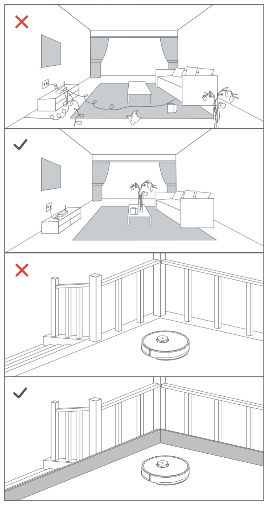
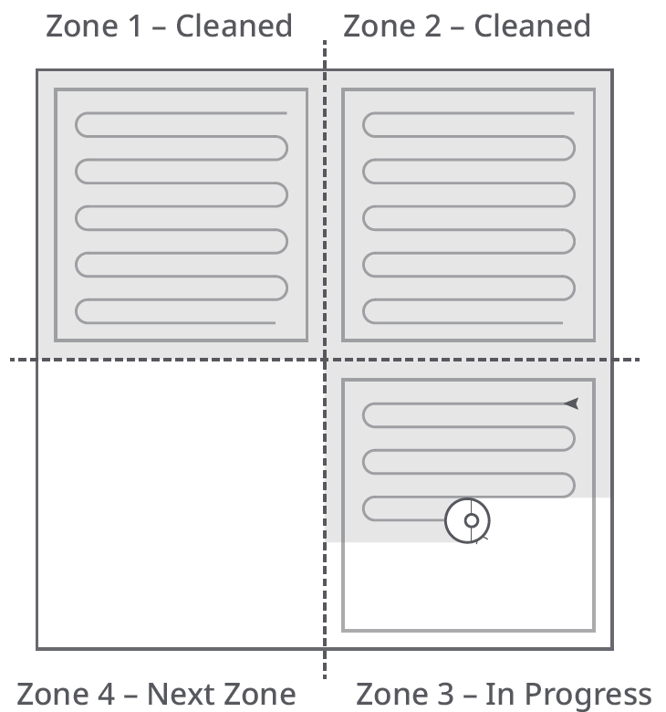

# Roborock Q8 Max. Manual de utilizare pentru aspiratorul robotic

Citiți cu atenție acest manual de utilizare cu diagrame înainte de a
folosi acest produs și păstrați-l corespunzător pentru referințe viitoare.

## Cuprins

- [Restricții](#restricții)
- [Prezentare generală a produsului](#a.-descriere)
- [Instalare](#b.-instalare)
- [Conectarea la aplicație](#conectarea-la-aplicație)
- [Instrucțiuni](#instructiuni)
- [Întreținere de rutină](#c.-întreținere-de-rutină)
- [Parametrii de bază](#parametri-de-bază)
- [Probleme comune](#probleme-comune)

## Restricții

ATENȚIE

- În scopul reîncărcării bateriei, utilizați doar unitatea de alimentare detașabilă Roborock CDZ12RR, CDZ20RR, AED06HRR sau AED07HRR furnizată cu acest produs.
- Nu utilizați acest produs pe suprafețe înalte fără bariere, cum ar fi podeaua unui pod, o terasă deschisă sau deasupra mobilierului.
- Pentru a preveni blocarea produsului și a evita deteriorarea bunurilor de valoare, îndepărtați obiectele ușoare (cum ar fi pungile de plastic) și obiectele fragile (cum ar fi vaze) de pe podea înainte de curățare.
- Nu plasați niciun obiect (inclusiv copii și animale de companie) pe produs, fie că este în funcțiune sau nu.
- Nu utilizați produsul pe obiecte care ard (cum ar fi chiștoacele de țigară).
- Nu utilizați produsul pentru a curăța obiecte dure sau ascuțite (cum ar fi deșeurile de decorare, sticlă și cuie).
- Nu utilizați modulul de mop pe covoare.
- Produsul trebuie să fie oprit și priza trebuie să fie scoasă din soclu când nu este utilizat, înainte de curățare sau întreținere.
- Dacă plasați robotul în depozitare, încărcați-l complet și opriți-l înainte de a-l pune într-un loc răcoros și uscat. Reîncărcați-l cel puțin o dată la trei luni pentru a preveni descărcarea excesivă a bateriei.

## A. Descriere

### A1. Robot (vedere de sus)

- Putere/Curăță
  - Apăsați și mențineți pentru a porni
    sau opri robotul
  - Apăsați pentru a începe curățarea
- Indicator de Putere
  - Alb: Nivel baterie ≥ 20%
  - Roșu: Nivel baterie < 20%
  - Pulsant: Încărcare sau pornire
  - Roșu intermitent: Eroare
- Lumină Indicator WiFi
  - Alb: Nivel baterie ≥ 20%
  - Roșu: Nivel baterie < 20%
  - Pulsant: Încărcare sau pornire
  - Roșu intermitent: Eroare

Curățare Punctuală/Blocare Copii

- Apăsați pentru curățare punctuală
- Apăsați și mențineți 3 secunde pentru
  a activa/dezactiva blocarea pentru copii

Bază

- Apăsați pentru a reveni la bază

Notă: Apăsați orice buton pentru a opri robotul în
timpul curățării sau al întoarcerii la bază.

A1-1
  ~ Bară de Protecție Verticală

A1-2
  ~ Senzor distanță (LiDAR)

A1-3
  ~ Senzor de Perete

A1-4
  ~ Senzor localizare bază

A1-5
  ~ Senzor de Evitare a Obstacolelor (Tehnologie Reactivă)

### A2. Robot (vedere de jos)

A2-1
  ~ Senzori de margine

A2-2
  ~ Roată Omnidirecțională

A2-3
  ~ Contacte de Încărcare

A2-4
  ~ Perie Laterală

A2-5
  ~ Perii Principale

A2-6
  ~ Capac pentru Peria Principală

A2-7
  ~ Roți Principale

### A3. Robot

A3-1
  ~ Buton de Resetare

A3-2
  ~ Ventilație

A3-3
  ~ Montare pentru laveta de mop

A3-4
  ~ Bară de protecție

### A4. Unitate Coș de Gunoi / Rezervor de Apă

A4-1
  ~ Încuietoare

A4-2
  ~ Dop

A4-3
  ~ Filtru de Apă

A4-4
  ~ Filtru de Praf (Spălabil)

### A5. Baza de încărcare

A5-1
  ~ Indicator de Putere

A5-2
  ~ Semnal de Localizare Bază

A5-3
  ~ Contacte de Încărcare

A5-4
  ~ Priză de Alimentare

A5-5
  ~ Perii cu Electrozi

### A6. Cablu de alimentare

### A7. Suport laveta de mop

A7-1
  ~ Fantă pentru Atașarea Cărpei Mop

A7-2
  ~ Zăvoare pentru Montarea Cărpei Mop

### A8. laveta de mop

A8-1
  ~ Fixare laveta de mop

### A9. Covor Rezistent la Umezeală

## B. Instalare

### Instrucțiuni Instalare

1. Adunați cablurile și obiectele mici de pe
   podea și mutați orice obiecte instabile, fragile,
   prețioase sau periculoase pentru a preveni
   vătămarea personală sau daunele materiale
   cauzate de obiecte care pot fi încurcate, lovite
   sau răsturnate de robot.
2. Când folosiți robotul într-o zonă ridicată,
   folosițiîntotdeauna o barieră fizică sigură
   pentru a preveni căderile accidentale care ar
   putea duce la vătămăripersonale sau daune
   materiale.

Notă: Când folosiți robotul pentru prima dată, urmăriți-l pe
tot parcursul rutei sale de curățare și fiți atenți la problemele
potențiale. Robotul va putea să curețe singur în utilizările viitoare.

### B1. Poziționarea Bazei de Încărcare

Păstrați Baza de Încărcare pe o suprafață
plană, lipită de un perete. Conectați cablul de
alimentare la Baza de Încărcare și adunați
cablurile de pe podea. Pentru a asigura o
experiență mai bună în folosirea
aplicației mobile, plasați Baza de Încărcare
într-o zonă cu o acoperire bună WiFi.

B1-1
  ~ Mai mult de 0.5m

B1-2
  ~ Mai mult de 1.5m

Note:

- Lăsați cel puțin 0.5m de spațiu liber pe fiecare parte și mai
  mult de 1.5m în fața bazei de încărcare.
- Dacă cablul de alimentare atârnă vertical față de sol,
  acesta poate fi prins de robot, provocând deconectarea
  bazei de încărcare.
- Indicatorul bazei de încărcare este aprins când baza de
  încărcare este electrificată și stins când robotul se încarcă.
- Nu plasați baza de încărcare în locuri expuse direct
  la lumina soarelui, nici nu blocați semnalul de localizare.
  Altfel, este posibil ca robotul să nu fie capabil să se
  întoarcă automat la baza de încărcare.

### B2. Asigurarea bazei de încărcare cu bandă adezivă

Ștergeți podeaua zonei unde va fi amplasată
baza de încărcare cu o cârpă uscată, apoi
fixați baza folosind banda dublă-adezivă de la
baza dock-ului.

Notă: Dacă e nevoie, îndepărtați banda dublu-adezivă
încet pentru a reduce reziduurile de adeziv.

### B3. Atașarea Covorului Rezistent la Umiditate

După ce ați fixat baza de încărcare, folosiți o
cârpă uscată pentru a curăța zona unde va fi
amplasat Covorul Rezistent la Umiditate.
Dezlipiți banda dublu-adezivă de la baza Covorului
Rezistent la Umiditate și lipiți-l pe podea.

Note:

- Întotdeauna plasați Covorul Rezistent la Umiditate
  pe podelele din lemn.
- Covorul Rezistent la Umiditate se atașează cel mai bine
  pe suprafețe netede.
- Când este necesar, îndepărtați banda dublu-adezivă
  încet pentru a reduce reziduurile de adeziv.

### Pornirea și încărcarea robotului

Apăsați și mențineți butonul de pornire.
Când lumina de alimentare se
aprinde, plasați robotul pe bază pentru a-l
încărca. Asigurați-vă că indicatorul de
alimentare al bazei de încărcare se stinge
și că se aude un semnal vocal de „încărcare”.
Pentru a menține performanța acumulatorului
reîncărcabil de litiu-ion, mențineți robotul
încărcat.

Notă: Dacă nivelul bateriei este scăzut, e posibil ca robotul să
nu pornească. În acest caz, plasați robotul direct pe bază pentru
a-l încărca.

### B4. Folosirea cârpei mop

Notă: Pentru a preveni acumularea excesivă de murdărie
în timpul primei utilizări, podelele ar trebui să fie
aspirate de cel puțin trei ori înainte de a fi șterse.

B4-1
  ~ Apăsați zăvorul și glisați unitatea combinată a coșului de gunoi și a rezervorului de apă înapoi.

B4-2
  ~ Umpleți rezervorul de apă

Îndepărtați dopul rezervorului de apă,
umpleți rezervorul cu apă și închideți-l bine.

Note:

- Pentru a preveni coroziunea sau daunele, folosiți doar
  detergentul de podea marca Roborock în rezervorul de apă.
- Nu folosiți apă fierbinte, deoarece aceasta poate provoca
  deformarea rezervorului.
- Când umpleți rezervorul de apă, înclinați rezervorul la 30°
  pentru a evita udarea filtrului.

B4-3
  ~ Reinstalați unitatea combinată a coșului de gunoi și a rezervorului de apă

Glisați rezervorul de apă în robot
până când auziți un clic de blocare.

B4-4
  ~ Instalați laveta de mop

Udați laveta de mop și stoarceți-o până când
nu mai picură, apoi glisați-o pe fanta pentru
laveta de mop înainte de a o lipi ferm la loc.

Notă: Folosiți doar laveta de mop oficială Roborock.

B4-5
  ~ Instalați suportul pentru laveta de mop

Glisați suportul înainte pe partea de
jos a robotului până când se fixează.

Notă: Curățați cârpa de mop după 60 de minute de ștergere
pentru a menține fluxul de apă și calitatea curățării.

B4-6
  ~ Îndepărtați suportul pentru laveta de mop

Când robotul se întoarce la stație după
curățare, apăsați încuietorile de pe
ambele părți și glisați suportul pentru
laveta de mop înapoi pentru a-l îndepărta.

Note:

- Spălați laveta de mop după fiecare
  utilizare și goliți regulat rezervorul de apă
  de apa neutilizată.
- Îndepărtați suportul
  pentru laveta de mop când nu folosiți
  mopul.

## Conectarea la aplicație

Acest robot suportă atât aplicațiile Roborock,
cât și Xiaomi Home. Alegeți-o pe cea care se
potrivește cel mai bine nevoilor
dumneavoastră.

### 1. Descărcați aplicația

Opțiunea 1:
  ~ Căutați „Roborock” în App
    Store sau Google Play sau scanați codul
    QR pentru a descărca și instala aplicația.

Opțiunea 2:
  ~ Căutați „Xiaomi Home” în App
    Store sau Google Play sau scanați codul
    QR pentru a descărca și instala aplicația.

### 2. Resetați WiFi

Apăsați și mențineți apăsate butoanele __Bază__ și __Curățare Punctuală__
până când auziți alerta vocală „Resetare
WiFi”. Resetarea este completă când
indicatorul WiFi clipește lent în albastru.
Robotul va aștepta apoi o conexiune.

__Notă:__ Dacă nu vă puteți conecta la robot din cauza
configurației routerului, a unei parole uitate sau din orice alt
motiv, resetați WiFi-ul și adăugați robotul ca un dispozitiv nou.

### 3. Adăugare dispozitiv

Deschideți aplicația Roborock, atingeți
butonul „Scanează pentru Connectare” sau butonul
„Căutați dispozitiv”, sau deschideți aplicația
Xiaomi Home, atingeți „+” în colțul din
dreapta sus și adăugați dispozitivul
conform instrucțiunilor din aplicație.

__Note:__

- Procesul efectiv poate varia din cauza
  actualizărilor continue ale aplicației. Urmați
  instrucțiunile furnizate în aplicație.
- Este suportat doar WiFi de 2.4 GHz.
- Dacă robotul așteaptă mai mult de 30 de minute
  pentru o conexiune, WiFi-ul va fi dezactivat automat.
  Dacă doriți să vă reconectați, resetați WiFi-ul înainte de a continua.

## Instructiuni

### Pornit/Oprit

Apăsați și mențineți apăsat butonul __Putere/Curăță__ pentru a
porni robotul. Indicatorul de putere se va
aprinde și robotul va intra în modul de
așteptare. Apăsați și mențineți apăsat butonul __Putere/Curăță__
pentru a opri robotul și a finaliza ciclul de
curățare.

__Notă:__ Robotul nu poate fi oprit când este în curs de încărcare.

### Începerea curățării

Apăsați butonul __Putere/Curăță__ pentru a începe
curățarea. Robotul va planifica ruta de
curățare conform propriei scanări a camerei.
Împarte o cameră în zone, mai întâi
trasează marginile zonelor și apoi umple
zona într-un model în zigzag. Astfel,
robotul curăță toate zonele una câte una,
curățând eficient casa.

__Note:__

- Pentru a permite robotului să aspire
  automat și să se întoarcă la stație, porniți robotul
  din stație. Nu mutați stația în timpul curățării.
- Curățarea nu poate începe dacă nivelul bateriei
  este prea scăzut. Permiteți robotului să se încarce
  înainte de a începe curățarea.
- Dacă curățarea se
  finalizează în mai puțin de 10 minute, zona va fi
  curățată de două ori.
- Dacă bateria se epuizează în
  timpul ciclului de curățare, robotul se va întoarce
  automat la stație. După încărcare, robotul va relua
  de unde a rămas.
- Înainte de a începe fiecare
  sarcină de ștergere, asigurați-vă că mopul a fost
  instalat corect.

### Curățare pe loc

Apăsați butonul __Curățare punctuală__ pentru a începe curățarea pe loc.

Domeniul de curățare: Robotul curăță o zonă pătrată de 1,5 m x 1,5 m centrată pe el.

__Notă:__ După curățarea pe loc, robotul se va întoarce automat la punctul de plecare și va intra în modul Standby.

### Pauză

Când robotul funcționează, apăsați orice
buton pentru a-l pune pe pauză, apăsați butonul __Putere__ pentru
a relua curățarea și apăsați butonul __Bază__ pentru
a-l trimite înapoi la stația de încărcare.

__Notă:__ Punerea manuală a robotului într-o stație de încărcare în timp ce este pe pauză va încheia curățarea curentă.

### Reumplerea rezervorului de apă sau curățarea mopului

Pentru a adăuga apă sau pentru a curăța mopul, apăsați
un buton pentru a opri robotul și scoateți
modulul de mop. După adăugarea apei
sau curățarea mopului, reinstalați
modulul de mop și apăsați butonul __Putere__
pentru a continua.

### Repaus

Dacă robotul este pe pauză pentru mai mult de 10 minute, acesta
va intra în repaus, iar indicatorul de alimentare va
clipi la câteva secunde. Apăsați orice buton
pentru a trezi robotul.

__Note:__

- Robotul nu va intra în repaus când se încarcă.
- Robotul se va opri automat dacă este lăsat în modul de repaus
  mai mult de 12 ore.

### Modul DND

Perioada implicită de "Nu deranjați" (DND) este
între 22:00 și 08:00. Puteți folosi aplicația pentru a
dezactiva modul DND sau pentru a modifica
perioada DND. Când modul DND este activat,
robotul nu va relua curățarea automat,
indicatorul de alimentare se va diminua, iar
volumul alertelor vocale va scădea.

### Blocare pentru copii

Apăsați și mențineți apăsat butonul __Curățare punctuală__ pentru a activa/
dezactiva blocarea pentru copii. De asemenea, o puteți seta în
aplicație. Odată activată, robotul nu va reacționa
la apăsarea butoanelor când este staționar. Când
robotul curăță sau andochează, apăsați un buton
pentru a-l opri.

### Încărcare

După curățare, robotul se va întoarce automat
la stația de încărcare pentru a se încărca.

În modul Pauză, apăsați butonul __Bază__ pentru a trimite
robotul la stația de încărcare. Indicatorul de alimentare
va pulsa în timp ce robotul se încarcă.

__Notă:__ Dacă robotul nu găsește stația de încărcare, se va întoarce automat
la locația de pornire. Puneți manual robotul în stația de încărcare
pentru a-l încărca.

### Eroare

Dacă apare o eroare, indicatorul de alimentare va
clipi roșu și se va auzi o alertă vocală.

__Note:__

- Robotul va intra automat în repaus dacă este lăsat
  într-o stare de defecțiune mai mult de 10 minute.
- Punerea manuală a robotului defect pe stația de încărcare va
  încheia curățarea curentă.

### Resetarea sistemului

Dacă robotul nu răspunde la apăsarea unui
buton sau nu poate fi oprit, resetați sistemul.
Apăsați clapeta pentru a scoate unitatea combinată
de praf și apă și găsiți butonul de Resetare.
Apăsați butonul de Resetare și robotul se va
reseta automat.

__Notă:__ După resetarea sistemului, curățările programate, WiFi,
etc. vor fi restaurate la setările din fabrică.

### Restaurarea setărilor din fabrică

Dacă robotul nu funcționează corect după
o resetare a sistemului, porniți-l. Apăsați și mențineți
apasat butonul __Bază__ și, în același timp, apăsați
butonul de Resetare până când auziți mesajul vocal
„Restaurarea setărilor din fabrică”.
Robotul va fi restaurat la setările din fabrică.

## C. Întreținere de rutină

### C1. Perii principale

* Curățați la fiecare 2 săptămâni și înlocuiți la fiecare 6-12 luni.

C1-1
  ~ Peria principală

C1-2
  ~ Capac perie principală

C1-3
  ~ Clape

C1-4
  ~ Rulment perie principală

C1-5
  ~ Capace perie principală

C1-6
  ~ Întoarceți robotul și apăsați
    clapele pentru a scoate capacul periei principale.

C1-7
  ~ Scoateți peria principală și extrageți
    rulmentul periei principale.

C1-8
  ~ Scoateți capacele periei principale.

C1-9
  ~ După îndepărtarea părului încurcat sau a
    murdăriei de la ambele capete ale periei
    principale, reinstalați-o și apăsați pe
    capacul periei principale pentru a o fixa în loc.

__Note:__

- Peria principală trebuie ștearsă cu o cârpă umedă și lăsată
  să se usuce departe de lumina directă a soarelui.
- Nu folosiți lichide de curățare corozive sau dezinfectanți
  pentru a curăța peria principală.

### C2. Peria laterală
* Curățați lunar și înlocuiți la fiecare 3-6 luni.

1. Deșurubați șurubul periei laterale.
2. Scoateți și curățați peria laterală.
   Reinstalați peria și strângeți șurubul.

### C3. Roata omnidirecțională
* Curățați după cum este necesar.

C3-1
  ~ Folosiți un instrument, cum ar fi o șurubelniță mică,
    pentru a scoate axul și a îndepărta roata.

__Notă:__ Suportul roții omnidirecționale nu poate fi scos.

C3-2
  ~ Clătiți roata și axul cu apă pentru
    a elimina orice păr sau murdărie.
    Uscați și reasamblați roata, apăsând
    ferm pentru a o fixa.

### C4. Roțile principale
* Curățați lunar.

Curățați roțile principale cu o cârpă moale și uscată.

### C5. Unitatea combinată de praf și rezervor de apă
* Curățați săptămânal și înlocuiți filtrul la fiecare 6-12 luni.

C5-1
  ~ Apăsați clapeta pentru a scoate unitatea.
    Scoateți filtrul lavabil și apoi
    goliți recipientul de praf.

C5-2
  ~ Goliți apa neutilizată din rezervorul de apă.

C5-3
  ~ Umpleți recipientul de praf cu apă curată și
    agitați ușor. Apoi vărsați apa murdară.

__Notă:__
Pentru a preveni blocajele, folosiți doar apă curată fără niciun
lichid de curățare.

C5-4
  ~ Clătiți filtrul în mod repetat și bateți-l pentru
    a elimina cât mai multă murdărie posibil.

__Notă:__
Nu atingeți suprafața filtrului cu mâinile,
perii sau obiecte dure pentru a evita posibilele deteriorări.

C5-5
  ~ Lăsați filtrul să se usuce complet timp de 24 de ore
    și reinstalați-l.

__Notă:__ Cumpărați un filtru suplimentar și alternați-le dacă este necesar.

### C6. Laveta de mop
* Curățați după fiecare utilizare și înlocuiți la fiecare 3-6 luni.

Scoateți laveta de mop din suportul pentru mop.
Curățați laveta de mop și lăsați-o să se usuce la aer.

__Notă:__
O lavetă murdară va afecta performanța de spălare. Curățați
înainte de utilizare.

### C7. Senzorii robotului
* Curățați lunar.

Folosiți o cârpă moale și uscată pentru a șterge și curăța toți
senzorii, inclusiv:

C7-1
  ~ Localizatorul stației de încărcare

C7-2
  ~ Senzorul de evitare a obstacolelor

C7-3
  ~ Senzorul de perete

C7-4
  ~ Senzorii de margine

### C8. Zonele de contact pentru încărcare
* Curățați lunar.

Folosiți o cârpă moale și uscată pentru a șterge contactele de încărcare
de pe stația de încărcare și robot.

### Bateria

Robotul este echipat cu un pachet de baterii
reîncărcabile litiu-ion de înaltă performanță.
Pentru a menține performanța bateriei, păstrați
robotul încărcat în timpul utilizării normale.

__Notă:__ Dacă robotul nu va fi folosit pentru o perioadă lungă, opriți-l
și încărcați-l cel puțin la fiecare trei luni pentru a evita deteriorarea
bateriei cauzată de descărcarea excesivă.

## Parametri de bază

### Robot

Model
  ~ Q80ULL

Baterie
  ~ 14.4V/5200mAh (TYP) baterie litiu-ion

Intrare nominală
  ~ 20VDC 1.2A

Timp de încărcare
  ~ < 6 ore

__Notă:__ Numărul de serie este pe un autocolant pe partea inferioară
a robotului.

### Stația de încărcare

Model
  ~ CDZ12RR sau CDZ20RR

Putere nominală
  ~ 28W

Intrare nominală
  ~ 100-240VAC

Ieșire nominală
  ~ 20VDC 1.2A

Frecvență nominală
  ~ 50-60Hz

Încărcare baterie
  ~ 14.4V/5200mAh (TYP) baterie litiu-ion

## Probleme comune

### Nu se poate porni
- Nivelul bateriei este scăzut. Puneți robotul pe
  stația de încărcare și încărcați-l înainte de utilizare.
- Temperatura bateriei este prea scăzută sau prea ridicată. Utilizați
  robotul doar în intervalul de 4-40°C.

### Nu se poate încărca

- Verificați că indicatorul de alimentare se aprinde și că
  ambele capete ale cablului de alimentare sunt conectate corespunzător.
- Dacă contactul este slab, curățați zonele de contact de pe
  stația de încărcare și robot.

### Încărcare lentă

- Când este utilizat la temperaturi ridicate sau scăzute, robotul
  își va reduce automat viteza de încărcare pentru a
  prelungi durata de viață a bateriei.
- Contactele de încărcare pot fi murdare. Ștergeți-le cu
  o cârpă uscată.

### Nu se poate andoca
- Sunt prea multe obstacole în apropierea stației de încărcare.
  Mutați-o într-o zonă deschisă.
- Robotul este prea departe de stația de încărcare. Plasați-l
  mai aproape și încercați din nou.

### Comportament anormal
- Reporniți robotul.

### Zgomot în timpul curățării

- Peria principală, peria laterală, roțile principale sau
  roata omnidirecțională pot fi blocate. Opriți
  robotul și curățați-le.

### Nu se poate conecta la WiFi
- WiFi-ul este dezactivat. Resetați WiFi-ul și încercați din nou.
- Semnalul WiFi este slab. Mutați robotul într-o zonă
  cu o recepție bună a semnalului WiFi.
- Conexiune WiFi anormală. Resetați WiFi-ul,
  descărcați cea mai recentă aplicație mobilă și încercați din nou.
- Nu se poate conecta brusc la WiFi. Este posibil să existe
  o eroare în setările routerului. Contactați
  serviciul de asistență pentru clienți Roborock pentru suport suplimentar.

### Curățare slabă sau praf care cade

- Recipientul de praf este plin și trebuie golit.
- Filtrul lavabil este blocat și trebuie curățat.
- Peria principală este blocată și trebuie curățată.

### Curățarea programată nu funcționează

- Păstrați robotul încărcat. Curățarea programată poate
  începe doar când nivelul bateriei este peste 20%.

### Consumul de energie continuă cât timp robotul este pe stația de încărcare?

- Robotul va consuma energie în timp ce este andocat
  pentru a menține performanța bateriei, dar consumul
  de energie este minim.

### Este necesar ca robotul să fie încărcat cel puțin 16 ore primele trei utilizări?

- Nu, robotul poate fi utilizat oricând după ce este
complet încărcat.

### Fără apă sau foarte puțină apă în timpul mopării

- Verificați dacă există apă în rezervor și
  folosiți aplicația mobilă pentru a seta debitul de apă sau consultați
  manualul pentru instrucțiuni complete despre cum să instalați corect
  unitatea combinată de recipient de praf și rezervor de apă, suportul pentru mop
  și laveta de mop.

### Curățarea nu se reia după reîncărcare

- Asigurați-vă că robotul nu este în modul DND. Modul DND
  va împiedica continuarea curățării. Când curățați un spațiu
  care necesită o încărcare intermediară, dacă robotul a fost pus
  manual pe stația de încărcare înainte să se întoarcă
  automat la stație, acesta nu va putea continua curățarea.

### Robotul nu poate reveni la stația de încărcare după curățarea pe loc sau după ce a fost mutat manual

- După curățarea pe loc sau o schimbare semnificativă de poziție,
  robotul va re-genera harta. Dacă stația de încărcare este prea departe,
  este posibil să nu poată reveni pentru a se reîncărca și trebuie pus manual
  pe stația de încărcare.

### Robotul începe să rateze anumite locuri

- Senzorul de perete sau senzorii de margine pot fi murdari. Ștergeți-i
  cu o cârpă moale și uscată.

### Umplerea rezervorului de apă durează mult

- Filtrul de apă poate fi blocat și trebuie curățat.
